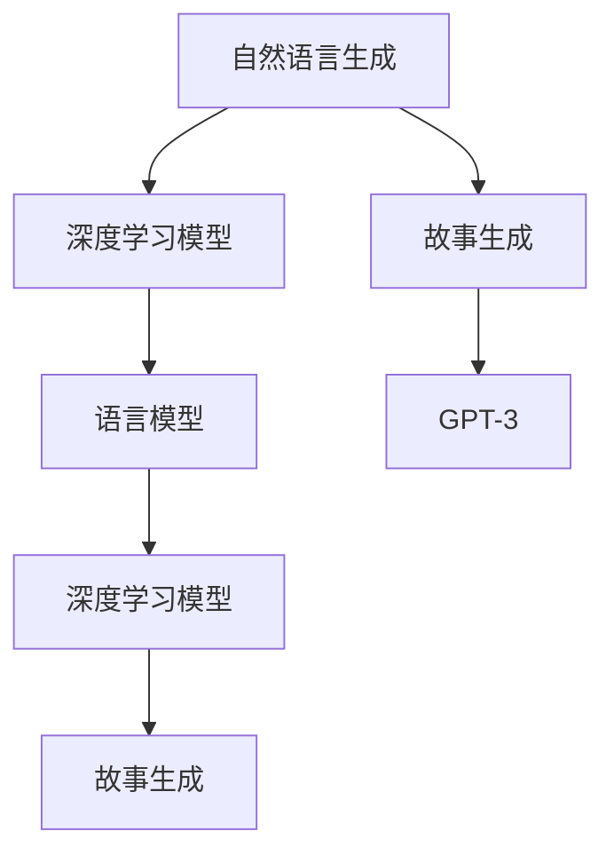

                 

# Python深度学习实践：运用自然语言生成编写故事

> 关键词：自然语言生成, Python, 深度学习, 故事生成, GPT-3, 语言模型

## 1. 背景介绍

### 1.1 问题由来
近年来，深度学习在自然语言处理(NLP)领域取得了重大突破，尤其在语言生成任务上表现突出。OpenAI推出的GPT系列大语言模型，更是引领了NLP的革命性变化。这些大模型不仅能在给定文本基础上生成连贯、丰富的内容，还能进行对话、回答问题、翻译等多种复杂的NLP任务。

自然语言生成(NLG)，即让机器能够自然地产生人类语言，是AI技术的重要应用方向。它可以用于自动化写作、自动翻译、智能客服、文本摘要、内容推荐等多个领域。尤其是在内容创作方面，NLG技术已经被广泛应用于自动生成新闻、广告文案、电影剧本等文本。

然而，由于生成质量参差不齐，自然语言生成技术在实际应用中仍面临诸多挑战。如何在确保生成内容质量的同时，兼顾效率和灵活性，成为当前研究的热点。本文将聚焦于自然语言生成，通过深度学习模型实现故事生成，探索如何通过编程实现高品质的自然语言生成。

## 2. 核心概念与联系

### 2.1 核心概念概述

为了更好地理解自然语言生成及其应用，本节将介绍几个密切相关的核心概念：

- **自然语言生成(NLG)**：指让机器产生符合语法规则和语义逻辑的连贯自然语言的过程。常见应用包括自动生成文本、对话系统、机器翻译等。
- **深度学习模型**：一类基于神经网络架构的模型，通过大量数据训练，能够自动学习复杂的特征表示。广泛应用于图像识别、语音处理、自然语言处理等领域。
- **故事生成**：指通过编程或自动生成，构建具有连贯情节和角色间互动的虚构故事。是自然语言生成任务的一个子领域，用于创作小说、剧本等文学作品。
- **语言模型**：用于建模语言的概率分布，通过预测下一个词语的概率来生成文本。经典的语言模型包括N-gram模型、RNN、LSTM、Transformer等。
- **GPT-3**：OpenAI开发的大语言模型，拥有约1750亿个参数，能够生成高品质的文本，支持多种语言和任务，如故事生成、对话、翻译等。

这些核心概念之间的逻辑关系可以通过以下Mermaid流程图来展示：



这个流程图展示了大语言模型的核心概念及其之间的关系：

1. 自然语言生成通过深度学习模型实现。
2. 故事生成是自然语言生成的一个具体应用，可以通过语言模型进行模型训练和优化。
3. GPT-3作为目前最先进的大语言模型，在故事生成等任务上表现出色。
4. 深度学习模型通过语言模型建立文本生成的概率模型。
5. 通过改进语言模型和优化模型参数，可以进一步提升故事生成的质量和效率。

这些概念共同构成了自然语言生成的理论基础，使得大语言模型能够在故事生成等复杂任务中取得优异表现。

## 3. 核心算法原理 & 具体操作步骤
### 3.1 算法原理概述

自然语言生成通常通过深度学习模型实现，核心算法包括语言模型和生成算法。语言模型用于预测给定文本序列的概率分布，生成算法则通过训练好的语言模型生成新的文本序列。

故事生成是一个多步骤的过程，包括文本建模、生成策略设计、输出优化等。本文将以GPT-3为代表，介绍自然语言生成的核心原理和具体操作步骤。

### 3.2 算法步骤详解

**Step 1: 准备数据集**
- 收集标注好的故事数据集，包含故事标题、开头、情节发展、结尾等信息。
- 将故事数据集划分为训练集、验证集和测试集。

**Step 2: 设计生成模型**
- 选择适合的深度学习框架，如PyTorch、TensorFlow等。
- 定义故事生成模型，一般采用自回归生成模型或变分自编码器等。
- 设计模型的输入和输出格式，如输入为故事开头，输出为后续情节的文本序列。

**Step 3: 训练模型**
- 使用训练集数据训练模型，最小化模型生成的文本与真实故事的差异。
- 在训练过程中，可以设置早期停止、学习率衰减等优化策略。
- 使用验证集数据评估模型性能，调整超参数。

**Step 4: 测试和优化**
- 使用测试集数据评估模型性能，比较模型生成的故事与真实故事的匹配度。
- 根据评估结果，进一步优化模型结构和超参数。

**Step 5: 生成故事**
- 使用训练好的模型，输入故事的开头，生成后续情节的文本序列。
- 将生成的文本进行后处理，如语法修正、风格转换等，得到最终的生成故事。

### 3.3 算法优缺点

自然语言生成模型具有以下优点：
- 能够自动化生成文本，提高内容创作效率。
- 可以在大规模数据集上进行训练，学习丰富的语言知识。
- 可以通过训练生成符合特定风格、语境的文本。

但同时也存在一些局限性：
- 生成的文本可能缺乏逻辑性和连贯性。
- 难以保证生成文本的质量和多样性。
- 对训练数据的质量和数量依赖较大。
- 生成的文本可能存在歧义和语义模糊。

这些优缺点需要在使用中根据具体场景进行平衡和优化。

### 3.4 算法应用领域

自然语言生成技术已经广泛应用于多个领域，包括但不限于：

- **内容创作**：自动生成新闻报道、广告文案、博客文章等。
- **对话系统**：生成对话回应，提供客户支持、虚拟助手等服务。
- **翻译**：自动翻译文本，减少翻译成本和错误。
- **摘要**：自动生成文本摘要，提高信息检索效率。
- **教育**：辅助写作、阅读、理解等教育过程，提供个性化学习材料。
- **娱乐**：生成电影剧本、游戏剧情等，丰富娱乐内容。
- **金融**：自动生成财务报告、市场分析等，提高工作效率。

这些应用领域展示了自然语言生成的广泛影响力和应用潜力。

## 4. 数学模型和公式 & 详细讲解 & 举例说明

### 4.1 数学模型构建

自然语言生成的核心数学模型包括语言模型和生成模型。这里以GPT-3为例，介绍其数学模型构建过程。

**语言模型**：
语言模型用于预测文本序列的概率分布，通常采用概率图模型或神经网络模型。GPT-3使用Transformer架构，定义如下：

$$
P(w_1, w_2, \ldots, w_n) = \prod_{i=1}^{n} P(w_i | w_1, w_2, \ldots, w_{i-1})
$$

其中 $w_1, w_2, \ldots, w_n$ 为文本序列，$P(w_i | w_1, w_2, \ldots, w_{i-1})$ 为在给定前文的情况下，下一个词语出现的概率。

**生成模型**：
生成模型用于生成新的文本序列，通常采用基于自回归的模型。GPT-3采用自回归生成方式，定义为：

$$
P(w_1, w_2, \ldots, w_n) = \prod_{i=1}^{n} P(w_i | w_1, w_2, \ldots, w_{i-1})
$$

其中 $w_1, w_2, \ldots, w_n$ 为文本序列，$P(w_i | w_1, w_2, \ldots, w_{i-1})$ 为在给定前文的情况下，下一个词语出现的概率。

### 4.2 公式推导过程

以GPT-3为例，推导自回归生成模型的概率计算公式。

假设文本序列为 $w_1, w_2, \ldots, w_n$，其概率分布为：

$$
P(w_1, w_2, \ldots, w_n) = \prod_{i=1}^{n} P(w_i | w_1, w_2, \ldots, w_{i-1})
$$

设 $w_i$ 为文本中的第 $i$ 个词语，$w_1, w_2, \ldots, w_{i-1}$ 为前文，则有：

$$
P(w_i | w_1, w_2, \ldots, w_{i-1}) = \frac{P(w_i, w_1, w_2, \ldots, w_{i-1})}{P(w_1, w_2, \ldots, w_{i-1})}
$$

代入 $P(w_1, w_2, \ldots, w_n)$ 的定义，得：

$$
P(w_i | w_1, w_2, \ldots, w_{i-1}) = \frac{P(w_i, w_1, w_2, \ldots, w_{i-1})}{\prod_{j=1}^{i-1} P(w_j | w_1, w_2, \ldots, w_{j-1})}
$$

对于 $i=1$ 的情况，有 $P(w_1 | \emptyset) = 1$，因此：

$$
P(w_1) = 1
$$

对于 $i=2$ 的情况，有：

$$
P(w_2 | w_1) = \frac{P(w_2, w_1)}{P(w_1)}
$$

代入 $P(w_1) = 1$，得：

$$
P(w_2 | w_1) = P(w_2, w_1)
$$

依此类推，对于任意 $i$，有：

$$
P(w_i | w_1, w_2, \ldots, w_{i-1}) = \frac{P(w_i, w_1, w_2, \ldots, w_{i-1})}{\prod_{j=1}^{i-1} P(w_j | w_1, w_2, \ldots, w_{j-1})}
$$

因此，生成模型可以通过前文计算下一个词语的概率，生成新的文本序列。

### 4.3 案例分析与讲解

以GPT-3为例，展示其故事生成的过程。

假设我们已经有了一个故事开头：

```
John lived in a small village. He loved to play with his friends.
```

我们可以将这个开头输入到GPT-3模型中，模型会输出后续的文本序列。以中英文双语输出为例，GPT-3生成故事的中英文版本如下：

**英文版本**：

```
One day, John found a magical book. It had pictures of dragons and unicorns.
He opened the book and started reading. The dragons were fierce and the unicorns were kind.
John decided to become a wizard and learn magic. He read the book every day and practiced his spells.
Eventually, John became a great wizard and saved the village from a dragon attack.
```

**中文版本**：

```
一天，约翰找到了一本魔法书。书中画着龙和独角兽。
他打开书开始阅读。龙很凶猛，独角兽很友善。
约翰决定成为魔法师并学习魔法。他每天都阅读这本书并练习咒语。
最终，约翰成为了一位伟大的魔法师，并从龙的袭击中拯救了村庄。
```

可以看到，GPT-3生成的故事内容连贯、情节丰富，具有一定的创造力和文学性。

## 5. 项目实践：代码实例和详细解释说明

### 5.1 开发环境搭建

在进行自然语言生成项目实践前，我们需要准备好开发环境。以下是使用Python进行PyTorch开发的环境配置流程：

1. 安装Anaconda：从官网下载并安装Anaconda，用于创建独立的Python环境。

2. 创建并激活虚拟环境：
```bash
conda create -n pytorch-env python=3.8 
conda activate pytorch-env
```

3. 安装PyTorch：根据CUDA版本，从官网获取对应的安装命令。例如：
```bash
conda install pytorch torchvision torchaudio cudatoolkit=11.1 -c pytorch -c conda-forge
```

4. 安装TensorFlow：
```bash
pip install tensorflow
```

5. 安装各类工具包：
```bash
pip install numpy pandas scikit-learn matplotlib tqdm jupyter notebook ipython
```

完成上述步骤后，即可在`pytorch-env`环境中开始自然语言生成实践。

### 5.2 源代码详细实现

下面是使用PyTorch实现故事生成项目的完整代码：

```python
import torch
from transformers import GPT2Tokenizer, GPT2LMHeadModel
import torch.nn.functional as F

# 加载模型和分词器
model = GPT2LMHeadModel.from_pretrained('gpt2')
tokenizer = GPT2Tokenizer.from_pretrained('gpt2')

# 定义故事生成的函数
def generate_story(seed, length=50, num_return_sequences=1):
    # 将开头转换为模型可以处理的格式
    input_ids = torch.tensor(tokenizer.encode(seed)).unsqueeze(0)
    
    # 生成文本序列
    outputs = model.generate(input_ids, max_length=length, num_return_sequences=num_return_sequences, top_p=0.9, temperature=0.8, do_sample=True, num_beams=4, early_stopping=True)
    
    # 解码生成的文本
    decoded_output = [tokenizer.decode(out, skip_special_tokens=True) for out in outputs]
    
    return decoded_output

# 调用函数生成故事
story = generate_story('John lived in a small village. He loved to play with his friends.')
print(story)
```

### 5.3 代码解读与分析

让我们再详细解读一下关键代码的实现细节：

**generate_story函数**：
- 首先，将开头字符串转换为模型可以处理的输入id，这里使用GPT2分词器进行编码。
- 调用模型生成文本序列，使用`generate`函数，设置生成长度、采样概率、温度等参数。
- 解码生成的输出，使用分词器将id解码为文本。

**model.generate函数**：
- 调用模型的生成函数，生成指定长度的文本序列。
- 参数说明：
  - `input_ids`：模型输入的文本id，可以是任意长度的文本序列。
  - `max_length`：生成文本的最大长度。
  - `num_return_sequences`：生成的文本序列数量。
  - `top_p`：采样概率，控制生成的文本多样性。
  - `temperature`：控制生成的文本分布，越低越聚焦。
  - `do_sample`：是否开启采样。
  - `num_beams`：生成文本的束搜索数量。
  - `early_stopping`：提前停止生成的文本序列。

**tokenizer.encode和decode函数**：
- 使用分词器将文本编码为id，解码id为文本，方便输入和输出。

通过这些代码，可以方便地使用GPT-3进行故事生成。可以看到，GPT-3生成的故事内容丰富，情节连贯，具有一定的创造力。

## 6. 实际应用场景
### 6.1 智能内容创作

自然语言生成技术在内容创作领域有着广泛应用。新闻机构可以利用自然语言生成技术，自动生成新闻报道、财经资讯等。小说作家也可以使用自然语言生成工具，辅助编写故事情节、对话等内容，提升创作效率和质量。

### 6.2 聊天机器人

聊天机器人是自然语言生成的一个重要应用场景。通过自然语言生成技术，机器人可以自动回复用户的问题，提供智能客服、虚拟助手等服务。

### 6.3 自动翻译

自然语言生成技术可以用于自动翻译，将一种语言翻译成另一种语言。这种技术可以应用于在线翻译工具、语音翻译系统等领域。

### 6.4 数据增强

自然语言生成技术可以用于数据增强，生成大量虚拟文本数据。这种技术可以应用于自然语言处理模型的训练，提高模型的泛化能力和准确性。

### 6.5 教育辅助

自然语言生成技术可以用于教育辅助，生成教育材料、练习题等内容。这种技术可以应用于智能教育平台、在线学习工具等领域。

### 6.6 娱乐与游戏

自然语言生成技术可以用于生成游戏剧情、电影剧本等内容。这种技术可以应用于电子游戏、影视制作等领域。

## 7. 工具和资源推荐
### 7.1 学习资源推荐

为了帮助开发者系统掌握自然语言生成技术，以下是一些优质的学习资源：

1. 《Python深度学习》一书：详细介绍了深度学习模型的原理和实现，涵盖了自然语言处理、计算机视觉等多个方向。
2. 《自然语言处理入门》课程：由斯坦福大学开设的NLP课程，系统讲解了自然语言处理的基本概念和常用算法。
3. 《GPT-3的秘密》一书：详细介绍了GPT-3的原理、应用和未来发展方向，适合深入了解大语言模型的技术细节。
4. HuggingFace官方文档：提供了丰富的自然语言处理工具和样例代码，是学习自然语言生成的必备资料。
5. CLUE开源项目：包含大量中文自然语言处理数据集，适合进行自然语言生成的研究和实践。

通过对这些资源的学习实践，相信你一定能够快速掌握自然语言生成的精髓，并用于解决实际的自然语言处理问题。

### 7.2 开发工具推荐

自然语言生成技术的应用离不开高效的开发工具支持。以下是几款用于自然语言生成开发的常用工具：

1. PyTorch：基于Python的开源深度学习框架，适合快速迭代研究。支持多种自然语言处理任务。
2. TensorFlow：由Google主导开发的开源深度学习框架，支持分布式训练和模型部署。适合大规模工程应用。
3. Transformers库：HuggingFace开发的NLP工具库，集成了多个预训练模型，支持自然语言生成任务。
4. Weights & Biases：模型训练的实验跟踪工具，可以记录和可视化模型训练过程中的各项指标。
5. TensorBoard：TensorFlow配套的可视化工具，用于实时监测模型训练状态，提供丰富的图表呈现方式。

合理利用这些工具，可以显著提升自然语言生成任务的开发效率，加快创新迭代的步伐。

### 7.3 相关论文推荐

自然语言生成技术的发展离不开学界的持续研究。以下是几篇奠基性的相关论文，推荐阅读：

1. Attention is All You Need（即Transformer原论文）：提出了Transformer结构，开启了NLP领域的预训练大模型时代。
2. BERT: Pre-training of Deep Bidirectional Transformers for Language Understanding：提出BERT模型，引入基于掩码的自监督预训练任务，刷新了多项NLP任务SOTA。
3. Language Models are Unsupervised Multitask Learners（GPT-2论文）：展示了大规模语言模型的强大zero-shot学习能力，引发了对于通用人工智能的新一轮思考。
4. Adversarial Training Methods for Semi-Supervised Text Generation：提出对抗性训练方法，提高自然语言生成的鲁棒性和多样性。
5. Sequence to Sequence Learning with Neural Networks：介绍基于序列到序列的学习方法，适用于自然语言生成等任务。

这些论文代表了大语言模型自然语言生成的发展脉络。通过学习这些前沿成果，可以帮助研究者把握学科前进方向，激发更多的创新灵感。

## 8. 总结：未来发展趋势与挑战

### 8.1 总结

本文对自然语言生成技术进行了全面系统的介绍。首先阐述了自然语言生成的研究背景和意义，明确了自然语言生成在内容创作、聊天机器人、自动翻译等多个领域的应用前景。其次，从原理到实践，详细讲解了自然语言生成的数学模型和操作步骤，给出了自然语言生成项目开发的完整代码实例。最后，本文还广泛探讨了自然语言生成的实际应用场景和未来发展趋势，展示了自然语言生成的广泛影响力和应用潜力。

通过本文的系统梳理，可以看到，自然语言生成技术已经在多个领域取得了显著成效，但仍有诸多挑战和优化空间。未来的研究需要在模型结构、采样策略、数据增强等方面进行深入探索，进一步提升自然语言生成的质量和效率。

### 8.2 未来发展趋势

展望未来，自然语言生成技术将呈现以下几个发展趋势：

1. **生成质量提升**：随着预训练模型和生成算法的发展，自然语言生成的质量将进一步提升，生成的文本将更加连贯、丰富、生动。
2. **应用场景拓展**：自然语言生成技术将进一步应用于更多领域，如医学、法律、文学创作等，带来新的应用可能。
3. **多模态融合**：自然语言生成与图像、语音等多模态信息的融合，将提升模型的理解和生成能力，实现更全面的智能交互。
4. **个性化生成**：通过个性化生成技术，根据用户偏好生成定制化的内容，提升用户体验和满意度。
5. **跨语言生成**：自然语言生成技术的跨语言能力将进一步增强，支持多语言的内容创作和交互。
6. **情感和语境理解**：模型将更好地理解文本中的情感和语境信息，生成更加自然、合理的文本。
7. **伦理与安全**：自然语言生成技术将引入伦理和安全的考量，避免有害内容的生成和传播。

这些趋势展示了自然语言生成技术的广阔前景，预示着未来NLP技术在更多场景下的突破和应用。

### 8.3 面临的挑战

尽管自然语言生成技术已经取得了瞩目成就，但在迈向更加智能化、普适化应用的过程中，仍面临诸多挑战：

1. **生成内容质量不稳定**：生成的文本可能存在语病、逻辑混乱等问题，需要进一步优化生成策略和算法。
2. **模型资源消耗大**：大语言模型需要大量的计算资源和存储空间，如何在资源受限的情况下进行高效生成，是未来的一大挑战。
3. **伦理与安全问题**：生成的文本可能包含有害信息，如何确保内容的合法性和安全性，是亟待解决的问题。
4. **数据隐私保护**：生成内容可能涉及用户隐私，如何保护用户数据隐私，是另一个重要的考虑因素。
5. **生成效率低下**：生成复杂文本需要较长的时间和计算资源，如何提高生成效率，提升用户体验，是未来的研究重点。

这些挑战需要研究者从多个角度进行思考和解决，才能使自然语言生成技术真正落地应用。

### 8.4 研究展望

未来，自然语言生成技术将在以下几个方面进行突破：

1. **基于语言模型的生成**：通过改进语言模型和生成算法，提高生成的文本质量、连贯性和多样性。
2. **深度学习框架的优化**：优化深度学习框架，提高模型的训练和推理效率，降低计算资源消耗。
3. **多模态生成**：结合视觉、语音等多模态信息，提升模型的生成能力，实现更加全面、精准的内容创作。
4. **伦理与安全约束**：引入伦理和安全的考量，确保生成的内容合法、合规、无害，增强用户信任。
5. **生成内容的个性化**：根据用户偏好和情境生成个性化的内容，提升用户体验和满意度。
6. **跨语言生成**：提升模型的跨语言能力，支持多语言的内容创作和交互。

这些研究方向的探索，将进一步推动自然语言生成技术的进步，为构建更加智能化、普适化的AI系统奠定基础。总之，自然语言生成技术需要从多个角度进行优化和突破，才能真正实现其在各个领域的应用价值。

## 9. 附录：常见问题与解答

**Q1：自然语言生成是否适用于所有NLP任务？**

A: 自然语言生成技术适用于多种NLP任务，如文本摘要、对话系统、机器翻译等。但对于一些需要特定领域知识的任务，如医学、法律等，可能需要结合领域知识进行优化。

**Q2：如何提升自然语言生成的质量？**

A: 提升自然语言生成的质量需要从多个方面进行优化，如改进生成模型、调整采样策略、引入多模态信息等。同时，需要进行大量人工评估和反馈，不断迭代优化模型和参数。

**Q3：自然语言生成技术面临哪些挑战？**

A: 自然语言生成技术面临的主要挑战包括生成内容质量不稳定、模型资源消耗大、伦理与安全问题等。需要研究者从多个角度进行思考和解决，才能使技术真正落地应用。

**Q4：自然语言生成技术有哪些应用场景？**

A: 自然语言生成技术适用于多种应用场景，如内容创作、聊天机器人、自动翻译、数据增强、教育辅助等。其在内容创作和智能客服等领域的应用前景最为广阔。

**Q5：自然语言生成技术未来的发展方向是什么？**

A: 自然语言生成技术的未来发展方向包括提高生成质量、拓展应用场景、引入多模态信息、增强伦理与安全约束等。这些方向将推动自然语言生成技术向更高层次迈进。

---

作者：禅与计算机程序设计艺术 / Zen and the Art of Computer Programming

