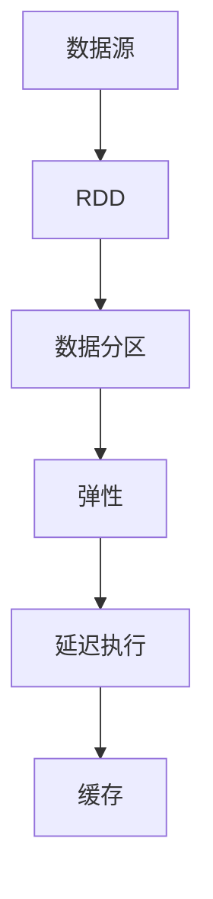

                 

# RDD原理与代码实例讲解

## 1. 背景介绍

### 1.1 问题由来

随着大数据技术的发展，处理大规模、复杂的数据集变得越来越普遍。传统的基于磁盘的批处理方式在数据量激增的情况下，已经无法满足高效、可扩展的数据处理需求。分布式计算框架应运而生，其中Apache Hadoop是早期的经典代表，但在面对海量数据处理时，仍存在处理速度慢、编程复杂等问题。

Spark作为新一代的分布式计算框架，利用内存计算的优化，大幅提升了数据处理的效率，同时也提供了更高的可扩展性。Spark的RDD（Resilient Distributed Dataset）API是Spark的核心，用于高效、灵活地处理大规模数据集。

### 1.2 问题核心关键点

RDD作为Spark中核心的数据结构，其原理和使用方法直接关系到数据处理的效率和可靠性。本节将从RDD的基本概念、原理、设计哲学出发，详细介绍RDD的原理与代码实例，帮助读者理解和掌握RDD的应用。

## 2. 核心概念与联系

### 2.1 核心概念概述

为更好地理解RDD的原理与代码实例，本节将介绍几个密切相关的核心概念：

- RDD（Resilient Distributed Dataset）：Spark中的核心数据结构，是分布式并行处理的基础。RDD是一个可并行计算的数据集合，可以在不同节点上并行处理，每个节点上的数据可进行多次计算和修改。

- 数据分区（Partition）：RDD的一个分区即一个数据块，通常存储在一个节点上。数据分区是并行计算的单位，在RDD内部通过分区来减少数据传输和并行计算的粒度，提升处理效率。

- 弹性（Resilience）：RDD的弹性指数据容错的特性，即使某个节点故障，Spark也能自动重分布数据并重新计算，确保RDD的数据完整性和计算连续性。

- 延迟执行（Lazy Evaluation）：RDD的操作结果只有在最终触发计算时才被实际执行。这种方式延迟了操作，只在需要时计算，减少了资源的浪费。

- 缓存（Caching）：RDD操作结果可以缓存到内存中，以便后续操作快速读取。Spark默认将操作结果缓存到内存中，以提升数据处理的效率。

这些核心概念之间的逻辑关系可以通过以下Mermaid流程图来展示：



这个流程图展示了RDD的基本概念和逻辑关系：

1. 数据源可以是任何形式的数据集，通过RDD封装，成为分布式可计算的数据结构。
2. RDD通过数据分区实现并行计算，提升效率。
3. 通过弹性机制实现数据容错，提升数据处理的可靠性。
4. 延迟执行机制减少资源浪费，提升效率。
5. 缓存机制提升数据读取速度，进一步优化处理效率。

这些概念共同构成了RDD的核心原理，使得Spark能够高效、可靠地处理大规模数据集。通过理解这些核心概念，我们可以更好地把握RDD的精髓，进一步深入学习其代码实现。

## 3. 核心算法原理 & 具体操作步骤

### 3.1 算法原理概述

RDD的算法原理主要基于延迟执行和弹性设计。通过延迟执行机制，Spark可以最大限度地减少计算资源的浪费，提升效率。弹性机制则确保了数据处理过程的连续性和容错性，使RDD在分布式环境中具有极高的可靠性。

RDD的核心操作分为转换操作(Transformation)和动作操作(Action)。转换操作是延迟执行的，只有当执行动作操作时，才会触发计算。常见的转换操作包括map、filter、groupByKey等，常见的动作操作包括collect、count、saveAsTextFile等。

### 3.2 算法步骤详解

RDD的算法步骤可以分为以下几个关键步骤：

**Step 1: 创建RDD**

创建RDD的第一步是将数据源转换为RDD。数据源可以是任何形式的数据集，如数组、列表、文件系统中的文件、Hadoop分布式文件系统等。Spark提供了丰富的API，将不同形式的数据集转换为RDD，方便进行分布式计算。

**Step 2: 数据分区**

RDD内部的数据是分区的，每个分区存储在一个节点上。Spark通过哈希函数对数据进行分区，使得同一分区内的数据能够在同一节点上并行计算。

**Step 3: 转换操作**

RDD的转换操作主要包括map、filter、reduceByKey、groupByKey等。这些操作是延迟执行的，只有当执行动作操作时，才会触发计算。

**Step 4: 动作操作**

RDD的动作操作主要包括collect、count、saveAsTextFile、join等。这些操作会触发计算，并返回计算结果。动作操作的结果通常需要落盘，以便后续使用。

**Step 5: 数据缓存**

Spark默认将RDD操作的结果缓存到内存中，以便后续操作快速读取。可以通过缓存方法cache或persist来控制缓存的数据量，以及缓存的时间。

### 3.3 算法优缺点

RDD作为Spark的核心数据结构，具有以下优点：

- 高效性：通过延迟执行和数据分区，RDD能够最大限度地减少数据传输和计算开销，提升处理效率。
- 弹性：弹性机制确保了数据处理的连续性和容错性，使RDD在分布式环境中具有极高的可靠性。
- 延迟执行：延迟执行机制减少资源浪费，提升效率。
- 易于并行计算：通过数据分区，RDD能够实现大规模数据的并行计算。

同时，RDD也存在以下局限性：

- 延迟计算：虽然延迟计算减少了资源浪费，但也可能影响实时性的处理，不适合对实时性要求极高的场景。
- 内存占用：RDD操作结果默认缓存到内存中，对于大规模数据集，可能会占用大量内存，导致内存溢出。
- 操作复杂：RDD的转换和动作操作需要精心设计，否则可能导致程序出错或性能下降。

尽管存在这些局限性，但RDD仍然是处理大规模数据集的首选，具有显著的效率和可靠性优势。

### 3.4 算法应用领域

RDD在Spark中广泛应用，适用于各种大规模数据处理场景，例如：

- 批处理：处理大规模的历史数据，如日志分析、报表生成等。
- 实时处理：处理流式数据，如实时监控、实时分析等。
- 机器学习：处理大规模训练数据，如模型训练、特征工程等。
- 图处理：处理大规模的图数据，如社交网络分析、推荐系统等。
- 分布式计算：处理任意形式的数据，如Hadoop兼容数据、NoSQL数据库数据等。

## 4. 数学模型和公式 & 详细讲解  
### 4.1 数学模型构建

RDD的数学模型构建基于延迟执行和弹性设计。设数据源为$D$，RDD为$R$。RDD的转换操作和动作操作可以表示为如下形式：

$$
R = \lambda(D) = \{ \text{map}, \text{filter}, \text{reduceByKey}, \text{join} \} \times \{ \text{collect}, \text{count}, \text{saveAsTextFile} \}
$$

其中，$\lambda$为操作函数，表示RDD的操作集合。每个操作函数包括转换操作和动作操作，分别对应延迟执行和最终计算。

### 4.2 公式推导过程

以下我们以map操作为例，推导RDD的计算过程。

设原始数据集$D=\{d_1, d_2, \dots, d_n\}$，其中$d_i$表示数据源中的每个元素。对每个元素进行map操作$f$后，生成新的数据集$R=\{f(d_1), f(d_2), \dots, f(d_n)\}$。

具体推导过程如下：

1. 定义map操作函数$f$，表示对每个元素$d_i$进行映射操作。

$$
f: d_i \rightarrow f(d_i)
$$

2. 将原始数据集$D$转化为RDD，并对每个元素进行map操作$f$，生成新的RDD$R$。

$$
R = \text{map}(D) = \{f(d_1), f(d_2), \dots, f(d_n)\}
$$

3. 通过延迟执行机制，RDD的操作结果只有在执行动作操作时才被实际计算。因此，map操作的结果为$R$，但实际执行动作操作时，才会触发计算，生成最终的计算结果。

$$
\text{map}(D) = \{f(d_1), f(d_2), \dots, f(d_n)\}
$$

$$
\text{map}(D) = f(D)
$$

4. 最终，通过执行动作操作，将RDD$R$转换为最终的结果。

$$
\text{collect}(R) = \{f(d_1), f(d_2), \dots, f(d_n)\}
$$

通过map操作的推导，可以看出RDD的延迟执行和弹性机制，以及在最终执行动作操作时才触发计算的特点。

### 4.3 案例分析与讲解

假设我们需要对一个文本文件进行处理，统计每个单词的出现次数。具体步骤如下：

1. 将文本文件转化为RDD$R$。

```python
from pyspark import SparkContext
from pyspark.rdd import RDD

sc = SparkContext()
text_file = sc.textFile("path/to/text/file")
word_rdd = text_file.flatMap(lambda line: line.split(" "))
```

2. 对每个单词进行map操作，生成新的RDD$R$，每个单词对应其出现的次数。

```python
word_count_rdd = word_rdd.map(lambda word: (word, 1))
```

3. 通过reduceByKey操作，将每个单词出现的次数进行累加，生成新的RDD$R$。

```python
word_count_rdd = word_count_rdd.reduceByKey(lambda a, b: a + b)
```

4. 最终，通过collect动作操作，将RDD$R$转换为最终的结果。

```python
word_count = word_count_rdd.collect()
print(word_count)
```

通过上述代码实现，可以看到RDD的操作过程，包括数据源创建、数据分区、转换操作、动作操作、数据缓存等，以及RDD的延迟执行和弹性机制。

## 5. 项目实践：代码实例和详细解释说明

### 5.1 开发环境搭建

在进行RDD项目实践前，我们需要准备好开发环境。以下是使用PySpark进行RDD开发的环境配置流程：

1. 安装Anaconda：从官网下载并安装Anaconda，用于创建独立的Python环境。

2. 创建并激活虚拟环境：
```bash
conda create -n spark-env python=3.8 
conda activate spark-env
```

3. 安装Spark：根据系统平台，从官网获取对应的安装命令。例如：
```bash
conda install pyarrow conda-forge/spark
```

4. 安装pyspark：
```bash
pip install pyspark
```

5. 安装各类工具包：
```bash
pip install numpy pandas scikit-learn matplotlib tqdm jupyter notebook ipython
```

完成上述步骤后，即可在`spark-env`环境中开始RDD的实践。

### 5.2 源代码详细实现

下面我们以文本分类为例，给出使用PySpark进行RDD操作的完整代码实现。

首先，定义数据处理函数：

```python
from pyspark import SparkContext
from pyspark.rdd import RDD
from pyspark.mllib.linalg import Vectors

sc = SparkContext()

def tokenize(line):
    words = line.split(" ")
    return [w for w in words]

def parse(line):
    words = tokenize(line)
    return (Vectors.dense(words), "positive" if line.endswith("positive") else "negative")

def parse_and_tokenize(line):
    words = tokenize(line)
    return (Vectors.dense(words), "positive" if line.endswith("positive") else "negative")

data = sc.textFile("path/to/text/file")
parsed_rdd = data.map(parse)
tokenized_rdd = parsed_rdd.map(parse_and_tokenize)
```

然后，进行特征向量的构建和模型训练：

```python
from pyspark.mllib.linalg import Vectors
from pyspark.mllib.regression import LabeledPoint
from pyspark.mllib.regression import LinearRegressionWithSGD

features = tokenized_rdd.map(lambda (words, label): (Vectors.dense(words), label))
training_data = features.map(lambda (features, label): LabeledPoint(label, features))
model = LinearRegressionWithSGD.train(training_data, iterations=10, regParam=0.3, l2RegParam=0.3)

test_data = sc.textFile("path/to/test/data/file")
test_rdd = test_data.map(parse)
test_features = test_rdd.map(lambda (words, label): (Vectors.dense(words), label))
predictions = model.predict(test_features)
```

最后，输出测试结果：

```python
from pyspark.mllib.evaluation import RegressionMetrics

metrics = RegressionMetrics(predictions)
print("R-squared: %f" % metrics.r2)
print("MSE: %f" % metrics.meanSquaredError)
```

以上就是使用PySpark进行文本分类任务的RDD实现，包括了数据源创建、数据分区、转换操作、动作操作等。

### 5.3 代码解读与分析

让我们再详细解读一下关键代码的实现细节：

**数据处理函数**：
- `tokenize`函数：将输入文本按照空格进行分割，生成单词列表。
- `parse`函数：将单词列表转换为向量，并根据文本末尾的标签生成"positive"或"negative"。
- `parse_and_tokenize`函数：将文本按照空格进行分割，生成单词列表，并转换为向量，并根据文本末尾的标签生成"positive"或"negative"。

**特征向量构建**：
- `features`函数：将单词列表转换为向量，并将文本和标签作为键值对，用于后续的特征向量和模型训练。
- `training_data`函数：将特征向量和标签作为LabeledPoint对象，用于训练模型。

**模型训练**：
- `LinearRegressionWithSGD.train`函数：使用随机梯度下降法训练线性回归模型，参数包括迭代次数、正则化系数等。

**测试和评估**：
- `test_data`函数：加载测试数据，并转换为RDD。
- `test_features`函数：将测试文本转换为向量，并根据文本末尾的标签生成键值对，用于后续的模型预测。
- `predictions`函数：使用训练好的模型预测测试数据的分类结果。
- `RegressionMetrics`函数：计算模型的回归指标，包括R-squared和MSE等。

可以看到，通过PySpark的RDD API，我们能够高效地进行大规模数据处理和机器学习模型训练。RDD的延迟执行和弹性机制，使得数据处理和模型训练更加灵活和高效。

## 6. 实际应用场景

### 6.1 金融风险控制

金融行业需要实时监测市场舆情，评估风险，并及时采取应对措施。RDD的应用可以有效处理大规模的金融数据，快速评估风险。

具体而言，RDD可以用于：

- 实时处理金融市场数据，如股票价格、交易量等。
- 实时计算市场波动和风险指标，如VaR（Value at Risk）、ES（Expected Shortfall）等。
- 实时监控市场舆情，识别异常情况，及时发出警报。

RDD的延迟执行和弹性机制，使得金融风险控制能够高效、实时地进行。

### 6.2 电子商务推荐系统

电子商务平台需要根据用户的历史行为和浏览记录，推荐用户可能感兴趣的商品。RDD的应用可以有效处理大规模用户数据，快速推荐商品。

具体而言，RDD可以用于：

- 实时处理用户行为数据，如浏览记录、购买记录等。
- 实时计算用户行为特征，如兴趣偏好、购买历史等。
- 实时推荐商品，根据用户行为特征进行匹配推荐。

RDD的延迟执行和弹性机制，使得推荐系统能够高效、实时地进行。

### 6.3 社交媒体情感分析

社交媒体平台需要实时分析用户情感，评估用户满意度，以便及时调整产品和服务。RDD的应用可以有效处理大规模的社交媒体数据，快速分析情感。

具体而言，RDD可以用于：

- 实时处理社交媒体数据，如用户评论、帖子等。
- 实时计算用户情感，如正面情感、负面情感等。
- 实时监控用户情感，识别异常情况，及时发出警报。

RDD的延迟执行和弹性机制，使得社交媒体情感分析能够高效、实时地进行。

### 6.4 未来应用展望

随着RDD的不断演进，其应用领域将不断扩展。未来RDD将在更多领域得到应用，为各行各业带来变革性影响。

在智慧城市领域，RDD可以用于：

- 实时处理城市数据，如交通流量、环境数据等。
- 实时计算城市指标，如交通拥堵、空气质量等。
- 实时监控城市状态，识别异常情况，及时发出警报。

在医疗领域，RDD可以用于：

- 实时处理医疗数据，如病人记录、实验室数据等。
- 实时计算健康指标，如病情进展、治疗效果等。
- 实时监控病人状态，识别异常情况，及时发出警报。

未来RDD将在更多领域得到应用，为各行各业带来变革性影响。

## 7. 工具和资源推荐

### 7.1 学习资源推荐

为了帮助开发者系统掌握RDD的理论基础和实践技巧，这里推荐一些优质的学习资源：

1.《RDD设计与实现原理》系列博文：由RDD核心开发者撰写，深入浅出地介绍了RDD的设计原理和实现细节，是学习RDD的基础。

2. CS446《分布式数据管理系统》课程：斯坦福大学开设的分布式数据管理经典课程，有Lecture视频和配套作业，带你入门分布式计算的基本概念和RDD的实现。

3. 《RDD from Scratch》书籍：本书详细介绍了RDD的实现原理和优化策略，是深入学习RDD的必读之作。

4. Apache Spark官方文档：Apache Spark的官方文档，提供了RDD的详细API和样例代码，是学习RDD的官方资料。

5. Spark SQL and DataFrames Cookbook：该书介绍了Spark SQL和DataFrame的使用方法，结合RDD的API，能够进行更高效的数据处理。

通过对这些资源的学习实践，相信你一定能够快速掌握RDD的精髓，并用于解决实际的分布式计算问题。

### 7.2 开发工具推荐

高效的开发离不开优秀的工具支持。以下是几款用于RDD开发的工具：

1. PySpark：基于Python的Spark接口，提供了RDD的API，方便进行分布式计算。

2. JavaSpark：基于Java的Spark接口，提供了RDD的API，方便进行分布式计算。

3. Apache Spark Streaming：Spark的流式处理引擎，能够实时处理流数据，支持RDD的操作。

4. Spark UI：Spark的可视化界面，能够实时监控RDD的操作过程，方便调试和优化。

5. Apache Spark Job Scheduler：Spark的任务调度器，能够高效管理任务，保证RDD操作的正确性和效率。

合理利用这些工具，可以显著提升RDD的开发效率，加快创新迭代的步伐。

### 7.3 相关论文推荐

RDD作为Spark的核心数据结构，其发展源于学界的持续研究。以下是几篇奠基性的相关论文，推荐阅读：

1. Resilient Distributed Datasets: A Fault-Tolerant Abstraction for In-Memory Cluster Computing：介绍RDD的设计思想和实现原理，是RDD的核心论文。

2. Towards a Resilient Distributed Datasets Architecture：进一步完善RDD的设计思想，提出弹性、延迟执行等重要特性。

3. RDD: Dataset for the Spark Core：详细介绍RDD的API和用法，是学习RDD的入门读物。

4. RDD: Resilient Distributed Datasets with Fault Tolerance for Java and Python：介绍Java和Python版本的RDD实现，是RDD的跨语言实现。

5. Scaling Spark with Resilient Distributed Datasets：介绍Spark的扩展性，利用RDD实现大规模数据处理。

这些论文代表了大规模数据处理和分布式计算的发展脉络，深入理解这些前沿成果，可以帮助研究者把握学科前进方向，激发更多的创新灵感。

## 8. 总结：未来发展趋势与挑战

### 8.1 总结

本文对RDD的基本概念、原理和代码实现进行了全面系统的介绍。首先阐述了RDD的基本概念和设计思想，明确了RDD在分布式计算中的核心地位。其次，从RDD的基本原理、操作过程出发，详细讲解了RDD的实现细节，给出了RDD代码实现的完整实例。同时，本文还广泛探讨了RDD在金融、电商、社交媒体等众多领域的应用前景，展示了RDD的巨大潜力。

通过本文的系统梳理，可以看到，RDD作为Spark的核心数据结构，能够高效、可靠地处理大规模数据集，适用于各种大规模数据处理场景。RDD的延迟执行和弹性机制，使得其在分布式环境中具有极高的可靠性和效率。

### 8.2 未来发展趋势

展望未来，RDD将呈现以下几个发展趋势：

1. 内存计算的普及：内存计算的优势在于速度和效率，未来内存计算将逐步取代磁盘计算，成为主流的计算方式。RDD作为内存计算的重要实现，将得到更广泛的应用。

2. 分布式计算框架的融合：未来分布式计算框架将不断融合，如Spark、Flink等，RDD作为其中的核心组件，也将得到更广泛的融合和优化。

3. 实时计算的支持：未来分布式计算框架将更加注重实时计算的支持，RDD的延迟执行机制也需要进一步优化，以支持实时数据处理。

4. 机器学习的结合：未来分布式计算框架将更加注重机器学习的支持，RDD将结合机器学习模型，提供更加高效的数据处理和模型训练。

5. 数据处理的灵活性：未来分布式计算框架将更加注重数据的灵活处理，RDD的操作过程也需要进一步优化，以支持更多的数据处理场景。

这些趋势凸显了RDD在分布式计算中的重要地位，未来的研究需要在各个方面进行深入优化和创新。

### 8.3 面临的挑战

尽管RDD已经取得了显著的成就，但在迈向更加智能化、普适化应用的过程中，它仍面临诸多挑战：

1. 数据传输瓶颈：尽管RDD通过数据分区实现并行计算，但数据传输仍然是瓶颈，特别是在大数据传输情况下。如何进一步优化数据传输机制，减少传输开销，是未来需要解决的重要问题。

2. 内存管理问题：RDD的操作结果默认缓存到内存中，对于大规模数据集，可能会占用大量内存，导致内存溢出。如何优化内存管理机制，是未来需要解决的重要问题。

3. 操作复杂性：RDD的操作过程需要精心设计，否则可能导致程序出错或性能下降。如何简化RDD的操作过程，降低开发难度，是未来需要解决的重要问题。

4. 并发控制问题：RDD的弹性机制需要并发控制，避免多个任务同时修改同一个数据块，导致数据一致性问题。如何优化并发控制机制，是未来需要解决的重要问题。

5. 性能调优问题：RDD的性能调优需要更加灵活的优化策略，以适应不同应用场景的需求。如何优化RDD的性能，提升处理效率，是未来需要解决的重要问题。

这些挑战需要研究者不断探索和优化，以确保RDD在未来能够继续发挥其重要地位。

### 8.4 研究展望

面对RDD面临的诸多挑战，未来的研究需要在以下几个方面寻求新的突破：

1. 内存优化：进一步优化内存管理机制，提升内存使用效率，减少内存溢出风险。

2. 数据传输优化：进一步优化数据传输机制，减少传输开销，提高数据处理效率。

3. 操作简化：简化RDD的操作过程，降低开发难度，提升开发效率。

4. 并发控制优化：优化并发控制机制，提高数据一致性，提升RDD的可靠性。

5. 性能调优：优化RDD的性能调优策略，适应不同应用场景的需求，提升处理效率。

这些研究方向的探索，必将引领RDD的不断优化和进步，为大规模数据处理提供更加高效、可靠的数据处理方案。

## 9. 附录：常见问题与解答

**Q1：RDD和DataFrame有什么区别？**

A: RDD和DataFrame都是Spark中的核心数据结构，但两者有不同的设计思路和适用场景。

- RDD是基于延迟执行和弹性设计的分布式数据结构，适用于大规模数据的处理和并行计算。
- DataFrame是基于关系型数据库设计的内存计算结构，适用于大规模结构化数据的处理和分析。

RDD适用于大规模数据的处理和并行计算，适合处理任意形式的数据。而DataFrame适用于大规模结构化数据的处理和分析，适合处理有固定结构的数据。

**Q2：RDD的弹性机制是如何实现的？**

A: RDD的弹性机制通过数据容错和重新计算实现。当一个节点故障时，Spark会自动重新分配数据，并重新计算故障节点的数据块，确保数据的完整性和计算的连续性。

具体来说，RDD的弹性机制包括以下步骤：

1. 数据分区：将数据按照哈希函数进行分区，每个分区存储在一个节点上。

2. 数据备份：每个节点上都会备份一份数据，防止数据丢失。

3. 节点故障处理：当一个节点故障时，Spark会自动重新分配数据，并重新计算故障节点的数据块。

4. 数据一致性检查：通过检查数据的一致性，确保数据的完整性和计算的连续性。

通过这些机制，RDD能够实现数据的弹性存储和高效计算。

**Q3：RDD的操作过程中如何避免数据冗余？**

A: 在RDD的操作过程中，为了避免数据冗余，可以采用以下方法：

1. 合并操作：将多个数据块合并为一个数据块，减少数据冗余。

2. 数据压缩：对数据进行压缩，减少存储空间。

3. 数据缓存：将RDD操作结果缓存到内存中，减少数据传输开销。

4. 数据过滤：在数据分区前进行数据过滤，减少数据量。

5. 数据分块：将数据分块，每个数据块的大小相等，方便并行计算。

通过这些方法，可以在RDD的操作过程中避免数据冗余，提升处理效率。

**Q4：RDD的延迟执行机制是如何实现的？**

A: RDD的延迟执行机制通过操作结果的延迟计算实现。每个RDD操作都有一个操作结果，但只有当执行动作操作时，才会触发计算，生成最终结果。

具体来说，RDD的延迟执行机制包括以下步骤：

1. 延迟计算：每个RDD操作的操作结果都是延迟计算的，只有当执行动作操作时，才会触发计算。

2. 操作链：RDD的操作结果可以链式组合，形成操作链。

3. 计算触发：当执行动作操作时，才会触发计算，生成最终结果。

4. 结果缓存：操作结果可以缓存到内存中，以便后续操作快速读取。

通过这些机制，RDD能够实现延迟执行，最大限度地减少计算资源的浪费，提升效率。

---

作者：禅与计算机程序设计艺术 / Zen and the Art of Computer Programming

