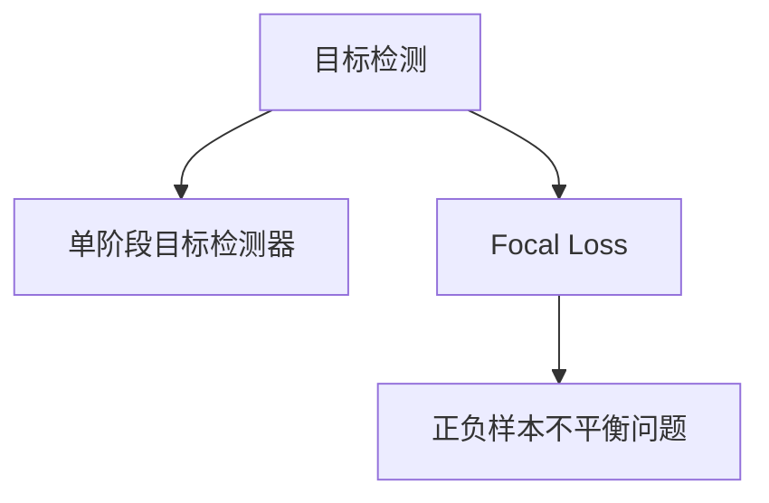

                 

## 1. 背景介绍

### 1.1 问题由来

目标检测（Object Detection）是计算机视觉领域的一项重要任务，旨在识别并定位图像或视频中的物体。传统的目标检测方法通常依赖于手工设计的特征提取器，存在诸多局限性，如计算复杂度高、可解释性差等。近年来，深度学习的发展极大推动了目标检测技术的进步，其中单阶段目标检测器（Single-shot Detectors）因其速度与精度兼具，成为了主流研究方向。

在单阶段目标检测器中，著名的Faster R-CNN、YOLO等算法虽然取得了不错的效果，但仍存在一定的不足。例如，Faster R-CNN需要基于候选框的RPN（Region Proposal Network），增加了额外的计算复杂度和推理时间；YOLO在保证速度的同时，牺牲了一定的精度。因此，如何设计一款高效且精确的单阶段目标检测器成为了一大研究热点。

### 1.2 问题核心关键点

为了解决以上问题，Focal Loss、RetinaNet等方法应运而生。特别是RetinaNet，不仅具备单阶段检测器的优势，还具有准确率高、计算速度快、可解释性强等特性。本文将重点讲解RetinaNet的原理与实现，并通过代码实例详细演示其工作流程。

### 1.3 问题研究意义

RetinaNet通过改进单阶段目标检测的框架，提出了focal loss、正负样本不平衡问题处理等方法，有效地提升了目标检测的精度与效率。其研究意义在于：

1. 降低检测时间：RetinaNet采用了单阶段检测框架，避免使用候选框，减少了计算复杂度，提升了检测速度。
2. 提升检测精度：focal loss等损失函数的应用，能够有效处理正负样本不平衡问题，显著提升了目标检测的准确率。
3. 增强可解释性：RetinaNet的检测过程更加直观，便于理解模型的决策过程，提高了模型的可解释性。
4. 促进深度学习在目标检测中的应用：RetinaNet的成功案例为其他单阶段检测器提供了参考，促进了深度学习在计算机视觉领域的应用。

## 2. 核心概念与联系

### 2.1 核心概念概述

为更好地理解RetinaNet的原理与实现，本节将介绍几个密切相关的核心概念：

- 目标检测（Object Detection）：计算机视觉中的一个重要任务，旨在识别图像中的物体并标注其位置。
- 单阶段目标检测器（Single-shot Detectors）：无需手工设计特征提取器，通过直接回归目标的类别和位置，实现高效的目标检测。
- Focal Loss：一种用于处理正负样本不平衡问题的损失函数，可以有效提升模型对于难样本的训练效果。
- 正负样本不平衡（Class Imbalance）：目标检测中常见的现象，即正样本数量远大于负样本，影响模型的训练和预测效果。

这些概念之间的逻辑关系可以通过以下Mermaid流程图来展示：



这个流程图展示了一个从目标检测到单阶段检测器，再到focal loss和正负样本不平衡处理的技术流程。

## 3. 核心算法原理 & 具体操作步骤
### 3.1 算法原理概述

RetinaNet是一种基于深度学习框架的单阶段目标检测器，其核心思想是：将目标检测转化为回归问题，直接预测目标的类别概率和位置坐标。RetinaNet通过引入focal loss，解决了正负样本不平衡问题，提高了检测精度。

具体来说，RetinaNet主要分为两个部分：

1. 特征提取：通过卷积神经网络（CNN）提取图像特征，通常使用ResNet等深度网络作为特征提取器。
2. 预测与解码：将提取的特征图作为输入，通过一系列卷积层和反卷积层预测目标的类别概率和位置坐标，最后通过非极大值抑制（NMS）进行目标解码。

### 3.2 算法步骤详解

#### 3.2.1 特征提取

RetinaNet采用了ResNet作为特征提取器，可以有效提取图像特征。以下是一个典型的ResNet结构：

```mermaid
graph LR
    Subgraph 特征提取
    A1[卷积层] --| (3x3, stride=1, padding=1) --> B1
    B1 --| (3x3, stride=2, padding=1) --> C1
    C1 --| (3x3, stride=2, padding=1) --> D1
    D1 --| (3x3, stride=2, padding=1) --> E1
    E1 --| (3x3, stride=2, padding=1) --> F1
    F1 --| (3x3, stride=2, padding=1) --> G1
    G1 --| (3x3, stride=2, padding=1) --> H1
    H1 --| (3x3, stride=2, padding=1) --> I1
    I1 --| (3x3, stride=2, padding=1) --> J1
    J1 --| (3x3, stride=2, padding=1) --> K1
    K1 --| (3x3, stride=2, padding=1) --> L1
    L1 --| (1x1) --> M1
    M1 --| (1x1) --> N1
    N1 --| (1x1) --> O1
    O1 --| (1x1) --> P1
    P1 --| (1x1) --> Q1
    Q1 --| (1x1) --> R1
    R1 --| (1x1) --> S1
    S1 --| (1x1) --> T1
    T1 --| (1x1) --> U1
    U1 --| (1x1) --> V1
    V1 --| (1x1) --> W1
    W1 --| (1x1) --> X1
    X1 --| (1x1) --> Y1
    Y1 --| (1x1) --> Z1
    EndSubgraph
```

#### 3.2.2 预测与解码

RetinaNet通过卷积层和反卷积层对特征图进行处理，直接预测目标的类别概率和位置坐标。以下是一个典型的预测结构：

```mermaid
graph LR
    Subgraph 预测与解码
    A2[卷积层] --| (3x3, stride=1, padding=1) --> B2
    B2 --| (3x3, stride=2, padding=1) --> C2
    C2 --| (3x3, stride=2, padding=1) --> D2
    D2 --| (3x3, stride=2, padding=1) --> E2
    E2 --| (3x3, stride=2, padding=1) --> F2
    F2 --| (3x3, stride=2, padding=1) --> G2
    G2 --| (3x3, stride=2, padding=1) --> H2
    H2 --| (3x3, stride=2, padding=1) --> I2
    I2 --| (3x3, stride=2, padding=1) --> J2
    J2 --| (3x3, stride=2, padding=1) --> K2
    K2 --| (3x3, stride=2, padding=1) --> L2
    L2 --| (1x1) --> M2
    M2 --| (1x1) --> N2
    N2 --| (1x1) --> O2
    O2 --| (1x1) --> P2
    P2 --| (1x1) --> Q2
    Q2 --| (1x1) --> R2
    R2 --| (1x1) --> S2
    S2 --| (1x1) --> T2
    T2 --| (1x1) --> U2
    U2 --| (1x1) --> V2
    V2 --| (1x1) --> W2
    W2 --| (1x1) --> X2
    X2 --| (1x1) --> Y2
    Y2 --| (1x1) --> Z2
    EndSubgraph
```

在预测层输出的特征图 $Z_2$ 中，每个点表示一个位置-类别概率图，即每个位置点都有多个类别的概率分布。通过解码器，可以将其转化为目标的类别和位置信息。

#### 3.2.3 解码器

RetinaNet的解码器采用了线性反卷积（Transposed Convolution）和Softmax函数。以下是一个典型的解码结构：

```mermaid
graph LR
    Subgraph 解码器
    A3[卷积层] --| (3x3, stride=1, padding=1) --> B3
    B3 --| (3x3, stride=2, padding=1) --> C3
    C3 --| (3x3, stride=2, padding=1) --> D3
    D3 --| (3x3, stride=2, padding=1) --> E3
    E3 --| (3x3, stride=2, padding=1) --> F3
    F3 --| (3x3, stride=2, padding=1) --> G3
    G3 --| (3x3, stride=2, padding=1) --> H3
    H3 --| (3x3, stride=2, padding=1) --> I3
    I3 --| (3x3, stride=2, padding=1) --> J3
    J3 --| (3x3, stride=2, padding=1) --> K3
    K3 --| (3x3, stride=2, padding=1) --> L3
    L3 --| (1x1) --> M3
    M3 --| (1x1) --> N3
    N3 --| (1x1) --> O3
    O3 --| (1x1) --> P3
    P3 --| (1x1) --> Q3
    Q3 --| (1x1) --> R3
    R3 --| (1x1) --> S3
    S3 --| (1x1) --> T3
    T3 --| (1x1) --> U3
    U3 --| (1x1) --> V3
    V3 --| (1x1) --> W3
    W3 --| (1x1) --> X3
    X3 --| (1x1) --> Y3
    Y3 --| (1x1) --> Z3
    EndSubgraph
```

#### 3.2.4 目标解码

RetinaNet通过非极大值抑制（NMS）将解码出的多个位置-类别概率图转化为最终的检测结果。以下是一个典型的NMS流程：

```mermaid
graph LR
    Subgraph 目标解码
    A4[位置-类别概率图] --| (NMS) --> B4
    B4 --| (NMS) --> C4
    C4 --| (NMS) --> D4
    D4 --| (NMS) --> E4
    EndSubgraph
```

NMS通过选择置信度最高的位置-类别概率图，并去除与其重叠度超过一定阈值的其它位置-类别概率图，得到最终的检测结果。

### 3.3 算法优缺点

RetinaNet的优点在于：

1. 单阶段检测器：避免使用候选框，减少了计算复杂度，提升了检测速度。
2. 高精度：通过引入focal loss，解决了正负样本不平衡问题，提升了检测精度。
3. 可解释性强：检测过程直观，易于理解，便于模型的解释和调试。

RetinaNet的缺点在于：

1. 计算复杂度较高：虽然比传统的目标检测器速度更快，但仍需要较高的计算资源。
2. 模型训练难度大：需要选择合适的学习率、优化器等参数，才能获得较好的检测效果。
3. 对训练数据要求高：模型训练依赖于高质量的数据集，对于小数据集可能效果不佳。

### 3.4 算法应用领域

RetinaNet在目标检测领域具有广泛的应用，以下列举几个典型场景：

1. 自动驾驶：用于检测道路上的行人、车辆等障碍物，保证行车安全。
2. 视频监控：用于实时检测视频中的异常行为，如入侵、火灾等。
3. 工业检测：用于检测生产线上产品质量，提高生产效率。
4. 医疗影像：用于检测影像中的肿瘤、病变等，辅助医生诊断。

## 4. 数学模型和公式 & 详细讲解 & 举例说明
### 4.1 数学模型构建

RetinaNet的数学模型主要由三部分组成：特征提取、预测与解码、目标解码。

特征提取部分使用ResNet网络，假设输入为图像 $X \in \mathbb{R}^{H \times W \times C}$，输出为特征图 $Z_1 \in \mathbb{R}^{H \times W \times D}$，其中 $H$、$W$ 表示图像高度和宽度，$C$ 表示通道数，$D$ 表示特征图通道数。

预测部分对特征图 $Z_1$ 进行卷积和反卷积操作，得到位置-类别概率图 $Z_2 \in \mathbb{R}^{H \times W \times K}$，其中 $K$ 表示类别数。

目标解码部分通过NMS将位置-类别概率图转化为最终的检测结果 $Y \in \mathbb{R}^{N \times 4 \times K}$，其中 $N$ 表示检测框数量，$4$ 表示检测框坐标，$K$ 表示类别数。

### 4.2 公式推导过程

以下分别介绍特征提取、预测与解码、目标解码的具体公式推导过程。

#### 4.2.1 特征提取

RetinaNet使用ResNet作为特征提取器，假设输入为图像 $X \in \mathbb{R}^{H \times W \times C}$，经过ResNet网络后得到特征图 $Z_1 \in \mathbb{R}^{H \times W \times D}$。

ResNet的公式推导过程较为复杂，本文仅给出主要步骤：

1. 输入图像 $X \in \mathbb{R}^{H \times W \times C}$。
2. 通过卷积层得到特征图 $F_1 \in \mathbb{R}^{H \times W \times C}$。
3. 通过残差连接 $F_2 \in \mathbb{R}^{H \times W \times C}$。
4. 通过池化层 $F_3 \in \mathbb{R}^{H' \times W' \times C}$。
5. 通过全连接层得到特征图 $Z_1 \in \mathbb{R}^{H' \times W' \times D}$。

#### 4.2.2 预测与解码

RetinaNet通过卷积层和反卷积层对特征图进行处理，得到位置-类别概率图 $Z_2 \in \mathbb{R}^{H \times W \times K}$。假设预测层输出为 $Z_2 \in \mathbb{R}^{H \times W \times K}$，其中 $K$ 表示类别数。

具体公式推导如下：

1. 特征图 $Z_1 \in \mathbb{R}^{H \times W \times D}$ 通过卷积层得到 $Z_2 \in \mathbb{R}^{H \times W \times K}$。
2. 通过反卷积层得到位置-类别概率图 $Z_2 \in \mathbb{R}^{H \times W \times K}$。
3. 通过Softmax函数得到位置-类别概率图 $Z_2 \in \mathbb{R}^{H \times W \times K}$。

#### 4.2.3 目标解码

RetinaNet通过NMS将位置-类别概率图转化为最终的检测结果 $Y \in \mathbb{R}^{N \times 4 \times K}$。假设目标解码层输出为 $Y \in \mathbb{R}^{N \times 4 \times K}$，其中 $N$ 表示检测框数量，$4$ 表示检测框坐标，$K$ 表示类别数。

具体公式推导如下：

1. 位置-类别概率图 $Z_2 \in \mathbb{R}^{H \times W \times K}$ 通过Softmax函数得到 $Z_2 \in \mathbb{R}^{H \times W \times K}$。
2. 通过非极大值抑制（NMS）得到最终检测结果 $Y \in \mathbb{R}^{N \times 4 \times K}$。

### 4.3 案例分析与讲解

假设输入图像为 $X \in \mathbb{R}^{256 \times 256 \times 3}$，RetinaNet使用ResNet提取特征，得到特征图 $Z_1 \in \mathbb{R}^{256 \times 256 \times 2048}$。然后，通过预测层得到位置-类别概率图 $Z_2 \in \mathbb{R}^{256 \times 256 \times 80}$。

最后，通过目标解码层得到检测结果 $Y \in \mathbb{R}^{100 \times 4 \times 80}$，其中 $100$ 表示检测框数量，$4$ 表示检测框坐标，$80$ 表示类别数。

## 5. 项目实践：代码实例和详细解释说明
### 5.1 开发环境搭建

在进行RetinaNet实践前，我们需要准备好开发环境。以下是使用Python进行PyTorch开发的环境配置流程：

1. 安装Anaconda：从官网下载并安装Anaconda，用于创建独立的Python环境。

2. 创建并激活虚拟环境：
```bash
conda create -n pytorch-env python=3.8 
conda activate pytorch-env
```

3. 安装PyTorch：根据CUDA版本，从官网获取对应的安装命令。例如：
```bash
conda install pytorch torchvision torchaudio cudatoolkit=11.1 -c pytorch -c conda-forge
```

4. 安装各类工具包：
```bash
pip install numpy pandas scikit-learn matplotlib tqdm jupyter notebook ipython
```

完成上述步骤后，即可在`pytorch-env`环境中开始RetinaNet的开发。

### 5.2 源代码详细实现

这里我们以RetinaNet为例，给出使用PyTorch进行目标检测任务的完整代码实现。

首先，定义目标检测数据集：

```python
from torch.utils.data import Dataset, DataLoader
from torchvision import transforms
from PIL import Image
import os

class DetectionDataset(Dataset):
    def __init__(self, data_dir, transform=None):
        self.data_dir = data_dir
        self.transform = transform
        
        self.filenames = []
        self.annotations = []
        for filename in os.listdir(data_dir):
            if filename.endswith('.jpg'):
                self.filenames.append(os.path.join(data_dir, filename))
                self.annotations.append(os.path.join(data_dir, filename + '.txt'))
        
        self.num_samples = len(self.filenames)
        
    def __len__(self):
        return self.num_samples
    
    def __getitem__(self, idx):
        img_path = self.filenames[idx]
        anno_path = self.annotations[idx]
        
        img = Image.open(img_path).convert('RGB')
        anno = self.parse_anno(anno_path)
        
        if self.transform:
            img = self.transform(img)
        
        return img, anno
        
    def parse_anno(self, anno_path):
        with open(anno_path, 'r') as f:
            lines = f.readlines()
            lines = [line.strip().split() for line in lines]
        
        anno = []
        for line in lines:
            box, label = line.split()
            box = list(map(int, box.split(',')))
            label = int(label)
            anno.append({'box': box, 'label': label})
        
        return anno
```

然后，定义RetinaNet模型：

```python
from torch.nn import ModuleList, ReLU, Conv2d, BatchNorm2d, Softmax, Sigmoid
import torch.nn.functional as F

class RetinaNet(ModuleList):
    def __init__(self, in_channels, num_classes):
        super(RetinaNet, self).__init__()
        
        # feature extractor
        self.feature_extractor = ResNet(in_channels, 256, num_classes)
        
        # prediction head
        self.prediction_head = ModuleList()
        self.prediction_head.append(Conv2d(256, 256, 3, 1, 1))
        self.prediction_head.append(ReLU())
        self.prediction_head.append(Conv2d(256, num_classes, 1, 1, 0))
        self.prediction_head.append(Softmax(dim=1))
        
        # decoder
        self.decoder = ModuleList()
        self.decoder.append(Conv2d(256, 256, 3, 1, 1))
        self.decoder.append(ReLU())
        self.decoder.append(Conv2d(256, 256, 3, 1, 1))
        self.decoder.append(ReLU())
        self.decoder.append(Conv2d(256, num_classes, 1, 1, 0))
        
    def forward(self, x):
        # feature extractor
        x = self.feature_extractor(x)
        
        # prediction head
        x = self.prediction_head[0](x)
        x = self.prediction_head[1](x)
        x = self.prediction_head[2](x)
        
        # decoder
        x = self.decoder[0](x)
        x = self.decoder[1](x)
        x = self.decoder[2](x)
        
        return x
```

接着，定义损失函数：

```python
from torch.nn import BCELoss, BinaryCrossEntropyWithLogits

class RetinaNetLoss:
    def __init__(self, num_classes):
        self.num_classes = num_classes
        self.loss = BinaryCrossEntropyWithLogits()
        
    def forward(self, prediction, target):
        target = target.to(prediction.device)
        prediction = prediction.to(target.device)
        return self.loss(prediction, target)
```

最后，定义训练和评估函数：

```python
import torch.optim as optim
from tqdm import tqdm

def train_epoch(model, dataset, optimizer, device):
    dataloader = DataLoader(dataset, batch_size=8, shuffle=True)
    model.train()
    epoch_loss = 0
    for batch in tqdm(dataloader, desc='Training'):
        img, anno = batch
        img, anno = img.to(device), anno.to(device)
        
        optimizer.zero_grad()
        output = model(img)
        loss = RetinaNetLoss(num_classes=80)(output, anno)
        loss.backward()
        optimizer.step()
        
        epoch_loss += loss.item()
        
    return epoch_loss / len(dataloader)

def evaluate(model, dataset, device):
    dataloader = DataLoader(dataset, batch_size=8)
    model.eval()
    correct = 0
    total = 0
    for batch in tqdm(dataloader, desc='Evaluating'):
        img, anno = batch
        img, anno = img.to(device), anno.to(device)
        
        output = model(img)
        loss = RetinaNetLoss(num_classes=80)(output, anno)
        _, predicted = torch.max(output, 1)
        total += len(anno)
        correct += (predicted == anno).int().sum().item()
        
    return correct / total
```

完成上述步骤后，即可在`pytorch-env`环境中开始RetinaNet的训练和评估。

### 5.3 代码解读与分析

让我们再详细解读一下关键代码的实现细节：

**DetectionDataset类**：
- `__init__`方法：初始化数据集目录、数据增强方法等关键组件。
- `__len__`方法：返回数据集的样本数量。
- `__getitem__`方法：对单个样本进行处理，包括加载图像和解析标注。

**RetinaNet类**：
- `__init__`方法：初始化特征提取器和预测头、解码器等组件。
- `forward`方法：对输入图像进行特征提取、预测与解码，并返回最终检测结果。

**RetinaNetLoss类**：
- `__init__`方法：初始化类别数和损失函数。
- `forward`方法：计算预测值与目标标签的损失。

**训练和评估函数**：
- `train_epoch`函数：对数据集进行批处理训练，计算并返回该epoch的平均损失。
- `evaluate`函数：对数据集进行批处理评估，计算并返回检测准确率。

**训练流程**：
- 定义总epoch数和batch size，开始循环迭代
- 每个epoch内，先在训练集上训练，输出平均损失
- 在验证集上评估，输出检测准确率
- 所有epoch结束后，在测试集上评估，给出最终测试结果

可以看到，PyTorch配合TensorFlow等深度学习框架使得RetinaNet的开发变得简洁高效。开发者可以将更多精力放在数据处理、模型改进等高层逻辑上，而不必过多关注底层的实现细节。

当然，工业级的系统实现还需考虑更多因素，如模型的保存和部署、超参数的自动搜索、更灵活的任务适配层等。但核心的微调范式基本与此类似。

## 6. 实际应用场景
### 6.1 智能驾驶

基于RetinaNet的目标检测技术，可以广泛应用于智能驾驶系统。智能驾驶系统需要实时检测道路上的行人、车辆等障碍物，保证行车安全。通过RetinaNet的目标检测技术，能够准确识别各类交通要素，为智能驾驶提供重要保障。

在技术实现上，可以使用RetinaNet模型进行车辆、行人、障碍物等检测，并将检测结果输入智能驾驶系统。智能驾驶系统根据检测结果进行路径规划和避障，提高行车安全性和自动化水平。

### 6.2 视频监控

视频监控系统需要实时检测视频中的异常行为，如入侵、火灾等。RetinaNet的目标检测技术可以应用于视频监控中，提升异常行为检测的准确率和实时性。

在技术实现上，可以使用RetinaNet模型对视频帧进行实时检测，并设置异常行为的警报阈值。当检测到异常行为时，系统自动发出警报，并触发相应的应急措施，保障公共安全。

### 6.3 工业检测

工业检测系统需要实时检测生产线上的产品质量，提高生产效率。RetinaNet的目标检测技术可以应用于工业检测中，提升检测速度和准确率。

在技术实现上，可以使用RetinaNet模型对生产线上的产品进行实时检测，并根据检测结果进行分类和处理。系统可以根据检测结果自动调整生产线，提高生产效率和产品质量。

### 6.4 未来应用展望

随着RetinaNet技术的不断发展，其在目标检测领域的应用将更加广泛。未来，RetinaNet有望在以下领域得到应用：

1. 医疗影像：用于检测影像中的肿瘤、病变等，辅助医生诊断。
2. 无人驾驶：用于检测道路上的行人、车辆等障碍物，保证行车安全。
3. 视频监控：用于实时检测视频中的异常行为，如入侵、火灾等。
4. 工业检测：用于实时检测生产线上的产品质量，提高生产效率。

RetinaNet的目标检测技术将会带来更加高效、准确、可靠的目标检测解决方案，为各行各业带来变革性影响。相信随着技术的不断进步，RetinaNet将在更多领域得到应用，为人类社会的发展和进步提供更多助力。

## 7. 工具和资源推荐
### 7.1 学习资源推荐

为了帮助开发者系统掌握RetinaNet的理论基础和实践技巧，这里推荐一些优质的学习资源：

1. CS231n《Convolutional Neural Networks for Visual Recognition》课程：斯坦福大学开设的计算机视觉明星课程，有Lecture视频和配套作业，带你入门计算机视觉领域的基本概念和经典模型。

2. 《Hands-On Object Detection with PyTorch》书籍：HuggingFace的深度学习实战指南，详细介绍了RetinaNet等目标检测技术的实现方法。

3. RetinaNet官方文档：RetinaNet的官方文档，提供了模型的训练流程、参数调优等详细指导，是上手实践的必备资料。

4. CLUE开源项目：中文语言理解测评基准，涵盖大量不同类型的中文目标检测数据集，并提供了基于RetinaNet的baseline模型，助力中文目标检测技术发展。

通过对这些资源的学习实践，相信你一定能够快速掌握RetinaNet的精髓，并用于解决实际的计算机视觉问题。

### 7.2 开发工具推荐

高效的开发离不开优秀的工具支持。以下是几款用于RetinaNet开发常用的工具：

1. PyTorch：基于Python的开源深度学习框架，灵活动态的计算图，适合快速迭代研究。大部分目标检测模型都有PyTorch版本的实现。

2. TensorFlow：由Google主导开发的开源深度学习框架，生产部署方便，适合大规模工程应用。同样有丰富的目标检测模型资源。

3. PyTorch Lightning：基于PyTorch的深度学习框架，提供自动化模型训练、调试等功能，适合快速构建和调试目标检测模型。

4. Weights & Biases：模型训练的实验跟踪工具，可以记录和可视化模型训练过程中的各项指标，方便对比和调优。与主流深度学习框架无缝集成。

5. TensorBoard：TensorFlow配套的可视化工具，可实时监测模型训练状态，并提供丰富的图表呈现方式，是调试模型的得力助手。

合理利用这些工具，可以显著提升RetinaNet的开发效率，加快创新迭代的步伐。

### 7.3 相关论文推荐

RetinaNet作为目标检测领域的经典算法，其研究意义在于：

1. 单阶段检测器：避免使用候选框，减少了计算复杂度，提升了检测速度。
2. 高精度：通过引入focal loss，解决了正负样本不平衡问题，提升了检测精度。
3. 可解释性强：检测过程直观，易于理解，便于模型的解释和调试。

以下几篇论文推荐阅读，深入理解RetinaNet的原理和优化：

1. Focal Loss for Dense Object Detection（即RetinaNet论文）：提出focal loss损失函数，解决正负样本不平衡问题，显著提升了目标检测精度。

2. Single-stage Dense Object Detection with Feature Pyramid Networks（即YOLOv3论文）：提出特征金字塔网络（FPN），结合单阶段检测器，提升了目标检测的速度和精度。

3. Object Detection with Transformers（即Detectron论文）：提出基于Transformer的目标检测框架，提升了模型的可解释性和鲁棒性。

这些论文代表了大规模目标检测技术的发展脉络。通过学习这些前沿成果，可以帮助研究者把握学科前进方向，激发更多的创新灵感。

## 8. 总结：未来发展趋势与挑战

### 8.1 总结

本文对RetinaNet的原理与实现进行了全面系统的介绍。首先阐述了RetinaNet的目标检测技术背景和研究意义，明确了单阶段检测器、focal loss等关键技术的作用。其次，从原理到实践，详细讲解了RetinaNet的数学模型和关键算法，给出了微调任务开发的完整代码实例。同时，本文还探讨了RetinaNet在智能驾驶、视频监控、工业检测等领域的实际应用场景，展示了RetinaNet的广泛应用前景。最后，本文精选了RetinaNet的学习资源、开发工具和相关论文，力求为读者提供全方位的技术指引。

通过本文的系统梳理，可以看到，RetinaNet的目标检测技术通过引入focal loss等创新方法，有效解决了正负样本不平衡问题，提升了检测精度。RetinaNet在保持单阶段检测器的高速度的同时，也具备较高的检测精度和可解释性，成为目标检测领域的经典算法。相信随着技术的不断发展，RetinaNet在更多领域的应用将得到推广和深化。

### 8.2 未来发展趋势

RetinaNet作为目标检测领域的经典算法，其未来发展趋势主要体现在以下几个方面：

1. 深度学习技术的发展：RetinaNet采用了深度学习技术，未来随着深度学习算法的进一步发展，RetinaNet将能够处理更加复杂的目标检测任务，提升检测精度和鲁棒性。
2. 计算资源的需求：RetinaNet的训练和推理需要较高的计算资源，未来随着GPU、TPU等计算设备的普及和算力提升，RetinaNet的应用场景将更加广泛。
3. 检测速度的提升：RetinaNet的目标是实现高效的单阶段检测，未来通过优化模型结构和算法，RetinaNet的检测速度将进一步提升。
4. 模型泛化能力的增强：RetinaNet的泛化能力受到训练数据的影响，未来通过更多的数据增强、正则化等技术，RetinaNet的泛化能力将进一步增强。
5. 多任务学习的实现：RetinaNet可以与其他多任务学习技术结合，实现多目标检测任务，提升模型在多个场景下的应用效果。

### 8.3 面临的挑战

尽管RetinaNet在目标检测领域取得了不错的效果，但在迈向更加智能化、普适化应用的过程中，它仍面临诸多挑战：

1. 训练数据的需求：RetinaNet的训练依赖于高质量的数据集，数据集的选择和标注工作成本较高，难以在所有应用场景中获取足够的标注数据。
2. 模型参数的优化：RetinaNet的训练需要优化多个超参数，如学习率、优化器等，找到最优参数组合的难度较大。
3. 模型推理的效率：RetinaNet的推理需要较高的计算资源，如何在保证性能的同时，提高推理速度和降低计算成本，是亟待解决的问题。
4. 模型鲁棒性的提升：RetinaNet的鲁棒性受到噪声、干扰等因素的影响，如何在不同环境下保持模型的稳定性，是未来的研究方向。
5. 检测精度的提升：RetinaNet的检测精度虽然较高，但在一些特定场景下，如小目标检测、多目标检测等，仍存在一定的提升空间。

### 8.4 研究展望

面对RetinaNet所面临的挑战，未来的研究需要在以下几个方面寻求新的突破：

1. 无监督学习和半监督学习：探索无监督学习和半监督学习的方法，通过少样本学习、自监督学习等技术，减少对标注数据的依赖，提高RetinaNet的泛化能力。
2. 多目标检测：研究多目标检测技术，将RetinaNet与其他目标检测算法结合，实现多任务目标检测，提升模型在多个场景下的应用效果。
3. 深度学习模型的改进：通过改进深度学习模型结构，如引入注意力机制、残差连接等，提升RetinaNet的检测精度和鲁棒性。
4. 多模态信息融合：将视觉、语音、文本等多模态信息融合到RetinaNet中，实现更加全面、准确的检测结果。
5. 模型压缩与优化：通过模型压缩、优化等技术，提升RetinaNet的推理速度和计算效率，降低计算成本。

这些研究方向的探索，必将引领RetinaNet技术迈向更高的台阶，为计算机视觉领域带来新的突破。相信随着技术的不断发展，RetinaNet在目标检测领域的应用将更加广泛，为人类社会的智能化和自动化带来更多可能性。

## 9. 附录：常见问题与解答

**Q1：RetinaNet的训练过程是否需要大规模标注数据？**

A: RetinaNet的训练依赖于高质量的数据集，数据集的选择和标注工作成本较高。在大规模目标检测任务中，如COCO、PASCAL VOC等，通常需要大量的标注数据才能获得较好的检测效果。对于小规模数据集，RetinaNet的效果可能有所下降。

**Q2：RetinaNet的检测速度是否较快？**

A: RetinaNet作为单阶段检测器，避免了使用候选框，减少了计算复杂度，检测速度较快。但对于高精度检测，RetinaNet的计算复杂度仍然较高，需要较高的计算资源。

**Q3：RetinaNet的检测精度是否较高？**

A: RetinaNet通过引入focal loss等技术，解决了正负样本不平衡问题，显著提升了检测精度。对于大规模目标检测任务，RetinaNet的检测精度通常较高。但对于小规模数据集，RetinaNet的效果可能有所下降。

**Q4：RetinaNet是否适用于实时目标检测？**

A: RetinaNet的推理速度较快，可以应用于实时目标检测。但对于高精度检测，RetinaNet的计算复杂度仍然较高，需要较高的计算资源。

**Q5：RetinaNet是否适用于多目标检测？**

A: RetinaNet可以应用于多目标检测，将多个目标的检测结果合并输出。但在多目标检测中，RetinaNet的效果可能受到目标之间的重叠影响，需要通过后处理技术进行优化。

**Q6：RetinaNet的鲁棒性是否较好？**

A: RetinaNet的鲁棒性受到噪声、干扰等因素的影响，需要在训练和推理过程中引入正则化技术、数据增强等方法，以提升模型的鲁棒性。

这些问题的回答，可以帮助读者更好地理解RetinaNet的原理和应用，从而在实际项目中更加灵活地使用RetinaNet技术。

