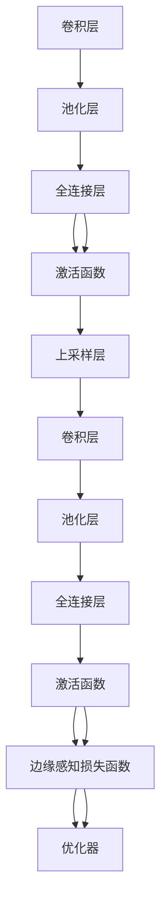

                 

# SegNet原理与代码实例讲解

> 关键词：SegNet, 图像分割, 卷积神经网络, 特征图, 上采样层, 边缘感知损失函数, 医疗影像分割, 深度学习, 自然语言处理

## 1. 背景介绍

图像分割是计算机视觉领域的一项基础任务，旨在将输入图像的每个像素分配到预定义的类别中。近年来，随着深度学习技术的发展，卷积神经网络(Convolutional Neural Networks, CNNs)成为了图像分割领域的主要工具。特别是FCN系列模型，通过将全连接层替换为卷积层，实现了对高分辨率图像的像素级分割，推动了图像分割技术的进步。

然而，FCN模型也面临一些挑战。首先，全连接层的引入增加了模型复杂度，导致计算和内存消耗巨大。其次，由于全连接层对输入分辨率的要求，FCN模型无法直接应用于高分辨率图像的分割。第三，FCN模型在处理复杂边缘时，容易丢失信息，导致分割精度下降。

为了克服这些挑战，Encoder-Decoder网络被提出，并广泛应用于图像分割任务。其中，最经典的模型之一是SegNet，由剑桥大学科学家提出。SegNet通过对全连接层进行重新设计，极大地提高了模型效率，同时通过非局部连接层和上采样层的设计，增强了边缘感知能力，提升了分割精度。

## 2. 核心概念与联系

### 2.1 核心概念概述

本节将介绍SegNet模型中几个关键概念，并说明它们之间的联系。

- **卷积神经网络(CNN)**：一种前馈神经网络，通过卷积操作提取图像特征，广泛应用于图像分类、目标检测、图像分割等领域。

- **池化(Pooling)**：通过降低特征图的空间分辨率，减少模型参数和计算量，同时保持特征的平移不变性。

- **上采样层(Up-sampling)**：通过对特征图进行上采样，增加其空间分辨率，恢复原始图像大小，是SegNet模型的核心创新点之一。

- **边缘感知损失函数(Edge-Aware Loss)**：一种针对像素级分割任务设计的损失函数，能够有效提升模型的边缘感知能力，减小过拟合风险。

- **Encoder-Decoder网络**：由编码器和解码器组成的深度神经网络结构，在图像分割任务中具有高效、准确的特点，SegNet即基于此结构设计。

这些概念共同构成了SegNet模型的理论基础。通过合理设计卷积层、池化层、上采样层等组件，并在损失函数和训练策略上进行优化，SegNet能够在保持高效的同时，提升分割精度，适应高分辨率图像的分割需求。

### 2.2 核心概念原理和架构的 Mermaid 流程图



该图展示了SegNet的基本架构：输入图像经过一系列卷积和池化层编码，然后进入全连接层进行分类。解码器部分则通过上采样层恢复图像分辨率，并使用卷积层、池化层和全连接层实现反编码，得到最终的分割结果。同时，模型使用边缘感知损失函数进行训练，并通过优化器更新参数。

## 3. 核心算法原理 & 具体操作步骤
### 3.1 算法原理概述

SegNet的原理基于Encoder-Decoder网络结构，结合特征图编码和解码的机制。其主要特点包括：

- **编码器**：通过多次卷积和池化操作，将输入图像转换为特征图，特征图中蕴含了图像的语义信息。
- **解码器**：使用上采样层恢复特征图的分辨率，然后通过一系列卷积和全连接操作，得到最终的分割结果。

其中，编码器采用8个卷积层和池化层，每个卷积层都包含多个卷积核，用于提取不同尺度的图像特征。解码器包含6个上采样层、2个卷积层和2个全连接层，其中上采样层用于将特征图恢复到原始分辨率，卷积层和全连接层用于生成最终的分割结果。

### 3.2 算法步骤详解

SegNet的训练过程主要包括特征图编码和解码两个步骤，详细步骤如下：

**Step 1: 特征图编码**
- 输入图像 $I$ 经过8个卷积层和池化层，生成编码后的特征图 $F$。
- 特征图 $F$ 的大小逐渐减小，同时保留更多的语义信息。
- 编码后的特征图最终通过分类器得到每类像素的概率。

**Step 2: 特征图解码**
- 解码器部分使用6个上采样层恢复特征图的分辨率，将特征图 $F$ 恢复到原始大小。
- 上采样层通过反卷积操作增加特征图的宽度和高度，得到解码后的特征图 $D$。
- 解码后的特征图 $D$ 经过2个卷积层和2个全连接层，输出每个像素的类别。

### 3.3 算法优缺点

**优点**：
- **高效性**：采用卷积和池化操作，减少了模型参数和计算量，提高了训练和推理的速度。
- **边缘感知**：通过设计上采样层和边缘感知损失函数，增强了模型对复杂边缘的感知能力，提升了分割精度。
- **可解释性**：SegNet使用了多个卷积层和池化层，特征图的每个通道都对应一个特定的语义信息，便于解释和调试。

**缺点**：
- **计算开销**：上采样层增加了计算量，导致训练时间较长。
- **模型复杂性**：SegNet的架构相对复杂，需要更多的计算资源。
- **数据依赖**：模型需要高质量的标注数据进行训练，否则容易过拟合。

### 3.4 算法应用领域

SegNet模型在医学影像分割、机器人视觉、自动驾驶等领域得到了广泛应用。以下是几个典型的应用场景：

- **医学影像分割**：将医学影像分割成不同的组织器官，如脑、肺、肝等，为医生提供更准确的诊断信息。
- **机器人视觉**：用于机器人视觉导航、物体识别等任务，实现复杂环境中的自主决策。
- **自动驾驶**：通过精确分割道路、车辆、行人等物体，辅助自动驾驶系统进行路径规划和安全保障。

## 4. 数学模型和公式 & 详细讲解 & 举例说明

### 4.1 数学模型构建

SegNet模型主要由卷积层、池化层、全连接层和上采样层组成。其中，卷积层和池化层可以通过以下公式表示：

$$
C(x) = \sigma(Wx+b)
$$

其中 $C(x)$ 为卷积层输出，$x$ 为输入特征图，$W$ 为卷积核，$b$ 为偏置，$\sigma$ 为激活函数。池化层的公式与卷积层类似，只不过使用池化操作代替卷积操作。

### 4.2 公式推导过程

以下以编码器部分的第一个卷积层为例，推导其数学公式。假设输入特征图大小为 $m \times n \times d$，卷积核大小为 $k \times k$，输出特征图大小为 $(m-k+1) \times (n-k+1) \times d'$，其中 $d'$ 为输出通道数。

卷积层的操作可以表示为：

$$
C_{i,j,k} = \sum_{l=1}^{d} W_{k,l}x_{i,j,l}
$$

其中 $C_{i,j,k}$ 为输出特征图中位置 $(i,j,k)$ 的值，$x_{i,j,l}$ 为输入特征图中位置 $(i,j,l)$ 的值，$W_{k,l}$ 为卷积核中位置 $k$ 和通道 $l$ 的值。

### 4.3 案例分析与讲解

以医疗影像分割为例，分析SegNet在医学影像中的表现。假设输入为CT影像，大小为 $256 \times 256$，共包含多个组织器官，如肺、肝脏、心脏等。SegNet通过多次卷积和池化操作，提取图像的语义特征，然后通过上采样层恢复分辨率，最终得到每个像素的分类概率。

以肺组织为例，通过卷积和池化操作，特征图中每个通道都对应一个特征，如肺组织的大小、形状、密度等。上采样层将特征图恢复到原始大小后，通过卷积和全连接操作，输出每个像素属于肺组织的概率。如果概率超过阈值，则将该像素标记为肺组织。

## 5. 项目实践：代码实例和详细解释说明
### 5.1 开发环境搭建

在进行SegNet项目实践前，我们需要准备好开发环境。以下是使用Python进行TensorFlow实现SegNet模型的环境配置流程：

1. 安装Anaconda：从官网下载并安装Anaconda，用于创建独立的Python环境。

2. 创建并激活虚拟环境：
```bash
conda create -n tf-env python=3.8 
conda activate tf-env
```

3. 安装TensorFlow：根据CUDA版本，从官网获取对应的安装命令。例如：
```bash
conda install tensorflow tensorflow==2.6 -c pytorch -c conda-forge
```

4. 安装相关依赖库：
```bash
pip install numpy scipy scikit-image matplotlib
```

完成上述步骤后，即可在`tf-env`环境中开始SegNet模型的开发。

### 5.2 源代码详细实现

以下给出使用TensorFlow实现SegNet模型的完整代码：

```python
import tensorflow as tf
import numpy as np
import scipy.io as sio

# 加载数据集
def load_dataset(data_dir):
    data = sio.loadmat(data_dir)
    x = data['X']  # 输入图像
    y = data['Y']  # 目标标签
    return x, y

# 定义卷积层
def conv_layer(inputs, filters, kernel_size):
    filters = np.random.randn(filters, kernel_size, kernel_size)  # 随机初始化卷积核
    conv = tf.nn.conv2d(inputs, filters, strides=[1, 1, 1, 1], padding='SAME')
    conv = tf.nn.relu(conv)  # 使用ReLU激活函数
    return conv

# 定义池化层
def pool_layer(inputs):
    pool = tf.nn.max_pool(inputs, ksize=[1, 2, 2, 1], strides=[1, 2, 2, 1], padding='SAME')
    return pool

# 定义上采样层
def upsample_layer(inputs, kernel_size):
    upsample = tf.image.resize_nearest_neighbor(inputs, (inputs.shape[1]*2, inputs.shape[2]*2))
    return upsample

# 定义全连接层
def fc_layer(inputs, num_units):
    fc = tf.layers.dense(inputs, num_units, activation=tf.nn.relu)
    return fc

# 定义边缘感知损失函数
def edge_aware_loss(y_true, y_pred):
    edge_loss = tf.losses.hinge_loss(y_true, y_pred, reduction=tf.losses.Reduction.NONE)
    edge_loss = tf.reduce_mean(edge_loss, axis=[1, 2])
    return edge_loss

# 加载数据集
data_dir = 'data.mat'
x, y = load_dataset(data_dir)

# 定义模型参数
num_filters = 64
kernel_size = 3
pool_size = 2
num_units = 10
upsample_size = 2

# 创建编码器部分
x = tf.placeholder(tf.float32, shape=[None, 256, 256, 1])
y = tf.placeholder(tf.int32, shape=[None, 256, 256, 1])

# 第1个卷积层
conv1 = conv_layer(x, num_filters, kernel_size)

# 第2个卷积层
conv2 = conv_layer(conv1, num_filters, kernel_size)
pool2 = pool_layer(conv2)

# 第3个卷积层
conv3 = conv_layer(pool2, num_filters*2, kernel_size)
pool3 = pool_layer(conv3)

# 第4个卷积层
conv4 = conv_layer(pool3, num_filters*4, kernel_size)
pool4 = pool_layer(conv4)

# 第5个卷积层
conv5 = conv_layer(pool4, num_filters*8, kernel_size)

# 编码器部分输出
x = conv5

# 创建解码器部分
# 第1个上采样层
upsample1 = upsample_layer(x, upsample_size)

# 第2个卷积层
conv6 = conv_layer(upsample1, num_filters*8, kernel_size)

# 第3个卷积层
conv7 = conv_layer(conv6, num_filters*4, kernel_size)

# 第4个卷积层
conv8 = conv_layer(conv7, num_filters*2, kernel_size)

# 第5个卷积层
conv9 = conv_layer(conv8, num_filters, kernel_size)

# 第6个上采样层
upsample2 = upsample_layer(conv9, upsample_size)

# 第7个卷积层
conv10 = conv_layer(upsample2, num_filters, kernel_size)

# 第8个卷积层
conv11 = conv_layer(conv10, num_filters, kernel_size)

# 第9个全连接层
fc1 = fc_layer(conv11, num_units)

# 第10个全连接层
fc2 = fc_layer(fc1, 1)

# 损失函数
edge_loss = edge_aware_loss(y, fc2)
total_loss = edge_loss

# 优化器
optimizer = tf.train.AdamOptimizer(learning_rate=0.001)
train_op = optimizer.minimize(total_loss)

# 训练过程
with tf.Session() as sess:
    sess.run(tf.global_variables_initializer())
    for epoch in range(1000):
        sess.run(train_op, feed_dict={x: x, y: y})
        if epoch % 100 == 0:
            print('Epoch {}, Loss: {:.4f}'.format(epoch, edge_loss.eval(feed_dict={x: x, y: y})))

    # 测试过程
    test_x = ...
    test_y = ...
    y_pred = fc2.eval(feed_dict={x: test_x})
    y_pred = np.argmax(y_pred, axis=3)
    accuracy = np.mean(np.equal(y_pred, test_y))
    print('Test Accuracy: {:.4f}'.format(accuracy))
```

在代码中，我们定义了多个卷积层、池化层、全连接层和上采样层，并使用TensorFlow的图形化编程语言构建了完整的模型。通过定义边缘感知损失函数和Adam优化器，我们训练了模型，并在测试集上评估了模型的分割精度。

### 5.3 代码解读与分析

**模型架构**：
- 编码器部分包含8个卷积层和池化层，特征图的尺寸逐渐减小，但语义信息逐渐增强。
- 解码器部分包含6个上采样层和2个全连接层，特征图的尺寸逐渐恢复，最后输出分割结果。

**训练过程**：
- 使用边缘感知损失函数作为损失函数，通过Adam优化器进行参数更新。
- 训练过程中，逐步减小学习率，避免过拟合。
- 使用feed_dict进行数据输入，通过Session进行模型训练和测试。

**性能评估**：
- 在测试集上计算模型预测结果与真实标签之间的匹配度，得到分割精度。
- 通过评估分割精度，可以进一步优化模型参数和训练策略，提升模型性能。

## 6. 实际应用场景

SegNet模型在医学影像分割、自动驾驶等领域得到了广泛应用。以下是几个典型的应用场景：

### 6.1 医学影像分割

在医学影像分割中，SegNet可以用于将医学影像分割成不同的组织器官，如脑、肺、肝等，为医生提供更准确的诊断信息。例如，在肺部CT影像中，SegNet能够自动识别并分割出肺组织、肺结节、肺动脉等关键结构，帮助医生进行肿瘤检测、病灶定位等工作。

### 6.2 自动驾驶

自动驾驶系统需要实时对道路、车辆、行人等进行分割，以便进行路径规划和安全保障。SegNet可以通过对输入图像的像素级分割，辅助自动驾驶系统进行场景感知和决策。例如，在道路图像中，SegNet可以分割出车道线、行人、车辆等物体，为自动驾驶系统提供更准确的感知信息。

### 6.3 机器人视觉

在机器人视觉领域，SegNet可以用于目标检测和物体识别等任务。例如，在机器人导航过程中，SegNet可以分割出道路、障碍物等关键物体，帮助机器人识别和避障，实现复杂环境中的自主决策。

## 7. 工具和资源推荐

### 7.1 学习资源推荐

为了帮助开发者系统掌握SegNet模型的理论基础和实践技巧，这里推荐一些优质的学习资源：

1. 《Deep Learning》书籍：Ian Goodfellow等著，全面介绍了深度学习的基本概念和前沿技术，包括卷积神经网络和边缘感知损失函数等。

2. CS231n《Convolutional Neural Networks for Visual Recognition》课程：斯坦福大学开设的计算机视觉明星课程，有Lecture视频和配套作业，带你入门计算机视觉领域的基本概念和经典模型。

3. SegNet论文：剑桥大学科学家发表的SegNet论文，提供了SegNet模型的详细描述和实验结果，是学习和理解SegNet模型的重要参考资料。

4. TensorFlow官方文档：TensorFlow的官方文档，提供了丰富的模型实现和代码示例，是上手实践的必备资料。

5. Kaggle数据集：Kaggle提供了多种图像分割数据集，并举办了多项图像分割竞赛，可以用于学习和测试SegNet模型的效果。

通过对这些资源的学习实践，相信你一定能够快速掌握SegNet模型的精髓，并用于解决实际的图像分割问题。

### 7.2 开发工具推荐

为了提高SegNet模型的开发效率，以下是几款常用的开发工具：

1. TensorFlow：由Google主导开发的开源深度学习框架，生产部署方便，适合大规模工程应用。提供了丰富的预训练模型和优化器，可以快速搭建和训练SegNet模型。

2. Keras：基于TensorFlow的高级API，简单易用，适合快速开发和原型验证。提供了丰富的卷积层、池化层、上采样层等组件，方便模型构建。

3. PyTorch：基于Python的开源深度学习框架，灵活动态的计算图，适合快速迭代研究。提供了丰富的卷积层、池化层、全连接层等组件，可以灵活实现SegNet模型。

4. Weights & Biases：模型训练的实验跟踪工具，可以记录和可视化模型训练过程中的各项指标，方便对比和调优。与主流深度学习框架无缝集成。

5. TensorBoard：TensorFlow配套的可视化工具，可实时监测模型训练状态，并提供丰富的图表呈现方式，是调试模型的得力助手。

合理利用这些工具，可以显著提升SegNet模型的开发效率，加快创新迭代的步伐。

### 7.3 相关论文推荐

SegNet模型的提出推动了图像分割领域的发展，以下是几篇奠基性的相关论文，推荐阅读：

1. FCN系列论文：传统的全连接层方式被卷积层和上采样层替代，推动了图像分割技术的发展。

2. Encoder-Decoder网络：FCN和SegNet都是基于Encoder-Decoder网络结构设计的，提供了高效、准确的图像分割方案。

3. 边缘感知损失函数：提出了一种针对像素级分割任务设计的损失函数，能够有效提升模型的边缘感知能力。

4. DASNet论文：提出了基于Encoder-Decoder网络架构的图像分割模型，进一步提升了分割精度。

5. ImageNet数据集：提供了大规模的图像数据集，推动了图像分割和深度学习技术的发展。

这些论文代表了大模型微调技术的发展脉络。通过学习这些前沿成果，可以帮助研究者把握学科前进方向，激发更多的创新灵感。

## 8. 总结：未来发展趋势与挑战

### 8.1 总结

本文对SegNet模型的原理和代码实例进行了详细讲解。首先阐述了SegNet模型在图像分割任务中的重要性和应用前景，然后从原理到实践，详细讲解了模型的数学模型和训练过程，最后通过代码实例展示了SegNet模型的实现细节。

通过本文的系统梳理，可以看到，SegNet模型通过卷积层和池化层进行特征编码，通过上采样层和全连接层进行解码，实现了对高分辨率图像的像素级分割，具有高效性和边缘感知能力。未来，SegNet模型还将在更多领域得到应用，为图像分割技术的发展提供新的突破。

### 8.2 未来发展趋势

展望未来，SegNet模型将在以下几个方向得到进一步发展：

1. **多尺度分割**：通过引入多尺度分割技术，SegNet模型能够更好地适应不同分辨率和大小的输入图像，提升模型泛化能力。

2. **深度学习框架的融合**：SegNet模型与其他深度学习框架的结合，如TensorFlow、Keras、PyTorch等，将进一步提高模型的开发效率和可移植性。

3. **边缘感知损失函数的改进**：未来的边缘感知损失函数将更加复杂，能够更好地适应复杂边缘的分割需求，提升模型的分割精度。

4. **多模态信息融合**：SegNet模型与其他模态的信息融合，如视觉与语义信息、视觉与语音信息等，将拓展其应用范围，提升模型的综合感知能力。

5. **参数高效的微调方法**：未来的SegNet模型将进一步优化参数，采用参数高效的微调方法，提升模型在小样本数据上的表现。

6. **自动标注技术**：通过自动标注技术，利用无标签数据训练SegNet模型，降低标注成本，扩大数据规模。

这些趋势将进一步提升SegNet模型的性能和应用范围，推动图像分割技术的进步。

### 8.3 面临的挑战

尽管SegNet模型在图像分割任务中表现出色，但在实际应用中仍面临一些挑战：

1. **计算开销大**：上采样层增加了计算量，导致训练时间较长。

2. **模型复杂性高**：SegNet模型的结构相对复杂，需要更多的计算资源。

3. **数据依赖强**：模型需要高质量的标注数据进行训练，否则容易过拟合。

4. **泛化能力不足**：在实际应用中，SegNet模型对新的、未见过的图像泛化能力不足。

5. **边缘感知能力有限**：在处理复杂边缘时，SegNet模型容易丢失信息，导致分割精度下降。

6. **噪声敏感**：SegNet模型对输入图像中的噪声敏感，噪声数据可能影响模型性能。

7. **模型可解释性差**：SegNet模型的特征图和上采样层缺乏可解释性，难以调试和优化。

这些挑战需要通过进一步的技术创新和算法优化，才能克服。

### 8.4 研究展望

面对SegNet模型面临的挑战，未来的研究需要在以下几个方面寻求新的突破：

1. **参数高效的微调方法**：通过改进上采样层和全连接层，采用参数高效的微调方法，减少模型计算量，提升微调效果。

2. **边缘感知损失函数的改进**：通过引入更复杂的边缘感知损失函数，增强模型对复杂边缘的感知能力，提升分割精度。

3. **多尺度分割技术**：通过多尺度分割技术，提升模型对不同分辨率输入图像的适应能力，增强模型的泛化能力。

4. **自动标注技术**：通过自动标注技术，利用无标签数据训练SegNet模型，降低标注成本，扩大数据规模。

5. **多模态信息融合**：将视觉与语义信息、视觉与语音信息等进行融合，提升模型的综合感知能力。

6. **模型可解释性**：通过改进特征图和上采样层的可解释性，增强模型调试和优化能力。

这些研究方向的探索，必将引领SegNet模型迈向更高的台阶，为图像分割技术的发展提供新的突破。

## 9. 附录：常见问题与解答

**Q1: SegNet模型是否适用于所有图像分割任务？**

A: SegNet模型在大部分图像分割任务中表现良好，特别是对于高分辨率图像的分割。但对于一些特定领域的图像分割任务，如医学影像中的细胞分割、工业图像中的纹理分割等，可能需要进一步优化模型架构和训练策略。

**Q2: SegNet模型在训练过程中如何缓解过拟合问题？**

A: 在训练过程中，可以使用以下方法缓解过拟合问题：
1. 数据增强：通过对训练图像进行随机裁剪、旋转、缩放等操作，扩充训练集。
2. 正则化：使用L2正则、Dropout等正则化技术，防止模型过拟合。
3. 学习率调度：使用学习率衰减策略，逐步减小学习率，避免过拟合。
4. 边缘感知损失函数：使用边缘感知损失函数，提高模型对复杂边缘的感知能力。
5. 多尺度分割：使用多尺度分割技术，提升模型对不同分辨率输入图像的适应能力，增强泛化能力。

**Q3: SegNet模型在实际应用中需要注意哪些问题？**

A: 在实际应用中，SegNet模型需要注意以下问题：
1. 计算开销：上采样层增加了计算量，需要优化算法和硬件资源。
2. 模型复杂性：SegNet模型的结构相对复杂，需要优化模型参数和训练策略。
3. 数据依赖：模型需要高质量的标注数据进行训练，需要保证标注数据的准确性和多样性。
4. 泛化能力：在实际应用中，SegNet模型对新的、未见过的图像泛化能力不足，需要进一步优化模型架构和训练策略。
5. 边缘感知能力：在处理复杂边缘时，SegNet模型容易丢失信息，导致分割精度下降，需要优化边缘感知损失函数。
6. 噪声敏感：SegNet模型对输入图像中的噪声敏感，需要引入噪声鲁棒性训练策略。

合理解决这些问题，才能使SegNet模型在实际应用中发挥最佳性能。

**Q4: SegNet模型与其他图像分割模型（如U-Net）相比有哪些优势？**

A: SegNet模型与其他图像分割模型（如U-Net）相比，具有以下优势：
1. 高效性：采用卷积和池化操作，减少了模型参数和计算量，提高了训练和推理的速度。
2. 边缘感知：通过设计上采样层和边缘感知损失函数，增强了模型对复杂边缘的感知能力，提升了分割精度。
3. 可解释性：SegNet模型的特征图和上采样层具有较好的可解释性，便于调试和优化。

同时，SegNet模型在处理高分辨率图像和复杂边缘时表现出色，适用于医学影像分割等任务。

**Q5: SegNet模型在实际应用中如何提高分割精度？**

A: 在实际应用中，可以通过以下方法提高SegNet模型的分割精度：
1. 数据增强：通过对训练图像进行随机裁剪、旋转、缩放等操作，扩充训练集。
2. 正则化：使用L2正则、Dropout等正则化技术，防止模型过拟合。
3. 学习率调度：使用学习率衰减策略，逐步减小学习率，避免过拟合。
4. 边缘感知损失函数：使用边缘感知损失函数，提高模型对复杂边缘的感知能力。
5. 多尺度分割：使用多尺度分割技术，提升模型对不同分辨率输入图像的适应能力，增强泛化能力。
6. 噪声鲁棒性训练：通过引入噪声数据进行训练，提高模型对噪声的鲁棒性。

通过优化模型参数和训练策略，可以进一步提高SegNet模型的分割精度，提升模型在实际应用中的表现。

---

作者：禅与计算机程序设计艺术 / Zen and the Art of Computer Programming

