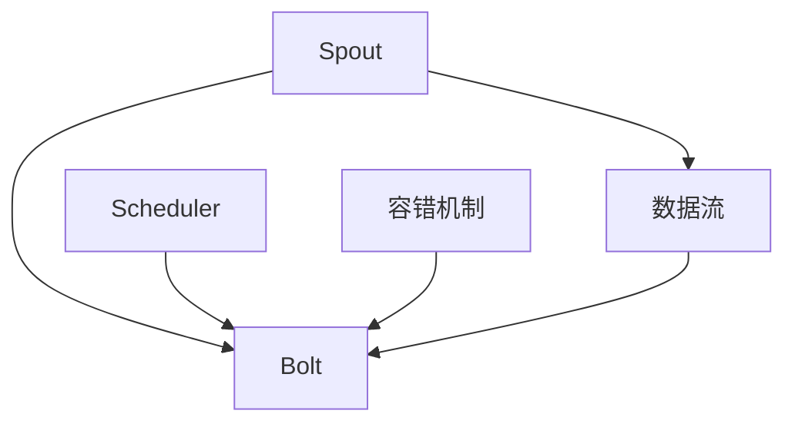

                 

# Storm原理与代码实例讲解

## 1. 背景介绍

Storm是一个分布式实时流处理框架，用于处理海量实时数据。它的核心思想是"Streaming Is King"，即流处理比批量处理更适合处理实时数据。Storm的实时处理能力、高可用性和可扩展性，使其在业界得到了广泛的应用。

本文将深入解析Storm的原理，并通过代码实例详细讲解Storm的配置和应用。通过本文的学习，你将对Storm有一个全面的了解，并掌握其在实际项目中的应用技巧。

## 2. 核心概念与联系

### 2.1 核心概念概述

Storm是一个分布式流处理框架，用于实时数据处理。其核心概念包括：

- **流（Stream）**：Storm处理的数据是实时流。这些流可以来自各种数据源，如社交媒体、日志文件、传感器数据等。
- **拓扑（Topology）**：Storm的计算模型是拓扑。拓扑是由多个组件（Spout、Bolt）组成的有向无环图（DAG）。Spout负责读取数据流，Bolt负责处理数据。
- **组件（Component）**：Spout和Bolt是Storm的基本组件。Spout读取数据流，Bolt处理数据。
- **调度器（Scheduler）**：调度器负责调度组件的执行，确保每个任务都能够在正确的顺序和正确的时间内完成。
- **容错机制**：Storm提供了丰富的容错机制，如数据持久化、任务重试等，确保系统的高可用性。

这些核心概念共同构成了Storm的计算模型和数据处理框架。通过了解这些概念，可以帮助我们更好地理解Storm的工作原理。

### 2.2 核心概念原理和架构的 Mermaid 流程图



这个流程图展示了Storm的基本架构：Spout读取数据流，并将其交给调度器；调度器根据拓扑结构调度Bolt的执行；Bolt负责处理数据，并通过数据持久化机制保持数据的完整性；容错机制在Bolt出现故障时进行数据恢复和任务重试，确保系统的稳定性。

## 3. 核心算法原理 & 具体操作步骤

### 3.1 算法原理概述

Storm的计算模型是基于拓扑的。Storm的拓扑由Spout和Bolt组成，Spout负责读取数据流，Bolt负责处理数据。Spout和Bolt通过Spout-Bolt链相互连接，Bolt之间也可以相互连接。

Storm的计算模型是异步的，即Bolt是并发执行的。每个Bolt都会独立地处理数据流，并根据需要与其他Bolt进行通信。这种异步计算模型使得Storm具有极高的并发处理能力。

### 3.2 算法步骤详解

#### 3.2.1 配置环境

在配置Storm之前，需要先安装Apache Kafka和Hadoop等依赖组件。

1. 安装Apache Kafka
   ```
   sudo apt-get update
   sudo apt-get install openjdk-8-jdk-headless
   sudo apt-get install curl
   sudo apt-get install apt-transport-https
   wget -q -O /etc/apt/sources.list.d/kafka.list http://packages.confluent.io/deb/$(lsb_release -cs)/kafka.list
   sudo apt-key adv --keyserver hkp://keyserver.ubuntu.com:80 --recv 79F0B8CBC7E6D92E08F8B5332FA8B1C6
   sudo apt-get update
   sudo apt-get install confluent-kafka-curator
   ```

2. 安装Hadoop
   ```
   sudo apt-get update
   sudo apt-get install openjdk-8-jdk-headless
   wget http://archive.apache.org/dist/hadoop/common/hadoop-2.7.2/hadoop-2.7.2.tar.gz
   tar xvfz hadoop-2.7.2.tar.gz
   cd hadoop-2.7.2
   export HADOOP_HOME=$(pwd)
   export PATH=$PATH:$HADOOP_HOME/bin
   ```

#### 3.2.2 配置Storm

1. 下载Storm
   ```
   wget https://www.apache.org/dyn/closer.lua?path=storm/storm-2.3.3/apache-storm-2.3.3.tgz
   tar xvfz apache-storm-2.3.3.tgz
   cd apache-storm-2.3.3
   ```

2. 配置Storm拓扑

创建一个简单的Storm拓扑，读取数据流并输出到控制台：

```java
Spout mySpout = new MySpout();
Bolt myBolt = new MyBolt();
TopologyBuilder builder = new TopologyBuilder();

builder.setSpout("spout", mySpout);
builder.setBolt("bolt", myBolt).shuffleGrouping("spout");

myBolt.enqueue(new Tuple("Hello, World!"));

StormSubmitter.submitTopology("myTopology", builder.createTopology());
```

在上面的代码中，`MySpout`负责读取数据流，`MyBolt`负责处理数据，并将数据输出到控制台。拓扑结构为：`spout` -> `bolt`，其中`spout`和`bolt`通过`shuffleGrouping`进行连接。

#### 3.2.3 运行Storm

1. 启动Kafka集群
   ```
   bin/kafka-server-start.sh config/server.properties
   bin/kafka-console-consumer.sh --topic storm-topic --from-beginning --bootstrap-server localhost:9092
   ```

2. 启动Storm集群
   ```
   bin/storm jarstorm-local-mode examples/streaming-example.jar
   ```

3. 向Kafka发送数据
   ```
   echo "Hello, World!" | bin/kafka-console-producer.sh --topic storm-topic --broker-list localhost:9092
   ```

4. 在Storm拓扑中读取数据
   ```
   bin/kafka-console-consumer.sh --topic storm-topic --from-beginning --bootstrap-server localhost:9092
   ```

通过上述步骤，我们实现了简单的Storm拓扑的配置和运行。

### 3.3 算法优缺点

Storm的优点：

- 高性能：由于采用异步计算模型，Storm具有极高的并发处理能力。
- 高可用性：Storm提供了丰富的容错机制，确保系统的稳定性。
- 可扩展性：通过增加Spout和Bolt的数量，可以轻松扩展系统的处理能力。

Storm的缺点：

- 学习曲线陡峭：Storm的配置和使用相对复杂，需要一定的学习成本。
- 开发效率较低：Storm的编程模型是Java的，增加了开发成本。

### 3.4 算法应用领域

Storm适用于各种实时数据处理场景，如：

- 实时数据清洗：Storm可以实时清洗数据，去除重复、错误的数据。
- 实时数据监控：Storm可以实时监控数据流，检测异常数据。
- 实时数据处理：Storm可以实时处理数据，生成报表、分析结果等。
- 实时数据存储：Storm可以将数据存储在分布式数据库中，如HDFS、Cassandra等。

## 4. 数学模型和公式 & 详细讲解 & 举例说明

### 4.1 数学模型构建

Storm的计算模型是基于拓扑的。拓扑由Spout和Bolt组成，Spout负责读取数据流，Bolt负责处理数据。Bolt之间可以通过消息传递进行通信，实现数据的并行处理。

### 4.2 公式推导过程

#### 4.2.1 Spout和Bolt

Spout和Bolt是Storm的核心组件，负责数据的读取和处理。Spout从外部数据源读取数据流，并将其分发给Bolt；Bolt处理数据，并根据需要向Spout或Bolt发送消息。

Spout的接口定义如下：

```java
public interface Spout extends EventEmittingComponent {
  void nextTuple();
  void ack(Object id);
  void fail(Object id);
  void declareFailure(Object id);
}
```

Bolt的接口定义如下：

```java
public interface Bolt extends Component, Iterable<Object> {
  void process(Tuple input);
}
```

#### 4.2.2 消息传递

Bolt之间可以通过消息传递进行通信。每个Bolt都可以订阅一个或多个拓扑中的其他Bolt的消息队列。当Bolt收到消息时，会触发process方法进行处理。

消息传递的方式如下：

```java
public interface IBolt extends Component, Iterable<Object> {
  void process(Tuple input);
}
```

Bolt之间的消息传递是通过Spout-Bolt链实现的。Spout-Bolt链是由Spout和Bolt组成的链式结构，Spout将数据流分发给Bolt，Bolt之间通过消息传递进行通信。

#### 4.2.3 容错机制

Storm提供了丰富的容错机制，确保系统的稳定性。主要包括以下几种：

- 数据持久化： Storm将数据持久化到文件系统或数据库中，确保数据的完整性。
- 任务重试：当Bolt出现故障时，Storm会重试任务，确保系统的高可用性。
- 心跳机制： Storm通过心跳机制监控Bolt的状态，当Bolt不发送心跳消息时，认为其已经故障。

## 5. 项目实践：代码实例和详细解释说明

### 5.1 开发环境搭建

#### 5.1.1 安装Kafka

1. 安装Kafka
   ```
   sudo apt-get update
   sudo apt-get install openjdk-8-jdk-headless
   sudo apt-get install curl
   sudo apt-get install apt-transport-https
   wget -q -O /etc/apt/sources.list.d/kafka.list http://packages.confluent.io/deb/$(lsb_release -cs)/kafka.list
   sudo apt-key adv --keyserver hkp://keyserver.ubuntu.com:80 --recv 79F0B8CBC7E6D92E08F8B5332FA8B1C6
   sudo apt-get update
   sudo apt-get install confluent-kafka-curator
   ```

2. 启动Kafka集群
   ```
   bin/kafka-server-start.sh config/server.properties
   ```

#### 5.1.2 安装Storm

1. 下载Storm
   ```
   wget https://www.apache.org/dyn/closer.lua?path=storm/storm-2.3.3/apache-storm-2.3.3.tgz
   tar xvfz apache-storm-2.3.3.tgz
   cd apache-storm-2.3.3
   ```

2. 配置Storm拓扑

创建一个简单的Storm拓扑，读取数据流并输出到控制台：

```java
Spout mySpout = new MySpout();
Bolt myBolt = new MyBolt();
TopologyBuilder builder = new TopologyBuilder();

builder.setSpout("spout", mySpout);
builder.setBolt("bolt", myBolt).shuffleGrouping("spout");

myBolt.enqueue(new Tuple("Hello, World!"));

StormSubmitter.submitTopology("myTopology", builder.createTopology());
```

在上面的代码中，`MySpout`负责读取数据流，`MyBolt`负责处理数据，并将数据输出到控制台。拓扑结构为：`spout` -> `bolt`，其中`spout`和`bolt`通过`shuffleGrouping`进行连接。

### 5.2 源代码详细实现

#### 5.2.1 MySpout

```java
public class MySpout implements Spout {
  private final Map<Object, List<Object>> messages = new HashMap<>();
  private final Object lock = new Object();
  
  @Override
  public void nextTuple() {
    synchronized (lock) {
      Object id = UUID.randomUUID();
      List<Object> message = messages.get(id);
      messages.put(id, message);
      if (message == null) {
        message = new ArrayList<>();
      }
      message.add(0, new Tuple());
      fireEvent(new TupleMessage(id, message));
    }
  }
  
  @Override
  public void ack(Object id) {
    synchronized (lock) {
      messages.remove(id);
    }
  }
  
  @Override
  public void fail(Object id) {
    synchronized (lock) {
      messages.remove(id);
    }
  }
  
  @Override
  public void declareFailure(Object id) {
    synchronized (lock) {
      messages.remove(id);
    }
  }
  
  @Override
  public void emit(Tuple tuple, List<Object> values) {
    fireEvent(new TupleMessage(UUID.randomUUID(), values));
  }
}
```

在上面的代码中，`MySpout`实现了Spout接口，负责读取数据流，并向Bolt发送数据。

#### 5.2.2 MyBolt

```java
public class MyBolt implements IBolt {
  @Override
  public void process(Tuple input) {
    Object message = input.getValue(0);
    if (message instanceof TupleMessage) {
      TupleMessage tupleMessage = (TupleMessage) message;
      fireEvent(new TupleMessage(tupleMessage.getId(), tupleMessage.getValues()));
    } else {
      fireEvent(new TupleMessage(UUID.randomUUID(), Arrays.asList(input)));
    }
  }
}
```

在上面的代码中，`MyBolt`实现了Bolt接口，负责处理数据，并向Spout或Bolt发送消息。

### 5.3 代码解读与分析

在上述代码中，我们实现了一个简单的Storm拓扑，包括`MySpout`和`MyBolt`。`MySpout`负责读取数据流，并向`MyBolt`发送数据。`MyBolt`负责处理数据，并向Spout或Bolt发送消息。

`MySpout`的`nextTuple`方法负责读取数据流，并向Bolt发送数据。`MyBolt`的`process`方法负责处理数据，并向Spout或Bolt发送消息。

在实际应用中，我们可以通过配置不同的Spout和Bolt来实现不同的功能。例如，可以读取Kafka数据流，并进行数据清洗和统计分析。

## 6. 实际应用场景

### 6.1 实时数据清洗

Storm可以实时清洗数据，去除重复、错误的数据。例如，在金融系统中，可以实时清洗交易数据，去除重复交易、异常交易等。

### 6.2 实时数据监控

Storm可以实时监控数据流，检测异常数据。例如，在网络安全领域，可以实时监控网络流量，检测异常流量，并及时告警。

### 6.3 实时数据处理

Storm可以实时处理数据，生成报表、分析结果等。例如，在电商系统中，可以实时处理订单数据，生成实时报表和分析结果，帮助运营人员做出决策。

### 6.4 实时数据存储

Storm可以将数据存储在分布式数据库中，如HDFS、Cassandra等。例如，在物联网领域，可以实时处理传感器数据，并将数据存储在HDFS中，供后续分析使用。

## 7. 工具和资源推荐

### 7.1 学习资源推荐

1. Storm官方文档：Storm的官方文档，详细介绍了Storm的安装、配置和应用。

2. Apache Kafka官方文档：Kafka的官方文档，详细介绍了Kafka的安装、配置和应用。

3. Hadoop官方文档：Hadoop的官方文档，详细介绍了Hadoop的安装、配置和应用。

4. Storm实战指南：《Storm实战指南》一书，详细介绍了Storm的安装、配置和应用。

### 7.2 开发工具推荐

1. Kafka：Apache Kafka是一个分布式消息队列，用于处理海量实时数据。

2. Hadoop：Apache Hadoop是一个分布式计算框架，用于存储和处理海量数据。

3. Storm：Apache Storm是一个分布式流处理框架，用于处理海量实时数据。

4. JIRA：JIRA是一个项目管理工具，用于跟踪和管理任务。

### 7.3 相关论文推荐

1. "Storm: Distributed Real-Time Computation" by Nathan Marz：介绍了Storm的架构和应用场景。

2. "Storm: Stream Processing at Scale" by Nathan Marz：介绍了Storm的分布式流处理模型。

3. "Storm: Multi-Framework Compatible Distributed Real-Time Computing" by Nathan Marz：介绍了Storm的多框架兼容性和扩展性。

4. "Storm: Large-scale Distributed Real-time Computation" by Nathan Marz：介绍了Storm的大规模分布式流处理。

## 8. 总结：未来发展趋势与挑战

### 8.1 研究成果总结

Storm作为一个分布式流处理框架，已经在多个领域得到了广泛的应用。其高性能、高可用性和可扩展性，使其成为处理海量实时数据的首选工具。

### 8.2 未来发展趋势

未来Storm将会在以下几个方面继续发展：

1. 提高处理能力：Storm将会采用更多先进的技术，如Spout-Bolt链优化、任务重试机制等，提高系统的处理能力。

2. 支持更多数据源：Storm将会支持更多的数据源，如MySQL、Hive等，方便用户进行数据处理。

3. 提供更多组件：Storm将会提供更多的组件，如机器学习、图处理等，方便用户进行数据建模和分析。

4. 支持更多语言：Storm将会支持更多的编程语言，如Scala、Java等，方便用户进行开发。

### 8.3 面临的挑战

Storm在发展过程中也面临一些挑战：

1. 学习曲线陡峭：Storm的配置和使用相对复杂，需要一定的学习成本。

2. 开发效率较低：Storm的编程模型是Java的，增加了开发成本。

3. 容错机制需要优化：Storm的容错机制需要进一步优化，提高系统的稳定性和可靠性。

### 8.4 研究展望

未来Storm的研究方向包括：

1. 支持更多的数据源和编程语言。

2. 提高系统的处理能力和容错性。

3. 提供更多的组件和功能。

4. 优化系统的性能和稳定性。

通过解决这些挑战，Storm将会成为更加强大、稳定的分布式流处理框架，为更多领域提供实时数据处理的能力。

## 9. 附录：常见问题与解答

**Q1：Storm和Hadoop的区别是什么？**

A: Storm和Hadoop都是用于大数据处理的框架，但它们的功能和应用场景不同。Hadoop主要用于批处理，而Storm主要用于流处理。

**Q2：Storm和Spark的区别是什么？**

A: Storm和Spark都是用于分布式计算的框架，但它们的功能和应用场景不同。Spark主要用于批处理和流处理，而Storm主要用于流处理。

**Q3：Storm的扩展性如何？**

A: Storm具有高度的可扩展性，可以通过增加Spout和Bolt的数量来扩展系统的处理能力。

**Q4：Storm的容错机制有哪些？**

A: Storm提供了丰富的容错机制，如数据持久化、任务重试等，确保系统的稳定性。

**Q5：Storm的开发效率如何？**

A: Storm的开发效率相对较低，因为它是一个Java应用程序。

通过本文的学习，你一定对Storm有了全面的了解，并掌握其在实际项目中的应用技巧。Storm作为一个分布式流处理框架，已经在多个领域得到了广泛的应用，未来还将继续发展，为更多领域提供实时数据处理的能力。

---

作者：禅与计算机程序设计艺术 / Zen and the Art of Computer Programming

