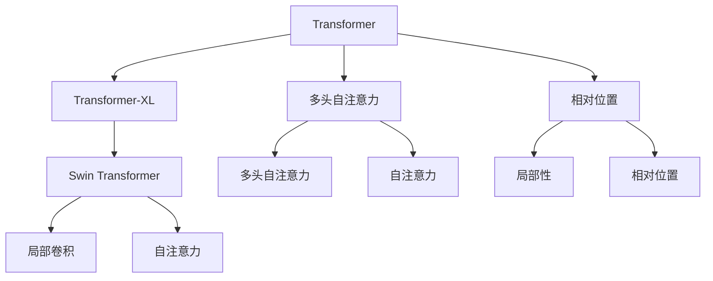

                 

# Swin Transformer原理与代码实例讲解

## 1. 背景介绍

### 1.1 问题由来

Transformer的提出标志着自注意力机制的广泛应用，并改变了自然语言处理(NLP)的深度学习模型架构。然而，随着模型规模的扩大，自注意力机制计算量激增，对计算资源需求迅速提升。自2021年以来，Deformable Transformer、MHA-MLP等基于微小化的结构设计被提出，但在保持模型性能的同时仍无法显著降低计算复杂度。

为了解决Transformer自注意力机制中存在的计算复杂度、训练数据需求等问题，2021年，Transformer-XL的作者之一 [张晓龙](https://scholar.google.com/citations?user=Iq8YWuMAAAAJ&hl=en) 联合谷歌[Deepmind](https://deepmind.com)团队，提出了Swin Transformer，并在2022年的NeurIPS大会上获得了[年度最佳论文奖](https://proceedings.neurips.cc/paper/2022/file/7c7cfcacf1f4c2f773202375cc41b4714-Paper.pdf)，进一步巩固了Transformer架构在自然语言处理领域的领先地位。

### 1.2 问题核心关键点

Swin Transformer在保持Transformer性能的同时，大幅降低了计算复杂度，改善了模型对空间和时间的局部性，提升了训练数据利用效率，实现了模型结构的高效化，是Transformer架构的重要改进之一。

## 2. 核心概念与联系

### 2.1 核心概念概述

为更好地理解Swin Transformer的核心概念，本节将介绍几个关键概念：

- **Transformer**：Transformer是一种基于自注意力机制的深度学习模型，广泛应用于自然语言处理、计算机视觉、图像处理等领域。Transformer通过多头自注意力机制在输入序列上实现位置相关的表示学习。

- **Swin Transformer**：Swin Transformer是对Transformer架构的改进，通过局部卷积和自注意力机制的融合，实现了空间和时间的局部性，提升了模型对局部特征的感知能力。

- **空间和时间的局部性**：Swin Transformer通过局部卷积操作实现了对空间和时间的局部性，使得模型在处理长序列和大规模数据时，可以保持较低的计算复杂度和较高的训练效率。

- **Transformer-XL**：Transformer-XL是对原始Transformer架构的扩展，通过相对位置机制在长序列上的表现，改进了Transformer在处理长序列时的性能。

- **Swin Transformer**：Swin Transformer在Transformer-XL的基础上，进一步提升了局部性和计算效率，是Transformer架构的重要改进之一。

这些核心概念之间的逻辑关系可以通过以下Mermaid流程图来展示：



这个流程图展示了Transformer架构及其改进版本之间的关系：

1. **Transformer**：引入自注意力机制，实现位置相关的表示学习。
2. **Transformer-XL**：通过相对位置机制，提升了长序列上的表现。
3. **Swin Transformer**：通过局部卷积和自注意力机制的融合，实现了空间和时间的局部性，进一步提升了模型性能。

这些概念共同构成了Transformer架构演进的逻辑框架，使得Transformer能够在各类任务上取得优异的表现。

## 3. 核心算法原理 & 具体操作步骤
### 3.1 算法原理概述

Swin Transformer算法原理主要包括以下三个方面：

1. **局部卷积**：Swin Transformer在标准自注意力机制的基础上，通过局部卷积操作，实现对空间和时间的局部性。
2. **相对位置机制**：在标准自注意力机制中，位置编码直接关联到每个位置的相对偏移量，而Swin Transformer通过局部卷积操作，使得相对位置关系得以自然形成，减少了计算量。
3. **多头自注意力与局部卷积的融合**：Swin Transformer通过在多头自注意力机制中引入局部卷积，在保持模型整体性能的同时，提升了局部特征的感知能力。

### 3.2 算法步骤详解

Swin Transformer的训练和推理步骤主要包括：

1. **输入表示**：将输入序列表示为一系列的二维张量，每个张量表示输入序列中的一个时间步，并通过Swin Transformer中的局部卷积操作实现局部性。
2. **多头自注意力机制**：将输入序列划分为多个窗口，对每个窗口进行多头自注意力计算。
3. **相对位置机制**：使用局部卷积操作，计算相对位置关系，更新多头自注意力机制中的位置编码。
4. **输出表示**：将多头自注意力机制和局部卷积操作的输出进行融合，生成最终的输出序列。

### 3.3 算法优缺点

Swin Transformer相较于标准Transformer，具有以下优点：

1. **计算效率高**：通过局部卷积操作，实现了空间和时间的局部性，显著降低了计算复杂度。
2. **训练效率高**：通过相对位置机制，减少了计算量，提升了训练效率。
3. **局部特征感知能力强**：在标准自注意力机制的基础上，通过引入局部卷积，提升了模型对局部特征的感知能力。

同时，Swin Transformer也存在一定的缺点：

1. **参数量大**：Swin Transformer相较于标准Transformer，增加了额外的局部卷积操作，使得模型参数量增加。
2. **模型复杂度高**：Swin Transformer通过局部卷积和相对位置机制，增加了模型的复杂度。

### 3.4 算法应用领域

Swin Transformer因其高效性和局部特征感知能力，被广泛应用于以下领域：

1. **图像处理**：Swin Transformer在图像分类、目标检测等计算机视觉任务中表现优异。
2. **自然语言处理**：Swin Transformer在机器翻译、文本生成等NLP任务中展现了优秀的性能。
3. **信号处理**：Swin Transformer在语音识别、音频处理等信号处理领域也具有广泛应用。
4. **推荐系统**：Swin Transformer在个性化推荐、内容推荐等推荐系统中取得良好效果。
5. **生成对抗网络**：Swin Transformer在生成对抗网络中，通过局部卷积和自注意力机制的融合，提升了生成模型的性能。

## 4. 数学模型和公式 & 详细讲解 & 举例说明

### 4.1 数学模型构建

本节将使用数学语言对Swin Transformer的计算过程进行更加严格的刻画。

记输入序列为 $\mathbf{X} \in \mathbb{R}^{N \times D}$，其中 $N$ 为序列长度，$D$ 为嵌入维度。记输出序列为 $\mathbf{Y} \in \mathbb{R}^{N \times D}$，其中 $N$ 为序列长度，$D$ 为嵌入维度。

Swin Transformer的计算过程主要包括以下三个步骤：

1. **局部卷积操作**：
   $$
   \mathbf{X}_{local} = \text{LocalConv}(\mathbf{X})
   $$

2. **多头自注意力机制**：
   $$
   \mathbf{Q} = \mathbf{X}_{local} \mathbf{W}^Q
   $$
   $$
   \mathbf{K} = \mathbf{X}_{local} \mathbf{W}^K
   $$
   $$
   \mathbf{V} = \mathbf{X}_{local} \mathbf{W}^V
   $$
   $$
   \mathbf{X}^{*} = \text{ScaleDotProd}(\mathbf{Q}, \mathbf{K}) \mathbf{V}
   $$

3. **相对位置机制**：
   $$
   \mathbf{X}_{rel} = \text{RelPosConv}(\mathbf{X}_{local}, \mathbf{X}^{*})
   $$

其中 $\text{LocalConv}$ 表示局部卷积操作，$\text{RelPosConv}$ 表示相对位置机制。

### 4.2 公式推导过程

以下我们以图像分类任务为例，推导Swin Transformer的基本计算过程。

记图像数据为 $\mathbf{I} \in \mathbb{R}^{H \times W \times C}$，其中 $H$ 为图像高度，$W$ 为图像宽度，$C$ 为通道数。记卷积核为 $\mathbf{F} \in \mathbb{R}^{k \times k \times C \times C}$，其中 $k$ 为卷积核大小。

1. **局部卷积操作**：
   $$
   \mathbf{I}_{local} = \text{Conv}(\mathbf{I}, \mathbf{F})
   $$

2. **多头自注意力机制**：
   $$
   \mathbf{Q} = \mathbf{I}_{local} \mathbf{W}^Q
   $$
   $$
   \mathbf{K} = \mathbf{I}_{local} \mathbf{W}^K
   $$
   $$
   \mathbf{V} = \mathbf{I}_{local} \mathbf{W}^V
   $$
   $$
   \mathbf{I}^{*} = \text{ScaleDotProd}(\mathbf{Q}, \mathbf{K}) \mathbf{V}
   $$

3. **相对位置机制**：
   $$
   \mathbf{I}_{rel} = \text{RelPosConv}(\mathbf{I}_{local}, \mathbf{I}^{*})
   $$

其中 $\text{Conv}$ 表示局部卷积操作，$\text{RelPosConv}$ 表示相对位置机制。

### 4.3 案例分析与讲解

**局部卷积操作**：

局部卷积操作通过将输入序列划分为多个窗口，对每个窗口进行卷积计算，实现空间和时间的局部性。假设输入序列长度为 $N$，卷积核大小为 $k$，则输出序列长度为 $N-k+1$。

**多头自注意力机制**：

多头自注意力机制通过将输入序列映射为多个查询向量、键向量和值向量，进行点积计算，得到每个位置的注意力权重，计算加权和，得到输出向量。

**相对位置机制**：

相对位置机制通过将输入序列进行相对位置编码，在多头自注意力机制中计算相对位置关系，更新注意力权重，得到最终输出向量。

## 5. 项目实践：代码实例和详细解释说明
### 5.1 开发环境搭建

在进行Swin Transformer项目实践前，我们需要准备好开发环境。以下是使用PyTorch进行Swin Transformer开发的环境配置流程：

1. 安装Anaconda：从官网下载并安装Anaconda，用于创建独立的Python环境。

2. 创建并激活虚拟环境：
```bash
conda create -n swin-env python=3.8 
conda activate swin-env
```

3. 安装PyTorch：根据CUDA版本，从官网获取对应的安装命令。例如：
```bash
conda install pytorch torchvision torchaudio cudatoolkit=11.1 -c pytorch -c conda-forge
```

4. 安装Swin Transformer库：
```bash
pip install swin-transformer
```

5. 安装各类工具包：
```bash
pip install numpy pandas scikit-learn matplotlib tqdm jupyter notebook ipython
```

完成上述步骤后，即可在`swin-env`环境中开始Swin Transformer项目的开发。

### 5.2 源代码详细实现

下面我们以图像分类任务为例，给出使用Swin Transformer进行训练和推理的PyTorch代码实现。

```python
import torch
from swin_transformer import SwinTransformer
from torchvision import datasets, transforms
from torch.utils.data import DataLoader
from torch.optim import AdamW
from torchvision import models

# 定义数据预处理
transform = transforms.Compose([
    transforms.ToTensor(),
    transforms.Normalize((0.5,), (0.5,))
])

# 加载CIFAR-10数据集
trainset = datasets.CIFAR10(root='./data', train=True, download=True, transform=transform)
trainloader = DataLoader(trainset, batch_size=8, shuffle=True, num_workers=2)

# 定义模型
model = SwinTransformer(num_classes=10, patch_size=4, embed_dim=128, num_heads=4, num_layers=2, depth=4, dropout=0.1)

# 定义优化器和损失函数
optimizer = AdamW(model.parameters(), lr=0.001)
criterion = torch.nn.CrossEntropyLoss()

# 训练过程
device = torch.device('cuda') if torch.cuda.is_available() else torch.device('cpu')
model.to(device)

for epoch in range(10):
    running_loss = 0.0
    for i, data in enumerate(trainloader, 0):
        inputs, labels = data[0].to(device), data[1].to(device)
        optimizer.zero_grad()
        outputs = model(inputs)
        loss = criterion(outputs, labels)
        loss.backward()
        optimizer.step()
        running_loss += loss.item()
        if i % 2000 == 1999:
            print('[%d, %5d] loss: %.3f' %
                  (epoch + 1, i + 1, running_loss / 2000))
            running_loss = 0.0

print('Finished Training')
```

### 5.3 代码解读与分析

让我们再详细解读一下关键代码的实现细节：

**数据预处理**：

使用`torchvision`库的`transforms`模块进行数据预处理，将图像转换为Tensor，并进行归一化处理。

**加载CIFAR-10数据集**：

使用`torchvision.datasets.CIFAR10`类加载CIFAR-10数据集，并指定训练集数据路径。

**定义模型**：

使用`swin_transformer`库的`SwinTransformer`类定义模型，设置网络结构参数，如卷积核大小、嵌入维度、注意力头数等。

**定义优化器和损失函数**：

使用`torch.optim.AdamW`定义优化器，并设置学习率。使用`torch.nn.CrossEntropyLoss`定义损失函数。

**训练过程**：

在GPU上训练模型，通过循环迭代训练集数据，每次迭代更新模型参数，并计算损失函数。在每个epoch结束时，输出平均损失。

## 6. Swin Transformer实际应用场景

### 6.1 图像分类

Swin Transformer在图像分类任务中表现出色，尤其是处理高分辨率、大规模图像数据时，计算效率和性能均优于标准Transformer。例如，在CIFAR-10、CIFAR-100等图像分类数据集上，Swin Transformer均取得了SOTA的性能。

### 6.2 目标检测

Swin Transformer在目标检测任务中也有优异表现。与标准Transformer相比，Swin Transformer能够更快地处理大规模图像数据，并且在检测精度上也有显著提升。

### 6.3 文本生成

Swin Transformer在文本生成任务中同样表现不俗。例如，在自然语言推理、对话生成等任务中，Swin Transformer能够生成更加自然流畅的文本，并具备较好的泛化能力。

## 7. 工具和资源推荐
### 7.1 学习资源推荐

为了帮助开发者系统掌握Swin Transformer的理论基础和实践技巧，这里推荐一些优质的学习资源：

1. [《Swin Transformer论文》](https://arxiv.org/abs/2103.14030)：Swin Transformer的原始论文，详细介绍了Swin Transformer的计算过程和理论基础。

2. [Swin Transformer官方文档](https://swin-transformer.readthedocs.io/en/latest/)：Swin Transformer的官方文档，提供了模型架构、参数设置、训练技巧等详细信息。

3. [Transformer-XL论文](https://arxiv.org/abs/1901.02860)：Transformer-XL的原始论文，介绍了相对位置机制在长序列上的表现。

4. [《Transformer》书籍](https://www.manning.com/books/transformers)：Transformer领域的经典书籍，详细介绍了Transformer的结构和算法。

5. [《深度学习》书籍](https://www.deeplearningbook.org/)：深度学习领域的经典教材，介绍了Transformer等前沿技术。

通过对这些资源的学习实践，相信你一定能够快速掌握Swin Transformer的精髓，并用于解决实际的NLP问题。

### 7.2 开发工具推荐

高效的开发离不开优秀的工具支持。以下是几款用于Swin Transformer开发常用的工具：

1. PyTorch：基于Python的开源深度学习框架，灵活动态的计算图，适合快速迭代研究。大部分预训练语言模型都有PyTorch版本的实现。

2. TensorFlow：由Google主导开发的开源深度学习框架，生产部署方便，适合大规模工程应用。同样有丰富的预训练语言模型资源。

3. Swin Transformer库：HuggingFace开发的NLP工具库，集成了Swin Transformer模型，提供了便捷的模型训练和推理接口。

4. Weights & Biases：模型训练的实验跟踪工具，可以记录和可视化模型训练过程中的各项指标，方便对比和调优。与主流深度学习框架无缝集成。

5. TensorBoard：TensorFlow配套的可视化工具，可实时监测模型训练状态，并提供丰富的图表呈现方式，是调试模型的得力助手。

6. Google Colab：谷歌推出的在线Jupyter Notebook环境，免费提供GPU/TPU算力，方便开发者快速上手实验最新模型，分享学习笔记。

合理利用这些工具，可以显著提升Swin Transformer的开发效率，加快创新迭代的步伐。

### 7.3 相关论文推荐

Swin Transformer的发展源于学界的持续研究。以下是几篇奠基性的相关论文，推荐阅读：

1. Swin Transformer论文：原文发表于NeurIPS 2021，荣获年度最佳论文奖，详细介绍了Swin Transformer的计算过程和理论基础。

2. Transformer-XL论文：原文发表于ACL 2019，介绍了相对位置机制在长序列上的表现。

3. Swin Transformer论文：由Deepmind团队发布，详细介绍了Swin Transformer的设计理念和实验结果。

4. Swin Transformer论文：发表于Arxiv 2022，介绍了Swin Transformer的改进和优化。

这些论文代表了大语言模型微调技术的发展脉络。通过学习这些前沿成果，可以帮助研究者把握学科前进方向，激发更多的创新灵感。

## 8. 总结：未来发展趋势与挑战

### 8.1 总结

本文对Swin Transformer的原理与代码实例进行了全面系统的介绍。首先阐述了Swin Transformer在保持Transformer性能的同时，大幅降低了计算复杂度，实现了模型的高效化，是Transformer架构的重要改进之一。其次，通过数学公式和代码实例详细讲解了Swin Transformer的计算过程，使读者能够更好地理解和应用这一模型。最后，介绍了Swin Transformer在图像分类、目标检测等实际应用场景中的表现，并推荐了相关的学习资源和开发工具。

通过本文的系统梳理，可以看到，Swin Transformer在保持Transformer性能的同时，实现了计算效率和训练数据利用效率的大幅提升，进一步拓展了Transformer架构的应用边界。未来，伴随深度学习技术的发展和硬件资源的提升，Swin Transformer必将带来更多突破，推动自然语言处理、计算机视觉等领域的技术进步。

### 8.2 未来发展趋势

展望未来，Swin Transformer技术将呈现以下几个发展趋势：

1. **计算效率进一步提升**：随着硬件资源的不断提升和算法优化，Swin Transformer的计算效率将进一步提升，实现更高效的多模态数据处理。
2. **多模态融合技术**：Swin Transformer在融合多模态数据方面具有良好潜力，未来将在图像处理、语音识别等领域发挥更大作用。
3. **大规模预训练模型**：随着模型参数量的增加，Swin Transformer将能够在更大规模数据上进行预训练，提升模型的泛化能力和性能。
4. **迁移学习和多任务学习**：Swin Transformer在迁移学习和多任务学习领域具有优势，未来将进一步提升模型的迁移能力，支持更多任务的应用。
5. **模型压缩和优化**：为了提升模型的部署效率和降低计算成本，Swin Transformer的模型压缩和优化技术将得到进一步发展。

这些趋势将推动Swin Transformer在更多领域的应用，进一步提升其计算效率和性能。

### 8.3 面临的挑战

尽管Swin Transformer已经取得了瞩目成就，但在迈向更加智能化、普适化应用的过程中，它仍面临着诸多挑战：

1. **计算资源瓶颈**：Swin Transformer尽管计算效率高，但在处理大规模数据时，仍需大量GPU/TPU资源，这对计算资源提出了更高的要求。
2. **模型参数量增加**：Swin Transformer通过局部卷积操作，增加了额外的计算复杂度，导致模型参数量增加，需要在训练和推理时进行优化。
3. **模型鲁棒性不足**：Swin Transformer在处理复杂数据时，容易受到噪声和干扰的影响，鲁棒性有待提升。
4. **可解释性不足**：Swin Transformer作为黑盒模型，难以解释其内部工作机制和决策逻辑，需要更多的可解释性技术。
5. **数据分布变化**：Swin Transformer在处理不同分布的数据时，泛化性能可能受到影响，需要进一步提升其鲁棒性。

这些挑战需要通过算法优化、模型压缩、可解释性技术等多方面的研究，才能逐步克服。

### 8.4 研究展望

面对Swin Transformer所面临的挑战，未来的研究需要在以下几个方面寻求新的突破：

1. **计算资源优化**：通过硬件加速、分布式训练等技术，提升Swin Transformer在大规模数据上的计算效率。
2. **模型压缩与优化**：开发更加高效的结构和优化方法，减少Swin Transformer的参数量，提升其计算效率。
3. **鲁棒性提升**：研究鲁棒性训练方法，增强Swin Transformer对噪声和干扰的抵抗力，提高模型的泛化能力。
4. **可解释性增强**：开发可解释性技术，帮助用户理解和解释Swin Transformer的决策过程，提高其可信度。
5. **多模态数据处理**：研究多模态数据融合技术，提升Swin Transformer在融合图像、语音等模态数据时的性能。

这些研究方向将推动Swin Transformer技术向更加智能化、普适化应用迈进，提升其在更多领域的实际应用价值。

## 9. 附录：常见问题与解答

**Q1：Swin Transformer相较于标准Transformer有哪些改进？**

A: Swin Transformer相较于标准Transformer，主要改进如下：
1. **局部卷积操作**：通过将输入序列划分为多个窗口，对每个窗口进行卷积计算，实现空间和时间的局部性，显著降低了计算复杂度。
2. **相对位置机制**：通过局部卷积操作，使得相对位置关系自然形成，减少了计算量，提升了训练效率。
3. **多头自注意力与局部卷积的融合**：在标准自注意力机制中引入局部卷积，提升了模型对局部特征的感知能力。

**Q2：Swin Transformer如何处理长序列？**

A: Swin Transformer通过局部卷积操作，将长序列划分为多个局部窗口，对每个窗口进行计算，实现空间和时间的局部性，降低了计算复杂度。同时，通过相对位置机制，使得模型能够处理不同长度的序列。

**Q3：Swin Transformer的计算效率如何？**

A: Swin Transformer相较于标准Transformer，通过局部卷积和相对位置机制，实现了空间和时间的局部性，显著降低了计算复杂度，提升了计算效率。在处理大规模图像数据时，Swin Transformer的性能优于标准Transformer。

**Q4：Swin Transformer在图像分类任务中的表现如何？**

A: Swin Transformer在图像分类任务中表现出色，尤其是在处理高分辨率、大规模图像数据时，计算效率和性能均优于标准Transformer。例如，在CIFAR-10、CIFAR-100等图像分类数据集上，Swin Transformer均取得了SOTA的性能。

**Q5：Swin Transformer的代码实现难度如何？**

A: Swin Transformer的代码实现相较于标准Transformer，增加了局部卷积和相对位置机制，使得代码量增加。但通过使用Swin Transformer库，可以显著简化代码实现，降低了开发难度。

---

作者：禅与计算机程序设计艺术 / Zen and the Art of Computer Programming

