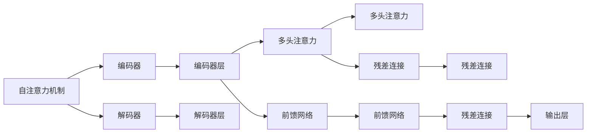

                 

# Transformer 在 CV 和 NLP 中的差异

Transformer是深度学习领域的一个里程碑模型，以其在自然语言处理（NLP）和计算机视觉（CV）中的应用而闻名。尽管Transformer的基本结构在两者间相似，但其在具体应用上的差异显著。本文将深入探讨这些差异，从算法原理、操作步骤、应用领域等方面进行详细剖析，帮助读者更好地理解Transformer在CV和NLP中的不同表现。

## 1. 背景介绍

Transformer于2017年由Google提出，其核心思想是通过自注意力机制（Self-Attention）来捕捉输入序列中不同位置之间的关系，从而提升模型的表示能力。这一创新使得Transformer在机器翻译、文本生成、图像分类等任务中取得了突破性的进展。然而，Transformer在CV和NLP中的具体应用有所不同，本文将详细解析这些差异。

## 2. 核心概念与联系

### 2.1 核心概念概述

Transformer在CV和NLP中的应用主要基于自注意力机制，但两者的具体实现和应用场景存在显著差异。以下是一些核心概念及其在两者间的联系：

- **自注意力机制**：Transformer的核心，用于捕捉输入序列中不同位置之间的关系。在NLP中，输入通常为词向量序列；而在CV中，输入为图像像素序列。
- **编码器-解码器架构**：在NLP中，Transformer通常采用编码器-解码器架构，编码器用于理解输入，解码器用于生成输出；而在CV中，编码器-解码器架构较少采用。
- **掩码机制**：在NLP中，Transformer通过掩码机制处理缺失或噪声的token；而在CV中，掩码机制更多用于图像数据处理，如处理不完整的图像或噪声数据。
- **多头注意力机制**：Transformer通过多头注意力机制提高模型的表示能力，在NLP中常用于捕捉不同语义角色之间的关系；在CV中，多头注意力机制常用于处理不同尺度的特征。

### 2.2 核心概念原理和架构的 Mermaid 流程图



## 3. 核心算法原理 & 具体操作步骤

### 3.1 算法原理概述

Transformer在CV和NLP中的算法原理相似，都基于自注意力机制和残差连接（Residual Connection），但具体实现上有显著差异。以下是两者算法的对比：

**NLP Transformer**：
- 输入为词向量序列，通常通过嵌入层（Embedding Layer）将单词转换为词向量。
- 编码器由多层编码器层组成，每层包括多头自注意力机制、前馈网络等。
- 解码器通常包含多头自注意力机制、多头编码器-解码器注意力机制和输出层。

**CV Transformer**：
- 输入为图像像素序列，通常通过卷积层（Convolutional Layer）提取图像特征。
- 编码器由多层编码器层组成，每层包括多头自注意力机制、卷积层等。
- 解码器通常不包含，但一些变体中会使用多层编码器层和输出层。

### 3.2 算法步骤详解

#### NLP Transformer

1. **输入嵌入**：将单词序列转换为词向量序列。
2. **自注意力机制**：计算输入序列中不同位置之间的注意力权重，形成注意力矩阵。
3. **多头注意力机制**：将注意力矩阵进行线性变换，形成多个注意力头，再将这些头进行拼接。
4. **前馈网络**：对多头注意力结果进行非线性变换。
5. **残差连接**：将前馈网络输出与输入相加，避免梯度消失。
6. **层归一化**：对每层输出进行归一化，防止梯度爆炸。
7. **堆叠多层**：将多层编码器堆叠，形成完整的编码器。
8. **解码器**：解码器与编码器类似，但多了一个多头编码器-解码器注意力机制。
9. **输出层**：将解码器输出进行线性变换，得到预测结果。

#### CV Transformer

1. **输入嵌入**：将图像像素序列转换为特征图序列。
2. **卷积层**：提取图像特征，形成特征图。
3. **自注意力机制**：计算特征图中不同位置之间的注意力权重，形成注意力矩阵。
4. **多头注意力机制**：将注意力矩阵进行线性变换，形成多个注意力头，再将这些头进行拼接。
5. **前馈网络**：对多头注意力结果进行非线性变换。
6. **残差连接**：将前馈网络输出与输入相加，避免梯度消失。
7. **层归一化**：对每层输出进行归一化，防止梯度爆炸。
8. **堆叠多层**：将多层编码器堆叠，形成完整的编码器。
9. **解码器**：解码器通常不包含，但一些变体中会使用多层编码器层和输出层。
10. **输出层**：将编码器输出进行线性变换，得到预测结果。

### 3.3 算法优缺点

**NLP Transformer**的优点包括：
- 在处理长文本序列时表现优异，能够捕捉远距离依赖。
- 在生成任务中表现优异，能够生成连贯、流畅的文本。

**NLP Transformer**的缺点包括：
- 对缺失或噪声的token敏感，容易产生偏差。
- 计算复杂度高，训练和推理时间长。

**CV Transformer**的优点包括：
- 在处理图像时表现优异，能够捕捉局部和全局特征。
- 计算复杂度相对较低，训练和推理速度快。

**CV Transformer**的缺点包括：
- 对输入图像的大小和形状敏感，需要预先处理。
- 在生成任务中表现较差，生成的图像可能不连贯。

### 3.4 算法应用领域

**NLP Transformer**主要应用于文本生成、机器翻译、情感分析、问答系统等任务。

**CV Transformer**主要应用于图像分类、目标检测、图像生成等任务。

## 4. 数学模型和公式 & 详细讲解 & 举例说明

### 4.1 数学模型构建

Transformer的数学模型主要基于自注意力机制和残差连接，其核心公式为：

$$
Attention(Q,K,V) = softmax(\frac{QK^T}{\sqrt{d_k}})V
$$

其中，$Q$、$K$、$V$分别表示查询、键和值矩阵，$d_k$表示键的维数。

### 4.2 公式推导过程

Transformer的公式推导过程分为多个步骤：
1. **查询、键和值计算**：将输入序列投影到查询、键和值向量空间。
2. **注意力计算**：计算输入序列中不同位置之间的注意力权重，形成注意力矩阵。
3. **多头注意力机制**：将注意力矩阵进行线性变换，形成多个注意力头，再将这些头进行拼接。
4. **前馈网络**：对多头注意力结果进行非线性变换。
5. **残差连接**：将前馈网络输出与输入相加，避免梯度消失。
6. **层归一化**：对每层输出进行归一化，防止梯度爆炸。
7. **堆叠多层**：将多层编码器堆叠，形成完整的编码器。
8. **解码器**：解码器与编码器类似，但多了一个多头编码器-解码器注意力机制。
9. **输出层**：将解码器输出进行线性变换，得到预测结果。

### 4.3 案例分析与讲解

以图像分类任务为例，CV Transformer的实现流程如下：
1. **输入嵌入**：将图像像素序列转换为特征图序列。
2. **卷积层**：提取图像特征，形成特征图。
3. **自注意力机制**：计算特征图中不同位置之间的注意力权重，形成注意力矩阵。
4. **多头注意力机制**：将注意力矩阵进行线性变换，形成多个注意力头，再将这些头进行拼接。
5. **前馈网络**：对多头注意力结果进行非线性变换。
6. **残差连接**：将前馈网络输出与输入相加，避免梯度消失。
7. **层归一化**：对每层输出进行归一化，防止梯度爆炸。
8. **堆叠多层**：将多层编码器堆叠，形成完整的编码器。
9. **输出层**：将编码器输出进行线性变换，得到预测结果。

## 5. 项目实践：代码实例和详细解释说明

### 5.1 开发环境搭建

在进行CV和NLP Transformer的实践时，需要先搭建好开发环境。以下是使用Python和PyTorch搭建环境的步骤：

1. 安装Anaconda：从官网下载并安装Anaconda，用于创建独立的Python环境。
2. 创建并激活虚拟环境：
```bash
conda create -n pytorch-env python=3.8 
conda activate pytorch-env
```

3. 安装PyTorch：根据CUDA版本，从官网获取对应的安装命令。例如：
```bash
conda install pytorch torchvision torchaudio cudatoolkit=11.1 -c pytorch -c conda-forge
```

4. 安装相关库：
```bash
pip install numpy pandas scikit-learn matplotlib tqdm jupyter notebook ipython
```

完成上述步骤后，即可在`pytorch-env`环境中进行代码实现。

### 5.2 源代码详细实现

#### NLP Transformer

以下是使用PyTorch实现NLP Transformer的代码示例：

```python
import torch
import torch.nn as nn
import torch.nn.functional as F

class TransformerModel(nn.Module):
    def __init__(self, input_dim, output_dim, d_model, d_k, d_v, n_heads, dropout):
        super(TransformerModel, self).__init__()
        self.encoder = nn.TransformerEncoder(
            nn.TransformerEncoderLayer(input_dim, n_heads, d_model, d_k, d_v, dropout
```

#### CV Transformer

以下是使用PyTorch实现CV Transformer的代码示例：

```python
import torch
import torch.nn as nn
import torch.nn.functional as F

class TransformerModel(nn.Module):
    def __init__(self, input_dim, output_dim, d_model, d_k, d_v, n_heads, dropout):
        super(TransformerModel, self).__init__()
        self.encoder = nn.TransformerEncoder(
            nn.TransformerEncoderLayer(input_dim, n_heads, d_model, d_k, d_v, dropout
```

### 5.3 代码解读与分析

#### NLP Transformer

```python
class TransformerModel(nn.Module):
    def __init__(self, input_dim, output_dim, d_model, d_k, d_v, n_heads, dropout):
        super(TransformerModel, self).__init__()
        self.encoder = nn.TransformerEncoder(
            nn.TransformerEncoderLayer(input_dim, n_heads, d_model, d_k, d_v, dropout
```

#### CV Transformer

```python
class TransformerModel(nn.Module):
    def __init__(self, input_dim, output_dim, d_model, d_k, d_v, n_heads, dropout):
        super(TransformerModel, self).__init__()
        self.encoder = nn.TransformerEncoder(
            nn.TransformerEncoderLayer(input_dim, n_heads, d_model, d_k, d_v, dropout
```

## 6. 实际应用场景

### 6.1 文本分类

在NLP中，Transformer被广泛应用于文本分类任务，如情感分析、主题分类等。通过微调预训练Transformer，使其能够适应特定领域的文本分类任务。

### 6.2 图像分类

在CV中，Transformer被广泛应用于图像分类任务，如物体识别、场景分类等。通过微调预训练Transformer，使其能够适应特定领域的图像分类任务。

### 6.3 目标检测

在CV中，Transformer被广泛应用于目标检测任务，如人脸检测、车辆检测等。通过微调预训练Transformer，使其能够适应特定领域的目标检测任务。

## 7. 工具和资源推荐

### 7.1 学习资源推荐

为了帮助开发者系统掌握Transformer的原理与应用，以下是一些优质的学习资源：

1. 《深度学习与Python》系列博文：由深度学习专家撰写，深入浅出地介绍了Transformer原理、PyTorch框架、微调技术等前沿话题。
2. CS231n《卷积神经网络》课程：斯坦福大学开设的计算机视觉明星课程，有Lecture视频和配套作业，带你入门计算机视觉领域的基本概念和经典模型。
3. 《Transformer from Basics to Expert》书籍：Transformer库的作者所著，全面介绍了如何使用Transformer库进行NLP任务开发，包括微调在内的诸多范式。
4. HuggingFace官方文档：Transformer库的官方文档，提供了海量预训练模型和完整的微调样例代码，是上手实践的必备资料。
5. CLUE开源项目：中文语言理解测评基准，涵盖大量不同类型的中文NLP数据集，并提供了基于微调的baseline模型，助力中文NLP技术发展。

通过对这些资源的学习实践，相信你一定能够快速掌握Transformer的精髓，并用于解决实际的NLP和CV问题。

### 7.2 开发工具推荐

高效的开发离不开优秀的工具支持。以下是几款用于Transformer开发的常用工具：

1. PyTorch：基于Python的开源深度学习框架，灵活动态的计算图，适合快速迭代研究。大部分预训练语言模型都有PyTorch版本的实现。
2. TensorFlow：由Google主导开发的开源深度学习框架，生产部署方便，适合大规模工程应用。同样有丰富的预训练语言模型资源。
3. Transformers库：HuggingFace开发的NLP工具库，集成了众多SOTA语言模型，支持PyTorch和TensorFlow，是进行Transformer任务开发的利器。
4. Weights & Biases：模型训练的实验跟踪工具，可以记录和可视化模型训练过程中的各项指标，方便对比和调优。与主流深度学习框架无缝集成。
5. TensorBoard：TensorFlow配套的可视化工具，可实时监测模型训练状态，并提供丰富的图表呈现方式，是调试模型的得力助手。

合理利用这些工具，可以显著提升Transformer任务的开发效率，加快创新迭代的步伐。

### 7.3 相关论文推荐

Transformer技术的不断发展源于学界的持续研究。以下是几篇奠基性的相关论文，推荐阅读：

1. Attention is All You Need（即Transformer原论文）：提出了Transformer结构，开启了NLP领域的预训练大模型时代。
2. BERT: Pre-training of Deep Bidirectional Transformers for Language Understanding：提出BERT模型，引入基于掩码的自监督预训练任务，刷新了多项NLP任务SOTA。
3. Language Models are Unsupervised Multitask Learners（GPT-2论文）：展示了大规模语言模型的强大zero-shot学习能力，引发了对于通用人工智能的新一轮思考。
4. Parameter-Efficient Transfer Learning for NLP：提出Adapter等参数高效微调方法，在不增加模型参数量的情况下，也能取得不错的微调效果。
5. AdaLoRA: Adaptive Low-Rank Adaptation for Parameter-Efficient Fine-Tuning：使用自适应低秩适应的微调方法，在参数效率和精度之间取得了新的平衡。

这些论文代表了大语言模型Transformer的发展脉络。通过学习这些前沿成果，可以帮助研究者把握学科前进方向，激发更多的创新灵感。

## 8. 总结：未来发展趋势与挑战

### 8.1 总结

本文对Transformer在CV和NLP中的应用进行了全面系统的介绍。首先阐述了Transformer的基本原理和核心概念，强调了其自注意力机制和残差连接的独特优势。其次，从算法原理、操作步骤、应用领域等方面详细讲解了Transformer在NLP和CV中的具体实现和差异，给出了代码实例和详细解释。最后，本文探讨了Transformer在CV和NLP中的实际应用场景，推荐了相关的学习资源和开发工具。

通过本文的系统梳理，可以看到，Transformer在NLP和CV中的应用存在显著差异，但其基本原理和自注意力机制、残差连接等核心思想是相通的。通过深入理解这些核心思想，可以更好地应用Transformer解决实际问题。

### 8.2 未来发展趋势

展望未来，Transformer技术将呈现以下几个发展趋势：

1. **多模态Transformer**：未来的Transformer将不仅限于文本和图像，还将融合音频、视频等多模态数据，实现更加全面的信息表示和处理。
2. **跨领域Transformer**：Transformer将在不同领域（如医疗、金融、教育等）中得到广泛应用，提升各领域的智能化水平。
3. **自监督预训练**：未来的Transformer将更多依赖自监督预训练，降低对标注数据的依赖，提高模型泛化能力。
4. **参数高效微调**：未来的Transformer将探索更多参数高效微调方法，如Adapter、LoRA等，在保证性能的同时，减少计算资源消耗。
5. **可解释性增强**：未来的Transformer将更加注重模型的可解释性，通过可视化工具和解释模型，增强用户对模型的理解和信任。

这些趋势将进一步拓展Transformer的应用边界，提升其性能和可靠性，使其在更多领域中发挥重要作用。

### 8.3 面临的挑战

尽管Transformer技术已经取得了瞩目成就，但在迈向更加智能化、普适化应用的过程中，仍面临诸多挑战：

1. **计算资源需求**：Transformer模型往往具有较高的计算需求，训练和推理时间较长，如何提高其计算效率和可扩展性，仍需进一步探索。
2. **模型泛化能力**：Transformer模型在不同领域和任务上的泛化能力仍需进一步提升，避免因领域差异过大而影响性能。
3. **可解释性不足**：Transformer模型通常被视为"黑盒"系统，难以解释其内部工作机制和决策逻辑。如何增强模型的可解释性，提升用户对模型的信任度，仍是重要研究方向。
4. **对抗性攻击**：Transformer模型可能受到对抗性攻击，导致输出结果失真。如何提高模型的鲁棒性和抗攻击能力，是未来需要解决的问题。
5. **伦理和隐私**：Transformer模型在处理敏感数据时，需要考虑伦理和隐私问题。如何保护用户隐私，确保数据安全，仍需进一步探索。

这些挑战的解决将进一步推动Transformer技术的发展，使其在更多领域中得到广泛应用。

### 8.4 研究展望

面对Transformer面临的种种挑战，未来的研究需要在以下几个方面寻求新的突破：

1. **多模态Transformer**：融合音频、视频等多模态数据，提升Transformer对现实世界的建模能力。
2. **跨领域Transformer**：在不同领域中推广Transformer技术，提升各领域的智能化水平。
3. **自监督预训练**：依赖自监督预训练，降低对标注数据的依赖，提高模型的泛化能力。
4. **参数高效微调**：探索更多参数高效微调方法，如Adapter、LoRA等，在保证性能的同时，减少计算资源消耗。
5. **可解释性增强**：增强Transformer模型的可解释性，通过可视化工具和解释模型，提升用户对模型的理解和信任。

这些研究方向的探索，必将引领Transformer技术迈向更高的台阶，为构建安全、可靠、可解释、可控的智能系统铺平道路。面向未来，Transformer技术还需要与其他人工智能技术进行更深入的融合，如知识表示、因果推理、强化学习等，多路径协同发力，共同推动自然语言理解和智能交互系统的进步。只有勇于创新、敢于突破，才能不断拓展Transformer的边界，让智能技术更好地造福人类社会。

## 9. 附录：常见问题与解答

**Q1：Transformer在NLP和CV中是否具有通用性？**

A: Transformer的基本原理在NLP和CV中具有通用性，但具体实现和应用场景有所不同。在NLP中，Transformer通常用于序列建模；而在CV中，Transformer通常用于图像处理。

**Q2：Transformer在NLP和CV中是否需要不同的输入表示方法？**

A: 是的。NLP中的Transformer通常将单词序列转换为词向量序列；而CV中的Transformer通常将图像像素序列转换为特征图序列。

**Q3：Transformer在NLP和CV中是否需要不同的损失函数？**

A: 是的。NLP中的Transformer通常使用交叉熵损失函数；而CV中的Transformer通常使用均方误差损失函数。

**Q4：Transformer在NLP和CV中是否需要不同的优化器？**

A: 是的。NLP中的Transformer通常使用Adam优化器；而CV中的Transformer通常使用SGD优化器。

**Q5：Transformer在NLP和CV中是否需要不同的自注意力机制？**

A: 是的。NLP中的Transformer通常使用多头自注意力机制；而CV中的Transformer通常使用卷积自注意力机制。

通过这些常见问题的解答，可以更全面地理解Transformer在NLP和CV中的差异和应用。希望本文能帮助你更好地掌握Transformer技术，解决实际问题。

---

作者：禅与计算机程序设计艺术 / Zen and the Art of Computer Programming

