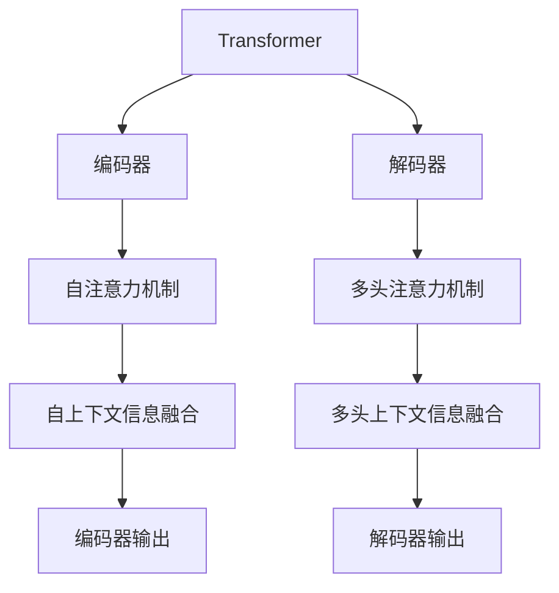

                 

# Transformer架构原理详解：BERT 基于Transformer编码器的双向语言模型

> 关键词：Transformer, BERT, 双向语言模型, 自注意力机制, 编码器, 解码器, 预训练, 微调

## 1. 背景介绍

Transformer架构的出现，标志着深度学习在自然语言处理领域的一次重大突破。其中，BERT（Bidirectional Encoder Representations from Transformers）模型基于Transformer架构，是自然语言处理领域的首个里程碑模型，其双向语言模型设计极大地提升了模型在理解上下文关系上的能力，开启了预训练-微调范式，奠定了随后众多NLP模型的基础。本节将介绍Transformer架构的核心原理，并深入探讨其衍生模型BERT的构建过程。

## 2. 核心概念与联系

### 2.1 核心概念概述

Transformer模型是一种基于自注意力机制的神经网络模型，其核心思想是通过并行化计算，将注意力机制应用于序列数据的处理，避免了传统RNN模型中的串行计算瓶颈。BERT模型是在Transformer的基础上，通过改进编码器架构和训练策略，进一步提升了模型的上下文理解能力。

- Transformer架构：一种基于自注意力机制的神经网络架构，由编码器和解码器两部分组成，主要用于序列数据的建模。
- 双向语言模型：一种能够处理序列数据的深度学习模型，通过反向传播计算序列中每个元素对其他元素的贡献，从而捕捉上下文信息。
- 自注意力机制：一种通过计算序列中所有元素间的注意力权重，对信息进行加权融合的机制，能够捕捉长距离依赖关系。
- BERT：一种基于Transformer架构的双向语言模型，通过预训练-微调范式在自然语言处理任务中取得了显著的性能提升。
- 预训练-微调：一种深度学习模型的训练策略，先在大规模无标签数据上进行预训练，再在目标任务上微调，通过任务导向的训练提高模型在特定任务上的表现。

这些核心概念之间的逻辑关系可以通过以下Mermaid流程图来展示：



这个流程图展示了Transformer架构的核心组件和机制：

1. Transformer由编码器和解码器两部分组成，其中编码器采用自注意力机制，解码器采用多头注意力机制。
2. 自注意力机制和多头注意力机制分别用于处理序列内部和序列之间的信息，使模型能够捕捉长距离依赖关系。
3. 编码器通过自注意力机制对序列中的每个元素进行编码，融合自上下文信息。
4. 解码器通过多头注意力机制对编码器输出进行解码，融合不同编码器输出的信息。

这些组件和机制的有机结合，使得Transformer架构具备了处理序列数据的强大能力，是构建BERT等模型的基础。

## 3. 核心算法原理 & 具体操作步骤

### 3.1 算法原理概述

Transformer架构的核心是自注意力机制，其思想是通过计算序列中每个元素与其他元素间的注意力权重，对信息进行加权融合。自注意力机制可以捕捉长距离依赖关系，使得模型能够更好地理解上下文信息。

自注意力机制的计算公式如下：

$$
\text{Attention}(Q, K, V) = \text{Softmax}(\frac{QK^T}{\sqrt{d_k}})V
$$

其中，$Q, K, V$分别为查询向量、键向量和值向量，$d_k$为键向量的维度。$\text{Softmax}$函数用于计算注意力权重，$\frac{QK^T}{\sqrt{d_k}}$用于计算点积相似度，最后乘以值向量$V$，得到加权融合后的输出。

Transformer模型中，编码器和解码器都采用了自注意力机制。编码器通过自注意力机制对序列中的每个元素进行编码，解码器通过多头注意力机制对编码器输出进行解码。通过这种架构设计，Transformer模型能够处理序列数据，捕捉长距离依赖关系，并避免了传统RNN模型中的串行计算瓶颈。

### 3.2 算法步骤详解

Transformer模型的训练过程主要分为两个阶段：预训练和微调。预训练阶段在大规模无标签数据上进行，微调阶段在目标任务上进行，通过任务导向的训练提高模型在特定任务上的表现。

**3.2.1 预训练步骤**

预训练步骤的主要目的是学习通用的语言表示，提升模型在特定任务上的表现。其主要步骤如下：

1. 数据准备：收集大规模无标签文本数据，划分为训练集、验证集和测试集。
2. 模型初始化：初始化模型参数，如Transformer的编码器和解码器参数。
3. 数据输入：将文本数据输入模型，进行自注意力计算和线性变换。
4. 损失计算：计算模型输出与真实标签之间的损失函数，如交叉熵损失。
5. 梯度更新：通过反向传播计算梯度，更新模型参数。
6. 模型保存：保存预训练模型，以备后续微调使用。

**3.2.2 微调步骤**

微调步骤的主要目的是将预训练模型适配到特定任务上，提升模型在特定任务上的表现。其主要步骤如下：

1. 数据准备：收集目标任务的标注数据，划分为训练集、验证集和测试集。
2. 模型加载：加载预训练模型，微调部分或全部参数。
3. 数据输入：将标注数据输入模型，进行自注意力计算和线性变换。
4. 损失计算：计算模型输出与真实标签之间的损失函数，如交叉熵损失。
5. 梯度更新：通过反向传播计算梯度，更新模型参数。
6. 模型评估：在验证集和测试集上评估模型性能，进行超参数调优。
7. 模型保存：保存微调后的模型，以供实际应用。

### 3.3 算法优缺点

Transformer架构在自然语言处理领域具有以下优点：

1. 并行计算能力强：自注意力机制能够并行计算，避免了传统RNN模型中的串行计算瓶颈，提高了模型训练和推理的效率。
2. 长距离依赖关系捕捉能力强：自注意力机制能够捕捉长距离依赖关系，提升了模型在理解上下文信息上的能力。
3. 模型效果好：Transformer架构在大规模语料上进行预训练，能够学习到丰富的语言表示，提升了模型在各种NLP任务上的表现。

然而，Transformer架构也存在一些缺点：

1. 模型参数量大：Transformer模型参数量较大，对计算资源和存储空间的要求较高。
2. 训练复杂度高：Transformer模型训练复杂度高，需要大量的计算资源和时间。
3. 难以解释：Transformer模型的内部工作机制较为复杂，难以解释模型的决策过程。

尽管存在这些缺点，Transformer架构仍然在自然语言处理领域取得了显著的成就，成为众多NLP模型的基础架构。

### 3.4 算法应用领域

Transformer架构和BERT模型在自然语言处理领域得到了广泛的应用，涵盖诸多任务，例如：

1. 机器翻译：将源语言文本翻译成目标语言。BERT模型通过预训练-微调，在机器翻译任务上取得了很好的表现。
2. 文本分类：如情感分析、主题分类等。BERT模型通过预训练-微调，能够学习到文本-标签映射，提升模型在文本分类任务上的表现。
3. 命名实体识别：识别文本中的人名、地名、机构名等特定实体。BERT模型通过预训练-微调，能够学习到实体边界和类型，提升模型在命名实体识别任务上的表现。
4. 问答系统：对自然语言问题给出答案。BERT模型通过预训练-微调，能够学习到问题-答案对，提升模型在问答系统任务上的表现。
5. 文本摘要：将长文本压缩成简短摘要。BERT模型通过预训练-微调，能够学习到文本-摘要映射，提升模型在文本摘要任务上的表现。
6. 对话系统：使机器能够与人自然对话。BERT模型通过预训练-微调，能够学习到对话历史-回复映射，提升模型在对话系统任务上的表现。

除了上述这些经典任务外，Transformer架构和BERT模型还被创新性地应用到更多场景中，如可控文本生成、常识推理、代码生成、数据增强等，为NLP技术带来了全新的突破。随着预训练模型和微调方法的不断进步，相信NLP技术将在更广阔的应用领域大放异彩。

## 4. 数学模型和公式 & 详细讲解 & 举例说明

### 4.1 数学模型构建

Transformer架构的核心是自注意力机制，其思想是通过计算序列中每个元素与其他元素间的注意力权重，对信息进行加权融合。自注意力机制的计算公式如下：

$$
\text{Attention}(Q, K, V) = \text{Softmax}(\frac{QK^T}{\sqrt{d_k}})V
$$

其中，$Q, K, V$分别为查询向量、键向量和值向量，$d_k$为键向量的维度。$\text{Softmax}$函数用于计算注意力权重，$\frac{QK^T}{\sqrt{d_k}}$用于计算点积相似度，最后乘以值向量$V$，得到加权融合后的输出。

Transformer模型中的编码器和解码器都采用了自注意力机制，其具体实现如下：

1. 编码器：输入序列$x_1, x_2, ..., x_n$，通过多个自注意力层和前馈神经网络层进行处理，得到编码器输出$h_1, h_2, ..., h_n$。
2. 解码器：输入目标序列$y_1, y_2, ..., y_m$和编码器输出$h_1, h_2, ..., h_n$，通过多个自注意力层和前馈神经网络层进行处理，得到解码器输出$\tilde{y}_1, \tilde{y}_2, ..., \tilde{y}_m$。

### 4.2 公式推导过程

Transformer架构中的自注意力机制计算公式如下：

$$
\text{Attention}(Q, K, V) = \text{Softmax}(\frac{QK^T}{\sqrt{d_k}})V
$$

其中，$Q, K, V$分别为查询向量、键向量和值向量，$d_k$为键向量的维度。$\text{Softmax}$函数用于计算注意力权重，$\frac{QK^T}{\sqrt{d_k}}$用于计算点积相似度，最后乘以值向量$V$，得到加权融合后的输出。

自注意力机制的具体计算步骤如下：

1. 计算查询向量$Q$、键向量$K$和值向量$V$。
2. 计算点积相似度$QK^T$。
3. 对点积相似度进行归一化，得到注意力权重。
4. 将注意力权重与值向量$V$进行加权融合，得到自注意力输出。

### 4.3 案例分析与讲解

以BERT模型为例，分析其在自然语言处理任务中的应用。

BERT模型通过预训练-微调范式，在自然语言处理任务上取得了很好的表现。其预训练阶段主要使用大规模无标签文本数据，通过自注意力机制学习通用的语言表示。微调阶段使用目标任务的标注数据，通过任务导向的训练提升模型在特定任务上的表现。

例如，在命名实体识别任务中，BERT模型通过预训练-微调，能够学习到实体边界和类型。具体步骤如下：

1. 数据准备：收集大规模无标签文本数据，划分为训练集、验证集和测试集。
2. 模型初始化：初始化BERT模型的编码器和解码器参数。
3. 数据输入：将文本数据输入模型，进行自注意力计算和线性变换。
4. 损失计算：计算模型输出与真实标签之间的交叉熵损失。
5. 梯度更新：通过反向传播计算梯度，更新模型参数。
6. 模型保存：保存BERT模型，以备后续微调使用。

## 5. 项目实践：代码实例和详细解释说明

### 5.1 开发环境搭建

在进行BERT模型开发前，我们需要准备好开发环境。以下是使用Python进行PyTorch开发的环境配置流程：

1. 安装Anaconda：从官网下载并安装Anaconda，用于创建独立的Python环境。

2. 创建并激活虚拟环境：
```bash
conda create -n pytorch-env python=3.8 
conda activate pytorch-env
```

3. 安装PyTorch：根据CUDA版本，从官网获取对应的安装命令。例如：
```bash
conda install pytorch torchvision torchaudio cudatoolkit=11.1 -c pytorch -c conda-forge
```

4. 安装Transformer库：
```bash
pip install transformers
```

5. 安装各类工具包：
```bash
pip install numpy pandas scikit-learn matplotlib tqdm jupyter notebook ipython
```

完成上述步骤后，即可在`pytorch-env`环境中开始BERT模型开发。

### 5.2 源代码详细实现

以下是一个简单的BERT模型微调的PyTorch代码实现：

```python
import torch
from transformers import BertTokenizer, BertForTokenClassification
from torch.utils.data import Dataset, DataLoader
import torch.nn as nn
import torch.optim as optim
from sklearn.metrics import classification_report

# 数据准备
tokenizer = BertTokenizer.from_pretrained('bert-base-uncased')
train_dataset = ...
dev_dataset = ...
test_dataset = ...

# 模型定义
model = BertForTokenClassification.from_pretrained('bert-base-uncased', num_labels=2)

# 训练和评估
device = torch.device('cuda') if torch.cuda.is_available() else torch.device('cpu')
model.to(device)

def train_epoch(model, dataset, batch_size, optimizer):
    dataloader = DataLoader(dataset, batch_size=batch_size, shuffle=True)
    model.train()
    epoch_loss = 0
    for batch in dataloader:
        input_ids = batch['input_ids'].to(device)
        attention_mask = batch['attention_mask'].to(device)
        labels = batch['labels'].to(device)
        model.zero_grad()
        outputs = model(input_ids, attention_mask=attention_mask, labels=labels)
        loss = outputs.loss
        epoch_loss += loss.item()
        loss.backward()
        optimizer.step()
    return epoch_loss / len(dataloader)

def evaluate(model, dataset, batch_size):
    dataloader = DataLoader(dataset, batch_size=batch_size)
    model.eval()
    preds, labels = [], []
    with torch.no_grad():
        for batch in dataloader:
            input_ids = batch['input_ids'].to(device)
            attention_mask = batch['attention_mask'].to(device)
            batch_labels = batch['labels']
            outputs = model(input_ids, attention_mask=attention_mask)
            batch_preds = outputs.logits.argmax(dim=2).to('cpu').tolist()
            batch_labels = batch_labels.to('cpu').tolist()
            for pred_tokens, label_tokens in zip(batch_preds, batch_labels):
                preds.append(pred_tokens[:len(label_tokens)])
                labels.append(label_tokens)
    print(classification_report(labels, preds))

# 训练过程
epochs = 5
batch_size = 16

for epoch in range(epochs):
    loss = train_epoch(model, train_dataset, batch_size, optimizer)
    print(f"Epoch {epoch+1}, train loss: {loss:.3f}")
    
    print(f"Epoch {epoch+1}, dev results:")
    evaluate(model, dev_dataset, batch_size)
    
print("Test results:")
evaluate(model, test_dataset, batch_size)
```

以上代码展示了如何使用PyTorch和Transformer库对BERT模型进行微调的完整流程。可以看到，Transformer库提供了便捷的模型定义和训练接口，使得微调过程变得非常简单。

### 5.3 代码解读与分析

让我们再详细解读一下关键代码的实现细节：

**BertTokenizer类**：
- 用于分词和构建输入。

**BertForTokenClassification类**：
- 定义了BERT模型的编码器和解码器部分，通过多标签分类器输出预测结果。

**DataLoader类**：
- 用于将数据集划分为批次，方便模型训练和推理。

**train_epoch函数**：
- 定义了每个epoch的训练过程，包含前向传播、反向传播和梯度更新等步骤。

**evaluate函数**：
- 定义了模型的评估过程，使用scikit-learn的classification_report打印分类报告。

**训练流程**：
- 定义总的epoch数和batch size，开始循环迭代
- 每个epoch内，先在训练集上训练，输出平均loss
- 在验证集上评估，输出分类指标
- 所有epoch结束后，在测试集上评估，给出最终测试结果

可以看到，PyTorch配合Transformer库使得BERT模型的微调过程变得非常简单。开发者可以更加关注数据处理、模型改进等高层逻辑，而不必过多关注底层的实现细节。

当然，工业级的系统实现还需考虑更多因素，如模型的保存和部署、超参数的自动搜索、更灵活的任务适配层等。但核心的微调范式基本与此类似。

## 6. 实际应用场景

### 6.1 智能客服系统

基于BERT模型的智能客服系统，能够自动理解用户意图，匹配最合适的答案模板进行回复。在技术实现上，可以收集企业内部的历史客服对话记录，将问题和最佳答复构建成监督数据，在此基础上对预训练BERT模型进行微调。微调后的BERT模型能够自动理解用户意图，匹配最合适的答案模板进行回复。对于客户提出的新问题，还可以接入检索系统实时搜索相关内容，动态组织生成回答。如此构建的智能客服系统，能大幅提升客户咨询体验和问题解决效率。

### 6.2 金融舆情监测

金融机构需要实时监测市场舆论动向，以便及时应对负面信息传播，规避金融风险。传统的人工监测方式成本高、效率低，难以应对网络时代海量信息爆发的挑战。基于BERT模型的文本分类和情感分析技术，为金融舆情监测提供了新的解决方案。

具体而言，可以收集金融领域相关的新闻、报道、评论等文本数据，并对其进行主题标注和情感标注。在此基础上对预训练BERT模型进行微调，使其能够自动判断文本属于何种主题，情感倾向是正面、中性还是负面。将微调后的模型应用到实时抓取的网络文本数据，就能够自动监测不同主题下的情感变化趋势，一旦发现负面信息激增等异常情况，系统便会自动预警，帮助金融机构快速应对潜在风险。

### 6.3 个性化推荐系统

当前的推荐系统往往只依赖用户的历史行为数据进行物品推荐，无法深入理解用户的真实兴趣偏好。基于BERT模型的个性化推荐系统可以更好地挖掘用户行为背后的语义信息，从而提供更精准、多样的推荐内容。

在实践中，可以收集用户浏览、点击、评论、分享等行为数据，提取和用户交互的物品标题、描述、标签等文本内容。将文本内容作为模型输入，用户的后续行为（如是否点击、购买等）作为监督信号，在此基础上微调预训练BERT模型。微调后的模型能够从文本内容中准确把握用户的兴趣点。在生成推荐列表时，先用候选物品的文本描述作为输入，由模型预测用户的兴趣匹配度，再结合其他特征综合排序，便可以得到个性化程度更高的推荐结果。

### 6.4 未来应用展望

随着BERT模型和微调方法的不断发展，基于微调范式将在更多领域得到应用，为传统行业带来变革性影响。

在智慧医疗领域，基于BERT模型的医疗问答、病历分析、药物研发等应用将提升医疗服务的智能化水平，辅助医生诊疗，加速新药开发进程。

在智能教育领域，微调技术可应用于作业批改、学情分析、知识推荐等方面，因材施教，促进教育公平，提高教学质量。

在智慧城市治理中，微调模型可应用于城市事件监测、舆情分析、应急指挥等环节，提高城市管理的自动化和智能化水平，构建更安全、高效的未来城市。

此外，在企业生产、社会治理、文娱传媒等众多领域，基于BERT模型的微调应用也将不断涌现，为NLP技术带来全新的突破。相信随着预训练模型和微调方法的持续演进，BERT模型必将在更广阔的应用领域大放异彩，深刻影响人类的生产生活方式。

## 7. 工具和资源推荐

### 7.1 学习资源推荐

为了帮助开发者系统掌握BERT模型的理论基础和实践技巧，这里推荐一些优质的学习资源：

1. 《Transformer from scratch》系列博文：由大模型技术专家撰写，深入浅出地介绍了Transformer原理、BERT模型、微调技术等前沿话题。

2. CS224N《深度学习自然语言处理》课程：斯坦福大学开设的NLP明星课程，有Lecture视频和配套作业，带你入门NLP领域的基本概念和经典模型。

3. 《Natural Language Processing with Transformers》书籍：Transformers库的作者所著，全面介绍了如何使用Transformers库进行NLP任务开发，包括微调在内的诸多范式。

4. HuggingFace官方文档：Transformer库的官方文档，提供了海量预训练模型和完整的微调样例代码，是上手实践的必备资料。

5. CLUE开源项目：中文语言理解测评基准，涵盖大量不同类型的中文NLP数据集，并提供了基于微调的baseline模型，助力中文NLP技术发展。

通过对这些资源的学习实践，相信你一定能够快速掌握BERT模型的精髓，并用于解决实际的NLP问题。

### 7.2 开发工具推荐

高效的开发离不开优秀的工具支持。以下是几款用于BERT模型微调开发的常用工具：

1. PyTorch：基于Python的开源深度学习框架，灵活动态的计算图，适合快速迭代研究。大部分预训练语言模型都有PyTorch版本的实现。

2. TensorFlow：由Google主导开发的开源深度学习框架，生产部署方便，适合大规模工程应用。同样有丰富的预训练语言模型资源。

3. Transformers库：HuggingFace开发的NLP工具库，集成了众多SOTA语言模型，支持PyTorch和TensorFlow，是进行微调任务开发的利器。

4. Weights & Biases：模型训练的实验跟踪工具，可以记录和可视化模型训练过程中的各项指标，方便对比和调优。与主流深度学习框架无缝集成。

5. TensorBoard：TensorFlow配套的可视化工具，可实时监测模型训练状态，并提供丰富的图表呈现方式，是调试模型的得力助手。

6. Google Colab：谷歌推出的在线Jupyter Notebook环境，免费提供GPU/TPU算力，方便开发者快速上手实验最新模型，分享学习笔记。

合理利用这些工具，可以显著提升BERT模型微调任务的开发效率，加快创新迭代的步伐。

### 7.3 相关论文推荐

BERT模型的成功离不开学界的持续研究。以下是几篇奠基性的相关论文，推荐阅读：

1. Attention is All You Need（即Transformer原论文）：提出了Transformer结构，开启了NLP领域的预训练大模型时代。

2. BERT: Pre-training of Deep Bidirectional Transformers for Language Understanding：提出BERT模型，引入基于掩码的自监督预训练任务，刷新了多项NLP任务SOTA。

3. Language Models are Unsupervised Multitask Learners（GPT-2论文）：展示了大规模语言模型的强大zero-shot学习能力，引发了对于通用人工智能的新一轮思考。

4. Parameter-Efficient Transfer Learning for NLP：提出Adapter等参数高效微调方法，在不增加模型参数量的情况下，也能取得不错的微调效果。

5. Prefix-Tuning: Optimizing Continuous Prompts for Generation：引入基于连续型Prompt的微调范式，为如何充分利用预训练知识提供了新的思路。

6. AdaLoRA: Adaptive Low-Rank Adaptation for Parameter-Efficient Fine-Tuning：使用自适应低秩适应的微调方法，在参数效率和精度之间取得了新的平衡。

这些论文代表了大语言模型微调技术的发展脉络。通过学习这些前沿成果，可以帮助研究者把握学科前进方向，激发更多的创新灵感。

## 8. 总结：未来发展趋势与挑战

### 8.1 总结

本文对BERT模型和Transformer架构的核心原理进行了全面系统的介绍。首先阐述了Transformer架构的核心思想，介绍了自注意力机制的计算方法，并详细解析了BERT模型的构建过程。其次，从原理到实践，详细讲解了BERT模型的数学模型和微调方法，给出了BERT模型微调的完整代码实例。同时，本文还广泛探讨了BERT模型在智能客服、金融舆情、个性化推荐等多个行业领域的应用前景，展示了BERT模型的强大性能。

通过本文的系统梳理，可以看到，BERT模型和Transformer架构在自然语言处理领域取得了显著的成就，成为NLP领域的重要范式，推动了NLP技术向更深层次的发展。

### 8.2 未来发展趋势

展望未来，BERT模型和Transformer架构的发展呈现以下几个趋势：

1. 模型规模持续增大：随着算力成本的下降和数据规模的扩张，预训练语言模型的参数量还将持续增长，超大规模语言模型蕴含的丰富语言知识，将进一步提升模型的上下文理解能力。

2. 微调方法日趋多样：除了传统的全参数微调外，未来会涌现更多参数高效的微调方法，如Prefix-Tuning、LoRA等，在固定大部分预训练参数的同时，只更新极少量的任务相关参数，减少计算资源消耗。

3. 持续学习成为常态：随着数据分布的不断变化，微调模型也需要持续学习新知识以保持性能。如何在不遗忘原有知识的同时，高效吸收新样本信息，将成为重要的研究课题。

4. 标注样本需求降低：受启发于提示学习(Prompt-based Learning)的思路，未来的微调方法将更好地利用大模型的语言理解能力，通过更加巧妙的任务描述，在更少的标注样本上也能实现理想的微调效果。

5. 多模态微调崛起：当前的微调主要聚焦于纯文本数据，未来会进一步拓展到图像、视频、语音等多模态数据微调。多模态信息的融合，将显著提升语言模型对现实世界的理解和建模能力。

6. 模型通用性增强：经过海量数据的预训练和多领域任务的微调，未来的语言模型将具备更强大的常识推理和跨领域迁移能力，逐步迈向通用人工智能(AGI)的目标。

以上趋势凸显了BERT模型和Transformer架构的广阔前景。这些方向的探索发展，必将进一步提升NLP系统的性能和应用范围，为构建人机协同的智能系统铺平道路。面向未来，BERT模型和Transformer架构还需要与其他人工智能技术进行更深入的融合，如知识表示、因果推理、强化学习等，多路径协同发力，共同推动自然语言理解和智能交互系统的进步。

### 8.3 面临的挑战

尽管BERT模型和Transformer架构在自然语言处理领域取得了显著的成就，但在迈向更加智能化、普适化应用的过程中，仍面临诸多挑战：

1. 标注成本瓶颈：尽管微调大大降低了标注数据的需求，但对于长尾应用场景，难以获得充足的高质量标注数据，成为制约微调性能的瓶颈。如何进一步降低微调对标注样本的依赖，将是一大难题。

2. 模型鲁棒性不足：当前微调模型面对域外数据时，泛化性能往往大打折扣。对于测试样本的微小扰动，微调模型的预测也容易发生波动。如何提高微调模型的鲁棒性，避免灾难性遗忘，还需要更多理论和实践的积累。

3. 推理效率有待提高：大规模语言模型虽然精度高，但在实际部署时往往面临推理速度慢、内存占用大等效率问题。如何在保证性能的同时，简化模型结构，提升推理速度，优化资源占用，将是重要的优化方向。

4. 可解释性亟需加强：当前微调模型更像是"黑盒"系统，难以解释其内部工作机制和决策逻辑。对于医疗、金融等高风险应用，算法的可解释性和可审计性尤为重要。如何赋予微调模型更强的可解释性，将是亟待攻克的难题。

5. 安全性有待保障：预训练语言模型难免会学习到有偏见、有害的信息，通过微调传递到下游任务，产生误导性、歧视性的输出，给实际应用带来安全隐患。如何从数据和算法层面消除模型偏见，避免恶意用途，确保输出的安全性，也将是重要的研究课题。

6. 知识整合能力不足：现有的微调模型往往局限于任务内数据，难以灵活吸收和运用更广泛的先验知识。如何让微调过程更好地与外部知识库、规则库等专家知识结合，形成更加全面、准确的信息整合能力，还有很大的想象空间。

正视BERT模型和Transformer架构面临的这些挑战，积极应对并寻求突破，将是大模型微调走向成熟的必由之路。相信随着学界和产业界的共同努力，这些挑战终将一一被克服，BERT模型和Transformer架构必将在构建安全、可靠、可解释、可控的智能系统中扮演越来越重要的角色。

### 8.4 研究展望

面向未来，BERT模型和Transformer架构的研究需要在以下几个方面寻求新的突破：

1. 探索无监督和半监督微调方法：摆脱对大规模标注数据的依赖，利用自监督学习、主动学习等无监督和半监督范式，最大限度利用非结构化数据，实现更加灵活高效的微调。

2. 研究参数高效和计算高效的微调范式：开发更加参数高效的微调方法，在固定大部分预训练参数的同时，只更新极少量的任务相关参数。同时优化微调模型的计算图，减少前向传播和反向传播的资源消耗，实现更加轻量级、实时性的部署。

3. 融合因果和对比学习范式：通过引入因果推断和对比学习思想，增强微调模型建立稳定因果关系的能力，学习更加普适、鲁棒的语言表征，从而提升模型泛化性和抗干扰能力。

4. 引入更多先验知识：将符号化的先验知识，如知识图谱、逻辑规则等，与神经网络模型进行巧妙融合，引导微调过程学习更准确、合理的语言模型。同时加强不同模态数据的整合，实现视觉、语音等多模态信息与文本信息的协同建模。

5. 结合因果分析和博弈论工具：将因果分析方法引入微调模型，识别出模型决策的关键特征，增强输出解释的因果性和逻辑性。借助博弈论工具刻画人机交互过程，主动探索并规避模型的脆弱点，提高系统稳定性。

6. 纳入伦理道德约束：在模型训练目标中引入伦理导向的评估指标，过滤和惩罚有偏见、有害的输出倾向。同时加强人工干预和审核，建立模型行为的监管机制，确保输出符合人类价值观和伦理道德。

这些研究方向的探索，必将引领BERT模型和Transformer架构走向更高的台阶，为构建安全、可靠、可解释、可控的智能系统铺平道路。面向未来，BERT模型和Transformer架构还需要与其他人工智能技术进行更深入的融合，如知识表示、因果推理、强化学习等，多路径协同发力，共同推动自然语言理解和智能交互系统的进步。只有勇于创新、敢于突破，才能不断拓展语言模型的边界，让智能技术更好地造福人类社会。

## 9. 附录：常见问题与解答

**Q1：BERT模型是否适用于所有NLP任务？**

A: BERT模型在大多数NLP任务上都能取得不错的效果，特别是对于数据量较小的任务。但对于一些特定领域的任务，如医学、法律等，仅仅依靠通用语料预训练的模型可能难以很好地适应。此时需要在特定领域语料上进一步预训练，再进行微调，才能获得理想效果。此外，对于一些需要时效性、个性化很强的任务，如对话、推荐等，微调方法也需要针对性的改进优化。

**Q2：微调过程中如何选择合适的学习率？**

A: 微调的学习率一般要比预训练时小1-2个数量级，如果使用过大的学习率，容易破坏预训练权重，导致过拟合。一般建议从1e-5开始调参，逐步减小学习率，直至收敛。也可以使用warmup策略，在开始阶段使用较小的学习率，再逐渐过渡到预设值。需要注意的是，不同的优化器(如AdamW、Adafactor等)以及不同的学习率调度策略，可能需要设置不同的学习率阈值。

**Q3：采用BERT模型微调时会面临哪些资源瓶颈？**

A: 目前主流的预训练BERT模型动辄以亿计的参数规模，对算力、内存、存储空间的要求较高。GPU/TPU等高性能设备是必不可少的，但即便如此，超大批次的训练和推理也可能遇到显存不足的问题。因此需要采用一些资源优化技术，如梯度积累、混合精度训练、模型并行等，来突破硬件瓶颈。同时，模型的存储和读取也可能占用大量时间和空间，需要采用模型压缩、稀疏化存储等方法进行优化。

**Q4：如何缓解微调过程中的过拟合问题？**

A: 过拟合是微调面临的主要挑战，尤其是在标注数据不足的情况下。常见的缓解策略包括：
1. 数据增强：通过回译、近义替换等方式扩充训练集。
2. 正则化：使用L2正则、Dropout、Early Stopping等避免过拟合。
3. 对抗训练：引入对抗样本，提高模型鲁棒性。
4. 参数高效微调：只调整少量参数(如Adapter、Prefix等)，减小过拟合风险。

这些策略往往需要根据具体任务和数据特点进行灵活组合。只有在数据、模型、训练、推理等各环节进行全面优化，才能最大限度地发挥BERT模型的威力。

**Q5：BERT模型在落地部署时需要注意哪些问题？**

A: 将BERT模型转化为实际应用，还需要考虑以下因素：
1. 模型裁剪：去除不必要的层和参数，减小模型尺寸，加快推理速度。
2. 量化加速：将浮点模型转为定点模型，压缩存储空间，提高计算效率。
3. 服务化封装：将模型封装为标准化服务接口，便于集成调用。
4. 弹性伸缩：根据请求流量动态调整资源配置，平衡服务质量和成本。
5. 监控告警：实时采集系统指标，设置异常告警阈值，确保服务稳定性。
6. 安全防护：采用访问鉴权、数据脱敏等措施，保障数据和模型安全。

大模型微调为NLP应用开启了广阔的想象空间，但如何将强大的性能转化为稳定、高效、安全的业务价值，还需要工程实践的不断打磨。唯有从数据、算法、工程、业务等多个维度协同发力，才能真正实现人工智能技术在垂直行业的规模化落地。总之，微调需要开发者根据具体任务，不断迭代和优化模型、数据和算法，方能得到理想的效果。

---

作者：禅与计算机程序设计艺术 / Zen and the Art of Computer Programming

