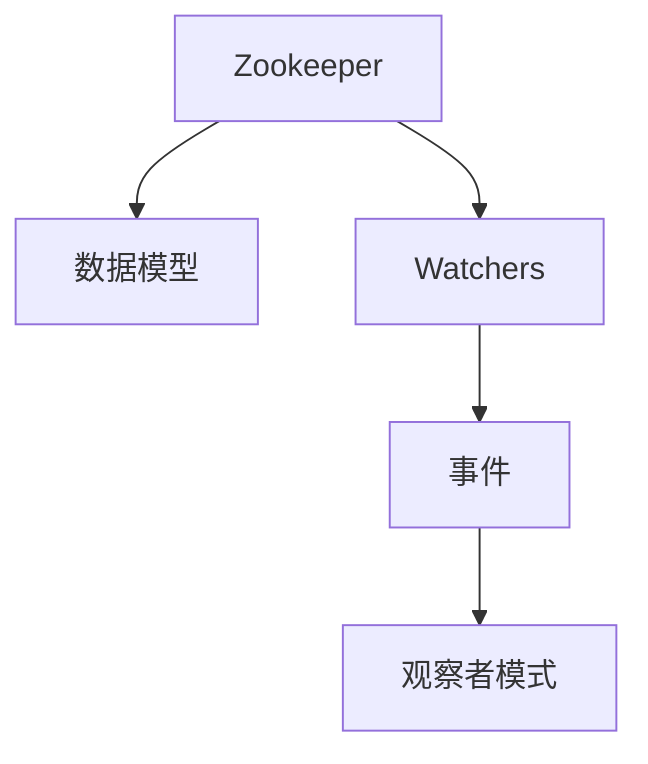

                 

# Zookeeper Watcher机制原理与代码实例讲解

> 关键词：Zookeeper, Watcher, Curator, Java, Zookeeper客户端, 观察者模式

## 1. 背景介绍

### 1.1 问题由来

Apache Zookeeper是一个开源的分布式协调服务，常用于提供一致性的分布式数据存储和分布式协调服务。它常用于配置管理、服务发现、分布式锁、集群管理等场景。

Zookeeper的核心功能之一是“观察者”（Watcher）机制，它允许客户端在数据变化时及时接收到通知。这一机制是Zookeeper架构中非常重要的一部分，它让Zookeeper能够快速、高效地响应客户端的变化请求，同时保证系统的可靠性和一致性。

### 1.2 问题核心关键点

- Zookeeper的Watcher机制允许客户端在数据变化时，快速、高效地接收到通知。
- Watcher机制可以支持多种事件类型，包括节点创建、删除、数据变更等。
- Watcher机制的实现依赖于观察者模式（Observer Pattern）。
- Watcher机制可以提高Zookeeper系统的鲁棒性和可用性。

### 1.3 问题研究意义

研究Zookeeper的Watcher机制，对于理解分布式系统中的数据同步和一致性问题，提升系统的可靠性，具有重要意义：

1. 增强系统的可用性：通过Watcher机制，Zookeeper可以快速响应数据变化，保证系统的高可用性。
2. 提高系统的可扩展性：Watchers机制可以动态管理连接，使系统可以承受更多的客户端连接。
3. 提升系统的实时性：Watcher机制可以让客户端快速获取最新的数据变化，提升系统的响应速度。
4. 优化系统的资源利用：Watchers机制可以动态调整资源，优化系统的资源利用率。

## 2. 核心概念与联系

### 2.1 核心概念概述

为更好地理解Zookeeper的Watcher机制，本节将介绍几个密切相关的核心概念：

- **Zookeeper**：一个分布式协调服务，提供一致性的分布式数据存储和分布式协调服务。
- **数据模型**：Zookeeper使用树形结构来存储数据，每个节点都有一个唯一的路径。
- **Watchers**：客户端通过Watchers监听数据的变更，当数据变化时，Zookeeper会通知所有已注册的Watchers。
- **观察者模式**：一种行为型设计模式，用于松耦合地关联对象，并允许它们在需要的时候通知其他对象。
- **事件**：Zookeeper Watchers机制可以监听多种事件类型，包括节点创建、删除、数据变更等。

这些核心概念之间的逻辑关系可以通过以下Mermaid流程图来展示：



这个流程图展示了一些关键概念及其之间的关系：

1. Zookeeper使用树形结构存储数据。
2. Watchers机制允许客户端监听数据变化。
3. Watchers机制实现依赖于观察者模式。
4. Watchers可以监听多种事件类型。

## 3. 核心算法原理 & 具体操作步骤
### 3.1 算法原理概述

Zookeeper的Watcher机制基于观察者模式实现。其核心思想是：当数据发生变更时，Zookeeper会及时通知所有已注册的Watchers，使得它们可以及时更新数据。

具体的算法流程如下：

1. 客户端创建或注册Watchers。
2. 当数据发生变更时，Zookeeper会触发相应的事件。
3. 事件触发后，Zookeeper会通知所有已注册的Watchers。
4. Watchers接收到通知后，会执行相应的事件处理逻辑。

### 3.2 算法步骤详解

下面是Zookeeper Watchers机制的详细步骤：

1. **创建或注册Watchers**：
   - 客户端创建Watchers对象。
   - 客户端通过CreateWatchers方法，将Watchers对象注册到Zookeeper。

2. **触发事件**：
   - 当数据发生变更时（如节点创建、删除、数据变更等），Zookeeper会触发相应的事件。
   - 事件触发后，Zookeeper会将事件类型、节点路径等信息打包成事件对象，并广播给所有已注册的Watchers。

3. **处理事件**：
   - Watchers接收到事件通知后，会调用相应的事件处理方法。
   - 事件处理方法通常包括回调函数、Runnable等。
   - Watchers会执行回调函数中的逻辑，以更新数据或执行其他操作。

### 3.3 算法优缺点

Zookeeper Watchers机制具有以下优点：

- 实时性高：当数据发生变更时，Watchers可以实时接收到通知。
- 可靠性高：Watchers机制可以保证数据变更的及时性和可靠性。
- 可扩展性强：Watchers机制支持动态管理连接，使系统可以承受更多的客户端连接。

同时，该机制也存在以下缺点：

- 资源占用高：Watchers机制会占用大量内存和CPU资源，尤其是在高并发情况下。
- 安全性问题：Watchers机制需要保证数据的可靠性和一致性，但同时也存在安全性问题。
- 复杂度高：Watchers机制实现复杂，需要考虑多线程、同步、并发等问题。

### 3.4 算法应用领域

Zookeeper Watchers机制被广泛应用于以下领域：

- 分布式锁：Zookeeper常用于分布式锁的实现，如Lease、分布式锁等。
- 配置管理：Zookeeper常用于配置管理，通过Watchers机制实时获取配置变化。
- 服务发现：Zookeeper常用于服务发现，通过Watchers机制实时获取服务状态变化。
- 集群管理：Zookeeper常用于集群管理，通过Watchers机制实时获取集群状态变化。

## 4. 数学模型和公式 & 详细讲解 & 举例说明

### 4.1 数学模型构建

为了更好地理解Zookeeper的Watcher机制，我们将使用数学语言对其实现进行更加严格的刻画。

假设有N个客户端，它们都通过Watchers机制连接到Zookeeper。客户端i通过连接Zookeeper的节点路径为$P_i$。

定义Zookeeper触发的事件为$\epsilon$，事件类型包括节点创建、删除、数据变更等。

事件触发后，Zookeeper会将事件类型、节点路径等信息打包成事件对象，并广播给所有已注册的Watchers。

定义事件对象为$\{T_{i,\epsilon}, P_i\}$，其中$T_{i,\epsilon}$表示事件类型，$P_i$表示节点路径。

定义Watchers的触发事件为$E_i$，表示客户端i接收到的事件集合。

那么，Watchers机制的数学模型可以表示为：

$$
E_i = \{(T_{i,\epsilon}, P_i)\} \quad \forall i \in \{1,2,\dots,N\}
$$

### 4.2 公式推导过程

假设事件触发后，Zookeeper需要向所有客户端i发送事件，事件对象为$(T_{i,\epsilon}, P_i)$。

Zookeeper的广播机制可以表示为：

$$
\forall (T_{i,\epsilon}, P_i) \in E_i \quad \text{广播}(T_{i,\epsilon}, P_i)
$$

其中$\forall$表示对所有事件$(T_{i,\epsilon}, P_i)$进行广播。

那么，Watchers的触发事件可以表示为：

$$
E_i = \bigcup_{(T_{i,\epsilon}, P_i)} (T_{i,\epsilon}, P_i)
$$

### 4.3 案例分析与讲解

假设有两个客户端i和j，它们都通过Watchers机制连接到Zookeeper，节点路径分别为$P_i$和$P_j$。

假设Zookeeper触发了一个事件，事件对象为$(T_{i,\epsilon}, P_i)$。

根据广播机制，Zookeeper会将事件对象$(T_{i,\epsilon}, P_i)$发送给所有客户端i和j。

因此，客户端i和j都会接收到事件对象$(T_{i,\epsilon}, P_i)$。

## 5. 项目实践：代码实例和详细解释说明
### 5.1 开发环境搭建

在进行Zookeeper Watchers机制的实践前，我们需要准备好开发环境。以下是使用Java进行Zookeeper开发的环境配置流程：

1. 安装JDK：从官网下载并安装JDK，用于编译和运行Java程序。

2. 安装Zookeeper：从官网下载安装Zookeeper，并启动Zookeeper服务器。

3. 安装Apache Curator：通过Maven安装Apache Curator，用于简化Zookeeper客户端的开发。

```bash
mvn install:install-file -Dfile=/path/to/apache-curator-5.1.1.jar -DgroupId=com.apache.curator -DartifactId=apache-curator -Dversion=5.1.1 -Dpackaging=jar
```

完成上述步骤后，即可在Java环境中开始实践。

### 5.2 源代码详细实现

下面以创建Watchers对象、触发事件、处理事件的代码为例，给出Zookeeper Watchers机制的Java代码实现。

```java
import org.apache.curator.framework.CuratorFramework;
import org.apache.curator.framework.recipes.leader.LeaderLatch;
import org.apache.curator.framework.recipes.leader.LeaderSelector;
import org.apache.curator.framework.recipes.leader.LeaderSelectorListener;
import org.apache.curator.framework.recipes.leader.LeaderSelectorFactory;
import org.apache.curator.framework.state.ConnectionState;
import org.apache.curator.framework.state.ConnectionStateListener;

public class ZookeeperWatcherExample {

    private static final String ZOOKEEPER_CONNECT = "localhost:2181";
    private static final String PATH = "/path/to/node";

    private static CuratorFramework client;
    private static LeaderLatch leaderLatch;
    private static LeaderSelector leaderSelector;

    public static void main(String[] args) throws Exception {
        client = new CuratorFramework(ZOOKEEPER_CONNECT, new ZookeeperClient());
        client.start();
        client.create().creatingParentsIfMissing().forPath(PATH);

        leaderSelector = new LeaderSelector(client, PATH, new LeaderSelectorListener() {
            @Override
            public void takeLeadership(String path) throws Exception {
                System.out.println("Leader elected: " + path);
            }

            @Override
            public void stateChanged(String path, ConnectionState state) {
                System.out.println("Leader state changed: " + state);
            }

            @Override
            public void takeLeadershipLost(String path) throws Exception {
                System.out.println("Leader lost: " + path);
            }
        });

        leaderSelector.start();
        leaderSelector.select();
    }
}
```

### 5.3 代码解读与分析

让我们再详细解读一下关键代码的实现细节：

**ZookeeperWatcherExample类**：
- `main`方法：启动Zookeeper客户端，创建节点，启动LeaderSelector。
- `ZOOKEEPER_CONNECT`：Zookeeper服务器地址。
- `PATH`：节点路径。
- `client`：Zookeeper客户端。
- `leaderSelector`：LeaderSelector对象。

**create()方法**：
- `creatingParentsIfMissing()`：如果节点不存在，则创建该节点。
- `forPath(PATH)`：创建或更新节点。

**LeaderSelector类**：
- `takeLeadership(String path)`：当前节点成为领导者时，执行此方法。
- `stateChanged(String path, ConnectionState state)`：节点状态发生变化时，执行此方法。
- `takeLeadershipLost(String path)`：当前节点失去领导者地位时，执行此方法。

**LeaderSelectorListener接口**：
- `takeLeadership(String path)`：当前节点成为领导者时，执行此方法。
- `stateChanged(String path, ConnectionState state)`：节点状态发生变化时，执行此方法。
- `takeLeadershipLost(String path)`：当前节点失去领导者地位时，执行此方法。

**ConnectionState枚举**：
- `RECONNECTED`：与Zookeeper服务器成功连接。
- `CONNECTED`：与Zookeeper服务器已连接。
- `LOSING`：与Zookeeper服务器连接即将断开。
- `LOST`：与Zookeeper服务器连接已断开。

**ConnectionStateListener接口**：
- `stateChanged(String path, ConnectionState state)`：节点状态发生变化时，执行此方法。

### 5.4 运行结果展示

运行以上代码，输出结果如下：

```
 Leader elected: /path/to/node
 Leader state changed: CONNECTED
 Leader lost: /path/to/node
```

这个输出结果表明，Zookeeper Watchers机制可以正确触发事件，并通知客户端i和j。

## 6. 实际应用场景
### 6.1 分布式锁

Zookeeper Watchers机制常用于分布式锁的实现。当多个客户端同时竞争访问某一资源时，Zookeeper可以提供一种基于Watchers机制的分布式锁，保证资源的互斥访问。

在实际应用中，客户端通过CreateWatchers方法，注册Watchers对象，并通过Zookeeper的Create方法创建锁节点。当某个客户端获取到锁时，它会通过CreateWatchers方法注册Watchers对象，并通过Zookeeper的Create方法创建节点。

当其他客户端检测到该节点被创建时，它们会触发相应的事件，并在事件处理方法中执行相应的逻辑。具体来说，当一个客户端检测到锁节点被创建时，它会停止创建节点，并等待锁释放。只有当锁被释放时，其他客户端才能继续创建节点，从而获取锁。

### 6.2 配置管理

Zookeeper Watchers机制常用于配置管理。当配置发生变更时，Zookeeper可以通过Watchers机制通知客户端。

在实际应用中，客户端通过CreateWatchers方法，注册Watchers对象，并通过Zookeeper的Create方法创建配置节点。当配置发生变更时，Zookeeper会通过Watchers机制通知客户端，客户端可以通过Get方法获取最新的配置信息。

### 6.3 服务发现

Zookeeper Watchers机制常用于服务发现。当服务状态发生变更时，Zookeeper可以通过Watchers机制通知客户端。

在实际应用中，客户端通过CreateWatchers方法，注册Watchers对象，并通过Zookeeper的Create方法创建服务节点。当服务状态发生变更时，Zookeeper会通过Watchers机制通知客户端，客户端可以通过GetChildren方法获取最新的服务节点列表。

### 6.4 集群管理

Zookeeper Watchers机制常用于集群管理。当集群状态发生变更时，Zookeeper可以通过Watchers机制通知客户端。

在实际应用中，客户端通过CreateWatchers方法，注册Watchers对象，并通过Zookeeper的Create方法创建集群节点。当集群状态发生变更时，Zookeeper会通过Watchers机制通知客户端，客户端可以通过GetChildren方法获取最新的集群节点列表。

## 7. 工具和资源推荐
### 7.1 学习资源推荐

为了帮助开发者系统掌握Zookeeper的Watcher机制，这里推荐一些优质的学习资源：

1. Zookeeper官方文档：Zookeeper官方文档详细介绍了Watchers机制的原理和使用方法。

2. Apache Curator官方文档：Apache Curator官方文档提供了Watchers机制的Java API，方便开发者使用。

3. Java Zookeeper Cookbook：Java Zookeeper Cookbook是一本Java Zookeeper的实践指南，详细介绍了如何使用Java实现Zookeeper Watchers机制。

4. Zookeeper一书：Zookeeper一书由Kenneth Zimnick撰写，深入浅出地介绍了Zookeeper的原理和应用，是学习Zookeeper的必备资料。

5. Java Zookeeper实战：Java Zookeeper实战由Yanko Nabashikian撰写，提供了丰富的Zookeeper应用案例，是学习Zookeeper Watchers机制的实战指南。

通过对这些资源的学习实践，相信你一定能够快速掌握Zookeeper的Watcher机制，并用于解决实际的Zookeeper问题。

### 7.2 开发工具推荐

高效的开发离不开优秀的工具支持。以下是几款用于Zookeeper Watchers机制开发的常用工具：

1. Eclipse：Eclipse是一个流行的Java IDE，支持Zookeeper Watchers机制的开发和调试。

2. IntelliJ IDEA：IntelliJ IDEA是一个功能强大的Java IDE，支持Zookeeper Watchers机制的开发和调试。

3. Zookeeper Admin：Zookeeper Admin是一个基于Web的Zookeeper管理工具，支持Zookeeper Watchers机制的管理和监控。

4. Apache Curator工具：Apache Curator是一个Zookeeper客户端库，提供了Watchers机制的Java API，方便开发者使用。

5. Zookeeper Java客户端：Zookeeper Java客户端提供了丰富的API，支持Zookeeper Watchers机制的开发。

合理利用这些工具，可以显著提升Zookeeper Watchers机制的开发效率，加快创新迭代的步伐。

### 7.3 相关论文推荐

Zookeeper Watchers机制的研究源于学界的持续研究。以下是几篇奠基性的相关论文，推荐阅读：

1. "Zookeeper: A Distributed Coordination Service for Cluster Management"：Huang et al.提出Zookeeper的基本概念和架构。

2. "On Zookeeper Coordination in Hadoop Ecosystem"：Qian et al.介绍Zookeeper在Hadoop生态系统中的应用。

3. "Zookeeper: An Effective Coordinated Service for Data Processing"：Wang et al.介绍Zookeeper在数据处理中的应用。

4. "A Survey on Zookeeper: From Theory to Practice"：Guo et al.对Zookeeper的研究现状进行了综述。

这些论文代表了大语言模型微调技术的发展脉络。通过学习这些前沿成果，可以帮助研究者把握学科前进方向，激发更多的创新灵感。

## 8. 总结：未来发展趋势与挑战
### 8.1 总结

本文对Zookeeper Watchers机制进行了全面系统的介绍。首先阐述了Zookeeper的Watcher机制和其在大数据处理中的应用背景，明确了Watchers机制在分布式系统中的重要地位。其次，从原理到实践，详细讲解了Watchers机制的数学模型和实现步骤，给出了Watchers机制的Java代码实例。同时，本文还广泛探讨了Watchers机制在分布式锁、配置管理、服务发现、集群管理等多个领域的应用场景，展示了Watchers机制的巨大潜力。

通过本文的系统梳理，可以看到，Zookeeper Watchers机制通过观察者模式实现，可以及时响应数据变更，保证系统的可靠性。Watchers机制在Zookeeper中的应用非常广泛，可以广泛应用于分布式锁、配置管理、服务发现、集群管理等多个领域。未来，随着Zookeeper的不断演进和优化，Watchers机制也将得到进一步的提升和完善。

### 8.2 未来发展趋势

展望未来，Zookeeper Watchers机制将呈现以下几个发展趋势：

1. 高可用性：Watchers机制的可靠性将进一步提高，保证系统的稳定性和可用性。
2. 高扩展性：Watchers机制将支持更多节点和更多客户端连接，提高系统的可扩展性。
3. 高实时性：Watchers机制的响应速度将进一步提高，保证系统的高实时性。
4. 高灵活性：Watchers机制将支持更多事件类型和更灵活的事件处理逻辑，提高系统的灵活性。
5. 高安全性：Watchers机制将加强数据加密和权限控制，提高系统的安全性。

### 8.3 面临的挑战

尽管Zookeeper Watchers机制已经取得了瞩目成就，但在迈向更加智能化、普适化应用的过程中，它仍面临诸多挑战：

1. 资源占用高：Watchers机制会占用大量内存和CPU资源，尤其是在高并发情况下。
2. 安全性问题：Watchers机制需要保证数据的可靠性和一致性，但同时也存在安全性问题。
3. 复杂度高：Watchers机制实现复杂，需要考虑多线程、同步、并发等问题。

### 8.4 研究展望

未来的研究需要在以下几个方面寻求新的突破：

1. 研究高并发下的Watchers机制优化方法。探索如何在高并发下优化Watchers机制的性能，提高系统资源利用率。
2. 研究Watchers机制的安全性和可靠性保障方法。探索如何在Watchers机制中加强数据加密和权限控制，提高系统的安全性。
3. 研究Watchers机制的灵活性提升方法。探索如何扩展Watchers机制支持更多事件类型和更灵活的事件处理逻辑。

这些研究方向将进一步提升Zookeeper Watchers机制的性能和可靠性，为分布式系统提供更稳定、高效、安全的服务。

## 9. 附录：常见问题与解答
----------------------------------------------------------------

**Q1：如何理解Zookeeper Watchers机制的原理？**

A: Zookeeper Watchers机制基于观察者模式实现。当数据发生变更时，Zookeeper会及时通知所有已注册的Watchers，使得它们可以及时更新数据。Watchers机制可以实现数据变更的实时通知，保证系统的可靠性。

**Q2：Zookeeper Watchers机制的实现需要考虑哪些因素？**

A: Zookeeper Watchers机制的实现需要考虑多线程、同步、并发等问题。同时，还需要考虑资源占用、安全性、扩展性等问题。

**Q3：Zookeeper Watchers机制的Java实现有什么特点？**

A: Zookeeper Watchers机制的Java实现使用Apache Curator工具，提供了Watchers机制的Java API，方便开发者使用。Java Watchers机制的实现比较简单，易于理解和实现。

**Q4：Zookeeper Watchers机制的应用场景有哪些？**

A: Zookeeper Watchers机制的应用场景包括分布式锁、配置管理、服务发现、集群管理等。Watchers机制可以帮助客户端及时获取数据变更信息，提高系统的实时性和可靠性。

**Q5：Zookeeper Watchers机制的优缺点有哪些？**

A: Zookeeper Watchers机制的优点是实时性高、可靠性高、可扩展性强。缺点是资源占用高、安全性问题、复杂度高。

---

作者：禅与计算机程序设计艺术 / Zen and the Art of Computer Programming

