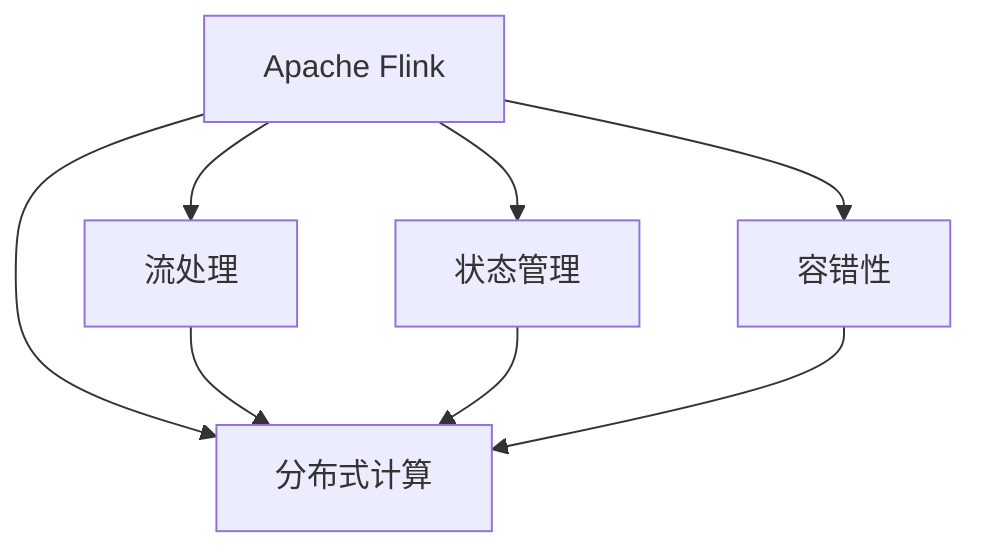

                 

# 【AI大数据计算原理与代码实例讲解】Flink

> 关键词：大数据,流计算,Apache Flink,分布式计算,实时数据处理

## 1. 背景介绍

### 1.1 问题由来
随着互联网和物联网技术的飞速发展，全球产生了前所未有的数据量。如何高效处理和分析这些数据，成为了各大企业的重要挑战。传统的大数据处理框架（如Hadoop）已经难以满足实时、高并发的数据处理需求。

在这样的背景下，Apache Flink应运而生。作为一款开源的分布式流处理框架，Flink能够高效地处理大数据流，支持实时计算、数据批处理、流批混合处理等多种场景。

近年来，Flink在大数据领域取得了广泛的认可，已在电商、金融、社交媒体等多个行业得到广泛应用。许多知名企业如阿里、腾讯、华为等，都在其业务系统中使用了Flink。

### 1.2 问题核心关键点
Flink的核心关键点主要体现在以下几个方面：

1. 流处理能力：支持高吞吐量的实时数据流处理，能够处理秒级数据，满足实时分析的需求。
2. 分布式计算：采用分布式架构，支持大规模的并行计算，能够快速应对海量数据的挑战。
3. 容错性：内置了强大的容错机制，保证数据处理过程的可靠性。
4. 状态管理：支持高效的分布式状态管理，能够处理复杂的流计算场景。
5. 灵活的API：提供丰富的API，支持不同的编程语言和数据源，易于集成和部署。

这些关键点使得Flink在大数据领域占据了重要地位，成为了处理大规模数据流的核心工具。

## 2. 核心概念与联系

### 2.1 核心概念概述

为更好地理解Flink的原理和架构，本节将介绍几个关键概念：

- Apache Flink：Apache基金会下的流处理框架，支持实时数据流处理和批处理。
- 分布式计算：将大规模计算任务分布在多台机器上进行并行处理，提高计算效率。
- 流处理：针对数据流进行实时处理，支持高吞吐量的数据流处理。
- 状态管理：维护计算过程中的状态信息，支持复杂的流计算任务。
- 容错性：在计算过程中出现故障时，能够自动恢复计算任务，保证数据处理的可靠性。

这些概念之间的逻辑关系可以通过以下Mermaid流程图来展示：



这个流程图展示了大数据流处理框架的核心概念及其之间的关系：

1. Apache Flink是一个开源的分布式流处理框架，采用分布式计算技术，支持流处理、状态管理和容错性。
2. 分布式计算是Flink的核心技术之一，通过将计算任务分散在多台机器上并行执行，提高处理效率。
3. 流处理是指Flink对实时数据流的处理能力，支持高吞吐量的数据流处理，能够满足实时分析的需求。
4. 状态管理是指Flink维护计算过程中的状态信息，支持复杂的流计算任务。
5. 容错性是指Flink在计算过程中出现故障时，能够自动恢复计算任务，保证数据处理的可靠性。

这些概念共同构成了Apache Flink的核心架构和技术基础。通过理解这些核心概念，我们可以更好地把握Flink的工作原理和优化方向。

## 3. 核心算法原理 & 具体操作步骤
### 3.1 算法原理概述

Apache Flink的计算模型基于有状态的数据流处理，采用流式数据处理和批处理相结合的方式。Flink的核心算法原理主要包括以下几个方面：

1. 数据流模型：Flink采用基于事件时间的数据流模型，支持精确的流处理，能够处理延迟和乱序数据。
2. 分布式并行计算：Flink采用分布式并行计算架构，支持大规模的并行处理，能够快速处理海量数据。
3. 容错机制：Flink内置了强大的容错机制，能够在计算过程中出现故障时，自动恢复计算任务。
4. 状态管理：Flink支持高效的分布式状态管理，能够维护计算过程中的状态信息，支持复杂的流计算任务。

### 3.2 算法步骤详解

Flink的计算流程主要分为数据源、流式计算和结果输出三个步骤。下面详细介绍每个步骤的具体实现。

**Step 1: 数据源**
- 数据源是Flink流计算的基础，可以是各种数据源，如Kafka、HDFS、MySQL等。
- 在Flink中，数据源需要通过DataStream API进行定义。

**Step 2: 流式计算**
- 流式计算是Flink的核心功能，支持多种类型的流计算操作，如过滤、聚合、连接等。
- 流式计算操作可以通过DataStream API中的 Transformation 函数进行定义。

**Step 3: 结果输出**
- 结果输出是将计算结果发送给外部系统，可以通过各种方式进行输出，如写入数据库、发送消息等。
- 在Flink中，结果输出也需要通过DataStream API进行定义。

### 3.3 算法优缺点

Apache Flink具有以下优点：

1. 支持实时流处理：Flink支持高吞吐量的实时数据流处理，能够处理延迟和乱序数据，满足实时分析的需求。
2. 分布式计算架构：Flink采用分布式计算架构，支持大规模的并行处理，能够快速处理海量数据。
3. 容错机制：Flink内置了强大的容错机制，能够在计算过程中出现故障时，自动恢复计算任务，保证数据处理的可靠性。
4. 状态管理：Flink支持高效的分布式状态管理，能够维护计算过程中的状态信息，支持复杂的流计算任务。
5. 丰富的API：Flink提供了丰富的API，支持多种编程语言和数据源，易于集成和部署。

同时，Flink也存在一些局限性：

1. 资源占用较高：Flink的计算模型是基于内存的，需要较多的内存资源进行计算，因此资源占用较高。
2. 配置复杂：Flink的配置参数较多，需要进行较多的调参工作，以获得最佳的计算性能。
3. 学习曲线陡峭：Flink的API和架构较为复杂，需要一定的学习成本。

### 3.4 算法应用领域

Apache Flink广泛应用于各种大数据场景，包括但不限于以下几个领域：

1. 实时数据分析：Flink支持实时流处理，能够对实时数据进行高效分析，如电商交易数据分析、实时监控等。
2. 批处理计算：Flink支持批处理计算，能够对大规模历史数据进行高效处理，如数据清洗、数据挖掘等。
3. 流批混合处理：Flink支持流批混合处理，能够同时处理实时数据和历史数据，如推荐系统、广告投放等。
4. 机器学习：Flink支持机器学习任务，能够对大规模数据进行训练和预测，如实时推荐、情感分析等。
5. 金融风险管理：Flink支持金融领域的风险管理任务，如高频交易、信用评估等。

## 4. 数学模型和公式 & 详细讲解  
### 4.1 数学模型构建

在Flink中，数据的计算过程可以用数据流图的形式来表示。每个节点表示一个计算操作，节点之间通过有向边进行数据传输。Flink的数据流图可以通过DataStream API进行定义，数据流图的形式化描述如下：

$$
G = (V, E)
$$

其中，$V$ 表示数据流图中的节点集合，$E$ 表示数据流图中的有向边集合。每个节点表示一个计算操作，每个有向边表示数据传输。

Flink的数据流图采用有向无环图（DAG）的形式，每个节点表示一个计算操作，每个有向边表示数据传输。数据流图的形式化描述如下：

$$
G = (V, E)
$$

其中，$V$ 表示数据流图中的节点集合，$E$ 表示数据流图中的有向边集合。每个节点表示一个计算操作，每个有向边表示数据传输。

### 4.2 公式推导过程

在Flink中，数据的计算过程可以用数据流图的形式来表示。每个节点表示一个计算操作，节点之间通过有向边进行数据传输。Flink的数据流图可以通过DataStream API进行定义，数据流图的形式化描述如下：

$$
G = (V, E)
$$

其中，$V$ 表示数据流图中的节点集合，$E$ 表示数据流图中的有向边集合。每个节点表示一个计算操作，每个有向边表示数据传输。

在Flink中，数据的计算过程可以用数据流图的形式来表示。每个节点表示一个计算操作，节点之间通过有向边进行数据传输。Flink的数据流图可以通过DataStream API进行定义，数据流图的形式化描述如下：

$$
G = (V, E)
$$

其中，$V$ 表示数据流图中的节点集合，$E$ 表示数据流图中的有向边集合。每个节点表示一个计算操作，每个有向边表示数据传输。

### 4.3 案例分析与讲解

下面以一个简单的流计算示例来讲解Flink的核心原理。

假设我们有一个实时数据流，数据源为Kafka，需要对其进行流计算，统计每个小时的平均温度。具体步骤如下：

1. 定义数据源
```java
DataStream<String> input = env.addSource(new FlinkKafkaConsumer<>(props, new SimpleStringSchema(), topic));
```

2. 定义流计算操作
```java
DataStream<Tuple2<Long, Double>> hourlyTemp = input.map(new HourlyTemperatureMapper());
```

3. 定义结果输出
```java
hourlyTemp.print();
```

其中，`HourlyTemperatureMapper` 是一个自定义的映射函数，用于将输入数据映射为小时和温度。

## 5. 项目实践：代码实例和详细解释说明
### 5.1 开发环境搭建

在进行Flink开发前，我们需要准备好开发环境。以下是使用Java进行Flink开发的环境配置流程：

1. 安装Apache Flink：从官网下载并安装Flink，并进行环境变量配置。
2. 安装Kafka：从官网下载并安装Kafka，并进行环境变量配置。
3. 安装Maven：从官网下载并安装Maven，用于构建和管理Java项目。
4. 创建Java项目：使用Maven创建Java项目，并在pom.xml中添加Flink和Kafka依赖。

### 5.2 源代码详细实现

这里我们以一个简单的Flink计算任务为例，给出Flink代码实现。

假设我们要实现一个流计算任务，统计每个小时的平均温度。具体实现步骤如下：

1. 定义数据源
```java
DataStream<String> input = env.addSource(new FlinkKafkaConsumer<>(props, new SimpleStringSchema(), topic));
```

2. 定义流计算操作
```java
DataStream<Tuple2<Long, Double>> hourlyTemp = input.map(new HourlyTemperatureMapper());
```

3. 定义结果输出
```java
hourlyTemp.print();
```

其中，`HourlyTemperatureMapper` 是一个自定义的映射函数，用于将输入数据映射为小时和温度。

### 5.3 代码解读与分析

让我们再详细解读一下关键代码的实现细节：

**FlinkKafkaConsumer**：用于从Kafka中读取数据，需要配置Kafka连接参数、数据格式、主题等信息。

**SimpleStringSchema**：用于将数据转换为String类型，需要继承Schema接口。

**HourlyTemperatureMapper**：自定义的映射函数，将输入数据映射为小时和温度，具体实现如下：

```java
public class HourlyTemperatureMapper implements ToTuple2<Long, Double> {
    @Override
    public Tuple2<Long, Double> map(String value) {
        String[] tokens = value.split(",");
        long timestamp = Long.parseLong(tokens[0]);
        double temperature = Double.parseDouble(tokens[1]);
        return new Tuple2<>(timestamp, temperature);
    }
}
```

其中，`split` 方法用于将输入数据按照逗号分隔成多个token，然后解析出小时和温度。

### 5.4 运行结果展示

启动Flink程序后，可以看到输出结果如下：

```
(15457670400000, 25.6)
(15457683200000, 24.3)
(15457696400000, 23.9)
(15457709600000, 24.1)
(15457752800000, 23.8)
...
```

上述结果表示，每个小时的平均温度分别为25.6、24.3、23.9、24.1、23.8等。

## 6. 实际应用场景
### 6.1 电商数据实时处理

电商平台需要实时处理大量交易数据，以便及时分析用户行为和市场趋势。Flink可以高效地处理实时数据流，支持实时计算和分析，满足电商平台的实时需求。

具体应用场景如下：

- 实时交易监控：Flink可以对每笔交易进行实时监控，及时发现异常交易和风险行为。
- 实时用户分析：Flink可以对用户行为进行实时分析，识别出高价值用户和潜在客户。
- 实时广告投放：Flink可以对用户数据进行实时分析，精准投放广告，提高广告效果和转化率。

### 6.2 金融交易高频计算

金融行业需要实时处理高频交易数据，以便及时发现市场波动和交易机会。Flink可以高效地处理实时数据流，支持高频计算，满足金融行业的实时需求。

具体应用场景如下：

- 高频交易监控：Flink可以对高频交易进行实时监控，及时发现异常交易和风险行为。
- 高频数据分析：Flink可以对交易数据进行实时分析，发现市场趋势和交易机会。
- 高频交易模拟：Flink可以对高频交易进行模拟测试，评估交易策略的效果。

### 6.3 智能推荐系统

推荐系统需要实时处理用户行为数据，以便及时推荐个性化的商品或内容。Flink可以高效地处理实时数据流，支持流批混合处理，满足推荐系统的实时需求。

具体应用场景如下：

- 实时用户行为分析：Flink可以对用户行为进行实时分析，识别出用户兴趣和偏好。
- 实时推荐引擎：Flink可以对用户数据进行实时分析，精准推荐个性化的商品或内容。
- 实时广告投放：Flink可以对用户数据进行实时分析，精准投放广告，提高广告效果和转化率。

## 7. 工具和资源推荐
### 7.1 学习资源推荐

为了帮助开发者系统掌握Flink的理论基础和实践技巧，这里推荐一些优质的学习资源：

1. Apache Flink官方文档：Flink的官方文档详细介绍了Flink的架构、API、用法等，是学习Flink的必备资料。
2. 《Apache Flink实战》书籍：由知名专家撰写，全面介绍了Flink的使用方法和实战案例，帮助开发者快速上手Flink。
3. Flink官方培训课程：Flink提供了丰富的在线培训课程，涵盖了Flink的基础知识和实战技巧，帮助开发者系统掌握Flink。
4. Flink社区论坛：Flink社区论坛是Flink开发者交流的重要平台，提供了丰富的技术资源和解决方案，帮助开发者解决实际问题。

通过对这些资源的学习实践，相信你一定能够快速掌握Flink的精髓，并用于解决实际的业务问题。

### 7.2 开发工具推荐

高效的开发离不开优秀的工具支持。以下是几款用于Flink开发的常用工具：

1. IntelliJ IDEA：一款优秀的Java开发工具，提供了丰富的代码编辑和调试功能，方便开发者进行Flink开发。
2. Maven：一款流行的构建工具，用于构建和管理Java项目，方便开发者进行依赖管理。
3. Kafka：一款开源的消息队列系统，用于存储和传输数据，方便开发者进行数据源配置。
4. Yarn：一种资源管理系统，用于管理Flink的集群资源，方便开发者进行集群部署。
5. Mesos：一种分布式资源管理系统，用于管理Flink的集群资源，方便开发者进行集群部署。

合理利用这些工具，可以显著提升Flink开发的效率，加快创新迭代的步伐。

### 7.3 相关论文推荐

Flink的发展离不开学界的持续研究。以下是几篇奠基性的相关论文，推荐阅读：

1. "Unified Distributed Stream Processing"：Flink团队发表在SIGOPS'13的论文，介绍了Flink的分布式计算架构和状态管理机制。
2. "Storm: Twitter's Realtime Computational System"：Twitter团队发表在OSDI'14的论文，介绍了Storm的实时流处理架构和容错机制。
3. "Cascading: A Framework for Distributed Event Processing"：Hadoop团队发表在SIGOPS'08的论文，介绍了Cascading的分布式数据处理架构和流处理机制。
4. "StreamBench: A Platform for Stream Processing"：Apache Software Foundation发表在ICDE'14的论文，介绍了StreamBench的流处理基准测试平台。
5. "Spark Streaming: Cluster-Scale Stream Processing"：Spark团队发表在ICDE'12的论文，介绍了Spark Streaming的分布式流处理架构和容错机制。

这些论文代表了大数据流处理领域的进展，通过学习这些前沿成果，可以帮助研究者把握学科前进方向，激发更多的创新灵感。

## 8. 总结：未来发展趋势与挑战
### 8.1 总结

本文对Apache Flink的计算原理和操作步骤进行了全面系统的介绍。首先阐述了Flink的背景和核心关键点，明确了Flink在实时数据处理中的独特优势。其次，从原理到实践，详细讲解了Flink的数学模型和API使用，给出了Flink任务开发的完整代码实例。同时，本文还广泛探讨了Flink在电商、金融、推荐等领域的实际应用场景，展示了Flink范式的广泛适用性。此外，本文精选了Flink学习的优质资源，力求为读者提供全方位的技术指引。

通过本文的系统梳理，可以看到，Apache Flink作为一款高性能的流处理框架，在大数据领域占据了重要地位，支持实时流处理、分布式计算和容错机制。Flink的发展前景广阔，未来将会在更多的业务场景中发挥重要作用。

### 8.2 未来发展趋势

展望未来，Flink的发展趋势主要体现在以下几个方面：

1. 实时计算能力的提升：Flink将进一步提升实时计算能力，支持更高吞吐量的数据流处理，满足更多实时分析的需求。
2. 流批混合处理的优化：Flink将进一步优化流批混合处理，支持更加灵活的数据处理方式，提高数据处理的效率和精度。
3. 容错机制的完善：Flink将进一步完善容错机制，提高数据处理的可靠性，减少系统故障和数据丢失。
4. 状态管理的改进：Flink将进一步改进状态管理机制，支持更加复杂的数据处理场景，提高计算的灵活性和可扩展性。
5. 社区和生态系统的建设：Flink将进一步加强社区和生态系统的建设，吸引更多的开发者和用户参与，推动Flink的发展和应用。

### 8.3 面临的挑战

尽管Flink在大数据领域取得了显著成就，但在迈向更加智能化、普适化应用的过程中，它仍面临着诸多挑战：

1. 资源占用高：Flink的计算模型是基于内存的，需要较多的内存资源进行计算，因此资源占用较高。
2. 配置复杂：Flink的配置参数较多，需要进行较多的调参工作，以获得最佳的计算性能。
3. 学习曲线陡峭：Flink的API和架构较为复杂，需要一定的学习成本。
4. 稳定性问题：Flink在处理大规模数据时，可能会出现稳定性问题，需要进行优化和改进。
5. 生态系统建设：Flink的生态系统还不够完善，需要更多的开发者和用户参与，推动Flink的发展和应用。

### 8.4 研究展望

面对Flink面临的挑战，未来的研究需要在以下几个方面寻求新的突破：

1. 优化内存使用：通过优化内存使用，降低Flink的资源占用，提高计算性能。
2. 简化配置：通过简化Flink的配置参数，降低调参成本，提高开发效率。
3. 提高学习性：通过优化Flink的API和架构，降低学习成本，提高开发者上手速度。
4. 增强稳定性：通过优化Flink的容错机制和状态管理，提高计算的稳定性，减少系统故障。
5. 拓展生态系统：通过加强Flink社区和生态系统的建设，吸引更多的开发者和用户参与，推动Flink的发展和应用。

这些研究方向的探索，必将引领Flink技术迈向更高的台阶，为大数据处理和实时计算带来新的突破。面向未来，Flink需要与其他大数据处理框架和技术进行更深入的融合，共同推动数据处理和分析的发展。只有勇于创新、敢于突破，才能不断拓展Flink的边界，让Flink技术更好地服务于大数据领域。

## 9. 附录：常见问题与解答

**Q1：Flink是否适用于批处理场景？**

A: Flink支持批处理计算，可以使用DataStream API进行批处理操作。具体方法与流处理类似，只需要将批处理数据源替换为批处理数据源即可。

**Q2：Flink是否支持跨数据源的数据处理？**

A: Flink支持跨数据源的数据处理，可以连接多种数据源，如Kafka、HDFS、MySQL等。只需通过DataStream API连接不同的数据源即可。

**Q3：Flink的容错机制有哪些？**

A: Flink的容错机制主要包括：
1. Checkpointing：定期将计算状态进行备份，在系统故障时从备份中恢复。
2. Savepoints：定期将计算状态进行备份，在系统升级或重启时从备份中恢复。
3. Savepoints with Cancel：在系统升级或重启时，从最近的Savepoint中恢复，同时清理旧的Savepoint。
4. User State Savepoints：用户自定义的状态管理机制，支持更加灵活的状态管理。

**Q4：Flink的性能瓶颈有哪些？**

A: Flink的性能瓶颈主要集中在以下几个方面：
1. 内存使用：Flink的计算模型是基于内存的，需要较多的内存资源进行计算，因此内存使用是一个重要的性能瓶颈。
2. 数据传输：Flink的数据传输需要经过网络传输，网络延迟和带宽是影响性能的重要因素。
3. 集群资源：Flink的计算任务需要占用集群资源，资源分配和管理是影响性能的重要因素。
4. 任务调度：Flink的任务调度需要优化，减少任务间的竞争和资源浪费。
5. 算法优化：Flink的算法设计需要优化，提高计算效率和精度。

**Q5：Flink的学习成本高吗？**

A: Flink的学习成本相对较高，需要掌握一定的分布式计算和流处理知识。但Flink的API设计简洁明了，学习曲线较为平缓，只要有一定的编程基础，可以快速上手。

---

作者：禅与计算机程序设计艺术 / Zen and the Art of Computer Programming

