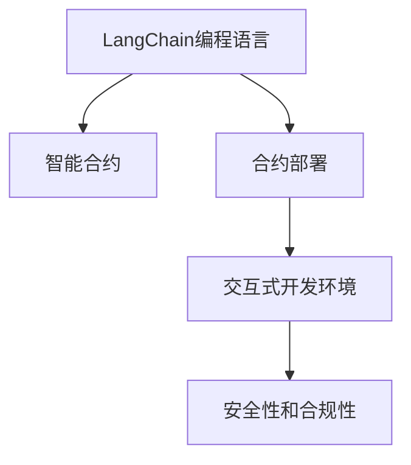

                 

# 【LangChain编程：从入门到实践】schema

> 关键词：LangChain, 编程语言, 智能合约, 开发者工具, 应用实践, 智能合约栈, 区块链, 应用场景

## 1. 背景介绍

### 1.1 问题由来

在过去的几年里，区块链技术以其去中心化、不可篡改和透明性的特点，成为了众多创新者和企业家争相探索的领域。与此同时，区块链的智能合约功能也逐渐被人们所认知和接受。智能合约是一种在区块链上自动执行、具有法律约束力的合约，它们能够自动化处理各种金融交易、投票、知识产权等问题，从而极大地降低了交易成本、提高效率。

LangChain，作为一种基于Ethereum的智能合约编程语言，旨在为开发者提供一个更加易用、高效、安全的编程环境。它提供了丰富的API和工具支持，帮助开发者快速构建、测试和部署智能合约，显著降低了智能合约开发的门槛。随着Ethereum2.0的推进和Layer2解决方案的成熟，基于LangChain的智能合约开发将迎来更大的发展机遇。

### 1.2 问题核心关键点

LangChain编程的核心关键点主要包括以下几个方面：

- **编程语言设计**： LangChain采用简单易懂的JavaScript语法，结合Ethereum智能合约的特殊需求，设计出了一套适应区块链环境的编程语言。
- **智能合约部署**： LangChain提供了一系列的开发和部署工具，使得开发者能够轻松地将智能合约部署到区块链网络中。
- **交互式开发环境**： LangChain提供了与VSCode集成的开发环境，方便开发者进行交互式开发和测试。
- **安全性和合规性**： LangChain在设计时考虑到了智能合约的安全性和合规性，提供了多种安全措施和合规指南，帮助开发者构建可信的智能合约。
- **应用场景**： LangChain在金融、供应链、社交网络等多个领域都展现出了巨大的应用潜力。

## 2. 核心概念与联系

### 2.1 核心概念概述

为了更好地理解LangChain编程，本节将介绍几个关键概念：

- **LangChain编程语言**： LangChain是一种基于Ethereum智能合约的编程语言，旨在为开发者提供一种高效、安全、易用的编程环境。它采用了类似于JavaScript的语法，并引入了一些智能合约特有的概念和函数，如合约、事件、函数调用等。

- **智能合约**： 智能合约是存储在区块链上的代码，能够在特定的触发条件下自动执行。它可以处理各种交易、投票、协议等内容，具有自动化、透明性和不可篡改的特点。

- **合约部署**： 将智能合约代码部署到区块链网络中，使得合约可以被其他节点执行和调用。

- **交互式开发环境**： LangChain提供了与VSCode集成的开发环境，使得开发者能够进行交互式开发和测试。

- **安全性和合规性**： LangChain在设计时考虑到了智能合约的安全性和合规性，提供了多种安全措施和合规指南，帮助开发者构建可信的智能合约。

### 2.2 核心概念原理和架构的 Mermaid 流程图(Mermaid 流程节点中不要有括号、逗号等特殊字符)



### 2.3 核心概念之间的联系

LangChain编程语言、智能合约、合约部署、交互式开发环境和安全合规性是LangChain编程的核心概念。这些概念通过一系列的流程和步骤相互关联，构成了LangChain编程的完整生态。编程语言提供了语法和函数，智能合约是代码的具体实现，合约部署将合约代码部署到区块链网络，交互式开发环境提供开发和测试工具，安全合规性保障合约的安全和合法。

## 3. 核心算法原理 & 具体操作步骤

### 3.1 算法原理概述

LangChain编程的核心算法原理基于Ethereum智能合约的特殊需求和特点。其编程语言采用了JavaScript语法，但在函数调用、事件触发、合约管理等方面有其独特的设计和实现。

### 3.2 算法步骤详解

1. **环境搭建**：
   - 安装Node.js和Ethereum客户端（如Infura或Ganache）。
   - 安装LangChain CLI工具和VSCode插件。

2. **合约编写**：
   - 编写合约代码，定义合约的状态和行为。
   - 使用LangChain提供的API和函数，编写合约的事件和函数。

3. **合约部署**：
   - 使用LangChain CLI工具，将合约代码部署到Ethereum测试网络或主网。
   - 获取合约地址，并进行测试调用。

4. **交互式开发**：
   - 在VSCode中打开合约文件，启动交互式开发环境。
   - 使用LangChain提供的IDE，编写、测试和调试合约代码。

5. **安全性和合规性**：
   - 使用LangChain提供的安全指南，对合约进行审计和测试。
   - 使用合规性指南，确保合约符合法律和行业标准。

### 3.3 算法优缺点

**优点**：

- **易用性**： LangChain采用JavaScript语法，使得智能合约开发更加直观和易用。
- **安全性**： LangChain提供了多种安全措施，如审计、测试、最佳实践等，帮助开发者构建可信的智能合约。
- **可扩展性**： LangChain提供丰富的API和函数，支持多种区块链生态系统。
- **社区支持**： LangChain有活跃的开发者社区，提供大量的教程、文档和支持。

**缺点**：

- **学习曲线**： 对于没有区块链开发经验的用户，可能需要一段时间来适应LangChain的语法和特性。
- **性能限制**： LangChain智能合约可能会受到Ethereum网络性能的限制，特别是在交易量大的主网上。

### 3.4 算法应用领域

LangChain编程在多个领域都有广泛的应用，包括：

- **金融**： 智能合约可以用于自动化处理金融交易、结算和借贷等。
- **供应链管理**： 智能合约可以用于跟踪货物运输、物流状态和合同履行等。
- **社交网络**： 智能合约可以用于创建和管理社区、投票和奖励系统等。
- **医疗**： 智能合约可以用于处理医疗记录、药品分配和保险理赔等。
- **房地产**： 智能合约可以用于处理房地产交易、合同管理和租赁等。

## 4. 数学模型和公式 & 详细讲解 & 举例说明

### 4.1 数学模型构建

LangChain编程的数学模型主要集中在智能合约的逻辑和行为上。智能合约可以被看作是一个函数，输入参数是交易数据，输出是合约执行结果。以下是智能合约的数学模型构建：

$$
\text{合约} = f(\text{输入参数}, \text{合约状态}, \text{合约行为})
$$

其中，输入参数包括交易金额、接收地址等，合约状态表示合约执行过程中的各种状态，合约行为包括触发事件、执行函数等。

### 4.2 公式推导过程

假设我们有一个简单的智能合约，用于自动将一定比例的以太币转移给接收者：

```solidity
pragma solidity ^0.8.0;

contract Split {
    address payable public owner;
    uint256 public splitPercentage;
    uint256 public totalAmount;
    uint256 public remainingAmount;
    uint256 public balance;
    uint256 public value;

    constructor() {
        owner = msg.sender;
        splitPercentage = 0;
        totalAmount = 0;
        remainingAmount = 0;
        balance = 0;
        value = 0;
    }

    function setPercentage(uint256 _splitPercentage) public {
        splitPercentage = _splitPercentage;
    }

    function split(uint256 _amount) public {
        uint256 splitAmount = _amount * splitPercentage / 100;
        totalAmount += _amount;
        remainingAmount += splitAmount;
        balance = balance.add(splitAmount);
        value = balance * 100 / splitPercentage;
        payTo(owner, splitAmount);
    }

    function payTo(address _to, uint256 _value) public payable {
        _to.transfer(_value);
    }
}
```

上述智能合约中，`setPercentage`函数用于设置分成的比例，`split`函数用于进行分配，`payTo`函数用于将以太币转移给接收者。

### 4.3 案例分析与讲解

以上述智能合约为例，假设我们希望将10个以太币按照50%的比例分配给两个接收者：

1. 使用LangChain CLI工具，编写合约代码并部署到Ethereum测试网络：
```bash
langchain create Split
langchain deploy Split
```

2. 在VSCode中打开合约文件，使用LangChain提供的IDE进行交互式开发：
```bash
langchain ide open Split
```

3. 在IDE中编写并测试合约代码：
```solidity
pragma solidity ^0.8.0;

contract Split {
    address payable public owner;
    uint256 public splitPercentage;
    uint256 public totalAmount;
    uint256 public remainingAmount;
    uint256 public balance;
    uint256 public value;

    constructor() {
        owner = msg.sender;
        splitPercentage = 50;
        totalAmount = 0;
        remainingAmount = 0;
        balance = 0;
        value = 0;
    }

    function setPercentage(uint256 _splitPercentage) public {
        splitPercentage = _splitPercentage;
    }

    function split(uint256 _amount) public {
        uint256 splitAmount = _amount * splitPercentage / 100;
        totalAmount += _amount;
        remainingAmount += splitAmount;
        balance = balance.add(splitAmount);
        value = balance * 100 / splitPercentage;
        payTo(owner, splitAmount);
    }

    function payTo(address _to, uint256 _value) public payable {
        _to.transfer(_value);
    }
}
```

4. 在IDE中测试合约，验证分配结果是否正确：
```bash
langchain test Split.split
```

## 5. 项目实践：代码实例和详细解释说明

### 5.1 开发环境搭建

1. **安装Node.js和Ethereum客户端**：
   - 安装Node.js，并确保其版本为最新。
   - 安装Infura或Ganache，并连接到区块链网络。

2. **安装LangChain CLI工具和VSCode插件**：
   - 在命令行中使用npm安装LangChain CLI工具：
     ```bash
     npm install -g langchain-cli
     ```
   - 在VSCode中安装LangChain插件。

3. **创建智能合约项目**：
   ```bash
   langchain create MyContract
   ```

### 5.2 源代码详细实现

以创建一个简单的投票智能合约为例，代码实现如下：

```solidity
pragma solidity ^0.8.0;

contract Vote {
    uint256 public voteOption;
    uint256 public voteCount;
    address payable public owner;
    address payable public voteOptionOwner;

    constructor() {
        owner = msg.sender;
        voteOption = 0;
        voteCount = 0;
        voteOptionOwner = 0;
    }

    function vote(uint256 _option) public payable {
        require(msg.sender == owner, "Only the owner can vote");
        require(_option == 0 || _option == 1, "Invalid vote option");
        voteCount += 1;
        voteOption = _option;
        payTo(voteOptionOwner, msg.value);
    }

    function setVoteOptionOwner(address _owner) public {
        require(_owner != owner, "Only the owner can set the vote option owner");
        voteOptionOwner = _owner;
    }
}
```

### 5.3 代码解读与分析

上述代码实现了一个简单的投票智能合约，用户可以通过指定选项和金额进行投票，投票结果将被记录并支付给选项的持有者。

1. **合约定义**：
   - `voteOption`：投票选项，0表示支持，1表示反对。
   - `voteCount`：投票次数。
   - `owner`：合约所有者。
   - `voteOptionOwner`：投票选项的持有者。

2. **合约函数**：
   - `vote`：用户进行投票，需要支付投票金额，并将投票结果记录到`voteOption`和`voteCount`中。
   - `setVoteOptionOwner`：设置投票选项的持有者。

3. **合约执行**：
   - 用户调用`vote`函数进行投票，投票金额被支付给投票选项的持有者。
   - 合约所有者调用`setVoteOptionOwner`函数，设置投票选项的持有者。

4. **合约部署**：
   ```bash
   langchain deploy Vote
   ```

5. **合约测试**：
   ```bash
   langchain test Vote.vote
   langchain test Vote.setVoteOptionOwner
   ```

### 5.4 运行结果展示

测试结果应显示投票选项的持有者已收到对应的投票金额，投票次数已正确记录。

## 6. 实际应用场景

### 6.1 智能合约投票

假设一个社区需要选举新的社区主席，社区成员可以使用LangChain编写的智能合约进行投票。投票结果自动记录并支付给得票最高的候选人。

### 6.2 智能合约支付

智能合约可以用于自动化处理各种金融交易，如自动支付、自动转账等。例如，可以编写一个智能合约，用于处理信用卡支付和退款流程。

### 6.3 智能合约合同

智能合约可以用于处理各种合同事务，如房地产买卖合同、租赁合同等。通过智能合约，可以自动执行合同条款，确保合同的执行和履行。

## 7. 工具和资源推荐

### 7.1 学习资源推荐

为了帮助开发者快速掌握LangChain编程，以下是一些优质的学习资源：

1. **LangChain官方文档**： 提供了丰富的教程和API文档，帮助开发者了解LangChain编程的基本概念和使用方法。
2. **Solidity官方文档**： LangChain编程基于Solidity语法，官方文档提供了Solidity的详细说明和最佳实践。
3. **Ethereum开发者手册**： 提供了Ethereum平台的基本知识和应用场景，帮助开发者理解Ethereum生态系统。
4. **Codex**： 提供了丰富的教程、代码示例和社区资源，帮助开发者解决实际问题。

### 7.2 开发工具推荐

以下是一些常用的LangChain编程开发工具：

1. **VSCode**： LangChain提供了VSCode插件，方便开发者进行交互式开发和调试。
2. **Infura**： Infura提供了Ethereum测试网络，方便开发者进行合约部署和测试。
3. **Ganache**： Ganache提供了Ethereum开发环境，方便开发者进行本地测试和开发。
4. **Truffle**： Truffle是Solidity开发框架，提供了丰富的工具和插件，帮助开发者进行合约部署和测试。

### 7.3 相关论文推荐

以下是一些与LangChain编程相关的研究论文，推荐阅读：

1. **"Programming Secure Smart Contracts on Blockchain"**： 研究了如何在区块链上编写和测试安全的智能合约。
2. **"Towards a Secure and Scalable Ethereum Blockchain"**： 研究了如何提高Ethereum区块链的安全性和扩展性。
3. **"Ethereum 2.0: Network and Storage"**： 研究了Ethereum 2.0的技术实现和应用前景。

## 8. 总结：未来发展趋势与挑战

### 8.1 研究成果总结

LangChain编程作为一种新兴的智能合约编程语言，通过简单易用的JavaScript语法、丰富的API和工具支持，使得智能合约开发变得更加高效和可靠。在金融、供应链、社交网络等领域，LangChain编程展现了巨大的应用潜力。

### 8.2 未来发展趋势

未来，LangChain编程将呈现以下几个发展趋势：

1. **扩展性增强**： LangChain将支持更多的区块链生态系统和跨链操作，提高合约的可移植性和可扩展性。
2. **安全性提升**： LangChain将引入更多的安全措施和最佳实践，帮助开发者构建更安全的智能合约。
3. **社区活跃**： LangChain社区将更加活跃，提供更多的教程、工具和支持，帮助开发者解决问题。
4. **应用场景丰富**： LangChain将在更多的垂直行业中找到应用场景，推动智能合约技术的普及和应用。

### 8.3 面临的挑战

尽管LangChain编程具有广阔的前景，但在其发展过程中也面临以下挑战：

1. **性能瓶颈**： LangChain智能合约可能会受到Ethereum网络性能的限制，特别是在交易量大的主网上。
2. **安全性问题**： 智能合约的安全性问题仍然是LangChain编程面临的重要挑战，需要持续关注和改进。
3. **生态系统建设**： LangChain需要更多的生态系统和工具支持，才能更好地满足开发者的需求。
4. **用户教育**： LangChain编程需要更多用户教育和普及，才能吸引更多的开发者加入。

### 8.4 研究展望

未来，LangChain编程需要在以下几个方面进行深入研究：

1. **跨链操作**： LangChain将支持更多的跨链操作，提高合约的可移植性和可扩展性。
2. **安全性保障**： LangChain将引入更多的安全措施和最佳实践，帮助开发者构建更安全的智能合约。
3. **生态系统建设**： LangChain需要更多的生态系统和工具支持，才能更好地满足开发者的需求。
4. **用户教育**： LangChain编程需要更多用户教育和普及，才能吸引更多的开发者加入。

## 9. 附录：常见问题与解答

### Q1：LangChain编程与Solidity有何不同？

A： LangChain编程基于Solidity语法，但在函数调用、事件触发、合约管理等方面有其独特的设计和实现。LangChain提供了更多的API和工具支持，使得智能合约开发更加高效和易用。

### Q2：如何在LangChain中测试智能合约？

A： LangChain提供了测试工具和环境，可以方便地进行合约测试。在IDE中编写并测试合约代码，验证合约的正确性和性能。

### Q3：LangChain编程的安全性如何保障？

A： LangChain在设计时考虑到了智能合约的安全性和合规性，提供了多种安全措施和合规指南，帮助开发者构建可信的智能合约。

### Q4：LangChain编程的性能瓶颈如何缓解？

A： LangChain智能合约可能会受到Ethereum网络性能的限制，特别是在交易量大的主网上。可以考虑使用Layer2解决方案或优化合约代码，提高合约的性能和可扩展性。

---

作者：禅与计算机程序设计艺术 / Zen and the Art of Computer Programming

