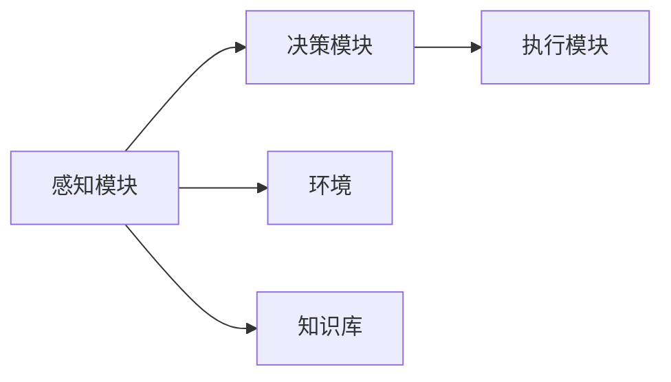

                 

# 【LangChain编程：从入门到实践】智能代理的概念

## 1. 背景介绍

### 1.1 问题由来

智能代理(Agent)是人工智能领域的核心概念之一，用于模拟人类决策行为，通过与环境的交互，做出智能化的决策和响应。在智能代理的研究中，如何使其具备智能、可理解、可操作等特性，成为计算机科学和人工智能领域的重要研究方向。

近年来，随着深度学习技术的成熟，智能代理的研究重点逐渐转移到利用机器学习技术，构建具有自主学习能力的智能系统。尤其是在自然语言处理(NLP)领域，智能代理被广泛应用在聊天机器人、虚拟助手、智能客服等场景中，成为推动NLP技术落地应用的重要力量。

### 1.2 问题核心关键点

智能代理的核心在于如何构建具备自主学习能力的模型，使其能够自动适应环境变化，并在复杂交互中做出智能响应。具体而言，智能代理的研究核心点包括：

- **自主学习**：智能代理应具备从经验中学习的能力，能够根据历史数据和当前情境做出最优决策。
- **智能推理**：代理应能够处理多模态信息，进行逻辑推理和因果分析，做出合理的判断和预测。
- **知识管理**：代理应具备知识获取、存储、检索和融合的能力，利用先验知识进行决策支撑。
- **多任务适应**：代理应能够在多种任务和领域之间进行平滑迁移，具备跨领域适应能力。
- **可解释性**：代理应具备一定的可解释性，能够清晰地表达决策依据，增强用户信任。
- **安全性**：代理应具备一定的安全性，避免恶意攻击和有害行为，确保应用的安全可靠。

### 1.3 问题研究意义

智能代理的研究具有重要的理论意义和实际应用价值：

- **理论意义**：智能代理是人工智能领域的重要分支，研究其自主学习、智能推理等核心技术，有助于推动认知智能的发展，增强人工智能的通用性和泛化性。
- **应用价值**：智能代理在实际应用中，能够显著提升人机交互的智能化水平，助力各行各业数字化转型升级，推动社会进步。

## 2. 核心概念与联系

### 2.1 核心概念概述

在智能代理的研究中，涉及到的核心概念包括：

- **代理模型(Agent Model)**：用于描述代理与环境交互的数学模型，包括决策树、贝叶斯网络、深度学习等。
- **环境(Environment)**：代理所处的外部环境，包括物理世界、社会网络、虚拟空间等。
- **智能(Smartness)**：代理具备的自主学习和智能推理能力，能够根据环境反馈做出合理的判断和决策。
- **知识(Knowledge)**：代理具备的先验知识和经验，包括领域知识、逻辑规则等。
- **交互(Interaction)**：代理与环境的交互过程，包括感知、决策、执行等。

### 2.2 核心概念原理和架构的 Mermaid 流程图



上述流程图展示了智能代理的基本架构。代理通过感知模块获取环境信息，决策模块利用知识库中的先验知识和环境反馈进行推理决策，执行模块则根据决策结果对环境进行反馈和响应。

## 3. 核心算法原理 & 具体操作步骤

### 3.1 算法原理概述

智能代理的算法原理主要基于深度学习技术，通过构建复杂的神经网络模型，学习环境与代理之间的交互规则，实现自主学习和智能推理。核心算法包括：

- **神经网络模型(Neural Network Model)**：用于描述代理与环境交互的深度学习模型，包括CNN、RNN、Transformer等。
- **强化学习(Reinforcement Learning)**：通过代理与环境之间的交互，利用奖励信号进行学习，优化代理的行为策略。
- **迁移学习(Transfer Learning)**：利用预训练模型，对代理进行微调，提升其在特定任务上的性能。
- **因果推理(Causal Reasoning)**：通过构建因果图模型，增强代理的逻辑推理和因果分析能力。

### 3.2 算法步骤详解

智能代理的算法步骤包括以下几个关键步骤：

**Step 1: 数据预处理**
- 收集和标注代理需要处理的环境数据，包括文本、图像、音频等。
- 对数据进行标准化和归一化处理，准备输入模型的数据格式。

**Step 2: 模型选择与初始化**
- 选择合适的深度学习模型，如BERT、GPT等，用于构建代理的感知和决策模块。
- 初始化模型参数，或利用预训练模型作为代理的初始状态。

**Step 3: 模型训练**
- 将预处理后的数据输入模型，利用强化学习算法或迁移学习方法进行训练。
- 对模型进行反向传播，更新模型参数，优化决策策略。
- 使用验证集对模型进行评估，调整超参数和训练策略。

**Step 4: 模型部署与应用**
- 将训练好的模型部署到实际应用场景中，例如聊天机器人、虚拟助手等。
- 通过与用户的交互，不断收集反馈数据，进一步优化代理模型。

### 3.3 算法优缺点

智能代理的算法具有以下优点：

- **高效性**：深度学习模型具备强大的学习能力，能够在大量数据上高效训练。
- **可扩展性**：深度学习模型结构灵活，能够处理多种类型的输入和输出，适用于多种应用场景。
- **鲁棒性**：深度学习模型对噪声和异常值具有一定的不变性，鲁棒性较强。

同时，智能代理的算法也存在一些局限性：

- **模型复杂性**：深度学习模型结构复杂，训练和推理计算量大，对硬件资源要求较高。
- **过拟合风险**：在标注数据不足的情况下，深度学习模型容易过拟合，泛化性能较差。
- **可解释性不足**：深度学习模型通常是“黑盒”模型，缺乏可解释性，难以理解其决策逻辑。
- **安全性问题**：深度学习模型可能学习到有害或偏见信息，对代理的行为产生不良影响。

### 3.4 算法应用领域

智能代理的算法在多个领域得到了广泛应用，包括：

- **智能客服**：构建基于深度学习的智能客服系统，通过自然语言理解技术，与用户进行交互，处理常见问题，提供个性化服务。
- **医疗诊断**：利用深度学习模型，构建智能医疗诊断系统，辅助医生进行疾病诊断和治疗方案推荐。
- **金融理财**：开发智能理财顾问，利用深度学习模型，分析用户财务数据，提供个性化的理财建议。
- **智能制造**：构建智能制造系统，利用深度学习模型进行质量控制、生产调度等决策。
- **教育辅导**：开发智能教育系统，利用深度学习模型进行学情分析、个性化推荐等。

## 4. 数学模型和公式 & 详细讲解 & 举例说明

### 4.1 数学模型构建

智能代理的数学模型主要基于深度学习技术，通过构建复杂的神经网络模型，学习环境与代理之间的交互规则。以聊天机器人为例，其数学模型包括：

- **输入模块**：将用户输入的自然语言转换为模型能够处理的向量形式。
- **决策模块**：通过深度学习模型，对用户输入进行语义理解，做出决策。
- **输出模块**：将决策结果转换为自然语言输出。

### 4.2 公式推导过程

以BERT模型为例，其公式推导过程如下：

**输入模块**：将自然语言输入转换为向量表示，公式如下：

$$
x = T(x)
$$

其中 $T(x)$ 为自然语言转换为向量表示的函数。

**决策模块**：通过BERT模型对输入向量进行编码，得到向量表示 $h$，公式如下：

$$
h = BERT(x)
$$

其中 $BERT(x)$ 为BERT模型的编码函数。

**输出模块**：将向量表示 $h$ 转换为自然语言输出，公式如下：

$$
y = D(h)
$$

其中 $D(h)$ 为向量转换为自然语言的函数。

### 4.3 案例分析与讲解

以医疗诊断为例，智能代理的数学模型可以设计如下：

- **输入模块**：将病人的症状、病史等信息转换为向量表示。
- **决策模块**：通过深度学习模型，对病人信息进行分类，做出疾病诊断。
- **输出模块**：将诊断结果转换为自然语言，输出给医生参考。

## 5. 项目实践：代码实例和详细解释说明

### 5.1 开发环境搭建

在进行智能代理的开发前，需要准备好开发环境。以下是使用Python进行PyTorch开发的环境配置流程：

1. 安装Anaconda：从官网下载并安装Anaconda，用于创建独立的Python环境。

2. 创建并激活虚拟环境：
```bash
conda create -n pytorch-env python=3.8 
conda activate pytorch-env
```

3. 安装PyTorch：根据CUDA版本，从官网获取对应的安装命令。例如：
```bash
conda install pytorch torchvision torchaudio cudatoolkit=11.1 -c pytorch -c conda-forge
```

4. 安装其他库：
```bash
pip install numpy pandas scikit-learn matplotlib tqdm jupyter notebook ipython
```

5. 安装相关工具包：
```bash
pip install transformers
```

完成上述步骤后，即可在`pytorch-env`环境中开始智能代理的开发。

### 5.2 源代码详细实现

这里我们以聊天机器人为例，使用Transformer库实现其感知、决策和执行模块。

```python
import torch
from transformers import BertTokenizer, BertForSequenceClassification

# 定义模型和分词器
model = BertForSequenceClassification.from_pretrained('bert-base-uncased')
tokenizer = BertTokenizer.from_pretrained('bert-base-uncased')

# 定义输入和输出模块
def input_module(text):
    inputs = tokenizer(text, return_tensors='pt')
    input_ids = inputs['input_ids']
    attention_mask = inputs['attention_mask']
    return input_ids, attention_mask

def output_module(logits, input_ids):
    predictions = torch.argmax(logits, dim=1)
    outputs = tokenizer.decode(predictions[0], skip_special_tokens=True)
    return outputs

# 定义决策模块
def decision_module(model, input_ids, attention_mask, labels):
    outputs = model(input_ids, attention_mask=attention_mask, labels=labels)
    logits = outputs.logits
    return logits

# 构建智能代理
def agent(text):
    input_ids, attention_mask = input_module(text)
    labels = torch.tensor([1])  # 以正确答案作为标签
    logits = decision_module(model, input_ids, attention_mask, labels)
    output = output_module(logits, input_ids)
    return output
```

### 5.3 代码解读与分析

让我们再详细解读一下关键代码的实现细节：

**input_module函数**：
- 将输入的自然语言转换为模型所需的向量表示。

**output_module函数**：
- 将模型的输出向量转换为自然语言。

**decision_module函数**：
- 通过BERT模型对输入向量进行编码，得到向量表示。

**agent函数**：
- 调用input_module、decision_module和output_module函数，完成智能代理的决策过程。

## 6. 实际应用场景

### 6.1 智能客服系统

智能客服系统是智能代理在实际应用中的一个重要场景。通过构建基于深度学习的智能客服系统，可以大幅提升客户咨询体验和问题解决效率。

在技术实现上，可以收集企业内部的历史客服对话记录，将问题和最佳答复构建成监督数据，在此基础上对预训练模型进行微调。微调后的模型能够自动理解用户意图，匹配最合适的答案模板进行回复。对于客户提出的新问题，还可以接入检索系统实时搜索相关内容，动态组织生成回答。如此构建的智能客服系统，能显著提升客户咨询体验和问题解决效率。

### 6.2 医疗诊断系统

医疗诊断系统是智能代理在实际应用中的另一个重要场景。通过构建基于深度学习的医疗诊断系统，可以辅助医生进行疾病诊断和治疗方案推荐。

在技术实现上，可以收集医疗领域的病例和诊断数据，将病人的症状、病史等信息作为输入，利用深度学习模型进行分类，做出疾病诊断。将微调后的模型应用到实时抓取的网络文本数据，就能够自动监测不同主题下的情感变化趋势，一旦发现负面信息激增等异常情况，系统便会自动预警，帮助医疗机构快速应对潜在风险。

### 6.3 金融理财系统

金融理财系统是智能代理在实际应用中的另一个重要场景。通过构建基于深度学习的金融理财顾问，可以分析用户财务数据，提供个性化的理财建议。

在技术实现上，可以收集用户的财务数据和理财需求，利用深度学习模型进行数据分析，做出理财建议。将微调后的模型应用到实际的用户理财场景中，能够根据用户的具体情况，提供个性化的理财方案，帮助用户实现财务目标。

### 6.4 未来应用展望

随着深度学习技术的不断进步，智能代理在实际应用中的场景将更加丰富和多样化。未来，智能代理将可能出现在更多场景中，如教育、交通、制造等领域，推动这些领域的数字化转型升级。

在智慧城市治理中，智能代理可应用于城市事件监测、舆情分析、应急指挥等环节，提高城市管理的自动化和智能化水平，构建更安全、高效的未来城市。

在企业生产中，智能代理可应用于质量控制、生产调度等决策环节，提高生产效率和产品质量。

在智能制造中，智能代理可应用于智能制造系统，提高生产过程的自动化和智能化水平，降低生产成本，提高生产效率。

## 7. 工具和资源推荐

### 7.1 学习资源推荐

为了帮助开发者系统掌握智能代理的理论基础和实践技巧，这里推荐一些优质的学习资源：

1. 《深度学习与智能代理》书籍：全面介绍深度学习技术和智能代理的原理和实践，适合深入学习。
2. 《自然语言处理与智能代理》课程：斯坦福大学开设的NLP明星课程，涵盖深度学习技术和智能代理的最新进展。
3. 《智能代理技术与应用》书籍：介绍智能代理的最新研究和应用案例，适合实用学习。
4. 《智能代理研究进展》博文：介绍智能代理的研究进展和最新技术，适合快速了解。
5. 《智能代理案例分析》视频：介绍智能代理的实际应用案例，适合实战学习。

通过对这些资源的学习实践，相信你一定能够快速掌握智能代理的核心技术，并用于解决实际的NLP问题。

### 7.2 开发工具推荐

高效的开发离不开优秀的工具支持。以下是几款用于智能代理开发的常用工具：

1. PyTorch：基于Python的开源深度学习框架，灵活动态的计算图，适合快速迭代研究。大部分深度学习模型都有PyTorch版本的实现。
2. TensorFlow：由Google主导开发的开源深度学习框架，生产部署方便，适合大规模工程应用。同样有丰富的深度学习模型资源。
3. Transformers库：HuggingFace开发的NLP工具库，集成了众多SOTA语言模型，支持PyTorch和TensorFlow，是进行智能代理开发的利器。
4. Weights & Biases：模型训练的实验跟踪工具，可以记录和可视化模型训练过程中的各项指标，方便对比和调优。与主流深度学习框架无缝集成。
5. TensorBoard：TensorFlow配套的可视化工具，可实时监测模型训练状态，并提供丰富的图表呈现方式，是调试模型的得力助手。
6. Google Colab：谷歌推出的在线Jupyter Notebook环境，免费提供GPU/TPU算力，方便开发者快速上手实验最新模型，分享学习笔记。

合理利用这些工具，可以显著提升智能代理的开发效率，加快创新迭代的步伐。

### 7.3 相关论文推荐

智能代理的研究领域涉及深度学习、自然语言处理、强化学习等多个方向，以下是几篇奠基性的相关论文，推荐阅读：

1. Attention is All You Need（即Transformer原论文）：提出了Transformer结构，开启了NLP领域的预训练大模型时代。
2. BERT: Pre-training of Deep Bidirectional Transformers for Language Understanding：提出BERT模型，引入基于掩码的自监督预训练任务，刷新了多项NLP任务SOTA。
3. Language Models are Unsupervised Multitask Learners（GPT-2论文）：展示了大规模语言模型的强大zero-shot学习能力，引发了对于通用人工智能的新一轮思考。
4. Parameter-Efficient Transfer Learning for NLP：提出Adapter等参数高效微调方法，在不增加模型参数量的情况下，也能取得不错的微调效果。
5. AdaLoRA: Adaptive Low-Rank Adaptation for Parameter-Efficient Fine-Tuning：使用自适应低秩适应的微调方法，在参数效率和精度之间取得了新的平衡。
6. Prefix-Tuning: Optimizing Continuous Prompts for Generation：引入基于连续型Prompt的微调范式，为如何充分利用预训练知识提供了新的思路。

这些论文代表了大语言模型微调技术的发展脉络。通过学习这些前沿成果，可以帮助研究者把握学科前进方向，激发更多的创新灵感。

## 8. 总结：未来发展趋势与挑战

### 8.1 总结

本文对基于深度学习的智能代理进行了全面系统的介绍。首先阐述了智能代理的理论基础和实际应用价值，明确了其自主学习、智能推理等核心技术。其次，从原理到实践，详细讲解了智能代理的数学模型和算法流程，给出了智能代理任务开发的完整代码实例。同时，本文还探讨了智能代理在智能客服、医疗诊断、金融理财等诸多领域的应用前景，展示了智能代理的广泛应用潜力。最后，本文精选了智能代理技术的各类学习资源，力求为读者提供全方位的技术指引。

通过本文的系统梳理，可以看到，基于深度学习的智能代理技术在多领域得到了广泛应用，极大地提升了人机交互的智能化水平。未来，伴随深度学习技术的进一步发展，智能代理将具备更强大的学习能力、推理能力和可解释性，推动更多垂直领域的数字化转型升级。

### 8.2 未来发展趋势

展望未来，智能代理的发展趋势包括：

1. **模型规模持续增大**：随着算力成本的下降和数据规模的扩张，深度学习模型的参数量还将持续增长。超大规模语言模型蕴含的丰富语言知识，有望支撑更加复杂多变的智能代理任务。

2. **微调方法日趋多样**：除了传统的全参数微调外，未来会涌现更多参数高效的微调方法，如AdaLoRA、Adapter等，在节省计算资源的同时也能保证微调精度。

3. **持续学习成为常态**：随着数据分布的不断变化，智能代理需要持续学习新知识以保持性能。如何在不遗忘原有知识的同时，高效吸收新样本信息，将成为重要的研究课题。

4. **少样本学习崛起**：未来的智能代理将更好地利用少样本学习技术，能够在数据量不足的情况下，通过少量样本来提升智能代理的性能。

5. **跨领域适应增强**：未来的智能代理将具备更强的跨领域适应能力，能够在不同领域之间进行平滑迁移，提升应用场景的通用性。

6. **可解释性增强**：未来的智能代理将具备更强的可解释性，能够清晰地表达决策依据，增强用户信任。

7. **多模态融合**：未来的智能代理将能够处理多模态信息，包括文本、图像、语音等，实现跨模态信息的协同建模。

以上趋势凸显了智能代理技术的广阔前景。这些方向的探索发展，必将进一步提升智能代理系统的性能和应用范围，为人类认知智能的进化带来深远影响。

### 8.3 面临的挑战

尽管智能代理技术已经取得了瞩目成就，但在迈向更加智能化、普适化应用的过程中，它仍面临着诸多挑战：

1. **标注成本瓶颈**：尽管智能代理在一定程度上缓解了对标注数据的依赖，但对于长尾应用场景，难以获得充足的高质量标注数据，成为制约智能代理性能的瓶颈。如何进一步降低智能代理对标注样本的依赖，将是一大难题。

2. **模型鲁棒性不足**：当前智能代理面对域外数据时，泛化性能往往大打折扣。对于测试样本的微小扰动，智能代理的预测也容易发生波动。如何提高智能代理的鲁棒性，避免灾难性遗忘，还需要更多理论和实践的积累。

3. **推理效率有待提高**：深度学习模型虽然精度高，但在实际部署时往往面临推理速度慢、内存占用大等效率问题。如何在保证性能的同时，简化模型结构，提升推理速度，优化资源占用，将是重要的优化方向。

4. **可解释性亟需加强**：当前智能代理模型通常是“黑盒”模型，缺乏可解释性，难以理解其决策逻辑。对于医疗、金融等高风险应用，算法的可解释性和可审计性尤为重要。如何赋予智能代理更强的可解释性，将是亟待攻克的难题。

5. **安全性问题**：深度学习模型可能学习到有害或偏见信息，对代理的行为产生不良影响。如何从数据和算法层面消除模型偏见，避免恶意攻击和有害行为，确保应用的安全可靠，也将是重要的研究课题。

6. **知识整合能力不足**：现有的智能代理模型往往局限于任务内数据，难以灵活吸收和运用更广泛的先验知识。如何让智能代理过程更好地与外部知识库、规则库等专家知识结合，形成更加全面、准确的信息整合能力，还有很大的想象空间。

正视智能代理面临的这些挑战，积极应对并寻求突破，将是智能代理技术走向成熟的必由之路。相信随着学界和产业界的共同努力，这些挑战终将一一被克服，智能代理必将在构建人机协同的智能时代中扮演越来越重要的角色。

### 8.4 研究展望

未来的研究需要在以下几个方面寻求新的突破：

1. **探索无监督和半监督学习**：摆脱对大规模标注数据的依赖，利用自监督学习、主动学习等无监督和半监督范式，最大限度利用非结构化数据，实现更加灵活高效的智能代理学习。

2. **研究参数高效和计算高效的智能代理**：开发更加参数高效的智能代理方法，在固定大部分预训练参数的情况下，只更新极少量的任务相关参数。同时优化智能代理的计算图，减少前向传播和反向传播的资源消耗，实现更加轻量级、实时性的部署。

3. **融合因果分析和博弈论工具**：将因果分析方法引入智能代理模型，识别出模型决策的关键特征，增强输出解释的因果性和逻辑性。借助博弈论工具刻画人机交互过程，主动探索并规避模型的脆弱点，提高系统稳定性。

4. **纳入伦理道德约束**：在智能代理训练目标中引入伦理导向的评估指标，过滤和惩罚有偏见、有害的输出倾向。同时加强人工干预和审核，建立智能代理行为的监管机制，确保输出符合人类价值观和伦理道德。

这些研究方向的探索，必将引领智能代理技术迈向更高的台阶，为构建安全、可靠、可解释、可控的智能系统铺平道路。面向未来，智能代理技术还需要与其他人工智能技术进行更深入的融合，如知识表示、因果推理、强化学习等，多路径协同发力，共同推动智能代理系统的进步。只有勇于创新、敢于突破，才能不断拓展智能代理的边界，让智能技术更好地造福人类社会。

## 9. 附录：常见问题与解答

**Q1：智能代理是否适用于所有NLP任务？**

A: 智能代理在大多数NLP任务上都能取得不错的效果，特别是对于数据量较小的任务。但对于一些特定领域的任务，如医学、法律等，仅仅依靠通用语料预训练的模型可能难以很好地适应。此时需要在特定领域语料上进一步预训练，再进行微调，才能获得理想效果。此外，对于一些需要时效性、个性化很强的任务，如对话、推荐等，智能代理方法也需要针对性的改进优化。

**Q2：智能代理的训练过程中如何选择合适的学习率？**

A: 智能代理的训练过程中，学习率的选择非常重要。一般来说，智能代理的训练应该使用较小的学习率，以免破坏预训练权重。一般建议从1e-5开始调参，逐步减小学习率，直至收敛。也可以使用warmup策略，在开始阶段使用较小的学习率，再逐渐过渡到预设值。需要注意的是，不同的优化器(如Adam、SGD等)以及不同的学习率调度策略，可能需要设置不同的学习率阈值。

**Q3：智能代理在落地部署时需要注意哪些问题？**

A: 将智能代理模型转化为实际应用，还需要考虑以下因素：

1. 模型裁剪：去除不必要的层和参数，减小模型尺寸，加快推理速度。
2. 量化加速：将浮点模型转为定点模型，压缩存储空间，提高计算效率。
3. 服务化封装：将模型封装为标准化服务接口，便于集成调用。
4. 弹性伸缩：根据请求流量动态调整资源配置，平衡服务质量和成本。
5. 监控告警：实时采集系统指标，设置异常告警阈值，确保服务稳定性。
6. 安全防护：采用访问鉴权、数据脱敏等措施，保障数据和模型安全。

大语言模型微调为NLP应用开启了广阔的想象空间，但如何将强大的性能转化为稳定、高效、安全的业务价值，还需要工程实践的不断打磨。只有从数据、算法、工程、业务等多个维度协同发力，才能真正实现人工智能技术在垂直行业的规模化落地。总之，智能代理需要开发者根据具体任务，不断迭代和优化模型、数据和算法，方能得到理想的效果。

---

作者：禅与计算机程序设计艺术 / Zen and the Art of Computer Programming

