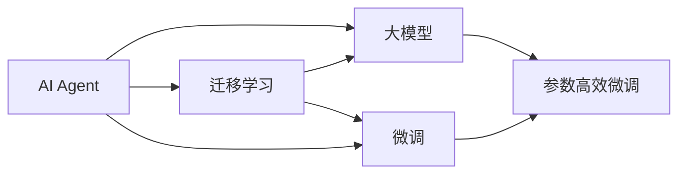

                 

# 【大模型应用开发 动手做AI Agent】Agent带来新的商业模式和变革

## 1. 背景介绍

### 1.1 问题由来

随着人工智能技术的不断进步，AI Agent 已经从传统的脚本式自动化逐步演化为具有自主学习能力的智能代理。这些智能代理不仅能够处理简单的规则性任务，还能具备复杂的自然语言理解、认知推理等能力。当前，AI Agent 在各行各业中得到了广泛应用，如智能客服、金融分析、医疗诊断、智能推荐等，带来了显著的业务创新和效率提升。

然而，开发一个高效的 AI Agent 并非易事。从数据采集、模型训练到应用部署，每一个环节都需要经过仔细的设计和实现。本文旨在通过系统介绍大模型在 AI Agent 中的应用开发流程，帮助读者深入理解AI Agent的构建过程，并探索其带来的商业模式变革。

## 2. 核心概念与联系

### 2.1 核心概念概述

为了更好地理解大模型在AI Agent开发中的应用，我们需要明确几个核心概念及其之间的关系：

- **AI Agent**：是一种能够自主执行任务，并能够在复杂环境中进行自主决策和交互的智能体。AI Agent 通过学习用户行为和环境状态，实现自主决策和交互。

- **大模型**：指基于大规模数据训练的深度学习模型，如BERT、GPT等。这些模型通常具有强大的语言理解、生成和推理能力，能够在特定任务上获得出色的表现。

- **迁移学习**：指将预训练模型应用于新任务上的学习过程。通过迁移学习，模型可以在更少的样本上获得更好的性能。

- **微调**：指在预训练模型基础上，针对特定任务进行有监督的学习，以优化模型在新任务上的表现。

- **参数高效微调**：指只更新模型部分参数，以提高微调效率和模型性能。

- **模型蒸馏**：指通过将大模型的知识蒸馏到小模型中，降低模型复杂度，提升推理速度。

这些概念之间存在紧密的联系，共同构成了AI Agent构建的基础框架。通过理解这些核心概念，我们可以更好地设计AI Agent，并实现其在新业务场景中的应用。

### 2.2 核心概念原理和架构的 Mermaid 流程图



通过以上Mermaid流程图，我们可以清晰地看到AI Agent构建的核心流程。大模型作为知识基础，通过迁移学习和微调进一步优化，最终实现参数高效微调，以提升模型在新任务上的性能。

## 3. 核心算法原理 & 具体操作步骤

### 3.1 算法原理概述

AI Agent 的核心算法原理主要基于深度学习和强化学习。大模型作为知识基础，通过迁移学习和微调，能够快速适应新任务。微调过程中，通过对模型参数进行有监督的优化，使得模型在新任务上获得更好的性能。

在AI Agent构建过程中，参数高效微调和模型蒸馏技术尤为重要。通过只更新部分参数，可以减少微调过程中的计算资源消耗，同时保证模型性能不降低。模型蒸馏则通过将大模型的知识传递给小模型，降低模型复杂度，提升推理速度，适用于资源受限的场景。

### 3.2 算法步骤详解

AI Agent的构建流程主要包括以下几个关键步骤：

**Step 1: 准备数据和环境**

- 收集训练数据，并进行预处理，如数据清洗、分词、向量化等。
- 选择适合大模型的开发环境，如PyTorch、TensorFlow等深度学习框架。
- 准备计算资源，如GPU、TPU等高性能设备。

**Step 2: 大模型的预训练和迁移**

- 使用大模型进行预训练，如BERT、GPT等。
- 选择适当的迁移学习策略，如零样本学习、Fine-tuning等。
- 在特定任务上微调大模型，如智能客服、金融分析等。

**Step 3: 参数高效微调和模型蒸馏**

- 对微调后的模型进行参数高效微调，如使用Adapter、LoRA等技术。
- 进行模型蒸馏，将大模型的知识传递给小模型，提升推理速度。
- 对模型进行优化和调整，以适应新场景和新需求。

**Step 4: 应用部署和监控**

- 将训练好的AI Agent部署到实际应用场景中。
- 使用日志、监控工具对AI Agent进行实时监控和调试。
- 根据实际使用情况，不断优化和迭代AI Agent。

### 3.3 算法优缺点

大模型在AI Agent开发中的应用具有以下优点：

- **性能提升显著**：大模型具备强大的语言理解能力和推理能力，能够在特定任务上获得优异表现。
- **泛化能力强**：大模型通过迁移学习和微调，能够适应多种任务和场景。
- **灵活性高**：大模型可以通过微调和参数高效微调，快速适应新任务。

然而，大模型也存在一些缺点：

- **计算资源消耗大**：大模型的训练和推理需要大量的计算资源。
- **模型复杂度高**：大模型的参数量庞大，推理速度较慢。
- **依赖标注数据**：大模型的微调过程需要大量的标注数据，获取标注数据的成本较高。

## 4. 数学模型和公式 & 详细讲解 & 举例说明

### 4.1 数学模型构建

AI Agent的构建通常涉及多个数学模型和公式。以下是一个简单的例子，用于说明AI Agent的构建过程。

假设我们要开发一个智能客服AI Agent，用于处理客户投诉问题。我们可以通过以下步骤来构建模型：

1. 收集客户投诉数据，并将其分为训练集和测试集。
2. 对客户投诉数据进行预处理，如分词、去除停用词等。
3. 使用BERT模型进行预训练，以获取语言表示。
4. 在特定任务上微调BERT模型，如情感分析、意图识别等。
5. 使用参数高效微调技术，优化模型性能。
6. 对模型进行评估和测试，以确保其在实际应用中的性能。

### 4.2 公式推导过程

在微调BERT模型时，我们可以使用交叉熵损失函数来优化模型。假设模型的输出为 $h(x)$，真实标签为 $y$，则交叉熵损失函数为：

$$
\mathcal{L}(h(x),y) = -y \log h(x) - (1-y) \log (1-h(x))
$$

其中，$h(x)$ 表示模型对样本 $x$ 的预测输出，$y$ 表示真实标签。在微调过程中，我们通过最小化损失函数 $\mathcal{L}(h(x),y)$ 来更新模型参数，以提高模型在新任务上的性能。

### 4.3 案例分析与讲解

以智能客服AI Agent为例，我们可以使用以下步骤来构建模型：

1. 数据预处理：收集客户投诉数据，并进行预处理，如分词、去除停用词等。
2. 预训练BERT模型：使用预先训练好的BERT模型作为知识基础。
3. 迁移学习：将BERT模型应用于情感分析和意图识别任务上，进行迁移学习。
4. 微调：在特定任务上微调BERT模型，以优化模型在新任务上的性能。
5. 参数高效微调：使用参数高效微调技术，优化模型性能。
6. 模型评估和测试：对模型进行评估和测试，以确保其在实际应用中的性能。

## 5. 项目实践：代码实例和详细解释说明

### 5.1 开发环境搭建

在构建AI Agent时，我们需要准备相应的开发环境。以下是使用Python和PyTorch进行AI Agent构建的开发环境配置流程：

1. 安装Anaconda：从官网下载并安装Anaconda，用于创建独立的Python环境。
2. 创建并激活虚拟环境：
```bash
conda create -n ai_agent-env python=3.8 
conda activate ai_agent-env
```
3. 安装PyTorch：根据CUDA版本，从官网获取对应的安装命令。例如：
```bash
conda install pytorch torchvision torchaudio cudatoolkit=11.1 -c pytorch -c conda-forge
```
4. 安装Transformers库：
```bash
pip install transformers
```
5. 安装各类工具包：
```bash
pip install numpy pandas scikit-learn matplotlib tqdm jupyter notebook ipython
```

完成上述步骤后，即可在`ai_agent-env`环境中开始AI Agent构建实践。

### 5.2 源代码详细实现

以下是一个简单的智能客服AI Agent的PyTorch代码实现：

```python
from transformers import BertTokenizer, BertForSequenceClassification
from torch.utils.data import Dataset, DataLoader
from torch.nn import CrossEntropyLoss, BCEWithLogitsLoss
from torch.optim import Adam
import torch

class CustomerComplaintDataset(Dataset):
    def __init__(self, texts, labels):
        self.texts = texts
        self.labels = labels
        self.tokenizer = BertTokenizer.from_pretrained('bert-base-cased')
        
    def __len__(self):
        return len(self.texts)
    
    def __getitem__(self, item):
        text = self.texts[item]
        label = self.labels[item]
        encoding = self.tokenizer(text, return_tensors='pt', padding=True, truncation=True)
        input_ids = encoding['input_ids']
        attention_mask = encoding['attention_mask']
        label = torch.tensor(label, dtype=torch.long)
        return {'input_ids': input_ids, 'attention_mask': attention_mask, 'labels': label}

class CustomerComplaintAIAgent:
    def __init__(self, model_name='bert-base-cased'):
        self.tokenizer = BertTokenizer.from_pretrained(model_name)
        self.model = BertForSequenceClassification.from_pretrained(model_name, num_labels=2)
        self.loss_fn = CrossEntropyLoss()
        self.optimizer = Adam(self.model.parameters(), lr=2e-5)
    
    def train(self, train_dataset, dev_dataset, epochs=5, batch_size=16):
        self.model.train()
        for epoch in range(epochs):
            epoch_loss = 0
            for batch in tqdm(DataLoader(train_dataset, batch_size=batch_size)):
                input_ids = batch['input_ids'].to(device)
                attention_mask = batch['attention_mask'].to(device)
                labels = batch['labels'].to(device)
                self.model.zero_grad()
                outputs = self.model(input_ids, attention_mask=attention_mask)
                loss = self.loss_fn(outputs.logits, labels)
                epoch_loss += loss.item()
                loss.backward()
                self.optimizer.step()
            print(f'Epoch {epoch+1}, train loss: {epoch_loss / len(train_dataset)}')
            dev_loss = self.evaluate(dev_dataset)
            print(f'Epoch {epoch+1}, dev loss: {dev_loss}')
    
    def evaluate(self, test_dataset, batch_size=16):
        self.model.eval()
        self.model.zero_grad()
        total_loss = 0
        for batch in tqdm(DataLoader(test_dataset, batch_size=batch_size)):
            input_ids = batch['input_ids'].to(device)
            attention_mask = batch['attention_mask'].to(device)
            labels = batch['labels'].to(device)
            outputs = self.model(input_ids, attention_mask=attention_mask)
            loss = self.loss_fn(outputs.logits, labels)
            total_loss += loss.item()
        return total_loss / len(test_dataset)
    
    def predict(self, text):
        self.model.eval()
        encoding = self.tokenizer(text, return_tensors='pt', padding=True, truncation=True)
        input_ids = encoding['input_ids']
        attention_mask = encoding['attention_mask']
        outputs = self.model(input_ids, attention_mask=attention_mask)
        return outputs.logits.argmax(dim=1).item()
```

### 5.3 代码解读与分析

让我们再详细解读一下关键代码的实现细节：

**CustomerComplaintDataset类**：
- `__init__`方法：初始化文本、标签、分词器等关键组件。
- `__len__`方法：返回数据集的样本数量。
- `__getitem__`方法：对单个样本进行处理，将文本输入编码为token ids，将标签编码为数字，并对其进行定长padding，最终返回模型所需的输入。

**CustomerComplaintAIAgent类**：
- `__init__`方法：初始化BERT模型、分词器、损失函数、优化器等。
- `train`方法：在训练集上训练模型，并在验证集上评估模型性能。
- `evaluate`方法：在测试集上评估模型性能。
- `predict`方法：对输入文本进行预测。

**训练流程**：
- 定义总的epoch数和batch size，开始循环迭代
- 每个epoch内，先在训练集上训练，输出平均loss
- 在验证集上评估，输出平均loss
- 重复上述步骤直至收敛

## 6. 实际应用场景

### 6.1 智能客服系统

基于大模型的AI Agent，可以广泛应用于智能客服系统的构建。传统客服往往需要配备大量人力，高峰期响应缓慢，且一致性和专业性难以保证。而使用AI Agent，可以7x24小时不间断服务，快速响应客户咨询，用自然流畅的语言解答各类常见问题。

在技术实现上，可以收集企业内部的历史客服对话记录，将问题和最佳答复构建成监督数据，在此基础上对预训练BERT模型进行微调。微调后的模型能够自动理解用户意图，匹配最合适的答案模板进行回复。对于客户提出的新问题，还可以接入检索系统实时搜索相关内容，动态组织生成回答。如此构建的智能客服系统，能大幅提升客户咨询体验和问题解决效率。

### 6.2 金融舆情监测

金融机构需要实时监测市场舆论动向，以便及时应对负面信息传播，规避金融风险。传统的人工监测方式成本高、效率低，难以应对网络时代海量信息爆发的挑战。基于大模型的AI Agent，可以应用于金融舆情监测，实时抓取网络文本数据，自动监测不同主题下的情感变化趋势，一旦发现负面信息激增等异常情况，系统便会自动预警，帮助金融机构快速应对潜在风险。

### 6.3 个性化推荐系统

当前的推荐系统往往只依赖用户的历史行为数据进行物品推荐，无法深入理解用户的真实兴趣偏好。基于大模型的AI Agent，可以更好地挖掘用户行为背后的语义信息，从而提供更精准、多样的推荐内容。

在实践中，可以收集用户浏览、点击、评论、分享等行为数据，提取和用户交互的物品标题、描述、标签等文本内容。将文本内容作为模型输入，用户的后续行为（如是否点击、购买等）作为监督信号，在此基础上微调BERT模型。微调后的模型能够从文本内容中准确把握用户的兴趣点。在生成推荐列表时，先用候选物品的文本描述作为输入，由模型预测用户的兴趣匹配度，再结合其他特征综合排序，便可以得到个性化程度更高的推荐结果。

### 6.4 未来应用展望

随着大模型的不断发展和应用，基于AI Agent的AI技术将在更多领域得到应用，为各行各业带来变革性影响。

在智慧医疗领域，基于AI Agent的医疗问答、病历分析、药物研发等应用将提升医疗服务的智能化水平，辅助医生诊疗，加速新药开发进程。

在智能教育领域，AI Agent可应用于作业批改、学情分析、知识推荐等方面，因材施教，促进教育公平，提高教学质量。

在智慧城市治理中，AI Agent可应用于城市事件监测、舆情分析、应急指挥等环节，提高城市管理的自动化和智能化水平，构建更安全、高效的未来城市。

此外，在企业生产、社会治理、文娱传媒等众多领域，基于大模型的AI Agent应用也将不断涌现，为经济社会发展注入新的动力。相信随着技术的日益成熟，AI Agent必将在构建人机协同的智能时代中扮演越来越重要的角色。

## 7. 工具和资源推荐

### 7.1 学习资源推荐

为了帮助开发者系统掌握AI Agent的理论基础和实践技巧，这里推荐一些优质的学习资源：

1. 《Transformer从原理到实践》系列博文：由大模型技术专家撰写，深入浅出地介绍了Transformer原理、BERT模型、AI Agent开发等前沿话题。

2. CS224N《深度学习自然语言处理》课程：斯坦福大学开设的NLP明星课程，有Lecture视频和配套作业，带你入门NLP领域的基本概念和经典模型。

3. 《Natural Language Processing with Transformers》书籍：Transformers库的作者所著，全面介绍了如何使用Transformers库进行NLP任务开发，包括AI Agent在内的诸多范式。

4. HuggingFace官方文档：Transformers库的官方文档，提供了海量预训练模型和完整的AI Agent开发样例代码，是上手实践的必备资料。

5. CLUE开源项目：中文语言理解测评基准，涵盖大量不同类型的中文NLP数据集，并提供了基于AI Agent的baseline模型，助力中文NLP技术发展。

通过对这些资源的学习实践，相信你一定能够快速掌握AI Agent的精髓，并用于解决实际的NLP问题。

### 7.2 开发工具推荐

高效的开发离不开优秀的工具支持。以下是几款用于AI Agent开发的常用工具：

1. PyTorch：基于Python的开源深度学习框架，灵活动态的计算图，适合快速迭代研究。大部分预训练语言模型都有PyTorch版本的实现。

2. TensorFlow：由Google主导开发的开源深度学习框架，生产部署方便，适合大规模工程应用。同样有丰富的预训练语言模型资源。

3. Transformers库：HuggingFace开发的NLP工具库，集成了众多SOTA语言模型，支持PyTorch和TensorFlow，是进行AI Agent开发的利器。

4. Weights & Biases：模型训练的实验跟踪工具，可以记录和可视化模型训练过程中的各项指标，方便对比和调优。与主流深度学习框架无缝集成。

5. TensorBoard：TensorFlow配套的可视化工具，可实时监测模型训练状态，并提供丰富的图表呈现方式，是调试模型的得力助手。

6. Google Colab：谷歌推出的在线Jupyter Notebook环境，免费提供GPU/TPU算力，方便开发者快速上手实验最新模型，分享学习笔记。

合理利用这些工具，可以显著提升AI Agent的开发效率，加快创新迭代的步伐。

### 7.3 相关论文推荐

AI Agent开发源于学界的持续研究。以下是几篇奠基性的相关论文，推荐阅读：

1. Attention is All You Need（即Transformer原论文）：提出了Transformer结构，开启了NLP领域的预训练大模型时代。

2. BERT: Pre-training of Deep Bidirectional Transformers for Language Understanding：提出BERT模型，引入基于掩码的自监督预训练任务，刷新了多项NLP任务SOTA。

3. Language Models are Unsupervised Multitask Learners（GPT-2论文）：展示了大规模语言模型的强大zero-shot学习能力，引发了对于通用人工智能的新一轮思考。

4. Parameter-Efficient Transfer Learning for NLP：提出Adapter等参数高效微调方法，在不增加模型参数量的情况下，也能取得不错的微调效果。

5. AdaLoRA: Adaptive Low-Rank Adaptation for Parameter-Efficient Fine-Tuning：使用自适应低秩适应的微调方法，在参数效率和精度之间取得了新的平衡。

这些论文代表了大模型在AI Agent开发中的应用发展脉络。通过学习这些前沿成果，可以帮助研究者把握学科前进方向，激发更多的创新灵感。

## 8. 总结：未来发展趋势与挑战

### 8.1 总结

本文对基于大模型的AI Agent构建进行了全面系统的介绍。首先阐述了AI Agent的研究背景和意义，明确了其在AI系统构建中的独特价值。其次，从原理到实践，详细讲解了AI Agent的构建流程，包括数据处理、模型训练、参数高效微调等关键步骤，并通过代码实例展示了其实现过程。同时，本文还探讨了AI Agent在实际应用中的各种场景，展示了其带来的商业模式变革。最后，精选了AI Agent开发的学习资源、工具和相关论文，力求为读者提供全方位的技术指引。

通过本文的系统梳理，可以看到，基于大模型的AI Agent构建不仅是一个技术问题，更是一个应用场景的问题。AI Agent的构建需要跨学科的合作，结合自然语言处理、计算机视觉、强化学习等多种技术手段，才能实现其在各个领域的落地应用。未来，随着AI技术的不断进步，AI Agent必将在构建更加智能、高效、安全、可解释的AI系统中扮演越来越重要的角色。

### 8.2 未来发展趋势

展望未来，AI Agent将呈现以下几个发展趋势：

1. **智能水平提升**：AI Agent将通过深度学习和强化学习等技术，不断提升其自主决策和交互能力，实现更复杂的任务处理。

2. **多模态融合**：未来的AI Agent将不仅仅依赖文本信息，还将融合视觉、听觉等多种模态信息，实现跨模态的智能交互。

3. **可解释性增强**：随着模型透明度的提高，AI Agent的决策过程将更加可解释，便于用户理解和信任。

4. **实时学习能力**：AI Agent将具备实时学习新知识的能力，通过在线学习机制，不断优化自身性能，适应不断变化的环境。

5. **跨领域应用**：AI Agent将在更多领域得到应用，如智能交通、智能家居、智能制造等，为各行各业带来新的机遇和挑战。

以上趋势凸显了AI Agent技术的广阔前景。这些方向的探索发展，将推动AI Agent从单一任务处理向复杂任务处理转变，进一步拓展其应用范围和影响力。

### 8.3 面临的挑战

尽管AI Agent技术已经取得了显著成果，但在迈向更加智能化、普适化应用的过程中，仍面临诸多挑战：

1. **数据获取与标注**：高质量标注数据获取难度大、成本高，制约了AI Agent的训练和性能提升。
2. **计算资源消耗**：大模型的训练和推理需要大量的计算资源，对硬件要求高。
3. **模型复杂度与鲁棒性**：模型复杂度高，难以进行实时推理和快速决策。模型鲁棒性不足，容易受到噪声和异常输入的影响。
4. **可解释性与安全性**：AI Agent的决策过程难以解释，缺乏透明性。存在潜在的安全性和隐私风险。
5. **跨领域适应性**：不同领域的任务特性不同，AI Agent需要具备跨领域适应的能力。

这些挑战需要通过多学科协作和技术创新来克服，才能实现AI Agent技术的广泛应用。

### 8.4 研究展望

面对AI Agent技术所面临的挑战，未来的研究需要在以下几个方面寻求新的突破：

1. **数据生成与自动化标注**：开发数据生成技术和自动化标注方法，降低数据获取和标注的难度。
2. **模型压缩与加速**：通过模型压缩和加速技术，降低计算资源消耗，提高模型实时推理能力。
3. **跨模态学习**：研究跨模态学习算法，实现不同模态信息的高效融合和协同建模。
4. **模型透明性与解释性**：开发可解释AI技术，提升模型的透明性和可解释性。
5. **模型安全与隐私保护**：研究模型安全与隐私保护技术，确保AI Agent在应用过程中的安全性与隐私性。
6. **跨领域应用模型**：构建跨领域适应的AI Agent模型，提升其在不同领域的应用能力。

这些研究方向将推动AI Agent技术的不断进步，为各行各业带来更深远的影响。相信通过学界和产业界的共同努力，AI Agent必将在构建人机协同的智能时代中发挥更加重要的作用。

## 9. 附录：常见问题与解答

**Q1：AI Agent的构建流程是什么？**

A: AI Agent的构建流程主要包括以下几个步骤：
1. 数据收集与预处理：收集任务相关的数据，并进行分词、去停用词等预处理。
2. 大模型的预训练与迁移学习：使用预训练模型进行迁移学习，以获取先验知识。
3. 微调与参数高效微调：在特定任务上微调模型，并进行参数高效微调，以优化模型性能。
4. 模型评估与测试：对模型进行评估和测试，以确保其在实际应用中的性能。

**Q2：大模型在AI Agent构建中的作用是什么？**

A: 大模型在AI Agent构建中起着知识基础的作用。通过大模型的预训练和迁移学习，AI Agent能够学习到丰富的语言知识和语义理解能力，从而在特定任务上获得优异表现。同时，大模型还为AI Agent提供了强有力的语言推理能力，使其能够处理更加复杂的自然语言理解和生成任务。

**Q3：AI Agent在实际应用中需要注意哪些问题？**

A: AI Agent在实际应用中需要注意以下几个问题：
1. 数据获取与标注：高质量标注数据获取难度大、成本高，制约了AI Agent的训练和性能提升。
2. 计算资源消耗：大模型的训练和推理需要大量的计算资源，对硬件要求高。
3. 模型复杂度与鲁棒性：模型复杂度高，难以进行实时推理和快速决策。模型鲁棒性不足，容易受到噪声和异常输入的影响。
4. 可解释性与安全性：AI Agent的决策过程难以解释，缺乏透明性。存在潜在的安全性和隐私风险。
5. 跨领域适应性：不同领域的任务特性不同，AI Agent需要具备跨领域适应的能力。

通过对这些问题的理解，可以帮助开发者更好地设计AI Agent，并解决实际应用中的各种挑战。

**Q4：AI Agent有哪些应用场景？**

A: AI Agent在许多领域都有广泛的应用场景，如：
1. 智能客服系统：提供7x24小时不间断服务，快速响应客户咨询。
2. 金融舆情监测：实时监测市场舆论动向，及时应对负面信息传播。
3. 个性化推荐系统：通过用户行为数据进行推荐，提升推荐精准度。
4. 智慧医疗：用于医疗问答、病历分析、药物研发等，提升医疗服务的智能化水平。
5. 智能教育：用于作业批改、学情分析、知识推荐，因材施教，促进教育公平。
6. 智慧城市治理：用于城市事件监测、舆情分析、应急指挥，提高城市管理的自动化和智能化水平。

通过AI Agent，可以在多个领域实现智能化升级，带来新的商业模式和变革。

**Q5：AI Agent在构建过程中需要注意哪些关键点？**

A: AI Agent在构建过程中需要注意以下几个关键点：
1. 数据获取与预处理：数据质量直接影响AI Agent的性能，需要仔细处理。
2. 大模型的选择与迁移学习：选择合适的预训练模型，进行迁移学习，以获取先验知识。
3. 微调与参数高效微调：在特定任务上微调模型，并进行参数高效微调，以优化模型性能。
4. 模型评估与测试：对模型进行评估和测试，以确保其在实际应用中的性能。

通过对这些关键点的理解，可以帮助开发者更好地设计AI Agent，并实现其在各个领域的落地应用。

