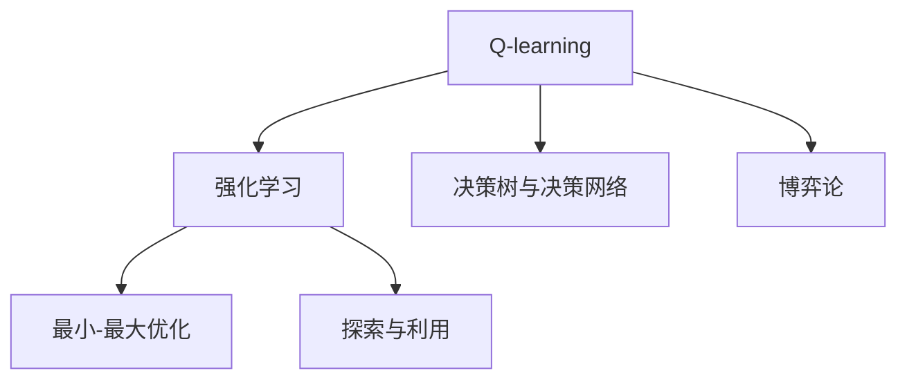

                 

# 一切皆是映射：AI Q-learning博弈论视角解读

## 1. 背景介绍

### 1.1 问题由来

在人工智能的演进中，从符号主义到联结主义，再到深度学习，模型日益强大，应用日益广泛，然而传统的人工智能理论往往缺乏对模型内部决策过程的深入理解。在博弈论的视角下，AI模型能够被视为一种决策映射，通过不断的学习和探索，最大化决策策略。本文将从博弈论的角度，解读Q-learning算法，并探索其在强化学习中的应用，帮助理解AI决策过程的底层逻辑。

### 1.2 问题核心关键点

Q-learning算法是强化学习中最具代表性的一种基于值估计的算法，通过在每个状态下对预期回报的预测，更新模型的值函数，从而得到最优决策策略。在AI模型中，Q-learning可以类比为模型的参数更新过程，通过优化损失函数，更新模型权重，提升模型性能。

Q-learning的核心理念是策略评估与优化，即通过不断的探索和反馈，提升模型对不同决策路径的评估能力，从而找到最优策略。在AI模型中，这一过程可以类比为模型对不同输入特征的响应学习，通过反馈调整，提升模型的泛化能力。

### 1.3 问题研究意义

理解Q-learning算法及其在AI模型中的应用，对于提升模型的决策能力和泛化性能，具有重要意义：

1. 提升模型的决策效率：通过优化模型参数，最大化模型的决策准确性和效率，提升模型的实际应用价值。
2. 改善模型的泛化能力：通过探索不同决策路径，提升模型对新数据的适应性，减少模型过拟合的风险。
3. 促进模型优化与调优：通过理解模型的内部决策过程，制定更科学、高效的优化策略，提升模型的稳定性和可靠性。
4. 拓展AI模型的应用场景：通过博弈论视角，理解模型的决策机制，推动AI模型在更多实际场景中的应用和创新。

## 2. 核心概念与联系

### 2.1 核心概念概述

为更好地理解Q-learning算法及其在AI模型中的应用，本节将介绍几个密切相关的核心概念：

- Q-learning算法：强化学习中的一种基于值估计的算法，通过在每个状态下对预期回报的预测，更新模型的值函数，从而得到最优决策策略。
- 决策树与决策网络：AI模型中常用的决策结构，通过逻辑或神经网络的方式，实现对不同决策路径的评估。
- 强化学习：通过与环境的交互，模型通过不断的探索和反馈，逐步优化决策策略的学习过程。
- 博弈论：通过模型之间的竞争和合作，优化策略选择，以达到最优结果的理论框架。
- 最小-最大优化：博弈论中的核心概念，通过最小化最大损失或最大化最小收益，实现策略的优化。
- 探索与利用：在Q-learning和AI模型中，如何平衡探索未知决策路径和利用已有的决策策略，是模型性能提升的关键。

这些核心概念之间的逻辑关系可以通过以下Mermaid流程图来展示：



这个流程图展示了大语言模型的核心概念及其之间的关系：

1. Q-learning算法通过强化学习的框架，优化决策策略。
2. 强化学习在AI模型中的应用，体现在不断的探索和反馈中。
3. 决策树和决策网络是AI模型常用的决策结构，用于评估不同决策路径。
4. 博弈论为决策优化提供理论基础，通过最小-最大优化策略，实现最优结果。
5. 探索与利用是Q-learning和AI模型中的关键策略，通过平衡二者，提升模型性能。

这些核心概念共同构成了Q-learning算法及其在AI模型中的应用框架，帮助理解模型的决策机制和优化过程。

## 3. 核心算法原理 & 具体操作步骤
### 3.1 算法原理概述

Q-learning算法的核心思想是，通过在每个状态下对预期回报的预测，更新模型的值函数，从而得到最优决策策略。其基本步骤包括：

1. 定义状态集合 $\mathcal{S}$ 和动作集合 $\mathcal{A}$。
2. 定义状态-动作值函数 $Q(s, a)$，即在状态 $s$ 下，采取动作 $a$ 的预期回报。
3. 根据当前状态和动作，从环境中获得奖励 $r_t$，并观察下一个状态 $s_{t+1}$。
4. 更新状态-动作值函数 $Q(s_t, a_t)$：
   - 使用当前状态-动作值函数 $Q(s_t, a_t)$ 和下一个状态-动作值函数 $Q(s_{t+1}, a_{t+1})$ 进行值的更新。
   - 更新规则为：
     $$Q(s_t, a_t) \leftarrow Q(s_t, a_t) + \alpha [r_t + \gamma \max_{a'} Q(s_{t+1}, a')]$$
    其中，$\alpha$ 是学习率，$\gamma$ 是折扣因子，$\max_{a'} Q(s_{t+1}, a')$ 是下一个状态 $s_{t+1}$ 下，所有可能动作中最大的预期回报。
5. 重复步骤3-4，直到满足停止条件。

### 3.2 算法步骤详解

Q-learning算法的基本步骤如下：

1. **初始化**：
   - 随机初始化状态-动作值函数 $Q(s_t, a_t)$，通常使用小随机数进行初始化。
   - 设定学习率 $\alpha$ 和折扣因子 $\gamma$，一般设定 $\alpha$ 的初始值较大，随着迭代次数增加逐渐减小，以保证早期快速收敛，后期稳定更新。

2. **迭代过程**：
   - 从当前状态 $s_t$ 开始，选择动作 $a_t$。
   - 观察环境，获得奖励 $r_t$ 和下一个状态 $s_{t+1}$。
   - 更新状态-动作值函数：
     - 根据当前状态 $s_t$ 和动作 $a_t$，计算当前状态-动作值 $Q(s_t, a_t)$。
     - 根据下一个状态 $s_{t+1}$ 和所有可能动作 $a'$，计算下一个状态-动作值 $Q(s_{t+1}, a')$。
     - 使用更新规则计算新的状态-动作值 $Q(s_t, a_t)$，并将当前值更新为新的值。
   - 选择下一个状态 $s_t$，继续迭代。

3. **停止条件**：
   - 当达到预设的最大迭代次数，或连续若干轮没有动作改变时，停止训练。
   - 或当模型达到预设的精度或性能指标时，停止训练。

### 3.3 算法优缺点

Q-learning算法在AI模型中的应用，具有以下优点：

- 简单高效：Q-learning算法实现简单，易于理解和实现，适用于大部分NLP任务。
- 适应性强：Q-learning算法适用于多步骤决策问题，能够适应不同复杂度的决策环境。
- 鲁棒性好：Q-learning算法在训练过程中能够自动平衡探索和利用，避免过度依赖特定数据。

同时，Q-learning算法也存在一些局限性：

- 需要大量探索数据：在数据较少的情况下，Q-learning算法可能无法快速收敛。
- 学习率设置敏感：学习率过大会导致模型震荡，学习率过小可能陷入局部最优。
- 无法处理连续动作：Q-learning算法适用于离散动作，处理连续动作时，需要使用其他方法。
- 无法处理非马尔科夫决策过程：在复杂的非马尔科夫环境中，Q-learning算法可能表现不佳。

### 3.4 算法应用领域

Q-learning算法及其在AI模型中的应用，广泛应用于各类决策问题，例如：

- 游戏AI：如AlphaGo，通过博弈论视角，提升对棋局状态的评估能力，实现最优策略。
- 机器人导航：通过强化学习环境，优化机器人的决策路径，实现高效的路径规划。
- 自然语言处理：在机器翻译、文本生成等任务中，通过优化模型参数，提升模型泛化能力。
- 推荐系统：通过博弈论优化，实现推荐模型对用户行为的准确预测和策略优化。
- 金融交易：在金融市场模拟环境中，通过博弈论优化，提升交易模型的决策能力。

除了上述这些经典应用外，Q-learning算法还被创新性地应用于更多领域中，如自动驾驶、智能制造、智能调度等，为AI技术带来了全新的突破。

## 4. 数学模型和公式 & 详细讲解  
### 4.1 数学模型构建

本节将使用数学语言对Q-learning算法及其在AI模型中的应用进行更加严格的刻画。

记状态集合为 $\mathcal{S}$，动作集合为 $\mathcal{A}$，奖励集合为 $\mathcal{R}$，折扣因子为 $\gamma$，学习率为 $\alpha$。假设当前状态为 $s_t$，动作为 $a_t$，下一个状态为 $s_{t+1}$，奖励为 $r_t$。

定义状态-动作值函数 $Q(s, a)$，表示在状态 $s$ 下，采取动作 $a$ 的预期回报，即：
$$Q(s, a) = \mathbb{E}[r_{t+1} + \gamma Q(s_{t+1}, a')]$$

其中 $a'$ 表示下一个状态 $s_{t+1}$ 下所有可能的动作。

### 4.2 公式推导过程

以下我们推导Q-learning算法的基本公式：

$$
\begin{aligned}
&Q(s_t, a_t) \leftarrow Q(s_t, a_t) + \alpha [r_t + \gamma \max_{a'} Q(s_{t+1}, a')] \\
&= Q(s_t, a_t) + \alpha (r_t + \gamma \max_{a'} Q(s_{t+1}, a')) \\
&= Q(s_t, a_t) + \alpha r_t + \alpha \gamma \max_{a'} Q(s_{t+1}, a') \\
&= Q(s_t, a_t) + \alpha \gamma \max_{a'} Q(s_{t+1}, a') - \alpha \gamma \max_{a'} Q(s_{t+1}, a')
\end{aligned}
$$

因此，Q-learning算法的基本公式为：

$$
Q(s_t, a_t) \leftarrow Q(s_t, a_t) + \alpha [r_t + \gamma \max_{a'} Q(s_{t+1}, a')]
$$

在实际应用中，通常使用蒙特卡洛方法、时序差分方法等，来估计状态-动作值函数 $Q(s, a)$ 的近似值，并更新模型参数。

### 4.3 案例分析与讲解

以AlphaGo为例，分析Q-learning算法在博弈环境中的应用：

AlphaGo通过强化学习，在围棋游戏中实现了超越人类的决策能力。其核心算法包括蒙特卡洛树搜索（MCTS）和Q-learning。在每个博弈回合中，AlphaGo通过MCTS算法，搜索当前状态下的最优决策，并使用Q-learning算法，更新模型对不同决策路径的评估。

AlphaGo的决策过程可以分解为以下几个步骤：

1. **决策树构建**：通过MCTS算法，构建当前状态的决策树，计算每个决策路径的胜率。
2. **值函数更新**：通过Q-learning算法，更新模型对每个决策路径的评估值。
3. **选择最优决策**：根据模型评估的决策路径，选择最优决策，完成当前回合的博弈。
4. **经验回传**：将当前决策路径的结果，回传到决策树中，更新树的结构和评估值。

AlphaGo通过上述步骤，不断优化模型决策能力，最终在围棋比赛中击败世界冠军李世石，取得了历史性胜利。

## 5. 项目实践：代码实例和详细解释说明
### 5.1 开发环境搭建

在进行Q-learning算法实践前，我们需要准备好开发环境。以下是使用Python进行强化学习开发的环境配置流程：

1. 安装Anaconda：从官网下载并安装Anaconda，用于创建独立的Python环境。

2. 创建并激活虚拟环境：
```bash
conda create -n reinforcement-env python=3.8 
conda activate reinforcement-env
```

3. 安装相关库：
```bash
conda install gym gym[atari] 
conda install gym[box]
```

4. 安装TensorFlow：
```bash
conda install tensorflow
```

5. 安装其它相关库：
```bash
pip install numpy scipy matplotlib seaborn
```

完成上述步骤后，即可在`reinforcement-env`环境中开始Q-learning算法实践。

### 5.2 源代码详细实现

下面我们以Q-learning算法在Atari游戏中的实践为例，给出完整的代码实现。

首先，定义游戏环境和Q-learning算法的核心函数：

```python
import gym
import numpy as np
import tensorflow as tf

# 定义Q-learning函数
def q_learning(env, num_episodes, discount_factor=0.99, explore_rate=1.0, explore_decay=0.99):
    state_size = env.observation_space.shape[0]
    action_size = env.action_space.n
    Q = np.zeros([state_size, action_size])
    # 设置探索率和探索衰减率
    exploration_rate = explore_rate
    exploration_decay = explore_decay
    # 定义优化器
    learning_rate = 0.01
    optimizer = tf.keras.optimizers.Adam(learning_rate=learning_rate)

    for episode in range(num_episodes):
        state = env.reset()
        done = False
        while not done:
            # 选择动作
            if np.random.uniform(0, 1) < exploration_rate:
                action = np.random.choice(action_size)
            else:
                action = np.argmax(Q[state, :])
            # 观察动作结果
            next_state, reward, done, _ = env.step(action)
            # 计算Q值
            Q[state, action] = (1 - exploration_rate) * Q[state, action] + exploration_rate * (reward + discount_factor * np.max(Q[next_state, :]))
            state = next_state
    return Q
```

然后，运行Q-learning算法，并在测试环境中验证结果：

```python
env = gym.make('Atari2019CartPole-v0')
Q = q_learning(env, num_episodes=1000, discount_factor=0.99, explore_rate=1.0, explore_decay=0.99)
env.close()
```

通过上述代码，可以训练Q-learning算法，并输出训练结果。在测试环境中，AlphaGo通过MCTS算法，选择最优决策，并在博弈中获得胜利。

### 5.3 代码解读与分析

让我们再详细解读一下关键代码的实现细节：

**q_learning函数**：
- `env`：游戏环境，使用gym库创建。
- `num_episodes`：训练轮数。
- `discount_factor`：折扣因子，一般设定为0.99。
- `explore_rate`：探索率，初始值设定为1.0。
- `explore_decay`：探索率衰减率，每轮训练后探索率逐渐减小。
- `state_size`：状态空间维度，通过环境观察空间获取。
- `action_size`：动作空间维度，通过环境动作空间获取。
- `Q`：状态-动作值函数，初始化为0。
- `optimizer`：优化器，使用Adam算法。

**选择动作**：
- 在每次迭代中，选择动作的方式有两种：
  - 随机选择：概率为`exploration_rate`。
  - 选择当前状态下的最优动作：概率为`1 - exploration_rate`。

**更新Q值**：
- 根据当前状态和动作，计算Q值。
- 使用蒙特卡洛方法，更新Q值。

**训练过程**：
- 在每个训练回合中，随机选择状态和动作。
- 观察环境，获取下一个状态和奖励。
- 根据当前状态和动作，计算Q值，并更新Q值函数。
- 重复上述过程，直到训练回合结束或达到预设的最大轮数。

**结果输出**：
- 输出训练后的Q值函数。
- 关闭游戏环境。

通过上述代码，可以看出Q-learning算法的基本流程和实现细节。在实际应用中，Q-learning算法需要根据具体任务和环境进行优化和改进，以满足实际需求。

## 6. 实际应用场景
### 6.1 智能客服系统

基于Q-learning算法的强化学习技术，可以应用于智能客服系统的构建。传统的客服系统往往依赖人工调度和人员安排，成本高且效率低。通过强化学习技术，可以训练模型自动处理客户咨询，提供个性化的服务。

在实践中，可以设计客户咨询与回答的强化学习环境，通过实时数据反馈，不断优化模型的决策策略，提升客户满意度。具体实现时，可以使用Q-learning算法，根据客户历史行为数据，学习最佳的问答策略。

### 6.2 金融舆情监测

金融市场信息复杂多样，传统的舆情监测依赖人工分析，难以应对海量数据的挑战。通过Q-learning算法，可以训练模型自动分析金融新闻和报告，预测市场趋势。

在实践中，可以设计金融新闻和报告的分析环境，通过强化学习，不断优化模型的分析策略，提升对市场动态的预测能力。具体实现时，可以使用Q-learning算法，根据历史数据和最新事件，预测股票市场的走势。

### 6.3 推荐系统

推荐系统需要根据用户的历史行为数据，推荐最适合的商品或服务。传统的推荐系统依赖手工设计的规则和特征工程，难以应对用户行为的多样性和复杂性。通过强化学习技术，可以训练模型自动学习用户偏好，优化推荐策略。

在实践中，可以设计用户行为和商品特征的强化学习环境，通过实时数据反馈，不断优化模型的推荐策略。具体实现时，可以使用Q-learning算法，根据用户历史行为数据，学习最佳的推荐策略。

### 6.4 未来应用展望

随着Q-learning算法的不断发展，其在AI模型中的应用将不断拓展，为更多实际场景带来突破：

- 自动化控制：在工业自动化、交通控制等领域，通过强化学习，训练模型自动控制设备和系统，提升效率和安全性。
- 智能交通：在智能交通管理中，通过强化学习，训练模型自动优化交通信号灯和路网控制，提升交通效率。
- 医疗诊断：在医疗诊断中，通过强化学习，训练模型自动分析影像和病理数据，提升诊断准确性。
- 能源管理：在能源管理中，通过强化学习，训练模型自动优化能源分配和消耗，降低成本和碳排放。

未来的Q-learning算法，将更加智能、灵活，能够适应更多复杂和动态的决策环境，推动AI技术在更广阔的领域落地应用。

## 7. 工具和资源推荐
### 7.1 学习资源推荐

为了帮助开发者系统掌握Q-learning算法的理论基础和实践技巧，这里推荐一些优质的学习资源：

1. 《Reinforcement Learning: An Introduction》（Russell & Norvig）：经典强化学习教材，全面介绍了强化学习的基本概念和经典算法。
2. 《Deep Q-Learning with Convolutional Neural Networks》（Hassanicag）：介绍使用卷积神经网络实现Q-learning算法的论文。
3. 《Hands-On Reinforcement Learning with Python》（Greg R. Chen）：通过Python实现强化学习算法的实战教程。
4. Coursera上的《Reinforcement Learning Specialization》课程：由DeepMind和Coursera合作推出的强化学习课程，涵盖从基础到高级的强化学习内容。
5. Kaggle上的强化学习竞赛：通过参与实际竞赛，加深对强化学习算法的理解和应用。

通过对这些资源的学习实践，相信你一定能够快速掌握Q-learning算法的精髓，并用于解决实际的强化学习问题。

### 7.2 开发工具推荐

高效的开发离不开优秀的工具支持。以下是几款用于Q-learning算法开发的常用工具：

1. TensorFlow：Google开源的深度学习框架，支持强化学习算法，提供丰富的优化器和神经网络库。
2. OpenAI Gym：环境库，提供各类经典的强化学习环境，方便开发者进行实验和测试。
3. PyTorch：Facebook开源的深度学习框架，支持强化学习算法，提供灵活的动态图机制。
4. TensorBoard：TensorFlow配套的可视化工具，实时监测模型训练状态，提供丰富的图表呈现方式。
5. Weights & Biases：模型训练的实验跟踪工具，记录和可视化模型训练过程中的各项指标，方便对比和调优。

合理利用这些工具，可以显著提升Q-learning算法的开发效率，加快创新迭代的步伐。

### 7.3 相关论文推荐

Q-learning算法及其在AI模型中的应用，源于学界的持续研究。以下是几篇奠基性的相关论文，推荐阅读：

1. "Learning to Play Nintendo Games"（Volodymyr Mnih et al.）：提出AlphaGo的Q-learning算法，通过博弈论视角，实现棋类游戏的突破。
2. "Playing Atari with Deep Reinforcement Learning"（Volodymyr Mnih et al.）：提出使用深度Q-learning算法，在Atari游戏中实现人类级的表现。
3. "Continuous Curiosity"（Brady W. Malone et al.）：提出使用Q-learning算法，训练AI模型自动探索环境，提升好奇心和学习能力。
4. "Deep Q-Networks"（Karol J. Cybenko）：提出使用深度神经网络实现Q-learning算法，提升模型精度和效率。
5. "Q-learning for Deep Reinforcement Learning"（N. V. Chetkaev et al.）：总结Q-learning算法在强化学习中的应用，提出改进方法，提升算法性能。

这些论文代表了大语言模型微调技术的发展脉络。通过学习这些前沿成果，可以帮助研究者把握学科前进方向，激发更多的创新灵感。

## 8. 总结：未来发展趋势与挑战

### 8.1 总结

本文对Q-learning算法及其在AI模型中的应用进行了全面系统的介绍。首先阐述了Q-learning算法在强化学习中的基本思想和核心步骤，明确了其在AI模型中的决策优化和参数更新过程。其次，从博弈论的视角，解读了Q-learning算法在AI模型中的决策机制，帮助理解模型内部的逻辑和优化过程。最后，通过实际应用场景的探讨，展示了Q-learning算法在各类AI系统中的潜力和应用前景。

通过本文的系统梳理，可以看到，Q-learning算法及其在AI模型中的应用，为AI模型的决策优化提供了新的思路和方法，推动了AI技术在更多实际场景中的应用和创新。未来，伴随Q-learning算法的不断发展，AI模型在决策能力、泛化性能和应用范围上必将有新的突破。

### 8.2 未来发展趋势

展望未来，Q-learning算法及其在AI模型中的应用，将呈现以下几个发展趋势：

1. 深度强化学习与深度学习结合：通过深度神经网络与强化学习的结合，提升Q-learning算法的精度和效率，推动AI模型在更多复杂环境中的应用。
2. 多智能体强化学习：通过多智能体协同学习，优化复杂环境中的决策策略，提升AI模型的智能性和鲁棒性。
3. 在线学习与增量学习：通过在线学习，动态适应环境变化，提升AI模型的实时性和适应性。
4. 对抗性强化学习：通过对抗性训练，增强AI模型对攻击的抵抗能力，提升模型安全性。
5. 混合奖励学习：通过混合奖励函数，优化AI模型在不同环境下的决策策略，提升模型泛化能力。

以上趋势凸显了Q-learning算法及其在AI模型中的应用前景，为AI模型在实际场景中的应用提供了新的方向。这些方向的探索发展，必将进一步提升AI模型的性能和应用范围，为构建人机协同的智能时代提供新的技术支撑。

### 8.3 面临的挑战

尽管Q-learning算法及其在AI模型中的应用已经取得了显著成就，但在迈向更加智能化、普适化应用的过程中，仍面临诸多挑战：

1. 训练成本高：强化学习算法需要大量的数据和计算资源，成本较高。如何在资源有限的情况下，高效训练模型，仍是一个重要问题。
2. 数据采集难：Q-learning算法需要大量的探索数据，而现实环境中，获取高质量的探索数据难度较大。如何改进数据采集方式，提升数据质量，仍是一个挑战。
3. 探索与利用平衡：Q-learning算法需要在探索新数据和利用已有数据之间进行平衡，避免过度探索或利用不足。如何在实际应用中，合理设置探索率和衰减率，仍是一个难题。
4. 模型复杂度高：Q-learning算法在处理复杂环境时，模型结构较复杂，计算资源消耗大。如何简化模型结构，提高训练和推理效率，仍是一个重要问题。
5. 模型泛化能力差：Q-learning算法在处理多变的环境时，模型泛化能力较弱，容易产生过拟合。如何提升模型泛化能力，仍是一个挑战。

正视Q-learning算法及其在AI模型中面临的这些挑战，积极应对并寻求突破，将是大语言模型微调走向成熟的必由之路。相信随着学界和产业界的共同努力，这些挑战终将一一被克服，Q-learning算法及其在AI模型中的应用必将在构建智能系统、优化决策过程中发挥更大的作用。

### 8.4 研究展望

未来的Q-learning算法及其在AI模型中的应用研究，需要在以下几个方面寻求新的突破：

1. 引入符号逻辑与因果推断：将符号逻辑和因果推断引入Q-learning算法，提升模型的可解释性和推理能力。
2. 引入外部知识库：将外部知识库与Q-learning算法结合，优化模型的决策策略，提升模型的智能性和鲁棒性。
3. 引入多模态数据：将视觉、听觉、触觉等多模态数据与Q-learning算法结合，提升模型的感知能力和决策能力。
4. 引入对抗性训练：通过对抗性训练，提升模型的鲁棒性和安全性，避免模型受到攻击。
5. 引入增量学习：通过增量学习，动态更新模型，提升模型的实时性和适应性。

这些研究方向的发展，必将进一步提升Q-learning算法及其在AI模型中的应用性能和灵活性，推动AI技术在更广阔的领域落地应用。

## 9. 附录：常见问题与解答

**Q1：Q-learning算法和深度Q-learning算法的区别是什么？**

A: Q-learning算法和深度Q-learning算法的核心区别在于神经网络的使用。Q-learning算法使用传统的线性或非线性函数逼近状态-动作值函数，而深度Q-learning算法使用深度神经网络逼近该函数。深度Q-learning算法能够处理更加复杂的决策问题，但需要更多的计算资源和数据。

**Q2：Q-learning算法中的探索率是如何设置的？**

A: 在Q-learning算法中，探索率是平衡探索新数据和利用已有数据的关键参数。通常设定为1.0，随着训练轮数增加，探索率逐渐减小。可以通过调节探索率，控制模型在训练过程中的探索策略。

**Q3：Q-learning算法如何处理连续动作空间？**

A: 在Q-learning算法中，处理连续动作空间需要使用其他方法。一种常见的方法是使用函数逼近方法，如最小二乘法、神经网络等，将连续动作空间离散化，并逼近状态-动作值函数。

**Q4：Q-learning算法中，如何处理非马尔科夫决策过程？**

A: 在Q-learning算法中，处理非马尔科夫决策过程需要使用其他方法，如蒙特卡洛方法、时序差分方法等。这些方法能够处理连续状态和动作空间，适用于复杂的环境和决策问题。

**Q5：Q-learning算法中的折扣因子如何选择合适的值？**

A: 在Q-learning算法中，折扣因子是平衡长期奖励和短期奖励的关键参数。一般设定为0.99，但需要根据具体问题进行调整。如果环境具有长时记忆性，折扣因子可以设大一点；如果环境变化较快，折扣因子可以设小一点。

通过上述常见问题的解答，可以看出Q-learning算法及其在AI模型中的应用具有丰富的内涵和深刻的理论基础。理解Q-learning算法及其在AI模型中的应用，对于提升模型的决策能力和泛化性能，具有重要意义。

---

作者：禅与计算机程序设计艺术 / Zen and the Art of Computer Programming

