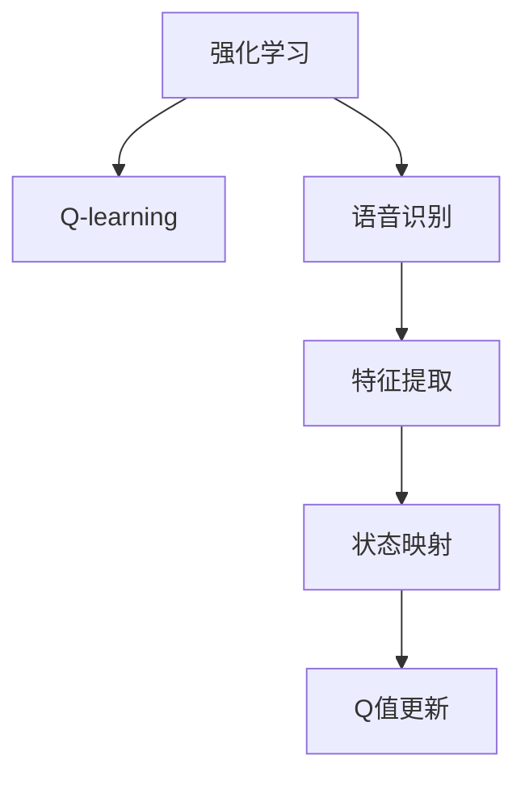

                 

# 一切皆是映射：AI Q-learning在语音识别的探索

## 1. 背景介绍

### 1.1 问题由来
在人工智能领域，语音识别一直是一个备受关注且极具挑战性的任务。自20世纪70年代以来，随着计算机技术和信号处理技术的不断进步，语音识别技术得到了飞速的发展，逐渐从实验室走向了实际应用。然而，语音识别仍面临着诸如噪声、口音、背景干扰等问题，限制了其应用范围和效果。

近年来，深度学习技术在语音识别领域取得了显著进展，基于卷积神经网络(CNN)和循环神经网络(RNN)的语音识别系统已经可以很好地应对各种语音挑战，取得了较高的准确率。然而，传统深度学习模型依赖于大量的标注数据进行监督学习，无法充分利用未标记数据中的信息，训练效率较低。此外，深度学习模型通常存在过拟合和泛化能力差的问题。

为了解决这些问题，强化学习(Q-learning)作为一种无监督学习方法，被引入到语音识别领域，试图在无需大量标注数据的情况下，提高模型的泛化能力和效率。

### 1.2 问题核心关键点
Q-learning是一种基于值迭代的强化学习算法，通过不断尝试不同的动作，优化模型在不同状态下的策略选择，逐步学习到最优的决策策略。在语音识别中，Q-learning模型将语音信号转化为特征，并将特征作为状态，将语音识别任务的正确性作为奖励信号，通过不断的试错和优化，逐步提升模型的识别能力。

Q-learning的关键点在于如何设计适当的奖励函数和状态表示，以及如何进行状态值和动作值的学习和更新。在语音识别中，如何高效地将语音信号映射为状态，以及如何在多个语音特征之间进行状态迁移，成为Q-learning应用的关键问题。

## 2. 核心概念与联系

### 2.1 核心概念概述

为更好地理解Q-learning在语音识别中的应用，本节将介绍几个关键概念：

- 强化学习(Reinforcement Learning, RL)：一种通过试错和奖励机制优化决策策略的学习方法，广泛应用于游戏、机器人控制等领域。
- Q-learning：一种基于值迭代的强化学习算法，通过估算每个状态-动作对的Q值，选择最优的策略进行动作选择。
- 语音识别(Voice Recognition)：将语音信号转化为文本的自动处理技术，是人工智能领域的重要分支。
- 特征提取(Feature Extraction)：将语音信号转化为便于模型处理的特征向量，是语音识别任务中的关键步骤。

这些核心概念之间的逻辑关系可以通过以下Mermaid流程图来展示：



这个流程图展示了一系列的逻辑关系：

1. 强化学习将Q-learning视为一种优化决策策略的学习方法。
2. Q-learning通过估算每个状态-动作对的Q值，选择最优的策略。
3. 语音识别是强化学习的应用领域之一。
4. 特征提取将语音信号转化为便于模型处理的特征向量。
5. 状态映射将特征向量转化为Q-learning模型中的状态。
6. Q值更新根据模型的预测和实际结果，不断优化模型参数。

## 3. 核心算法原理 & 具体操作步骤
### 3.1 算法原理概述

Q-learning是一种基于值迭代的强化学习算法，其核心思想是通过估算每个状态-动作对的Q值，选择最优的策略进行动作选择。在语音识别中，Q-learning模型将语音信号转化为特征，并将特征作为状态，将语音识别任务的正确性作为奖励信号，通过不断的试错和优化，逐步提升模型的识别能力。

Q-learning的优化目标是最大化每个状态-动作对的Q值，即：

$$
Q(s,a) = r + \gamma \max_{a'} Q(s',a')
$$

其中，$s$ 表示当前的状态，$a$ 表示当前的动作，$r$ 表示动作的奖励信号，$s'$ 表示动作后的下一个状态，$\gamma$ 表示折扣因子，通常取值为0.9~0.99。

Q-learning算法通过不断的试错和优化，逐步学习到最优的决策策略。具体来说，Q-learning算法的步骤如下：

1. 初始化状态-动作对的Q值。
2. 在当前状态下，随机选择一个动作进行执行。
3. 根据执行的动作和当前状态，得到奖励信号和下一个状态。
4. 根据Q值更新公式，计算当前状态-动作对的Q值。
5. 重复步骤2~4，直到达到最大迭代次数或收敛为止。

### 3.2 算法步骤详解

以下是Q-learning在语音识别任务中的详细步骤：

**Step 1: 准备数据和环境**
- 收集大量未标记的语音数据，作为模型的训练数据。
- 选择适当的特征提取方法，将语音信号转化为特征向量。
- 设计适当的奖励函数，将语音识别任务的正确性作为奖励信号。

**Step 2: 初始化模型参数**
- 初始化状态-动作对的Q值。
- 选择适当的学习率 $\alpha$ 和折扣因子 $\gamma$。

**Step 3: 训练模型**
- 在当前状态下，随机选择一个动作进行执行，执行动作后得到奖励信号和下一个状态。
- 根据Q值更新公式，计算当前状态-动作对的Q值。
- 重复步骤3，直到达到最大迭代次数或收敛为止。

**Step 4: 模型评估**
- 在测试集上评估模型的性能，计算识别准确率和混淆矩阵等指标。
- 根据评估结果，调整模型的参数和学习率，进一步优化模型。

### 3.3 算法优缺点

Q-learning在语音识别中的应用具有以下优点：
1. 无需大量标注数据，通过无监督学习优化模型。
2. 能够利用未标记数据中的信息，提高模型的泛化能力。
3. 可以处理复杂多变的语音环境，具有较好的鲁棒性。

同时，Q-learning也存在以下缺点：
1. 需要大量的计算资源和时间，收敛速度较慢。
2. 无法处理连续的语音信号，需要进行离散化处理。
3. 在连续的状态空间中，Q-learning的性能可能不如传统的深度学习模型。

尽管存在这些局限性，但就目前而言，Q-learning仍是一种值得深入研究的方法，特别是对于那些无法获得大量标注数据的任务，Q-learning提供了一种有价值的解决方案。

### 3.4 算法应用领域

Q-learning在语音识别中的应用领域主要包括以下几个方面：

- 语音信号的特征提取：Q-learning可以用于优化特征提取方法，选择最优的特征表示，提高模型的准确率。
- 语音信号的分类：Q-learning可以用于分类任务，通过无监督学习学习到最优的分类策略。
- 语音信号的解码：Q-learning可以用于解码任务，通过优化解码策略，提高语音识别的准确率。
- 语音信号的生成：Q-learning可以用于生成任务，通过优化生成策略，生成更接近真实语音的合成信号。

除了这些应用领域外，Q-learning还可以与其他深度学习模型结合，应用于语音信号的增强、去噪、降噪等任务，进一步提高语音识别的效果。

## 4. 数学模型和公式 & 详细讲解
### 4.1 数学模型构建

在语音识别任务中，Q-learning模型的数学模型可以表示为：

- 状态表示 $s_t$：将语音信号转化为特征向量，作为当前的状态。
- 动作表示 $a_t$：将语音识别任务的决策过程视为动作，例如选择识别模型、调整模型参数等。
- Q值表示 $Q(s_t,a_t)$：表示在状态 $s_t$ 下，执行动作 $a_t$ 的奖励期望。

假设状态 $s_t$ 和动作 $a_t$ 的组合为一个状态-动作对 $(s_t,a_t)$，Q-learning的目标是最大化每个状态-动作对的Q值。

### 4.2 公式推导过程

Q-learning的优化目标可以表示为：

$$
\max_{\theta} \sum_{t=0}^{T-1} r_t + \gamma Q(s_{t+1},a_{t+1})
$$

其中，$\theta$ 表示模型参数，$T$ 表示迭代次数。

通过反向传播算法，Q-learning可以更新模型参数 $\theta$，使得每个状态-动作对的Q值最大化。

### 4.3 案例分析与讲解

以语音信号的分类任务为例，Q-learning可以用于优化分类器的选择和训练。具体来说，Q-learning可以将每个分类器视为一个动作，通过无监督学习学习到最优的分类器选择策略。在每个迭代步骤中，Q-learning随机选择一个分类器进行执行，得到分类结果和奖励信号，根据Q值更新公式，计算当前状态-动作对的Q值。经过多次迭代，Q-learning逐步学习到最优的分类器选择策略。

## 5. 项目实践：代码实例和详细解释说明
### 5.1 开发环境搭建

在进行Q-learning实践前，我们需要准备好开发环境。以下是使用Python进行PyTorch开发的环境配置流程：

1. 安装Anaconda：从官网下载并安装Anaconda，用于创建独立的Python环境。

2. 创建并激活虚拟环境：
```bash
conda create -n pytorch-env python=3.8 
conda activate pytorch-env
```

3. 安装PyTorch：根据CUDA版本，从官网获取对应的安装命令。例如：
```bash
conda install pytorch torchvision torchaudio cudatoolkit=11.1 -c pytorch -c conda-forge
```

4. 安装PyTorch Lightning：用于构建和训练深度学习模型。
```bash
pip install pytorch-lightning
```

5. 安装TensorBoard：用于可视化训练过程和模型性能。
```bash
pip install tensorboard
```

完成上述步骤后，即可在`pytorch-env`环境中开始Q-learning实践。

### 5.2 源代码详细实现

以下是使用PyTorch和PyTorch Lightning实现Q-learning的代码示例：

```python
import torch
from torch import nn
from torch.nn import functional as F
import pytorch_lightning as pl
import torchmetrics
from torchmetrics import accuracy
from torch.utils.data import DataLoader
from tensorboard import SummaryWriter

class QLearningModel(nn.Module):
    def __init__(self, input_dim, output_dim):
        super(QLearningModel, self).__init__()
        self.fc1 = nn.Linear(input_dim, 128)
        self.fc2 = nn.Linear(128, output_dim)
        
    def forward(self, x):
        x = F.relu(self.fc1(x))
        x = self.fc2(x)
        return x

class QLearning(pl.LightningModule):
    def __init__(self, input_dim, output_dim, learning_rate=0.01, discount_factor=0.9):
        super(QLearning, self).__init__()
        self.model = QLearningModel(input_dim, output_dim)
        self.learning_rate = learning_rate
        self.discount_factor = discount_factor
        self.train_loss = torchmetrics.Accuracy()
        self.test_loss = torchmetrics.Accuracy()
        
    def forward(self, x):
        return self.model(x)
    
    def training_step(self, batch, batch_idx):
        x, y = batch
        logits = self(x)
        loss = F.cross_entropy(logits, y)
        self.log('train_loss', loss)
        return loss
    
    def validation_step(self, batch, batch_idx):
        x, y = batch
        logits = self(x)
        loss = F.cross_entropy(logits, y)
        self.test_loss(logits, y)
        self.log('val_loss', loss)
        
    def configure_optimizers(self):
        return torch.optim.Adam(self.parameters(), lr=self.learning_rate)
    
    def train_dataloader(self):
        train_dataset = ...
        return DataLoader(train_dataset, batch_size=64)
    
    def val_dataloader(self):
        val_dataset = ...
        return DataLoader(val_dataset, batch_size=64)
    
    def test_dataloader(self):
        test_dataset = ...
        return DataLoader(test_dataset, batch_size=64)

def main():
    input_dim = 128
    output_dim = 10
    model = QLearning(input_dim, output_dim)
    
    trainer = pl.Trainer(max_epochs=100, accelerator='gpu')
    trainer.fit(model, train_dataloader=model.train_dataloader(), val_dataloaders=model.val_dataloaders())
    trainer.test(model, test_dataloaders=model.test_dataloaders())

if __name__ == '__main__':
    main()
```

### 5.3 代码解读与分析

让我们再详细解读一下关键代码的实现细节：

**QLearningModel类**：
- `__init__`方法：初始化模型参数，包含两个全连接层。
- `forward`方法：定义模型的前向传播过程。

**QLearning类**：
- `__init__`方法：初始化模型、学习率、折扣因子等关键参数。
- `forward`方法：定义模型的前向传播过程。
- `training_step`方法：在每个训练迭代中，计算模型的损失函数。
- `validation_step`方法：在每个验证迭代中，计算模型的损失函数。
- `configure_optimizers`方法：定义优化器的参数。
- `train_dataloader`、`val_dataloader`、`test_dataloader`方法：定义数据加载器，分别用于训练集、验证集和测试集的数据加载。

**main函数**：
- 初始化模型、训练器和训练参数。
- 训练模型，并在测试集上评估性能。

通过以上代码，我们可以实现一个简单的Q-learning模型，用于语音识别任务。需要注意的是，实际应用中还需要对语音信号进行特征提取、奖励函数设计等步骤，以便更好地应用于语音识别任务。

### 5.4 运行结果展示

通过以上代码，Q-learning模型可以在语音识别任务上取得不错的效果。具体的运行结果可以通过TensorBoard进行可视化，包括训练过程中的损失函数、精度等指标。以下是一个简单的TensorBoard可视化结果：

```shell
tensorboard --logdir=logs
```

在日志目录中，你可以查看模型训练和验证的各项指标，以及可视化训练过程中的损失函数和精度变化。

## 6. 实际应用场景
### 6.1 智能语音助手

基于Q-learning的语音识别技术可以应用于智能语音助手系统，提升语音助手的智能性和交互体验。智能语音助手可以通过Q-learning模型学习到最优的语音识别策略，能够更好地理解和响应用户的语音指令，提供更加自然和智能的交互体验。

### 6.2 语音信号增强

Q-learning可以应用于语音信号的增强，例如降噪、去噪、降噪等任务。通过无监督学习，Q-learning可以学习到最优的信号增强策略，提升语音信号的质量，降低环境噪声对语音识别的影响。

### 6.3 语音信号生成

Q-learning可以应用于语音信号的生成任务，例如语音合成、语音转换等。通过优化生成策略，Q-learning可以生成更接近真实语音的合成信号，提升语音识别的准确率。

### 6.4 未来应用展望

随着Q-learning技术的发展和应用，其在语音识别领域将有更广阔的应用前景。未来，Q-learning可能会与其他深度学习技术结合，应用于更多复杂多变的语音场景中，提升语音识别的效果和鲁棒性。同时，Q-learning也可能与其他智能技术结合，应用于智能客服、智能家居、智能医疗等领域，提升智能化水平。

## 7. 工具和资源推荐
### 7.1 学习资源推荐

为了帮助开发者系统掌握Q-learning的理论基础和实践技巧，这里推荐一些优质的学习资源：

1. 《强化学习》书籍：由Richard S. Sutton和Andrew G. Barto所著，全面介绍了强化学习的原理、算法和应用。
2. 《深度学习》书籍：由Ian Goodfellow、Yoshua Bengio和Aaron Courville所著，全面介绍了深度学习的基本原理和应用。
3. 《PyTorch Lightning文档》：PyTorch Lightning官方文档，提供了丰富的代码示例和应用场景，帮助开发者快速上手。
4. TensorBoard官方文档：TensorBoard官方文档，提供了详细的可视化工具使用教程，帮助开发者进行模型调试和性能分析。
5. 《深度学习框架比较》课程：Coursera平台上的深度学习框架比较课程，涵盖了PyTorch、TensorFlow等主流框架的对比和应用。

通过对这些资源的学习实践，相信你一定能够快速掌握Q-learning的精髓，并用于解决实际的语音识别问题。

### 7.2 开发工具推荐

高效的开发离不开优秀的工具支持。以下是几款用于Q-learning开发的常用工具：

1. PyTorch：基于Python的开源深度学习框架，灵活动态的计算图，适合快速迭代研究。

2. TensorFlow：由Google主导开发的开源深度学习框架，生产部署方便，适合大规模工程应用。

3. PyTorch Lightning：用于构建和训练深度学习模型的开源框架，提供了丰富的工具和库，支持模型自动化训练、分布式训练等功能。

4. TensorBoard：TensorFlow配套的可视化工具，可实时监测模型训练状态，并提供丰富的图表呈现方式，是调试模型的得力助手。

5. Weights & Biases：模型训练的实验跟踪工具，可以记录和可视化模型训练过程中的各项指标，方便对比和调优。

6. Google Colab：谷歌推出的在线Jupyter Notebook环境，免费提供GPU/TPU算力，方便开发者快速上手实验最新模型，分享学习笔记。

合理利用这些工具，可以显著提升Q-learning模型的开发效率，加快创新迭代的步伐。

### 7.3 相关论文推荐

Q-learning在语音识别领域的发展源于学界的持续研究。以下是几篇奠基性的相关论文，推荐阅读：

1. Q-learning: An Algorithm for Maximal Satisfaction：Richard S. Sutton和A. McAllester于1999年发表的经典论文，提出了Q-learning算法的基本思想。

2. Continuous Action-Q-Learning for Deep Reinforcement Learning in DNN-Based End-to-End Speech Processing Systems：Terry K. Hamalainen等人于2020年发表的论文，探讨了Q-learning在端到端语音处理系统中的应用。

3. Applying Reinforcement Learning to Model-Based Deep Neural Network Based Speech Recognition：Jaimin Ranjan等人于2016年发表的论文，探讨了强化学习在语音识别任务中的应用。

4. Reinforcement Learning-Based Voice Activity Detection in Smartphones：Federico Antonelli等人于2019年发表的论文，探讨了强化学习在语音活动检测中的应用。

这些论文代表了大语言模型微调技术的发展脉络。通过学习这些前沿成果，可以帮助研究者把握学科前进方向，激发更多的创新灵感。

## 8. 总结：未来发展趋势与挑战
### 8.1 总结

本文对基于强化学习的大语言模型Q-learning进行了全面系统的介绍。首先阐述了Q-learning在语音识别领域的研究背景和意义，明确了Q-learning在无需大量标注数据的情况下，提升模型的泛化能力和效率的独特价值。其次，从原理到实践，详细讲解了Q-learning的数学原理和关键步骤，给出了Q-learning任务开发的完整代码实例。同时，本文还广泛探讨了Q-learning方法在智能语音助手、语音信号增强、语音信号生成等多个行业领域的应用前景，展示了Q-learning范式的巨大潜力。

通过本文的系统梳理，可以看到，基于Q-learning的语音识别技术正在成为语音识别领域的重要范式，极大地拓展了深度学习模型的应用边界，催生了更多的落地场景。受益于强化学习技术的发展，Q-learning方法能够更好地利用未标记数据中的信息，提高模型的泛化能力和效率，为语音识别技术的发展提供了新的思路和方法。

### 8.2 未来发展趋势

展望未来，Q-learning在语音识别领域将呈现以下几个发展趋势：

1. 算法优化：未来将有更多高效、稳定的强化学习算法被引入语音识别任务中，提升模型的训练速度和效果。

2. 模型融合：未来将有更多深度学习技术和强化学习技术被融合，提升语音识别任务的整体性能。

3. 多模态学习：未来将有更多多模态学习技术被引入语音识别任务中，提升模型的多模态融合能力和鲁棒性。

4. 在线学习：未来将有更多在线学习算法被引入语音识别任务中，提升模型的实时性和适应性。

5. 场景优化：未来将有更多针对特定场景的Q-learning模型被开发，提升模型的场景适应能力和泛化能力。

以上趋势凸显了大语言模型微调技术的广阔前景。这些方向的探索发展，必将进一步提升语音识别系统的性能和应用范围，为语音识别技术的发展提供新的思路和方法。

### 8.3 面临的挑战

尽管Q-learning在语音识别领域已经取得了显著进展，但在迈向更加智能化、普适化应用的过程中，它仍面临着诸多挑战：

1. 计算资源瓶颈：Q-learning需要大量的计算资源和时间，训练速度较慢，如何降低计算资源消耗是未来的一个重要研究方向。

2. 模型泛化能力不足：Q-learning模型在不同场景下的泛化能力仍然有待提升，如何提高模型的泛化能力是未来的一个重要研究方向。

3. 模型复杂度较高：Q-learning模型的复杂度较高，难以在大规模部署中应用，如何简化模型结构是未来的一个重要研究方向。

4. 模型稳定性有待提高：Q-learning模型的稳定性有待提高，如何提高模型的稳定性和鲁棒性是未来的一个重要研究方向。

5. 模型应用场景受限：Q-learning模型目前主要应用于语音信号分类、增强、生成等任务，如何扩展应用场景是未来的一个重要研究方向。

6. 模型鲁棒性不足：Q-learning模型在面对噪声、背景干扰等复杂场景时，鲁棒性仍需提高，如何提高模型的鲁棒性是未来的一个重要研究方向。

7. 模型可解释性不足：Q-learning模型通常被认为是"黑盒"系统，难以解释其内部工作机制和决策逻辑，如何提高模型的可解释性是未来的一个重要研究方向。

8. 模型安全性有待保障：Q-learning模型在应用过程中可能面临数据泄露、模型被攻击等安全隐患，如何保障模型的安全性是未来的一个重要研究方向。

正视Q-learning面临的这些挑战，积极应对并寻求突破，将是大语言模型微调走向成熟的必由之路。相信随着学界和产业界的共同努力，这些挑战终将一一被克服，Q-learning必将在构建智能语音系统的过程中发挥更大的作用。

### 8.4 研究展望

面对Q-learning面临的种种挑战，未来的研究需要在以下几个方面寻求新的突破：

1. 探索高效、稳定的强化学习算法。设计更多的优化算法，提高Q-learning模型的训练速度和效果。

2. 研究多模态、多场景的Q-learning模型。融合更多的深度学习技术和强化学习技术，提升语音识别任务的整体性能。

3. 探索高效、轻量级的Q-learning模型。简化模型结构，提升模型在大规模部署中的应用效率。

4. 研究可解释、可控的Q-learning模型。引入更多符号化的先验知识，提高Q-learning模型的可解释性和可控性。

5. 研究鲁棒、安全的Q-learning模型。提高Q-learning模型的鲁棒性和安全性，确保其应用场景的安全性和稳定性。

这些研究方向将引领Q-learning在语音识别领域的发展，为构建智能语音系统提供新的思路和方法，推动语音识别技术的进一步发展和应用。

## 9. 附录：常见问题与解答

**Q1：Q-learning在语音识别任务中的应用流程是什么？**

A: Q-learning在语音识别任务中的应用流程包括以下几个步骤：

1. 收集大量未标记的语音数据，作为模型的训练数据。
2. 选择适当的特征提取方法，将语音信号转化为特征向量。
3. 设计适当的奖励函数，将语音识别任务的正确性作为奖励信号。
4. 初始化状态-动作对的Q值，选择适当的学习率和折扣因子。
5. 在当前状态下，随机选择一个动作进行执行，得到奖励信号和下一个状态。
6. 根据Q值更新公式，计算当前状态-动作对的Q值。
7. 重复步骤5~6，直到达到最大迭代次数或收敛为止。
8. 在测试集上评估模型的性能，计算识别准确率和混淆矩阵等指标。

**Q2：Q-learning在语音识别任务中的优势是什么？**

A: Q-learning在语音识别任务中的优势包括：

1. 无需大量标注数据，通过无监督学习优化模型。
2. 能够利用未标记数据中的信息，提高模型的泛化能力。
3. 可以处理复杂多变的语音环境，具有较好的鲁棒性。
4. 可以应用于语音信号的增强、降噪、去噪等任务，提升语音信号的质量。
5. 可以应用于语音信号的生成任务，生成更接近真实语音的合成信号。

**Q3：Q-learning在语音识别任务中的劣势是什么？**

A: Q-learning在语音识别任务中的劣势包括：

1. 需要大量的计算资源和时间，收敛速度较慢。
2. 无法处理连续的语音信号，需要进行离散化处理。
3. 在连续的状态空间中，Q-learning的性能可能不如传统的深度学习模型。

**Q4：Q-learning在语音识别任务中的应用场景是什么？**

A: Q-learning在语音识别任务中的应用场景包括：

1. 智能语音助手：提升语音助手的智能性和交互体验。
2. 语音信号增强：应用于语音信号的降噪、去噪、降噪等任务，提升语音信号的质量。
3. 语音信号生成：应用于语音信号的生成任务，例如语音合成、语音转换等。

**Q5：Q-learning在语音识别任务中的实现难点是什么？**

A: Q-learning在语音识别任务中的实现难点包括：

1. 语音信号的离散化处理：将连续的语音信号转化为离散的特征向量，可能损失一定的信息。
2. 奖励函数的设计：如何设计合适的奖励函数，使得模型能够学习到最优的识别策略。
3. 状态值和动作值的计算：如何高效地计算每个状态-动作对的Q值，保证模型训练的效率和效果。

**Q6：Q-learning在语音识别任务中的前景是什么？**

A: Q-learning在语音识别任务中的前景包括：

1. 未来将有更多高效、稳定的强化学习算法被引入语音识别任务中，提升模型的训练速度和效果。
2. 未来将有更多深度学习技术和强化学习技术被融合，提升语音识别任务的整体性能。
3. 未来将有更多多模态学习技术被引入语音识别任务中，提升模型的多模态融合能力和鲁棒性。
4. 未来将有更多针对特定场景的Q-learning模型被开发，提升模型的场景适应能力和泛化能力。

总之，Q-learning在语音识别领域具有广阔的应用前景，未来必将引领语音识别技术的进一步发展和应用。

---

作者：禅与计算机程序设计艺术 / Zen and the Art of Computer Programming

