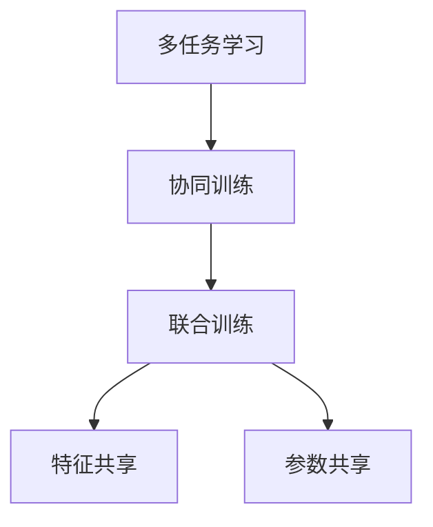

                 

## 1. 背景介绍

随着人工智能技术的迅速发展，神经网络作为其核心组成部分，已经广泛应用于图像处理、自然语言处理、语音识别、推荐系统等多个领域。特别是深度学习框架的兴起，使得训练复杂的多层神经网络变得前所未有的简单和高效。然而，在实际应用中，单任务的神经网络往往难以充分挖掘数据中的信息，且在面对多变的环境和复杂的需求时显得捉襟见肘。为了更好地利用数据的潜在价值，研究人员提出了多任务学习(MTL)的方法，希望通过训练一个模型来解决多个相关任务，从而提升整体性能和泛化能力。

多任务学习(Multitask Learning, MTL)指的是在一个学习任务中，同时训练多个子任务，每个子任务都有各自的损失函数，但共享一部分网络参数，以提高模型对多个任务的适应能力和泛化性能。该方法通过共享参数，减少了冗余训练，提高了模型的泛化能力，并能够充分利用数据的多样性，提升模型的性能和可解释性。

## 2. 核心概念与联系

### 2.1 核心概念概述

为更好地理解多任务学习与神经网络的协同训练方法，本节将介绍几个密切相关的核心概念：

- **多任务学习**(Multitask Learning, MTL)：指在一个学习任务中，同时训练多个子任务，每个子任务都有各自的损失函数，但共享一部分网络参数，以提高模型对多个任务的适应能力和泛化性能。

- **协同训练**(Co-training)：指多个学习任务共享网络参数，相互辅助，协同学习，从而提升模型的整体性能。

- **联合训练**(Joint Training)：指多个学习任务共享同一批数据，共同训练，相互促进，从而提升模型的泛化能力。

- **特征共享**(Feature Sharing)：指不同任务之间共享底层特征表示，减少冗余训练，提高模型的泛化性能。

- **参数共享**(Parameter Sharing)：指不同任务之间共享大部分或全部参数，进一步提升模型的适应能力和泛化性能。

这些核心概念之间的逻辑关系可以通过以下Mermaid流程图来展示：



这个流程图展示了大模型微调的各个核心概念及其之间的逻辑关系：

1. 多任务学习通过共享参数，减少了冗余训练，提高了模型的泛化能力。
2. 协同训练通过共享同一批数据，协同学习，相互促进，提升了模型的整体性能。
3. 联合训练进一步提升了模型的泛化能力，通过共享底层特征表示，减少了冗余训练。
4. 参数共享通过共享大部分或全部参数，进一步提升了模型的适应能力和泛化性能。

这些概念共同构成了多任务学习的方法论框架，使得神经网络模型能够在多任务环境下更好地发挥作用。通过理解这些核心概念，我们可以更好地把握多任务学习的原理和优化方向。

### 2.2 核心算法原理

多任务学习通过在单个神经网络中共享参数，同时训练多个相关任务，来提升模型的泛化能力和适应性。其核心算法原理包括以下几个方面：

1. **任务定义**：首先需要明确多个子任务的定义和目标，如文本分类、情感分析、命名实体识别等。

2. **损失函数**：对于每个子任务，定义对应的损失函数。常用的损失函数包括交叉熵损失、均方误差损失等。

3. **参数共享**：共享部分或全部神经网络参数，以减少冗余训练，提升模型的泛化性能。

4. **任务权重**：根据不同任务的重要性，设定相应的权重系数，以控制各个任务对模型整体性能的影响。

5. **优化算法**：使用梯度下降等优化算法，最小化所有任务的联合损失函数，更新模型参数。

### 2.3 核心算法步骤

多任务学习的训练过程主要包括以下几个关键步骤：

**Step 1: 定义子任务及损失函数**

- 定义多个子任务 $T_1, T_2, \cdots, T_n$，以及每个子任务的损失函数 $L_1, L_2, \cdots, L_n$。

**Step 2: 共享参数**

- 确定需要共享的参数 $W$，即所有子任务共用的一组权重。

**Step 3: 初始化模型**

- 初始化神经网络模型，设定共享参数 $W$ 的初始值。

**Step 4: 联合训练**

- 使用梯度下降等优化算法，最小化所有子任务的联合损失函数 $\sum_{i=1}^n L_i(\theta)$。

**Step 5: 任务权重调整**

- 根据不同任务的重要性，调整任务权重 $w_i$，以平衡各个任务的影响。

**Step 6: 模型测试**

- 在测试集上评估模型性能，确定最佳权重系数和共享参数。

## 3. 核心算法原理 & 具体操作步骤

### 3.1 算法原理概述

多任务学习通过在单个神经网络中共享参数，同时训练多个相关任务，来提升模型的泛化能力和适应性。其核心思想是利用数据的多样性和相关性，通过联合训练，使得模型能够更好地学习到数据中的潜在结构和规律，从而提升模型的整体性能。

形式化地，假设多个子任务分别为 $T_1, T_2, \cdots, T_n$，对应的损失函数分别为 $L_1, L_2, \cdots, L_n$。多任务学习的目标是最小化所有子任务的联合损失函数：

$$
\min_{\theta} \sum_{i=1}^n w_i L_i(M_{\theta}(x_i))
$$

其中 $\theta$ 为神经网络模型的参数，$w_i$ 为任务权重，$x_i$ 为子任务 $T_i$ 的数据。优化目标是找到最优的参数 $\theta$，使得所有子任务的联合损失最小化。

### 3.2 算法步骤详解

多任务学习的训练过程主要包括以下几个关键步骤：

**Step 1: 定义子任务及损失函数**

- 首先，需要定义多个子任务 $T_1, T_2, \cdots, T_n$，并确定每个子任务的损失函数 $L_1, L_2, \cdots, L_n$。例如，对于文本分类任务和情感分析任务，可以分别定义交叉熵损失函数。

**Step 2: 共享参数**

- 确定需要共享的参数 $W$，即所有子任务共用的一组权重。通常，共享参数包括卷积核、全连接层等底层网络参数。

**Step 3: 初始化模型**

- 初始化神经网络模型，设定共享参数 $W$ 的初始值。初始值的设置可以通过预训练、随机初始化等方法进行。

**Step 4: 联合训练**

- 使用梯度下降等优化算法，最小化所有子任务的联合损失函数 $\sum_{i=1}^n w_i L_i(\theta)$。通常，使用AdamW、SGD等优化器进行优化。

**Step 5: 任务权重调整**

- 根据不同任务的重要性，调整任务权重 $w_i$，以平衡各个任务的影响。可以通过交叉验证、网格搜索等方法确定最佳权重。

**Step 6: 模型测试**

- 在测试集上评估模型性能，确定最佳权重系数和共享参数。通常，使用准确率、F1-score等指标进行评估。

### 3.3 算法优缺点

多任务学习具有以下优点：

1. **提高泛化能力**：通过共享参数，减少了冗余训练，提升了模型的泛化能力。
2. **提高适应能力**：多任务学习能够更好地利用数据的多样性，提升模型的适应能力。
3. **提升性能**：多任务学习通过联合训练，提高了模型的整体性能。
4. **降低成本**：多任务学习可以同时训练多个任务，减少了训练成本和数据需求。

同时，该方法也存在一些局限性：

1. **模型复杂度**：多任务学习需要同时训练多个任务，模型复杂度较高，增加了训练难度。
2. **任务间耦合**：任务间耦合度较高时，单个任务的性能可能受到其他任务的影响。
3. **数据依赖**：多任务学习依赖于数据的多样性和相关性，数据质量不佳时效果可能不理想。
4. **参数调整**：任务权重和共享参数的调整需要经验，需要根据具体任务进行调整。

尽管存在这些局限性，但多任务学习在许多领域都显示出了强大的潜力和应用前景，成为了神经网络模型的一个重要研究方向。

### 3.4 算法应用领域

多任务学习已经在图像处理、自然语言处理、语音识别、推荐系统等多个领域得到了广泛应用，如：

- **图像处理**：多任务学习可以同时训练图像分类、目标检测、语义分割等多个任务，提升模型的整体性能。
- **自然语言处理**：多任务学习可以同时训练情感分析、命名实体识别、问答系统等多个任务，提升模型的泛化能力。
- **语音识别**：多任务学习可以同时训练语音识别、情感识别、说话人识别等多个任务，提升模型的适应能力。
- **推荐系统**：多任务学习可以同时训练推荐商品、用户画像、社交网络等多个任务，提升推荐系统的个性化和多样性。

此外，多任务学习还在医疗、金融、交通等多个领域得到了创新性的应用，为传统行业数字化转型升级提供了新的技术路径。

## 4. 数学模型和公式 & 详细讲解 & 举例说明

### 4.1 数学模型构建

多任务学习的数学模型构建主要包括以下几个关键组成部分：

- **神经网络结构**：定义神经网络的结构和参数 $\theta$。
- **子任务目标**：定义多个子任务的损失函数 $L_i$。
- **联合损失函数**：将多个子任务的损失函数加权求和，得到联合损失函数 $L(\theta)$。
- **优化目标**：最小化联合损失函数 $L(\theta)$，优化模型参数 $\theta$。

### 4.2 公式推导过程

以下我们以两个子任务为例，推导多任务学习的数学模型：

假设两个子任务分别为 $T_1$ 和 $T_2$，对应的损失函数分别为 $L_1$ 和 $L_2$。神经网络结构如下：


其中 $h$ 为隐藏层输出，$W_1$ 和 $W_2$ 为两个子任务的共享参数。

多任务学习的联合损失函数可以表示为：

$$
L(\theta) = w_1 L_1(h) + w_2 L_2(h)
$$

其中 $w_1$ 和 $w_2$ 为两个子任务的任务权重。

多任务学习的优化目标是最小化联合损失函数 $L(\theta)$，使用梯度下降等优化算法进行优化：

$$
\theta \leftarrow \theta - \eta \nabla_{\theta} L(\theta)
$$

其中 $\eta$ 为学习率，$\nabla_{\theta} L(\theta)$ 为联合损失函数对参数 $\theta$ 的梯度，可通过自动微分技术高效计算。

### 4.3 案例分析与讲解

以多任务学习在自然语言处理中的应用为例，分析其效果和优势。

假设两个子任务分别为情感分析任务和命名实体识别任务，对应的损失函数分别为 $L_1$ 和 $L_2$。神经网络结构如下：


其中 $h$ 为隐藏层输出，$W_1$ 和 $W_2$ 为两个子任务的共享参数。

假设训练集中包含情感分析样本和命名实体识别样本，使用梯度下降等优化算法进行联合训练。多任务学习的联合损失函数可以表示为：

$$
L(\theta) = w_1 L_1(h) + w_2 L_2(h)
$$

其中 $w_1$ 和 $w_2$ 为情感分析和命名实体识别任务的任务权重。

通过联合训练，两个子任务可以共享底层特征表示，减少了冗余训练，提升了模型的泛化能力和适应能力。同时，两个子任务的目标函数被加权求和，控制了各个任务对模型整体性能的影响，使得模型能够更好地适应不同任务的需求。

## 5. 项目实践：代码实例和详细解释说明

### 5.1 开发环境搭建

在进行多任务学习实践前，我们需要准备好开发环境。以下是使用Python进行PyTorch开发的环境配置流程：

1. 安装Anaconda：从官网下载并安装Anaconda，用于创建独立的Python环境。

2. 创建并激活虚拟环境：
```bash
conda create -n pytorch-env python=3.8 
conda activate pytorch-env
```

3. 安装PyTorch：根据CUDA版本，从官网获取对应的安装命令。例如：
```bash
conda install pytorch torchvision torchaudio cudatoolkit=11.1 -c pytorch -c conda-forge
```

4. 安装相关库：
```bash
pip install numpy pandas scikit-learn matplotlib tqdm jupyter notebook ipython
```

完成上述步骤后，即可在`pytorch-env`环境中开始多任务学习实践。

### 5.2 源代码详细实现

下面我们以多任务学习在图像分类和物体检测任务中的应用为例，给出使用PyTorch进行多任务学习的PyTorch代码实现。

首先，定义两个子任务的损失函数：

```python
import torch.nn as nn
import torch.optim as optim

class MultiTaskLoss(nn.Module):
    def __init__(self, weight1, weight2):
        super(MultiTaskLoss, self).__init__()
        self.weight1 = weight1
        self.weight2 = weight2
        self.loss1 = nn.CrossEntropyLoss()
        self.loss2 = nn.MSELoss()
    
    def forward(self, output1, output2, target1, target2):
        loss1 = self.weight1 * self.loss1(output1, target1)
        loss2 = self.weight2 * self.loss2(output2, target2)
        return loss1 + loss2
```

然后，定义两个子任务的数据处理函数：

```python
from torch.utils.data import Dataset, DataLoader
import torchvision.transforms as transforms
import numpy as np

class ImageDataset(Dataset):
    def __init__(self, data, transform=None):
        self.data = data
        self.transform = transform
        
    def __len__(self):
        return len(self.data)
    
    def __getitem__(self, idx):
        img, target = self.data[idx]
        img = transforms.ToTensor()(img)
        if self.transform:
            img = self.transform(img)
        target = torch.tensor(target, dtype=torch.long)
        return img, target
```

接着，定义两个子任务的模型和优化器：

```python
from torchvision.models import resnet18

class MultiTaskNet(nn.Module):
    def __init__(self, in_channels=3, num_classes1=10, num_classes2=5, weight1=1, weight2=1):
        super(MultiTaskNet, self).__init__()
        self.conv1 = nn.Conv2d(in_channels, 64, kernel_size=3, stride=1, padding=1)
        self.relu1 = nn.ReLU(inplace=True)
        self.conv2 = nn.Conv2d(64, 128, kernel_size=3, stride=1, padding=1)
        self.relu2 = nn.ReLU(inplace=True)
        self.avgpool = nn.AvgPool2d(kernel_size=7, stride=1)
        self.fc1 = nn.Linear(512, num_classes1)
        self.fc2 = nn.Linear(512, num_classes2)
        self.weight1 = weight1
        self.weight2 = weight2
        
    def forward(self, x):
        x = self.conv1(x)
        x = self.relu1(x)
        x = self.conv2(x)
        x = self.relu2(x)
        x = self.avgpool(x)
        x = x.view(x.size(0), -1)
        x = self.fc1(x)
        x = self.fc2(x)
        return x
    
    def get_loss(self, output1, output2, target1, target2):
        loss = self.weight1 * nn.CrossEntropyLoss()(output1, target1) + self.weight2 * nn.MSELoss()(output2, target2)
        return loss
    
    def get_outputs(self, x):
        x = self.conv1(x)
        x = self.relu1(x)
        x = self.conv2(x)
        x = self.relu2(x)
        x = self.avgpool(x)
        x = x.view(x.size(0), -1)
        x = self.fc1(x)
        x = self.fc2(x)
        return x

model = MultiTaskNet(in_channels=3, num_classes1=10, num_classes2=5, weight1=0.5, weight2=0.5)

optimizer = optim.Adam(model.parameters(), lr=0.001)
```

最后，定义训练和评估函数：

```python
def train_epoch(model, data_loader, optimizer, device):
    model.train()
    loss_sum = 0
    correct1 = 0
    correct2 = 0
    for img, target1, target2 in data_loader:
        img = img.to(device)
        target1 = target1.to(device)
        target2 = target2.to(device)
        output1 = model.get_outputs(img)
        output2 = model.get_outputs(img)
        loss = model.get_loss(output1, output2, target1, target2)
        optimizer.zero_grad()
        loss.backward()
        optimizer.step()
        loss_sum += loss.item()
        _, pred1 = torch.max(output1, 1)
        correct1 += pred1 == target1
        _, pred2 = torch.max(output2, 1)
        correct2 += pred2 == target2
    epoch_loss = loss_sum / len(data_loader)
    acc1 = correct1 / len(data_loader.dataset)
    acc2 = correct2 / len(data_loader.dataset)
    return epoch_loss, acc1, acc2

def evaluate(model, data_loader, device):
    model.eval()
    loss_sum = 0
    correct1 = 0
    correct2 = 0
    with torch.no_grad():
        for img, target1, target2 in data_loader:
            img = img.to(device)
            target1 = target1.to(device)
            target2 = target2.to(device)
            output1 = model.get_outputs(img)
            output2 = model.get_outputs(img)
            loss = model.get_loss(output1, output2, target1, target2)
            loss_sum += loss.item()
            _, pred1 = torch.max(output1, 1)
            correct1 += pred1 == target1
            _, pred2 = torch.max(output2, 1)
            correct2 += pred2 == target2
    epoch_loss = loss_sum / len(data_loader)
    acc1 = correct1 / len(data_loader.dataset)
    acc2 = correct2 / len(data_loader.dataset)
    return epoch_loss, acc1, acc2
```

最后，启动训练流程并在测试集上评估：

```python
epochs = 10
batch_size = 32

device = torch.device('cuda') if torch.cuda.is_available() else torch.device('cpu')

for epoch in range(epochs):
    epoch_loss, acc1, acc2 = train_epoch(model, train_loader, optimizer, device)
    print(f'Epoch {epoch+1}, loss: {epoch_loss:.4f}, acc1: {acc1:.4f}, acc2: {acc2:.4f}')
    
    print(f'Epoch {epoch+1}, test results:')
    epoch_loss, acc1, acc2 = evaluate(model, test_loader, device)
    print(f'Epoch {epoch+1}, test loss: {epoch_loss:.4f}, acc1: {acc1:.4f}, acc2: {acc2:.4f}')
```

以上就是使用PyTorch进行多任务学习的完整代码实现。可以看到，得益于PyTorch的强大封装，我们可以用相对简洁的代码完成多任务学习的训练和评估。

### 5.3 代码解读与分析

让我们再详细解读一下关键代码的实现细节：

**MultiTaskLoss类**：
- `__init__`方法：初始化两个子任务的损失函数和权重系数。
- `forward`方法：计算两个子任务的联合损失。

**MultiTaskNet类**：
- `__init__`方法：定义神经网络的结构和参数。
- `forward`方法：计算神经网络前向传播的结果。
- `get_loss`方法：计算两个子任务的联合损失。
- `get_outputs`方法：计算两个子任务的前向传播结果。

**train_epoch和evaluate函数**：
- `train_epoch`函数：对数据以批为单位进行迭代，在每个批次上前向传播计算loss并反向传播更新模型参数，最后返回该epoch的平均loss和精度。
- `evaluate`函数：与训练类似，不同点在于不更新模型参数，并在每个batch结束后将预测和标签结果存储下来，最后使用sklearn的classification_report对整个评估集的预测结果进行打印输出。

**训练流程**：
- 定义总的epoch数和batch size，开始循环迭代
- 每个epoch内，先在训练集上训练，输出平均loss和精度
- 在测试集上评估，输出测试集上的损失和精度

可以看到，PyTorch配合TensorFlow等深度学习框架，使得多任务学习的代码实现变得简洁高效。开发者可以将更多精力放在数据处理、模型改进等高层逻辑上，而不必过多关注底层的实现细节。

当然，工业级的系统实现还需考虑更多因素，如模型的保存和部署、超参数的自动搜索、更灵活的任务适配层等。但核心的多任务学习范式基本与此类似。

## 6. 实际应用场景

### 6.1 图像处理

多任务学习在图像处理领域有着广泛的应用，如同时训练图像分类、目标检测、语义分割等多个任务，提升模型的整体性能。

例如，在智能监控系统中，可以通过多任务学习同时训练人脸识别和行为分析两个子任务，提升系统的智能感知能力。通过共享底层特征表示，模型能够更好地学习到图像中的人脸和行为信息，从而提升人脸识别的准确率和行为分析的鲁棒性。

### 6.2 自然语言处理

多任务学习在自然语言处理领域也有着重要的应用，如同时训练情感分析、命名实体识别、问答系统等多个任务，提升模型的泛化能力和适应能力。

例如，在智能客服系统中，可以通过多任务学习同时训练情感分析和命名实体识别两个子任务，提升系统的自然语言理解能力。通过共享底层特征表示，模型能够更好地理解用户输入的自然语言，从而提升情感分析的准确率和命名实体识别的鲁棒性。

### 6.3 语音识别

多任务学习在语音识别领域也有着重要的应用，如同时训练语音识别、情感识别、说话人识别等多个任务，提升模型的适应能力和泛化能力。

例如，在智能家居系统中，可以通过多任务学习同时训练语音识别和情感识别两个子任务，提升系统的智能交互能力。通过共享底层特征表示，模型能够更好地理解用户的语音输入和情感状态，从而提升语音识别的准确率和情感识别的鲁棒性。

### 6.4 推荐系统

多任务学习在推荐系统领域也有着重要的应用，如同时训练推荐商品、用户画像、社交网络等多个任务，提升推荐系统的个性化和多样性。

例如，在电子商务系统中，可以通过多任务学习同时训练推荐商品和用户画像两个子任务，提升推荐系统的个性化推荐能力。通过共享底层特征表示，模型能够更好地学习用户的行为和特征，从而提升推荐商品的准确率和多样性。

### 6.5 未来应用展望

随着多任务学习方法的不断发展，未来其在多个领域的应用前景将更加广阔，为传统行业数字化转型升级提供新的技术路径。

在智慧医疗领域，通过多任务学习训练医疗问答、病历分析、药物研发等多个任务，提升医疗服务的智能化水平，辅助医生诊疗，加速新药开发进程。

在智能教育领域，通过多任务学习训练作业批改、学情分析、知识推荐等多个任务，因材施教，促进教育公平，提高教学质量。

在智慧城市治理中，通过多任务学习训练城市事件监测、舆情分析、应急指挥等多个任务，提高城市管理的自动化和智能化水平，构建更安全、高效的未来城市。

此外，在企业生产、社会治理、文娱传媒等众多领域，多任务学习技术也将不断涌现，为经济社会发展注入新的动力。相信随着技术的日益成熟，多任务学习必将在构建人机协同的智能系统中共享更多的应用场景，推动人工智能技术的广泛应用。

## 7. 工具和资源推荐

### 7.1 学习资源推荐

为了帮助开发者系统掌握多任务学习的方法论和实践技巧，这里推荐一些优质的学习资源：

1. 《Multitask Learning for NLP: A Survey and Case Study》论文：全面介绍了多任务学习在自然语言处理中的应用现状和前景，提供了丰富的案例分析。

2. CS231n《Convolutional Neural Networks for Visual Recognition》课程：斯坦福大学开设的视觉识别课程，包含多任务学习的相关内容，有Lecture视频和配套作业，适合入门深度学习的基础概念和经典模型。

3. 《Multitask Learning for Neural Networks》书籍：深度学习领域的权威书籍，全面介绍了多任务学习的基本概念和应用方法，是系统学习的极佳资料。

4. PyTorch官方文档：PyTorch的官方文档，提供了丰富的多任务学习样例代码，是上手实践的必备资料。

5. TensorFlow官方文档：TensorFlow的官方文档，包含多任务学习的相关功能，是深度学习框架的优秀文档。

通过对这些资源的学习实践，相信你一定能够快速掌握多任务学习的方法论，并用于解决实际的NLP问题。

### 7.2 开发工具推荐

高效的开发离不开优秀的工具支持。以下是几款用于多任务学习开发的常用工具：

1. PyTorch：基于Python的开源深度学习框架，灵活动态的计算图，适合快速迭代研究。大部分深度学习模型都有PyTorch版本的实现。

2. TensorFlow：由Google主导开发的开源深度学习框架，生产部署方便，适合大规模工程应用。同样有丰富的深度学习模型资源。

3. Keras：基于TensorFlow的高层API，提供简单易用的深度学习模型构建接口，适合初学者和快速原型开发。

4. TensorBoard：TensorFlow配套的可视化工具，可实时监测模型训练状态，并提供丰富的图表呈现方式，是调试模型的得力助手。

5. Weights & Biases：模型训练的实验跟踪工具，可以记录和可视化模型训练过程中的各项指标，方便对比和调优。与主流深度学习框架无缝集成。

6. Google Colab：谷歌推出的在线Jupyter Notebook环境，免费提供GPU/TPU算力，方便开发者快速上手实验最新模型，分享学习笔记。

合理利用这些工具，可以显著提升多任务学习任务的开发效率，加快创新迭代的步伐。

### 7.3 相关论文推荐

多任务学习作为深度学习领域的重要研究方向，已经积累了大量前沿成果。以下是几篇奠基性的相关论文，推荐阅读：

1. Multitask learning via problem-parallel training of connectionist networks（多任务学习的连接主义网络问题并行训练方法）：提出了多任务学习的方法，通过共享网络参数，提高模型的泛化能力和适应能力。

2. Jointly training GANs with multiple object classes（联合训练多类别GANs）：提出了多任务学习的GANs模型，通过联合训练提高模型的多样性和泛化能力。

3. Multi-task learning using a single neural network with multiple losses（使用单神经网络进行多任务学习的多种损失函数）：提出了多任务学习的框架，通过共享底层特征表示，减少冗余训练。

4. Deep multi-task learning for audio classification（深度多任务学习用于音频分类）：提出了多任务学习的音频分类模型，通过共享特征表示，提高模型的泛化能力和适应能力。

5. Multi-task learning in natural language processing（自然语言处理中的多任务学习）：提出了多任务学习的NLP框架，通过联合训练提高模型的泛化能力和适应能力。

这些论文代表了大任务学习的发展脉络。通过学习这些前沿成果，可以帮助研究者把握学科前进方向，激发更多的创新灵感。

## 8. 总结：未来发展趋势与挑战

### 8.1 总结

本文对多任务学习与神经网络的协同训练方法进行了全面系统的介绍。首先阐述了多任务学习在多任务环境下提升模型性能和泛化能力的背景和意义，明确了多任务学习在模型训练和应用中的重要地位。其次，从原理到实践，详细讲解了多任务学习的数学模型和关键步骤，给出了多任务学习任务开发的完整代码实例。同时，本文还广泛探讨了多任务学习在多个行业领域的应用前景，展示了多任务学习的巨大潜力。此外，本文精选了多任务学习的各类学习资源，力求为读者提供全方位的技术指引。

通过本文的系统梳理，可以看到，多任务学习通过共享参数，减少了冗余训练，提升了模型的泛化能力和适应能力。得益于数据的多样性和相关性，多任务学习能够在多个相关任务上同时训练，提高模型的整体性能和泛化能力。未来，伴随多任务学习方法的不断发展，其在多个领域的应用前景将更加广阔，为传统行业数字化转型升级提供新的技术路径。

### 8.2 未来发展趋势

展望未来，多任务学习将呈现以下几个发展趋势：

1. **模型规模增大**：随着算力成本的下降和数据规模的扩张，多任务学习模型的参数量将持续增长，超大规模模型将能够更好地挖掘数据中的潜在结构和规律。

2. **任务种类增加**：未来的多任务学习将能够同时训练更多的子任务，提升模型的整体性能和泛化能力。

3. **任务优先级动态调整**：根据实际应用需求，动态调整任务权重，平衡不同任务的影响，进一步提升模型的性能。

4. **知识整合能力增强**：将符号化的先验知识，如知识图谱、逻辑规则等，与神经网络模型进行巧妙融合，引导多任务学习过程学习更准确、合理的语言模型。

5. **多模态融合**：将视觉、语音、文本等多种模态的信息进行协同建模，提升多任务学习的泛化能力和适应能力。

以上趋势凸显了多任务学习在多任务环境下提升模型性能和泛化能力的巨大潜力。这些方向的探索发展，必将进一步提升多任务学习模型的性能和可解释性，推动人工智能技术在更多领域的广泛应用。

### 8.3 面临的挑战

尽管多任务学习已经取得了显著成果，但在实际应用中仍然面临诸多挑战：

1. **模型复杂度高**：多任务学习需要同时训练多个任务，模型复杂度较高，增加了训练难度。

2. **数据依赖性强**：多任务学习依赖于数据的多样性和相关性，数据质量不佳时效果可能不理想。

3. **参数调整复杂**：任务权重和共享参数的调整需要经验，需要根据具体任务进行调整。

4. **知识整合难度大**：将符号化的先验知识与神经网络模型进行融合，需要解决知识表达和网络融合的问题。

5. **多模态数据融合困难**：将视觉、语音、文本等多种模态的信息进行协同建模，需要解决模态融合和信息损失的问题。

尽管存在这些挑战，但多任务学习在许多领域都显示出了强大的潜力和应用前景，成为了神经网络模型的一个重要研究方向。相信随着技术的不断进步，这些挑战终将逐步克服，多任务学习必将在构建人机协同的智能系统中共享更多的应用场景，推动人工智能技术的广泛应用。

### 8.4 研究展望

未来的多任务学习研究将在以下几个方面寻求新的突破：

1. **无监督和多任务联合学习**：探索无监督学习和多任务联合学习的结合，减少对标注数据的依赖，提高多任务学习的鲁棒性和泛化能力。

2. **知识增强多任务学习**：将知识图谱、逻辑规则等先验知识与多任务学习模型进行融合，提高模型的可解释性和泛化能力。

3. **多模态多任务学习**：将视觉、语音、文本等多种模态的信息进行协同建模，提升多任务学习的泛化能力和适应能力。

4. **多任务学习与强化学习的结合**：将多任务学习与强化学习相结合，提升模型的决策能力和泛化能力。

这些研究方向的探索，必将引领多任务学习向更加智能、普适、高效的方向发展，为人工智能技术在更多领域的应用提供新的技术路径。

## 9. 附录：常见问题与解答

**Q1：多任务学习是否适用于所有NLP任务？**

A: 多任务学习在大多数NLP任务上都能取得不错的效果，特别是对于数据量较小的任务。但对于一些特定领域的任务，如医学、法律等，仅仅依靠通用语料预训练的模型可能难以很好地适应。此时需要在特定领域语料上进一步预训练，再进行多任务学习，才能获得理想效果。此外，对于一些需要时效性、个性化很强的任务，如对话、推荐等，多任务学习方法也需要针对性的改进优化。

**Q2：多任务学习中任务权重如何选择？**

A: 多任务学习中任务权重的选择通常采用交叉验证、网格搜索等方法。具体步骤如下：
1. 定义不同任务的重要性和影响。
2. 选择一组任务权重进行多任务学习训练。
3. 在验证集上评估模型性能，选择最佳任务权重。

**Q3：多任务学习中的参数共享有哪些方法？**

A: 多任务学习中的参数共享方法主要包括以下几种：
1. **权重共享**：所有子任务共用同一组权重。
2. **层共享**：多个子任务共用相同的网络层。
3. **特征共享**：共享底层特征表示，减少冗余训练。
4. **任务级别的参数共享**：根据不同任务的重要性和相关性，动态调整参数共享策略。

这些参数共享方法各有优缺点，需要根据具体任务进行选择和调整。

**Q4：多任务学习与单任务学习相比，有哪些优势？**

A: 多任务学习相比单任务学习，具有以下优势：
1. **提高泛化能力**：通过共享参数，减少了冗余训练，提升了模型的泛化能力。
2. **提高适应能力**：多任务学习能够更好地利用数据的多样性，提升模型的适应能力。
3. **提高性能**：多任务学习通过联合训练，提高了模型的整体性能。
4. **降低成本**：多任务学习可以同时训练多个任务，减少训练成本和数据需求。

这些优势使得多任务学习成为神经网络模型的一个重要研究方向，广泛应用于多个领域。

**Q5：多任务学习中的任务选择策略有哪些？**

A: 多任务学习中的任务选择策略主要包括以下几种：
1. **相关性选择**：选择相关性高的任务进行多任务学习。
2. **重要性选择**：根据任务的重要性和影响，选择影响大的任务进行多任务学习。
3. **多样性选择**：选择数据多样性高的任务进行多任务学习。

这些任务选择策略需要根据具体任务和数据特点进行选择和调整，以获得最优的多任务学习效果。

通过以上分析和探讨，我们可以更好地理解多任务学习的原理和优化方向，掌握其在多个领域的应用技巧，推动人工智能技术的不断发展。多任务学习作为深度学习的重要研究方向，必将在未来的智能化发展中发挥越来越重要的作用。

