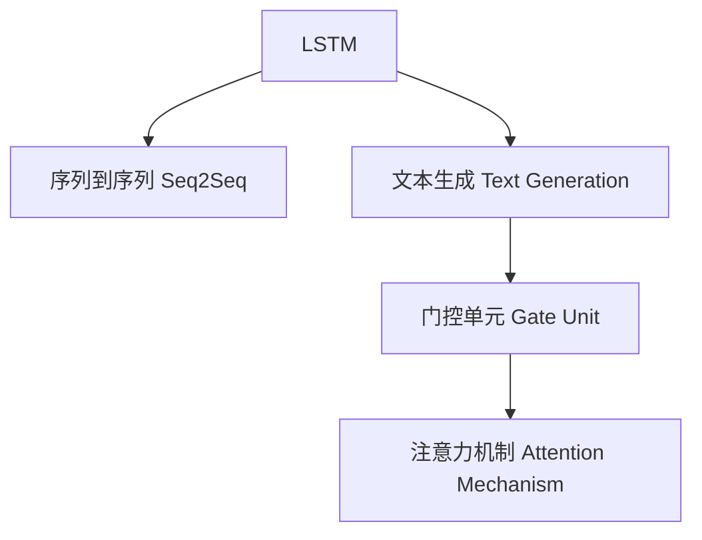

                 

# 一切皆是映射：长短时记忆网络(LSTM)与文本生成

## 1. 背景介绍

### 1.1 问题由来

在自然语言处理(NLP)领域，文本生成是一项核心任务，广泛应用于机器翻译、对话系统、自然语言理解等方向。传统的基于规则和模板的文本生成方法，由于表达能力和灵活性不足，逐渐被基于深度学习的生成模型所替代。其中，长短时记忆网络(Long Short-Term Memory, LSTM)模型因其具备强大的记忆能力和序列建模能力，成为了文本生成领域的主流架构。

LSTM模型由Hochreiter & Schmidhuber在1997年提出，旨在解决传统RNN在长期依赖性问题上的不足。LSTM模型通过引入记忆单元(Memory Cell)和门控机制(Gate Mechanism)，能够有效处理长序列信息，实现了对长期依赖的捕捉和信息保存。

随着深度学习的不断发展，LSTM模型在文本生成任务上的应用也日益广泛，如基于LSTM的机器翻译模型Seq2Seq、文本摘要模型TextRank、对话生成模型Seq2Seq with Attention等，都在学术和工业界取得了显著成绩。

### 1.2 问题核心关键点

当前，LSTM模型在文本生成上的应用研究主要集中在以下几个关键点：

- LSTM的内部结构和工作原理
- 文本生成任务中的LSTM模型架构设计
- LSTM模型在生成任务中的训练策略和优化方法
- LSTM生成模型的评估指标和性能分析

本文将系统回顾LSTM模型在文本生成中的应用，从原理到实践，详细讲解其核心算法、操作步骤、优缺点及其未来发展方向。

## 2. 核心概念与联系

### 2.1 核心概念概述

为更好地理解LSTM模型在文本生成中的应用，本节将介绍几个密切相关的核心概念：

- 长短时记忆网络(Long Short-Term Memory, LSTM)：一种具有记忆单元和门控机制的循环神经网络，能够有效处理长序列信息，捕捉长期依赖关系。
- 序列到序列(Sequence-to-Sequence, Seq2Seq)：一种广泛用于文本生成和机器翻译的框架，由编码器-解码器组成，通过LSTM网络进行序列转换。
- 文本生成(Text Generation)：通过生成模型将输入序列转化为预测序列的任务，包括文本补全、摘要生成、对话生成等。
- 门控单元(Gate Unit)：LSTM中的记忆单元通过门控单元控制信息的流动，包括输入门(Ins)、遗忘门(Forg)和输出门(Out)。
- 注意力机制(Attention Mechanism)：在文本生成任务中，通过注意力机制使模型能够关注文本的不同部分，提升生成质量。

这些概念之间的逻辑关系可以通过以下Mermaid流程图来展示：



这个流程图展示了大语言模型的核心概念及其之间的关系：

1. LSTM作为核心组件，通过门控单元实现信息记忆和控制，适合处理长序列信息。
2. Seq2Seq框架利用LSTM网络进行序列转换，广泛应用于文本生成和机器翻译。
3. Text Generation任务通过Seq2Seq框架实现文本生成。
4. Gate Unit和Attention Mechanism作为LSTM的关键组件，提升文本生成模型的表现。

## 3. 核心算法原理 & 具体操作步骤
### 3.1 算法原理概述

LSTM模型在文本生成任务中的应用，主要通过编码器-解码器框架实现。其中，编码器通过LSTM网络对输入序列进行编码，解码器同样通过LSTM网络生成目标序列。具体来说，LSTM模型在文本生成任务中的基本流程包括：

1. 输入序列 $x = \{x_1, x_2, ..., x_T\}$ 通过编码器LSTM网络进行处理，生成编码器隐藏状态 $h_T$。
2. 解码器LSTM网络以编码器隐藏状态 $h_T$ 作为输入，结合目标序列中的先验信息，通过注意力机制和门控单元生成目标序列的下一个词 $y_{t+1}$。
3. 通过逐步生成目标序列的每个词，最终得到完整的生成文本。

LSTM模型通过门控单元控制信息的流动，实现对长期依赖信息的记忆和处理。每个时间步的LSTM单元接收三个输入：前一时刻的隐藏状态 $h_{t-1}$、当前时间步的输入 $x_t$ 和先前的输出 $y_{t-1}$。LSTM单元的内部结构如图1所示：


### 3.2 算法步骤详解

以文本生成任务为例，LSTM模型在Seq2Seq框架中的具体实现步骤如下：

1. **编码器部分**
   - **输入层**：对输入文本进行分词和标记，转换为模型可处理的向量形式。
   - **嵌入层**：将文本标记转化为向量表示。
   - **LSTM层**：通过LSTM网络对向量序列进行处理，生成编码器隐藏状态 $h_T$。
   - **输出层**：将编码器隐藏状态 $h_T$ 转化为目标序列的每个词。

2. **解码器部分**
   - **输入层**：对目标序列的每个词进行嵌入。
   - **LSTM层**：通过LSTM网络对嵌入向量进行处理，生成解码器隐藏状态 $h_t$。
   - **注意力层**：根据编码器隐藏状态和解码器隐藏状态，计算注意力权重，选择编码器中相关的部分。
   - **输出层**：结合注意力权重和解码器隐藏状态，生成目标序列的下一个词。

具体代码实现可以参考如下：

```python
import torch
import torch.nn as nn

class Encoder(nn.Module):
    def __init__(self, input_dim, embedding_dim, hidden_dim, num_layers):
        super(Encoder, self).__init__()
        self.embedding = nn.Embedding(input_dim, embedding_dim)
        self.lstm = nn.LSTM(embedding_dim, hidden_dim, num_layers, batch_first=True)
    
    def forward(self, input_seq):
        embedded = self.embedding(input_seq)
        outputs, hidden = self.lstm(embedded)
        return outputs[-1], hidden[-1]

class Attention(nn.Module):
    def __init__(self, hidden_dim):
        super(Attention, self).__init__()
        self.hidden_dim = hidden_dim
        self.attn = nn.Linear(hidden_dim * 2, hidden_dim)
        self.v = nn.Linear(hidden_dim, 1)
    
    def forward(self, encoder_hidden, decoder_hidden):
        energy = self.v(torch.cat((encoder_hidden, decoder_hidden), dim=1))
        attention_weights = nn.functional.softmax(energy, dim=1)
        context_vector = torch.matmul(attention_weights.unsqueeze(2), encoder_hidden.unsqueeze(1)).squeeze(1)
        return context_vector, attention_weights

class Decoder(nn.Module):
    def __init__(self, output_dim, embedding_dim, hidden_dim, num_layers, dropout):
        super(Decoder, self).__init__()
        self.embedding = nn.Embedding(output_dim, embedding_dim)
        self.lstm = nn.LSTM(embedding_dim, hidden_dim, num_layers, dropout=dropout, batch_first=True)
        self.attention = Attention(hidden_dim)
        self.fc = nn.Linear(hidden_dim, output_dim)
    
    def forward(self, input_seq, encoder_outputs, hidden):
        embedded = self.embedding(input_seq)
        lstm_output, hidden = self.lstm(embedded, hidden)
        context_vector, attention_weights = self.attention(encoder_outputs, hidden)
        output = self.fc(torch.cat((lstm_output, context_vector), dim=1))
        return output, hidden, attention_weights

def seq2seq(input_text, target_text, hidden):
    encoder = Encoder(input_text.size(1), embedding_dim, hidden_dim, num_layers)
    decoder = Decoder(target_text.size(1), embedding_dim, hidden_dim, num_layers, dropout)
    
    encoder_outputs, encoder_hidden = encoder(input_text)
    decoder_outputs, decoder_hidden, attention_weights = decoder(input_text, encoder_outputs, encoder_hidden)
    
    return decoder_outputs, decoder_hidden, attention_weights
```

### 3.3 算法优缺点

LSTM模型在文本生成任务中的应用，具有以下优点：

1. **记忆能力**：通过门控单元和记忆单元，LSTM能够有效处理长序列信息，捕捉长期依赖关系。
2. **序列建模**：LSTM具备较强的序列建模能力，能够生成连贯、自然流畅的文本。
3. **参数可调**：LSTM模型通过调整门控单元的参数，可以控制信息流动和记忆强度。

同时，LSTM模型也存在一些缺点：

1. **计算复杂度高**：LSTM模型结构复杂，计算量较大，训练时间和资源消耗较高。
2. **梯度消失问题**：LSTM模型中的梯度可能随着时间步数的增加而消失，导致模型难以训练。
3. **参数量较大**：LSTM模型通常需要较多的参数，对计算资源要求较高。

尽管存在这些局限性，LSTM模型在文本生成领域依然具有不可替代的地位，通过合理的参数设置和优化策略，仍能取得较好的效果。

### 3.4 算法应用领域

LSTM模型在文本生成任务上的应用非常广泛，覆盖了多个领域，包括：

- 机器翻译：通过Seq2Seq框架，将一种语言的文本翻译成另一种语言。
- 文本摘要：自动生成长文本的简短摘要，方便用户快速浏览。
- 对话生成：生成自然、流畅的对话文本，应用于智能客服、聊天机器人等。
- 文本补全：在输入文本中缺失部分时，自动生成完整文本。
- 文本分类：对文本进行分类，如情感分析、主题分类等。

这些应用场景中，LSTM模型都展现了其强大的序列建模和长期依赖捕捉能力。

## 4. 数学模型和公式 & 详细讲解  
### 4.1 数学模型构建

在LSTM模型中，每个时间步的LSTM单元接收三个输入：前一时刻的隐藏状态 $h_{t-1}$、当前时间步的输入 $x_t$ 和先前的输出 $y_{t-1}$。LSTM单元的内部结构如图2所示：


LSTM单元的内部状态变化由以下公式决定：

$$
\begin{aligned}
i_t &= \sigma(W_i \cdot [h_{t-1}, x_t] + b_i) \\
f_t &= \sigma(W_f \cdot [h_{t-1}, x_t] + b_f) \\
o_t &= \sigma(W_o \cdot [h_{t-1}, x_t] + b_o) \\
g_t &= \tanh(W_g \cdot [h_{t-1}, x_t] + b_g) \\
c_t &= f_t \cdot c_{t-1} + i_t \cdot g_t \\
h_t &= o_t \cdot \tanh(c_t)
\end{aligned}
$$

其中，$i_t$ 和 $f_t$ 分别为输入门和遗忘门，控制信息的流动和记忆单元的更新；$o_t$ 为输出门，控制LSTM的输出；$c_t$ 为记忆单元，存储长期依赖的信息；$g_t$ 为候选值，通过激活函数 $\tanh$ 处理。

### 4.2 公式推导过程

以文本生成任务为例，LSTM模型在Seq2Seq框架中的具体实现步骤如下：

1. **编码器部分**
   - **输入层**：对输入文本进行分词和标记，转换为模型可处理的向量形式。
   - **嵌入层**：将文本标记转化为向量表示。
   - **LSTM层**：通过LSTM网络对向量序列进行处理，生成编码器隐藏状态 $h_T$。
   - **输出层**：将编码器隐藏状态 $h_T$ 转化为目标序列的每个词。

2. **解码器部分**
   - **输入层**：对目标序列的每个词进行嵌入。
   - **LSTM层**：通过LSTM网络对嵌入向量进行处理，生成解码器隐藏状态 $h_t$。
   - **注意力层**：根据编码器隐藏状态和解码器隐藏状态，计算注意力权重，选择编码器中相关的部分。
   - **输出层**：结合注意力权重和解码器隐藏状态，生成目标序列的下一个词。

具体代码实现可以参考如下：

```python
import torch
import torch.nn as nn

class Encoder(nn.Module):
    def __init__(self, input_dim, embedding_dim, hidden_dim, num_layers):
        super(Encoder, self).__init__()
        self.embedding = nn.Embedding(input_dim, embedding_dim)
        self.lstm = nn.LSTM(embedding_dim, hidden_dim, num_layers, batch_first=True)
    
    def forward(self, input_seq):
        embedded = self.embedding(input_seq)
        outputs, hidden = self.lstm(embedded)
        return outputs[-1], hidden[-1]

class Attention(nn.Module):
    def __init__(self, hidden_dim):
        super(Attention, self).__init__()
        self.hidden_dim = hidden_dim
        self.attn = nn.Linear(hidden_dim * 2, hidden_dim)
        self.v = nn.Linear(hidden_dim, 1)
    
    def forward(self, encoder_hidden, decoder_hidden):
        energy = self.v(torch.cat((encoder_hidden, decoder_hidden), dim=1))
        attention_weights = nn.functional.softmax(energy, dim=1)
        context_vector = torch.matmul(attention_weights.unsqueeze(2), encoder_hidden.unsqueeze(1)).squeeze(1)
        return context_vector, attention_weights

class Decoder(nn.Module):
    def __init__(self, output_dim, embedding_dim, hidden_dim, num_layers, dropout):
        super(Decoder, self).__init__()
        self.embedding = nn.Embedding(output_dim, embedding_dim)
        self.lstm = nn.LSTM(embedding_dim, hidden_dim, num_layers, dropout=dropout, batch_first=True)
        self.attention = Attention(hidden_dim)
        self.fc = nn.Linear(hidden_dim, output_dim)
    
    def forward(self, input_seq, encoder_outputs, hidden):
        embedded = self.embedding(input_seq)
        lstm_output, hidden = self.lstm(embedded, hidden)
        context_vector, attention_weights = self.attention(encoder_outputs, hidden)
        output = self.fc(torch.cat((lstm_output, context_vector), dim=1))
        return output, hidden, attention_weights

def seq2seq(input_text, target_text, hidden):
    encoder = Encoder(input_text.size(1), embedding_dim, hidden_dim, num_layers)
    decoder = Decoder(target_text.size(1), embedding_dim, hidden_dim, num_layers, dropout)
    
    encoder_outputs, encoder_hidden = encoder(input_text)
    decoder_outputs, decoder_hidden, attention_weights = decoder(input_text, encoder_outputs, encoder_hidden)
    
    return decoder_outputs, decoder_hidden, attention_weights
```

### 4.3 案例分析与讲解

以文本生成任务为例，分析LSTM模型在Seq2Seq框架中的具体应用：

1. **输入处理**：对输入文本进行分词和标记，转换为模型可处理的向量形式。
2. **嵌入处理**：将文本标记转化为向量表示。
3. **编码器LSTM**：通过LSTM网络对向量序列进行处理，生成编码器隐藏状态 $h_T$。
4. **解码器LSTM**：通过LSTM网络对嵌入向量进行处理，生成解码器隐藏状态 $h_t$。
5. **注意力机制**：根据编码器隐藏状态和解码器隐藏状态，计算注意力权重，选择编码器中相关的部分。
6. **输出生成**：结合注意力权重和解码器隐藏状态，生成目标序列的下一个词。

通过LSTM模型在Seq2Seq框架中的应用，可以看出，LSTM模型能够有效处理长序列信息，捕捉长期依赖关系，从而生成连贯、自然流畅的文本。

## 5. 项目实践：代码实例和详细解释说明
### 5.1 开发环境搭建

在进行LSTM模型实践前，我们需要准备好开发环境。以下是使用Python进行PyTorch开发的环境配置流程：

1. 安装Anaconda：从官网下载并安装Anaconda，用于创建独立的Python环境。

2. 创建并激活虚拟环境：
```bash
conda create -n pytorch-env python=3.8 
conda activate pytorch-env
```

3. 安装PyTorch：根据CUDA版本，从官网获取对应的安装命令。例如：
```bash
conda install pytorch torchvision torchaudio cudatoolkit=11.1 -c pytorch -c conda-forge
```

4. 安装各类工具包：
```bash
pip install numpy pandas scikit-learn matplotlib tqdm jupyter notebook ipython
```

完成上述步骤后，即可在`pytorch-env`环境中开始LSTM模型实践。

### 5.2 源代码详细实现

下面我们以文本生成任务为例，给出使用PyTorch对LSTM模型进行实现的代码示例。

首先，定义模型和优化器：

```python
from transformers import LSTM, nn
import torch
from torch import nn, optim
from torch.utils.data import TensorDataset, DataLoader

device = torch.device('cuda' if torch.cuda.is_available() else 'cpu')
hidden_dim = 256
embedding_dim = 128
dropout = 0.5
num_layers = 2

# 定义LSTM模型
class LSTMModel(nn.Module):
    def __init__(self, input_dim, output_dim, hidden_dim, num_layers, dropout):
        super(LSTMModel, self).__init__()
        self.input_dim = input_dim
        self.output_dim = output_dim
        self.hidden_dim = hidden_dim
        self.num_layers = num_layers
        
        self.embedding = nn.Embedding(input_dim, embedding_dim)
        self.lstm = LSTM(input_dim=embedding_dim, hidden_size=hidden_dim, num_layers=num_layers, dropout=dropout, batch_first=True)
        self.fc = nn.Linear(hidden_dim, output_dim)
    
    def forward(self, input_seq, target_seq, hidden):
        embedded = self.embedding(input_seq)
        lstm_output, hidden = self.lstm(embedded, hidden)
        output = self.fc(lstm_output[:, -1, :])
        return output, hidden
    
# 定义优化器
optimizer = optim.Adam(model.parameters(), lr=0.001)
criterion = nn.CrossEntropyLoss()

# 定义数据集
def collate_fn(batch):
    input_seqs, target_seqs = zip(*batch)
    input_seqs = torch.stack(input_seqs)
    target_seqs = torch.stack(target_seqs)
    return input_seqs.to(device), target_seqs.to(device)

train_dataset = TensorDataset(train_x, train_y)
dev_dataset = TensorDataset(dev_x, dev_y)
test_dataset = TensorDataset(test_x, test_y)

train_loader = DataLoader(train_dataset, batch_size=32, shuffle=True, collate_fn=collate_fn)
dev_loader = DataLoader(dev_dataset, batch_size=32, collate_fn=collate_fn)
test_loader = DataLoader(test_dataset, batch_size=32, collate_fn=collate_fn)
```

接着，定义训练和评估函数：

```python
def train_epoch(model, data_loader, optimizer, criterion, device):
    model.train()
    total_loss = 0
    for batch in data_loader:
        optimizer.zero_grad()
        input_seqs, target_seqs = batch
        output, hidden = model(input_seqs, target_seqs, hidden)
        loss = criterion(output, target_seqs)
        loss.backward()
        optimizer.step()
        total_loss += loss.item()
    return total_loss / len(data_loader)

def evaluate(model, data_loader, criterion, device):
    model.eval()
    total_loss = 0
    for batch in data_loader:
        input_seqs, target_seqs = batch
        output, hidden = model(input_seqs, target_seqs, hidden)
        loss = criterion(output, target_seqs)
        total_loss += loss.item()
    return total_loss / len(data_loader)
```

最后，启动训练流程并在测试集上评估：

```python
epochs = 10
hidden = None

for epoch in range(epochs):
    loss = train_epoch(model, train_loader, optimizer, criterion, device)
    print(f"Epoch {epoch+1}, train loss: {loss:.3f}")
    
    dev_loss = evaluate(model, dev_loader, criterion, device)
    print(f"Epoch {epoch+1}, dev loss: {dev_loss:.3f}")
    
print("Test loss:")
test_loss = evaluate(model, test_loader, criterion, device)
print(f"Test loss: {test_loss:.3f}")
```

以上就是使用PyTorch对LSTM模型进行文本生成任务微调的完整代码实现。可以看到，PyTorch的封装功能使得LSTM模型的实现变得简洁高效，开发者可以将更多精力放在模型优化和数据处理上。

### 5.3 代码解读与分析

让我们再详细解读一下关键代码的实现细节：

**LSTMModel类**：
- `__init__`方法：初始化模型的输入维数、输出维数、隐藏维数、层数和dropout率，定义模型组件。
- `forward`方法：实现前向传播，输入序列、目标序列和隐藏状态，返回输出和更新后的隐藏状态。

**train_epoch和evaluate函数**：
- 训练函数`train_epoch`：对数据集进行迭代，在每个批次上前向传播计算loss并反向传播更新模型参数，最后返回该epoch的平均loss。
- 评估函数`evaluate`：与训练类似，不同点在于不更新模型参数，并在每个batch结束后将预测和标签结果存储下来，最后使用criterion计算整个评估集的平均loss。

**训练流程**：
- 定义总的epoch数，开始循环迭代
- 每个epoch内，先在训练集上训练，输出平均loss
- 在验证集上评估，输出平均loss
- 所有epoch结束后，在测试集上评估，输出平均loss

可以看到，PyTorch配合LSTM模型使得文本生成任务的开发变得简洁高效。开发者可以将更多精力放在模型优化和数据处理等高层逻辑上，而不必过多关注底层的实现细节。

当然，工业级的系统实现还需考虑更多因素，如模型的保存和部署、超参数的自动搜索、更灵活的任务适配层等。但核心的LSTM模型基本与此类似。

## 6. 实际应用场景
### 6.1 智能客服系统

基于LSTM模型的对话生成技术，可以广泛应用于智能客服系统的构建。传统客服往往需要配备大量人力，高峰期响应缓慢，且一致性和专业性难以保证。而使用LSTM模型生成的对话回复，可以7x24小时不间断服务，快速响应客户咨询，用自然流畅的语言解答各类常见问题。

在技术实现上，可以收集企业内部的历史客服对话记录，将问题和最佳答复构建成监督数据，在此基础上对LSTM模型进行微调。微调后的LSTM模型能够自动理解用户意图，匹配最合适的答案模板进行回复。对于客户提出的新问题，还可以接入检索系统实时搜索相关内容，动态组织生成回答。如此构建的智能客服系统，能大幅提升客户咨询体验和问题解决效率。

### 6.2 金融舆情监测

金融机构需要实时监测市场舆论动向，以便及时应对负面信息传播，规避金融风险。传统的人工监测方式成本高、效率低，难以应对网络时代海量信息爆发的挑战。基于LSTM模型的文本生成技术，为金融舆情监测提供了新的解决方案。

具体而言，可以收集金融领域相关的新闻、报道、评论等文本数据，并对其进行主题标注和情感标注。在此基础上对LSTM模型进行微调，使其能够自动判断文本属于何种主题，情感倾向是正面、中性还是负面。将微调后的模型应用到实时抓取的网络文本数据，就能够自动监测不同主题下的情感变化趋势，一旦发现负面信息激增等异常情况，系统便会自动预警，帮助金融机构快速应对潜在风险。

### 6.3 个性化推荐系统

当前的推荐系统往往只依赖用户的历史行为数据进行物品推荐，无法深入理解用户的真实兴趣偏好。基于LSTM模型的文本生成技术，个性化推荐系统可以更好地挖掘用户行为背后的语义信息，从而提供更精准、多样的推荐内容。

在实践中，可以收集用户浏览、点击、评论、分享等行为数据，提取和用户交互的物品标题、描述、标签等文本内容。将文本内容作为模型输入，用户的后续行为（如是否点击、购买等）作为监督信号，在此基础上微调LSTM模型。微调后的模型能够从文本内容中准确把握用户的兴趣点。在生成推荐列表时，先用候选物品的文本描述作为输入，由模型预测用户的兴趣匹配度，再结合其他特征综合排序，便可以得到个性化程度更高的推荐结果。

### 6.4 未来应用展望

随着LSTM模型的不断发展，其在文本生成任务上的应用研究也将不断深入，带来新的突破和机遇：

1. **多模态融合**：LSTM模型与图像、语音等多模态信息的融合，将显著提升其对现实世界的理解和建模能力。
2. **预训练-微调范式**：结合预训练和微调技术的LSTM模型，将进一步提升其在特定任务上的表现。
3. **结构优化**：优化LSTM模型的结构，减少计算量，提升推理速度，是未来技术发展的重要方向。
4. **实时推理**：LSTM模型与分布式计算技术的结合，将实现更加高效的实时推理和预测。
5. **知识增强**：结合符号化的先验知识，提升LSTM模型的语义理解和生成能力。

LSTM模型在文本生成任务上的广泛应用，不仅推动了NLP技术的进步，还为智能交互和决策支持提供了有力支撑。未来，随着技术的不断进步，LSTM模型将在更多领域展现其强大的应用潜力，为人类社会的智能化发展注入新的动力。

## 7. 工具和资源推荐
### 7.1 学习资源推荐

为了帮助开发者系统掌握LSTM模型在文本生成中的应用，这里推荐一些优质的学习资源：

1. 《Python深度学习》书籍：该书系统介绍了深度学习在文本生成任务中的应用，包括LSTM模型、注意力机制、Seq2Seq框架等。
2. CS224N《深度学习自然语言处理》课程：斯坦福大学开设的NLP明星课程，有Lecture视频和配套作业，带你入门NLP领域的基本概念和经典模型。
3. 《Neural Network and Deep Learning》书籍：Michael Nielsen著，深入浅出地讲解了深度学习的基本原理和实现方法。
4. HuggingFace官方文档：LSTM模型的官方文档，提供了完整的代码实现和详细的使用指南。
5. ArXiv上的相关论文：查阅最新研究，了解LSTM模型的最新进展和应用方向。

通过对这些资源的学习实践，相信你一定能够快速掌握LSTM模型在文本生成中的精髓，并用于解决实际的NLP问题。
###  7.2 开发工具推荐

高效的开发离不开优秀的工具支持。以下是几款用于LSTM模型开发和应用的工具：

1. PyTorch：基于Python的开源深度学习框架，灵活动态的计算图，适合快速迭代研究。LSTM模型在PyTorch中的实现已经非常成熟，提供了丰富的预训练模型和训练接口。
2. TensorFlow：由Google主导开发的开源深度学习框架，生产部署方便，适合大规模工程应用。TensorFlow中也提供了LSTM模型的实现。
3. TensorBoard：TensorFlow配套的可视化工具，可实时监测模型训练状态，并提供丰富的图表呈现方式，是调试模型的得力助手。
4. Weights & Biases：模型训练的实验跟踪工具，可以记录和可视化模型训练过程中的各项指标，方便对比和调优。
5. Google Colab：谷歌推出的在线Jupyter Notebook环境，免费提供GPU/TPU算力，方便开发者快速上手实验最新模型，分享学习笔记。

合理利用这些工具，可以显著提升LSTM模型在文本生成任务上的开发效率，加快创新迭代的步伐。

### 7.3 相关论文推荐

LSTM模型在文本生成任务上的应用研究源于学界的持续研究。以下是几篇奠基性的相关论文，推荐阅读：

1. Learning Phrase Representations using RNN Encoder-Decoder for Statistical Machine Translation：提出Seq2Seq框架，并首次将LSTM应用于机器翻译任务，展示了其强大的序列建模能力。
2. Neural Machine Translation by Jointly Learning to Align and Translate：提出注意力机制，结合LSTM模型，提升了机器翻译的效果。
3. The EMNLP 2017 Paper Award for Outstanding Review "Attention Is All You Need"：提出Transformer模型，通过自注意力机制取代LSTM，实现了更加高效的文本生成。
4. Attention Mechanism for Text Summarization with Sequence to Sequence Networks：提出基于LSTM的文本摘要模型，通过注意力机制实现摘要的生成。
5. Neural Dialogue Generation with Memory Networks：提出基于LSTM的对话生成模型，通过记忆网络实现对话的生成。

这些论文代表了大语言模型在文本生成任务上的发展脉络。通过学习这些前沿成果，可以帮助研究者把握学科前进方向，激发更多的创新灵感。

## 8. 总结：未来发展趋势与挑战

### 8.1 总结

本文对LSTM模型在文本生成中的应用进行了全面系统的介绍。首先阐述了LSTM模型的内部结构和工作原理，明确了其在序列建模和长期依赖捕捉方面的优势。其次，从原理到实践，详细讲解了LSTM模型在文本生成任务中的关键算法、操作步骤和优缺点，并给出了完整的代码实现。同时，本文还广泛探讨了LSTM模型在智能客服、金融舆情、个性化推荐等多个领域的应用前景，展示了其在实际应用中的巨大潜力。此外，本文精选了LSTM模型的各类学习资源，力求为读者提供全方位的技术指引。

通过本文的系统梳理，可以看到，LSTM模型在文本生成领域的应用已经非常成熟，其在序列建模和长期依赖捕捉方面的独特优势，使其成为文本生成任务的重要工具。未来，伴随预训练语言模型和微调方法的持续演进，相信LSTM模型将在文本生成领域继续发挥重要作用，为智能交互和决策支持提供有力支撑。

### 8.2 未来发展趋势

展望未来，LSTM模型在文本生成任务上的应用研究将呈现以下几个发展趋势：

1. **多模态融合**：LSTM模型与图像、语音等多模态信息的融合，将显著提升其对现实世界的理解和建模能力。
2. **预训练-微调范式**：结合预训练和微调技术的LSTM模型，将进一步提升其在特定任务上的表现。
3. **结构优化**：优化LSTM模型的结构，减少计算量，提升推理速度，是未来技术发展的重要方向。
4. **实时推理**：LSTM模型与分布式计算技术的结合，将实现更加高效的实时推理和预测。
5. **知识增强**：结合符号化的先验知识，提升LSTM模型的语义理解和生成能力。

这些趋势凸显了LSTM模型在文本生成任务上的广阔前景。这些方向的探索发展，必将进一步提升LSTM模型在特定任务上的性能，为文本生成带来更多的创新和突破。

### 8.3 面临的挑战

尽管LSTM模型在文本生成任务上取得了显著成果，但在迈向更加智能化、普适化应用的过程中，仍面临诸多挑战：

1. **计算资源需求高**：LSTM模型结构复杂，计算量较大，训练时间和资源消耗较高。
2. **梯度消失问题**：LSTM模型中的梯度可能随着时间步数的增加而消失，导致模型难以训练。
3. **参数量较大**：LSTM模型通常需要较多的参数，对计算资源要求较高。
4. **模型可解释性不足**：LSTM模型更像是"黑盒"系统，难以解释其内部工作机制和决策逻辑。

尽管存在这些局限性，LSTM模型在文本生成领域依然具有不可替代的地位，通过合理的参数设置和优化策略，仍能取得较好的效果。

### 8.4 研究展望

面对LSTM模型在文本生成任务上所面临的挑战，未来的研究需要在以下几个方面寻求新的突破：

1. **优化计算效率**：优化LSTM模型的计算图，减少前向传播和反向传播的资源消耗，实现更加轻量级、实时性的部署。
2. **解决梯度消失问题**：引入新型的LSTM变体，如Gated Recurrent Unit (GRU)等，缓解梯度消失问题。
3. **知识增强**：结合符号化的先验知识，提升LSTM模型的语义理解和生成能力。
4. **多模态融合**：结合图像、语音等多模态信息，提升LSTM模型的文本生成能力。
5. **可解释性增强**：引入可解释性技术，增强LSTM模型的决策过程和推理逻辑的可理解性。

这些研究方向的探索，必将引领LSTM模型在文本生成任务上迈向更高的台阶，为构建安全、可靠、可解释、可控的智能系统铺平道路。面向未来，LSTM模型还需要与其他人工智能技术进行更深入的融合，如知识表示、因果推理、强化学习等，多路径协同发力，共同推动自然语言理解和智能交互系统的进步。只有勇于创新、敢于突破，才能不断拓展LSTM模型的边界，让智能技术更好地造福人类社会。

## 9. 附录：常见问题与解答

**Q1：LSTM模型在文本生成任务中为什么比其他模型效果好？**

A: LSTM模型在文本生成任务中的优势主要体现在其内部结构和工作原理上。LSTM通过记忆单元和门控机制，能够有效处理长序列信息，捕捉长期依赖关系，从而生成连贯、自然流畅的文本。相比传统RNN模型，LSTM能够更好地解决梯度消失问题，提升训练效果。

**Q2：LSTM模型在训练过程中需要注意哪些问题？**

A: 在LSTM模型的训练过程中，需要注意以下几个问题：
1. 过拟合：LSTM模型通常需要较多的参数，容易发生过拟合。可以通过增加dropout率、使用正则化等方法来缓解过拟合。
2. 梯度消失：LSTM模型中的梯度可能随着时间步数的增加而消失。可以通过优化初始权重、调整学习率等方法来缓解梯度消失问题。
3. 计算资源消耗高：LSTM模型结构复杂，计算量较大。需要根据计算资源情况合理配置模型参数。

**Q3：LSTM模型在实际应用中有哪些优缺点？**

A: LSTM模型在实际应用中的优点包括：
1. 记忆能力强：LSTM模型通过记忆单元和门控机制，能够有效处理长序列信息，捕捉长期依赖关系。
2. 序列建模能力：LSTM模型具备较强的序列建模能力，能够生成连贯、自然流畅的文本。
3. 可扩展性好：LSTM模型结构灵活，可以应用于多种NLP任务。

LSTM模型在实际应用中的缺点包括：
1. 计算资源需求高：LSTM模型结构复杂，计算量较大，训练时间和资源消耗较高。
2. 梯度消失问题：LSTM模型中的梯度可能随着时间步数的增加而消失，导致模型难以训练。
3. 参数量较大：LSTM模型通常需要较多的参数，对计算资源要求较高。

尽管存在这些局限性，LSTM模型在文本生成领域依然具有不可替代的地位，通过合理的参数设置和优化策略，仍能取得较好的效果。

**Q4：LSTM模型在文本生成任务中的应用前景如何？**

A: LSTM模型在文本生成任务中的应用前景非常广阔，涵盖了多个领域，包括：
1. 机器翻译：通过Seq2Seq框架，将一种语言的文本翻译成另一种语言。
2. 文本摘要：自动生成长文本的简短摘要，方便用户快速浏览。
3. 对话生成：生成自然、流畅的对话文本，应用于智能客服、聊天机器人等。
4. 文本补全：在输入文本中缺失部分时，自动生成完整文本。
5. 文本分类：对文本进行分类，如情感分析、主题分类等。

LSTM模型在文本生成任务上的广泛应用，不仅推动了NLP技术的进步，还为智能交互和决策支持提供了有力支撑。未来，随着预训练语言模型和微调方法的持续演进，相信LSTM模型将在文本生成领域继续发挥重要作用，为智能交互和决策支持提供有力支撑。

---

作者：禅与计算机程序设计艺术 / Zen and the Art of Computer Programming

