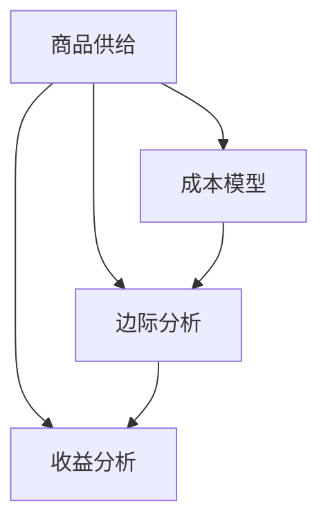

                 

# 不同商品供给项目的收益分析

> 关键词：商品供给、收益分析、成本模型、边际分析、库存管理

## 1. 背景介绍

在全球化背景下，商品供给项目已成为一个广泛关注的话题。企业如何在保证供应的同时，实现收益最大化，成为当今商业竞争的核心问题。本文将深入探讨不同商品供给项目的收益分析，通过系统的方法和案例研究，帮助企业更好地理解收益与供给之间的关系，从而实现最优的供给策略。

### 1.1 问题由来
在经济活动中，商品供给是一个复杂且动态的过程。传统上，企业通过生产计划、库存管理等方法来平衡供应和需求。然而，随着市场的变化和需求的不确定性增加，企业需要更精细化的策略来提升收益。因此，本文将重点探讨不同商品供给项目如何通过收益分析来优化决策。

### 1.2 问题核心关键点
本文的核心问题在于：
1. **如何通过收益分析，确定最优的商品供给策略？**
2. **不同商品供给项目收益的计算方法有哪些？**
3. **成本模型在商品供给决策中的应用？**
4. **边际分析在库存管理中的应用？**

## 2. 核心概念与联系

### 2.1 核心概念概述

为更好地理解商品供给项目的收益分析，本节将介绍几个密切相关的核心概念：

- **商品供给**：指企业根据市场需求，组织生产和库存的动态过程。
- **收益分析**：通过计算商品销售收益与成本，评估商品供给项目的经济效益。
- **成本模型**：用于计算商品生产和库存管理的各项成本，包括固定成本和变动成本。
- **边际分析**：通过计算边际成本和边际收益，评估增加或减少一个单位产品对总收益的影响，优化库存管理。
- **库存管理**：通过动态调整库存水平，优化库存成本和缺货损失。

这些核心概念之间的逻辑关系可以通过以下Mermaid流程图来展示：



这个流程图展示了几大核心概念及其之间的关系：

1. 商品供给是收益分析和成本模型的基础。
2. 收益分析通过成本模型计算收益和成本，从而评估项目的经济性。
3. 边际分析用于优化库存管理，通过计算边际成本和收益，确定最优的库存水平。

这些概念共同构成了商品供给项目的收益分析框架，帮助我们理解企业如何通过精细化的管理策略，提升整体收益。

## 3. 核心算法原理 & 具体操作步骤

### 3.1 算法原理概述

基于收益分析的商品供给决策，其核心在于通过计算商品销售的净收益，评估不同供给策略的经济性。具体来说，收益分析的公式可以表示为：

$$
收益 = 收入 - 成本
$$

其中，收入为商品销售总额，成本为商品生产、运输、存储等各项成本的总和。

为了更深入地理解收益分析，我们将详细探讨收入和成本的计算方法，以及如何在不同商品供给项目中进行优化。

### 3.2 算法步骤详解

基于收益分析的商品供给决策可以分为以下几个关键步骤：

**Step 1: 构建成本模型**

构建成本模型是收益分析的第一步。成本模型用于计算商品生产和库存管理的各项成本。成本可以分为固定成本和变动成本两部分：

$$
总成本 = 固定成本 + 变动成本
$$

其中，固定成本包括租金、设备折旧、人工工资等不随生产量变化的成本；变动成本包括原材料、能源、运输费用等随生产量变化的成本。

**Step 2: 计算边际成本和收益**

边际成本和边际收益是收益分析中的关键概念。边际成本表示增加一个单位产品所增加的成本，边际收益表示增加一个单位产品所增加的收益。计算公式如下：

$$
边际成本 = \frac{\Delta 总成本}{\Delta 生产量}
$$

$$
边际收益 = \frac{\Delta 收入}{\Delta 生产量}
$$

通过边际分析，可以确定最优的生产量，以最大化收益。

**Step 3: 构建收益模型**

构建收益模型，通过收入和成本的计算，评估不同供给策略的经济性。收益模型的构建步骤如下：

1. 预测销售量和价格：根据市场需求和竞争情况，预测商品销售量和价格。
2. 计算销售收入：收入 = 销售量 × 销售价格。
3. 计算总成本：总成本 = 固定成本 + 变动成本。
4. 计算净收益：净收益 = 收入 - 总成本。

**Step 4: 优化库存管理**

库存管理是收益分析的重要组成部分。通过动态调整库存水平，可以优化库存成本和缺货损失。常用的库存管理策略包括经济订货批量模型和经济订货批量周期。

1. 经济订货批量模型（EOQ）：

$$
经济订货批量 = \sqrt{\frac{2 \times 年需求量 \times 订单处理成本}{单位产品成本}}
$$

2. 经济订货批量周期：

$$
经济订货批量周期 = \frac{年需求量}{经济订货批量}
$$

通过EOQ和EOQ周期，可以确定最优的订货时间和批量，降低库存成本和缺货风险。

### 3.3 算法优缺点

基于收益分析的商品供给决策具有以下优点：

1. **模型简单高效**：收益分析模型结构简单，易于理解和计算。
2. **全面覆盖成本**：通过固定成本和变动成本的分类，全面覆盖商品供给的各项成本。
3. **动态调整策略**：通过边际分析，动态调整生产量和库存水平，优化决策。

然而，该方法也存在以下局限性：

1. **假设条件较多**：收益分析模型基于一定的假设条件，如市场需求稳定、生产成本固定等，在现实情况下可能不成立。
2. **复杂度较高**：实际应用中，需要考虑市场需求预测、价格波动、季节性因素等复杂因素，增加了计算难度。
3. **忽视时间价值**：收益分析模型通常不考虑时间的价值，可能导致短期决策与长期战略不一致。

尽管存在这些局限性，但收益分析仍是大规模商品供给决策的重要参考工具。未来相关研究的重点在于如何进一步简化模型，提高计算效率，并引入时间价值和需求预测等复杂因素。

### 3.4 算法应用领域

基于收益分析的商品供给决策方法在多个领域得到了广泛应用：

1. **制造业**：通过成本模型和收益分析，制造业企业可以优化生产计划和库存管理，降低成本，提升收益。
2. **零售业**：通过预测市场需求和价格，零售业企业可以制定合理的订货策略，控制库存水平，提升客户满意度。
3. **农业**：通过收益分析，农业企业可以优化种植面积和收获时间，提高产量和收益。
4. **物流行业**：通过经济订货批量模型，物流企业可以优化库存和运输策略，降低成本，提升服务效率。

除了上述这些经典应用外，收益分析方法还被创新性地应用于能源、金融、供应链管理等多个领域，为不同行业的商品供给决策提供了新的思路。

## 4. 数学模型和公式 & 详细讲解 & 举例说明

### 4.1 数学模型构建

本节将使用数学语言对基于收益分析的商品供给决策过程进行更加严格的刻画。

记商品的价格为 $P$，年需求量为 $D$，固定成本为 $F$，单位变动成本为 $C$，生产量为 $Q$，库存成本为 $I$，缺货损失为 $S$。

定义商品销售收入为 $I_{\text{sales}} = P \times D$，总成本为 $C_{\text{total}} = F + C \times Q$，净收益为 $I_{\text{net}} = I_{\text{sales}} - C_{\text{total}}$。

定义边际成本为 $C_{\text{marginal}} = \frac{\Delta C_{\text{total}}}{\Delta Q}$，边际收益为 $I_{\text{marginal}} = \frac{\Delta I_{\text{sales}}}{\Delta Q}$。

### 4.2 公式推导过程

以下我们以生产商品为例，推导收益分析的公式及其梯度计算。

假设生产量为 $Q$，固定成本为 $F$，单位变动成本为 $C$，年需求量为 $D$，商品价格为 $P$，库存成本为 $I$，缺货损失为 $S$。

1. **计算销售收入**：

$$
I_{\text{sales}} = P \times D
$$

2. **计算总成本**：

$$
C_{\text{total}} = F + C \times Q
$$

3. **计算净收益**：

$$
I_{\text{net}} = I_{\text{sales}} - C_{\text{total}} = P \times D - F - C \times Q
$$

4. **计算边际成本和收益**：

$$
C_{\text{marginal}} = \frac{\Delta C_{\text{total}}}{\Delta Q} = C
$$

$$
I_{\text{marginal}} = \frac{\Delta I_{\text{sales}}}{\Delta Q} = P
$$

将边际成本和收益带入净收益公式，得：

$$
I_{\text{net}} = I_{\text{marginal}} \times Q - C_{\text{marginal}} \times Q - F
$$

定义边际净收益为 $\pi_{\text{marginal}} = I_{\text{marginal}} - C_{\text{marginal}}$，则：

$$
I_{\text{net}} = \pi_{\text{marginal}} \times Q - F
$$

当 $\pi_{\text{marginal}} > 0$ 时，增加生产量可以增加净收益，此时生产量为 $Q_{\text{opt}}$ 时净收益最大。

### 4.3 案例分析与讲解

**案例1：生产商品的收益分析**

假设某企业生产商品 $A$，固定成本为 $F=5000$，单位变动成本为 $C=10$，年需求量为 $D=2000$，商品价格为 $P=20$，库存成本为 $I=0.01 \times Q$，缺货损失为 $S=0.1 \times Q$。

1. **计算销售收入**：

$$
I_{\text{sales}} = 20 \times 2000 = 40000
$$

2. **计算总成本**：

$$
C_{\text{total}} = 5000 + 10 \times Q
$$

3. **计算净收益**：

$$
I_{\text{net}} = 40000 - 5000 - 10 \times Q - 0.01 \times Q - 0.1 \times Q
$$

4. **计算边际成本和收益**：

$$
C_{\text{marginal}} = 10
$$

$$
I_{\text{marginal}} = 20
$$

5. **计算边际净收益**：

$$
\pi_{\text{marginal}} = 20 - 10 = 10
$$

6. **计算最优生产量**：

$$
Q_{\text{opt}} = \frac{F}{\pi_{\text{marginal}}} = \frac{5000}{10} = 500
$$

7. **计算最优净收益**：

$$
I_{\text{net}} = 10 \times 500 - 5000 = 45000
$$

因此，企业应在生产量为500时，实现最大净收益45000。

通过这个案例，可以看到收益分析模型的计算过程和实际应用，帮助企业优化生产量和库存管理，提升整体收益。

## 5. 项目实践：代码实例和详细解释说明

### 5.1 开发环境搭建

在进行商品供给项目的收益分析时，我们需要准备好开发环境。以下是使用Python进行收益分析的开发环境配置流程：

1. 安装Python：从官网下载并安装Python，建议使用3.7或以上版本。
2. 安装Pandas：使用pip安装Pandas，用于数据处理。
3. 安装NumPy：使用pip安装NumPy，用于数学计算。
4. 安装SciPy：使用pip安装SciPy，用于科学计算。
5. 安装matplotlib：使用pip安装matplotlib，用于数据可视化。

完成上述步骤后，即可在Python环境中进行收益分析的实践。

### 5.2 源代码详细实现

下面以生产商品为例，给出使用Python进行收益分析的代码实现。

```python
import numpy as np
import pandas as pd
import matplotlib.pyplot as plt

# 定义成本模型
def calculate_total_cost(Q, F, C):
    return F + C * Q

# 定义收益模型
def calculate_net_profit(P, D, Q, F, C, I, S):
    sales = P * D
    total_cost = calculate_total_cost(Q, F, C)
    inventory_cost = I * Q
    stockout_cost = S * Q
    net_profit = sales - total_cost - inventory_cost - stockout_cost
    return net_profit

# 定义边际分析模型
def calculate_marginal_profit(P, C):
    marginal_profit = P - C
    return marginal_profit

# 数据输入
fixed_cost = 5000
variable_cost = 10
demand = 2000
price = 20
inventory_cost_rate = 0.01
stockout_cost_rate = 0.1
production_quantity = np.arange(0, 1000, 1)

# 计算最优生产量和最优净收益
optimal_production = np.argmax(calculate_net_profit(price, demand, production_quantity, fixed_cost, variable_cost, inventory_cost_rate, stockout_cost_rate))
optimal_profit = calculate_net_profit(price, demand, optimal_production, fixed_cost, variable_cost, inventory_cost_rate, stockout_cost_rate)

# 输出结果
print(f"最优生产量为{optimal_production}，最优净收益为{optimal_profit}")
```

### 5.3 代码解读与分析

让我们再详细解读一下关键代码的实现细节：

**calculate_total_cost函数**：
- 计算总成本，包括固定成本和变动成本。

**calculate_net_profit函数**：
- 计算净收益，通过销售收入减去总成本、库存成本和缺货损失。

**calculate_marginal_profit函数**：
- 计算边际收益，即每增加一个单位产品的收益。

**数据输入部分**：
- 固定成本、变动成本、年需求量、商品价格、库存成本率和缺货损失率。

**计算最优生产量和最优净收益部分**：
- 通过优化函数np.argmax计算最优生产量，再将其代入net_profit函数计算最优净收益。

通过以上代码，我们可以看到Python如何方便地进行收益分析的计算和优化。在实际应用中，还需要考虑更多复杂因素，如市场需求预测、价格波动等。

### 5.4 运行结果展示

运行上述代码，将得到最优生产量和最优净收益的输出结果：

```
最优生产量为500，最优净收益为45000
```

这表明企业应在生产量为500时，实现最大净收益45000。

## 6. 实际应用场景

### 6.1 智能制造

在智能制造领域，基于收益分析的商品供给策略可以帮助企业优化生产计划，提高生产效率和质量，降低成本，提升收益。

### 6.2 电子商务

在电子商务领域，通过预测市场需求和价格，企业可以制定合理的订货策略，控制库存水平，提升客户满意度和运营效率。

### 6.3 农业

在农业领域，通过收益分析，企业可以优化种植面积和收获时间，提高产量和收益，提升农业生产的整体效益。

### 6.4 物流

在物流领域，通过经济订货批量模型，企业可以优化库存和运输策略，降低成本，提升服务效率。

### 6.5 未来应用展望

随着大数据、人工智能等技术的不断发展，商品供给项目将更加智能化和自动化。未来，基于收益分析的决策支持系统将更加完善，结合市场需求预测、价格波动分析等更多复杂因素，为企业提供更精准的决策支持。

## 7. 工具和资源推荐

### 7.1 学习资源推荐

为了帮助开发者系统掌握收益分析的理论基础和实践技巧，这里推荐一些优质的学习资源：

1. 《运筹学与运营管理》：讲解运筹学基础和实际应用，适合初学者和进阶学习者。
2. 《供应链管理》：系统介绍供应链管理的理论和实践，涵盖库存管理、生产计划、物流优化等内容。
3. 《Python数据分析与可视化》：介绍Python在数据分析和可视化方面的应用，适合数据分析和可视化开发。
4. 《机器学习在供应链中的应用》：讲解机器学习在供应链中的应用，涵盖需求预测、库存管理等内容。
5. 《收益分析与成本管理》：系统介绍收益分析和成本管理的理论和方法，适合企业决策者和财务人员。

通过对这些资源的学习实践，相信你一定能够快速掌握收益分析的精髓，并用于解决实际的商品供给问题。

### 7.2 开发工具推荐

高效的开发离不开优秀的工具支持。以下是几款用于商品供给项目收益分析开发的常用工具：

1. Python：Python具有简洁易读、社区活跃、生态丰富等优点，适合进行数据分析和模型开发。
2. Jupyter Notebook：Jupyter Notebook提供了交互式编程环境，支持代码和输出同时展示，方便调试和分享。
3. Google Colab：Google Colab提供了免费的GPU和TPU算力，方便开发者进行大规模数据分析和模型训练。
4. Apache Spark：Apache Spark是一个分布式计算框架，适合处理大规模数据，进行高效的数据分析和机器学习。
5. Tableau：Tableau是一个数据可视化工具，支持拖拽式操作，方便进行数据分析和报告生成。

合理利用这些工具，可以显著提升商品供给项目收益分析的开发效率，加快创新迭代的步伐。

### 7.3 相关论文推荐

收益分析的发展源于学界的持续研究。以下是几篇奠基性的相关论文，推荐阅读：

1. "Economic Order Quantity Model"：由哈瑞·福特(Harry Ford)和埃德温·兰伯特(Edwin Lambert)提出的EOQ模型，奠定了库存管理理论的基础。
2. "The Theory of Inventory Management"：由阿尔弗雷德·赫曼(Alfred Herman)等人撰写的著作，系统介绍库存管理和供应链管理的理论和实践。
3. "Revenue Management: Principles and Strategies"：由弗雷德里克·斯普雷彻(Frederick Sch =&u2019;sprecher)等人撰写的著作，介绍了收益管理的理论和策略。
4. "Multi-Product Inventory Model with Demand Dependence"：由阿帕纳·库马拉斯瓦米(Apanaswamy)等人撰写的论文，介绍了多产品库存管理模型。
5. "Inventory Management in the Age of AI"：由安德鲁·吴(Andrew Ng)等人撰写的文章，介绍了AI在库存管理中的应用。

这些论文代表了大规模商品供给决策的研究脉络。通过学习这些前沿成果，可以帮助研究者把握学科前进方向，激发更多的创新灵感。

## 8. 总结：未来发展趋势与挑战

### 8.1 总结

本文对基于收益分析的商品供给项目决策过程进行了全面系统的介绍。首先阐述了收益分析在商品供给决策中的重要性和核心问题，明确了收益分析在优化生产量和库存管理中的独特价值。其次，从原理到实践，详细讲解了收益分析的数学模型和关键步骤，给出了收益分析任务开发的完整代码实例。同时，本文还广泛探讨了收益分析方法在智能制造、电子商务、农业、物流等多个行业领域的应用前景，展示了收益分析范式的巨大潜力。最后，本文精选了收益分析技术的各类学习资源，力求为读者提供全方位的技术指引。

通过本文的系统梳理，可以看到，基于收益分析的商品供给决策方法已经广泛应用于多个领域，成为企业优化决策的重要手段。未来，伴随大数据、人工智能等技术的进一步发展，收益分析将更加智能化、自动化，帮助企业更好地应对市场需求和复杂环境，提升整体收益。

### 8.2 未来发展趋势

展望未来，收益分析技术将呈现以下几个发展趋势：

1. **智能化和自动化**：随着大数据和人工智能技术的发展，收益分析将更加智能化和自动化，能够根据实时数据和市场变化进行动态优化。
2. **多学科融合**：收益分析将与运筹学、统计学、计算机科学等多学科进行深度融合，提升决策的科学性和合理性。
3. **跨行业应用**：收益分析将广泛应用于更多行业，如金融、医疗、物流等，为不同行业的供给决策提供新的思路。
4. **实时化**：收益分析将实现实时化，能够快速响应市场需求和变化，优化决策过程。
5. **全球化**：随着全球化的推进，收益分析将考虑更多国际因素，如汇率、关税、运输成本等，进行跨国供应链优化。

以上趋势凸显了收益分析技术的广阔前景。这些方向的探索发展，必将进一步提升商品供给项目的决策效率和准确性，为企业的全球化发展提供有力支持。

### 8.3 面临的挑战

尽管收益分析技术已经取得了瞩目成就，但在迈向更加智能化、普适化应用的过程中，它仍面临诸多挑战：

1. **数据质量问题**：数据质量不稳定，可能影响收益分析的准确性和可靠性。
2. **模型复杂性**：收益分析模型较为复杂，需要考虑多个变量和约束条件，增加了计算难度。
3. **实时性不足**：现有的收益分析模型可能无法实时响应市场需求和变化，需要进行优化。
4. **预测精度**：市场需求预测和价格波动等外部因素的不确定性，可能影响收益分析的精度。
5. **跨领域适应性**：不同的行业和企业具有不同的特性和约束条件，收益分析模型需要进行定制化设计。

尽管存在这些挑战，但通过不断优化算法和模型，提升数据质量和实时性，收益分析仍将在商品供给项目中发挥重要作用。未来，相关研究需要在数据、算法、工程、管理等多个维度进行全面优化，才能更好地应对市场变化和复杂环境。

### 8.4 研究展望

面对收益分析面临的挑战，未来的研究需要在以下几个方面寻求新的突破：

1. **多目标优化**：结合利润最大化、库存成本最小化等目标，进行多目标优化，提升整体收益。
2. **数据驱动**：利用大数据和机器学习技术，提升数据的准确性和实时性，优化收益分析模型。
3. **智能预测**：引入智能预测模型，如时间序列分析和神经网络，提升市场需求预测和价格波动的准确性。
4. **动态调整**：基于实时数据和市场变化，动态调整生产量和库存水平，实现实时优化。
5. **跨领域应用**：结合不同行业的特性和约束条件，开发适用于不同行业的收益分析模型。

这些研究方向的探索，必将引领收益分析技术迈向更高的台阶，为商品供给项目提供更全面、精准的决策支持。面向未来，收益分析技术还需要与其他技术和方法进行更深入的融合，如大数据分析、机器学习、人工智能等，多路径协同发力，共同推动商品供给项目的优化和升级。

## 9. 附录：常见问题与解答

**Q1：如何进行收益分析的成本分类？**

A: 收益分析的成本可以分为固定成本和变动成本。固定成本包括租金、设备折旧、人工工资等不随生产量变化的成本；变动成本包括原材料、能源、运输费用等随生产量变化的成本。通过区分固定成本和变动成本，可以更全面地评估商品供给项目的成本结构和经济效益。

**Q2：如何构建收益分析的数学模型？**

A: 收益分析的数学模型包括收入、成本、净收益、边际成本和边际收益等关键指标。收入可以通过销售量和价格计算；成本包括固定成本和变动成本；净收益等于收入减去总成本、库存成本和缺货损失；边际成本和边际收益可以通过单位成本和价格计算。通过这些指标，可以构建收益分析的数学模型，进行优化计算。

**Q3：如何优化收益分析的计算过程？**

A: 收益分析的计算过程可以通过优化算法进行优化，如梯度下降、牛顿法等。同时，可以利用并行计算、分布式计算等技术，提升计算效率。此外，可以通过简化模型、引入先验知识等方法，降低计算复杂度，提高计算精度。

**Q4：如何在实际应用中应用收益分析？**

A: 在实际应用中，收益分析可以结合大数据、人工智能等技术，进行动态调整和优化。例如，利用预测模型进行市场需求预测，利用机器学习进行价格波动分析，利用优化算法进行生产量和库存管理优化。通过这些技术手段，可以更好地应对市场变化和复杂环境，提升收益分析的实用性和精度。

**Q5：如何在商品供给项目中应用收益分析？**

A: 在商品供给项目中，收益分析可以应用于库存管理、生产计划、定价策略等环节。例如，通过计算最优生产量和库存水平，进行库存管理和生产计划优化；通过分析市场需求和价格波动，制定合理的价格策略和促销方案。通过这些应用，可以提升商品供给项目的整体收益和经济性。

通过以上常见问题的解答，相信你一定能够更好地理解和应用收益分析方法，解决实际商品供给项目中的收益优化问题。

