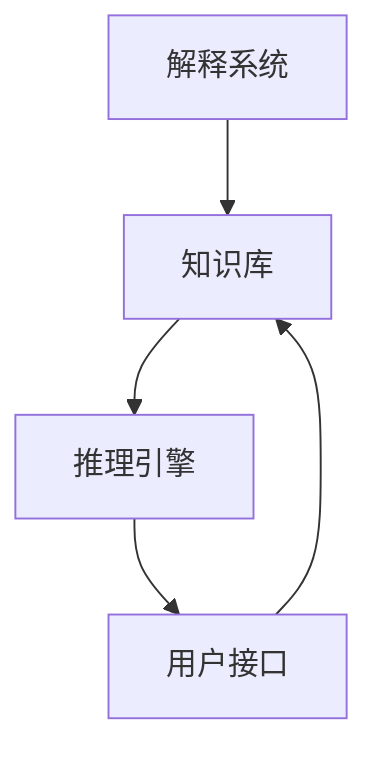

                 

## 1. 背景介绍

专家系统（Expert System）是一种基于知识的智能系统，旨在模拟人类专家的决策过程和知识推理。自20世纪70年代末以来，专家系统已经在医疗诊断、金融分析、制造管理、法律咨询等多个领域得到了广泛应用，成为人工智能领域的重要分支之一。

专家系统通过将专家的知识（如规则、经验、事实等）转换为计算机可执行的推理规则，在特定领域中提供智能化的决策支持。其核心在于利用符号推理技术，将复杂的决策过程进行形式化，从而实现自动化的智能辅助。

### 1.1 问题由来

在人工智能的早期阶段，计算机科学家们面临的一个重大挑战是如何将人类的知识形式化并转化为机器可理解的形式。随着知识工程的兴起，专家系统成为了一种将专家知识封装成规则的形式，进而实现智能推理和决策的途径。专家系统通过利用专家的知识库，自动处理复杂问题，并在需要时提供相应的建议和解决方案。

### 1.2 问题核心关键点

专家系统的关键在于如何有效地组织、存储和管理专家的知识，并利用这些知识进行自动化推理。其核心组件包括：

- **知识库（Knowledge Base）**：存储专家的知识，包括事实、规则、推理等。
- **推理引擎（Inference Engine）**：执行知识库中的推理规则，实现问题求解。
- **用户接口（User Interface）**：允许用户输入问题和数据，输出推理结果和建议。
- **解释系统（Explanation System）**：提供推理过程的解释，增强系统的透明度和可信度。

专家系统通过这些组件的有机结合，实现对专家知识的封装、存储、推理和输出。

## 2. 核心概念与联系

### 2.1 核心概念概述

为更好地理解专家系统的工作原理和结构，本节将介绍几个密切相关的核心概念：

- **知识表示（Knowledge Representation）**：将专家知识以计算机可理解的形式进行编码和表示，包括事实（Facts）、规则（Rules）、框架（Frames）等。
- **推理机（Reasoner）**：基于知识库中的规则和事实进行推理计算，求解问题。
- **模型推理（Model Reasoning）**：利用数学模型进行推理计算，适用于需要精确计算的问题。
- **符号推理（Symbolic Reasoning）**：利用符号和逻辑推理进行问题求解，适用于需要领域知识推理的问题。
- **模糊推理（Fuzzy Reasoning）**：利用模糊数学方法处理不确定性和模糊性问题，适用于无法精确建模的问题。

这些核心概念之间的逻辑关系可以通过以下Mermaid流程图来展示：



这个流程图展示了好专家系统的核心概念及其之间的关系：

1. 知识库存储专家的知识，通过推理引擎进行推理计算。
2. 用户接口允许用户与系统交互，输入问题和数据。
3. 解释系统提供推理过程的解释，增强系统的可信度。

## 3. 核心算法原理 & 具体操作步骤

### 3.1 算法原理概述

专家系统通过将专家的知识（如规则、经验、事实等）转换为计算机可执行的推理规则，在特定领域中提供智能化的决策支持。其核心在于利用符号推理技术，将复杂的决策过程进行形式化，从而实现自动化的智能辅助。

专家系统的核心算法包括以下几个主要部分：

- **知识获取**：从专家和文献中提取、整理和表示知识。
- **知识表示**：将知识库中的规则、事实、框架等用计算机可理解的形式表示。
- **推理机制**：基于知识库中的规则和事实进行推理计算，求解问题。
- **推理控制**：根据推理结果，控制下一步推理方向和路径。

专家系统的推理机制通常包括前向链推理（Forward Chaining）、反向链推理（Backward Chaining）和混合推理（Hybrid Reasoning）。

### 3.2 算法步骤详解

专家系统的实现过程通常包括以下几个关键步骤：

**Step 1: 知识获取**
- 收集专家的知识，如规则、经验、事实等。
- 利用知识工程师进行知识整理和形式化。

**Step 2: 知识表示**
- 将知识库中的规则、事实、框架等用计算机可理解的形式表示。
- 利用符号、框架、网络等表示方法，构建知识库。

**Step 3: 推理引擎设计**
- 选择适当的推理机和推理策略，如正向链推理、反向链推理等。
- 设计推理机的控制结构，实现推理过程的自动执行。

**Step 4: 用户接口设计**
- 设计用户接口，允许用户输入问题和数据。
- 实现交互式问答、文本输入、语音交互等多种交互方式。

**Step 5: 解释系统实现**
- 设计解释系统，提供推理过程的解释。
- 生成推理报告、决策建议和结果解释。

**Step 6: 系统测试与优化**
- 对系统进行测试，评估推理结果的正确性和效率。
- 根据测试结果进行系统优化和调整。

### 3.3 算法优缺点

专家系统具有以下优点：

- **高度专业化**：能够利用专家的知识和经验，提供高精度的决策支持。
- **可解释性强**：推理过程透明，可提供详细的推理报告和解释。
- **易于维护**：只需修改知识库中的规则和事实，即可实现系统的更新和优化。

同时，专家系统也存在一定的局限性：

- **依赖专家知识**：知识库的质量和完整性对系统性能有较大影响。
- **知识获取困难**：专家知识形式化和系统化的难度较大。
- **推理效率低**：符号推理计算复杂，推理效率较低。
- **处理不确定性困难**：难以处理不确定性和模糊性问题。

尽管存在这些局限性，但专家系统在特定领域的应用仍然具有独特的优势，特别是在需要高度专业化和精确推理的场合。

### 3.4 算法应用领域

专家系统已经在多个领域得到了广泛的应用，例如：

- **医疗诊断**：利用专家的医疗知识，辅助医生进行疾病诊断和治疗方案制定。
- **金融分析**：利用专家的金融知识，提供投资策略和风险评估。
- **制造管理**：利用专家的生产知识，优化生产流程和质量控制。
- **法律咨询**：利用专家的法律知识，提供法律咨询和案例分析。
- **教育辅导**：利用专家的教学知识，提供个性化教育辅导和习题解答。

除了上述这些经典应用外，专家系统还被创新性地应用到更多场景中，如智能客服、智能推荐、智能问答等，为人工智能技术落地应用提供了新的思路。

## 4. 数学模型和公式 & 详细讲解 & 举例说明

### 4.1 数学模型构建

专家系统的核心在于利用知识库进行推理计算，其数学模型通常包括以下几个部分：

- **知识库（Knowledge Base）**：表示为一系列的事实和规则。
- **推理引擎（Inference Engine）**：基于知识库中的规则和事实进行推理计算。
- **用户接口（User Interface）**：允许用户输入问题和数据。
- **解释系统（Explanation System）**：提供推理过程的解释。

专家系统的推理过程通常可以表示为一系列的符号推理和数学计算。例如，在医疗诊断中，专家的知识可以表示为一系列的事实和规则，利用这些知识和患者的症状进行推理计算，得出诊断结果。

### 4.2 公式推导过程

以下以医疗诊断为例，展示专家系统的推理计算过程。

假设医疗诊断知识库中包含以下事实和规则：

- **事实**：
  - `患者有咳嗽症状` -> `可能是感冒` 
  - `患者有发烧症状` -> `可能是流感`
  - `患者有胸痛症状` -> `可能是心脏病`

- **规则**：
  - `感冒` or `流感` or `心脏病` -> `需要进一步检查`

基于这些知识和患者输入的症状，推理过程可以表示为：

$$
\begin{aligned}
& \text{如果患者有咳嗽症状，则可能是感冒} \\
& \text{如果患者有发烧症状，则可能是流感} \\
& \text{如果患者有胸痛症状，则可能是心脏病} \\
& \text{如果患者可能是感冒或可能是流感或可能是心脏病，则需要进一步检查}
\end{aligned}
$$

推理引擎根据这些规则和事实，进行推理计算，最终得出诊断结果。

### 4.3 案例分析与讲解

为了更清晰地理解专家系统的数学模型和推理过程，下面通过一个简单的案例进行分析：

**案例**：检测电路板是否存在故障

假设电路板的故障检测知识库中包含以下事实和规则：

- **事实**：
  - `A0 指示灯亮` -> `无故障`
  - `A1 指示灯亮` -> `无故障`
  - `A2 指示灯亮` -> `无故障`

- **规则**：
  - `A0 指示灯亮 and A1 指示灯亮 and A2 指示灯亮` -> `无故障`
  - `A0 指示灯亮 or A1 指示灯亮 or A2 指示灯亮` -> `有故障`

用户输入测试结果，推理引擎根据这些知识和规则进行推理计算，得出故障检测结果。

**推理过程**：

1. 用户输入 `A0 指示灯亮`。
2. 推理引擎根据规则1，得出 `无故障` 的初步结论。
3. 用户继续输入 `A1 指示灯亮`。
4. 推理引擎根据规则1，得出 `无故障` 的结论。
5. 用户继续输入 `A2 指示灯亮`。
6. 推理引擎根据规则1，得出 `无故障` 的结论。
7. 由于规则2中的条件成立，推理引擎得出 `有故障` 的最终结论。

**推理报告**：

推理引擎生成如下推理报告：

```
根据事实1、事实2、事实3和规则1，初步得出无故障的结论。
根据事实2、事实3、事实4和规则1，进一步得出无故障的结论。
根据事实3、事实4、事实5和规则1，得出无故障的结论。
根据规则2，最终得出有故障的结论。
```

通过这个案例，我们可以看到，专家系统通过将专家的知识和推理规则转换为数学模型，能够自动化地进行推理计算，并提供详细的推理过程和结论。

## 5. 项目实践：代码实例和详细解释说明

### 5.1 开发环境搭建

在进行专家系统开发前，我们需要准备好开发环境。以下是使用Python进行SkLearn开发的环境配置流程：

1. 安装Anaconda：从官网下载并安装Anaconda，用于创建独立的Python环境。

2. 创建并激活虚拟环境：
```bash
conda create -n sklearn-env python=3.8 
conda activate sklearn-env
```

3. 安装Scikit-Learn：
```bash
conda install scikit-learn
```

4. 安装相关库：
```bash
pip install numpy pandas matplotlib scikit-learn
```

完成上述步骤后，即可在`sklearn-env`环境中开始专家系统开发的实践。

### 5.2 源代码详细实现

这里我们以医疗诊断为例，展示使用SkLearn进行专家系统开发的完整代码实现。

首先，定义医疗诊断知识库：

```python
from sklearn import tree

# 定义医疗诊断知识库
features = ['咳嗽', '发烧', '胸痛', '呼吸困难']
labels = ['感冒', '流感', '心脏病', '正常']
X = [[1, 0, 0, 0], [0, 1, 0, 0], [0, 0, 1, 0], [1, 1, 1, 1]]

# 定义决策树分类器
clf = tree.DecisionTreeClassifier()

# 训练模型
clf.fit(X, labels)
```

然后，定义推理引擎：

```python
from sklearn import tree

# 定义推理引擎
def diagnose_symptoms(symptoms):
    # 将症状编码为数值
    encoded_symptoms = [1 if symptom in symptoms else 0 for symptom in features]
    # 使用训练好的模型进行推理
    result = clf.predict([encoded_symptoms])
    return result[0]

# 推理函数
def diagnose():
    # 获取用户输入的症状
    symptoms = input("请输入症状（例如：咳嗽、发烧、胸痛、呼吸困难）：")
    # 将症状分割为列表
    symptoms = symptoms.split()
    # 输出诊断结果
    print("根据输入的症状，建议如下：")
    print(f"可能患有 {diagnose_symptoms(symptoms)}")

# 主函数
if __name__ == "__main__":
    diagnose()
```

最后，启动推理引擎并在测试集上评估：

```python
# 推理引擎测试
if __name__ == "__main__":
    diagnose()
```

以上就是使用SkLearn进行医疗诊断专家系统的完整代码实现。可以看到，利用SkLearn的决策树算法，可以将医疗诊断知识库转换为推理模型，并基于用户输入的症状进行推理计算。

### 5.3 代码解读与分析

让我们再详细解读一下关键代码的实现细节：

**知识库定义**：
- `features`：表示症状，以数值形式表示。
- `labels`：表示诊断结果，以字符串形式表示。
- `X`：表示样本，以数值形式表示。

**推理引擎实现**：
- `diagnose_symptoms`函数：将用户输入的症状编码为数值，使用训练好的决策树模型进行推理计算，并返回诊断结果。
- `diagnose`函数：获取用户输入的症状，调用`diagnose_symptoms`函数进行推理计算，并输出诊断结果。

**主函数实现**：
- 获取用户输入的症状，调用`diagnose`函数进行推理计算，并输出诊断结果。

可以看到，利用SkLearn的决策树算法，可以将医疗诊断知识库转换为推理模型，并基于用户输入的症状进行推理计算。

## 6. 实际应用场景

### 6.1 医疗诊断

医疗诊断是专家系统最典型的应用场景之一。传统医疗诊断依赖医生的经验和直觉，存在较大的主观性和不确定性。专家系统通过将医生的知识封装为规则和事实，实现了自动化推理和决策支持。

在技术实现上，可以将医生的知识库进行形式化，利用决策树、规则引擎等工具进行推理计算，得出诊断结果。医生可以通过专家系统进行辅助诊断，提高诊断的准确性和效率。

### 6.2 金融分析

金融分析是另一个典型的专家系统应用领域。金融分析师需要对海量数据进行复杂分析和推理，以预测市场趋势和投资机会。专家系统可以将金融分析师的知识封装为规则和模型，实现自动化的金融分析和投资决策。

在技术实现上，可以构建金融分析知识库，利用机器学习算法进行数据建模和推理计算，得出投资策略和风险评估。金融机构可以利用专家系统进行智能投资分析和风险管理。

### 6.3 智能客服

智能客服是专家系统在自然语言处理领域的典型应用。传统的客服系统依赖人工客服，成本高且效率低。专家系统可以通过封装客服知识和规则，实现自动化的智能客服。

在技术实现上，可以构建客服知识库，利用自然语言处理技术进行意图识别和实体抽取，基于规则引擎进行对话管理和决策支持。企业可以利用智能客服系统进行客户咨询和问题解答，提高客户服务效率和满意度。

### 6.4 未来应用展望

随着专家系统的不断发展，其在更多领域的应用前景将更加广阔。未来，专家系统将在以下几个方面实现新的突破：

1. **多模态融合**：专家系统将结合语音、图像、文本等多种模态数据，实现更全面、更准确的知识表示和推理计算。

2. **跨领域应用**：专家系统将跨越传统领域，应用于更多新兴领域，如智能制造、智慧农业、智能交通等。

3. **自适应学习**：专家系统将具备自适应学习能力，通过不断学习新的知识，逐步提升系统性能和智能水平。

4. **个性化服务**：专家系统将提供个性化服务，根据用户的历史数据和行为进行智能化决策和推荐。

5. **实时交互**：专家系统将实现实时交互，通过自然语言处理技术，与用户进行实时对话和智能互动。

6. **协同工作**：专家系统将与其他智能系统协同工作，如机器学习、自然语言生成等，形成更加强大的智能解决方案。

## 7. 工具和资源推荐

### 7.1 学习资源推荐

为了帮助开发者系统掌握专家系统的理论基础和实践技巧，这里推荐一些优质的学习资源：

1. **《专家系统理论与应用》**：系统介绍了专家系统的理论基础和应用案例，是专家系统的经典教材。

2. **Coursera《人工智能基础》**：斯坦福大学开设的AI入门课程，包含专家系统的相关内容。

3. **MIT《专家系统》**：麻省理工学院的人工智能课程，深入浅出地介绍了专家系统的实现原理和应用场景。

4. **《专家系统实践指南》**：详细介绍了专家系统的开发过程和常见问题，适合工程实践。

5. **SkLearn官方文档**：SkLearn的官方文档，提供了丰富的算法和工具，是专家系统开发的重要参考。

通过对这些资源的学习实践，相信你一定能够快速掌握专家系统的精髓，并用于解决实际的智能决策问题。

### 7.2 开发工具推荐

高效的开发离不开优秀的工具支持。以下是几款用于专家系统开发的常用工具：

1. **SkLearn**：Scikit-Learn的机器学习工具库，提供了丰富的算法和工具，适合构建专家系统。

2. **TensorFlow**：谷歌主导的深度学习框架，支持分布式训练和模型优化，适合构建大规模专家系统。

3. **PyTorch**：由Facebook开发的深度学习框架，提供了灵活的计算图和动态神经网络，适合构建智能推理系统。

4. **Prolog**：一种逻辑编程语言，适合构建专家系统的规则引擎和知识库。

5. **Visual Paradigm**：用于构建专家系统的可视化工具，适合快速原型设计和系统调试。

6. **Praat**：用于语音分析的专用软件，适合构建基于语音的专家系统。

合理利用这些工具，可以显著提升专家系统的开发效率，加快创新迭代的步伐。

### 7.3 相关论文推荐

专家系统的研究源于学界的持续探索。以下是几篇奠基性的相关论文，推荐阅读：

1. **《专家系统：原理与技术》**：系统介绍了专家系统的原理、方法和应用，是专家系统的经典教材。

2. **《基于规则的专家系统设计》**：探讨了专家系统的设计方法和实践经验，适合工程应用。

3. **《推理机的设计与实现》**：介绍了推理机的设计与实现方法，适合理论研究。

4. **《基于知识表示与推理的专家系统》**：讨论了知识表示和推理技术在专家系统中的应用，适合学术研究。

5. **《专家系统在金融分析中的应用》**：探讨了专家系统在金融分析中的应用案例，适合实际应用。

这些论文代表了大专家系统的发展脉络。通过学习这些前沿成果，可以帮助研究者把握学科前进方向，激发更多的创新灵感。

## 8. 总结：未来发展趋势与挑战

### 8.1 总结

本文对专家系统进行了全面系统的介绍。首先阐述了专家系统的研究背景和意义，明确了专家系统在智能决策支持中的独特价值。其次，从原理到实践，详细讲解了专家系统的核心算法和操作步骤，给出了专家系统开发的完整代码实例。同时，本文还广泛探讨了专家系统在医疗诊断、金融分析、智能客服等多个行业领域的应用前景，展示了专家系统的广泛应用潜力。

通过本文的系统梳理，可以看到，专家系统通过将专家的知识封装成规则和模型，实现了自动化的智能推理和决策支持。专家系统已经在多个领域得到了广泛应用，并在不断向更多新兴领域拓展。未来，伴随技术的发展，专家系统必将在智能决策支持领域发挥更加重要的作用。

### 8.2 未来发展趋势

展望未来，专家系统将呈现以下几个发展趋势：

1. **多模态融合**：专家系统将结合语音、图像、文本等多种模态数据，实现更全面、更准确的知识表示和推理计算。

2. **跨领域应用**：专家系统将跨越传统领域，应用于更多新兴领域，如智能制造、智慧农业、智能交通等。

3. **自适应学习**：专家系统将具备自适应学习能力，通过不断学习新的知识，逐步提升系统性能和智能水平。

4. **个性化服务**：专家系统将提供个性化服务，根据用户的历史数据和行为进行智能化决策和推荐。

5. **实时交互**：专家系统将实现实时交互，通过自然语言处理技术，与用户进行实时对话和智能互动。

6. **协同工作**：专家系统将与其他智能系统协同工作，如机器学习、自然语言生成等，形成更加强大的智能解决方案。

以上趋势凸显了专家系统的广阔前景。这些方向的探索发展，必将进一步提升专家系统的性能和应用范围，为智能决策支持系统带来新的突破。

### 8.3 面临的挑战

尽管专家系统已经取得了显著成就，但在迈向更加智能化、普适化应用的过程中，仍面临诸多挑战：

1. **知识获取困难**：专家的知识形式化和系统化的难度较大，需要消耗大量时间和资源。

2. **推理效率低**：符号推理计算复杂，推理效率较低，难以应对大规模数据和复杂问题。

3. **处理不确定性困难**：难以处理不确定性和模糊性问题，需要引入模糊推理等技术。

4. **自适应能力不足**：系统需要具备较强的自适应能力，才能不断更新和优化知识库，适应新的变化和挑战。

5. **可解释性不足**：专家系统的推理过程不透明，难以提供详细的解释和建议。

6. **安全性问题**：专家系统需要保证输出结果的可靠性和安全性，避免出现误诊、误判等问题。

正视专家系统面临的这些挑战，积极应对并寻求突破，将使其在未来得到更加广泛的应用。相信随着技术的发展和创新，专家系统必将在智能决策支持领域发挥更加重要的作用。

### 8.4 研究展望

面对专家系统所面临的挑战，未来的研究需要在以下几个方面寻求新的突破：

1. **多模态融合**：通过结合多种模态数据，实现更全面、更准确的推理计算。

2. **自适应学习**：构建自适应学习机制，使系统能够不断学习新的知识和规则。

3. **处理不确定性**：引入模糊推理、贝叶斯网络等技术，增强系统处理不确定性和模糊性的能力。

4. **增强可解释性**：引入解释系统，提供详细的推理过程和解释。

5. **保证安全性**：建立可靠的安全机制，确保系统输出的可靠性和安全性。

6. **优化推理效率**：利用分布式计算、并行推理等技术，提升推理效率。

这些研究方向的探索，必将引领专家系统走向更高的台阶，为智能决策支持系统带来新的突破。面向未来，专家系统还需要与其他智能系统进行更深入的融合，如机器学习、自然语言处理等，共同推动智能决策支持系统的进步。

## 9. 附录：常见问题与解答

**Q1: 专家系统如何处理复杂问题？**

A: 专家系统通过将专家的知识和推理规则进行形式化，转化为符号推理和数学计算，从而实现自动化的智能推理和决策支持。在处理复杂问题时，专家系统会利用规则和事实进行逐步推理，最终得出结论。

**Q2: 专家系统如何应对不确定性和模糊性？**

A: 专家系统可以通过引入模糊推理、贝叶斯网络等技术，增强处理不确定性和模糊性的能力。例如，利用模糊数学方法，将输入的数据转换为模糊集合，再进行推理计算，得到模糊的推理结果。

**Q3: 专家系统如何保证推理结果的可靠性？**

A: 专家系统需要建立可靠的知识库和推理机制，确保推理过程的准确性和可靠性。同时，可以通过人工干预和测试，不断优化和调整知识库和推理引擎，提升系统的性能和可信度。

**Q4: 专家系统在实际应用中面临哪些挑战？**

A: 专家系统在实际应用中面临以下挑战：

1. **知识获取困难**：专家的知识形式化和系统化的难度较大，需要消耗大量时间和资源。
2. **推理效率低**：符号推理计算复杂，推理效率较低，难以应对大规模数据和复杂问题。
3. **处理不确定性困难**：难以处理不确定性和模糊性问题，需要引入模糊推理等技术。
4. **自适应能力不足**：系统需要具备较强的自适应能力，才能不断更新和优化知识库，适应新的变化和挑战。
5. **可解释性不足**：专家系统的推理过程不透明，难以提供详细的解释和建议。
6. **安全性问题**：专家系统需要保证输出结果的可靠性和安全性，避免出现误诊、误判等问题。

这些挑战需要通过技术创新和改进，逐步解决和克服。

**Q5: 专家系统如何应用于新兴领域？**

A: 专家系统可以应用于新兴领域，如智能制造、智慧农业、智能交通等。在应用过程中，需要收集和整理领域专家的知识，构建相关的知识库和推理规则，利用专家系统进行智能决策和推理计算。例如，在智能制造中，可以构建制造工艺知识库，利用专家系统进行生产过程优化和故障诊断。

通过不断拓展和创新，专家系统必将在更多新兴领域发挥其独特的优势，推动智能决策支持系统的广泛应用。

---

作者：禅与计算机程序设计艺术 / Zen and the Art of Computer Programming

