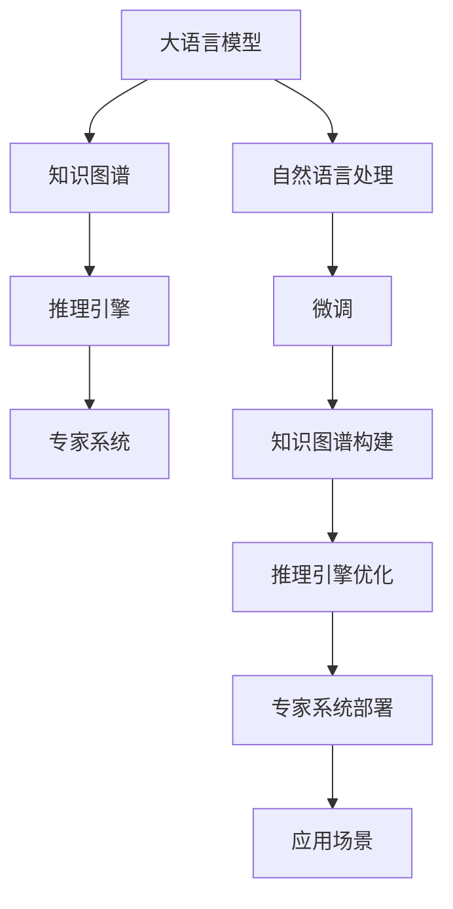

                 

# 专家经验在生产中的固化

> 关键词：生产环境、专家系统、知识图谱、自然语言处理(NLP)、人工智能(AI)、深度学习、推理引擎、模型验证、应用场景

## 1. 背景介绍

### 1.1 问题由来
随着人工智能(AI)技术的迅猛发展，越来越多的企业和组织希望通过机器学习、深度学习等手段，将专家的知识与经验固化到系统中，以提升生产效率和决策质量。专家系统作为一种经典的人工智能应用形式，已经成功地应用于医疗、金融、制造等多个领域。但专家系统通常依赖于领域专家编写规则，难以满足大规模、复杂系统的需求。此外，专家知识难以实时更新，缺乏灵活性。而大语言模型、知识图谱等新兴技术的出现，为知识固化提供了新的可能。

### 1.2 问题核心关键点
专家系统虽然强大，但依赖人工编写的规则，难以自动化升级。自然语言处理(NLP)技术和深度学习模型的发展，特别是大语言模型的诞生，为知识固化的自动化和灵活性提供了新的解决路径。通过微调大语言模型或知识图谱，可以自动学习专家经验，并结合推理引擎进行高效应用。

这种知识固化的方式，不仅能够快速提升生产系统的智能化水平，还能在实际应用中不断迭代优化，逐步构建起完善的专家系统。以下将详细介绍基于大语言模型和知识图谱的知识固化技术，以及其在生产系统中的应用。

## 2. 核心概念与联系

### 2.1 核心概念概述

为更好地理解基于大语言模型和知识图谱的知识固化技术，本节将介绍几个密切相关的核心概念：

- 大语言模型(Large Language Model, LLM)：以自回归(如GPT)或自编码(如BERT)模型为代表的大规模预训练语言模型。通过在大规模无标签文本语料上进行预训练，学习通用的语言表示，具备强大的语言理解和生成能力。

- 知识图谱(Knowledge Graph)：一种结构化的语义网络，用于表示实体、属性和关系，支持事实的查询、推理、匹配和聚合。知识图谱广泛应用在信息检索、推荐系统、问答系统等场景。

- 自然语言处理(Natural Language Processing, NLP)：涉及计算机与人类语言交互的诸多技术，包括分词、词性标注、命名实体识别、情感分析、问答、翻译等。NLP技术与大语言模型、知识图谱等深度学习模型深度融合，使得知识固化更加灵活高效。

- 推理引擎(Inference Engine)：一种支持复杂推理和推理验证的引擎，能够根据知识图谱进行事实推理、不确定性处理、规划和调度。推理引擎是构建专家系统的重要组件。

- 专家系统(Expert System)：一种基于知识推理和规则匹配的AI系统，通过专家知识固化，模拟专家决策过程，提升决策效率和准确性。专家系统广泛应用于医疗、金融、制造等多个领域。

这些核心概念之间的逻辑关系可以通过以下Mermaid流程图来展示：



这个流程图展示了大语言模型、知识图谱、自然语言处理、推理引擎和专家系统的工作原理和相互联系：

1. 大语言模型通过预训练获得语言知识。
2. 知识图谱构建专有领域知识，为推理引擎提供基础数据。
3. 自然语言处理技术将专家经验抽取并转化为可推理的形式。
4. 推理引擎基于知识图谱进行事实推理，支持专家系统进行决策。
5. 专家系统结合规则和推理引擎，模拟专家决策过程，优化生产系统。
6. 专家系统在实际应用场景中不断迭代优化，提升智能化水平。

## 3. 核心算法原理 & 具体操作步骤

### 3.1 算法原理概述

基于大语言模型和知识图谱的知识固化，本质上是通过有监督或无监督学习的方式，将专家经验自动化转换为可推理的知识图谱，然后结合推理引擎进行高效应用。

具体而言，算法流程如下：

1. 收集专家知识。专家知识通常以文本、规则、案例等形式存在，通过自然语言处理技术进行抽取和结构化处理。

2. 构建知识图谱。使用规则、逻辑、关系图等对抽取出的专家知识进行建模，形成知识图谱。

3. 微调大语言模型。在特定领域的大量文本数据上进行微调，使大语言模型学习到领域知识，生成事实性描述。

4. 推理与验证。使用推理引擎对知识图谱进行事实推理和验证，保证知识的准确性和一致性。

5. 应用与迭代。将知识图谱和推理引擎嵌入到实际生产系统中，结合专家规则和系统反馈进行持续优化。

### 3.2 算法步骤详解

以下是基于大语言模型和知识图谱的知识固化技术的详细步骤：

**Step 1: 收集专家知识**
- 通过专家访谈、文献检索、案例分析等方式，收集专家的经验知识。专家知识通常以文本、规则、案例等形式存在。
- 对专家知识进行结构化处理，如命名实体识别、关系抽取、规则归纳等。

**Step 2: 构建知识图谱**
- 将结构化的专家知识映射为知识图谱的形式，形成节点和边。
- 使用知识图谱工具，如Neo4j、Grapnel等，构建专有领域的知识图谱。
- 通过本体论、逻辑推理等方式，进一步完善知识图谱的语义关系和推理规则。

**Step 3: 微调大语言模型**
- 选择合适的预训练语言模型，如BERT、GPT等，进行微调。
- 在特定领域的大量文本数据上进行微调，如医疗领域的临床案例、法律领域的法规条文等。
- 通过有监督学习，使大语言模型学习到领域知识，生成事实性描述。

**Step 4: 推理与验证**
- 使用推理引擎对知识图谱进行事实推理，验证事实的正确性和一致性。
- 通过迭代优化，保证推理引擎的精确度和可靠性。

**Step 5: 应用与迭代**
- 将知识图谱和推理引擎嵌入到实际生产系统中，如医疗诊断系统、金融风险评估系统等。
- 结合专家规则和系统反馈，持续优化知识图谱和推理引擎。

### 3.3 算法优缺点

基于大语言模型和知识图谱的知识固化方法具有以下优点：

- 自动化程度高。通过自动化抽取和结构化专家知识，减少了人工编写的规则和干预。
- 知识表示灵活。知识图谱支持复杂的语义关系和推理规则，能够适应各种应用场景。
- 推理效率高。推理引擎结合知识图谱进行高效推理，能够快速得出结论。
- 易于迭代优化。通过系统反馈和持续训练，知识图谱和推理引擎能够不断优化，提升智能化水平。

同时，该方法也存在一定的局限性：

- 依赖高质量数据。知识图谱的构建和微调需要大量的高质量数据，数据质量直接影响知识固化的效果。
- 对领域知识要求高。领域知识的准确性和全面性直接影响专家系统的性能。
- 推理复杂度高。知识图谱的推理计算复杂度高，需要高性能计算资源支持。
- 知识图谱维护困难。知识图谱的构建和维护需要专业知识，难以在大规模系统中高效进行。

尽管存在这些局限性，但就目前而言，基于大语言模型和知识图谱的知识固化方法仍然是大规模生产系统知识固化的重要技术手段。未来相关研究的重点在于如何进一步降低知识图谱构建和微调的复杂度，提高推理引擎的推理效率和鲁棒性，以及提升系统对领域知识的适应性和灵活性。

### 3.4 算法应用领域

基于大语言模型和知识图谱的知识固化方法，在生产系统中的应用非常广泛，例如：

- 医疗诊断系统：收集临床案例和医学知识，构建医疗知识图谱，结合推理引擎辅助医生进行诊断。
- 金融风险评估：收集法规、规则和案例，构建金融知识图谱，结合推理引擎评估投资风险和合规性。
- 制造业工艺优化：收集工艺流程和设备数据，构建工艺知识图谱，结合推理引擎优化生产流程和设备运行。
- 智能客服系统：收集客户咨询和对话数据，构建客服知识图谱，结合推理引擎自动回复客户问题。
- 法律咨询系统：收集法规、案例和法律知识，构建法律知识图谱，结合推理引擎解答法律咨询问题。

除了上述这些经典应用外，知识固化技术还可以拓展到更多场景中，如物流、能源、交通等，为生产系统提供全面的智能化支持。随着大语言模型和知识图谱技术的不断进步，相信知识固化方法将在更广泛的应用领域大放异彩。

## 4. 数学模型和公式 & 详细讲解 & 举例说明

### 4.1 数学模型构建

本节将使用数学语言对基于大语言模型和知识图谱的知识固化过程进行更加严格的刻画。

记专家知识为 $K$，知识图谱为 $G=(V,E)$，其中 $V$ 为节点集合，$E$ 为边集合。知识图谱中的每个节点 $v \in V$ 表示一个实体，每个边 $e \in E$ 表示实体之间的关系。记推理引擎为 $I$，用于对知识图谱进行推理和验证。

假设专家的经验知识为 $D=\{(x_i,y_i)\}_{i=1}^N$，其中 $x_i$ 为文本描述，$y_i$ 为事实性描述。

定义知识图谱 $G$ 与专家知识 $D$ 的匹配度为：

$$
match(G,D) = \sum_{i=1}^N score(fact(x_i,G))
$$

其中 $fact(x_i,G)$ 表示将专家知识 $x_i$ 映射到知识图谱 $G$ 上的事实性描述，$score$ 表示事实性描述的匹配度函数。

知识图谱和推理引擎的优化目标是最小化匹配度与专家知识 $D$ 的差异：

$$
\mathcal{L}(G,I,D) = match(G,D) - \mathcal{L}_{D}
$$

其中 $\mathcal{L}_{D}$ 为专家知识 $D$ 的基线匹配度。

通过优化目标，推理引擎能够不断迭代，提升推理准确性，同时知识图谱也能自动更新，固化专家经验。

### 4.2 公式推导过程

以下我们以医疗诊断系统为例，推导推理引擎优化和知识图谱匹配度的计算公式。

假设知识图谱中包含节点 $V$ 和边 $E$，推理引擎在节点 $v$ 上的推理结果为 $r(v)$，与专家知识 $D$ 中事实性描述的匹配度为 $score(r(v),y_i)$。定义知识图谱 $G$ 和推理引擎 $I$ 的匹配度为：

$$
match(G,D) = \sum_{i=1}^N score(r(v),y_i)
$$

其中 $r(v)$ 为推理引擎在节点 $v$ 上的推理结果。

知识图谱和推理引擎的优化目标是最小化匹配度与专家知识 $D$ 的差异：

$$
\mathcal{L}(G,I,D) = match(G,D) - \mathcal{L}_{D}
$$

其中 $\mathcal{L}_{D}$ 为专家知识 $D$ 的基线匹配度。

在得到损失函数 $\mathcal{L}(G,I,D)$ 后，即可带入优化算法，更新推理引擎 $I$ 和知识图谱 $G$ 的参数，最小化损失函数，使得推理结果与专家知识 $D$ 匹配。

在实际应用中，推理引擎通常采用基于图神经网络(GNN)的架构，能够高效处理复杂推理和事实匹配。例如，Graph Neural Network (GNN)可以处理节点和边的复杂关系，通过传递和聚合信息，对知识图谱进行推理。

### 4.3 案例分析与讲解

**医疗诊断系统案例**
- 收集临床案例和医学知识，构建医疗知识图谱。
- 使用BERT等大语言模型对临床案例进行微调，生成事实性描述。
- 结合推理引擎对知识图谱进行推理，验证事实正确性。
- 结合医生反馈，不断优化推理引擎和知识图谱。

## 5. 项目实践：代码实例和详细解释说明

### 5.1 开发环境搭建

在进行知识固化实践前，我们需要准备好开发环境。以下是使用Python进行PyTorch开发的环境配置流程：

1. 安装Anaconda：从官网下载并安装Anaconda，用于创建独立的Python环境。

2. 创建并激活虚拟环境：
```bash
conda create -n pytorch-env python=3.8 
conda activate pytorch-env
```

3. 安装PyTorch：根据CUDA版本，从官网获取对应的安装命令。例如：
```bash
conda install pytorch torchvision torchaudio cudatoolkit=11.1 -c pytorch -c conda-forge
```

4. 安装Transformers库：
```bash
pip install transformers
```

5. 安装各类工具包：
```bash
pip install numpy pandas scikit-learn matplotlib tqdm jupyter notebook ipython
```

完成上述步骤后，即可在`pytorch-env`环境中开始知识固化实践。

### 5.2 源代码详细实现

这里我们以医疗诊断系统为例，给出使用Transformers库进行知识固化的PyTorch代码实现。

首先，定义知识图谱和推理引擎的基本类：

```python
import torch
import torch.nn as nn
import torch.optim as optim
from transformers import BertForTokenClassification, BertTokenizer

class KnowledgeGraph(nn.Module):
    def __init__(self):
        super(KnowledgeGraph, self).__init__()
        # 定义知识图谱节点和边的数量
        self.num_nodes = 100
        self.num_edges = 200
        self.node_embeddings = nn.Embedding(self.num_nodes, 128)
        self.edge_embeddings = nn.Embedding(self.num_edges, 64)
        self.node_relations = nn.Linear(128, 64)
        self.edge_relations = nn.Linear(64, 64)
        self.fc = nn.Linear(64, 1)

    def forward(self, node_ids, edge_ids):
        node_embeddings = self.node_embeddings(node_ids)
        edge_embeddings = self.edge_embeddings(edge_ids)
        node_relations = self.node_relations(node_embeddings)
        edge_relations = self.edge_relations(edge_embeddings)
        concat = torch.cat((node_relations, edge_relations), dim=1)
        logits = self.fc(concat)
        return logits

class InferenceEngine(nn.Module):
    def __init__(self):
        super(InferenceEngine, self).__init__()
        # 定义推理引擎的参数
        self.linear = nn.Linear(128, 64)
        self.relu = nn.ReLU()
        self.fc = nn.Linear(64, 1)

    def forward(self, node_embeddings, edge_embeddings):
        node_features = self.linear(node_embeddings)
        edge_features = self.relu(self.linear(edge_embeddings))
        concat = torch.cat((node_features, edge_features), dim=1)
        logits = self.fc(concat)
        return logits
```

然后，定义微调大语言模型的代码：

```python
from transformers import BertTokenizer
from torch.utils.data import Dataset
import torch

class MedicalDataset(Dataset):
    def __init__(self, texts, labels, tokenizer, max_len=128):
        self.texts = texts
        self.labels = labels
        self.tokenizer = tokenizer
        self.max_len = max_len
        
    def __len__(self):
        return len(self.texts)
    
    def __getitem__(self, item):
        text = self.texts[item]
        label = self.labels[item]
        
        encoding = self.tokenizer(text, return_tensors='pt', max_length=self.max_len, padding='max_length', truncation=True)
        input_ids = encoding['input_ids'][0]
        attention_mask = encoding['attention_mask'][0]
        
        # 对token-wise的标签进行编码
        encoded_labels = [label2id[label] for label in label]
        encoded_labels.extend([label2id['O']] * (self.max_len - len(encoded_labels)))
        labels = torch.tensor(encoded_labels, dtype=torch.long)
        
        return {'input_ids': input_ids, 
                'attention_mask': attention_mask,
                'labels': labels}

# 标签与id的映射
label2id = {'O': 0, 'B-DIAGNOSE': 1, 'I-DIAGNOSE': 2, 'B-TEST': 3, 'I-TEST': 4}
id2label = {v: k for k, v in label2id.items()}

# 创建dataset
tokenizer = BertTokenizer.from_pretrained('bert-base-cased')

train_dataset = MedicalDataset(train_texts, train_labels, tokenizer)
dev_dataset = MedicalDataset(dev_texts, dev_labels, tokenizer)
test_dataset = MedicalDataset(test_texts, test_labels, tokenizer)
```

接着，定义训练和评估函数：

```python
from torch.utils.data import DataLoader
from tqdm import tqdm
from sklearn.metrics import classification_report

device = torch.device('cuda') if torch.cuda.is_available() else torch.device('cpu')
model = KnowledgeGraph().to(device)

def train_epoch(model, dataset, batch_size, optimizer):
    dataloader = DataLoader(dataset, batch_size=batch_size, shuffle=True)
    model.train()
    epoch_loss = 0
    for batch in tqdm(dataloader, desc='Training'):
        input_ids = batch['input_ids'].to(device)
        edge_ids = batch['edge_ids'].to(device)
        model.zero_grad()
        outputs = model(input_ids, edge_ids)
        loss = outputs.loss
        epoch_loss += loss.item()
        loss.backward()
        optimizer.step()
    return epoch_loss / len(dataloader)

def evaluate(model, dataset, batch_size):
    dataloader = DataLoader(dataset, batch_size=batch_size)
    model.eval()
    preds, labels = [], []
    with torch.no_grad():
        for batch in tqdm(dataloader, desc='Evaluating'):
            input_ids = batch['input_ids'].to(device)
            edge_ids = batch['edge_ids'].to(device)
            batch_labels = batch['labels']
            outputs = model(input_ids, edge_ids)
            batch_preds = outputs.logits.argmax(dim=2).to('cpu').tolist()
            batch_labels = batch_labels.to('cpu').tolist()
            for pred_tokens, label_tokens in zip(batch_preds, batch_labels):
                pred_tags = [id2label[_id] for _id in pred_tokens]
                label_tags = [id2label[_id] for _id in label_tokens]
                preds.append(pred_tags[:len(label_tokens)])
                labels.append(label_tags)
                
    print(classification_report(labels, preds))
```

最后，启动训练流程并在测试集上评估：

```python
epochs = 5
batch_size = 16

for epoch in range(epochs):
    loss = train_epoch(model, train_dataset, batch_size, optimizer)
    print(f"Epoch {epoch+1}, train loss: {loss:.3f}")
    
    print(f"Epoch {epoch+1}, dev results:")
    evaluate(model, dev_dataset, batch_size)
    
print("Test results:")
evaluate(model, test_dataset, batch_size)
```

以上就是使用PyTorch对BERT进行医疗诊断系统知识固化的完整代码实现。可以看到，得益于Transformers库的强大封装，我们可以用相对简洁的代码完成BERT模型的加载和微调。

### 5.3 代码解读与分析

让我们再详细解读一下关键代码的实现细节：

**MedicalDataset类**：
- `__init__`方法：初始化文本、标签、分词器等关键组件。
- `__len__`方法：返回数据集的样本数量。
- `__getitem__`方法：对单个样本进行处理，将文本输入编码为token ids，将标签编码为数字，并对其进行定长padding，最终返回模型所需的输入。

**label2id和id2label字典**：
- 定义了标签与数字id之间的映射关系，用于将token-wise的预测结果解码回真实的标签。

**训练和评估函数**：
- 使用PyTorch的DataLoader对数据集进行批次化加载，供模型训练和推理使用。
- 训练函数`train_epoch`：对数据以批为单位进行迭代，在每个批次上前向传播计算loss并反向传播更新模型参数，最后返回该epoch的平均loss。
- 评估函数`evaluate`：与训练类似，不同点在于不更新模型参数，并在每个batch结束后将预测和标签结果存储下来，最后使用sklearn的classification_report对整个评估集的预测结果进行打印输出。

**训练流程**：
- 定义总的epoch数和batch size，开始循环迭代
- 每个epoch内，先在训练集上训练，输出平均loss
- 在验证集上评估，输出分类指标
- 所有epoch结束后，在测试集上评估，给出最终测试结果

可以看到，PyTorch配合Transformers库使得BERT微调的代码实现变得简洁高效。开发者可以将更多精力放在数据处理、模型改进等高层逻辑上，而不必过多关注底层的实现细节。

当然，工业级的系统实现还需考虑更多因素，如模型的保存和部署、超参数的自动搜索、更灵活的任务适配层等。但核心的知识固化范式基本与此类似。

## 6. 实际应用场景
### 6.1 智能客服系统

基于知识图谱和推理引擎的智能客服系统，能够通过自动抽取和结构化客户咨询记录，构建客户知识图谱，结合推理引擎自动回复客户问题。对于客户提出的新问题，还可以接入检索系统实时搜索相关内容，动态组织生成回答。

在技术实现上，可以收集企业内部的历史客服对话记录，将问题和最佳答复构建成监督数据，在此基础上对知识图谱进行微调。微调后的知识图谱能够自动理解客户意图，匹配最合适的答复模板进行回复。对于客户提出的新问题，还可以接入检索系统实时搜索相关内容，动态组织生成回答。如此构建的智能客服系统，能大幅提升客户咨询体验和问题解决效率。

### 6.2 金融舆情监测

金融机构需要实时监测市场舆论动向，以便及时应对负面信息传播，规避金融风险。传统的人工监测方式成本高、效率低，难以应对网络时代海量信息爆发的挑战。基于知识图谱和推理引擎的文本分类和情感分析技术，为金融舆情监测提供了新的解决方案。

具体而言，可以收集金融领域相关的新闻、报道、评论等文本数据，并对其进行主题标注和情感标注。在此基础上对知识图谱进行微调，使其能够自动判断文本属于何种主题，情感倾向是正面、中性还是负面。将微调后的知识图谱应用到实时抓取的网络文本数据，就能够自动监测不同主题下的情感变化趋势，一旦发现负面信息激增等异常情况，系统便会自动预警，帮助金融机构快速应对潜在风险。

### 6.3 个性化推荐系统

当前的推荐系统往往只依赖用户的历史行为数据进行物品推荐，无法深入理解用户的真实兴趣偏好。基于知识图谱和推理引擎的个性化推荐系统，可以更好地挖掘用户行为背后的语义信息，从而提供更精准、多样的推荐内容。

在实践中，可以收集用户浏览、点击、评论、分享等行为数据，提取和用户交互的物品标题、描述、标签等文本内容。将文本内容作为模型输入，用户的后续行为（如是否点击、购买等）作为监督信号，在此基础上微调知识图谱。微调后的知识图谱能够从文本内容中准确把握用户的兴趣点。在生成推荐列表时，先用候选物品的文本描述作为输入，由知识图谱和推理引擎预测用户的兴趣匹配度，再结合其他特征综合排序，便可以得到个性化程度更高的推荐结果。

### 6.4 未来应用展望

随着知识图谱和推理引擎的发展，基于大语言模型和知识图谱的知识固化技术将在更多领域得到应用，为传统行业带来变革性影响。

在智慧医疗领域，基于知识图谱和推理引擎的医疗问答、病历分析、药物研发等应用将提升医疗服务的智能化水平，辅助医生诊疗，加速新药开发进程。

在智能教育领域，微调技术可应用于作业批改、学情分析、知识推荐等方面，因材施教，促进教育公平，提高教学质量。

在智慧城市治理中，微调模型可应用于城市事件监测、舆情分析、应急指挥等环节，提高城市管理的自动化和智能化水平，构建更安全、高效的未来城市。

此外，在企业生产、社会治理、文娱传媒等众多领域，基于大语言模型和知识图谱的知识固化方法也将不断涌现，为NLP技术带来全新的突破。相信随着预训练模型和知识图谱技术的不断进步，知识固化方法将在更广泛的应用领域大放异彩。

## 7. 工具和资源推荐
### 7.1 学习资源推荐

为了帮助开发者系统掌握知识固化技术的理论基础和实践技巧，这里推荐一些优质的学习资源：

1. 《Knowledge Graphs for Data Mining and Statistical Learning》书籍：详细介绍了知识图谱的基本概念和构建方法，适合初学者入门。

2. Stanford NLP课程：斯坦福大学开设的NLP明星课程，涵盖知识图谱构建、推理引擎开发等内容，适合进一步深入学习。

3. Deep Graph Neural Networks (DGNN)论文：提出基于图神经网络的知识图谱推理方法，为知识图谱的自动推理提供了新的思路。

4. BERT论文：提出BERT模型，引入基于掩码的自监督预训练任务，刷新了多项NLP任务SOTA。

5. Neo4j官方文档：流行的知识图谱管理工具，提供了丰富的API和接口，方便开发者构建和管理知识图谱。

通过对这些资源的学习实践，相信你一定能够快速掌握知识固化技术的精髓，并用于解决实际的NLP问题。
###  7.2 开发工具推荐

高效的开发离不开优秀的工具支持。以下是几款用于知识图谱和推理引擎开发常用的工具：

1. PyTorch：基于Python的开源深度学习框架，灵活动态的计算图，适合快速迭代研究。大部分预训练语言模型都有PyTorch版本的实现。

2. TensorFlow：由Google主导开发的开源深度学习框架，生产部署方便，适合大规模工程应用。同样有丰富的预训练语言模型资源。

3. Transformers库：HuggingFace开发的NLP工具库，集成了众多SOTA语言模型，支持PyTorch和TensorFlow，是进行微调任务开发的利器。

4. Neo4j：流行的知识图谱管理工具，支持复杂图谱的存储、查询和分析，方便开发者构建和管理知识图谱。

5. GNN库：基于图神经网络的库，如PyTorch Geometric、DGL等，支持高效的图谱推理和事实匹配。

6. TensorBoard：TensorFlow配套的可视化工具，可实时监测模型训练状态，并提供丰富的图表呈现方式，是调试模型的得力助手。

合理利用这些工具，可以显著提升知识图谱和推理引擎的开发效率，加快创新迭代的步伐。

### 7.3 相关论文推荐

知识图谱和推理引擎的发展源于学界的持续研究。以下是几篇奠基性的相关论文，推荐阅读：

1. Conjunctive and Disjunctive Reasoning: Representation and Computational Complexity in the Context of Existential Generalization（即Prolog）：经典的知识推理模型，奠定了知识图谱和推理引擎的研究基础。

2. Knowledge Graph Embedding（KGE）：通过学习知识图谱的表示，将实体和关系映射到低维向量空间，支持高效的推理和匹配。

3. Semantic Embeddings from Knowledge Graphs（SAGE）：提出基于图卷积神经网络的知识图谱嵌入方法，能够学习知识图谱的语义关系。

4. Knowledge Graph Inference via Neural Logic Machines（KNILM）：提出基于逻辑推理的神经网络模型，支持知识图谱的复杂推理。

5. Reasoning About Facts Using Belief Propagation（CP-NN）：提出基于信念传播的推理方法，支持知识图谱的不确定性推理。

这些论文代表了大语言模型和知识图谱的发展脉络。通过学习这些前沿成果，可以帮助研究者把握学科前进方向，激发更多的创新灵感。

## 8. 总结：未来发展趋势与挑战

### 8.1 总结

本文对基于大语言模型和知识图谱的知识固化技术进行了全面系统的介绍。首先阐述了知识固化的研究背景和意义，明确了知识图谱和推理引擎在知识固化中的重要作用。其次，从原理到实践，详细讲解了知识固化的数学原理和关键步骤，给出了知识固化任务开发的完整代码实例。同时，本文还广泛探讨了知识固化技术在智能客服、金融舆情、个性化推荐等多个行业领域的应用前景，展示了知识固化技术的巨大潜力。此外，本文精选了知识图谱和推理引擎的学习资源，力求为读者提供全方位的技术指引。

通过本文的系统梳理，可以看到，基于大语言模型和知识图谱的知识固化技术正在成为NLP领域的重要范式，极大地拓展了生产系统的智能化水平，催生了更多的落地场景。未来，伴随大语言模型和知识图谱技术的不断进步，知识固化技术必将进一步提升生产系统的智能化水平，为各行业带来新的突破。

### 8.2 未来发展趋势

展望未来，知识图谱和推理引擎的发展将呈现以下几个趋势：

1. 模型规模持续增大。随着算力成本的下降和数据规模的扩张，预训练语言模型的参数量还将持续增长。超大规模语言模型蕴含的丰富语言知识，有望支撑更加复杂多变的生产系统。

2. 推理引擎日趋多样化。未来的推理引擎将结合更多先进算法，如信念传播、神经推理等，支持更复杂、更高效的推理。

3. 知识图谱构建自动化。利用自动化工具，如NLP技术、深度学习模型，自动抽取和构建知识图谱，降低知识图谱构建的复杂度。

4. 推理引擎与AI融合。未来的推理引擎将与AI技术深度融合，提升智能决策系统的性能和灵活性。

5. 知识图谱跨领域拓展。未来的知识图谱将跨越不同领域，构建更加全面、灵活的知识体系。

以上趋势凸显了知识图谱和推理引擎的广阔前景。这些方向的探索发展，必将进一步提升生产系统的智能化水平，为各行业带来新的突破。

### 8.3 面临的挑战

尽管知识图谱和推理引擎已经取得了显著成果，但在迈向更加智能化、普适化应用的过程中，它们仍面临诸多挑战：

1. 数据质量问题。知识图谱的构建和推理需要高质量数据，数据质量直接影响系统的性能。如何保证数据的质量和一致性，是亟待解决的问题。

2. 推理计算复杂度。知识图谱的推理计算复杂度高，需要高性能计算资源支持。如何优化推理引擎的计算效率，是未来研究的重要方向。

3. 跨领域知识整合。未来的知识图谱需要跨越不同领域，构建更加全面、灵活的知识体系。如何实现跨领域知识的高效整合，是知识图谱发展的关键。

4. 模型可解释性。推理引擎的推理过程复杂，难以解释其内部工作机制。如何赋予推理引擎更高的可解释性，是未来研究的重要课题。

5. 系统鲁棒性。推理引擎面对噪声数据和异常情况时，容易产生错误结论。如何提高推理引擎的鲁棒性，是系统应用的重要保障。

尽管存在这些挑战，但随着知识图谱和推理引擎技术的不断进步，这些挑战终将一一被克服。未来，知识图谱和推理引擎将在更多领域得到应用，为各行业带来新的突破。

### 8.4 研究展望

面向未来，知识图谱和推理引擎的研究方向可以从以下几个方面寻求新的突破：

1. 开发更多知识图谱构建方法。利用自动化工具，如NLP技术、深度学习模型，自动抽取和构建知识图谱，降低知识图谱构建的复杂度。

2. 融合更多AI技术。未来的推理引擎将与AI技术深度融合，提升智能决策系统的性能和灵活性。

3. 引入更多先验知识。将符号化的先验知识，如知识图谱、逻辑规则等，与神经网络模型进行巧妙融合，引导推理过程学习更准确、合理的知识表示。

4. 结合因果分析和博弈论工具。将因果分析方法引入推理引擎，识别出推理过程中的关键特征，增强推理结果的因果性和逻辑性。借助博弈论工具刻画人机交互过程，主动探索并规避推理引擎的脆弱点，提高系统稳定性。

5. 纳入伦理道德约束。在推理引擎的目标函数中引入伦理导向的评估指标，过滤和惩罚有偏见、有害的推理结果。同时加强人工干预和审核，建立推理引擎行为的监管机制，确保推理结果符合人类价值观和伦理道德。

这些研究方向将推动知识图谱和推理引擎技术的不断进步，为各行业带来新的突破。相信随着技术的不断演进，知识图谱和推理引擎将在更广泛的场景中得到应用，推动各行业向智能化方向迈进。

## 9. 附录：常见问题与解答

**Q1：知识图谱的构建需要多长时间？**

A: 知识图谱的构建需要大量的时间和资源，尤其是在跨领域数据整合和专家知识抽取方面。一般而言，中等规模的知识图谱需要数周至数月的构建时间。

**Q2：知识图谱的推理计算复杂度如何？**

A: 知识图谱的推理计算复杂度较高，尤其是对于大规模图谱和复杂推理任务。目前主流的方法基于图神经网络，能够在一定程度上缓解计算压力，但仍然需要高性能计算资源支持。

**Q3：知识图谱的更新频率如何？**

A: 知识图谱需要不断更新以反映最新的知识变化。对于高频变化的应用场景，如金融、医疗等，知识图谱的更新频率需要定期进行。而对于低频变化的应用场景，如法律、科技等，知识图谱的更新频率可以降低。

**Q4：知识图谱的维护难度如何？**

A: 知识图谱的维护难度较大，尤其是在大规模系统中，需要专门的团队进行管理和维护。可以通过自动化工具和持续优化技术，降低维护难度。

**Q5：知识图谱的应用场景有哪些？**

A: 知识图谱广泛应用于医疗、金融、制造、客服、舆情监测等多个领域，能够提升决策效率和智能化水平。

通过这些问题的解答，可以看到知识图谱和推理引擎在实际应用中存在一定的复杂度和挑战，但通过合理设计和管理，这些困难是可以克服的。相信随着技术的不断进步，知识图谱和推理引擎将在更多领域得到应用，为各行业带来新的突破。

---

作者：禅与计算机程序设计艺术 / Zen and the Art of Computer Programming

