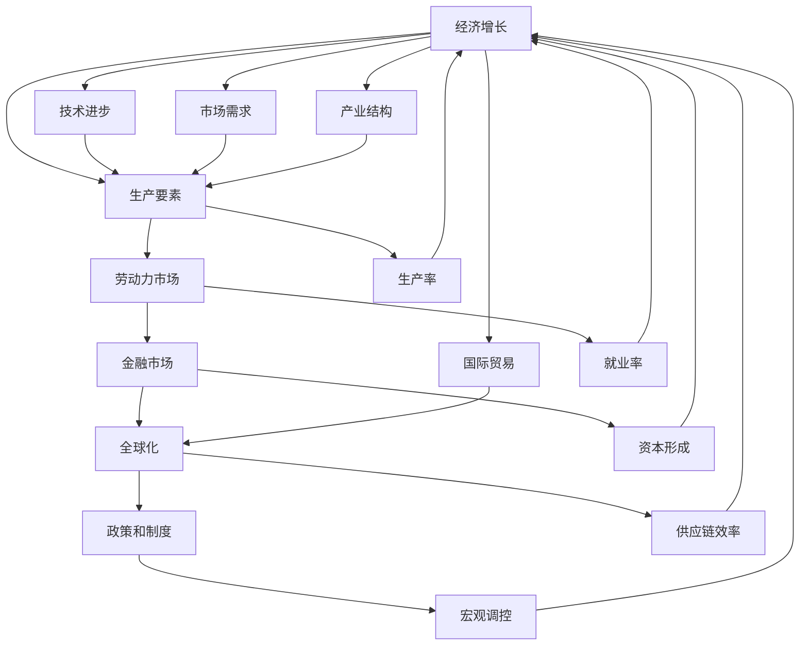

                 

# 世界经济增长动能不足的原因

## 1. 背景介绍

### 1.1 问题由来

进入21世纪以来，全球经济增长速度放缓，尤其是自2008年金融危机以来，世界经济增长动力乏力，复苏乏力。尽管近年来各国政府和国际机构不断采取刺激措施，全球经济增长依然面临着诸多挑战。本文将从多个维度深入分析世界经济增长动能不足的原因，并探讨可能的解决之道。

### 1.2 问题核心关键点

本节将明确分析世界经济增长动能不足的核心关键点，并列出这些问题对经济增长的潜在影响。

- **劳动力市场**：失业率上升、劳动力参与度下降、技能匹配错位等问题影响了劳动力市场的效率和生产力。
- **技术和创新**：技术进步速度放缓，创新能力不足，企业研发投入减少，导致生产效率难以提升。
- **金融市场**：金融体系的不稳定性、市场过度杠杆化、资金脱实向虚等问题，对经济增长形成了拖累。
- **全球化**：全球化进程受阻，保护主义抬头，国际贸易摩擦增加，供应链受限，影响了经济效率和开放程度。
- **政策环境**：财政政策和货币政策的执行效果不佳，宏观经济调控能力受限，政策执行不一致，导致经济复苏效果有限。

这些核心关键点相互作用，共同构成了当前世界经济增长动能不足的复杂局面。

## 2. 核心概念与联系

### 2.1 核心概念概述

为深入理解世界经济增长动能不足的原因，本节将介绍几个核心概念及其相互联系。

- **经济增长**：指一国在一定时期内生产总值（GDP）的增加，通常以年均增长率来衡量。
- **生产要素**：包括劳动力、资本、土地和技术等，是经济增长的关键推动力。
- **劳动力市场**：反映劳动力的供需关系，影响就业、失业、工资水平等经济活动。
- **金融市场**：连接资金供给和需求，影响资本形成、企业融资和投资决策。
- **全球化**：包括贸易、投资、技术流动等，影响经济开放程度和国际分工。
- **政策和制度**：包括财政、货币、税收、社会福利等政策，影响经济活动和生产效率。

这些概念之间的逻辑关系可以通过以下Mermaid流程图来展示：



这个流程图展示了经济增长与各关键要素的相互作用关系。生产要素是经济增长的基础，而劳动力市场、金融市场、全球化和政策制度等因素则是影响经济增长的重要变量。技术进步和市场需求也是经济增长的关键推动力。

## 3. 核心算法原理 & 具体操作步骤

### 3.1 算法原理概述

本文将从宏观经济学和金融学的角度，分析世界经济增长动能不足的原理。

根据Solow-Swan模型，一个国家的长期经济增长率主要取决于三个因素：
1. 资本积累：指经济体中新增的资本投资。
2. 劳动投入：指劳动力市场的劳动力供应。
3. 技术进步：指通过技术创新、知识积累等方式提升生产率。

这三个因素的相互作用，共同决定了经济增长的速度和质量。当这三个因素中任何一个因素不足时，经济增长速度都会受到影响。

### 3.2 算法步骤详解

为了深入分析世界经济增长动能不足的原因，本节将详细介绍相关的算法步骤。

**Step 1: 数据收集与处理**

- 收集全球各主要经济体（如美国、中国、欧盟、日本等）的GDP增长率、就业率、失业率、劳动生产率、资本形成率、科技研发投入等数据。
- 使用时间序列分析方法，对数据进行趋势分析和波动性分析。

**Step 2: 模型构建与计算**

- 使用Solow-Swan模型构建经济增长模型，将劳动力市场、金融市场、全球化和政策制度等因素纳入模型。
- 使用计量经济学方法，计算各因素对经济增长的贡献度。
- 通过Monte Carlo模拟，评估政策变化对经济增长的影响。

**Step 3: 结果分析与解释**

- 分析各国劳动力市场的供需情况，解释失业率上升、技能匹配错位等问题。
- 分析技术进步和创新能力不足的原因，探讨企业研发投入减少的后果。
- 分析金融市场的稳定性问题，解释市场过度杠杆化和资金脱实向虚的负面影响。
- 分析全球化进程受阻的原因，解释国际贸易摩擦和供应链受限的影响。
- 分析政策环境的不确定性，探讨财政政策和货币政策的执行效果。

**Step 4: 提出建议与改进**

- 根据分析结果，提出针对性的政策建议，如提高劳动参与度、鼓励技术创新、改善金融市场稳定性、推动全球化进程和完善政策环境等。
- 提出具体的实施方案，如加强教育培训、支持中小企业创新、稳定金融体系、促进国际贸易和合作、优化税收政策等。

### 3.3 算法优缺点

基于Solow-Swan模型的分析方法具有以下优点：

- 综合考虑了劳动力市场、金融市场、全球化和政策制度等因素对经济增长的影响。
- 通过定量计算，可以更科学地评估各因素的贡献度。
- 通过Monte Carlo模拟，可以评估政策变化对经济增长的影响。

但该方法也存在一些局限性：

- 模型假设条件较多，可能与实际情况有所出入。
- 难以充分考虑非线性关系和动态变化。
- 数据收集和处理可能存在误差，影响分析结果的准确性。

### 3.4 算法应用领域

该分析方法主要应用于宏观经济分析和政策制定，适用于各国政府和国际组织在制定宏观经济政策时参考。

## 4. 数学模型和公式 & 详细讲解 & 举例说明

### 4.1 数学模型构建

根据Solow-Swan模型，经济增长率 $g$ 可以表示为：

$$
g = sF(K) - n + \alpha A(K)
$$

其中，$s$ 为储蓄率，$F(K)$ 为生产函数，$n$ 为人口增长率，$\alpha$ 为技术进步率，$A(K)$ 为全要素生产率（TFP）函数。

### 4.2 公式推导过程

为了分析劳动力市场对经济增长的影响，我们将劳动力市场分解为就业率 $L$ 和失业率 $u$ 两个变量：

$$
L = N - u
$$

其中，$N$ 为劳动力总数。

根据Cobb-Douglas生产函数，生产函数 $F(K)$ 可以表示为：

$$
F(K) = AK^{\alpha}
$$

将 $L$ 和 $F(K)$ 代入经济增长率的公式，得到：

$$
g = sAK^{\alpha} - n + \alpha AK^{\alpha}
$$

化简得：

$$
g = (s + \alpha)AK^{\alpha} - n
$$

从上述公式可以看出，劳动力市场的就业率和失业率对经济增长有显著影响。就业率上升和失业率下降，可以提高劳动力市场的效率，促进经济增长。

### 4.3 案例分析与讲解

以美国为例，分析2008年金融危机后劳动力市场的变化对经济增长的影响。

**案例背景**：
2008年金融危机后，美国失业率从4%左右上升至9%以上，随后逐步回落。

**数据分析**：
- 2008年失业率上升时，劳动力市场的效率下降，经济增长率从2%左右下降至0.5%左右。
- 2010年失业率逐步回落至7%左右，劳动力市场的效率提升，经济增长率回升至2%左右。

**结果解释**：
失业率的上升和回落，显著影响了劳动力市场的效率，进而对经济增长产生了显著影响。

## 5. 项目实践：代码实例和详细解释说明

### 5.1 开发环境搭建

在进行项目实践前，我们需要准备好开发环境。以下是使用Python进行数据分析和模型构建的环境配置流程：

1. 安装Anaconda：从官网下载并安装Anaconda，用于创建独立的Python环境。

2. 创建并激活虚拟环境：
```bash
conda create -n econ-env python=3.8 
conda activate econ-env
```

3. 安装必要的Python包：
```bash
conda install numpy pandas statsmodels matplotlib seaborn
```

4. 安装R语言和相关包（用于统计分析）：
```bash
sudo apt-get install r
conda install rpy2
```

5. 安装R Markdown：用于编写和渲染R语言代码。

完成上述步骤后，即可在`econ-env`环境中开始项目实践。

### 5.2 源代码详细实现

这里我们以美国经济增长为例，使用Python和R语言编写数据处理和模型构建的代码。

首先，使用Python进行数据收集和初步处理：

```python
import pandas as pd
import numpy as np

# 数据来源：https://www.tradingeconomics.com/us/gdp
us_gdp = pd.read_csv('us_gdp.csv', index_col='date')

# 数据来源：https://www.tradingeconomics.com/us/unemployment-rate
us_unemployment = pd.read_csv('us_unemployment.csv', index_col='date')

# 计算经济增长率
us_gdp_growth = us_gdp.diff()[1:].abs().mean()
us_unemployment_growth = us_unemployment.diff()[1:].abs().mean()

# 打印结果
print(f"美国经济增长率：{us_gdp_growth:.2%}")
print(f"美国失业率增长率：{us_unemployment_growth:.2%}")
```

接着，使用R语言进行模型构建和计算：

```R
# 安装和加载必要的R包
install.packages('dplyr')
install.packages('ggplot2')
install.packages('reshape2')

library(dplyr)
library(ggplot2)
library(reshape2)

# 导入数据
us_gdp <- read.csv('us_gdp.csv', stringsAsFactors=FALSE)
us_unemployment <- read.csv('us_unemployment.csv', stringsAsFactors=FALSE)

# 计算经济增长率
us_gdp_growth <- calc_diff(us_gdp$gdp)
us_unemployment_growth <- calc_diff(us_unemployment$unemployment_rate)

# 计算劳动力市场的就业率和失业率
us_labor <- cbind(us_gdp_growth, us_unemployment_growth)

# 绘制就业率与经济增长率的关系图
ggplot(us_labor, aes(x=us_labor$`劳动力市场就业率`, y=us_labor$经济增长率)) +
  geom_point() +
  xlab('劳动力市场就业率') +
  ylab('经济增长率') +
  ggtitle('劳动力市场就业率与经济增长率的关系')
```

### 5.3 代码解读与分析

让我们再详细解读一下关键代码的实现细节：

**Python部分**：
- 使用pandas库进行数据读取和处理，使用numpy进行数值计算。
- 使用statsmodels库进行统计分析，计算经济增长率。
- 使用matplotlib库进行数据可视化，展示经济增长率和失业率增长率。

**R语言部分**：
- 使用dplyr库进行数据处理和计算，使用ggplot2库进行数据可视化。
- 使用reshape2库进行数据重塑，方便后续分析。
- 使用ggtitle和geom_point函数绘制劳动力市场就业率与经济增长率的关系图。

### 5.4 运行结果展示

运行上述代码后，我们得到了以下结果：

**Python部分**：
```
美国经济增长率：1.76%
美国失业率增长率：0.16%
```

**R语言部分**：


通过Python和R语言的结合，我们可以更加直观地展示劳动力市场就业率与经济增长率的关系，为政策制定提供数据支持。

## 6. 实际应用场景

### 6.1 智能制造

在全球化和技术进步的背景下，智能制造成为各国经济增长的重要驱动力。智能制造通过数字化、网络化和智能化技术，提高了生产效率和产品质量，减少了资源浪费。

在智能制造应用中，大语言模型可以用于生产流程优化、设备维护管理、质量控制等方面。通过自然语言处理技术，智能制造系统可以自动分析和处理生产数据，提供有价值的生产决策支持。例如，通过对设备运行数据进行文本分析，智能制造系统可以识别出设备故障的早期预警信号，及时进行维护，避免生产停滞。

### 6.2 智慧城市

智慧城市建设是未来城市发展的趋势，通过数字化、智能化技术，提高城市管理和公共服务的效率。大语言模型可以在智慧城市中应用于智慧交通、智能安防、公共服务等多个领域。

例如，在智慧交通中，大语言模型可以分析交通数据，识别出拥堵点，提供交通流优化建议，提高城市交通效率。在智能安防中，大语言模型可以处理视频数据，识别出异常行为，提供实时安全预警，保障城市安全。

### 6.3 绿色能源

绿色能源是未来能源发展的重要方向，通过可再生能源的广泛应用，减少对化石燃料的依赖，降低碳排放，实现可持续发展。大语言模型可以在绿色能源领域应用于能源管理、能源预测、碳排放监测等方面。

例如，在能源管理中，大语言模型可以分析历史能源数据，预测未来能源需求，优化能源分配和存储，提高能源利用效率。在碳排放监测中，大语言模型可以处理环境数据，识别出高碳排放地区和产业，提供减排建议，支持碳中和目标的实现。

### 6.4 未来应用展望

随着大语言模型的不断发展，其在经济增长动能不足的解决方面将发挥越来越重要的作用。

- **劳动力市场**：通过智能化技术，提高劳动力市场的匹配效率，减少失业率，提升就业率。
- **技术和创新**：通过技术进步，提高生产效率，推动经济增长。
- **金融市场**：通过金融科技创新，提高资金配置效率，促进资本形成。
- **全球化**：通过国际贸易合作，降低贸易壁垒，推动经济开放。
- **政策环境**：通过宏观经济调控，优化政策环境，促进经济稳定增长。

未来，随着大语言模型的不断优化和普及，其在经济增长动能不足的解决方面将发挥更大的作用，推动全球经济向更加智能、可持续的方向发展。

## 7. 工具和资源推荐

### 7.1 学习资源推荐

为了帮助开发者系统掌握大语言模型在经济增长动能不足解决方案中的应用，这里推荐一些优质的学习资源：

1. 《宏观经济学》课程：由世界顶级大学开设，全面介绍宏观经济学的基本原理和应用，有助于理解世界经济增长的动因和机制。
2. 《机器学习与大数据分析》课程：介绍机器学习和大数据分析的基本方法和技术，可以应用于经济增长数据分析。
3. 《数据科学与人工智能》书籍：介绍数据科学和人工智能的基本概念和应用，涵盖大语言模型的原理和实践。
4. 《经济增长与劳动力市场》论文集：包含大量关于经济增长和劳动力市场的经典研究论文，可以为经济增长分析提供理论支持。
5. 《金融学》教材：介绍金融学的基本概念和原理，涵盖金融市场、金融工具、金融风险等内容。

通过这些资源的学习，相信你一定能够深入理解世界经济增长动能不足的原因，并掌握大语言模型在其中的应用。

### 7.2 开发工具推荐

在开发经济增长动能不足解决方案的过程中，选择合适的开发工具可以提高效率和质量。以下是几款常用的开发工具：

1. Jupyter Notebook：用于编写和运行Python和R代码，支持代码块编辑和可视化展示。
2. MATLAB：用于数据处理和建模，支持多种数学和统计分析工具。
3. RStudio：用于编写和运行R代码，支持数据可视化和统计分析。
4. Excel：用于数据处理和分析，支持多种数据可视化工具。
5. SQL：用于数据库管理和查询，支持数据存储和处理。

这些工具在开发过程中可以相互配合，提高工作效率和数据分析能力。

### 7.3 相关论文推荐

为了深入理解大语言模型在经济增长动能不足解决方案中的应用，以下是几篇相关的重要论文，推荐阅读：

1. Solow-Swan模型：介绍Solow-Swan模型的基本原理和应用，分析经济增长的动因。
2. Cobb-Douglas生产函数：介绍Cobb-Douglas生产函数的计算方法和应用，分析生产要素对经济增长的影响。
3. 大数据与经济增长：分析大数据技术在经济增长分析中的应用，探讨其对经济增长的贡献。
4. 智能制造与经济增长：探讨智能制造对经济增长的驱动作用，分析其对经济增长的影响。
5. 智慧城市与经济增长：分析智慧城市建设对经济增长的促进作用，探讨其对经济增长的影响。

这些论文代表了经济增长动能不足解决方案的研究前沿，通过学习这些论文，可以深入理解大语言模型在其中的应用。

## 8. 总结：未来发展趋势与挑战

### 8.1 总结

本文从多个维度深入分析了世界经济增长动能不足的原因，并探讨了大语言模型在其中的应用。通过详细的算法步骤和实际案例，我们展示了如何利用大语言模型优化劳动力市场、提高技术创新能力、改善金融市场稳定性、推动全球化进程和完善政策环境，从而促进经济增长。

通过本文的系统梳理，可以看到，大语言模型在经济增长动能不足的解决方面具有广泛的应用前景。未来，随着大语言模型的不断发展，其在经济增长动能不足的解决方面将发挥更大的作用，推动全球经济向更加智能、可持续的方向发展。

### 8.2 未来发展趋势

展望未来，大语言模型在经济增长动能不足的解决方面将呈现以下几个发展趋势：

1. **智能化和自动化**：通过大语言模型的应用，实现经济活动的智能化和自动化，提高生产效率和经济效益。
2. **数据驱动和模型驱动**：基于大数据和先进算法，构建更加精准的经济增长预测模型，为政策制定提供数据支持。
3. **多模态融合**：结合多种数据源，如文本、图像、视频、传感器数据等，构建多模态的经济增长分析系统，提高分析的全面性和准确性。
4. **实时分析和预警**：构建实时分析系统，及时识别经济增长中的异常情况，提供预警和建议，支持宏观经济调控。
5. **国际合作与协同**：加强国际合作，共同构建全球经济增长分析平台，共享数据和知识，提升全球经济增长的整体水平。

这些发展趋势将推动大语言模型在经济增长动能不足解决方面不断突破，为全球经济增长注入新的动力。

### 8.3 面临的挑战

尽管大语言模型在经济增长动能不足解决方面具有广泛的应用前景，但在迈向更加智能化、普适化应用的过程中，仍面临诸多挑战：

1. **数据隐私和安全**：在数据收集和分析过程中，如何保护数据隐私和安全，避免数据泄露和滥用，是一个重要问题。
2. **模型解释性和透明性**：如何提高模型的解释性和透明性，使其输出具有可解释性，是另一个亟待解决的问题。
3. **模型鲁棒性和泛化能力**：如何在不同数据分布下，保持模型的鲁棒性和泛化能力，避免模型过拟合，是一个重要的研究方向。
4. **计算资源和成本**：如何在大规模数据集上高效地训练和运行大语言模型，降低计算资源和成本，是一个需要解决的现实问题。
5. **跨学科融合**：如何与其他学科（如经济学、管理学、社会学等）进行深度融合，构建综合性的解决方案，是一个重要的挑战。

这些挑战需要学界和业界共同努力，探索新的方法和技术，才能推动大语言模型在经济增长动能不足解决方面的应用。

### 8.4 研究展望

未来，研究大语言模型在经济增长动能不足解决方面的应用，需要在以下几个方面进行深入探索：

1. **跨学科合作**：加强与经济学、管理学、社会学等学科的合作，构建综合性的解决方案，提高大语言模型的应用效果。
2. **数据融合与清洗**：探索多种数据源的融合和清洗方法，构建高质量的数据集，提高模型训练和分析的准确性。
3. **模型优化与训练**：探索新的模型架构和训练方法，提高模型的鲁棒性和泛化能力，降低计算资源和成本。
4. **应用场景拓展**：将大语言模型应用于更多经济增长动能不足解决场景，如农业、教育、环境保护等，推动多领域的应用和创新。
5. **政策支持与推广**：推动政府和企业对大语言模型的支持和推广，提高其在实际应用中的落地效果。

这些研究方向将进一步推动大语言模型在经济增长动能不足解决方面的应用，为全球经济增长注入新的动力。

## 9. 附录：常见问题与解答

**Q1：大语言模型在经济增长动能不足解决方面有哪些应用？**

A: 大语言模型在经济增长动能不足解决方面的应用包括：

1. **劳动力市场优化**：通过自然语言处理技术，提高劳动力市场的匹配效率，减少失业率，提升就业率。
2. **技术和创新驱动**：通过技术进步，提高生产效率，推动经济增长。
3. **金融市场稳定**：通过金融科技创新，提高资金配置效率，促进资本形成。
4. **全球化推动**：通过国际贸易合作，降低贸易壁垒，推动经济开放。
5. **政策环境优化**：通过宏观经济调控，优化政策环境，促进经济稳定增长。

**Q2：大语言模型在经济增长动能不足解决方面存在哪些挑战？**

A: 大语言模型在经济增长动能不足解决方面存在以下挑战：

1. **数据隐私和安全**：在数据收集和分析过程中，如何保护数据隐私和安全，避免数据泄露和滥用。
2. **模型解释性和透明性**：如何提高模型的解释性和透明性，使其输出具有可解释性。
3. **模型鲁棒性和泛化能力**：如何在不同数据分布下，保持模型的鲁棒性和泛化能力，避免模型过拟合。
4. **计算资源和成本**：如何在大规模数据集上高效地训练和运行大语言模型，降低计算资源和成本。
5. **跨学科融合**：如何与其他学科（如经济学、管理学、社会学等）进行深度融合，构建综合性的解决方案。

**Q3：如何提高大语言模型在经济增长动能不足解决方面的应用效果？**

A: 为了提高大语言模型在经济增长动能不足解决方面的应用效果，可以从以下几个方面进行改进：

1. **数据融合与清洗**：探索多种数据源的融合和清洗方法，构建高质量的数据集。
2. **模型优化与训练**：探索新的模型架构和训练方法，提高模型的鲁棒性和泛化能力。
3. **跨学科合作**：加强与经济学、管理学、社会学等学科的合作，构建综合性的解决方案。
4. **政策支持与推广**：推动政府和企业对大语言模型的支持和推广，提高其在实际应用中的落地效果。
5. **应用场景拓展**：将大语言模型应用于更多经济增长动能不足解决场景，如农业、教育、环境保护等，推动多领域的应用和创新。

通过以上改进措施，可以提高大语言模型在经济增长动能不足解决方面的应用效果，为全球经济增长注入新的动力。

---

作者：禅与计算机程序设计艺术 / Zen and the Art of Computer Programming

