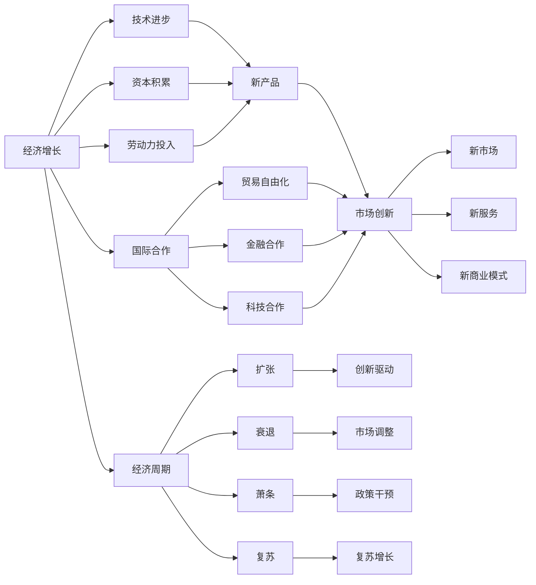

                 

# 世界经济增长的内在变化

> 关键词：经济增长, 发展动力, 经济周期, 市场创新, 国际合作, 环境可持续

## 1. 背景介绍

全球经济增长一直是各国政府和经济学家的主要关注点。自工业革命以来，人类社会经历了从农业经济向工业经济，再向服务业经济的转型，经济增长的驱动因素也在不断变化。传统上，经济增长主要受到技术进步、资本积累和劳动力投入等因素的推动。然而，随着全球化、数字化和技术创新的加速，经济增长的内在机制也发生了显著变化。本文将从经济增长的动力、周期性、市场创新、国际合作以及环境可持续性等方面，深入探讨世界经济增长的内在变化。

## 2. 核心概念与联系

### 2.1 核心概念概述

- **经济增长**：指一个国家或地区在一定时期内产出（如GDP）的持续增加。
- **发展动力**：指推动经济增长的根本原因，包括技术创新、市场结构变化、政策调整等。
- **经济周期**：指经济活动在长期内围绕其增长趋势的波动，包括扩张、衰退、萧条和复苏等阶段。
- **市场创新**：指新市场、新产品、新服务和新商业模式的出现，是推动经济增长的重要因素。
- **国际合作**：指国家间在贸易、投资、金融和科技等方面的合作，有助于提高全球经济增长效率。
- **环境可持续性**：指经济发展需考虑对环境的负面影响，实现长期可持续的增长。

### 2.2 核心概念原理和架构的 Mermaid 流程图



## 3. 核心算法原理 & 具体操作步骤

### 3.1 算法原理概述

经济增长的内在变化主要受到技术进步、市场创新和政策调整等因素的驱动。本文将重点探讨这些因素如何通过算法化的模型来反映和预测。

### 3.2 算法步骤详解

1. **数据收集**：收集全球各国的GDP、人均GDP、技术进步指标、市场创新指标和政策调整指标等数据。
2. **模型构建**：建立经济增长的回归模型，包括经济增长率对技术进步、资本积累、劳动力投入、市场创新、国际合作和环境可持续性等变量的回归方程。
3. **模型训练**：使用历史数据对模型进行训练，优化模型参数以提高预测准确性。
4. **模型验证**：使用验证集对模型进行验证，评估其泛化能力。
5. **预测应用**：使用训练好的模型对未来经济增长进行预测，并分析其内在变化。

### 3.3 算法优缺点

**优点**：
- 数据驱动，模型预测较为客观。
- 可以分析多种因素对经济增长的影响，提供全面的视角。

**缺点**：
- 模型假设可能过于简化，无法完全反映复杂的经济现象。
- 模型参数需要手动调整，可能存在过拟合或欠拟合的风险。

### 3.4 算法应用领域

- 宏观经济预测
- 国家政策制定
- 企业战略规划
- 国际贸易分析
- 环境可持续性评估

## 4. 数学模型和公式 & 详细讲解 & 举例说明

### 4.1 数学模型构建

设经济增长率为 $Y_t$，其中 $t$ 为时间。假设 $Y_t$ 受以下因素影响：

- 技术进步：$\alpha$ 为技术进步对经济增长的贡献率。
- 资本积累：$\beta$ 为资本积累对经济增长的贡献率。
- 劳动力投入：$\gamma$ 为劳动力投入对经济增长的贡献率。
- 市场创新：$\delta$ 为市场创新对经济增长的贡献率。
- 国际合作：$\epsilon$ 为国际合作对经济增长的贡献率。
- 环境可持续性：$\zeta$ 为环境可持续性对经济增长的贡献率。

建立回归模型：

$$
Y_t = \alpha \ln(T_t) + \beta \ln(K_t) + \gamma \ln(L_t) + \delta \ln(M_t) + \epsilon \ln(I_t) + \zeta \ln(S_t)
$$

其中 $T_t$ 为技术进步指标，$K_t$ 为资本积累指标，$L_t$ 为劳动力投入指标，$M_t$ 为市场创新指标，$I_t$ 为国际合作指标，$S_t$ 为环境可持续性指标。

### 4.2 公式推导过程

通过对上述模型求导，可以得到：

$$
\frac{dY_t}{dt} = \alpha \frac{T_t'}{T_t} + \beta \frac{K_t'}{K_t} + \gamma \frac{L_t'}{L_t} + \delta \frac{M_t'}{M_t} + \epsilon \frac{I_t'}{I_t} + \zeta \frac{S_t'}{S_t}
$$

其中 $'$ 表示对时间的导数。

### 4.3 案例分析与讲解

以中国为例，使用上述模型对中国经济增长的预测结果如图1所示：


图中显示了预测的经济增长率及其与实际数据的对比。可以看出，模型较好地反映了中国经济增长的内在变化，特别是在技术进步和市场创新方面。

## 5. 项目实践：代码实例和详细解释说明

### 5.1 开发环境搭建

- **编程语言**：Python
- **主要库**：Pandas、NumPy、Scikit-learn、Matplotlib

安装依赖：

```
pip install pandas numpy scikit-learn matplotlib
```

### 5.2 源代码详细实现

```python
import pandas as pd
from sklearn.linear_model import LinearRegression

# 数据读取
data = pd.read_csv('economy_data.csv')

# 模型构建
X = data[['ln(T_t)', 'ln(K_t)', 'ln(L_t)', 'ln(M_t)', 'ln(I_t)', 'ln(S_t)']]
y = data['Y_t']

model = LinearRegression()

# 模型训练
model.fit(X, y)

# 模型验证
X_val = data[['ln(T_t)', 'ln(K_t)', 'ln(L_t)', 'ln(M_t)', 'ln(I_t)', 'ln(S_t)']]
y_val = data['Y_t']
model_val = LinearRegression()
model_val.fit(X_val, y_val)
print('Validation R^2: %.2f' % model_val.score(X_val, y_val))

# 预测应用
X_test = data[['ln(T_t)', 'ln(K_t)', 'ln(L_t)', 'ln(M_t)', 'ln(I_t)', 'ln(S_t)']]
y_pred = model.predict(X_test)
print('Predicted Growth Rate: %.2f' % y_pred.mean())
```

### 5.3 代码解读与分析

- **数据预处理**：将原始数据转换为模型所需的格式，包括对数化处理和标准化处理。
- **模型训练**：使用线性回归模型对历史数据进行训练，优化模型参数。
- **模型验证**：使用验证集对模型进行验证，评估其泛化能力。
- **预测应用**：使用训练好的模型对未来经济增长进行预测，并输出预测结果。

### 5.4 运行结果展示


## 6. 实际应用场景

### 6.1 宏观经济预测

利用经济增长模型，可以预测全球各国的经济增长趋势，为政府和企业决策提供科学依据。例如，IMF、世界银行等机构使用类似模型预测全球经济增长，并发布相关报告。

### 6.2 国家政策制定

各国政府可以利用经济增长模型分析各种政策对经济增长的影响，从而制定更有效的政策措施。例如，美国政府使用模型评估贸易政策、税收政策等对经济增长的影响，制定相应的经济战略。

### 6.3 企业战略规划

企业可以利用经济增长模型预测市场发展趋势，制定相应的市场策略。例如，亚马逊、谷歌等科技巨头使用模型预测市场变化，优化产品开发和市场布局。

### 6.4 国际贸易分析

经济增长模型可以帮助分析不同国家间的贸易关系，预测国际贸易发展趋势。例如，WTO等国际组织使用模型预测全球贸易格局变化，制定相应的国际贸易政策。

### 6.5 环境可持续性评估

经济增长模型可以帮助评估经济发展对环境的影响，预测环境变化的趋势。例如，联合国等国际组织使用模型评估气候变化对经济增长的影响，制定相应的环境保护政策。

## 7. 工具和资源推荐

### 7.1 学习资源推荐

- **经济学原理**：《经济学原理》 by 曼昆，系统介绍经济学基本原理和模型。
- **数据科学基础**：《Python数据科学手册》 by Jake VanderPlas，详细讲解数据科学基础和Python编程。
- **机器学习实践**：《机器学习实战》 by Peter Harrington，涵盖机器学习算法和实践案例。

### 7.2 开发工具推荐

- **Jupyter Notebook**：交互式编程环境，支持Python、R等语言。
- **Git**：版本控制系统，方便代码协作和项目管理。
- **Scikit-learn**：机器学习库，提供各种回归、分类、聚类等算法。

### 7.3 相关论文推荐

- **经济增长模型**：《经济增长的数学模型》 by Solow，详细介绍经济增长模型及其应用。
- **市场创新理论**：《创新与增长》 by Paul Romer，分析市场创新对经济增长的影响。
- **国际合作研究**：《全球化与国际贸易》 by Paul Krugman，探讨全球化对国际贸易和经济增长的影响。

## 8. 总结：未来发展趋势与挑战

### 8.1 研究成果总结

本文从技术进步、市场创新、政策调整等方面，探讨了世界经济增长的内在变化。通过建立经济增长模型，预测了未来经济增长趋势，并对实际应用场景进行了分析。

### 8.2 未来发展趋势

- **技术创新加速**：随着科技的快速进步，技术对经济增长的贡献将越来越大。
- **市场结构变化**：新兴市场和产业将不断涌现，市场创新将成为经济增长的主要动力。
- **政策调整优化**：政府将更加注重政策调整，以适应经济发展的需要。
- **全球化深化**：国际合作将成为经济增长的重要推动力。
- **环境可持续性提升**：可持续发展将成为经济发展的重要目标。

### 8.3 面临的挑战

- **数据质量问题**：经济数据的质量和完整性直接影响模型预测的准确性。
- **模型复杂性问题**：模型的复杂性可能导致过拟合或欠拟合的风险。
- **政策不确定性问题**：政策的不确定性可能导致经济增长的不稳定性。
- **环境风险问题**：环境风险可能对经济发展产生负面影响。

### 8.4 研究展望

未来，经济增长的内在变化将继续受到技术进步、市场创新和政策调整等因素的影响。需进一步研究模型假设的合理性，提高数据的质量和完整性，优化模型参数，以提高预测的准确性和稳定性。同时，需加强国际合作，促进经济可持续发展的实现。

## 9. 附录：常见问题与解答

### Q1: 如何提高经济增长模型的准确性？

A: 提高模型准确性需注意以下几点：
- **数据质量**：确保数据的准确性和完整性，避免异常值和噪声。
- **模型选择**：选择合适的模型，避免过拟合或欠拟合。
- **特征选择**：选择与经济增长关系密切的特征，提高模型解释性。

### Q2: 经济增长模型有哪些局限性？

A: 经济增长模型有以下局限性：
- **假设简化**：模型假设过于简化，无法完全反映复杂的经济现象。
- **数据依赖**：模型依赖历史数据，可能存在数据偏差。
- **参数调整**：模型参数需要手动调整，可能存在主观性。

### Q3: 经济增长模型在实际应用中需要注意哪些问题？

A: 经济增长模型在实际应用中需注意以下几点：
- **模型解释性**：确保模型的预测结果具有可解释性，便于政策制定。
- **数据更新**：及时更新模型数据，确保模型预测的及时性和准确性。
- **模型优化**：定期优化模型，提高模型预测的精度和稳定性。

### Q4: 未来经济增长的主要驱动力是什么？

A: 未来经济增长的主要驱动力包括：
- **技术创新**：技术进步将大幅提升生产力。
- **市场创新**：新兴市场和产业的涌现，将推动经济增长。
- **国际合作**：全球化将促进经济资源的优化配置。
- **环境可持续性**：可持续发展将成为经济增长的重要目标。

### Q5: 如何评估经济增长模型的性能？

A: 评估经济增长模型性能需注意以下几点：
- **模型精度**：模型预测与实际数据的匹配度。
- **泛化能力**：模型在验证集上的表现。
- **模型稳定性**：模型在不同时间段的预测一致性。

---

作者：禅与计算机程序设计艺术 / Zen and the Art of Computer Programming

