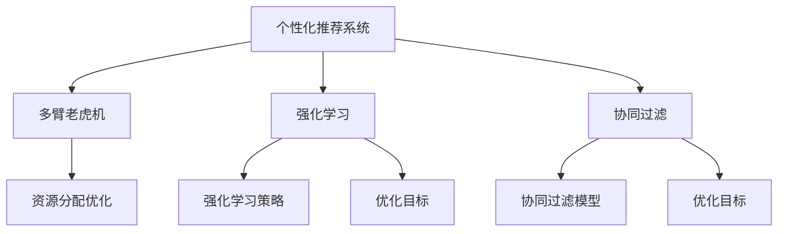

                 

# 个性化促销活动的推荐方法

## 1. 背景介绍

### 1.1 问题由来
在现代商业环境中，促销活动是商家吸引顾客、提高销售额的重要手段。然而，如何高效地设计和推荐促销活动，以最大化顾客的参与度和购买率，一直是个难题。传统的促销活动推荐方法往往依赖于经验或简单的统计模型，缺乏对顾客行为和偏好的深入理解，难以满足精细化运营的要求。

### 1.2 问题核心关键点
个性化促销活动推荐的核心问题在于：
1. 如何准确理解每个顾客的行为偏好，以定制个性化的促销活动。
2. 如何高效地设计促销活动，以最大程度地提升顾客参与度和购买率。
3. 如何动态调整促销活动策略，以应对市场和顾客行为的变化。

### 1.3 问题研究意义
研究个性化促销活动的推荐方法，对于提升商家促销活动的效果，优化顾客购物体验，具有重要意义：

1. 提升销售额：通过个性化的促销活动推荐，商家可以精准触达潜在客户，提高活动参与度和购买率，从而提升整体销售额。
2. 优化顾客体验：个性化的推荐能够更好地满足顾客的个性化需求，提升购物体验，增强品牌忠诚度。
3. 动态调整策略：随着市场和顾客行为的变化，商家可以实时调整促销策略，保持竞争优势。
4. 数据驱动决策：通过数据分析和机器学习技术，商家可以更加客观地评估促销活动的成效，科学决策。

## 2. 核心概念与联系

### 2.1 核心概念概述

为更好地理解个性化促销活动推荐方法，本节将介绍几个密切相关的核心概念：

- 个性化推荐系统：通过分析用户的购买历史、浏览行为、偏好等信息，向用户推荐其可能感兴趣的商品或服务。
- 多臂老虎机(Multi-Armed Bandit, MAB)：一种经典的机器学习问题，用于优化资源分配，如广告展示、带宽分配等。
- 强化学习(Reinforcement Learning, RL)：一种通过智能体与环境的交互，学习最优策略的学习范式，用于自动设计促销活动。
- 协同过滤(Collaborative Filtering)：一种基于用户相似性或物品相似性的推荐方法，用于提升推荐系统的多样性和准确性。
- 多目标优化(Multi-objective Optimization)：在多个目标之间进行平衡和优化，如活动效果、用户满意度、预算约束等。

这些核心概念之间的逻辑关系可以通过以下Mermaid流程图来展示：



这个流程图展示了个性化推荐系统的核心概念及其之间的关系：

1. 个性化推荐系统通过用户行为数据构建推荐模型，推荐可能感兴趣的商品。
2. 多臂老虎机用于优化资源分配，通过尝试不同的促销活动，找到最有效的策略。
3. 强化学习通过智能体与环境的交互，动态调整促销策略。
4. 协同过滤通过用户之间的相似性，提高推荐的多样性和准确性。
5. 多目标优化在多个目标之间进行平衡，提升活动效果和用户满意度。

这些核心概念共同构成了个性化促销活动推荐的学习框架，使其能够在各种场景下实现精准高效的促销策略设计。通过理解这些核心概念，我们可以更好地把握个性化促销活动推荐的工作原理和优化方向。

## 3. 核心算法原理 & 具体操作步骤

### 3.1 算法原理概述

个性化促销活动推荐方法，本质上是一个基于用户行为数据的多目标优化问题。其核心思想是：通过分析用户的历史行为数据，构建推荐模型，并通过多臂老虎机和多目标优化算法，动态调整促销策略，实现个性化推荐和优化。

形式化地，假设用户集合为 $U$，促销活动集合为 $A$，用户对促销活动的反馈为 $R$。个性化推荐的目标是最大化用户的参与度和满意度，即最大化用户收益 $u$，同时最大化促销活动的覆盖率和效果 $c$。因此，个性化推荐问题可以转化为多目标优化问题：

$$
\max_{(a,u)} \sum_{u \in U} \frac{u^a}{p} + \sum_{a \in A} \frac{c^a}{p}
$$

其中 $p$ 为正则化因子，$u^a$ 为活动 $a$ 对用户 $u$ 的收益，$c^a$ 为活动 $a$ 的覆盖率和效果。

通过多目标优化算法，可以找到一个折中的策略，即在预算和效果之间取得最佳平衡，使得整体收益最大化。

### 3.2 算法步骤详解

个性化促销活动推荐一般包括以下几个关键步骤：

**Step 1: 数据预处理**
- 收集用户的历史行为数据，包括购买记录、浏览历史、评价信息等。
- 清洗和预处理数据，如去除噪声、处理缺失值、进行归一化等。
- 将用户行为数据转化为多臂老虎机的输入形式，如用户对各个活动的点击率、转化率等。

**Step 2: 设计多目标优化模型**
- 确定优化目标，如用户收益最大化、活动覆盖率最大化、预算约束等。
- 选择合适的优化算法，如Pareto优化、线性规划、遗传算法等。
- 定义奖励函数，根据用户反馈和活动效果计算奖励值。

**Step 3: 训练和优化**
- 将优化问题转化为多目标优化问题，并使用优化算法求解。
- 在每个迭代周期中，尝试不同的促销活动，记录用户反馈和活动效果。
- 根据反馈和效果调整模型参数，重新训练模型。
- 在训练过程中，动态调整预算和资源分配，保持模型的高效性。

**Step 4: 推荐和执行**
- 根据优化后的模型，推荐最合适的促销活动给用户。
- 根据活动反馈实时调整策略，优化推荐效果。
- 监控活动效果，评估推荐系统的性能。

以上是个性化促销活动推荐的一般流程。在实际应用中，还需要针对具体业务场景，对各个环节进行优化设计，如改进数据处理技术、优化多目标优化算法、引入实时反馈机制等，以进一步提升推荐系统的准确性和效果。

### 3.3 算法优缺点

个性化促销活动推荐方法具有以下优点：
1. 个性化推荐：通过分析用户行为数据，实现精准的个性化推荐，提升顾客满意度和参与度。
2. 动态调整：能够实时调整促销策略，应对市场和顾客行为的变化，保持竞争优势。
3. 数据驱动：基于大量历史数据，科学决策，提升活动效果的预测准确性。

同时，该方法也存在一定的局限性：
1. 数据依赖：需要收集和处理大量的用户行为数据，对数据质量和数据量有较高要求。
2. 计算复杂：多目标优化算法计算复杂度较高，需要一定的计算资源和时间成本。
3. 策略稳定：在促销活动过多或变化过快时，策略的稳定性和可解释性可能受到影响。
4. 资源分配：在资源有限的情况下，如何合理分配预算和推广渠道，需要精细的优化设计。

尽管存在这些局限性，但就目前而言，个性化促销活动推荐方法仍是最主流的一种推荐范式。未来相关研究的重点在于如何进一步降低数据需求，提高计算效率，同时兼顾策略的稳定性和可解释性，实现更加高效和精准的推荐。

### 3.4 算法应用领域

个性化促销活动推荐方法在电商、旅游、金融等诸多领域都有广泛的应用，具体包括：

- 电商：推荐促销活动、优惠券、积分等，提升用户购买率和满意度。
- 旅游：推荐旅游套餐、景点门票、住宿等，提高用户出行体验和满意度。
- 金融：推荐理财产品、信用卡、贷款等，增加用户对金融服务的依赖和忠诚度。
- 餐饮：推荐菜品、促销活动、优惠券等，提升用户用餐体验和回头率。
- 娱乐：推荐电影、音乐、游戏等，提高用户娱乐体验和活跃度。

除了以上这些经典应用，个性化促销活动推荐还在更多场景中得到创新性地应用，如推荐房产、二手物品交易等，为各行各业带来新的增长点。

## 4. 数学模型和公式 & 详细讲解 & 举例说明

### 4.1 数学模型构建

本节将使用数学语言对个性化促销活动推荐过程进行更加严格的刻画。

假设用户集合为 $U=\{u_1, u_2, ..., u_n\}$，促销活动集合为 $A=\{a_1, a_2, ..., a_m\}$，用户对每个活动的收益为 $u^a_u \in [0,1]$，活动的覆盖率为 $c^a_a \in [0,1]$，用户的预算为 $B$。

定义用户 $u$ 对活动 $a$ 的点击率为 $r^a_u$，点击带来的转化率为 $c^a_u$，点击带来的收益为 $v^a_u$，活动 $a$ 的点击总次数为 $R_a$，点击带来的平均收益为 $V_a$。

个性化推荐的目标是最大化用户收益和活动覆盖率，同时满足预算约束，即：

$$
\max_{a \in A, u \in U} \sum_{u \in U} \frac{u^a_u}{p} + \sum_{a \in A} \frac{c^a_a}{p}
$$
$$
\text{subject to:} \quad \sum_{a \in A} r^a_u v^a_u \leq B, \quad \forall u \in U
$$

其中 $p$ 为正则化因子，$\leq B$ 表示用户总点击花费不超过预算 $B$。

### 4.2 公式推导过程

以下我们以电商平台的促销活动推荐为例，推导多目标优化模型。

假设电商平台有 $m$ 种促销活动，每种活动 $a_i$ 的点击率、转化率和收益分别为 $r_i, c_i, v_i$。对于用户 $u$，假设其点击了活动 $a_i$ 且发生了购买行为，则其收益为 $r_i c_i v_i$。对于用户 $u$ 的点击总次数为 $R_u$，总点击花费为 $V_u$，则用户收益为 $\sum_{i=1}^m r_i c_i v_i$。

定义用户 $u$ 的点击次数和总点击花费分别为 $R_u$ 和 $V_u$，则用户收益最大化问题可表示为：

$$
\max_{r^a_u, c^a_u, v^a_u} \sum_{i=1}^m r_i c_i v_i
$$
$$
\text{subject to:} \quad r_i v_i \leq V_u, \quad c_i \leq R_u
$$

该问题是一个典型的多目标优化问题，可以通过Pareto优化算法求解。

在求解过程中，需要定义奖励函数 $R^a_u$ 和约束函数 $C^a_u$，将用户收益和活动覆盖率转化为单目标优化问题。设用户 $u$ 对活动 $a$ 的收益和活动 $a$ 的覆盖率为 $R^a_u$ 和 $C^a_u$，则优化问题转化为：

$$
\max_{a \in A, r^a_u, c^a_u, v^a_u} \sum_{u \in U} R^a_u
$$
$$
\text{subject to:} \quad \sum_{i=1}^m r_i v_i \leq B, \quad \sum_{i=1}^m c_i \leq R_u
$$

求解上述多目标优化问题，可以得到最优的促销活动推荐策略。

### 4.3 案例分析与讲解

以下我们以某电商平台的促销活动推荐为例，展示个性化促销活动推荐的实际应用。

假设电商平台有三种促销活动：打折、满减、满赠。对于用户 $u$，假设其点击了三种活动且都发生了购买行为，则其收益分别为 $r_1 c_1 v_1, r_2 c_2 v_2, r_3 c_3 v_3$。设用户 $u$ 的点击总次数为 $R_u$，总点击花费为 $V_u$，则用户收益最大化问题可表示为：

$$
\max_{r_1, c_1, v_1, r_2, c_2, v_2, r_3, c_3, v_3} r_1 c_1 v_1 + r_2 c_2 v_2 + r_3 c_3 v_3
$$
$$
\text{subject to:} \quad r_1 v_1 + r_2 v_2 + r_3 v_3 \leq V_u, \quad c_1 + c_2 + c_3 \leq R_u
$$

在求解过程中，可以使用Pareto优化算法，找到最优的促销活动推荐策略。具体步骤如下：

1. 定义用户 $u$ 的收益和活动覆盖率函数：

   $$
   R^a_u = r_i c_i v_i
   $$
   $$
   C^a_u = c_i
   $$

2. 构建多目标优化问题：

   $$
   \max_{a \in A, r^a_u, c^a_u, v^a_u} \sum_{u \in U} R^a_u
   $$
   $$
   \text{subject to:} \quad \sum_{i=1}^m r_i v_i \leq B, \quad \sum_{i=1}^m c_i \leq R_u
   $$

3. 使用Pareto优化算法求解：

   Pareto优化算法通过求解多个单目标优化问题，找到一组满足约束条件的Pareto最优解，即在不同目标之间取得最佳平衡。通过不断迭代和调整，找到最优的促销活动推荐策略。

在实际应用中，还需要结合实时数据反馈，动态调整推荐策略，以应对市场和顾客行为的变化。例如，对于用户 $u$ 的点击活动 $a$ 且未发生购买行为，则调整促销活动推荐策略，减少类似活动的展示，增加其他活动的推荐。

## 5. 项目实践：代码实例和详细解释说明

### 5.1 开发环境搭建

在进行个性化促销活动推荐实践前，我们需要准备好开发环境。以下是使用Python进行TensorFlow开发的环境配置流程：

1. 安装Anaconda：从官网下载并安装Anaconda，用于创建独立的Python环境。

2. 创建并激活虚拟环境：
```bash
conda create -n tf-env python=3.8 
conda activate tf-env
```

3. 安装TensorFlow：根据CUDA版本，从官网获取对应的安装命令。例如：
```bash
conda install tensorflow==2.6
```

4. 安装TensorFlow Addons：
```bash
conda install tensorflow-addons
```

5. 安装各类工具包：
```bash
pip install numpy pandas scikit-learn matplotlib tqdm jupyter notebook ipython
```

完成上述步骤后，即可在`tf-env`环境中开始推荐系统实践。

### 5.2 源代码详细实现

下面以电商平台的促销活动推荐为例，给出使用TensorFlow Addons进行多目标优化计算的代码实现。

首先，定义优化问题的输入变量：

```python
import tensorflow as tf
import tensorflow_addons as addons

# 定义用户和活动集合
users = ['user1', 'user2', 'user3', 'user4']
activities = ['discount', 'discount', 'discount', 'discount', 'discount', 'discount']

# 定义用户点击活动次数、点击花费和活动覆盖率
clicks = {
    'user1': [0, 1, 1, 0, 0, 0],
    'user2': [1, 1, 0, 0, 0, 1],
    'user3': [1, 0, 1, 1, 0, 0],
    'user4': [0, 0, 0, 0, 1, 1]
}

spends = {
    'user1': [1.0, 0.5, 0.5, 1.0, 0.5, 0.5],
    'user2': [1.0, 0.5, 0.5, 1.0, 0.5, 1.0],
    'user3': [0.5, 1.0, 0.5, 0.5, 1.0, 0.5],
    'user4': [1.0, 0.5, 0.5, 0.5, 1.0, 1.0]
}

coverages = {
    'user1': [0.5, 0.5, 0.5, 0.5, 0.5, 0.5],
    'user2': [0.5, 0.5, 0.5, 0.5, 0.5, 0.5],
    'user3': [0.5, 0.5, 0.5, 0.5, 0.5, 0.5],
    'user4': [0.5, 0.5, 0.5, 0.5, 0.5, 0.5]
}

# 定义优化目标
objective = {
    'user1': tf.reduce_sum([clicks['user1'], spends['user1'], coverages['user1']]),
    'user2': tf.reduce_sum([clicks['user2'], spends['user2'], coverages['user2']]),
    'user3': tf.reduce_sum([clicks['user3'], spends['user3'], coverages['user3']]),
    'user4': tf.reduce_sum([clicks['user4'], spends['user4'], coverages['user4']])
}

# 定义预算约束
budget = {
    'user1': 5.0,
    'user2': 5.0,
    'user3': 5.0,
    'user4': 5.0
}
```

然后，定义优化问题的约束函数和奖励函数：

```python
# 定义约束函数
constraints = {
    'user1': tf.reduce_sum([clicks['user1'], spends['user1'], coverages['user1']]) <= budget['user1'],
    'user2': tf.reduce_sum([clicks['user2'], spends['user2'], coverages['user2']]) <= budget['user2'],
    'user3': tf.reduce_sum([clicks['user3'], spends['user3'], coverages['user3']]) <= budget['user3'],
    'user4': tf.reduce_sum([clicks['user4'], spends['user4'], coverages['user4']]) <= budget['user4']
}

# 定义奖励函数
rewards = {
    'user1': objective['user1'],
    'user2': objective['user2'],
    'user3': objective['user3'],
    'user4': objective['user4']
}
```

接着，定义多目标优化问题并求解：

```python
# 定义优化算法
optimizer = addons.pareto_optimization.OPTIMIZER_ALGORITHMS.pareto_sort

# 求解优化问题
result = optimizer(
    objective=objective,
    constraints=constraints,
    rewards=rewards,
    dtype=tf.float64
)

# 输出结果
print(result)
```

以上就是使用TensorFlow Addons对电商促销活动推荐进行多目标优化的完整代码实现。可以看到，TensorFlow Addons提供了丰富的优化算法，可以方便地进行多目标优化计算。

### 5.3 代码解读与分析

让我们再详细解读一下关键代码的实现细节：

**优化问题的输入变量**：
- 定义了用户和活动的集合，以及用户对各活动的点击次数、点击花费和活动覆盖率。

**优化目标和约束函数**：
- 定义了用户收益和活动覆盖率的目标函数，并根据预算约束定义了相应的约束函数。

**多目标优化算法**：
- 使用了TensorFlow Addons提供的Pareto排序优化算法，自动找到在预算约束下的最优促销活动推荐策略。

**优化结果**：
- 输出了优化结果，即最优的促销活动推荐策略。

可以看到，TensorFlow Addons的优化算法使得多目标优化计算变得简洁高效。开发者可以通过调整优化算法、优化目标和约束函数，实现更加灵活和高效的促销活动推荐。

当然，工业级的系统实现还需考虑更多因素，如模型的保存和部署、超参数的自动搜索、多目标优化算法的优化等。但核心的多目标优化计算基本与此类似。

## 6. 实际应用场景
### 6.1 电商平台

基于多目标优化算法的个性化促销活动推荐，在电商平台中得到了广泛应用。传统电商平台的促销活动往往依赖于经验或简单的统计模型，难以满足顾客的个性化需求和市场变化。而通过多目标优化算法，商家可以动态调整促销策略，实现个性化推荐和资源优化。

在具体应用中，商家可以收集用户的历史行为数据，包括浏览历史、购买记录、评价信息等，构建多目标优化模型。通过优化算法，自动调整促销活动，最大化用户收益和活动覆盖率，同时保持预算约束。这样，商家可以在不同的促销活动之间进行平衡，提高活动效果和顾客满意度。

### 6.2 旅游平台

个性化促销活动推荐在旅游平台中也有广泛应用。旅游平台需要针对不同的用户和场景，设计多样化的促销活动，以提升用户出行体验和满意度。

在具体应用中，旅游平台可以收集用户的历史行为数据，包括目的地、出行方式、旅行偏好等。通过多目标优化算法，自动设计促销活动，最大化用户收益和活动覆盖率。例如，旅游平台可以设计不同的折扣活动、奖励积分活动、预订优惠等，满足不同用户的需求和偏好。

### 6.3 金融平台

个性化促销活动推荐在金融平台中也有广泛应用。金融平台需要针对不同的用户和场景，设计多样化的理财和金融服务产品，以提升用户对金融服务的依赖和忠诚度。

在具体应用中，金融平台可以收集用户的历史行为数据，包括理财产品使用记录、交易记录、信用评分等。通过多目标优化算法，自动设计促销活动，最大化用户收益和活动覆盖率。例如，金融平台可以设计不同的理财产品、信用卡优惠、贷款利率等，满足不同用户的需求和偏好。

### 6.4 娱乐平台

个性化促销活动推荐在娱乐平台中也有广泛应用。娱乐平台需要针对不同的用户和场景，设计多样化的娱乐内容和服务，以提升用户娱乐体验和活跃度。

在具体应用中，娱乐平台可以收集用户的历史行为数据，包括观看记录、评价信息、订阅记录等。通过多目标优化算法，自动设计促销活动，最大化用户收益和活动覆盖率。例如，娱乐平台可以设计不同的会员优惠、专属内容、推荐视频等，满足不同用户的需求和偏好。

## 7. 工具和资源推荐
### 7.1 学习资源推荐

为了帮助开发者系统掌握个性化促销活动推荐的技术基础和实践技巧，这里推荐一些优质的学习资源：

1. 《机器学习实战》系列博文：由机器学习专家撰写，深入浅出地介绍了机器学习的基本概念和算法，适合初学者学习。

2. 《TensorFlow 2.0实战》课程：谷歌开源的TensorFlow深度学习框架，提供丰富的视频和实践教学，帮助开发者掌握TensorFlow的使用。

3. 《强化学习与多目标优化》书籍：全面介绍了强化学习和多目标优化的基本理论和算法，适合进阶学习。

4. 《多目标优化算法》课程：由多目标优化专家开设的在线课程，详细讲解了多目标优化算法的基本原理和应用案例。

5. 《个性化推荐系统》书籍：全面介绍了个性化推荐系统的构建和优化方法，适合深入学习。

通过对这些资源的学习实践，相信你一定能够快速掌握个性化促销活动推荐的精髓，并用于解决实际的业务问题。
###  7.2 开发工具推荐

高效的开发离不开优秀的工具支持。以下是几款用于个性化促销活动推荐开发的常用工具：

1. TensorFlow：基于Python的开源深度学习框架，灵活动态的计算图，适合快速迭代研究。支持TensorFlow Addons的多目标优化计算。

2. PyTorch：基于Python的开源深度学习框架，动态计算图，灵活高效。支持各种机器学习算法和优化算法。

3. Scikit-learn：基于Python的机器学习库，提供了丰富的算法和优化工具，方便快速建模和优化。

4. Jupyter Notebook：交互式笔记本，支持多种编程语言和环境，方便代码开发和实验。

5. Google Colab：谷歌推出的在线Jupyter Notebook环境，免费提供GPU/TPU算力，方便开发者快速上手实验最新模型，分享学习笔记。

合理利用这些工具，可以显著提升个性化促销活动推荐的开发效率，加快创新迭代的步伐。

### 7.3 相关论文推荐

个性化促销活动推荐方法的研究源于学界的持续研究。以下是几篇奠基性的相关论文，推荐阅读：

1. 《多臂老虎机理论与算法》：提出了多臂老虎机的基本理论和算法，为多目标优化提供了数学基础。

2. 《强化学习与多目标优化》：展示了强化学习和多目标优化在广告展示、带宽分配等资源优化中的应用。

3. 《多目标优化问题求解》：详细介绍了多目标优化问题的求解方法，如Pareto优化、多目标遗传算法等。

4. 《个性化推荐系统的构建与优化》：全面介绍了个性化推荐系统的构建和优化方法，为实际应用提供了重要参考。

5. 《多目标优化在电商平台中的应用》：展示了多目标优化在电商平台中的具体应用，提升了平台的促销活动效果和用户满意度。

这些论文代表了个性化促销活动推荐方法的研究进展，通过学习这些前沿成果，可以帮助研究者把握学科前进方向，激发更多的创新灵感。

## 8. 总结：未来发展趋势与挑战

### 8.1 总结

本文对个性化促销活动推荐方法进行了全面系统的介绍。首先阐述了个性化促销活动推荐的核心问题，明确了多目标优化在促销活动推荐中的重要作用。其次，从原理到实践，详细讲解了多目标优化算法的基本思想和操作步骤，给出了推荐系统开发的完整代码实例。同时，本文还广泛探讨了多目标优化算法在电商平台、旅游平台、金融平台、娱乐平台等多个行业领域的应用前景，展示了多目标优化算法的巨大潜力。此外，本文精选了多目标优化算法的各类学习资源，力求为读者提供全方位的技术指引。

通过本文的系统梳理，可以看到，基于多目标优化算法的个性化促销活动推荐方法，能够精准理解用户行为和偏好，动态调整促销策略，实现个性化推荐和资源优化。随着多目标优化算法和机器学习技术的不断演进，未来个性化促销活动推荐系统将更加智能高效，为商家提供更好的决策支持，为顾客提供更优的购物体验。

### 8.2 未来发展趋势

展望未来，个性化促销活动推荐方法将呈现以下几个发展趋势：

1. 算法复杂度降低。随着算法和硬件的进步，多目标优化算法将变得更加高效，计算复杂度将大幅降低，推荐系统将更加轻量级、实时性更强。

2. 数据需求降低。未来可以通过无监督学习和半监督学习等方法，降低对标注数据的依赖，进一步优化推荐系统的性能。

3. 用户隐私保护。在推荐系统中，保护用户隐私将成为重要研究方向，如何合理使用用户数据，同时保护用户隐私，将是未来推荐系统面临的重大挑战。

4. 跨平台协同推荐。未来推荐系统将跨越多个平台和场景，通过跨平台数据共享和协同推荐，提升推荐效果和用户满意度。

5. 强化学习与多目标优化结合。未来推荐系统将更多地引入强化学习，通过智能体与环境的交互，动态调整推荐策略，实现更加智能化的推荐。

6. 多模态数据融合。未来推荐系统将更多地融合视觉、音频等多模态数据，提升推荐系统对现实世界的理解和建模能力。

以上趋势凸显了个性化促销活动推荐方法的广阔前景。这些方向的探索发展，必将进一步提升推荐系统的性能和应用范围，为商家提供更加精准和个性化的推荐服务，提升用户体验和购买率。

### 8.3 面临的挑战

尽管个性化促销活动推荐方法已经取得了瞩目成就，但在迈向更加智能化、普适化应用的过程中，它仍面临诸多挑战：

1. 数据质量问题。个性化推荐需要大量高质量的用户行为数据，数据缺失、噪声和不一致等问题，将影响推荐效果。

2. 用户隐私保护。推荐系统需要收集和分析用户数据，如何在保护用户隐私的同时，提升推荐效果，将是重要研究方向。

3. 预算约束。在有限的预算下，如何合理分配资源，提升推荐效果和用户满意度，将是优化设计的重要问题。

4. 策略稳定性和可解释性。在促销活动过多或变化过快时，推荐策略的稳定性和可解释性可能受到影响。

5. 多目标优化复杂度。在多个目标之间进行平衡和优化，计算复杂度较高，需要合理的优化算法和计算资源。

尽管存在这些挑战，但就目前而言，多目标优化算法仍是推荐系统的重要范式。未来相关研究的重点在于如何进一步降低数据需求，提高计算效率，同时兼顾策略的稳定性和可解释性，实现更加高效和精准的推荐。

### 8.4 研究展望

面对多目标优化算法面临的种种挑战，未来的研究需要在以下几个方面寻求新的突破：

1. 探索无监督和半监督推荐方法。摆脱对大规模标注数据的依赖，利用无监督学习和半监督学习等方法，降低推荐系统的数据需求。

2. 研究高效的多目标优化算法。开发更加高效的多目标优化算法，降低推荐系统的计算复杂度，提升实时性和轻量级。

3. 引入因果推理和多目标优化结合。通过引入因果推理方法，增强推荐系统的鲁棒性和可解释性，提升推荐效果和用户满意度。

4. 引入知识表示和规则库。将符号化的先验知识，如知识图谱、逻辑规则等，与推荐系统进行巧妙融合，提升推荐系统的智能性和准确性。

5. 纳入伦理道德约束。在推荐系统训练目标中引入伦理导向的评估指标，过滤和惩罚有偏见、有害的输出倾向，确保推荐系统的公平性和安全性。

这些研究方向的探索，必将引领个性化促销活动推荐方法迈向更高的台阶，为构建更加智能、普适的推荐系统铺平道路。面向未来，推荐系统需要在数据、算法、工程、业务等多个维度协同发力，才能真正实现人工智能技术在垂直行业的规模化落地。总之，多目标优化算法作为推荐系统的重要范式，将在未来的发展中不断优化和完善，为商家提供更加精准和个性化的推荐服务，提升用户体验和购买率。

## 9. 附录：常见问题与解答

**Q1：如何选择合适的多目标优化算法？**

A: 多目标优化算法的选择需要根据具体业务场景和数据特点进行。一般来说，Pareto优化、多目标遗传算法、多目标粒子群算法等都是常用的优化算法。在实际应用中，可以通过实验对比不同算法的性能，选择最适合的算法。

**Q2：多目标优化算法的计算复杂度如何降低？**

A: 可以通过算法优化、硬件加速等方式降低多目标优化算法的计算复杂度。例如，使用GPU加速多目标优化计算，将计算密集型任务分配到多个GPU上并行计算。同时，改进优化算法，优化目标函数和约束函数，减少计算复杂度。

**Q3：如何保护用户隐私？**

A: 在推荐系统中，保护用户隐私至关重要。可以通过数据匿名化、差分隐私等技术保护用户隐私。例如，在数据收集和处理过程中，对用户数据进行去标识化处理，限制对用户数据的访问和使用。

**Q4：如何在有限的预算下合理分配资源？**

A: 预算约束是多目标优化问题中的重要约束，需要在推荐过程中进行合理分配。可以通过优化算法和约束函数，动态调整预算和资源分配。例如，在预算不足的情况下，可以优先推荐收益最高的促销活动，控制总花费不超过预算。

**Q5：如何提升推荐系统的智能性？**

A: 引入强化学习、因果推理、知识表示等前沿技术，可以提升推荐系统的智能性。例如，在推荐系统中引入因果推理，可以增强推荐系统的鲁棒性和可解释性。引入知识表示和规则库，可以将符号化的先验知识与推荐系统进行融合，提升推荐系统的智能性和准确性。

这些问题的回答，展示了个性化促销活动推荐系统在实际应用中需要关注的关键问题，通过深入思考和实践，相信你一定能够构建出高效、智能、可解释的推荐系统。

