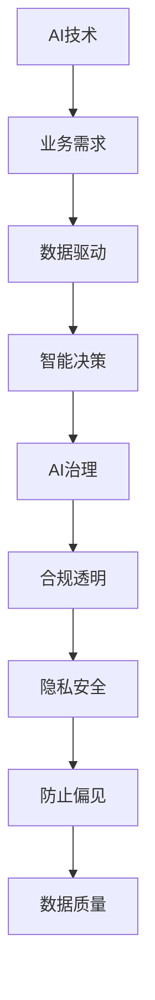

                 

# 中国企业的AI应用主义

## 1. 背景介绍

### 1.1 问题由来
近年来，人工智能(AI)技术的飞速发展为各行各业带来了颠覆性的变革。从智能制造、智能客服、智慧医疗，到无人驾驶、金融风控、智能教育，AI正深刻影响着中国企业的运营与发展。面对这些机遇与挑战，中国企业如何更好地应用AI，成为业界亟待探讨的重要问题。

### 1.2 问题核心关键点
AI应用的成败，关键在于能否与企业业务需求高度契合，实现数据驱动的业务优化与创新。本文聚焦于中国企业在实际运营中，如何结合自身业务特点，采用切实可行的AI技术，提升管理效率与决策支持，推动企业数字化转型升级。

### 1.3 问题研究意义
研究中国企业的AI应用主义，对于提升企业的智能化水平，推动中国经济的数字化转型，具有重要意义：

1. **提升管理效率**：AI技术能够自动处理大量重复性、高耗时的工作，使企业员工可以专注于创造性任务，提升整体效率。
2. **优化决策支持**：通过数据分析和模型预测，AI可以为企业管理者提供更科学、精准的决策依据，降低决策风险。
3. **促进业务创新**：AI技术能够挖掘业务中的新机会与新模式，推动企业业务模式创新，增强市场竞争力。
4. **增强竞争力**：在激烈的市场竞争中，采用先进AI技术的企业可以更快地响应市场变化，保持领先地位。
5. **赋能产业升级**：AI技术可以应用于传统产业的数字化升级，加速中国产业结构优化，提升产业效率与效益。

## 2. 核心概念与联系

### 2.1 核心概念概述

为更好地理解中国企业如何应用AI技术，本文将介绍几个密切相关的核心概念：

- **AI技术**：人工智能技术的集合，包括机器学习、深度学习、自然语言处理、计算机视觉等，为解决复杂问题提供了强大的工具。
- **业务需求**：企业运营中具体的需求与问题，如客户关系管理、产品推荐、供应链优化等。
- **数据驱动**：利用数据分析和机器学习模型，从数据中提取有价值的信息，驱动业务决策。
- **智能决策**：基于AI技术，通过数据和模型对企业运营进行预测与优化，支持更高效的决策过程。
- **AI治理**：确保AI应用的合规性、公平性、透明性，保障数据安全与隐私保护，防止AI偏见。

这些核心概念之间的逻辑关系可以通过以下Mermaid流程图来展示：



这个流程图展示了中国企业在AI应用中的关键环节及其相互关系：

1. AI技术作为支持手段，帮助解决具体业务需求。
2. 数据驱动通过分析海量数据，生成可操作的信息。
3. 智能决策基于数据和模型，优化业务流程与决策。
4. AI治理保障AI应用的合规性、公平性与透明度。

这些概念共同构成了AI在中国企业应用的核心框架，为企业提供了明确的指导方向。

## 3. 核心算法原理 & 具体操作步骤

### 3.1 算法原理概述

中国企业的AI应用，本质上是一个数据驱动的决策优化过程。其核心思想是：通过AI技术，从企业运营中的海量数据中提取有用信息，指导业务决策，提升企业运营效率与效益。

具体而言，AI应用流程包括以下几个关键步骤：

1. **数据采集与预处理**：收集企业运营中产生的各类数据，并进行清洗、格式化和标准化处理。
2. **特征工程**：选择和构造对业务决策有重要影响的特征变量，形成可用于模型训练的数据集。
3. **模型训练与评估**：选择适当的AI模型，并使用历史数据对其进行训练和调参，评估模型性能。
4. **决策支持与优化**：将训练好的模型应用于业务决策过程，提升决策准确性和效率。
5. **监控与迭代**：持续监控模型性能，根据业务反馈进行调整和优化。

### 3.2 算法步骤详解

以下详细介绍AI应用过程中的关键算法步骤：

**Step 1: 数据采集与预处理**

企业数据通常来自多个渠道，包括客户关系管理系统(CRM)、业务操作系统、财务系统等。数据采集工具如ETL(抽取、转换、加载)工具可以帮助从这些系统中提取数据。预处理过程包括清洗、去重、填充缺失值等，保证数据质量和完整性。

**Step 2: 特征工程**

特征工程是构建高质量数据集的关键步骤。需要根据业务需求，选择和构造对业务有重要影响的特征变量。例如，对于客户关系管理，可以提取客户购买行为、交易金额、评分等特征。使用技术手段如PCA(主成分分析)、特征选择算法等，可以减少特征维度，提高模型效率。

**Step 3: 模型训练与评估**

选择合适的AI模型，如决策树、随机森林、深度神经网络等，并使用训练集进行模型训练和调参。使用交叉验证等技术评估模型性能。性能指标如准确率、召回率、F1分数等可以指导模型选择和优化。

**Step 4: 决策支持与优化**

将训练好的模型应用于业务决策过程中，例如，通过预测客户流失率，优化客户服务策略；通过分析供应链数据，优化库存管理。AI系统实时监控模型输出，根据业务反馈进行调整和优化。

**Step 5: 监控与迭代**

持续监控AI系统的运行状态，评估其效果，并根据业务需求和技术发展进行迭代改进。使用如A/B测试、线上实验等方法，评估AI应用的实际效果。

### 3.3 算法优缺点

中国企业AI应用具有以下优点：

1. **效率提升**：AI技术可以处理大量数据，自动生成分析报告，提升企业运营效率。
2. **决策优化**：AI模型通过分析复杂数据，提供更科学的决策依据。
3. **业务创新**：AI技术挖掘新业务机会，推动企业创新。
4. **数据驱动**：基于数据驱动的决策过程，更具客观性和可靠性。

但同时，AI应用也存在以下局限：

1. **数据质量问题**：企业数据质量参差不齐，影响AI模型效果。
2. **模型复杂性**：复杂模型需要更多计算资源和时间，提升成本。
3. **隐私与伦理**：AI应用需严格遵循隐私保护和伦理规范。
4. **技术门槛高**：AI应用需要专业技术人员，增加企业运营成本。
5. **依赖数据积累**：AI模型效果依赖于数据量与质量，企业数据积累不足时，效果有限。

尽管存在这些局限，但AI技术在提升企业效率、优化决策、推动业务创新等方面的巨大潜力不容忽视。

### 3.4 算法应用领域

AI在中国企业中的应用已覆盖了多个领域，以下是几个典型案例：

- **智能客服**：利用自然语言处理和机器学习技术，自动回答客户咨询，提升服务效率。
- **供应链优化**：使用预测模型分析库存、物流数据，优化供应链管理。
- **风险控制**：通过分析历史交易数据，预测风险，提升金融风控能力。
- **智能制造**：使用机器视觉和深度学习技术，优化生产流程，提升产品质量。
- **营销优化**：利用数据分析和推荐算法，提升广告投放效果，精准营销。
- **智能仓储**：通过智能算法优化仓储布局和库存管理，提升仓储效率。

除了上述这些经典应用外，AI技术还被创新性地应用于更广泛的领域，如智慧城市、智慧农业、医疗健康等，为中国企业提供了更多业务拓展的新机会。

## 4. 数学模型和公式 & 详细讲解 & 举例说明

### 4.1 数学模型构建

为了更好地理解中国企业的AI应用过程，本文将使用数学语言对AI应用的决策优化过程进行更严格的刻画。

记企业业务数据集为 $D=\{(x_i,y_i)\}_{i=1}^N$，其中 $x_i$ 为特征向量，$y_i$ 为业务决策目标。定义AI模型为 $f(x;\theta)$，其中 $\theta$ 为模型参数。

定义模型 $f(x;\theta)$ 在数据样本 $(x,y)$ 上的损失函数为 $\ell(f(x;\theta),y)$，则在数据集 $D$ 上的经验风险为：

$$
\mathcal{L}(\theta) = \frac{1}{N}\sum_{i=1}^N \ell(f(x_i;\theta),y_i)
$$

优化目标是最小化经验风险，即找到最优参数：

$$
\theta^* = \mathop{\arg\min}_{\theta} \mathcal{L}(\theta)
$$

在实践中，我们通常使用基于梯度的优化算法（如SGD、Adam等）来近似求解上述最优化问题。设 $\eta$ 为学习率，$\lambda$ 为正则化系数，则参数的更新公式为：

$$
\theta \leftarrow \theta - \eta \nabla_{\theta}\mathcal{L}(\theta) - \eta\lambda\theta
$$

其中 $\nabla_{\theta}\mathcal{L}(\theta)$ 为损失函数对参数 $\theta$ 的梯度，可通过反向传播算法高效计算。

### 4.2 公式推导过程

以下我们以智能客服系统为例，推导基于决策树的模型训练和调参过程。

假设客服系统需要预测客户的情感倾向，模型 $f(x;\theta)$ 输出情感类别 $y \in \{\text{positive, neutral, negative}\}$。使用决策树算法进行模型训练，对于样本 $(x_i, y_i)$，其对损失函数的贡献为：

$$
\ell(f(x_i;\theta),y_i) = -y_i\log f(x_i;\theta(y_i))
$$

定义决策树的损失函数 $\mathcal{L}(\theta)$ 为：

$$
\mathcal{L}(\theta) = -\frac{1}{N}\sum_{i=1}^N y_i\log f(x_i;\theta(y_i))
$$

根据决策树的构建过程，每个节点上的损失函数为：

$$
\ell_t = \sum_{i \in D_t} -y_i\log f(x_i;\theta(y_i))
$$

其中 $D_t$ 为节点 $t$ 的样本集合。决策树的损失函数可以表示为：

$$
\mathcal{L}(D_t) = -\frac{1}{|D_t|}\sum_{i \in D_t} y_i\log f(x_i;\theta(y_i))
$$

定义节点的信息增益 $G_t$ 为：

$$
G_t = \mathcal{L}(D_t) - \frac{1}{|D_t|}\sum_{i \in D_t} \ell(y_i, f(x_i;\theta(y_i)))
$$

选择信息增益最大的节点进行分裂，得到新的子节点。重复上述过程直至满足停止条件，最终得到决策树模型。

在模型训练过程中，通过交叉验证等技术评估模型性能，并使用网格搜索、随机搜索等方法调参，得到最优的模型参数 $\theta^*$。

### 4.3 案例分析与讲解

假设某电商公司希望通过AI提升智能客服系统的性能。首先，收集历史客服数据，标记每个对话的情感倾向（积极、中性、消极）。然后，使用决策树算法进行模型训练，使用交叉验证评估模型效果。通过网格搜索调参，选择最优决策树模型应用于客服系统中。

## 5. 项目实践：代码实例和详细解释说明

### 5.1 开发环境搭建

在进行AI应用项目开发前，我们需要准备好开发环境。以下是使用Python进行Scikit-Learn开发的开发环境配置流程：

1. 安装Anaconda：从官网下载并安装Anaconda，用于创建独立的Python环境。

2. 创建并激活虚拟环境：
```bash
conda create -n ai-env python=3.8 
conda activate ai-env
```

3. 安装Scikit-Learn、Numpy等库：
```bash
conda install scikit-learn numpy pandas jupyter notebook
```

4. 安装企业级应用所需的库，如Flask、SQLAlchemy等：
```bash
pip install flask sqlalchemy
```

完成上述步骤后，即可在`ai-env`环境中开始AI应用项目的开发。

### 5.2 源代码详细实现

下面我们以智能客服系统为例，给出使用Scikit-Learn进行决策树模型训练和调参的Python代码实现。

首先，定义数据处理函数：

```python
import pandas as pd
from sklearn.model_selection import train_test_split
from sklearn.tree import DecisionTreeClassifier

def load_data(filename):
    df = pd.read_csv(filename)
    return df

def preprocess_data(df):
    df.dropna(inplace=True)
    X = df.drop(['label'], axis=1)
    y = df['label']
    return X, y

def split_data(X, y, test_size=0.2, random_state=42):
    X_train, X_test, y_train, y_test = train_test_split(X, y, test_size=test_size, random_state=random_state)
    return X_train, X_test, y_train, y_test

def train_model(X_train, y_train, test_size=0.2, random_state=42):
    clf = DecisionTreeClassifier(random_state=random_state)
    clf.fit(X_train, y_train)
    return clf

def evaluate_model(clf, X_test, y_test):
    y_pred = clf.predict(X_test)
    print(classification_report(y_test, y_pred))
```

然后，加载数据并进行预处理：

```python
data = load_data('customer_service_data.csv')
X, y = preprocess_data(data)
X_train, X_test, y_train, y_test = split_data(X, y, test_size=0.2, random_state=42)
```

接着，训练决策树模型并进行评估：

```python
clf = train_model(X_train, y_train)
evaluate_model(clf, X_test, y_test)
```

以上就是使用Scikit-Learn进行智能客服系统决策树模型训练和调参的完整代码实现。可以看到，通过Python和Scikit-Learn，企业可以快速搭建AI应用系统，并对其进行评估和优化。

### 5.3 代码解读与分析

让我们再详细解读一下关键代码的实现细节：

**load_data函数**：
- 加载企业客服数据，返回Pandas DataFrame对象。

**preprocess_data函数**：
- 清洗数据，去除缺失值，并分离特征向量X和标签y。

**split_data函数**：
- 使用train_test_split函数将数据集分为训练集和测试集，比例为80%训练集和20%测试集。

**train_model函数**：
- 创建决策树分类器，并使用训练集进行模型训练。

**evaluate_model函数**：
- 使用测试集评估模型性能，使用classification_report函数输出分类指标。

**train_model和evaluate_model**函数结合使用，可以完成一个完整的决策树模型训练和评估流程。

当然，实际应用中还需要考虑更多因素，如模型参数调优、特征工程、模型集成等。但核心的训练和评估流程与上述示例类似。

## 6. 实际应用场景

### 6.1 智能客服系统

智能客服系统是AI应用中最为典型的场景之一。通过AI技术，客服系统可以自动回答客户咨询，提升服务效率和客户满意度。

在技术实现上，可以收集企业内部的历史客服对话记录，标记客户情感倾向，构建监督数据集。在此基础上使用机器学习算法，如决策树、随机森林等，训练情感分类模型。微调模型并应用于实时客服系统中，系统能够根据客户输入自动匹配最佳答案，并进行实时更新。

### 6.2 供应链优化

供应链管理涉及大量的物流、库存、订单等数据，通过AI技术可以优化供应链流程，降低成本，提升效率。

具体而言，可以收集历史订单数据、库存数据、物流数据，构建优化模型。使用遗传算法、线性规划等技术进行求解，得到最优的供应链配置方案。例如，根据历史订单量预测未来需求，优化库存水平；根据物流成本和距离优化配送路线。

### 6.3 金融风控

金融行业风险控制对数据的质量和精度要求极高。AI技术可以通过分析历史交易数据，构建风险评估模型，预测客户的信用风险，提升风险管理能力。

具体应用包括：
- 使用逻辑回归、随机森林等模型，根据客户的还款记录、信用评分等特征，预测其违约概率。
- 通过聚类分析，将客户分为高、中、低风险等级，进行差异化管理。
- 使用深度学习模型，如卷积神经网络(CNN)、循环神经网络(RNN)，对交易数据进行特征提取和模式识别，提高风险预测的准确性。

### 6.4 未来应用展望

随着AI技术的不断进步，未来AI应用将在更多领域得到应用，为中国企业的数字化转型提供强大动力。

- **智慧医疗**：通过AI技术优化医疗资源配置，提升诊疗效率，提高医疗服务质量。
- **智能制造**：使用机器视觉和深度学习技术，优化生产流程，提升产品质量和生产效率。
- **智能教育**：通过AI技术个性化推荐课程，优化教学内容，提升教育质量。
- **智慧农业**：使用智能传感器和大数据分析，优化种植管理，提高农业生产效率和收益。

## 7. 工具和资源推荐

### 7.1 学习资源推荐

为了帮助企业系统掌握AI技术的应用，这里推荐一些优质的学习资源：

1. 《Python机器学习》系列书籍：由知名AI专家撰写，详细介绍机器学习算法和实践。
2. 《深度学习入门》系列课程：谷歌AI团队开设的免费在线课程，系统介绍深度学习基础和应用。
3. 《Python数据分析实战》系列书籍：系统介绍Python数据分析和机器学习应用。
4. Kaggle平台：数据科学竞赛平台，提供大量数据集和机器学习竞赛，供企业实践和验证模型。
5. GitHub：全球最大的开源代码平台，提供丰富的AI应用代码和教程，供企业学习和参考。

通过对这些资源的学习实践，相信企业能够更好地掌握AI技术，并将其应用于业务优化和创新。

### 7.2 开发工具推荐

高效的开发离不开优秀的工具支持。以下是几款用于AI应用开发的常用工具：

1. Scikit-Learn：基于Python的机器学习库，提供了丰富的算法和工具，方便企业快速搭建AI应用。
2. TensorFlow：由Google主导开发的深度学习框架，适用于大规模工程应用。
3. PyTorch：基于Python的开源深度学习框架，灵活易用，适合快速迭代研究。
4. Weights & Biases：模型训练的实验跟踪工具，可以记录和可视化模型训练过程中的各项指标。
5. Jupyter Notebook：交互式编程环境，支持多种编程语言，方便企业进行数据分析和模型实验。

合理利用这些工具，可以显著提升AI应用项目的开发效率，加快创新迭代的步伐。

### 7.3 相关论文推荐

AI应用的理论研究离不开学术界的不断探索。以下是几篇奠基性的相关论文，推荐阅读：

1. "Grokking the Ups and Downs of Deep Learning: GANs, Autoencoders, and Normalization Layers"（深度学习入门）
2. "Deep Learning"（深度学习）
3. "Machine Learning Yearning"（机器学习实战）
4. "TensorFlow: A System for Large-Scale Machine Learning"（TensorFlow）
5. "Gradient Descent"（梯度下降算法）

这些论文代表了大规模应用AI技术的最新进展，是深入理解AI应用理论和方法的重要参考文献。

## 8. 总结：未来发展趋势与挑战

### 8.1 研究成果总结

本文对AI在中国企业中的应用进行了全面系统的介绍。首先，阐述了中国企业在运营中面临的业务需求，并探讨了AI技术如何帮助提升管理效率和决策支持。其次，从原理到实践，详细讲解了AI应用的核心算法步骤和关键技术点。同时，本文还探讨了AI应用在多个行业中的实际案例，展示了AI技术的广泛应用前景。

通过本文的系统梳理，可以看到，AI在中国企业中的应用不仅具备广阔前景，还能够带来实实在在的业务价值和竞争力提升。未来，随着AI技术的不断进步，AI在中国企业中的应用将更加深入广泛，为企业的数字化转型提供强大动力。

### 8.2 未来发展趋势

展望未来，AI在中国企业中的应用将呈现以下几个发展趋势：

1. **自动化水平提升**：随着AI技术的不断发展，更多的业务流程将实现自动化，提升企业运营效率。
2. **智能化程度提高**：AI技术将应用于更多复杂决策场景，提供更准确、实时的业务支持。
3. **数据驱动决策**：基于大数据分析的AI决策将更加广泛，提升决策的科学性和可靠性。
4. **跨领域应用拓展**：AI技术将应用于更多跨行业领域，提升各行业的效率和竞争力。
5. **AI与业务深度融合**：AI技术将与业务需求深度融合，成为企业核心竞争力的一部分。
6. **模型开源与共享**：AI模型的开源与共享将更加普遍，促进技术传播与应用。

以上趋势凸显了AI在中国企业应用中的广阔前景。这些方向的探索发展，必将进一步提升AI技术在企业中的应用水平，为企业的数字化转型提供更多可能。

### 8.3 面临的挑战

尽管AI在中国企业中的应用前景广阔，但在实现过程中仍面临诸多挑战：

1. **数据隐私与安全**：企业需要严格保护用户数据隐私，防止数据泄露和滥用。
2. **技术复杂性**：AI技术应用需要专业知识，对企业技术团队提出了更高的要求。
3. **模型解释性**：AI模型的黑盒特性可能导致决策过程缺乏解释性，难以被企业理解和管理。
4. **资源投入**：AI应用需要大量计算资源和时间，增加企业成本。
5. **技术适应性**：不同企业对AI技术的适应能力不一，需要进行定制化开发。

尽管存在这些挑战，但AI技术在提升企业效率、优化决策、推动业务创新等方面的巨大潜力不容忽视。通过积极应对并寻求突破，AI在中国企业中的应用将更加深入广泛。

### 8.4 研究展望

面对AI在中国企业应用所面临的挑战，未来的研究需要在以下几个方面寻求新的突破：

1. **数据治理**：建立数据治理体系，保障数据安全和隐私，提升数据质量。
2. **模型可解释性**：研究增强AI模型的解释性，提升企业的理解和信任。
3. **技术培训**：提升企业技术团队的技术水平，降低AI技术应用门槛。
4. **跨领域融合**：推动AI技术与业务深度融合，实现AI应用的创新突破。
5. **开源社区**：构建AI技术开源社区，促进技术传播与应用。

这些研究方向的探索，必将引领AI在中国企业中的应用走向更加成熟，为企业的数字化转型提供更多保障。总之，AI技术在提升企业效率、优化决策、推动业务创新等方面具备巨大潜力，未来必将在更多领域大放异彩。

## 9. 附录：常见问题与解答

**Q1：AI技术是否适用于所有企业？**

A: AI技术在提升企业效率、优化决策、推动业务创新等方面具备巨大潜力，但并非所有企业都适合采用AI技术。AI技术需要大量数据和计算资源，对技术团队的要求也较高。对于数据量小、技术基础薄弱的小型企业，可能需要从简单的数据分析和业务自动化开始，逐步引入AI技术。

**Q2：AI技术如何提升企业效率？**

A: AI技术可以通过自动化和优化业务流程，提升企业效率。例如，通过智能客服系统，自动回答客户咨询，减少人工成本；通过供应链优化模型，优化库存和物流，降低运营成本；通过智能财务系统，自动化财务报表生成和审计，提升财务工作效率。

**Q3：AI技术在数据隐私与安全方面有哪些考虑？**

A: AI技术的应用需要严格遵守数据隐私和安全规范。企业需要建立数据治理体系，明确数据收集、使用和存储的规范，确保数据安全和隐私保护。此外，AI模型训练和应用过程中，需要避免数据泄露和滥用，防止模型被恶意攻击。

**Q4：AI技术如何应用于金融风控？**

A: AI技术可以通过分析历史交易数据，构建风险评估模型，预测客户的信用风险，提升风险管理能力。例如，使用逻辑回归、随机森林等模型，根据客户的还款记录、信用评分等特征，预测其违约概率；通过聚类分析，将客户分为高、中、低风险等级，进行差异化管理；使用深度学习模型，如卷积神经网络(CNN)、循环神经网络(RNN)，对交易数据进行特征提取和模式识别，提高风险预测的准确性。

**Q5：AI技术在未来有哪些新应用方向？**

A: AI技术在未来将更多地应用于智慧医疗、智能制造、智能教育、智慧农业等领域。例如，智慧医疗将通过AI技术优化医疗资源配置，提升诊疗效率；智能制造将使用机器视觉和深度学习技术，优化生产流程；智能教育将通过AI技术个性化推荐课程，优化教学内容；智慧农业将使用智能传感器和大数据分析，优化种植管理。

---

作者：禅与计算机程序设计艺术 / Zen and the Art of Computer Programming

