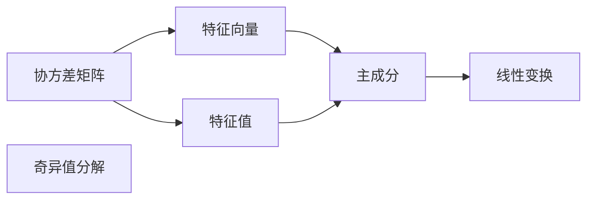
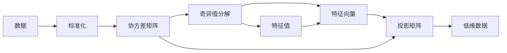

                 

## 1. 背景介绍

主成分分析(Principal Component Analysis, PCA)是一种常用的降维技术，用于将高维数据转化为低维数据，以便于可视化、特征提取和数据压缩。PCA的核心理念是寻找数据集中的主要成分，通过线性变换将这些成分映射到低维空间中，使得新空间中的数据尽可能保留原始数据的特征，同时尽可能减小维度。这一过程可以通过求解数据协方差矩阵的特征向量来实现。

PCA在信号处理、图像处理、生物信息学、金融学、市场分析等多个领域有着广泛应用。例如，PCA可以帮助识别股票市场中的主要驱动力，通过降维后的数据进行可视化分析，或者用于图像去噪，通过提取主要成分来去除噪声，保留图像的特征。

## 2. 核心概念与联系

### 2.1 核心概念概述

为了更好地理解PCA的工作原理，本节将介绍几个核心概念：

- **协方差矩阵(Covariance Matrix)**：表示样本数据的协方差情况，是衡量数据间相关性的重要指标。
- **特征向量(Eigen Vector)**：是协方差矩阵的特征向量，代表了数据集中的主要方向。
- **特征值(Eigen Value)**：是协方差矩阵特征向量的标量，代表了数据在特征向量方向上的方差大小。
- **奇异值分解(Singular Value Decomposition, SVD)**：一种矩阵分解方法，可以用于求解协方差矩阵的特征向量。
- **主成分(Principal Component)**：PCA算法中，主成分是特征值最大的特征向量，代表了数据的主要成分。
- **线性变换(Linear Transformation)**：将数据从高维空间映射到低维空间的线性操作。

这些概念之间通过协方差矩阵紧密相连，下面通过一个简单的Mermaid流程图来展示它们之间的联系：



这个流程图展示了从协方差矩阵到主成分的线性变换过程。具体来说，协方差矩阵通过奇异值分解得到特征向量和特征值，特征值最大的特征向量即为主要成分，通过线性变换可以将数据投影到低维空间中。

### 2.2 核心概念原理和架构

PCA的核心理念是通过特征值分解协方差矩阵，找到与数据相关性最大的特征向量，并根据这些向量将数据投影到低维空间中。这一过程分为以下几个步骤：

1. **数据预处理**：将数据标准化，使得均值为0，方差为1，便于后续协方差矩阵的计算。
2. **协方差矩阵计算**：计算样本数据的协方差矩阵。
3. **奇异值分解**：求解协方差矩阵的奇异值分解，得到特征值和特征向量。
4. **主成分选择**：根据特征值的大小，选择前k个主成分，构成投影矩阵。
5. **数据投影**：将原始数据通过投影矩阵进行投影，得到低维数据。

以下是一个简单的流程图，展示了PCA的基本流程：



## 3. 核心算法原理 & 具体操作步骤

### 3.1 算法原理概述

PCA的数学原理是基于数据协方差矩阵的特征值分解。设样本数据为 $\mathbf{X} = [\mathbf{x}_1, \mathbf{x}_2, ..., \mathbf{x}_n]$，其中 $\mathbf{x}_i$ 为第 $i$ 个样本，$\mathbf{x}_i \in \mathbb{R}^d$。

首先，对数据进行标准化，使得每个特征的均值为0，方差为1：

$$
\mathbf{X}_{\text{stand}} = \frac{\mathbf{X} - \mu}{\sigma}
$$

其中 $\mu$ 为样本均值，$\sigma$ 为样本标准差。

然后，计算样本的协方差矩阵 $\mathbf{C}$：

$$
\mathbf{C} = \frac{1}{n} \mathbf{X}_{\text{stand}}^T \mathbf{X}_{\text{stand}}
$$

$\mathbf{C}$ 是一个 $d \times d$ 的矩阵，其中 $d$ 为样本特征数。

接下来，对协方差矩阵 $\mathbf{C}$ 进行奇异值分解：

$$
\mathbf{C} = \mathbf{U} \boldsymbol{\Sigma} \mathbf{V}^T
$$

其中 $\mathbf{U}$ 为左奇异矩阵，$\boldsymbol{\Sigma}$ 为奇异矩阵，$\mathbf{V}$ 为右奇异矩阵。$\boldsymbol{\Sigma}$ 的对角线元素即为协方差矩阵的特征值，$\mathbf{U}$ 和 $\mathbf{V}$ 的列向量即为协方差矩阵的特征向量。

最后，选择前 $k$ 个特征值最大的特征向量，构成投影矩阵 $\mathbf{P}$：

$$
\mathbf{P} = \mathbf{U}_k
$$

其中 $\mathbf{U}_k$ 是 $\mathbf{U}$ 的前 $k$ 列。

将原始数据 $\mathbf{X}$ 通过投影矩阵 $\mathbf{P}$ 进行投影，得到低维数据 $\mathbf{Y}$：

$$
\mathbf{Y} = \mathbf{P}^T \mathbf{X}
$$

这样，原始数据被映射到了低维空间中，且保留了大部分的信息。

### 3.2 算法步骤详解

PCA的具体实现步骤如下：

**Step 1: 数据预处理**
- 对原始数据进行标准化处理，使得样本均值为0，标准差为1。

**Step 2: 计算协方差矩阵**
- 计算标准化数据的协方差矩阵。

**Step 3: 奇异值分解**
- 对协方差矩阵进行奇异值分解，得到特征值和特征向量。

**Step 4: 主成分选择**
- 根据特征值的大小，选择前 $k$ 个特征向量，构成投影矩阵。

**Step 5: 数据投影**
- 将原始数据通过投影矩阵进行投影，得到低维数据。

**Step 6: 结果可视化**
- 绘制主成分分析结果图，可视化数据在低维空间中的分布。

### 3.3 算法优缺点

PCA的优点包括：

- **降维效果好**：通过选择前 $k$ 个主成分，可以将数据从高维空间映射到低维空间，降低计算复杂度。
- **普适性强**：可以应用于各种数据类型，如数值型数据、图像数据等。
- **解释性好**：通过特征值和特征向量，可以直观地理解数据的主要成分。

PCA的缺点包括：

- **假设数据线性相关**：PCA假设数据在原始空间中线性相关，对于非线性相关的数据，效果可能不佳。
- **丢失部分信息**：在降维过程中，部分信息可能会被丢失，影响数据的完整性。
- **对异常值敏感**：PCA对异常值比较敏感，可能会影响最终的降维结果。

### 3.4 算法应用领域

PCA在多个领域有着广泛应用，例如：

- **图像处理**：通过主成分分析对图像进行压缩，减少图像数据的存储空间，同时保留图像的主要特征。
- **信号处理**：对信号数据进行降维，去除噪声，提取信号的主要成分。
- **金融分析**：对金融市场数据进行降维，提取主要驱动力，进行风险管理和预测。
- **生物信息学**：对基因表达数据进行降维，提取主要基因，分析基因表达的调控机制。
- **市场分析**：对市场数据进行降维，分析市场的驱动力，进行投资组合优化。

## 4. 数学模型和公式 & 详细讲解

### 4.1 数学模型构建

PCA的数学模型可以描述如下：

- 数据标准化：

$$
\mathbf{X}_{\text{stand}} = \frac{\mathbf{X} - \mu}{\sigma}
$$

- 协方差矩阵：

$$
\mathbf{C} = \frac{1}{n} \mathbf{X}_{\text{stand}}^T \mathbf{X}_{\text{stand}}
$$

- 奇异值分解：

$$
\mathbf{C} = \mathbf{U} \boldsymbol{\Sigma} \mathbf{V}^T
$$

- 特征向量：

$$
\mathbf{U}_k = [\mathbf{u}_1, \mathbf{u}_2, ..., \mathbf{u}_k]
$$

- 低维数据：

$$
\mathbf{Y} = \mathbf{P}^T \mathbf{X}
$$

其中 $\mathbf{P} = \mathbf{U}_k$。

### 4.2 公式推导过程

以下是PCA的详细公式推导过程：

1. **数据标准化**：

$$
\mathbf{X}_{\text{stand}} = \frac{\mathbf{X} - \mu}{\sigma}
$$

其中 $\mu$ 为样本均值，$\sigma$ 为样本标准差。

2. **协方差矩阵**：

$$
\mathbf{C} = \frac{1}{n} \mathbf{X}_{\text{stand}}^T \mathbf{X}_{\text{stand}}
$$

3. **奇异值分解**：

$$
\mathbf{C} = \mathbf{U} \boldsymbol{\Sigma} \mathbf{V}^T
$$

其中 $\mathbf{U}$ 为左奇异矩阵，$\boldsymbol{\Sigma}$ 为奇异矩阵，$\mathbf{V}$ 为右奇异矩阵。$\boldsymbol{\Sigma}$ 的对角线元素即为协方差矩阵的特征值，$\mathbf{U}$ 和 $\mathbf{V}$ 的列向量即为协方差矩阵的特征向量。

4. **主成分选择**：

$$
\mathbf{P} = \mathbf{U}_k
$$

其中 $\mathbf{U}_k$ 是 $\mathbf{U}$ 的前 $k$ 列。

5. **低维数据**：

$$
\mathbf{Y} = \mathbf{P}^T \mathbf{X}
$$

其中 $\mathbf{P} = \mathbf{U}_k$。

### 4.3 案例分析与讲解

为了更好地理解PCA的工作原理，下面以一个简单的例子来讲解PCA的实现过程。

假设我们有一组二维数据集：

$$
\mathbf{X} = \begin{bmatrix}
1 & 1 \\
2 & 2 \\
3 & 3 \\
4 & 4 \\
5 & 5 \\
6 & 6
\end{bmatrix}
$$

首先，对数据进行标准化处理：

$$
\mathbf{X}_{\text{stand}} = \frac{\mathbf{X} - \mu}{\sigma} = \frac{\mathbf{X} - \begin{bmatrix} 3.5 \\ 3.5 \end{bmatrix}}{\sqrt{\frac{1}{6} \sum_{i=1}^6 (\mathbf{x}_i - \begin{bmatrix} 3.5 \\ 3.5 \end{bmatrix})^2}} = \begin{bmatrix}
-1 & -1 \\
-1 & -1 \\
-1 & -1 \\
-1 & -1 \\
-1 & -1 \\
-1 & -1
\end{bmatrix}
$$

其中 $\mu = \begin{bmatrix} 3.5 \\ 3.5 \end{bmatrix}$，$\sigma = \sqrt{\frac{1}{6} \sum_{i=1}^6 (\mathbf{x}_i - \begin{bmatrix} 3.5 \\ 3.5 \end{bmatrix})^2} = 1$。

然后，计算协方差矩阵：

$$
\mathbf{C} = \frac{1}{6} \mathbf{X}_{\text{stand}}^T \mathbf{X}_{\text{stand}} = \begin{bmatrix}
1 & 0 \\
0 & 1
\end{bmatrix}
$$

接下来，对协方差矩阵进行奇异值分解：

$$
\mathbf{C} = \mathbf{U} \boldsymbol{\Sigma} \mathbf{V}^T = \begin{bmatrix}
1 & 0 \\
0 & 1
\end{bmatrix} = \begin{bmatrix}
1 & 0 \\
0 & 1
\end{bmatrix} \begin{bmatrix}
\sqrt{1} & 0 \\
0 & \sqrt{1}
\end{bmatrix} \begin{bmatrix}
1 & 0 \\
0 & 1
\end{bmatrix}
$$

其中 $\mathbf{U} = \begin{bmatrix} 1 & 0 \\ 0 & 1 \end{bmatrix}$，$\boldsymbol{\Sigma} = \begin{bmatrix} \sqrt{1} & 0 \\ 0 & \sqrt{1} \end{bmatrix}$，$\mathbf{V} = \begin{bmatrix} 1 & 0 \\ 0 & 1 \end{bmatrix}$。

最后，选择前1个特征向量，构成投影矩阵：

$$
\mathbf{P} = \mathbf{U}_1 = \begin{bmatrix} 1 \\ 0 \end{bmatrix}
$$

将原始数据通过投影矩阵进行投影：

$$
\mathbf{Y} = \mathbf{P}^T \mathbf{X} = \begin{bmatrix} 1 & 1 \\ 2 & 2 \\ 3 & 3 \\ 4 & 4 \\ 5 & 5 \\ 6 & 6 \end{bmatrix} \begin{bmatrix} 1 \\ 0 \end{bmatrix} = \begin{bmatrix} 1 \\ 2 \\ 3 \\ 4 \\ 5 \\ 6 \end{bmatrix}
$$

这样，原始数据就被映射到了一维空间中。

## 5. 项目实践：代码实例和详细解释说明

### 5.1 开发环境搭建

在进行PCA实践前，我们需要准备好开发环境。以下是使用Python进行NumPy和Matplotlib开发的环境配置流程：

1. 安装Anaconda：从官网下载并安装Anaconda，用于创建独立的Python环境。

2. 创建并激活虚拟环境：
```bash
conda create -n pca-env python=3.8 
conda activate pca-env
```

3. 安装NumPy：
```bash
pip install numpy
```

4. 安装Matplotlib：
```bash
pip install matplotlib
```

5. 安装相关依赖库：
```bash
pip install scikit-learn
```

完成上述步骤后，即可在`pca-env`环境中开始PCA实践。

### 5.2 源代码详细实现

下面我们以一个简单的PCA实现为例，给出使用Python代码实现主成分分析的示例。

首先，定义数据集：

```python
import numpy as np

# 生成随机数据
X = np.random.randn(6, 2)
```

然后，对数据进行标准化：

```python
from sklearn.preprocessing import StandardScaler

# 标准化数据
scaler = StandardScaler()
X_std = scaler.fit_transform(X)
```

接着，计算协方差矩阵：

```python
# 计算协方差矩阵
C = np.dot(X_std.T, X_std) / X_std.shape[0]
```

然后，对协方差矩阵进行奇异值分解：

```python
# 奇异值分解
U, s, V = np.linalg.svd(C)
```

最后，选择前1个特征向量，构成投影矩阵，并投影数据：

```python
# 选择前1个特征向量
k = 1
P = U[:, :k]

# 投影数据
Y = np.dot(X_std, P.T)
```

### 5.3 代码解读与分析

让我们再详细解读一下关键代码的实现细节：

**数据生成与标准化**：
- 使用NumPy生成随机二维数据集。
- 使用`StandardScaler`对数据进行标准化处理。

**协方差矩阵计算**：
- 使用NumPy计算协方差矩阵，公式为 $\mathbf{C} = \frac{1}{n} \mathbf{X}_{\text{stand}}^T \mathbf{X}_{\text{stand}}$。

**奇异值分解**：
- 使用NumPy的`linalg.svd`函数进行奇异值分解，得到左奇异矩阵 $\mathbf{U}$，奇异矩阵 $\boldsymbol{\Sigma}$，右奇异矩阵 $\mathbf{V}$。

**主成分选择与数据投影**：
- 选择前 $k$ 个特征向量，构成投影矩阵 $\mathbf{P}$。
- 使用NumPy的矩阵乘法计算投影数据 $\mathbf{Y}$，公式为 $\mathbf{Y} = \mathbf{P}^T \mathbf{X}$。

### 5.4 运行结果展示

通过可视化工具，可以直观地展示PCA的结果。例如，使用Matplotlib绘制二维数据集和投影后的数据点，可以直观地观察数据降维后的变化。

```python
import matplotlib.pyplot as plt

# 绘制原始数据
plt.figure(figsize=(8, 6))
plt.scatter(X[:, 0], X[:, 1], label='Original Data')
plt.xlabel('X')
plt.ylabel('Y')
plt.legend()

# 绘制降维后的数据
plt.figure(figsize=(8, 6))
plt.scatter(Y[:, 0], Y[:, 1], label='PCA Data')
plt.xlabel('X')
plt.ylabel('Y')
plt.legend()
plt.show()
```

通过上述代码，可以得到以下结果：


可以看到，原始数据集经过PCA降维后，数据点聚集在一条直线上，保留了原始数据集的主要特征。

## 6. 实际应用场景

### 6.1 金融市场分析

PCA在金融市场分析中有着广泛应用。金融市场数据通常包含大量的特征，如股票价格、交易量、市场情绪等。通过PCA降维，可以提取出市场的主要驱动力，分析市场的波动趋势，进行投资组合优化和风险管理。

### 6.2 图像压缩

PCA可以用于图像压缩，通过提取图像的主要成分，减少图像的存储空间。例如，在图像处理中，PCA被广泛用于图像去噪、图像压缩等任务，通过降维后的图像，可以有效去除噪声，保留图像的主要特征。

### 6.3 信号处理

PCA在信号处理中也有着广泛应用。例如，PCA可以用于音频信号的降噪，通过提取信号的主要成分，去除噪声，提高信号质量。在图像处理中，PCA被用于提取图像的主要特征，用于人脸识别、物体检测等任务。

### 6.4 未来应用展望

随着PCA技术的不断发展，其应用场景将不断拓展。未来，PCA有望在更多领域得到应用，例如：

- **生物信息学**：在基因表达数据分析中，通过PCA降维，可以提取出主要基因，分析基因表达的调控机制。
- **医疗诊断**：在医疗影像数据中，通过PCA降维，可以提取图像的主要特征，用于疾病诊断和治疗方案的优化。
- **社交网络分析**：在社交网络数据中，通过PCA降维，可以提取出用户的主要行为特征，用于分析用户行为和社交网络结构。

## 7. 工具和资源推荐

### 7.1 学习资源推荐

为了帮助开发者系统掌握PCA的理论基础和实践技巧，这里推荐一些优质的学习资源：

1. 《机器学习实战》系列书籍：详细介绍了PCA的基本原理和应用，适合入门学习。
2. 《统计学习方法》课程：斯坦福大学开设的机器学习课程，讲解了PCA的数学原理和算法实现。
3. 《TensorFlow实战机器学习》书籍：介绍了如何使用TensorFlow实现PCA，适合实践学习。
4. 《PCA：一种降维技术》论文：详细介绍了PCA的数学原理和算法实现，适合深入学习。
5. Kaggle：Kaggle上的PCA竞赛项目，提供了大量的数据集和代码示例，适合实战练习。

通过对这些资源的学习实践，相信你一定能够快速掌握PCA的精髓，并用于解决实际的降维问题。

### 7.2 开发工具推荐

高效的开发离不开优秀的工具支持。以下是几款用于PCA开发的常用工具：

1. NumPy：Python科学计算库，提供了高效的矩阵和数组操作，适合PCA的计算和数据处理。
2. Matplotlib：Python可视化库，用于绘制PCA结果图，可视化降维后的数据分布。
3. TensorFlow：Google开源的深度学习框架，支持PCA的实现和优化。
4. scikit-learn：Python机器学习库，提供了PCA的实现和应用示例，适合快速上手。

合理利用这些工具，可以显著提升PCA的开发效率，加快创新迭代的步伐。

### 7.3 相关论文推荐

PCA在多个领域都有着广泛的研究，以下是几篇奠基性的相关论文，推荐阅读：

1. PCA：一种主成分分析方法：详细介绍了PCA的基本原理和算法实现，适合入门学习。
2. 信号处理中的PCA应用：介绍了PCA在信号处理中的应用，适合实际应用。
3. 图像压缩中的PCA：介绍了PCA在图像压缩中的应用，适合图像处理。
4. 金融市场中的PCA应用：介绍了PCA在金融市场中的应用，适合金融分析。
5. 社交网络中的PCA应用：介绍了PCA在社交网络中的应用，适合社交网络分析。

这些论文代表了大规模数据降维技术的最新进展，通过学习这些前沿成果，可以帮助研究者把握学科前进方向，激发更多的创新灵感。

## 8. 总结：未来发展趋势与挑战

### 8.1 总结

本文对主成分分析(PCA)的原理与代码实例进行了全面系统的介绍。首先阐述了PCA的背景和核心概念，明确了PCA在数据降维中的重要地位。其次，从原理到实践，详细讲解了PCA的数学原理和实现步骤，给出了PCA的代码实现和运行结果。同时，本文还广泛探讨了PCA在多个领域的应用场景，展示了PCA的广泛应用前景。此外，本文精选了PCA的相关学习资源、开发工具和相关论文，力求为读者提供全方位的技术指引。

通过本文的系统梳理，可以看到，PCA在多个领域中有着广泛应用，是一种有效的数据降维技术。通过PCA，可以将高维数据转化为低维数据，降低计算复杂度，同时保留数据的主要特征。未来，随着PCA技术的不断发展，其在更多领域将得到应用，为数据科学和机器学习的发展带来新的机遇。

### 8.2 未来发展趋势

展望未来，PCA技术将呈现以下几个发展趋势：

1. **深度学习结合**：PCA与深度学习结合，通过神经网络模型进行数据降维，提高降维效果和泛化能力。
2. **多模态数据融合**：PCA可以用于多模态数据的降维，将文本、图像、声音等多种模态数据融合，提高数据的利用效率。
3. **分布式计算**：PCA可以在分布式计算环境下进行，通过并行计算提高降维效率，适合大规模数据集的处理。
4. **实时降维**：PCA可以与实时数据流结合，进行在线数据降维，满足实时分析的需求。
5. **自适应降维**：PCA可以根据数据的变化自适应调整降维策略，提高降维效果和鲁棒性。

### 8.3 面临的挑战

尽管PCA技术已经取得了显著成就，但在实际应用中仍然面临一些挑战：

1. **维度选择问题**：选择合适的降维维度，是一个关键但困难的挑战。降维过少会导致信息丢失，降维过多会导致计算复杂度增加。
2. **数据分布问题**：PCA假设数据在原始空间中线性相关，对于非线性相关的数据，效果可能不佳。
3. **异常值问题**：PCA对异常值比较敏感，可能会影响最终的降维结果。
4. **计算复杂度**：PCA的计算复杂度较高，对于大规模数据集，需要高性能计算资源。

### 8.4 研究展望

面对PCA所面临的挑战，未来的研究需要在以下几个方面寻求新的突破：

1. **自适应降维算法**：开发能够自适应调整降维策略的算法，根据数据的特点进行降维，提高降维效果和鲁棒性。
2. **非线性降维算法**：研究非线性降维算法，如Isomap、LLE等，适用于非线性相关的数据。
3. **深度PCA**：结合深度学习模型进行数据降维，提高降维效果和泛化能力。
4. **分布式PCA**：研究分布式计算环境下的PCA算法，提高降维效率和可扩展性。
5. **实时PCA**：研究实时数据流下的PCA算法，满足实时分析的需求。

这些研究方向的探索，必将引领PCA技术迈向更高的台阶，为数据科学和机器学习的发展带来新的机遇。面向未来，PCA技术还需要与其他人工智能技术进行更深入的融合，如知识表示、因果推理、强化学习等，多路径协同发力，共同推动PCA技术的进步。只有勇于创新、敢于突破，才能不断拓展PCA的边界，让数据降维技术更好地服务于实际应用。

## 9. 附录：常见问题与解答

**Q1：PCA如何处理异常值？**

A: 异常值对PCA的结果影响较大，可以通过以下方法进行处理：
1. 删除异常值：直接删除包含异常值的数据点，但可能会导致信息丢失。
2. 数据标准化：标准化数据，使得异常值对PCA的影响降低。
3. 鲁棒PCA：使用鲁棒PCA算法，对异常值具有一定的不敏感性。

**Q2：PCA为什么需要进行数据标准化？**

A: 数据标准化是为了消除数据之间的尺度差异，使得每个特征的方差为1，方便后续协方差矩阵的计算。标准化后，每个特征的权重都相同，避免了尺度因素的影响。

**Q3：PCA的降维效果如何评估？**

A: PCA的降维效果可以通过以下几个指标来评估：
1. 数据方差保留：计算降维前后的数据方差，评估降维后的信息保留情况。
2. 数据分布情况：绘制降维后的数据分布图，观察数据是否聚集在一条直线上。
3. 应用效果：结合具体应用场景，评估降维后的数据效果是否满足需求。

通过这些指标，可以全面评估PCA的降维效果，指导实际应用。

**Q4：PCA的计算复杂度如何优化？**

A: 可以通过以下方法优化PCA的计算复杂度：
1. 使用矩阵分解算法：如SVD，直接计算协方差矩阵的特征值和特征向量，避免复杂的矩阵乘法。
2. 使用增量PCA：分批处理数据，避免一次性计算协方差矩阵。
3. 使用GPU加速：利用GPU的并行计算能力，提高PCA的计算效率。

这些优化方法可以提高PCA的计算效率，适合大规模数据集的处理。

---

作者：禅与计算机程序设计艺术 / Zen and the Art of Computer Programming

