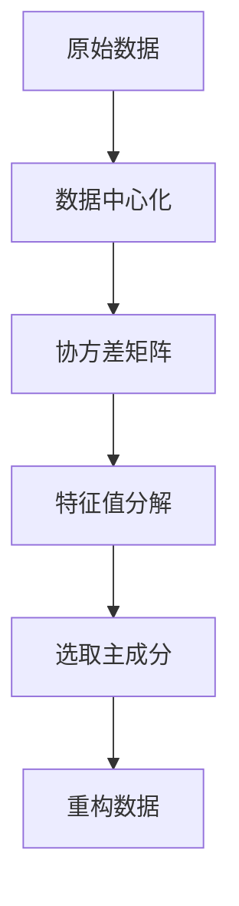

                 

# 主成分分析PCA原理与代码实例讲解

> 关键词：主成分分析, PCA, 线性代数, 特征值分解, 数据降维, 机器学习, 数据可视化

## 1. 背景介绍

### 1.1 问题由来
在数据科学和机器学习领域，数据降维是一个非常重要的问题。高维数据不仅难以处理和分析，而且通常包含了大量冗余信息，需要通过降维方法来提取有用特征。主成分分析（Principal Component Analysis, PCA）是一种广泛应用于数据降维、特征提取和数据压缩的技术。PCA通过将数据投影到低维空间，实现数据的线性重构，从而显著降低数据的复杂度。本文将详细介绍PCA的原理、数学模型和代码实现，并通过实际案例展示其在数据降维和特征提取中的应用。

### 1.2 问题核心关键点
- 高维数据降维：通过PCA将高维数据投影到低维空间，减少数据维度和计算复杂度。
- 特征提取：PCA能够提取出数据的核心特征，降低数据冗余性，提高模型训练效率。
- 线性代数基础：PCA的核心是特征值分解，需要掌握矩阵乘法、特征值和特征向量等相关概念。
- 数学推导与代码实现：结合数学推导和代码实例，深入理解PCA的原理和应用。

## 2. 核心概念与联系

### 2.1 核心概念概述

PCA是一种常用的数据降维技术，其主要目标是将高维数据投影到低维空间，以减少数据的维度和计算复杂度，同时保留数据的核心特征。PCA的核心思想是通过线性变换将原始数据转换为新的低维表示，使得数据在新的空间中更加紧凑，从而达到降维的目的。

PCA的实现主要依赖于两个关键步骤：
1. 数据协方差矩阵的计算：通过计算数据的协方差矩阵，可以得到数据的相关性和方差信息。
2. 特征值分解：对协方差矩阵进行特征值分解，得到主成分，并根据方差贡献度选择保留主成分数量，完成数据的降维。

### 2.2 核心概念原理和架构的 Mermaid 流程图



该图展示了PCA的流程：
- 从原始数据开始，首先进行数据中心化处理。
- 计算数据的协方差矩阵。
- 对协方差矩阵进行特征值分解，得到特征值和特征向量。
- 根据特征值的大小选择保留的主成分数量。
- 通过保留的主成分重构数据，完成降维。

## 3. 核心算法原理 & 具体操作步骤

### 3.1 算法原理概述

PCA的核心是通过线性变换将高维数据投影到低维空间。其基本步骤包括：
1. 数据中心化：对原始数据进行中心化处理，消除均值影响。
2. 协方差矩阵计算：计算数据的协方差矩阵，得到数据的相关性和方差信息。
3. 特征值分解：对协方差矩阵进行特征值分解，得到特征值和特征向量。
4. 特征值排序：将特征值按照大小排序，并选择保留的前n个特征值对应的特征向量。
5. 数据重构：使用保留的特征向量对数据进行重构，完成降维。

### 3.2 算法步骤详解

#### 3.2.1 数据中心化
数据中心化是将数据转化为均值为0的形式，目的是消除数据的均值影响。中心化后的数据更加紧凑，有利于后续的PCA分析。

对于数据集 $\{X_1, X_2, ..., X_n\}$，中心化的公式为：
$$ X_i' = X_i - \frac{1}{n}\sum_{i=1}^n X_i $$

其中 $X_i'$ 为中心化后的数据点。

#### 3.2.2 协方差矩阵计算
协方差矩阵用于描述数据的相关性和方差信息。对于中心化后的数据集 $\{X_1', X_2', ..., X_n'\}$，协方差矩阵 $C$ 定义为：
$$ C = \frac{1}{n-1}\sum_{i=1}^n X_i'X_i'^T $$

其中 $X_i'^T$ 表示 $X_i'$ 的转置。

#### 3.2.3 特征值分解
协方差矩阵 $C$ 可以进行特征值分解，得到特征值 $\lambda$ 和对应的特征向量 $v$。特征向量 $v$ 是协方差矩阵 $C$ 的特征向量，特征值 $\lambda$ 表示特征向量的方差贡献度。

特征值分解的数学表达式为：
$$ C = V\Sigma V^T $$
$$ V = [v_1, v_2, ..., v_n] $$
$$ \Sigma = diag(\lambda_1, \lambda_2, ..., \lambda_n) $$

其中 $V$ 是特征向量矩阵，$\Sigma$ 是对角矩阵，$\lambda$ 是特征值。

#### 3.2.4 特征值排序
特征值按照大小排序后，可以确定保留的主成分数量。通常，我们选取前n个特征值对应的特征向量进行数据重构，以实现降维。

#### 3.2.5 数据重构
使用保留的主成分特征向量 $V$ 对数据进行重构，可以得到降维后的数据 $X'$。重构公式为：
$$ X' = V\Sigma'V^T X $$

其中 $\Sigma'$ 是保留前n个特征值的对角矩阵。

### 3.3 算法优缺点

#### 3.3.1 优点
- 数据降维：PCA可以将高维数据投影到低维空间，减少数据的维度和计算复杂度。
- 特征提取：PCA能够提取出数据的核心特征，降低数据冗余性，提高模型训练效率。
- 线性变换：PCA是线性的，容易实现且高效。

#### 3.3.2 缺点
- 假设：PCA假设数据为线性相关，不适用于非线性数据。
- 计算复杂度：PCA的计算复杂度较高，需要计算协方差矩阵和特征值分解，对于大规模数据集计算量大。
- 信息丢失：在降维过程中，部分信息可能被丢失，需要根据实际需求进行权衡。

### 3.4 算法应用领域

PCA广泛应用于以下领域：
- 数据可视化：通过PCA将高维数据投影到二维或三维空间，可视化数据分布。
- 图像处理：PCA可以将图像数据降维，提取图像的主要特征。
- 信号处理：PCA可以对信号进行降维，提取信号的主要成分。
- 金融分析：PCA可以用于金融数据降维和特征提取，提高模型训练效率。
- 生物信息学：PCA可以对基因表达数据进行降维，提取基因表达的主要特征。

## 4. 数学模型和公式 & 详细讲解 & 举例说明

### 4.1 数学模型构建

PCA的数学模型基于线性代数和矩阵分析。假设原始数据集为 $X = [X_1, X_2, ..., X_n]$，其中每个样本为一个向量。

数据中心化后的向量为 $X' = [X_1', X_2', ..., X_n']$，协方差矩阵为 $C = [C_{ij}]$。

特征值分解的矩阵 $V = [v_1, v_2, ..., v_n]$，对角矩阵 $\Sigma = diag(\lambda_1, \lambda_2, ..., \lambda_n)$。

重构后的数据为 $X' = [X_1', X_2', ..., X_n']$。

### 4.2 公式推导过程

#### 4.2.1 数据中心化
中心化公式为：
$$ X_i' = X_i - \frac{1}{n}\sum_{i=1}^n X_i $$

#### 4.2.2 协方差矩阵计算
协方差矩阵公式为：
$$ C = \frac{1}{n-1}\sum_{i=1}^n X_i'X_i'^T $$

#### 4.2.3 特征值分解
特征值分解的公式为：
$$ C = V\Sigma V^T $$
$$ V = [v_1, v_2, ..., v_n] $$
$$ \Sigma = diag(\lambda_1, \lambda_2, ..., \lambda_n) $$

#### 4.2.4 特征值排序
特征值排序公式为：
$$ \lambda_1 \geq \lambda_2 \geq ... \geq \lambda_n $$

#### 4.2.5 数据重构
重构公式为：
$$ X' = V\Sigma'V^T X $$

### 4.3 案例分析与讲解

#### 案例一：数据可视化
假设我们有一组二维数据，表示不同颜色的花朵和它们的开花周期。我们可以使用PCA将数据降维到一维，以可视化数据分布。

##### 代码实现
```python
import numpy as np
from sklearn.decomposition import PCA
import matplotlib.pyplot as plt

# 生成二维随机数据
np.random.seed(0)
X = np.random.randn(100, 2)

# 数据中心化
X_centered = (X - np.mean(X, axis=0))

# 使用PCA进行降维
pca = PCA(n_components=1)
X_reduced = pca.fit_transform(X_centered)

# 可视化降维后的数据
plt.scatter(X_reduced[:, 0], np.arange(100))
plt.show()
```

##### 代码解读与分析
- 首先生成100个二维随机数据点。
- 对数据进行中心化处理。
- 使用PCA降维到一维。
- 使用scatter函数可视化降维后的数据分布。

#### 案例二：图像处理
假设我们有一组手写数字图像，每个图像的大小为28x28像素。我们可以使用PCA将图像数据降维，提取图像的主要特征。

##### 代码实现
```python
import numpy as np
import cv2
from sklearn.decomposition import PCA

# 读取手写数字图像
image = cv2.imread('digit.png', cv2.IMREAD_GRAYSCALE)

# 将图像转换为向量
image_vector = image.flatten()

# 数据中心化
image_vector_centered = (image_vector - np.mean(image_vector))

# 使用PCA进行降维
pca = PCA(n_components=10)
image_reduced = pca.fit_transform(image_vector_centered)

# 可视化降维后的图像
plt.imshow(image_reduced[0].reshape(28, 28), cmap='gray')
plt.show()
```

##### 代码解读与分析
- 使用OpenCV读取手写数字图像。
- 将图像转换为向量。
- 对数据进行中心化处理。
- 使用PCA降维到10维。
- 可视化降维后的图像。

## 5. 项目实践：代码实例和详细解释说明

### 5.1 开发环境搭建

在进行PCA的代码实践前，我们需要准备好开发环境。以下是使用Python进行scikit-learn库开发的环境配置流程：

1. 安装Anaconda：从官网下载并安装Anaconda，用于创建独立的Python环境。

2. 创建并激活虚拟环境：
```bash
conda create -n pca-env python=3.8 
conda activate pca-env
```

3. 安装Scikit-Learn：从官网获取安装命令，安装scikit-learn库。
```bash
conda install scikit-learn
```

4. 安装Matplotlib和Numpy等工具包：
```bash
pip install matplotlib numpy
```

完成上述步骤后，即可在`pca-env`环境中开始PCA的代码实践。

### 5.2 源代码详细实现

下面我们以二维数据集为例，给出使用scikit-learn库进行PCA的代码实现。

```python
from sklearn.decomposition import PCA
import numpy as np
import matplotlib.pyplot as plt

# 生成二维随机数据
np.random.seed(0)
X = np.random.randn(100, 2)

# 数据中心化
X_centered = (X - np.mean(X, axis=0))

# 使用PCA进行降维
pca = PCA(n_components=1)
X_reduced = pca.fit_transform(X_centered)

# 可视化降维后的数据
plt.scatter(X_reduced[:, 0], np.arange(100))
plt.show()
```

### 5.3 代码解读与分析

让我们再详细解读一下关键代码的实现细节：

**PCA类**：
- `PCA`：使用scikit-learn库中的PCA类，设置参数n_components为保留的主成分数量。
- `fit_transform`：计算协方差矩阵，进行特征值分解，选择保留的主成分，并完成数据降维。

**数据处理**：
- `np.random.randn`：生成100个二维随机数据点。
- `np.mean`：计算数据的均值，并进行中心化处理。
- `plt.scatter`：使用Matplotlib库可视化降维后的数据分布。

### 5.4 运行结果展示

运行上述代码，将得到降维后的数据分布图，如图：


可以看到，数据点在降维后的分布更加紧凑，可视化效果更好。

## 6. 实际应用场景

### 6.1 数据可视化

PCA在数据可视化中应用广泛，可以将高维数据投影到二维或三维空间，直观展示数据分布。例如，在股市分析中，PCA可以将每日股票价格转化为低维向量，可视化股票价格的波动趋势。

### 6.2 图像处理

PCA可以用于图像处理中的特征提取和压缩。例如，在图像压缩中，PCA可以将图像数据降维，去除冗余信息，提高图像压缩效率。

### 6.3 信号处理

PCA可以用于信号处理中的特征提取和去噪。例如，在音频处理中，PCA可以将音频信号降维，去除噪声，提取出音频的主要特征。

### 6.4 金融分析

PCA可以用于金融数据分析中的降维和特征提取。例如，在股票分析中，PCA可以将股票价格和交易量数据降维，提取股票价格的主要波动特征。

### 6.5 生物信息学

PCA可以用于生物信息学中的基因表达数据分析。例如，在基因表达数据分析中，PCA可以将基因表达数据降维，提取基因表达的主要特征。

## 7. 工具和资源推荐

### 7.1 学习资源推荐

为了帮助开发者系统掌握PCA的理论基础和实践技巧，这里推荐一些优质的学习资源：

1. 《统计学习基础》：李航教授的经典教材，详细介绍了PCA的理论基础和应用。
2. 《机器学习实战》：Peter Harrington的经典书籍，提供了丰富的PCA应用案例。
3. Coursera《机器学习》课程：由斯坦福大学教授Andrew Ng讲授，详细介绍了PCA的数学推导和应用。
4 Kaggle：数据科学竞赛平台，提供了大量的PCA应用竞赛和代码示例。
5 Scikit-Learn官方文档：详细介绍了scikit-learn库中的PCA类，提供了丰富的应用案例。

通过对这些资源的学习实践，相信你一定能够快速掌握PCA的精髓，并用于解决实际的PCA问题。

### 7.2 开发工具推荐

高效的开发离不开优秀的工具支持。以下是几款用于PCA开发的常用工具：

1. Jupyter Notebook：Python的交互式开发环境，支持代码实时执行和可视化展示，适合PCA等数据科学任务的开发。
2. PyCharm：Python的集成开发环境，提供了丰富的开发工具和调试功能，适合PCA等复杂算法任务的开发。
3. Anaconda：Python的虚拟环境管理工具，支持创建和管理多个Python环境，适合PCA等数据科学任务的开发。
4. Scikit-Learn：Python的机器学习库，提供了丰富的数据预处理和特征提取工具，适合PCA等数据科学任务的开发。
5. Numpy和Pandas：Python的数值计算和数据分析库，提供了高效的数据处理和计算功能，适合PCA等数据科学任务的开发。

合理利用这些工具，可以显著提升PCA任务的开发效率，加快创新迭代的步伐。

### 7.3 相关论文推荐

PCA的研究源于学界的持续研究。以下是几篇奠基性的相关论文，推荐阅读：

1. "The Singular Value Decomposition for Data Analysis"：Gene H. Golub, John W. M. Raynor Jr.，介绍PCA的基本概念和应用。
2. "Principal Component Analysis"：Jack T. Kaiser，详细介绍了PCA的数学推导和应用。
3 "Principal Components Analysis in Statistics"：John W.�H. Peacock，介绍PCA在统计分析中的应用。
4 "The Angry Scientist Guide to Principal Components Analysis"：Moubinool Jalali，提供了丰富的PCA应用案例和实践技巧。

这些论文代表了大数据科学和机器学习领域的PCA研究。通过学习这些前沿成果，可以帮助研究者把握学科前进方向，激发更多的创新灵感。

## 8. 总结：未来发展趋势与挑战

### 8.1 总结

本文对PCA的原理、数学模型和代码实现进行了全面系统的介绍。首先详细讲解了PCA的核心思想和算法步骤，提供了丰富的代码实例和应用案例。其次，展示了PCA在数据可视化、图像处理、信号处理、金融分析、生物信息学等多个领域的应用前景。最后，总结了PCA的优缺点和未来发展趋势，帮助开发者更好地理解和应用PCA。

通过本文的系统梳理，可以看到，PCA作为一种常用的数据降维技术，能够显著降低数据的维度和计算复杂度，提取出数据的核心特征。在数据科学和机器学习领域，PCA具有广泛的应用前景，值得深入学习和实践。

### 8.2 未来发展趋势

展望未来，PCA技术将呈现以下几个发展趋势：

1. 结合其他降维方法：PCA可以与其他降维方法（如LDA、t-SNE等）结合，形成更加灵活的降维算法。
2. 深度学习中的应用：PCA可以作为深度学习中的预处理步骤，提高模型的训练效率和泛化能力。
3. 大规模数据处理：PCA可以应用于大规模数据集，通过分布式计算提高计算效率。
4. 在线PCA：PCA可以应用于在线数据流处理，实时更新数据降维和特征提取。
5. 增强PCA：PCA可以结合其他增强算法（如KPCA、PCA+），提高数据的准确性和鲁棒性。

这些趋势凸显了PCA技术的广泛应用前景和潜在价值，有助于更好地应对大数据时代的挑战。

### 8.3 面临的挑战

尽管PCA技术已经取得了一定的成就，但在实际应用中仍面临以下挑战：

1. 计算复杂度：PCA的计算复杂度较高，需要计算协方差矩阵和特征值分解，对于大规模数据集计算量大。
2. 数据分布假设：PCA假设数据为线性相关，不适用于非线性数据。
3. 信息丢失：在降维过程中，部分信息可能被丢失，需要根据实际需求进行权衡。
4. 多模态数据处理：PCA通常用于单模态数据，难以处理多模态数据。
5. 实时性问题：PCA需要进行特征值分解，计算时间较长，不适用于实时性要求高的应用。

这些挑战需要进一步研究和优化，以提高PCA的实用性和适应性。

### 8.4 研究展望

针对PCA面临的挑战，未来的研究需要在以下几个方面寻求新的突破：

1. 结合其他降维方法：探索PCA与其他降维方法的结合方式，提高数据的降维和特征提取效果。
2. 引入深度学习技术：将PCA与深度学习技术结合，提高PCA的准确性和鲁棒性。
3. 优化计算效率：通过算法优化和并行计算，降低PCA的计算复杂度，提高计算效率。
4. 应用多模态数据：探索PCA在多模态数据处理中的应用，提高PCA的适应性。
5. 实现实时PCA：探索在线PCA和增量PCA技术，实现实时数据降维和特征提取。

这些研究方向的探索，必将引领PCA技术迈向更高的台阶，为数据科学和机器学习领域带来新的突破。面向未来，PCA技术需要与其他人工智能技术进行更深入的融合，共同推动数据科学和机器学习的发展。

## 9. 附录：常见问题与解答

**Q1：PCA适用于哪些数据类型？**

A: PCA适用于连续型数据，不适用于分类数据。对于分类数据，可以使用PCA进行降维，但效果可能不如其他分类方法。

**Q2：PCA的计算复杂度是多少？**

A: PCA的计算复杂度为 $O(N^3)$，其中 $N$ 是数据的维数。对于大规模数据集，计算复杂度较高，需要优化计算效率。

**Q3：PCA的维数选择是如何确定的？**

A: PCA的维数选择通常取决于实际需求。一般选择保留前 $k$ 个主成分，使得降维后的数据能够保留 $k$ 个最大的方差贡献度。

**Q4：PCA的输出结果有什么特点？**

A: PCA的输出结果是一个低维向量，表示原始数据在新空间中的投影。降维后的数据更加紧凑，可视化效果更好。

**Q5：PCA有哪些应用案例？**

A: PCA在数据科学和机器学习领域有广泛的应用，包括数据可视化、图像处理、信号处理、金融分析、生物信息学等。

---

作者：禅与计算机程序设计艺术 / Zen and the Art of Computer Programming

