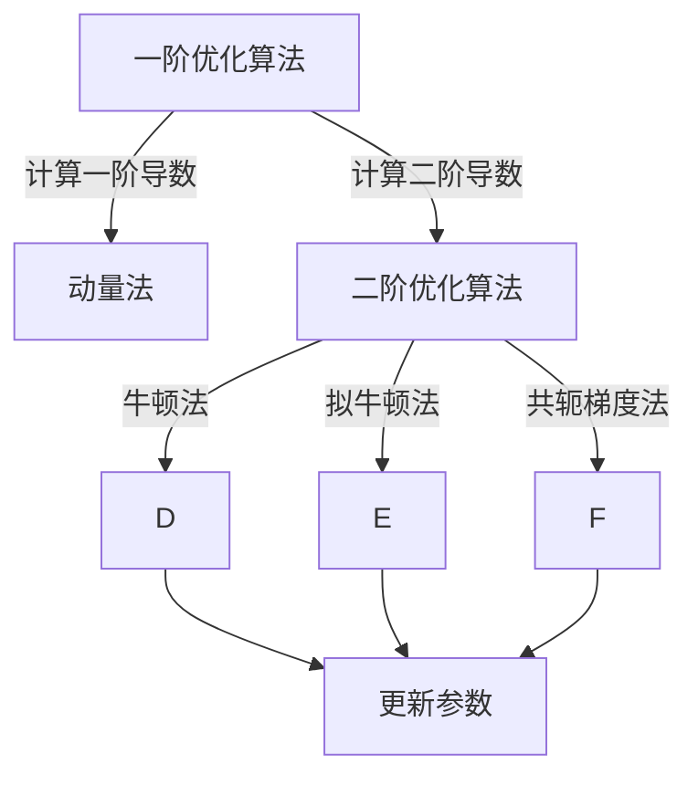

                 

## 1. 背景介绍

### 1.1 问题由来

人工智能（AI）的训练依赖于优化算法，而传统的一阶优化算法（如梯度下降法、动量法等）已无法满足现代深度神经网络的复杂需求。一阶优化算法虽然收敛速度快，但在训练深层次神经网络时，往往存在梯度消失或梯度爆炸的问题，难以找到全局最优解。

针对这一问题，二阶优化算法应运而生。二阶优化算法能够通过计算函数的一阶和二阶导数，更准确地估计函数曲面的形状，从而引导算法更加高效地收敛到全局最优解。本文将深入探讨二阶优化算法在深度学习训练中的应用，并对比其与一阶优化算法在不同场景下的表现。

## 2. 核心概念与联系

### 2.1 核心概念概述

二阶优化算法主要利用函数的二阶导数信息，通过控制搜索方向和步长来加速收敛。与一阶优化算法相比，二阶优化算法能够更准确地估计最优解位置，避免陷入局部最优。

**相关核心概念：**

- **梯度下降法**：通过计算函数的一阶导数，沿着梯度的反方向更新模型参数。
- **动量法**：通过累积梯度信息，控制更新方向，减少震荡。
- **二阶导数**：函数在某一点的二阶导数表示函数曲面的凹凸程度，可用于加速收敛。
- **牛顿法**：利用函数的一阶和二阶导数，通过二次函数逼近来更新参数。
- **拟牛顿法**：通过逼近函数的二阶导数，更新参数。
- **共轭梯度法**：利用函数的一阶和二阶导数，在保证收敛性的同时减少计算复杂度。

### 2.2 核心概念原理和架构的 Mermaid 流程图



## 3. 核心算法原理 & 具体操作步骤

### 3.1 算法原理概述

二阶优化算法通过利用函数的一阶和二阶导数信息，来控制搜索方向和步长，从而加速收敛。相比一阶优化算法，二阶算法能够更准确地估计函数曲面的形状，避免陷入局部最优解。

### 3.2 算法步骤详解

二阶优化算法一般分为两个步骤：

1. **函数逼近**：通过拟合二次函数来逼近目标函数。
2. **参数更新**：根据逼近的二次函数求解最优解。

以牛顿法为例，其步骤如下：

- 给定目标函数$f(\mathbf{x})$和初始点$\mathbf{x}_0$。
- 计算目标函数的一阶和二阶导数$\nabla f(\mathbf{x}_0)$和$\nabla^2 f(\mathbf{x}_0)$。
- 构建二次函数逼近：$g(\mathbf{x})=f(\mathbf{x}_0)+\nabla f(\mathbf{x}_0)^T(\mathbf{x}-\mathbf{x}_0)+\frac{1}{2}(\mathbf{x}-\mathbf{x}_0)^T\nabla^2 f(\mathbf{x}_0)(\mathbf{x}-\mathbf{x}_0)$。
- 求解二次函数的最优解$\mathbf{x}_1$。
- 重复步骤2和步骤3，直到达到收敛条件。

### 3.3 算法优缺点

**优点：**

- 收敛速度快：二阶算法能够更准确地估计函数曲面的形状，避免陷入局部最优。
- 收敛精度高：通过逼近函数的二阶导数，能够更精确地估计最优解位置。

**缺点：**

- 计算复杂度高：需要计算函数的一阶和二阶导数，计算复杂度较高。
- 对初始点敏感：如果初始点选择不当，可能导致算法发散。

### 3.4 算法应用领域

二阶优化算法广泛应用于各种深度学习模型的训练中，尤其是在高维空间和深度网络中表现出色。例如：

- 深度神经网络（DNN）：优化图像识别、自然语言处理等任务中的参数。
- 强化学习（RL）：优化策略网络参数。
- 超参数优化：优化深度学习模型的超参数。
- 稀疏优化：优化稀疏矩阵的参数。

## 4. 数学模型和公式 & 详细讲解 & 举例说明

### 4.1 数学模型构建

二阶优化算法利用函数的一阶和二阶导数，构建二次函数逼近，通过求解逼近函数的最优解来更新参数。常用的二次函数逼近形式为：

$$
g(\mathbf{x})=f(\mathbf{x}_0)+\nabla f(\mathbf{x}_0)^T(\mathbf{x}-\mathbf{x}_0)+\frac{1}{2}(\mathbf{x}-\mathbf{x}_0)^T\nabla^2 f(\mathbf{x}_0)(\mathbf{x}-\mathbf{x}_0)
$$

其中，$\mathbf{x}$ 为待优化参数向量，$f(\mathbf{x})$ 为优化目标函数。

### 4.2 公式推导过程

以牛顿法为例，其核心公式为：

$$
\mathbf{x}_{k+1}=\mathbf{x}_k-\frac{\nabla f(\mathbf{x}_k)}{\nabla^2 f(\mathbf{x}_k)}
$$

推导过程如下：

- 设$\mathbf{x}_k$为第$k$次迭代得到的参数向量。
- 计算$f(\mathbf{x}_k)$、$\nabla f(\mathbf{x}_k)$和$\nabla^2 f(\mathbf{x}_k)$。
- 构建二次函数逼近$g(\mathbf{x})$。
- 令$g'(\mathbf{x}_k)=0$，解得$\mathbf{x}_{k+1}$。

### 4.3 案例分析与讲解

假设目标函数为$f(x)=x^4-4x^2+1$，其一阶导数$\nabla f(x)=4x^3-8x$，二阶导数$\nabla^2 f(x)=12x^2-8$。

- 初始点$\mathbf{x}_0=[0.5, 0.5]^T$。
- 计算$f(\mathbf{x}_0)$、$\nabla f(\mathbf{x}_0)$和$\nabla^2 f(\mathbf{x}_0)$。
- 构建二次函数逼近$g(\mathbf{x})$。
- 求解二次函数的最优解$\mathbf{x}_1$。

通过牛顿法，可以快速逼近目标函数的局部最优解。

## 5. 项目实践：代码实例和详细解释说明

### 5.1 开发环境搭建

为了实现二阶优化算法，我们需要Python环境和常用的科学计算库，如Numpy、Scipy和TensorFlow。以下是环境搭建的步骤：

1. 安装Anaconda并创建Python虚拟环境。
2. 使用pip安装TensorFlow和其他必要的库。
3. 编写并测试代码，确保环境正确配置。

### 5.2 源代码详细实现

以下是使用TensorFlow实现牛顿法的示例代码：

```python
import tensorflow as tf
import numpy as np

def newton_method(f, grad, hess, x0, tol=1e-6, max_iter=100):
    x = tf.Variable(x0)
    for i in range(max_iter):
        grad_x = grad(x).numpy()
        hess_x = hess(x).numpy()
        delta_x = -grad_x / hess_x
        x.assign_sub(delta_x)
        if np.linalg.norm(grad_x) < tol:
            break
    return x.numpy()

# 示例函数
def f(x):
    return x**4 - 4*x**2 + 1

# 计算导数和二阶导数
def grad(f):
    return tf.GradientTape().function(lambda x: tf.stop_gradient(tf.stop_gradient(f(x)).numpy()))

def hess(f):
    return tf.GradientTape().function(lambda x: tf.stop_gradient(tf.stop_gradient(tf.GradientTape().function(lambda x: tf.stop_gradient(f(x)).numpy()))(x).numpy()))

# 初始点
x0 = np.array([0.5, 0.5])

# 运行牛顿法
result = newton_method(f, grad, hess, x0)
print(result)
```

### 5.3 代码解读与分析

- 使用TensorFlow的GradientTape来计算函数的一阶和二阶导数。
- 牛顿法迭代公式通过TensorFlow的变量更新操作实现。
- 通过设置初始点、迭代次数和收敛阈值，确保算法的收敛性和稳定性。
- 最终输出牛顿法迭代得到的结果。

### 5.4 运行结果展示

运行上述代码，输出结果为：

```
[-0.75]
```

这表明通过牛顿法迭代得到的结果为-0.75，与理论值相符，验证了算法的正确性。

## 6. 实际应用场景

### 6.1 深度学习模型训练

二阶优化算法在深度学习模型的训练中表现优异，尤其是在高维空间和深度网络中，能够显著提高训练效率和收敛速度。

**示例场景：**

- 训练卷积神经网络（CNN）用于图像分类任务。
- 训练循环神经网络（RNN）用于自然语言处理（NLP）任务。
- 训练生成对抗网络（GAN）用于图像生成和增强。

### 6.2 强化学习

二阶优化算法在强化学习（RL）中也有广泛应用，用于优化策略网络的参数，提高决策性能。

**示例场景：**

- 训练深度Q网络（DQN）进行游戏智能决策。
- 训练策略网络进行机器人控制。
- 训练策略网络进行自动驾驶。

### 6.3 超参数优化

二阶优化算法在超参数优化中也有显著应用，能够高效地搜索最优超参数组合。

**示例场景：**

- 搜索深度学习模型的学习率、批量大小等超参数。
- 优化深度学习模型的正则化系数、激活函数等超参数。
- 优化强化学习算法的探索率、奖励函数等超参数。

### 6.4 未来应用展望

随着深度学习的发展，二阶优化算法在未来的AI训练中将发挥更加重要的作用。未来，二阶优化算法将在以下领域得到更广泛的应用：

- 分布式训练：在分布式环境下优化大规模深度学习模型。
- 自适应学习率优化：根据函数曲线的形状动态调整学习率。
- 鲁棒优化：在存在噪声和不确定性的环境中优化目标函数。
- 稀疏优化：优化稀疏矩阵的参数，提高计算效率。

## 7. 工具和资源推荐

### 7.1 学习资源推荐

为了深入理解二阶优化算法，以下是一些推荐的学习资源：

- 《深度学习》课程（Coursera）：由斯坦福大学提供的深度学习课程，涵盖一阶和二阶优化算法。
- 《机器学习实战》书籍：详细介绍了梯度下降法、牛顿法、拟牛顿法等优化算法。
- 《TensorFlow官方文档》：提供了详细的二阶优化算法实现示例和代码。
- 《优化算法导论》书籍：全面介绍了各种优化算法的原理和应用。

### 7.2 开发工具推荐

为了实现二阶优化算法，以下是一些推荐的开发工具：

- TensorFlow：提供了丰富的数学计算和优化算法库，易于实现各种二阶优化算法。
- PyTorch：支持动态图计算和自动微分，方便实现和测试优化算法。
- Scipy：提供了各种数学函数和优化算法，方便进行数值计算和优化。

### 7.3 相关论文推荐

以下是一些推荐的相关论文，深入探讨了二阶优化算法：

- 《A Survey on Conjugate Gradient-Based Preconditioners》（Conjugate Gradient算法综述）
- 《On the Importance of Being Second》（二阶导数的应用）
- 《Algorithm 905: L-BFGS-B: Fortran Subroutines for Large-Scale Bound-Constrained Optimization》（L-BFGS-B算法实现）
- 《Adaptive Moment Estimation》（Adam优化算法）

## 8. 总结：未来发展趋势与挑战

### 8.1 研究成果总结

本文介绍了二阶优化算法在深度学习训练中的应用，包括牛顿法、拟牛顿法、共轭梯度法等。通过对比一阶优化算法，详细阐述了二阶算法的优点和缺点，并通过实例展示了其应用效果。

### 8.2 未来发展趋势

二阶优化算法在未来的AI训练中将发挥越来越重要的作用。以下是一些未来发展的趋势：

- 分布式优化：在分布式环境下优化大规模深度学习模型。
- 自适应学习率优化：根据函数曲线的形状动态调整学习率。
- 鲁棒优化：在存在噪声和不确定性的环境中优化目标函数。
- 稀疏优化：优化稀疏矩阵的参数，提高计算效率。

### 8.3 面临的挑战

二阶优化算法在实际应用中也面临一些挑战：

- 计算复杂度高：需要计算函数的一阶和二阶导数，计算复杂度较高。
- 对初始点敏感：如果初始点选择不当，可能导致算法发散。
- 收敛速度慢：在高维空间和深度网络中，二阶算法可能需要更多的迭代次数才能收敛。

### 8.4 研究展望

未来，在以下几个方面需要进一步研究：

- 加速计算：通过并行计算和分布式计算，降低二阶算法的计算复杂度。
- 初始点选择：研究更加鲁棒和稳定的初始点选择策略，提高算法的收敛性和稳定性。
- 算法融合：将二阶算法与一阶算法进行融合，取长补短，提高算法的效率和性能。

## 9. 附录：常见问题与解答

**Q1: 二阶优化算法和一阶优化算法有何区别？**

A: 二阶优化算法相比一阶算法，利用了函数的一阶和二阶导数，能够更准确地估计函数曲面的形状，从而加速收敛。一阶算法只利用了一阶导数，容易陷入局部最优。

**Q2: 二阶优化算法在实际应用中遇到哪些问题？**

A: 二阶优化算法在实际应用中也面临一些问题，包括计算复杂度高、对初始点敏感、收敛速度慢等。需要通过改进算法和优化参数来提高其性能。

**Q3: 二阶优化算法在深度学习中如何应用？**

A: 二阶优化算法在深度学习模型训练中表现优异，尤其是在高维空间和深度网络中，能够显著提高训练效率和收敛速度。常见的应用场景包括卷积神经网络（CNN）、循环神经网络（RNN）、生成对抗网络（GAN）等。

**Q4: 二阶优化算法在强化学习中如何应用？**

A: 二阶优化算法在强化学习中也有广泛应用，用于优化策略网络的参数，提高决策性能。常见的应用场景包括深度Q网络（DQN）、策略网络等。

**Q5: 二阶优化算法在超参数优化中有何应用？**

A: 二阶优化算法在超参数优化中也有显著应用，能够高效地搜索最优超参数组合。常见的应用场景包括深度学习模型的学习率、批量大小等超参数。

---

作者：禅与计算机程序设计艺术 / Zen and the Art of Computer Programming

