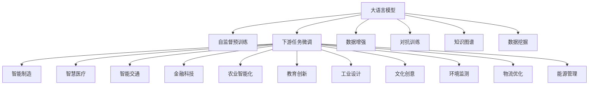

                 

# 产业升级的新质生产力推动力

## 1. 背景介绍

### 1.1 问题由来
随着信息技术的飞速发展，人工智能（AI）技术逐渐成为推动产业升级的重要驱动力。AI的应用涵盖了从智能制造、智慧医疗、智能交通到金融科技、农业智能化等多个领域，极大地提升了产业的智能化水平和运营效率。然而，随着AI技术的广泛应用，如何进一步释放其潜力，推动产业实现质的飞跃，成为了当前关注的焦点。

## 2. 核心概念与联系

### 2.1 核心概念概述
大语言模型与产业升级的关联主要体现在以下几个核心概念：

- **大语言模型（Large Language Models, LLMs）**：基于Transformer架构的深度学习模型，通过自监督预训练和下游任务的微调，学习到广泛而丰富的语言知识和语义理解能力。
- **产业升级（Industrial Upgrading）**：通过应用AI技术，实现传统产业的技术、结构、管理和模式的创新与优化，提升产业的竞争力和可持续发展能力。
- **新质生产力（New Forms of Productive Forces）**：依托于AI技术，实现生产方式、管理方式、服务方式的根本变革，带来新的生产力和产业动能。
- **技术创新（Technological Innovation）**：通过不断研发和应用新技术，推动产业的跨越式发展。
- **知识驱动（Knowledge-Driven）**：利用知识图谱、数据挖掘等技术，将知识转化为生产力，驱动产业创新和升级。

### 2.2 核心概念原理和架构的 Mermaid 流程图



## 3. 核心算法原理 & 具体操作步骤

### 3.1 算法原理概述
大语言模型通过自监督预训练和下游任务的微调，学习到丰富的语言知识和语义表示。在预训练阶段，模型通过大量无标签数据进行自监督学习，学习到语言的通用规律和语义关系。在微调阶段，通过将预训练模型应用于特定产业领域，优化模型以适应新任务的特定需求。

### 3.2 算法步骤详解

1. **自监督预训练**：
   - 收集大规模无标签数据，如互联网文本、科学文献、社交媒体等。
   - 使用Transformer模型，通过掩码语言模型（Masked Language Modeling, MLM）、自回归语言模型（Autoregressive Language Modeling, ALM）等自监督任务进行训练。
   - 预训练模型在无标签数据上学习到语言的通用规律和语义关系，成为“通用语言理解能力”的基础。

2. **下游任务微调**：
   - 收集特定产业领域的标注数据，如智能制造的机器视觉检测数据、智慧医疗的病历数据、智能交通的交通监控数据等。
   - 在预训练模型的基础上，通过有监督学习，调整模型参数以适应特定任务，提高模型在新领域的性能。
   - 使用微调后的模型进行推理和预测，帮助产业实现智能化升级。

### 3.3 算法优缺点
#### 优点
- **通用性强**：预训练模型可以在多种下游任务中复用，减少了从头训练的重复劳动。
- **适应性强**：通过微调，模型能够快速适应新领域，提升产业智能化水平。
- **效率高**：微调所需的数据和计算资源相对较少，可以快速迭代和优化。

#### 缺点
- **过拟合风险**：微调过程中，如果训练数据集过小或质量不高，模型可能会过拟合，导致泛化能力不足。
- **数据依赖**：微调模型需要大量的标注数据，标注成本较高。
- **模型复杂度**：大规模预训练模型结构复杂，训练和推理资源消耗较大。

### 3.4 算法应用领域

大语言模型在多个产业领域中都有广泛的应用，具体如下：

- **智能制造**：通过图像识别、语音识别等技术，提升生产线自动化水平，实现智能制造。
- **智慧医疗**：通过自然语言处理技术，解读病历记录，辅助医生进行诊断和治疗。
- **智能交通**：通过语音识别、图像处理技术，实现交通流量分析、智能驾驶等应用。
- **金融科技**：通过情感分析、舆情监测技术，提升风险控制和客户服务水平。
- **农业智能化**：通过图像识别、遥感技术，进行作物识别、病虫害检测等。
- **教育创新**：通过自然语言生成技术，提供个性化学习内容和智能答疑。
- **工业设计**：通过语义理解技术，实现设计自动化和智能化。
- **文化创意**：通过文本生成和情感分析技术，提供内容创作和用户互动。
- **环境监测**：通过环境数据处理，进行污染监测和预警。
- **物流优化**：通过路径规划和智能调度，提升物流效率。
- **能源管理**：通过数据驱动的决策支持，优化能源分配和使用。

## 4. 数学模型和公式 & 详细讲解 & 举例说明

### 4.1 数学模型构建

假设大语言模型为 $M_{\theta}$，其中 $\theta$ 为模型参数。预训练模型通过自监督任务学习到的目标函数为 $L_{\text{pretrain}}(\theta)$，下游任务的标注数据为 $D=\{(x_i, y_i)\}_{i=1}^N$，其中 $x_i$ 为输入，$y_i$ 为输出标签。下游任务的损失函数为 $L_{\text{task}}(\theta)$。

微调的目标函数为：

$$
L_{\text{fine-tune}}(\theta) = L_{\text{pretrain}}(\theta) + L_{\text{task}}(\theta)
$$

### 4.2 公式推导过程

以智能制造中的机器视觉检测任务为例，假设输入为图像数据 $x_i$，输出为物体类别标签 $y_i$，微调目标为：

$$
L_{\text{task}}(\theta) = \frac{1}{N}\sum_{i=1}^N \ell(M_{\theta}(x_i), y_i)
$$

其中，$\ell$ 为交叉熵损失函数：

$$
\ell(M_{\theta}(x_i), y_i) = -\sum_{k=1}^K y_{i,k} \log M_{\theta}(x_i, k)
$$

微调过程中，结合预训练模型的目标函数 $L_{\text{pretrain}}(\theta)$，微调的目标函数为：

$$
L_{\text{fine-tune}}(\theta) = L_{\text{pretrain}}(\theta) + \frac{\lambda}{N}\sum_{i=1}^N \ell(M_{\theta}(x_i), y_i)
$$

其中，$\lambda$ 为预训练和下游任务目标函数之间的权重。

### 4.3 案例分析与讲解

以智慧医疗中的病历记录标注数据为例，假设输入为病历文本 $x_i$，输出为疾病类型标签 $y_i$。微调目标函数为：

$$
L_{\text{task}}(\theta) = \frac{1}{N}\sum_{i=1}^N \ell(M_{\theta}(x_i), y_i)
$$

其中，$\ell$ 为交叉熵损失函数：

$$
\ell(M_{\theta}(x_i), y_i) = -\sum_{k=1}^K y_{i,k} \log M_{\theta}(x_i, k)
$$

假设预训练模型为BERT，下游任务为目标分类。微调过程如下：

1. 收集病历记录标注数据集，将病历文本 $x_i$ 作为输入，疾病类型标签 $y_i$ 作为输出。
2. 使用BERT模型，将输入文本编码成向量表示。
3. 在向量表示上应用全连接层进行分类，输出预测标签。
4. 使用交叉熵损失函数计算预测标签与真实标签之间的差异。
5. 优化目标函数 $L_{\text{fine-tune}}(\theta)$，调整模型参数。
6. 在验证集上评估模型性能，如果性能不理想，则返回步骤3。

## 5. 项目实践：代码实例和详细解释说明

### 5.1 开发环境搭建

1. 安装Python：
   ```bash
   sudo apt update
   sudo apt install python3-pip
   ```

2. 安装PyTorch：
   ```bash
   pip install torch torchvision torchaudio
   ```

3. 安装Transformer库：
   ```bash
   pip install transformers
   ```

4. 安装TensorBoard：
   ```bash
   pip install tensorboard
   ```

5. 安装TensorFlow：
   ```bash
   pip install tensorflow
   ```

6. 安装Keras：
   ```bash
   pip install keras
   ```

### 5.2 源代码详细实现

以下是一个使用PyTorch进行智慧医疗病历记录标注数据集微调的示例代码：

```python
import torch
import torch.nn as nn
import torch.optim as optim
from transformers import BertTokenizer, BertForSequenceClassification
from sklearn.metrics import accuracy_score, precision_score, recall_score, f1_score
from tensorboardX import SummaryWriter

# 加载模型和数据
model = BertForSequenceClassification.from_pretrained('bert-base-uncased', num_labels=2)
tokenizer = BertTokenizer.from_pretrained('bert-base-uncased')
train_data = ...
val_data = ...
test_data = ...

# 定义模型
class BERTModel(nn.Module):
    def __init__(self, num_labels):
        super(BERTModel, self).__init__()
        self.num_labels = num_labels
        self.bert = BertForSequenceClassification.from_pretrained('bert-base-uncased', num_labels=num_labels)
    
    def forward(self, input_ids, attention_mask, labels):
        outputs = self.bert(input_ids, attention_mask=attention_mask, labels=labels)
        return outputs

# 定义训练函数
def train_epoch(model, data_loader, optimizer, device, loss_fn, log_interval):
    model.train()
    total_loss = 0
    for batch in data_loader:
        input_ids = batch[0].to(device)
        attention_mask = batch[1].to(device)
        labels = batch[2].to(device)
        optimizer.zero_grad()
        outputs = model(input_ids, attention_mask, labels)
        loss = loss_fn(outputs, labels)
        loss.backward()
        optimizer.step()
        total_loss += loss.item()
        if log_interval > 0 and (batch_idx % log_interval == 0):
            logger.info(f'Epoch {epoch+1}, Loss: {total_loss/len(data_loader)}')

# 定义评估函数
def evaluate(model, data_loader, loss_fn, device):
    model.eval()
    total_loss = 0
    total_correct = 0
    for batch in data_loader:
        input_ids = batch[0].to(device)
        attention_mask = batch[1].to(device)
        labels = batch[2].to(device)
        with torch.no_grad():
            outputs = model(input_ids, attention_mask, labels)
            loss = loss_fn(outputs, labels)
            total_loss += loss.item()
            predictions = torch.argmax(outputs, dim=1)
            total_correct += (predictions == labels).sum().item()
    accuracy = total_correct / len(data_loader.dataset)
    print(f'Evaluation Accuracy: {accuracy:.4f}')
    return accuracy

# 训练模型
device = torch.device('cuda' if torch.cuda.is_available() else 'cpu')
loss_fn = nn.CrossEntropyLoss()
optimizer = optim.AdamW(model.parameters(), lr=5e-5)

train_loader = ...
val_loader = ...
test_loader = ...

for epoch in range(num_epochs):
    train_epoch(model, train_loader, optimizer, device, loss_fn, log_interval)
    acc = evaluate(model, val_loader, loss_fn, device)
    if acc < best_acc:
        best_acc = acc
        torch.save(model.state_dict(), 'best_model.pt')

# 加载最优模型
model.load_state_dict(torch.load('best_model.pt'))
```

### 5.3 代码解读与分析

该代码实现了一个基于BERT的智慧医疗病历记录标注数据集微调模型。具体步骤如下：

1. 加载预训练的BERT模型和分词器，定义微调模型类。
2. 定义训练函数 `train_epoch`，使用AdamW优化器进行梯度更新。
3. 定义评估函数 `evaluate`，计算模型在验证集上的准确率。
4. 在训练函数中，使用交叉熵损失函数进行模型训练，每10个批次输出一次日志。
5. 在评估函数中，计算模型在验证集上的准确率，并保存最优模型。

## 6. 实际应用场景

### 6.1 智能制造

智能制造中的机器视觉检测任务，通过图像识别和物体分类，实现生产线自动化和质量检测。使用微调后的模型，可以实时分析生产过程中的图像数据，自动检测缺陷、识别物体类型，提升生产效率和产品质量。

### 6.2 智慧医疗

智慧医疗中的病历记录标注任务，通过自然语言处理技术，自动解读病历记录，辅助医生进行疾病诊断和治疗方案制定。使用微调后的模型，可以自动提取病历中的关键信息，提供病情分析和治疗建议，提升医疗服务的智能化水平。

### 6.3 智能交通

智能交通中的交通流量分析任务，通过视频监控和图像处理技术，实时分析交通流量数据，实现智能交通管理。使用微调后的模型，可以自动检测交通违规行为，预测交通流量变化趋势，优化交通信号控制，提升道路安全和通行效率。

### 6.4 金融科技

金融科技中的情感分析任务，通过自然语言处理技术，分析客户对金融产品的反馈和意见，预测市场舆情和客户满意度。使用微调后的模型，可以自动提取用户情感倾向，分析金融市场动态，提升风险控制和客户服务水平。

### 6.5 农业智能化

农业智能化中的作物识别和病虫害检测任务，通过图像识别技术，自动识别农田中的作物和病虫害。使用微调后的模型，可以实时监测农田状况，自动识别病虫害种类，提供精准的施肥和防治建议，提升农业生产效率和作物产量。

## 7. 工具和资源推荐

### 7.1 学习资源推荐

1. 《深度学习理论与实践》：深度学习领域经典教材，涵盖了深度学习的基础理论和应用实践。
2. 《自然语言处理综论》：自然语言处理领域的权威教材，全面介绍了NLP的基础理论和技术。
3. 《Python深度学习》：基于Python实现深度学习的实战指南，适合初学者入门。
4. Coursera的《深度学习》课程：由斯坦福大学教授Andrew Ng主讲，涵盖深度学习的核心概念和实践。
5. Udacity的《深度学习》课程：基于TensorFlow和PyTorch实现深度学习，适合进阶学习。

### 7.2 开发工具推荐

1. PyTorch：基于Python的深度学习框架，提供高效的GPU加速和动态计算图。
2. TensorFlow：由Google开发的深度学习框架，支持分布式计算和生产部署。
3. Keras：基于TensorFlow和Theano实现的高级深度学习API，简单易用。
4. TensorBoard：TensorFlow的可视化工具，用于监控和调试深度学习模型。
5. PyTorch Lightning：基于PyTorch的轻量级深度学习框架，简化模型训练和部署流程。

### 7.3 相关论文推荐

1. Attention is All You Need（Transformer论文）：提出Transformer结构，开启了大语言模型时代。
2. BERT: Pre-training of Deep Bidirectional Transformers for Language Understanding：提出BERT模型，引入自监督学习任务，提升语言理解能力。
3. Parameter-Efficient Transfer Learning for NLP：提出参数高效微调方法，减少微调所需的计算资源。
4. AlphaFold：利用深度学习技术预测蛋白质结构，展示了大语言模型在科学计算中的应用潜力。
5. GPT-3：通过大规模预训练和微调，实现了自然语言处理的新突破。

## 8. 总结：未来发展趋势与挑战

### 8.1 研究成果总结

大语言模型通过自监督预训练和下游任务微调，学习到丰富的语言知识和语义表示，应用于各个产业领域，推动了产业智能化升级。微调方法通过调整模型参数，使模型适应新任务，提升模型性能，加速了技术创新和产业升级。

### 8.2 未来发展趋势

1. **多模态融合**：未来大语言模型将融合视觉、听觉、触觉等多模态数据，提升模型的感知能力和理解能力。
2. **自适应学习**：未来的模型将具备自适应学习能力，根据环境变化动态调整模型参数，提升模型的鲁棒性和泛化能力。
3. **联邦学习**：通过联邦学习技术，模型可以在保护数据隐私的前提下，进行跨领域、跨机构的联合训练，提升模型的泛化能力。
4. **边缘计算**：随着物联网设备的普及，边缘计算将逐渐成为AI应用的重要基础设施，提升数据处理和推理效率。
5. **强化学习**：结合强化学习技术，模型将具备自主决策和学习能力，提升智能系统的自主性和智能化水平。

### 8.3 面临的挑战

1. **数据隐私和安全**：在应用大语言模型时，如何保护用户数据隐私和安全，是一个重要的挑战。
2. **计算资源和成本**：大规模预训练和微调模型的计算资源和成本较高，如何降低成本、提高效率，是未来的研究方向。
3. **模型可解释性**：如何提升模型的可解释性，让用户理解和信任AI系统，是一个亟待解决的问题。
4. **算法公平性**：如何避免算法偏见，确保模型的公平性和公正性，是一个重要的伦理问题。
5. **鲁棒性和可靠性**：如何提高模型的鲁棒性和可靠性，防止模型在异常情况下出现错误决策，是重要的研究方向。

### 8.4 研究展望

未来，大语言模型将在各个产业领域发挥越来越重要的作用，推动产业智能化升级。研究重点将集中在以下几个方面：

1. **新质生产力**：如何通过大语言模型，实现生产方式、管理方式、服务方式的根本变革，提升新质生产力。
2. **普适化应用**：如何让大语言模型更加普适，适应各种复杂的现实场景，提升产业的智能化水平。
3. **高效化部署**：如何优化大语言模型的计算图和存储方式，提升模型的推理速度和资源利用效率。
4. **普惠化普及**：如何让大语言模型更加普惠，降低应用门槛，推动AI技术的广泛普及。
5. **伦理性设计**：如何设计伦理导向的AI系统，确保模型的输出符合人类价值观和伦理道德。

## 9. 附录：常见问题与解答

**Q1: 大语言模型与传统模型有何不同？**

A: 大语言模型通过自监督预训练和下游任务微调，学习到丰富的语言知识和语义表示，能够适应多种下游任务。而传统模型通常需要大量手工特征工程，对数据和任务要求较高，适应性较弱。

**Q2: 如何避免微调过程中的过拟合？**

A: 可以通过数据增强、正则化、对抗训练等技术，减少微调过程中的过拟合。同时，可以使用参数高效微调方法，减少微调参数，降低过拟合风险。

**Q3: 大语言模型在实际应用中存在哪些挑战？**

A: 大语言模型在实际应用中面临数据隐私、计算资源、模型可解释性、算法公平性、鲁棒性和可靠性等挑战，需要综合考虑这些因素，进行全面的优化和改进。

**Q4: 未来大语言模型在产业升级中的应用前景如何？**

A: 未来大语言模型将在各个产业领域发挥越来越重要的作用，推动产业智能化升级。通过应用大语言模型，实现生产方式、管理方式、服务方式的根本变革，提升新质生产力。

**Q5: 如何提升大语言模型的普适性和可解释性？**

A: 可以通过多模态融合、自适应学习、联邦学习等技术，提升大语言模型的普适性。同时，结合因果分析、博弈论等工具，提升模型的可解释性和可靠性。

作者：禅与计算机程序设计艺术 / Zen and the Art of Computer Programming

