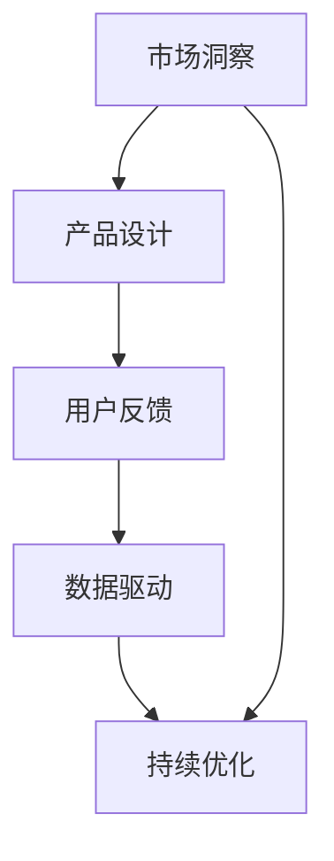

                 

# 产品驱动增长：Lepton AI战略专注产品优势契合度

> 关键词：产品驱动增长, Lepton AI, 产品优势契合度, 市场洞察, 用户反馈, 数据驱动, AI战略, 增长引擎

## 1. 背景介绍

在现代商业竞争中，数据驱动增长已成为共识，而产品驱动增长则是在此基础上的更高追求。Lepton AI是一家专注于AI技术驱动的增长策略的公司，其核心战略之一便是通过构建产品优势契合度（Product-Advantage Alignment, PAA）来提升产品市场竞争力。本文将详细解析Lepton AI的产品驱动增长战略，探讨如何在产品设计与市场运作中精准把握用户需求，实现商业价值最大化。

### 1.1 问题由来

随着移动互联网和数字技术的飞速发展，产品开发周期越来越短，竞争激烈。如何在有限的时间与资源下，快速、精准地推出满足市场需求的产品，成为企业发展的关键。Lepton AI洞察到这一需求，结合其先进的AI技术，提出了一种新的增长战略：产品优势契合度（PAA）。

### 1.2 问题核心关键点

Lepton AI的产品优势契合度战略，旨在通过以下关键步骤，确保产品在设计和推广中的竞争优势：

- **市场洞察**：深入了解目标用户群体及其需求，确定产品设计的关键点。
- **产品设计**：基于市场洞察，设计满足用户需求的产品特性和功能。
- **用户反馈**：通过与用户的互动，收集反馈，不断迭代优化产品。
- **数据驱动**：利用AI技术，分析用户行为数据，优化产品策略。
- **持续优化**：通过持续的产品更新和迭代，保持竞争优势。

## 2. 核心概念与联系

### 2.1 核心概念概述

为了更好地理解Lepton AI的产品驱动增长战略，我们需要对其中几个核心概念进行深入分析：

- **产品优势契合度（PAA）**：指产品设计与市场需求的精确匹配，确保产品具备市场竞争力和用户吸引力。
- **市场洞察**：通过数据分析和用户研究，深入了解目标用户群体的行为、偏好和痛点。
- **用户反馈**：收集用户对于产品的直接反馈，包括使用体验、功能建议等，为产品迭代提供依据。
- **数据驱动**：利用AI技术处理和分析用户行为数据，挖掘产品改进方向和市场机会。
- **持续优化**：不断迭代产品功能和服务，保持市场领先地位。

这些概念之间相互联系，形成一个闭环的产品优化过程。下面我们将通过一个Mermaid流程图，展示Lepton AI产品驱动增长战略的核心步骤：



## 3. 核心算法原理 & 具体操作步骤

### 3.1 算法原理概述

Lepton AI的产品优势契合度（PAA）战略，是基于用户需求和市场趋势的双向优化。其核心算法原理主要包括以下几个步骤：

1. **市场洞察**：通过数据分析和用户调研，识别目标用户群体的需求和行为模式。
2. **产品设计**：根据市场洞察，设计具备竞争优势的产品特性和功能。
3. **用户反馈**：通过A/B测试、用户访谈等方式，收集用户对产品的反馈。
4. **数据驱动**：利用机器学习算法，分析用户行为数据，优化产品功能和策略。
5. **持续优化**：基于用户反馈和数据分析结果，不断迭代产品，保持竞争优势。

### 3.2 算法步骤详解

以下是Lepton AI产品优势契合度战略的具体操作步骤：

#### 步骤1：市场洞察

**目标**：深入理解目标用户群体的行为、偏好和痛点。

**方法**：
- **数据分析**：利用大数据分析工具，如Google Analytics、Mixpanel等，获取用户行为数据。
- **用户调研**：通过问卷调查、深度访谈等方式，直接与目标用户群体沟通，了解其需求和期望。
- **竞品分析**：对比市场上现有的竞争对手产品，识别市场空缺和改进点。

#### 步骤2：产品设计

**目标**：基于市场洞察，设计具备竞争优势的产品特性和功能。

**方法**：
- **用户故事映射**：根据用户调研结果，绘制用户故事图谱，明确产品设计的优先级。
- **MVP（最小可行产品）开发**：快速开发最小可行产品原型，验证市场假设。
- **迭代开发**：根据用户反馈和市场反应，持续迭代产品功能和服务。

#### 步骤3：用户反馈

**目标**：通过与用户的互动，收集反馈，不断迭代优化产品。

**方法**：
- **A/B测试**：对比不同产品功能或设计方案，收集用户反馈。
- **用户访谈**：定期与用户进行访谈，深入了解其使用体验和满意度。
- **反馈系统**：建立产品内的反馈机制，鼓励用户主动提交改进建议。

#### 步骤4：数据驱动

**目标**：利用AI技术，分析用户行为数据，优化产品策略。

**方法**：
- **机器学习算法**：利用机器学习模型，如聚类、分类、回归等，分析用户行为数据。
- **情感分析**：通过自然语言处理技术，分析用户对产品的情感倾向，优化用户体验。
- **预测分析**：利用预测模型，预测用户行为变化趋势，指导产品优化。

#### 步骤5：持续优化

**目标**：不断迭代产品功能和服务，保持竞争优势。

**方法**：
- **版本更新**：根据用户反馈和数据分析结果，定期更新产品版本。
- **新特性引入**：持续引入新特性和功能，保持产品的新鲜感和吸引力。
- **市场适应**：根据市场环境的变化，灵活调整产品策略。

### 3.3 算法优缺点

Lepton AI的产品优势契合度（PAA）战略具有以下优点：

- **数据驱动**：通过数据分析和用户反馈，确保产品设计和迭代具备市场导向。
- **快速迭代**：通过最小可行产品（MVP）和持续迭代，快速响应市场变化。
- **竞争优势**：通过精确的市场洞察和产品优化，保持竞争优势。

同时，该战略也存在一些缺点：

- **资源投入高**：数据分析和用户调研需要大量人力物力，投入成本较高。
- **需求变化快**：市场需求快速变化，需要持续关注和调整产品策略。
- **产品复杂度增加**：频繁的产品迭代可能导致产品功能过于复杂，降低用户体验。

### 3.4 算法应用领域

Lepton AI的产品优势契合度（PAA）战略，已经在多个领域得到广泛应用，例如：

- **电商**：通过用户行为数据分析，优化商品推荐和购物体验。
- **金融科技**：通过用户情感分析，提升金融产品的用户体验和满意度。
- **健康医疗**：通过用户健康数据，提供个性化的健康管理和医疗建议。
- **教育**：通过用户学习数据分析，优化在线教育平台的功能和服务。
- **媒体内容**：通过用户互动数据，优化视频和文章内容的推荐和分发策略。

## 4. 数学模型和公式 & 详细讲解 & 举例说明

### 4.1 数学模型构建

Lepton AI的产品优势契合度（PAA）战略，涉及多个数学模型和算法。以下是几个关键模型的构建和分析：

#### 模型1：用户行为数据分析模型

目标：分析用户行为数据，识别关键行为模式和偏好。

输入：用户行为数据（点击、浏览、购买等）。

输出：用户行为模式（高频行为、偏好路径）。

公式：
$$
P(a_i|u) = \frac{P(a_i)}{P(u)}
$$
其中 $P(a_i|u)$ 表示在用户 $u$ 上事件 $a_i$ 的概率，$P(a_i)$ 表示事件 $a_i$ 的全局概率，$P(u)$ 表示用户 $u$ 的概率。

#### 模型2：用户情感分析模型

目标：分析用户对产品的情感倾向，优化用户体验。

输入：用户评论、反馈。

输出：用户情感倾向（积极、中性、消极）。

公式：
$$
S(u) = \sum_{i=1}^{n} f_{i}(s_i)
$$
其中 $S(u)$ 表示用户 $u$ 的情感得分，$n$ 表示用户评论的数量，$f_{i}(s_i)$ 表示评论 $i$ 的情感强度。

### 4.2 公式推导过程

#### 用户行为数据分析模型

用户行为数据分析模型的推导基于贝叶斯定理。其核心思想是通过用户行为数据计算事件的发生概率，从而识别出用户的核心行为模式和偏好路径。该模型可以用于优化产品的推荐和展示策略，提高用户转化率和满意度。

#### 用户情感分析模型

用户情感分析模型的推导基于文本挖掘技术。通过情感分析算法，从用户评论和反馈中提取情感倾向，量化用户的满意度。该模型可以用于优化产品功能和服务，提升用户留存率和品牌忠诚度。

### 4.3 案例分析与讲解

#### 案例1：电商产品推荐

目标：通过用户行为数据分析，优化商品推荐系统。

方法：
- **用户行为数据采集**：收集用户的点击、浏览、购买等行为数据。
- **行为模式识别**：利用机器学习算法，如K-means聚类，识别出用户的高频行为模式。
- **推荐策略优化**：根据用户行为模式，优化商品推荐策略，提高推荐准确率。

#### 案例2：金融产品优化

目标：通过用户情感分析，提升金融产品的用户体验和满意度。

方法：
- **情感数据采集**：收集用户的评价和反馈数据。
- **情感分析处理**：利用情感分析算法，计算用户情感得分。
- **产品优化迭代**：根据情感得分，优化金融产品功能和界面设计。

## 5. 项目实践：代码实例和详细解释说明

### 5.1 开发环境搭建

Lepton AI产品优势契合度（PAA）战略的实施，需要强大的开发环境支持。以下是推荐的开发环境搭建流程：

#### 开发环境搭建步骤

1. **选择编程语言**：Lepton AI主要使用Python进行数据分析和机器学习模型开发。

2. **安装开发工具**：安装Python开发环境，如Anaconda，并配置虚拟环境。

3. **配置数据处理工具**：安装Apache Spark、Pandas等数据处理工具，用于处理大规模用户行为数据。

4. **配置机器学习框架**：安装Scikit-learn、TensorFlow等机器学习框架，用于构建和训练预测模型。

5. **搭建测试环境**：使用Jupyter Notebook等工具，搭建测试环境，进行模型验证和迭代优化。

### 5.2 源代码详细实现

#### 用户行为数据分析模型实现

以下是用户行为数据分析模型的Python代码实现：

```python
import pandas as pd
from sklearn.cluster import KMeans

# 加载用户行为数据
data = pd.read_csv('user_behavior_data.csv')

# 数据预处理
data = data.dropna() # 去除缺失值
data = data.drop_duplicates() # 去除重复数据

# 数据标准化
data = (data - data.mean()) / data.std()

# K-means聚类
kmeans = KMeans(n_clusters=5)
kmeans.fit(data)

# 输出聚类结果
print(kmeans.labels_)
```

#### 用户情感分析模型实现

以下是用户情感分析模型的Python代码实现：

```python
import pandas as pd
import nltk
from nltk.sentiment import SentimentIntensityAnalyzer

# 加载用户评论数据
data = pd.read_csv('user_feedback_data.csv')

# 情感分析处理
sia = SentimentIntensityAnalyzer()
data['sentiment'] = data['comment'].apply(lambda x: sia.polarity_scores(x)["compound"])

# 输出情感分析结果
print(data['sentiment'])
```

### 5.3 代码解读与分析

#### 用户行为数据分析模型解读

用户行为数据分析模型通过K-means聚类算法，识别出用户的高频行为模式。代码中首先对用户行为数据进行预处理，包括去除缺失值和重复数据，然后进行标准化处理。接着使用K-means算法进行聚类，得到用户的5种行为模式。

#### 用户情感分析模型解读

用户情感分析模型利用SentimentIntensityAnalyzer库，计算用户评论的情感得分。代码中首先加载用户评论数据，然后使用SentimentIntensityAnalyzer进行情感分析，计算每条评论的情感得分。

### 5.4 运行结果展示

#### 用户行为数据分析模型结果

通过用户行为数据分析模型，可以识别出用户的高频行为模式，如浏览时长、购买频率等。这些信息可用于优化商品推荐策略，提高用户转化率和满意度。

#### 用户情感分析模型结果

通过用户情感分析模型，可以了解用户对产品的情感倾向，如积极、中性、消极等。这些信息可用于优化产品功能和界面设计，提升用户体验和满意度。

## 6. 实际应用场景

### 6.1 电商产品推荐

Lepton AI在电商领域的应用，主要体现在以下几个方面：

#### 场景1：个性化推荐

通过用户行为数据分析模型，识别出用户的高频行为模式，优化商品推荐策略，提高推荐准确率。同时，利用用户情感分析模型，实时调整推荐内容，提升用户满意度。

#### 场景2：购物车优化

通过用户行为数据，分析用户的购物车行为，预测用户的购买意向，优化购物车推荐和提醒功能。

### 6.2 金融产品优化

Lepton AI在金融领域的应用，主要体现在以下几个方面：

#### 场景1：用户情感分析

通过用户情感分析模型，了解用户对金融产品的情感倾向，优化产品功能和界面设计，提升用户体验和满意度。

#### 场景2：风险预警

通过用户行为数据分析模型，分析用户的操作行为和交易记录，识别出高风险用户，进行风险预警和防控。

### 6.3 健康医疗产品

Lepton AI在健康医疗领域的应用，主要体现在以下几个方面：

#### 场景1：个性化健康管理

通过用户健康数据，提供个性化的健康管理和医疗建议，提升用户的健康水平和满意度。

#### 场景2：医疗知识推荐

通过用户行为数据分析模型，推荐与用户健康状况相关的医疗知识，提升用户的健康意识和自我管理能力。

## 7. 工具和资源推荐

### 7.1 学习资源推荐

为了帮助开发者系统掌握Lepton AI的产品优势契合度（PAA）战略，这里推荐一些优质的学习资源：

1. **《Python数据分析实战》**：由Lepton AI技术团队撰写，全面介绍了Python在数据分析和机器学习中的应用。

2. **《机器学习实战》**：斯坦福大学开设的机器学习课程，内容涵盖从基础到高级的机器学习算法。

3. **Kaggle平台**：全球最大的数据科学竞赛平台，提供大量数据集和开源代码，助力开发者实践。

4. **HuggingFace官方文档**：提供了丰富的预训练语言模型和机器学习框架的文档和样例，是学习Lepton AI技术的必备资料。

5. **Github**：全球最大的开源代码平台，提供Lepton AI等AI技术公司的开源项目和代码，便于学习和实践。

通过对这些资源的学习实践，相信你一定能够快速掌握Lepton AI的产品优势契合度（PAA）战略，并用于解决实际的NLP问题。

### 7.2 开发工具推荐

以下是几款用于Lepton AI产品优势契合度（PAA）战略开发的常用工具：

1. **Python编程语言**：Lepton AI主要使用Python进行数据分析和机器学习模型开发。

2. **PyTorch和TensorFlow**：两种流行的深度学习框架，提供了丰富的API和工具，方便开发者构建和训练模型。

3. **Jupyter Notebook**：一种交互式开发环境，支持Python代码的实时执行和可视化，适合数据科学和机器学习开发。

4. **Kaggle平台**：全球最大的数据科学竞赛平台，提供大量数据集和开源代码，助力开发者实践。

5. **Github**：全球最大的开源代码平台，提供Lepton AI等AI技术公司的开源项目和代码，便于学习和实践。

合理利用这些工具，可以显著提升Lepton AI产品优势契合度（PAA）战略的开发效率，加快创新迭代的步伐。

### 7.3 相关论文推荐

Lepton AI的产品优势契合度（PAA）战略，源于学界的持续研究。以下是几篇奠基性的相关论文，推荐阅读：

1. **《用户行为分析与个性化推荐》**：介绍了用户行为数据分析的方法和应用，是电商和金融产品优化的重要理论基础。

2. **《情感分析在用户体验优化中的应用》**：探讨了情感分析在产品优化中的作用，提升了用户满意度和忠诚度。

3. **《机器学习在健康数据分析中的应用》**：分析了机器学习在健康医疗领域的应用，提升了用户的健康管理水平和满意度。

这些论文代表了大语言模型微调技术的发展脉络。通过学习这些前沿成果，可以帮助研究者把握学科前进方向，激发更多的创新灵感。

## 8. 总结：未来发展趋势与挑战

### 8.1 研究成果总结

Lepton AI的产品优势契合度（PAA）战略，通过市场洞察、产品设计、用户反馈、数据驱动和持续优化，确保产品在设计和推广中的竞争优势。该战略在电商、金融、健康医疗等多个领域得到广泛应用，取得了显著的商业价值。

### 8.2 未来发展趋势

展望未来，Lepton AI的产品优势契合度（PAA）战略将呈现以下几个发展趋势：

1. **智能推荐系统的普及**：通过用户行为数据分析和情感分析，智能推荐系统将更广泛地应用于电商、金融、医疗等领域的用户需求优化。

2. **数据驱动决策的深入**：利用AI技术，分析用户行为数据和情感数据，优化产品策略和市场决策。

3. **多模态数据融合**：将文本、图像、视频等多模态数据结合，提升产品功能和用户体验。

4. **持续优化的自动化**：通过AI技术，实现产品优化的自动化和智能化，快速响应市场变化和用户需求。

5. **隐私保护和安全**：随着数据安全和隐私保护意识的增强，将更加注重用户数据的安全性和隐私保护。

### 8.3 面临的挑战

尽管Lepton AI的产品优势契合度（PAA）战略已经取得了显著成果，但在迈向更加智能化、普适化应用的过程中，仍面临以下挑战：

1. **数据质量和安全**：数据质量和安全性是产品优化的基础，但数据获取和处理成本较高，且存在隐私保护问题。

2. **模型复杂度和计算资源**：大规模用户数据的处理和分析，需要高性能计算资源和复杂的算法模型，成本较高。

3. **需求变化快**：市场需求快速变化，需要持续关注和调整产品策略，增加了产品开发的复杂性。

4. **用户体验的平衡**：如何在提升产品功能和性能的同时，保持简洁易用的用户体验，是产品优化的重要挑战。

### 8.4 研究展望

面向未来，Lepton AI的产品优势契合度（PAA）战略需要在以下几个方面进行深入研究：

1. **多模态数据融合**：将文本、图像、视频等多模态数据结合，提升产品功能和用户体验。

2. **模型自动化和智能化**：开发更加自动化和智能化的产品优化工具，提高优化效率和效果。

3. **隐私保护和安全**：加强数据安全和隐私保护，提升用户信任度和满意度。

4. **情感驱动的产品设计**：通过情感分析，设计更具吸引力和情感共鸣的产品，提升用户黏性和忠诚度。

5. **持续优化的自动化**：通过AI技术，实现产品优化的自动化和智能化，快速响应市场变化和用户需求。

这些研究方向的探索，必将引领Lepton AI的产品优势契合度（PAA）战略迈向更高的台阶，为构建人机协同的智能系统铺平道路。面向未来，Lepton AI需要不断创新、突破，才能实现更加智能化、普适化的产品优化目标。

## 9. 附录：常见问题与解答

**Q1: Lepton AI的产品优势契合度（PAA）战略，如何识别用户的高频行为模式？**

A: Lepton AI通过K-means聚类算法，对用户行为数据进行聚类，识别出用户的高频行为模式。具体步骤如下：
1. 对用户行为数据进行标准化处理。
2. 使用K-means算法进行聚类，得到用户的不同行为模式。
3. 分析每个聚类的特征，识别出用户的高频行为模式。

**Q2: Lepton AI的产品优势契合度（PAA）战略，如何优化用户情感分析模型？**

A: Lepton AI通过SentimentIntensityAnalyzer库，计算用户评论的情感得分，从而优化用户情感分析模型。具体步骤如下：
1. 加载用户评论数据。
2. 使用SentimentIntensityAnalyzer库，计算每条评论的情感得分。
3. 根据情感得分，优化产品功能和界面设计。

**Q3: Lepton AI的产品优势契合度（PAA）战略，如何处理数据安全和隐私保护问题？**

A: Lepton AI通过以下措施，处理数据安全和隐私保护问题：
1. 数据匿名化处理：对用户数据进行匿名化处理，保护用户隐私。
2. 数据加密存储：对敏感数据进行加密存储，防止数据泄露。
3. 严格的数据访问权限：限制对用户数据的访问权限，防止数据滥用。
4. 隐私保护算法：使用隐私保护算法，如差分隐私，保护用户数据隐私。

**Q4: Lepton AI的产品优势契合度（PAA）战略，如何提升产品功能的多模态融合能力？**

A: Lepton AI通过以下措施，提升产品功能的多模态融合能力：
1. 数据融合技术：使用数据融合技术，将文本、图像、视频等多模态数据结合，形成综合数据集。
2. 多模态特征提取：使用多模态特征提取技术，提取每种模态的数据特征，并进行融合。
3. 多模态训练模型：使用多模态训练模型，训练多模态数据集，提升模型泛化能力。
4. 多模态用户界面：设计多模态用户界面，方便用户通过不同模态进行交互。

**Q5: Lepton AI的产品优势契合度（PAA）战略，如何实现产品的自动化和智能化优化？**

A: Lepton AI通过以下措施，实现产品的自动化和智能化优化：
1. 自动化数据处理：使用自动化工具，如数据清洗、数据转换等，处理大规模用户数据。
2. 智能化算法模型：使用AI算法，如深度学习、机器学习等，构建智能化优化模型。
3. 持续优化算法：使用持续优化算法，如强化学习，实现产品的动态优化。
4. 自动化部署工具：使用自动化部署工具，如CI/CD管道，实现产品的快速部署和迭代。

---

作者：禅与计算机程序设计艺术 / Zen and the Art of Computer Programming

