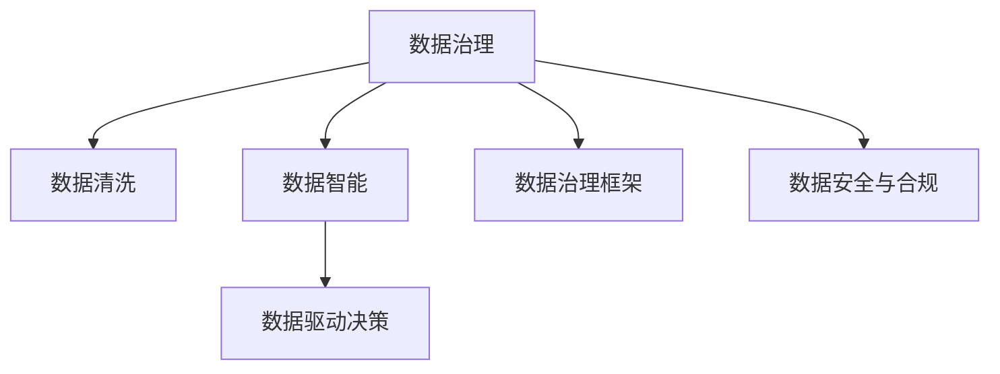

                 

# 人工智能创业数据管理的成功策略

> 关键词：数据管理,人工智能,创业策略,数据治理,数据安全,智能应用,业务流程优化,数据驱动决策,大数据技术,数据智能

## 1. 背景介绍

### 1.1 问题由来
在当今这个数据驱动的时代，数据对于任何企业都至关重要。尤其是对于创业公司而言，缺乏高效的数据管理将直接导致技术开发和业务运营的效率低下，甚至无法按时上线和运营。同时，数据质量差、数据孤岛等问题也会影响人工智能应用的准确性和效果。

创业公司往往没有大公司的资源和经验，因此更需要一种简单、高效、可靠的数据管理方法，以便将数据转化为业务价值。本文将从数据管理的各个方面入手，详细介绍如何在创业阶段成功应用数据管理策略，为企业发展奠定坚实基础。

### 1.2 问题核心关键点
数据管理在人工智能创业中扮演着举足轻重的角色，但很多初创企业在数据管理上却显得力不从心。数据管理的核心关键点包括：
1. **数据收集与整合**：如何高效地收集、整合各类数据，构建完整的数据生态。
2. **数据治理与清洗**：如何在数据治理中保持数据的一致性和质量，减少清洗成本。
3. **数据安全与合规**：如何在数据安全性和合规性的约束下，进行高效的数据管理和应用。
4. **数据智能与业务融合**：如何将数据智能与企业业务流程优化相结合，提升企业决策能力。

## 2. 核心概念与联系

### 2.1 核心概念概述

为更好地理解人工智能创业中的数据管理策略，本节将介绍几个密切相关的核心概念：

- **数据治理(Data Governance)**：通过政策、程序和技术手段，确保数据的完整性、一致性和安全性，满足业务需求和合规要求。
- **数据治理框架**：定义数据治理的职责、流程、工具和技术，使数据治理工作规范化、标准化。
- **数据清洗(Data Cleaning)**：通过去除重复、噪声、错误等无用或有害数据，提高数据质量和可用性。
- **数据质量(Data Quality)**：描述数据的重要属性，如准确性、完整性、一致性、唯一性、时效性等，是数据治理的核心。
- **数据智能(Data Intelligence)**：通过机器学习、数据挖掘等技术，发现数据中的潜在模式、规律和关联，为企业决策提供支持。
- **数据驱动的决策**：基于数据进行决策的过程，帮助企业更快速、准确地做出业务决策，提升竞争力。

这些核心概念之间的逻辑关系可以通过以下Mermaid流程图来展示：



这个流程图展示了大数据治理的主要环节及其之间的关系：

1. 数据治理是数据管理的核心，负责定义数据治理的职责、流程和技术。
2. 数据清洗是数据治理中的重要步骤，提高数据质量和可用性。
3. 数据智能为数据治理提供技术支持，通过机器学习等手段发现数据中的价值。
4. 数据驱动的决策是数据治理的最终目标，使数据成为企业决策的基础。
5. 数据安全与合规是数据治理的重要组成部分，确保数据安全与符合法律要求。

这些核心概念共同构成了人工智能创业的数据管理框架，为企业的数据应用提供了坚实的保障。通过理解这些核心概念，我们可以更好地把握数据管理的本质和策略。

## 3. 核心算法原理 & 具体操作步骤
### 3.1 算法原理概述

人工智能创业中的数据管理，涉及多个环节和技术的组合应用。本文将详细介绍其中的核心算法原理和操作步骤：

### 3.2 算法步骤详解

#### 数据收集与整合

**步骤1**：确定数据源
- 对公司的业务流程进行分析，明确需要哪些数据，来源包括内部系统、外部API、社交媒体等。

**步骤2**：构建数据管道
- 利用ETL工具（如Apache Nifi、Talend）将不同数据源的数据抽取、转换和加载到统一的数据仓库中。

**步骤3**：进行数据整合
- 通过数据合并和关联技术，将多个数据源的数据进行整合，构建完整的数据生态。

**步骤4**：数据质量管理
- 设立数据质量指标，定期评估数据质量，确保数据完整性、准确性和一致性。

#### 数据治理与清洗

**步骤1**：数据分类与命名
- 定义数据分类和命名标准，如表格、字段、数据类型等，确保数据的一致性。

**步骤2**：数据标准化
- 对不同来源的数据进行标准化处理，如日期格式统一、单位转换等，提高数据的可读性和可操作性。

**步骤3**：数据清洗
- 通过ETL工具进行数据清洗，去除重复、噪声、错误等无用或有害数据，提高数据质量。

**步骤4**：数据归档与备份
- 将数据进行归档和备份，确保数据的长期可用性和安全性。

#### 数据智能与业务融合

**步骤1**：数据探索与分析
- 使用数据挖掘、统计分析等技术，探索数据的潜在模式、规律和关联，为业务决策提供支持。

**步骤2**：数据可视化
- 通过可视化工具（如Tableau、PowerBI）将数据展示出来，便于业务人员理解数据。

**步骤3**：数据应用
- 将数据应用到业务流程中，如销售预测、市场分析、客户细分等，提升业务决策的科学性。

### 3.3 算法优缺点

#### 数据收集与整合
**优点**：
- 能够快速整合各类数据源，构建完整的数据生态。
- 提高数据的可用性和一致性，为后续的数据治理和应用奠定基础。

**缺点**：
- 数据源种类繁多，抽取和转换过程复杂，需要大量的人力和时间。
- 数据标准化和清洗工作量大，需要投入大量资源。

#### 数据治理与清洗
**优点**：
- 通过数据分类、标准化和清洗，提高数据质量和可用性。
- 建立数据治理框架，规范化数据管理流程，提升数据管理效率。

**缺点**：
- 数据治理过程繁琐，需要设立相应的流程和制度。
- 数据清洗工作量大，需要投入大量时间和人力资源。

#### 数据智能与业务融合
**优点**：
- 通过数据智能技术，发现数据中的潜在模式和规律，提升决策的科学性。
- 数据可视化技术，使得数据更易理解，便于业务人员使用。

**缺点**：
- 需要掌握一定的数据智能和可视化技术，门槛较高。
- 数据应用需要与业务流程紧密结合，需要较多的沟通和协调。

### 3.4 算法应用领域

基于数据管理策略的核心算法，可以广泛应用于以下领域：

- **金融科技**：利用数据智能进行市场分析和风险评估，提升业务决策能力。
- **零售电商**：通过数据清洗和整合，构建统一的客户视图，提升客户细分和营销效果。
- **医疗健康**：利用数据治理和可视化技术，提升医疗数据分析和决策效率。
- **智能制造**：通过数据智能和可视化技术，优化生产流程和供应链管理。
- **智慧城市**：构建统一的城市数据平台，提升城市管理和公共服务水平。

## 4. 数学模型和公式 & 详细讲解 & 举例说明

### 4.1 数学模型构建

为更好地理解数据管理的核心算法，本节将介绍几个常用的数学模型：

- **线性回归模型**：用于预测连续数值型数据，如销售预测、市场分析等。
- **决策树模型**：用于分类和预测离散型数据，如客户细分、市场分类等。
- **随机森林模型**：用于综合决策树的预测结果，提升预测精度和鲁棒性。
- **聚类分析模型**：用于将数据分为不同的群组，如客户细分、市场细分等。

### 4.2 公式推导过程

#### 线性回归模型

线性回归模型的基本形式为：
$$
y = \beta_0 + \beta_1 x_1 + \beta_2 x_2 + \cdots + \beta_n x_n + \epsilon
$$
其中，$y$ 为预测值，$\beta$ 为回归系数，$x$ 为自变量，$\epsilon$ 为误差项。

线性回归模型的最小二乘法估计公式为：
$$
\hat{\beta} = (X^TX)^{-1}X^Ty
$$
其中，$\hat{\beta}$ 为回归系数估计值，$X$ 为自变量矩阵，$y$ 为因变量向量。

#### 决策树模型

决策树模型的基本形式为：
$$
y = \begin{cases}
1 & \text{if } x_1 > T_1 \text{ and } x_2 > T_2 \text{ and } \cdots \text{ and } x_n > T_n \\
0 & \text{otherwise}
\end{cases}
$$
其中，$x_i$ 为自变量，$T_i$ 为决策树节点。

决策树模型的构建过程为：
1. 选取最优划分特征 $x_i$ 和划分阈值 $T_i$。
2. 将数据集递归地划分为多个子集。
3. 每个子集作为一个决策树节点，直至满足终止条件（如叶节点纯度要求）。

### 4.3 案例分析与讲解

#### 线性回归模型应用案例

假设某电商企业希望预测下个季度的销售额，可以使用线性回归模型进行预测。具体步骤如下：

1. 收集过去几年的销售数据，包括每个季度的销售额、价格、促销活动等信息。
2. 对数据进行清洗和预处理，去除异常值和噪声。
3. 将数据分为训练集和测试集，使用训练集训练线性回归模型。
4. 在测试集上评估模型性能，如MAE、RMSE等指标。
5. 将模型应用于下季度的预测，对比实际销售数据，评估模型效果。

#### 决策树模型应用案例

假设某零售企业希望进行客户细分，可以使用决策树模型进行分类。具体步骤如下：

1. 收集客户的购买行为数据，包括购买频率、购买金额、购买品类等信息。
2. 对数据进行清洗和预处理，去除异常值和噪声。
3. 将数据分为训练集和测试集，使用训练集训练决策树模型。
4. 在测试集上评估模型性能，如准确率、召回率等指标。
5. 将模型应用于客户细分，输出不同客户群体，为营销策略提供支持。

## 5. 项目实践：代码实例和详细解释说明

### 5.1 开发环境搭建

在进行数据管理项目实践前，我们需要准备好开发环境。以下是使用Python进行数据管理的开发环境配置流程：

1. 安装Anaconda：从官网下载并安装Anaconda，用于创建独立的Python环境。

2. 创建并激活虚拟环境：
```bash
conda create -n datamanagement python=3.8 
conda activate datamanagement
```

3. 安装相关库：
```bash
conda install pandas numpy scikit-learn matplotlib seaborn plotly
```

4. 安装ETL工具：
```bash
pip install apache-nifi talend
```

完成上述步骤后，即可在`datamanagement`环境中开始数据管理项目的开发。

### 5.2 源代码详细实现

下面我们以数据清洗项目为例，给出使用Python进行数据清洗的代码实现。

首先，定义数据清洗函数：

```python
import pandas as pd
import numpy as np
from sklearn.model_selection import train_test_split
from sklearn.preprocessing import StandardScaler
from sklearn.linear_model import LinearRegression

def clean_data(data_path, target_column, test_size=0.2, random_state=42):
    # 读取数据
    df = pd.read_csv(data_path)
    
    # 数据探索与分析
    print(df.describe())
    print(df.isnull().sum())
    
    # 数据清洗
    df = df.dropna(subset=[target_column])
    df = df.drop_duplicates()
    
    # 数据标准化
    scaler = StandardScaler()
    scaled_features = scaler.fit_transform(df.drop(target_column, axis=1))
    
    # 数据分割
    X_train, X_test, y_train, y_test = train_test_split(scaled_features, df[target_column], test_size=test_size, random_state=random_state)
    
    # 数据预处理
    X_train = pd.DataFrame(X_train, columns=df.columns[:-1])
    X_test = pd.DataFrame(X_test, columns=df.columns[:-1])
    y_train = pd.DataFrame(y_train, columns=['target'])
    y_test = pd.DataFrame(y_test, columns=['target'])
    
    return X_train, X_test, y_train, y_test
```

然后，定义模型训练函数：

```python
def train_model(X_train, X_test, y_train, y_test, model='linear_regression'):
    if model == 'linear_regression':
        model = LinearRegression()
    else:
        model = DecisionTreeClassifier()
        
    model.fit(X_train, y_train)
    y_pred = model.predict(X_test)
    
    return model, y_pred
```

最后，调用数据清洗和模型训练函数：

```python
# 数据清洗
X_train, X_test, y_train, y_test = clean_data('sales_data.csv', 'sales_amount', test_size=0.2, random_state=42)

# 模型训练
model, y_pred = train_model(X_train, X_test, y_train, y_test, model='linear_regression')

# 模型评估
print('R-squared:', model.score(X_test, y_test))
```

以上就是使用Python进行数据清洗和模型训练的完整代码实现。可以看到，使用Pandas、NumPy、Scikit-learn等库，可以轻松实现数据的清洗和建模。

### 5.3 代码解读与分析

让我们再详细解读一下关键代码的实现细节：

**clean_data函数**：
- `pd.read_csv`方法：读取CSV文件，将数据加载到Pandas DataFrame中。
- `describe`方法：查看数据的统计信息，如均值、方差、中位数等。
- `isnull.sum`方法：查看数据中缺失值的情况。
- `dropna`方法：删除含有缺失值的行。
- `drop_duplicates`方法：删除重复的行。
- `StandardScaler`类：对特征进行标准化处理。
- `train_test_split`方法：将数据集分为训练集和测试集。
- `fit_transform`方法：对特征进行标准化，并拟合模型。

**train_model函数**：
- `LinearRegression`类：定义线性回归模型。
- `fit`方法：拟合模型。
- `predict`方法：对测试集进行预测。
- `score`方法：计算模型的R-squared指标。

这些函数和类为我们提供了数据清洗和建模的常用工具，使得数据管理项目更加高效。当然，在实际应用中，还需要结合具体的业务场景，进一步优化数据处理和模型训练过程。

## 6. 实际应用场景

### 6.1 智能客服系统

基于数据管理策略，智能客服系统可以实现高效的数据收集和整合，提升客服响应速度和用户满意度。具体步骤如下：

1. 收集客户的历史咨询记录、反馈、投诉等数据。
2. 使用ETL工具将不同数据源的数据整合到统一的数据仓库中。
3. 对数据进行清洗和预处理，去除噪声和错误数据。
4. 利用数据智能技术，进行客户情感分析、意图识别等，提升客服响应准确性。
5. 通过可视化工具，展示客服系统的运营情况，优化客服流程和资源配置。

### 6.2 医疗健康监测

在医疗健康领域，数据管理策略可以用于构建高效的医疗健康监测系统。具体步骤如下：

1. 收集患者的病历、体检、用药等数据。
2. 对数据进行清洗和预处理，去除噪声和错误数据。
3. 利用数据智能技术，进行疾病预测、治疗方案优化等，提升医疗服务质量。
4. 通过可视化工具，展示医疗健康监测系统的运营情况，优化资源配置和流程管理。

### 6.3 零售电商推荐系统

基于数据管理策略，零售电商推荐系统可以实现高效的数据收集和整合，提升推荐效果和用户满意度。具体步骤如下：

1. 收集用户的浏览、购买、评价等数据。
2. 对数据进行清洗和预处理，去除噪声和错误数据。
3. 利用数据智能技术，进行用户行为分析和推荐算法优化，提升推荐效果。
4. 通过可视化工具，展示推荐系统的运营情况，优化推荐算法和资源配置。

### 6.4 未来应用展望

未来，数据管理策略将在人工智能创业中发挥更大的作用，推动更多行业和领域的数字化转型。随着大数据技术的发展和数据智能的进步，数据管理策略的应用将更加广泛，数据价值也将被更充分地挖掘和利用。

在金融科技、零售电商、医疗健康等诸多领域，基于数据管理策略的系统将提供更精准、高效的数据驱动决策支持，为企业的持续发展提供有力保障。同时，随着云计算、大数据、物联网等技术的不断成熟，数据管理策略将进一步融合多种技术，形成更强大、更智能的数据生态系统。

## 7. 工具和资源推荐

### 7.1 学习资源推荐

为了帮助开发者系统掌握数据管理策略的理论基础和实践技巧，这里推荐一些优质的学习资源：

1. 《数据治理：大数据时代的价值挖掘与实践》书籍：详细介绍了数据治理的理论和实践，提供丰富的案例和工具。
2. 《Python数据清洗与处理：高效数据管理实战指南》书籍：介绍了数据清洗和处理的常用技术和工具，适合初学者的入门阅读。
3. 《数据智能：机器学习在数据管理中的应用》课程：介绍了数据智能在数据管理中的应用，涵盖数据探索、分析、建模等多个方面。
4. Kaggle平台：提供大量的数据清洗和建模竞赛，可以实践数据管理技能，积累项目经验。

通过对这些资源的学习实践，相信你一定能够快速掌握数据管理的精髓，并用于解决实际的数据管理问题。

### 7.2 开发工具推荐

高效的开发离不开优秀的工具支持。以下是几款用于数据管理开发的常用工具：

1. Apache NiFi：一个流数据处理平台，支持ETL数据的抽取、转换和加载，具有强大的数据治理和可视化功能。
2. Talend：一个开源的数据集成平台，提供ETL数据的抽取、转换和加载，支持大数据、云计算等多种数据源。
3. Jupyter Notebook：一个交互式的数据分析和建模工具，支持Python、R等多种编程语言，方便实验和调试。
4. Tableau：一个强大的数据可视化工具，支持多种数据源，提供丰富的图表展示方式。
5. Power BI：微软推出的数据可视化工具，支持多种数据源，提供强大的数据探索和分析功能。

合理利用这些工具，可以显著提升数据管理任务的开发效率，加快创新迭代的步伐。

### 7.3 相关论文推荐

数据管理策略的研究源于学界的持续研究。以下是几篇奠基性的相关论文，推荐阅读：

1. "Data Governance for Big Data"（《大数据治理》）：介绍了数据治理的理论和实践，探讨了数据治理与大数据技术的关系。
2. "Data Cleaning Techniques: A Review"（《数据清洗技术综述》）：总结了数据清洗的常用技术和方法，提供了丰富的案例和实例。
3. "Data Mining and Statistical Learning"（《数据挖掘与统计学习》）：介绍了数据智能在数据管理中的应用，涵盖数据探索、分析、建模等多个方面。
4. "Towards an Analytics of Constraint Satisfaction"（《约束满足分析》）：探讨了约束满足方法在数据智能中的应用，提供了新的优化算法和模型。

这些论文代表了大数据治理的研究脉络。通过学习这些前沿成果，可以帮助研究者把握学科前进方向，激发更多的创新灵感。

## 8. 总结：未来发展趋势与挑战

### 8.1 总结

本文对人工智能创业中的数据管理策略进行了全面系统的介绍。首先阐述了数据管理在人工智能创业中的重要性，明确了数据管理在提升业务价值、优化决策过程中的独特价值。其次，从数据收集、数据治理、数据清洗等多个方面，详细讲解了数据管理的核心算法和操作步骤，给出了数据管理项目开发的完整代码实例。同时，本文还广泛探讨了数据管理策略在多个行业领域的应用前景，展示了数据管理策略的巨大潜力。此外，本文精选了数据管理技术的各类学习资源，力求为读者提供全方位的技术指引。

通过本文的系统梳理，可以看到，数据管理策略在人工智能创业中扮演着举足轻重的角色。这些策略和技术的成功应用，不仅能够提升企业的业务价值，还能有效提升数据应用的准确性和效率，为企业的数字化转型奠定坚实基础。

### 8.2 未来发展趋势

展望未来，数据管理策略将呈现以下几个发展趋势：

1. **数据治理的自动化**：随着AI技术的进步，数据治理将更加自动化和智能化，减少人工干预，提升数据治理的效率和准确性。
2. **数据智能的深度融合**：数据智能将与数据治理深度融合，通过AI技术发现数据中的潜在模式和规律，提升数据治理的效果和精度。
3. **数据驱动的决策支持**：数据治理将成为企业决策支持的核心，通过数据驱动的决策，提升企业的竞争力和创新能力。
4. **数据隐私和安全**：随着数据安全性和隐私保护的重视，数据治理将更加注重数据安全和合规性，确保数据的安全和隐私。
5. **数据治理的全球化**：随着全球化进程的加快，数据治理将更加注重全球范围内的数据标准化和互操作性，提升全球数据管理的效率。

### 8.3 面临的挑战

尽管数据管理策略已经取得了瞩目成就，但在迈向更加智能化、普适化应用的过程中，它仍面临着诸多挑战：

1. **数据标准化困难**：不同来源的数据格式和质量参差不齐，数据标准化和整合工作难度较大。
2. **数据隐私和安全问题**：数据安全和隐私保护一直是数据管理的难点，如何平衡数据利用和隐私保护需要进一步探索。
3. **数据治理的技术门槛高**：数据治理涉及的技术复杂多样，需要具备较高的技术水平和丰富的实践经验。
4. **数据智能的实现难度大**：数据智能的实现需要大量的数据和计算资源，技术实现难度较大。
5. **数据驱动的决策存在风险**：数据驱动的决策虽然科学，但也存在一定的风险，如数据偏见、算法黑箱等问题需要进一步解决。

### 8.4 研究展望

面对数据管理策略面临的种种挑战，未来的研究需要在以下几个方面寻求新的突破：

1. **数据治理的自动化和智能化**：开发更加自动化和智能化的数据治理工具，减少人工干预，提升数据治理的效率和准确性。
2. **数据智能的深度融合**：通过AI技术发现数据中的潜在模式和规律，提升数据治理的效果和精度。
3. **数据隐私和安全的保障**：加强数据隐私保护和数据安全，确保数据的安全和合规性。
4. **数据治理的全球化**：提升全球范围内的数据标准化和互操作性，提升全球数据管理的效率。

这些研究方向的探索，必将引领数据管理策略走向更高的台阶，为构建安全、可靠、可解释、可控的智能系统铺平道路。面向未来，数据管理策略还需要与其他人工智能技术进行更深入的融合，如知识表示、因果推理、强化学习等，多路径协同发力，共同推动自然语言理解和智能交互系统的进步。只有勇于创新、敢于突破，才能不断拓展数据管理的边界，让数据管理策略在大数据时代中发挥更大作用。

## 9. 附录：常见问题与解答

**Q1：数据管理对人工智能创业有哪些具体应用？**

A: 数据管理在人工智能创业中具有广泛的应用，主要体现在以下几个方面：
1. 数据收集与整合：通过数据管道和ETL工具，高效地收集和整合不同数据源，构建完整的数据生态。
2. 数据清洗与标准化：通过数据清洗和标准化，提高数据质量和可用性，减少清洗成本。
3. 数据治理与安全：通过数据治理框架和政策，确保数据的完整性、一致性和安全性，符合法律要求。
4. 数据智能与业务融合：通过数据智能技术，发现数据中的潜在模式和规律，提升决策的科学性和准确性。
5. 数据驱动的决策支持：通过数据驱动的决策，提升企业的竞争力和创新能力。

**Q2：如何评估数据治理的效果？**

A: 数据治理的效果可以通过以下几个指标进行评估：
1. 数据质量：数据完整性、准确性、一致性、唯一性、时效性等指标。
2. 数据安全性：数据泄露、数据损坏、数据丢失等指标。
3. 数据使用效率：数据使用频率、数据访问速度、数据利用率等指标。
4. 数据治理成本：数据治理的投入成本和收益回报率。
5. 数据治理合规性：数据治理是否符合相关法律法规和标准规范。

**Q3：如何优化数据管理项目中的数据清洗和标准化工作？**

A: 数据清洗和标准化是数据管理中非常重要的环节，以下是一些优化建议：
1. 数据清洗：去除重复、噪声、错误等无用或有害数据，提高数据质量和可用性。
2. 数据标准化：对不同来源的数据进行标准化处理，如日期格式统一、单位转换等，提高数据的可读性和可操作性。
3. 自动化工具：使用ETL工具（如Apache Nifi、Talend）进行数据抽取、转换和加载，减少人工干预。
4. 规则与策略：制定数据清洗和标准化的规则和策略，规范数据治理流程，提高效率和准确性。
5. 持续改进：定期评估数据治理效果，根据反馈持续改进数据清洗和标准化流程。

**Q4：如何提升数据驱动的决策效果？**

A: 数据驱动的决策是数据管理的重要应用之一，以下是一些提升决策效果的方法：
1. 数据质量：确保数据的完整性、准确性、一致性等指标，减少决策偏差。
2. 数据治理：通过数据治理框架和政策，确保数据的可用性和安全性。
3. 数据智能：利用机器学习、数据挖掘等技术，发现数据中的潜在模式和规律，提升决策的科学性和准确性。
4. 数据可视化：通过可视化工具（如Tableau、PowerBI）将数据展示出来，便于业务人员理解数据。
5. 多模型融合：结合多种模型和算法，综合考虑多维数据，提升决策效果。

**Q5：数据驱动的决策存在哪些风险？**

A: 数据驱动的决策虽然科学，但也存在一定的风险，以下是一些常见的风险：
1. 数据偏见：数据中可能包含偏见或偏差，导致决策结果不公或错误。
2. 算法黑箱：数据驱动的决策过程缺乏透明性，难以解释和调试。
3. 数据隐私：数据隐私保护一直是数据管理的难点，如何平衡数据利用和隐私保护需要进一步探索。
4. 数据安全：数据安全和隐私保护一直是数据管理的难点，需要加强数据安全措施。
5. 数据来源不确定：数据来源不确定，数据质量难以保证，决策效果难以控制。

这些风险需要进一步研究，通过技术手段和管理措施，提升数据驱动决策的可靠性和安全性。

---

作者：禅与计算机程序设计艺术 / Zen and the Art of Computer Programming

