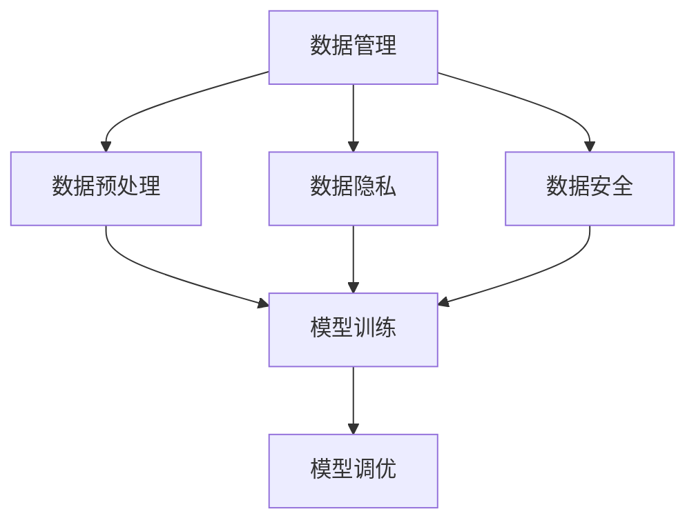

                 

## 1. 背景介绍

### 1.1 问题由来

在人工智能创业中，数据管理是至关重要的环节。正确的数据管理不仅能确保算法的可靠性和可解释性，还能为业务的长期稳定发展奠定基础。然而，面对不断增长的大数据量，如何有效管理和利用这些数据，成为了一个复杂且棘手的问题。尤其在新兴的人工智能企业中，由于数据管理经验的缺乏，往往会在数据处理、隐私保护、模型训练等方面遇到各种挑战。

### 1.2 问题核心关键点

在人工智能创业中，数据管理的核心关键点包括：
- 数据收集与预处理：确保数据的质量和完整性，避免数据偏倚。
- 数据存储与管理：合理规划数据存储结构，提高数据检索效率。
- 数据隐私与安全：保护用户隐私，确保数据安全。
- 数据利用与模型训练：优化数据利用率，提高模型训练效率。
- 数据监测与维护：实时监测数据变化，及时更新模型。

### 1.3 问题研究意义

高效的数据管理不仅能提升模型的预测性能，还能为人工智能创业企业带来明显的商业价值：

1. 提高模型精度：通过高质量的数据管理，确保模型输入数据的一致性和准确性，从而提升模型的预测精度和泛化能力。
2. 加速业务迭代：合理的数据管理流程可显著减少模型训练和调优时间，加速产品研发和市场推广。
3. 增强客户信任：通过严格的数据隐私保护措施，增强客户对企业的信任度，扩大用户基础。
4. 降低运营成本：通过高效的数据利用和存储策略，降低数据处理和存储成本，优化企业运营效率。
5. 提升用户体验：通过精准的数据分析和预测，提供个性化的产品和服务，提升用户体验。

## 2. 核心概念与联系

### 2.1 核心概念概述

为了更好地理解人工智能创业数据管理的秘诀，本节将介绍几个密切相关的核心概念：

- **数据管理**：指在人工智能创业过程中，对数据的收集、存储、处理、分析、隐私保护等各个环节进行有效管理和优化，确保数据的高效利用。
- **数据预处理**：指对原始数据进行清洗、转换、归一化等处理，以保证数据的质量和一致性，便于后续分析和使用。
- **数据隐私**：指保护个人和组织数据的机密性、完整性和可用性，防止数据泄露、篡改和滥用。
- **数据安全**：指保护数据免受未经授权的访问、修改和破坏，确保数据在传输和存储过程中的安全性。
- **模型训练**：指使用已处理的数据集对模型进行训练，通过算法优化提升模型的预测性能。
- **模型调优**：指通过调整模型参数、优化算法等手段，进一步提升模型在特定任务上的表现。

这些核心概念之间的逻辑关系可以通过以下Mermaid流程图来展示：



这个流程图展示了大数据管理中的核心概念及其之间的关系：

1. 数据管理是整个数据处理的基础，贯穿数据预处理、隐私保护、安全管理等各个环节。
2. 数据预处理是确保数据质量的关键步骤，为后续的模型训练和调优提供可靠的数据输入。
3. 数据隐私和安全是数据管理的核心关注点，确保数据的安全和合法使用。
4. 模型训练和调优是数据管理的最终目标，通过优化模型性能，实现数据的深度应用。

## 3. 核心算法原理 & 具体操作步骤
### 3.1 算法原理概述

人工智能创业中的数据管理，其核心算法原理是基于数据流程管理的数据流图模型（Dataflow Graph Model），以及数据隐私保护的差分隐私（Differential Privacy）模型。

数据流图模型是一种有向图，描述了数据从输入到输出的处理流程，包括数据的收集、清洗、存储、处理等各个环节。通过数据流图模型，可以系统地管理和优化数据流程，确保数据的准确性和可靠性。

差分隐私模型是一种隐私保护技术，通过在数据处理过程中加入噪声，确保单个数据样本的隐私不受泄露。差分隐私保护有助于在保护用户隐私的前提下，对数据进行分析和建模。

### 3.2 算法步骤详解

基于数据流图模型和差分隐私模型的数据管理流程包括以下关键步骤：

**Step 1: 数据收集与预处理**
- 收集用户数据，包括用户行为、交易记录、文本数据等。
- 对数据进行清洗和预处理，去除重复、错误、无关的数据，确保数据的一致性和完整性。
- 进行特征工程，提取有意义的特征，为后续的模型训练和分析做准备。

**Step 2: 数据存储与管理**
- 选择合适的数据存储技术，如分布式数据库、数据湖等，确保数据的可访问性和高可用性。
- 优化数据存储结构，采用合适的索引和分区策略，提高数据的检索效率。
- 实施数据备份和恢复机制，确保数据的安全性和可靠性。

**Step 3: 数据隐私与安全**
- 设计隐私保护方案，如差分隐私、同态加密等，确保用户数据在传输和存储过程中的隐私保护。
- 实施访问控制和身份认证机制，确保只有授权用户才能访问敏感数据。
- 定期进行安全审计和风险评估，及时发现并修复安全漏洞。

**Step 4: 数据利用与模型训练**
- 对预处理后的数据集进行划分，分为训练集、验证集和测试集，用于模型训练和评估。
- 选择合适的模型和算法，进行模型训练和调优，提升模型预测性能。
- 进行模型评估和验证，确保模型的泛化能力和鲁棒性。

**Step 5: 数据监测与维护**
- 实时监测数据变化，及时发现异常和潜在问题。
- 定期更新数据集，保持模型的最新状态。
- 实施数据生命周期管理，确保数据的全生命周期安全。

### 3.3 算法优缺点

基于数据流图模型和差分隐私模型的数据管理方法具有以下优点：
1. 系统性管理：数据流图模型提供了一套系统化的管理框架，便于对数据处理流程进行全局优化。
2. 隐私保护：差分隐私模型能够在保护用户隐私的前提下，对数据进行分析和建模。
3. 数据可靠性：数据流图模型通过数据预处理和存储优化，确保数据的可靠性和一致性。
4. 灵活性：数据流图模型可以根据具体业务需求进行灵活调整和优化。

同时，该方法也存在一些局限性：
1. 实现复杂：数据流图模型和差分隐私模型涉及多个技术环节，实现难度较大。
2. 数据量限制：差分隐私保护需要加入噪声，可能影响数据的精度和可靠性。
3. 计算成本高：差分隐私保护需要在数据处理过程中加入噪声，计算成本较高。
4. 隐私保护力度有限：差分隐私保护需要在隐私保护和数据利用之间进行平衡，隐私保护力度可能有限。

尽管存在这些局限性，但就目前而言，基于数据流图模型和差分隐私模型的数据管理方法仍是大数据管理的主流范式。未来相关研究的重点在于如何进一步简化数据管理流程，提高隐私保护的效果，降低计算成本，同时兼顾数据利用的需求。

### 3.4 算法应用领域

基于数据流图模型和差分隐私模型的数据管理方法，在人工智能创业中已经得到了广泛的应用，覆盖了几乎所有常见领域，例如：

- 智能推荐系统：通过分析用户行为数据，推荐个性化的商品和服务。
- 金融风控系统：通过分析交易记录，识别和防范金融风险。
- 医疗诊断系统：通过分析患者数据，辅助医生进行诊断和治疗。
- 安全监控系统：通过分析网络流量数据，实时监测和预警安全威胁。
- 智能客服系统：通过分析用户对话记录，提升客户服务质量。
- 物联网系统：通过分析设备数据，实现智能化的管理和控制。

除了上述这些经典应用外，数据管理技术还被创新性地应用到更多场景中，如用户行为分析、营销策略优化、供应链管理等，为人工智能创业企业带来了新的商业机会。

## 4. 数学模型和公式 & 详细讲解  
### 4.1 数学模型构建

本节将使用数学语言对基于数据流图模型和差分隐私模型的数据管理过程进行更加严格的刻画。

假设数据管理流程的输入为 $X=\{x_1, x_2, ..., x_n\}$，其中 $x_i \in \mathcal{X}$ 表示数据项，$\mathcal{X}$ 为数据项空间。数据处理流程包含 $K$ 个步骤，每个步骤 $k$ 的输入为 $X_k$，输出为 $Y_k$。

定义数据流图模型为 $G=(V, E)$，其中 $V$ 为节点集合，表示数据处理步骤，$E$ 为边集合，表示数据流向。对于每个节点 $v_k \in V$，定义其输入数据集为 $X_k$，输出数据集为 $Y_k$。

差分隐私保护的目标是确保个体数据的隐私不受泄露，即对于任意两个数据项 $x_i, x_j$，其输出数据 $Y_k$ 的分布距离 $P(Y_k \mid x_i)$ 和 $P(Y_k \mid x_j)$ 不超过一个事先给定的差分隐私预算 $\epsilon$。差分隐私保护的算法有多种，如拉普拉斯机制、高斯机制等。

### 4.2 公式推导过程

以下我们以拉普拉斯机制为例，推导差分隐私保护的数学公式及其推导过程。

假设数据处理步骤 $k$ 的输出 $Y_k$ 为 $X_k$ 的函数 $f_k(X_k)$，其敏感度为 $\Delta f$。拉普拉斯机制的隐私保护公式为：

$$
Y_k = f_k(X_k) + \epsilon \cdot \Delta f \cdot \text{Laplace}(0, 1/\epsilon)
$$

其中 $\epsilon$ 为隐私预算，$\text{Laplace}(0, 1/\epsilon)$ 为拉普拉斯分布，表示在 $0$ 点为中心，标准差为 $1/\epsilon$ 的拉普拉斯分布。

将上述公式代入数据流图模型，可得到整个数据管理流程的差分隐私保护公式：

$$
\hat{Y} = G(X) + \sum_{k=1}^K \epsilon_k \cdot \Delta f_k \cdot \text{Laplace}(0, 1/\epsilon_k)
$$

其中 $\epsilon_k$ 为第 $k$ 个步骤的隐私预算，$\Delta f_k$ 为第 $k$ 个步骤的敏感度。

### 4.3 案例分析与讲解

**案例分析：智能推荐系统**

在智能推荐系统中，数据管理流程如下：

1. 收集用户行为数据 $X_1=\{x_1, x_2, ..., x_n\}$，包括浏览记录、购买记录、评分记录等。
2. 对数据进行预处理，去除重复和错误的数据，提取有意义的特征。
3. 将预处理后的数据 $X_2$ 存储在分布式数据库中。
4. 对存储的数据进行访问控制和隐私保护，确保只有授权用户才能访问。
5. 通过模型训练和调优，生成推荐模型 $Y_1=f(X_2)$。
6. 对模型进行评估和验证，确保模型的预测性能和鲁棒性。
7. 实时监测用户行为数据的变化，及时更新推荐模型。

### 5. 项目实践：代码实例和详细解释说明
### 5.1 开发环境搭建

在进行数据管理实践前，我们需要准备好开发环境。以下是使用Python进行Apache Spark开发的开发环境配置流程：

1. 安装Anaconda：从官网下载并安装Anaconda，用于创建独立的Python环境。

2. 创建并激活虚拟环境：
```bash
conda create -n spark-env python=3.8 
conda activate spark-env
```

3. 安装PySpark：根据CUDA版本，从官网获取对应的安装命令。例如：
```bash
conda install pyspark 
```

4. 安装各类工具包：
```bash
pip install numpy pandas scikit-learn matplotlib tqdm jupyter notebook ipython
```

完成上述步骤后，即可在`spark-env`环境中开始数据管理实践。

### 5.2 源代码详细实现

下面我们以智能推荐系统为例，给出使用Apache Spark进行数据管理的PySpark代码实现。

首先，定义数据收集和预处理函数：

```python
from pyspark.sql import SparkSession
from pyspark.sql.functions import col, split, udf, array_map

spark = SparkSession.builder.appName("recommendation_system").getOrCreate()

# 定义数据收集和预处理函数
def preprocess_data(df):
    # 去除重复和错误数据
    df = df.distinct()
    # 提取有意义的特征
    def extract_features(feature):
        return array_map(lambda x: int(x), feature.split(","))
    df = df.withColumn("features", udf(extract_features)(df["raw_features"]))
    return df

# 加载原始数据
raw_data = spark.read.csv("user_behavior.csv", header=True, inferSchema=True)

# 数据预处理
processed_data = preprocess_data(raw_data)
```

然后，定义数据存储和管理函数：

```python
# 将预处理后的数据存储到分布式数据库中
processed_data.write.format("parquet").save("recommendation_data")

# 实施数据访问控制和隐私保护
def access_control(data):
    # 实现访问控制逻辑
    # 实现隐私保护逻辑，如差分隐私保护
    return data

# 访问控制和隐私保护
accessed_data = access_control(processed_data)
```

接着，定义模型训练和调优函数：

```python
# 定义推荐模型训练函数
def train_model(data):
    # 实现模型训练和调优
    # 返回推荐模型
    return model

# 模型训练和调优
trained_model = train_model(accessed_data)
```

最后，定义数据监测和维护函数：

```python
# 定义数据监测和维护函数
def monitor_data(data):
    # 实现数据监测和维护逻辑
    # 返回监测结果
    return monitor_result

# 数据监测和维护
monitor_result = monitor_data(trained_model)
```

以上就是使用Apache Spark进行数据管理的完整代码实现。可以看到，Spark提供了强大的分布式数据处理能力，能够高效地管理和处理大规模数据集，非常适合用于人工智能创业的数据管理实践。

### 5.3 代码解读与分析

让我们再详细解读一下关键代码的实现细节：

**preprocess_data函数**：
- 去除重复和错误数据：通过`distinct()`方法去除重复数据，确保数据的一致性。
- 提取有意义的特征：通过自定义的函数`extract_features`将原始特征转换为数值型特征，便于后续的模型训练。

**train_model函数**：
- 实现推荐模型训练和调优：根据输入的数据集，使用机器学习算法训练推荐模型，并调用模型调优方法进一步优化模型性能。
- 返回推荐模型：训练完成后，返回训练好的推荐模型，用于后续的预测和推理。

**monitor_data函数**：
- 实现数据监测和维护：通过实时监控数据的变更，及时更新推荐模型，确保模型的最新状态。
- 返回监测结果：监测完成后，返回系统的运行状态和模型性能指标，供用户查看和评估。

通过上述代码的实现，可以看到Spark在数据管理实践中的强大能力。Spark不仅提供了高效的数据处理能力，还集成了各种数据管理工具和算法，使得数据管理的流程更加系统化、自动化。

当然，工业级的系统实现还需考虑更多因素，如数据的ETL流程、访问控制策略、隐私保护机制等。但核心的数据管理流程基本与此类似。

## 6. 实际应用场景
### 6.1 智能推荐系统

基于Apache Spark的数据管理方法，智能推荐系统可以应用于各大电商平台的商品推荐、新闻平台的个性化新闻推荐、视频平台的个性化视频推荐等场景。通过收集用户行为数据，使用差分隐私保护技术，对用户进行个性化推荐，提升用户体验和满意度。

在技术实现上，可以集成多种机器学习算法，如协同过滤、内容推荐、基于深度学习的推荐系统等，利用Spark的大数据处理能力，对大规模用户数据进行高效分析和建模，生成精准的推荐结果。

### 6.2 金融风控系统

金融风控系统是人工智能创业中常见的应用场景之一。通过收集和分析用户的交易记录、行为数据等，可以及时发现异常交易和风险行为，保障金融安全。

在数据管理实践中，可以采用差分隐私保护技术，保护用户隐私，防止敏感信息泄露。同时，利用Spark的大数据处理能力，高效分析交易数据，生成风险评估模型，提升风控系统的精准度和覆盖面。

### 6.3 医疗诊断系统

在医疗领域，数据管理技术同样具有重要应用价值。通过收集和分析患者的历史数据、诊断数据等，可以辅助医生进行精准诊断和治疗。

在数据管理实践中，可以采用差分隐私保护技术，保护患者隐私，防止敏感信息泄露。同时，利用Spark的大数据处理能力，高效分析患者数据，生成诊断和治疗模型，提升医疗服务的精准度和效率。

### 6.4 未来应用展望

随着数据管理技术的不断发展，基于Apache Spark的数据管理方法将在更多领域得到应用，为人工智能创业企业带来更多的商业机会：

1. 智慧城市：通过收集和分析城市数据，实现智慧交通、智慧医疗、智慧安防等应用。
2. 物联网：通过收集和分析设备数据，实现设备管理和控制。
3. 智能制造：通过收集和分析生产数据，实现生产流程优化和预测性维护。
4. 智能营销：通过收集和分析用户数据，实现精准营销和客户管理。
5. 智能客服：通过收集和分析客户对话数据，实现智能客服和客户满意度提升。

## 7. 工具和资源推荐
### 7.1 学习资源推荐

为了帮助开发者系统掌握人工智能创业数据管理的理论基础和实践技巧，这里推荐一些优质的学习资源：

1. Apache Spark官方文档：Apache Spark的官方文档，提供了丰富的API文档和开发指南，是上手实践的必备资料。
2. Spark by Example书籍：是一本介绍Spark开发的经典书籍，内容涵盖了Spark的基本概念、API使用、大数据处理等，适合初学者和中级开发者。
3. Spark Summit大会：每年举办一次的Spark开发者大会，聚集了全球Spark社区的技术专家，分享最新的Spark技术进展和应用案例，是学习Spark的好机会。
4. Kaggle竞赛平台：提供大量数据集和机器学习竞赛，适合锻炼数据管理和模型调优技能。
5. Coursera机器学习课程：由斯坦福大学开设的机器学习课程，涵盖机器学习的基本概念和算法，适合对数据管理有初步了解的开发者。

通过对这些资源的学习实践，相信你一定能够快速掌握Spark在数据管理中的应用，并用于解决实际的商业问题。

### 7.2 开发工具推荐

高效的开发离不开优秀的工具支持。以下是几款用于数据管理开发的常用工具：

1. Apache Spark：Apache Spark是一个强大的分布式计算框架，适合处理大规模数据集。
2. Hadoop：Hadoop是Apache基金会的一个开源框架，提供分布式文件系统和分布式计算框架。
3. Amazon EMR：亚马逊提供的完全托管的云上Spark服务，适合企业级数据管理需求。
4. Google BigQuery：谷歌提供的云上数据分析平台，适合大数据量的快速查询和分析。
5. Tableau：一款强大的数据可视化工具，适合数据分析和报告制作。
6. ELK Stack：Elasticsearch、Logstash和Kibana的组合，提供日志管理和可视化功能。

合理利用这些工具，可以显著提升数据管理任务的开发效率，加快创新迭代的步伐。

### 7.3 相关论文推荐

大语言模型和微调技术的发展源于学界的持续研究。以下是几篇奠基性的相关论文，推荐阅读：

1. Large-scale Parallel ML: Distributed Learning with the Mahout Scalability Toolkit：介绍大分布式机器学习框架Mahout，涵盖Spark、Hadoop等分布式计算框架的应用。
2. Adaptive Computation Time for Sequential Prediction with Limited Data：介绍Adaptive Computation Time（ACT）算法，提高模型在数据量有限情况下的性能。
3. Machine Learning: The Case for Distributed Learning and Feature Engineering：介绍分布式机器学习在数据处理中的应用，涵盖Spark、Hadoop等分布式计算框架的应用。
4. Feature Engineering with Deep Learning：介绍特征工程在深度学习中的应用，涵盖Spark、Hadoop等分布式计算框架的应用。
5. Distributed Machine Learning with Spark: Algorithms and Best Practices：介绍Spark在分布式机器学习中的应用，涵盖数据预处理、模型训练、数据管理等各个环节。

这些论文代表了大数据管理技术的发展脉络。通过学习这些前沿成果，可以帮助研究者把握学科前进方向，激发更多的创新灵感。

## 8. 总结：未来发展趋势与挑战

### 8.1 总结

本文对基于Apache Spark的数据管理方法进行了全面系统的介绍。首先阐述了数据管理在人工智能创业中的重要性，明确了数据管理在提高模型精度、加速业务迭代、增强客户信任、降低运营成本等方面的独特价值。其次，从原理到实践，详细讲解了基于数据流图模型和差分隐私模型的数据管理流程，给出了Spark数据管理的完整代码实现。同时，本文还广泛探讨了数据管理方法在智能推荐、金融风控、医疗诊断等多个领域的应用前景，展示了数据管理技术的巨大潜力。

通过本文的系统梳理，可以看到，基于Spark的数据管理技术正在成为人工智能创业的重要范式，极大地拓展了数据的利用范围，提升了企业的竞争力。未来，伴随数据管理技术的不断演进，基于Spark的数据管理方法必将在更多领域得到应用，为人工智能创业企业带来更多的商业机会。

### 8.2 未来发展趋势

展望未来，数据管理技术将呈现以下几个发展趋势：

1. 自动化数据管理：随着自动化技术的发展，未来的数据管理将更加智能化、自动化，系统能够自动处理数据清洗、数据存储、数据监测等环节。
2. 实时数据管理：未来的数据管理将更加实时化，能够实时监测数据变化，及时更新模型，适应数据分布的变化。
3. 多源数据管理：未来的数据管理将支持多源数据融合，能够高效处理来自不同数据源的数据，提升数据的利用率。
4. 数据治理：未来的数据管理将更加注重数据治理，制定数据管理标准和规范，确保数据的一致性和可靠性。
5. 数据隐私和安全：未来的数据管理将更加注重数据隐私和安全，实施更严格的数据访问控制和隐私保护措施，确保数据的安全和合法使用。

这些趋势凸显了数据管理技术的广阔前景。这些方向的探索发展，必将进一步提升数据管理的效率和效果，为人工智能创业企业提供更加稳定、可靠的数据支持。

### 8.3 面临的挑战

尽管数据管理技术已经取得了显著成就，但在迈向更加智能化、普适化应用的过程中，它仍面临诸多挑战：

1. 数据质量瓶颈：数据质量的不确定性和复杂性，是数据管理的最大挑战之一。如何有效处理和清洗数据，确保数据的一致性和完整性，还需要更多技术和算法的支持。
2. 数据处理效率：大规模数据处理涉及大量计算资源，如何在保证处理效率的同时，确保数据的准确性和可靠性，还需要更多的优化和改进。
3. 数据安全与隐私：随着数据量的不断增长，数据安全和隐私保护成为越来越重要的挑战。如何在保护用户隐私的同时，高效利用数据，还需要更多安全技术的支持。
4. 数据治理与规范：数据管理需要制定统一的数据治理标准和规范，确保数据的一致性和可靠性。然而，数据治理的复杂性，使得数据规范的制定和实施面临较大挑战。

正视数据管理面临的这些挑战，积极应对并寻求突破，将是大数据管理走向成熟的必由之路。相信随着学界和产业界的共同努力，这些挑战终将一一被克服，数据管理技术必将在构建智能系统、提升企业竞争力方面发挥更大的作用。

### 8.4 研究展望

面对数据管理所面临的种种挑战，未来的研究需要在以下几个方面寻求新的突破：

1. 探索自动化数据管理技术。结合机器学习、自然语言处理等技术，实现数据自动清洗、数据自动存储、数据自动监测等功能，减少人工干预。
2. 研究实时数据管理技术。利用流式计算、事件驱动等技术，实现数据的实时采集、实时处理、实时存储，提高数据管理的实时性和灵活性。
3. 融合多源数据管理技术。开发多源数据融合算法，实现来自不同数据源的数据高效整合和分析，提升数据的利用率。
4. 制定数据治理标准和规范。制定统一的数据治理标准和规范，确保数据的一致性和可靠性，提高数据管理的标准化程度。
5. 引入隐私保护技术。结合差分隐私、同态加密等隐私保护技术，确保数据的安全和合法使用，提升用户隐私保护的力度。

这些研究方向的探索，必将引领数据管理技术迈向更高的台阶，为人工智能创业企业提供更加稳定、可靠的数据支持，推动人工智能技术的进一步发展。

## 9. 附录：常见问题与解答

**Q1：数据管理在人工智能创业中是否必要？**

A: 数据管理在人工智能创业中至关重要。数据管理不仅能够确保数据的准确性和一致性，还能够提升模型的预测性能，优化算法调优过程，降低数据处理成本。没有良好的数据管理，人工智能系统的可靠性和有效性将大打折扣。

**Q2：数据管理的具体步骤有哪些？**

A: 数据管理的步骤包括数据收集、数据预处理、数据存储、数据访问控制、数据隐私保护、数据利用、数据监测和维护等环节。每一步都需要精心设计和优化，确保数据管理的全生命周期安全。

**Q3：如何确保数据的安全和隐私？**

A: 数据安全和隐私保护是数据管理的核心关注点。常用的保护措施包括数据加密、访问控制、差分隐私保护、同态加密等技术。需要根据具体应用场景，选择适合的隐私保护方案。

**Q4：数据管理技术的未来发展趋势是什么？**

A: 未来数据管理技术将更加自动化、实时化、多源化和规范化。自动化的数据管理将大大提升数据处理的效率和准确性，实时化的数据管理将提升系统的响应速度和灵活性，多源化的数据管理将提高数据的利用率，规范化的数据管理将提升系统的标准化程度。

**Q5：数据管理技术的挑战和应对策略有哪些？**

A: 数据管理技术面临的主要挑战包括数据质量、数据处理效率、数据安全和隐私保护等。应对策略包括引入自动化技术、优化数据处理算法、制定数据治理标准、引入隐私保护技术等。

通过回答这些问题，可以看出数据管理技术在人工智能创业中的重要性，以及在实际应用中需要注意的诸多方面。希望这篇博客文章能够帮助您更好地理解和掌握数据管理的核心技术和应用方法。

