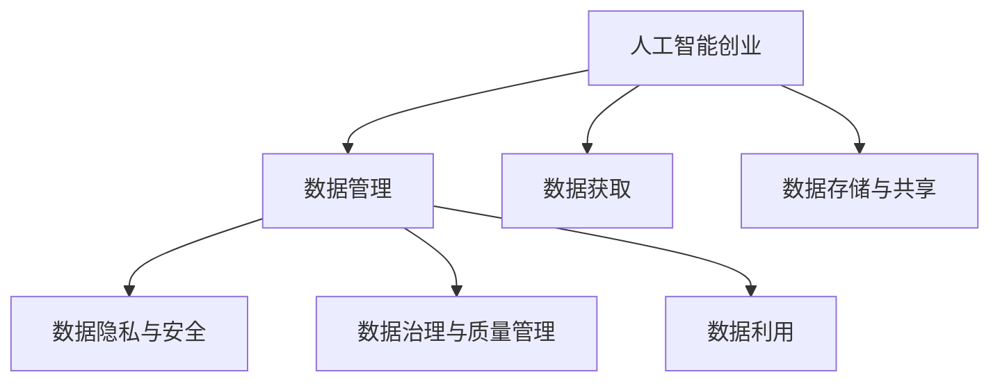

                 

# 人工智能创业数据管理的策略指南

> 关键词：人工智能创业,数据管理,数据策略,人工智能应用,企业创新

## 1. 背景介绍

### 1.1 问题由来

在人工智能(AI)的浪潮中，创业公司如何高效、安全地管理和利用数据，成为亟待解决的关键问题。一方面，数据是AI技术发展的基石，获取高质量数据、实现数据闭环、提升数据利用率，对AI应用的创新和落地至关重要。另一方面，数据的安全性和隐私保护，对用户的信任和合规性同样具有决定性影响。本指南旨在系统阐述人工智能创业公司如何构建数据管理策略，充分利用数据价值，同时确保数据安全和合规。

### 1.2 问题核心关键点

人工智能创业公司的数据管理策略，需要围绕数据获取、存储、利用和保护等多个环节进行全面布局，主要包括以下几个关键点：

1. **数据获取与标注**：如何高效获取有价值的数据，并进行高质量标注，是AI应用创新的重要基础。
2. **数据存储与共享**：如何设计高效的数据存储和共享机制，确保数据的高效利用。
3. **数据隐私与安全**：如何在确保数据安全的同时，实现数据的合规使用，赢得用户信任。
4. **数据治理与质量管理**：如何构建系统化的数据治理机制，提升数据质量，保障数据可靠性和稳定性。
5. **数据驱动的业务创新**：如何利用数据驱动企业创新，实现业务与数据相辅相成的良性循环。

## 2. 核心概念与联系

### 2.1 核心概念概述

为更好地理解数据管理策略，本节将介绍几个密切相关的核心概念：

- **人工智能创业**：指以人工智能技术为核心的创新型企业，致力于通过AI技术解决实际问题，推动社会进步。
- **数据管理**：指在数据生命周期内，通过规划、组织、控制和使用等手段，实现数据的价值最大化。
- **数据治理**：指对数据的获取、存储、使用、共享、销毁等全生命周期过程进行管理和控制，确保数据的质量、安全和合规。
- **数据策略**：指为达成特定业务目标，制定的一系列系统化的数据管理方案和措施。
- **数据利用**：指通过数据挖掘、分析、训练等手段，实现数据的价值转化，支撑企业业务决策和创新。

这些核心概念之间的逻辑关系可以通过以下Mermaid流程图来展示：



这个流程图展示了大语言模型的核心概念及其之间的关系：

1. 人工智能创业公司通过数据管理，从数据获取、存储、利用到隐私保护，实现全生命周期的数据价值最大化。
2. 数据获取和存储是数据管理的基石，而数据治理与质量管理则确保数据的高效和可靠。
3. 数据利用则是数据管理策略的核心，通过数据挖掘、分析等手段，实现数据价值的最大化。
4. 数据隐私与安全是数据管理的底线，确保数据在利用过程中遵循合规性，赢得用户信任。

## 3. 核心算法原理 & 具体操作步骤
### 3.1 算法原理概述

人工智能创业公司的数据管理策略，主要围绕以下几个关键环节进行设计：

1. **数据获取与标注**：通过高效的数据获取和高质量的标注，为AI应用提供数据基础。
2. **数据存储与共享**：设计高效的数据存储和共享机制，实现数据的灵活利用。
3. **数据隐私与安全**：利用隐私保护技术和合规策略，确保数据的安全和合规。
4. **数据治理与质量管理**：构建系统化的数据治理机制，提升数据质量，保障数据可靠性和稳定性。
5. **数据驱动的业务创新**：通过数据利用和驱动，推动企业创新和业务发展。

### 3.2 算法步骤详解

以下是人工智能创业公司进行数据管理的详细步骤：

#### 第一步：数据获取与标注

1. **确定数据需求**：明确AI应用的具体数据需求，包括数据类型、数量和质量要求。
2. **数据源选择**：选择合适的数据源，如公开数据集、合作机构、购买数据等。
3. **数据采集**：通过爬虫、API、合作协议等方式获取数据。
4. **数据预处理**：清洗、去重、标注数据，确保数据质量。

#### 第二步：数据存储与共享

1. **存储方案设计**：选择合适的数据存储方案，如本地存储、云存储、分布式存储等。
2. **数据访问控制**：设计数据访问控制策略，确保数据的安全性和隐私保护。
3. **数据共享机制**：建立数据共享平台或协议，实现数据的灵活共享和利用。

#### 第三步：数据隐私与安全

1. **隐私保护技术**：引入隐私保护技术，如差分隐私、联邦学习、加密存储等，确保数据的隐私性。
2. **合规策略制定**：制定符合法律法规的数据使用策略，如GDPR、CCPA等，确保数据使用的合规性。
3. **安全监控与审计**：建立安全监控和审计机制，实时监测数据访问和使用情况。

#### 第四步：数据治理与质量管理

1. **数据标准制定**：制定数据标准和规范，确保数据的一致性和可解释性。
2. **数据质量管理**：建立数据质量监控机制，定期评估数据质量。
3. **数据治理体系**：构建系统化的数据治理体系，确保数据管理的全面性和系统性。

#### 第五步：数据驱动的业务创新

1. **数据挖掘与分析**：利用数据挖掘和分析工具，提取数据价值。
2. **模型训练与优化**：构建AI模型，训练和优化模型，实现数据价值转换。
3. **业务驱动与创新**：将AI模型应用到业务流程中，推动业务创新和优化。

### 3.3 算法优缺点

人工智能创业公司数据管理策略具有以下优点：

1. **高效利用数据**：通过系统化的数据管理，确保数据的高效利用和价值最大化。
2. **确保数据安全**：引入隐私保护和合规策略，确保数据在利用过程中的安全性。
3. **提升数据质量**：通过数据治理和质量管理，提升数据的一致性和可靠性。
4. **推动业务创新**：利用数据驱动业务决策和创新，实现业务与数据的良性循环。

同时，该策略也存在一些缺点：

1. **初始成本较高**：设计和实施数据管理策略需要投入较高的初始成本。
2. **技术复杂度较高**：数据管理涉及多个技术环节，需要综合技术能力。
3. **数据依赖较大**：数据管理的核心是数据，对数据源的依赖较大。
4. **数据风险存在**：数据泄露、滥用等风险，需要严格管理和监控。

尽管存在这些缺点，但数据管理策略仍是人工智能创业公司数据价值利用的关键。未来相关研究的重点在于如何进一步降低初始成本，提升数据管理的灵活性和效率，同时确保数据安全和隐私保护。

### 3.4 算法应用领域

数据管理策略在大数据、人工智能、智能制造、医疗健康、金融科技等领域均有广泛应用。以下是几个典型应用场景：

1. **大数据分析**：通过高效的数据获取和存储，实现大规模数据分析和挖掘，支撑决策支持。
2. **智能制造**：利用数据驱动的生产和优化，实现智能制造和质量控制。
3. **医疗健康**：通过数据管理，实现精准医疗和健康管理，提升医疗服务质量。
4. **金融科技**：利用数据驱动的风险管理和金融创新，提升金融服务效率和安全性。
5. **智能推荐**：通过数据管理和用户行为分析，实现个性化推荐，提升用户体验。

## 4. 数学模型和公式 & 详细讲解  
### 4.1 数学模型构建

本节将使用数学语言对数据管理策略进行更加严格的刻画。

假设数据管理策略的目标是最大化数据价值 $V$，其中 $V=f(D)$，$D$ 为数据集，$f$ 为数据价值转换函数。目标函数可以表示为：

$$
\max V = f(D)
$$

其中，$f$ 是一个复杂函数，涉及数据采集、预处理、存储、分析和应用等多个环节。

### 4.2 公式推导过程

以下我们以智能推荐系统为例，推导数据管理策略的优化公式。

假设数据管理策略的目标是最大化用户满意度 $S$，其中 $S=h(R)$，$R$ 为用户反馈数据集，$h$ 为满意度转换函数。目标函数可以表示为：

$$
\max S = h(R)
$$

其中，$R$ 包括用户的点击、购买、评分等反馈数据，$h$ 根据用户反馈计算满意度。

数据管理策略需要最大化用户满意度，因此需要优化数据获取、存储、分析和推荐等环节。可以通过以下步骤进行优化：

1. **数据获取优化**：优化数据采集方案，获取高质量用户反馈数据。
2. **数据存储优化**：优化数据存储方式，减少数据存储成本。
3. **数据分析优化**：利用数据挖掘和机器学习算法，优化推荐算法。
4. **推荐算法优化**：优化推荐算法，提升推荐效果。

具体而言，可以通过以下公式进行优化：

$$
\max S = h(R) = \max \left[ \sum_{i=1}^{N} r_i \cdot p_i \right]
$$

其中，$r_i$ 为第 $i$ 个用户反馈数据，$p_i$ 为该数据对用户满意度的贡献权重。

通过对目标函数进行优化，可以提升推荐系统的用户满意度，实现数据驱动的业务创新。

### 4.3 案例分析与讲解

以下是智能推荐系统数据管理策略的具体案例分析：

假设某智能推荐系统目标为用户最大化满意度。系统首先收集用户的历史行为数据，包括点击、购买、评分等反馈。然后，对数据进行清洗和去重，去除噪声和重复数据，确保数据质量。

接下来，系统利用数据挖掘和机器学习算法，构建用户行为模型，分析用户的兴趣和偏好。最后，基于用户行为模型，构建推荐算法，实现个性化推荐。

通过上述步骤，系统可以在用户反馈数据的基础上，最大化用户满意度，实现数据驱动的业务创新。

## 5. 项目实践：代码实例和详细解释说明
### 5.1 开发环境搭建

在进行数据管理策略的实践前，我们需要准备好开发环境。以下是使用Python进行数据管理策略开发的典型环境配置流程：

1. 安装Python：从官网下载并安装Python，支持多个版本，根据项目需要选择。
2. 安装必要的库：安装numpy、pandas、scikit-learn等数据分析库，以及TensorFlow、PyTorch等机器学习库。
3. 搭建数据管理平台：选择适合的数据管理工具，如Hadoop、Spark、ElasticSearch等，搭建数据存储和分析平台。
4. 安装可视化工具：安装matplotlib、seaborn等可视化工具，用于数据展示和分析。
5. 搭建测试环境：设置测试环境，如Kubernetes集群，用于模型测试和优化。

完成上述步骤后，即可在Python环境中开始数据管理策略的实践。

### 5.2 源代码详细实现

下面我们以智能推荐系统为例，给出使用Python进行数据管理策略开发的代码实现。

首先，定义数据管理策略的目标函数：

```python
import numpy as np
from sklearn.metrics import precision_recall_fscore_support

def objective_function(data, strategy):
    # 数据预处理和清洗
    cleaned_data = preprocess_and_clean(data)
    # 数据分析和建模
    model = build_model(cleaned_data)
    # 预测和评估
    predictions = model.predict(cleaned_data)
    # 计算用户满意度
    recall, precision, f1, _ = precision_recall_fscore_support(true_labels, predictions, average='micro')
    return recall * precision * f1

# 具体实现数据预处理、模型构建和评估
def preprocess_and_clean(data):
    # 数据预处理和清洗逻辑
    pass

def build_model(data):
    # 数据建模逻辑
    pass

def evaluate_model(model, data):
    # 模型评估逻辑
    pass
```

然后，定义数据管理策略的具体实现：

```python
def data_management_strategy(data):
    # 数据获取与标注
    data = get_and_annotate_data(data)
    # 数据存储与共享
    data = store_and_share_data(data)
    # 数据隐私与安全
    data = protect_data_privacy(data)
    # 数据治理与质量管理
    data = manage_data_governance(data)
    # 数据驱动的业务创新
    data = drive_business_innovation(data)
    return data
```

最后，调用数据管理策略函数，输出目标函数值：

```python
data = load_data()
target_function_value = objective_function(data, data_management_strategy)
print(f"目标函数值为: {target_function_value}")
```

以上就是使用Python进行数据管理策略开发的完整代码实现。可以看到，数据管理策略的核心在于目标函数的优化，通过预处理、建模、评估等步骤，逐步提升用户满意度，实现数据驱动的业务创新。

### 5.3 代码解读与分析

让我们再详细解读一下关键代码的实现细节：

**objective_function函数**：
- 定义了数据管理策略的目标函数，用于计算用户满意度。
- 在函数中，首先对数据进行预处理和清洗，去除噪声和重复数据。
- 然后构建推荐模型，进行预测。
- 最后计算推荐系统的精度、召回率和F1分数，计算用户满意度。

**preprocess_and_clean函数**：
- 定义数据预处理和清洗逻辑，用于确保数据的质量和一致性。
- 在函数中，可以进行数据格式转换、去重、填充缺失值等操作。

**build_model函数**：
- 定义推荐模型的构建逻辑，用于实现个性化推荐。
- 在函数中，可以选择不同的推荐算法，如协同过滤、基于内容的推荐等。

**evaluate_model函数**：
- 定义模型评估逻辑，用于评估推荐模型的效果。
- 在函数中，可以使用交叉验证、AUC、MSE等指标评估推荐模型的性能。

**data_management_strategy函数**：
- 定义数据管理策略的具体实现，用于优化目标函数。
- 在函数中，依次进行数据获取、存储、隐私保护、治理和创新等步骤。

可以看到，数据管理策略的实现涉及多个环节，每个环节都需要根据具体应用场景进行优化和调整。开发者需要综合考虑数据获取、处理、存储、隐私保护、模型构建和业务应用等多个方面，才能实现高效、安全的数据管理策略。

## 6. 实际应用场景

### 6.1 智能推荐系统

智能推荐系统是数据管理策略的重要应用场景之一。通过数据管理策略，可以实现高效的数据获取、存储、分析和推荐，提升用户满意度，实现业务创新。

在技术实现上，可以设计推荐算法，利用用户历史行为数据进行个性化推荐。同时，通过数据治理机制，确保数据的质量和安全性。在用户反馈的基础上，不断优化推荐模型，提升推荐效果。

### 6.2 医疗健康

医疗健康领域的数据管理策略，可以实现精准医疗和健康管理，提升医疗服务质量。

具体而言，可以收集患者的历史健康数据，如病历、体检报告等，进行数据清洗和预处理。然后，利用数据挖掘和机器学习算法，构建健康预测模型，实现个性化健康管理。在患者反馈的基础上，不断优化模型，提升健康管理的准确性和可靠性。

### 6.3 金融科技

金融科技领域的数据管理策略，可以实现风险管理和金融创新，提升金融服务效率和安全性。

具体而言，可以收集用户的金融交易数据，如账户信息、交易记录等，进行数据清洗和预处理。然后，利用数据挖掘和机器学习算法，构建金融风险预测模型，实现风险管理和个性化金融推荐。在用户反馈的基础上，不断优化模型，提升金融服务的质量和安全性。

### 6.4 未来应用展望

随着数据管理策略的不断演进，未来在更多领域将得到应用，为传统行业带来变革性影响。

在智慧城市治理中，数据管理策略可以应用于城市事件监测、舆情分析、应急指挥等环节，提高城市管理的自动化和智能化水平，构建更安全、高效的未来城市。

在智能制造中，数据管理策略可以实现生产流程优化和质量控制，提升生产效率和产品质量。

在智慧农业中，数据管理策略可以实现农业数据的采集、存储和分析，实现精准农业和农业信息化管理。

此外，在智慧物流、智慧交通、智慧旅游等众多领域，数据管理策略也将不断涌现，为各行业带来新的发展机遇。相信随着技术的日益成熟，数据管理策略将在更多领域得到应用，为社会带来深远的影响。

## 7. 工具和资源推荐
### 7.1 学习资源推荐

为了帮助开发者系统掌握数据管理策略的理论基础和实践技巧，这里推荐一些优质的学习资源：

1. 《Python数据科学手册》系列博文：由数据科学家撰写，深入浅出地介绍了Python在数据科学中的应用，包括数据获取、处理、分析和可视化等。

2. CS229《机器学习》课程：斯坦福大学开设的经典机器学习课程，涵盖了机器学习的基本概念和算法，适合初学者和进阶者。

3. 《数据科学实战》书籍：全面介绍了数据科学的应用流程和技术工具，包括数据管理、数据治理、数据驱动等。

4. Kaggle数据科学竞赛：世界知名的数据科学竞赛平台，提供了丰富的数据集和算法挑战，适合实战练习。

5. GitHub数据管理开源项目：收集了数据管理领域的优秀开源项目，提供实用的代码和文档参考。

通过对这些资源的学习实践，相信你一定能够快速掌握数据管理策略的精髓，并用于解决实际的业务问题。
### 7.2 开发工具推荐

高效的开发离不开优秀的工具支持。以下是几款用于数据管理策略开发的常用工具：

1. Python：作为数据科学和人工智能领域的通用语言，Python拥有丰富的数据处理和机器学习库，如numpy、pandas、scikit-learn等。

2. SQL：作为数据管理的基础工具，SQL语言用于数据存储、查询和分析，适合处理大规模数据。

3. Hadoop和Spark：大数据处理平台，支持大规模数据的存储、处理和分析。

4. ElasticSearch：分布式搜索引擎，适合大规模文本数据的存储和查询。

5. Tableau：数据可视化工具，适合数据的展示和分析，支持多种数据源和可视化方式。

6. Jupyter Notebook：交互式开发环境，适合数据科学和机器学习的快速迭代开发。

合理利用这些工具，可以显著提升数据管理策略的开发效率，加快创新迭代的步伐。

### 7.3 相关论文推荐

数据管理策略的发展源于学界的持续研究。以下是几篇奠基性的相关论文，推荐阅读：

1. DASL: A Data-As-a-Service Framework for Scalable Cloud Data Management：提出了数据即服务的数据管理框架，实现了数据的高效利用和共享。

2. A Survey of Data Governance Practices: Organizational Perspectives and Practical Applications：综述了数据治理的最佳实践和应用场景，为数据治理提供了理论基础。

3. Big Data Analytics: A Survey of Techniques and Applications：综述了大数据分析的技术和应用，为数据驱动的业务创新提供了参考。

4. Deep Learning for Internet of Things: Concepts, Methods, and Applications：介绍了深度学习在物联网中的应用，为数据驱动的创新提供了新的思路。

这些论文代表了大数据管理策略的发展脉络。通过学习这些前沿成果，可以帮助研究者把握学科前进方向，激发更多的创新灵感。

## 8. 总结：未来发展趋势与挑战

### 8.1 总结

本文对人工智能创业公司如何构建数据管理策略进行了全面系统的介绍。首先阐述了数据管理策略的研究背景和意义，明确了数据管理策略在人工智能应用中的重要价值。其次，从原理到实践，详细讲解了数据管理的数学模型和关键步骤，给出了数据管理策略开发的完整代码实例。同时，本文还广泛探讨了数据管理策略在多个行业领域的应用前景，展示了数据管理策略的巨大潜力。最后，精选了数据管理策略的各类学习资源，力求为读者提供全方位的技术指引。

通过本文的系统梳理，可以看到，数据管理策略在人工智能创业公司的数据价值利用中起着至关重要的作用。数据管理策略的实施，不仅需要技术手段的支撑，还需要系统化的管理和治理，确保数据的质量、安全和合规。未来，伴随技术手段的不断进步，数据管理策略必将更好地服务于人工智能创业公司的创新和发展。

### 8.2 未来发展趋势

展望未来，数据管理策略将呈现以下几个发展趋势：

1. **数据自动化管理**：随着自动化技术的发展，数据管理策略将实现自动化处理，提升数据管理的效率和准确性。
2. **数据隐私保护增强**：数据隐私保护技术将不断提升，确保数据在利用过程中的安全性。
3. **数据治理智能化**：数据治理将引入人工智能和机器学习技术，实现智能化数据管理。
4. **数据驱动的决策优化**：数据管理策略将更加注重决策优化，通过数据分析和建模，实现业务流程的优化。
5. **跨领域数据管理**：数据管理策略将实现跨领域的数据集成和应用，提升数据的综合价值。

以上趋势凸显了数据管理策略的广阔前景。这些方向的探索发展，必将进一步提升数据管理的效率和效果，推动人工智能创业公司的创新和发展。

### 8.3 面临的挑战

尽管数据管理策略已经取得了一定的成效，但在迈向更加智能化、普适化应用的过程中，它仍面临着诸多挑战：

1. **数据孤岛问题**：不同系统间的数据共享和整合仍存在较大障碍，影响数据的综合利用。
2. **数据隐私和安全问题**：数据泄露和滥用风险仍未完全消除，需加强数据隐私保护和合规性管理。
3. **数据质量和完整性问题**：数据质量参差不齐，影响数据分析和应用效果。
4. **数据治理复杂性**：数据治理体系复杂，需要系统化的管理和维护。
5. **数据利用效率问题**：数据利用效率仍有提升空间，需优化数据处理和分析流程。

尽管存在这些挑战，但数据管理策略仍是人工智能创业公司数据价值利用的关键。未来相关研究的重点在于如何进一步提升数据治理的效率和效果，优化数据处理和分析流程，实现数据的高效利用。

### 8.4 研究展望

面对数据管理策略面临的挑战，未来的研究需要在以下几个方面寻求新的突破：

1. **数据自动化管理技术**：探索自动化处理数据的方法，提升数据管理的效率和准确性。
2. **数据隐私和安全技术**：研究数据隐私保护的新技术，提升数据在利用过程中的安全性。
3. **智能化数据治理技术**：引入人工智能和机器学习技术，实现智能化数据治理。
4. **跨领域数据管理技术**：研究跨领域数据集成的技术，提升数据的综合价值。
5. **数据质量提升技术**：研究数据清洗和质量提升的新方法，提升数据质量和完整性。

这些研究方向的探索，必将引领数据管理策略走向更高的台阶，为人工智能创业公司提供更加高效、安全、可靠的数据管理支持。面向未来，数据管理策略需要在技术、管理和政策等多个层面进行协同优化，实现数据的全面价值利用。

## 9. 附录：常见问题与解答

**Q1：数据管理策略是否适用于所有人工智能创业公司？**

A: 数据管理策略在绝大多数人工智能创业公司都有广泛应用，特别是那些依赖大量数据进行决策和创新的企业。但在一些数据依赖性较小的创业公司，如硬科技领域，数据管理策略的作用可能相对有限。

**Q2：数据管理策略需要哪些关键技术支持？**

A: 数据管理策略的实施需要以下关键技术支持：

1. 数据存储和处理技术：如分布式存储、大数据处理平台等。
2. 数据隐私保护技术：如差分隐私、联邦学习、加密存储等。
3. 数据治理和质量管理技术：如数据标准制定、数据质量监控等。
4. 数据可视化技术：如数据可视化工具、仪表板等。
5. 数据驱动的决策优化技术：如推荐算法、优化算法等。

**Q3：数据管理策略的初始成本较高，如何解决？**

A: 数据管理策略的初始成本确实较高，但可以通过以下方式进行优化：

1. 引入云计算服务：利用云平台提供的数据存储和处理服务，降低初始投资。
2. 分阶段实施：采用分阶段实施策略，逐步构建数据管理基础设施。
3. 数据共享和合作：与合作伙伴共享数据，降低数据获取和标注成本。
4. 开源工具和框架：利用开源工具和框架，降低开发和部署成本。

**Q4：如何评估数据管理策略的效果？**

A: 数据管理策略的效果评估可以从以下几个方面进行：

1. 数据质量提升：通过数据清洗和质量管理，提升数据的一致性和可靠性。
2. 业务指标提升：通过数据驱动的决策优化，提升业务指标，如用户满意度、交易量等。
3. 成本降低：通过数据自动化管理和优化，降低数据管理和应用成本。
4. 数据利用效率提升：通过数据共享和跨领域数据集成，提升数据利用效率。

**Q5：数据管理策略在数据驱动的业务创新中扮演什么角色？**

A: 数据管理策略在数据驱动的业务创新中扮演着至关重要的角色，主要体现在以下几个方面：

1. 数据获取和标注：为AI应用提供高质量的数据基础。
2. 数据存储和共享：实现数据的灵活利用，支持跨部门、跨系统的数据共享。
3. 数据隐私和安全：确保数据在利用过程中的安全性，赢得用户信任。
4. 数据治理和质量管理：提升数据质量，保障数据可靠性和稳定性。
5. 数据驱动的决策优化：利用数据驱动业务决策和创新，实现业务与数据的良性循环。

以上问题与解答，帮助您更好地理解数据管理策略的实施和应用，希望对人工智能创业公司的发展有所帮助。

---

作者：禅与计算机程序设计艺术 / Zen and the Art of Computer Programming

