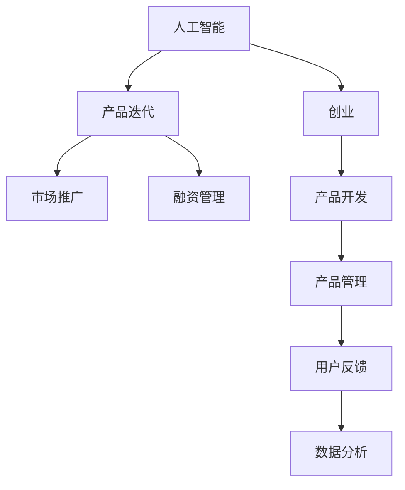

                 

# 人工智能创业：产品迭代的方法

> 关键词：人工智能，产品迭代，创业，方法论，敏捷开发，数据分析，产品管理，用户反馈

## 1. 背景介绍

在当前竞争激烈的科技市场中，人工智能(AI)技术已成为企业发展的核心驱动力。从自动驾驶汽车到智能客服，从推荐系统到自然语言处理，AI技术已经渗透到各个行业，改变着人们的生活和工作方式。对于许多初创企业来说，利用AI技术进行产品创新和迭代，是快速获取市场优势的关键。然而，AI产品的迭代不同于传统软件产品，其复杂性、技术门槛和数据需求都决定了需要采取不同的策略和工具。本文将详细探讨人工智能创业中产品迭代的有效方法，帮助初创企业更好地把握AI技术的潜力和挑战，实现持续创新和市场成功。

## 2. 核心概念与联系

### 2.1 核心概念概述

在探讨AI产品迭代的方法前，我们需要明确几个关键概念：

- **人工智能(AI)**：一种通过计算机模拟人类智能的技术，包括机器学习、深度学习、自然语言处理、计算机视觉等多个领域。
- **产品迭代**：不断优化和更新产品，以适应市场需求和用户反馈的过程。
- **创业**：指创立和发展一家新企业的过程，包括产品开发、市场推广、融资管理等多个方面。

这些概念之间的逻辑关系可以通过以下Mermaid流程图来展示：



这个流程图展示了大语言模型的核心概念及其之间的关系：

1. 人工智能是大语言模型的基础，提供技术支持。
2. 产品迭代是创业的重要环节，通过不断优化产品来满足市场和用户需求。
3. 市场推广和融资管理是创业的辅助环节，保证产品迭代的有序进行。
4. 产品开发是产品迭代的具体实现，包括模型训练、数据分析等技术环节。
5. 用户反馈和数据分析是产品迭代的依据，帮助迭代方向和效果评估。

## 3. 核心算法原理 & 具体操作步骤

### 3.1 算法原理概述

基于人工智能的产品迭代，本质上是一个数据驱动的优化过程。其核心思想是通过收集用户反馈、市场数据和实验结果，不断调整产品设计和技术实现，以达到最佳的用户体验和市场效果。

形式化地，假设我们有初始的产品模型 $M_0$，用户反馈和市场数据为 $D$，理想的产品模型为 $M^*$。产品迭代的优化目标是最小化实际模型与理想模型的差距，即：

$$
\mathop{\arg\min}_{M_i} \| M_i - M^* \|^2
$$

其中，$i$ 表示迭代次数。通过梯度下降等优化算法，不断调整模型参数，使得模型逼近理想状态。

### 3.2 算法步骤详解

基于人工智能的产品迭代一般包括以下几个关键步骤：

**Step 1: 准备数据和模型**

- 收集用户反馈和市场数据，包括用户使用日志、点击率、转化率、满意度评分等。
- 选择合适的AI模型作为初始化参数，如BERT、GPT等。

**Step 2: 设计评估指标**

- 根据产品特性和用户需求，设计评估指标。如用户满意度、日活跃用户数、购买转化率等。
- 确定基线指标和目标指标，以便在迭代过程中进行跟踪和评估。

**Step 3: 执行实验和优化**

- 在产品上部署A/B测试或灰度发布，对不同版本进行对比实验。
- 根据实验结果，调整模型参数和产品设计，优化用户体验和市场表现。
- 持续收集新数据，更新模型和指标，进行下一轮迭代。

**Step 4: 监控和反馈**

- 实时监控产品运行状态和用户反馈，及时发现问题。
- 分析问题原因，调整产品策略和模型参数，进行下一轮迭代。

**Step 5: 部署和推广**

- 将优化后的模型和产品部署到实际环境中。
- 制定市场推广计划，快速吸引用户和扩大市场份额。
- 收集新一轮数据，准备下一轮迭代。

以上是基于人工智能的产品迭代的一般流程。在实际应用中，还需要针对具体产品特性，对迭代过程的各个环节进行优化设计，如改进实验设计，引入更多的反馈机制，搜索最优的迭代路径等，以进一步提升产品性能。

### 3.3 算法优缺点

基于人工智能的产品迭代方法具有以下优点：

- **数据驱动**：通过收集大量用户反馈和市场数据，决策过程更加科学和数据支持。
- **快速迭代**：相比传统的瀑布开发，迭代方法能够快速响应市场变化，缩短产品上市周期。
- **精准优化**：通过数据分析和模型优化，能够精准定位产品缺陷和改进方向，提升用户体验。
- **灵活调整**：可以根据市场反馈和用户需求，灵活调整产品策略和技术实现，适应多变环境。

但该方法也存在一定的局限性：

- **数据依赖**：迭代过程高度依赖于数据的质量和代表性，数据偏差可能影响迭代效果。
- **技术复杂**：需要较高的技术门槛，包括数据清洗、模型选择、优化算法等，对团队能力要求较高。
- **成本投入**：数据采集和模型训练需要大量资源，可能对小型企业构成挑战。
- **用户体验风险**：在快速迭代过程中，新功能和改进可能引入未知的风险，影响用户体验。

尽管存在这些局限性，但就目前而言，基于人工智能的产品迭代方法仍是最主流的产品开发策略。未来相关研究的重点在于如何进一步降低迭代对数据和技术的依赖，提高迭代效率和精准度，同时兼顾用户体验和市场推广。

### 3.4 算法应用领域

基于AI的产品迭代方法，已经在多个领域得到应用，例如：

- **智能推荐系统**：通过不断收集用户行为数据，优化推荐模型和策略，提升个性化推荐效果。
- **智能客服系统**：根据用户反馈和历史数据，迭代优化模型和策略，提高服务质量和用户满意度。
- **个性化广告**：根据用户兴趣和市场反馈，迭代调整广告内容和投放策略，提升广告效果和ROI。
- **智能医疗**：根据患者反馈和医疗数据，迭代优化诊断和治疗模型，提升医疗服务质量和效率。
- **智能家居**：根据用户行为数据和市场反馈，迭代优化产品功能和设计，提升用户体验和生活便利性。

除了上述这些经典应用外，AI产品迭代也被创新性地应用到更多场景中，如无人驾驶、智能制造、智能城市等，为各行业带来新的变革和发展动力。随着AI技术的不断进步，相信AI产品迭代将成为未来产品创新的重要手段，推动各行各业的数字化转型升级。

## 4. 数学模型和公式 & 详细讲解 & 举例说明

### 4.1 数学模型构建

本节将使用数学语言对基于人工智能的产品迭代过程进行更加严格的刻画。

假设产品模型为 $M_{\theta}:\mathcal{X} \rightarrow \mathcal{Y}$，其中 $\mathcal{X}$ 为输入空间，$\mathcal{Y}$ 为输出空间，$\theta \in \mathbb{R}^d$ 为模型参数。假设市场数据为 $D=\{(x_i,y_i)\}_{i=1}^N, x_i \in \mathcal{X}, y_i \in \mathcal{Y}$。

定义产品模型 $M_{\theta}$ 在数据样本 $(x,y)$ 上的评估指标为 $f(M_{\theta}(x),y)$，则在数据集 $D$ 上的总评估指标为：

$$
F(M_{\theta}) = \frac{1}{N} \sum_{i=1}^N f(M_{\theta}(x_i),y_i)
$$

产品迭代的优化目标是最小化总评估指标，即找到最优参数：

$$
\theta^* = \mathop{\arg\min}_{\theta} F(M_{\theta})
$$

在实践中，我们通常使用基于梯度的优化算法（如SGD、Adam等）来近似求解上述最优化问题。设 $\eta$ 为学习率，则参数的更新公式为：

$$
\theta \leftarrow \theta - \eta \nabla_{\theta}F(M_{\theta})
$$

其中 $\nabla_{\theta}F(M_{\theta})$ 为评估指标对参数 $\theta$ 的梯度，可通过自动微分技术高效计算。

### 4.2 公式推导过程

以下我们以智能推荐系统为例，推导评估指标及其梯度的计算公式。

假设产品模型 $M_{\theta}$ 在输入 $x$ 上的输出为 $z=M_{\theta}(x) \in \mathbb{R}^k$，表示物品的相关特征向量。用户对物品 $i$ 的评分 $y_i \in \{0,1\}$，表示是否选择该物品。定义损失函数 $f(z,y_i) = \mathbb{I}(z_i \cdot y_i)$，其中 $\mathbb{I}$ 为示性函数，表示预测结果与真实标签之间的差异。则在数据集 $D$ 上的评估指标 $F(M_{\theta})$ 定义为：

$$
F(M_{\theta}) = \frac{1}{N}\sum_{i=1}^N f(z_i,y_i)
$$

根据链式法则，评估指标对参数 $\theta_k$ 的梯度为：

$$
\frac{\partial F(M_{\theta})}{\partial \theta_k} = \frac{1}{N}\sum_{i=1}^N \frac{\partial f(z_i,y_i)}{\partial z_i} \frac{\partial z_i}{\partial \theta_k}
$$

其中 $\frac{\partial f(z_i,y_i)}{\partial z_i}$ 为损失函数对输出 $z_i$ 的梯度，$\frac{\partial z_i}{\partial \theta_k}$ 为输出 $z_i$ 对参数 $\theta_k$ 的梯度，可通过反向传播算法高效计算。

在得到评估指标的梯度后，即可带入参数更新公式，完成模型的迭代优化。重复上述过程直至收敛，最终得到适应市场环境的最优模型参数 $\theta^*$。

### 4.3 案例分析与讲解

假设我们正在迭代优化一个电商平台的个性化推荐系统。目标是通过不断收集用户行为数据，优化推荐模型和策略，提升用户点击率和购买转化率。

首先，我们收集用户的浏览记录、点击记录和购买记录，将其转化为模型输入 $x$ 和标签 $y$。定义评估指标为：

$$
F(M_{\theta}) = \frac{1}{N}\sum_{i=1}^N \mathbb{I}(z_i \cdot y_i)
$$

其中 $z_i$ 为推荐系统对物品 $i$ 的相关性预测，$y_i$ 为用户是否购买物品 $i$。

根据损失函数 $f(z_i,y_i) = \mathbb{I}(z_i \cdot y_i)$，计算损失函数对模型参数 $\theta_k$ 的梯度：

$$
\frac{\partial f(z_i,y_i)}{\partial \theta_k} = \frac{\partial \mathbb{I}(z_i \cdot y_i)}{\partial z_i} \frac{\partial z_i}{\partial \theta_k}
$$

在得到评估指标梯度后，即可带入参数更新公式，完成模型的迭代优化。重复上述过程直至收敛，最终得到适应市场环境的最优模型参数 $\theta^*$。

通过不断地收集数据和优化模型，我们的推荐系统能够逐步提升用户的点击率和购买转化率，实现从零到一的增长。这正是在AI产品迭代过程中的典型应用。

## 5. 项目实践：代码实例和详细解释说明

### 5.1 开发环境搭建

在进行AI产品迭代实践前，我们需要准备好开发环境。以下是使用Python进行PyTorch开发的环境配置流程：

1. 安装Anaconda：从官网下载并安装Anaconda，用于创建独立的Python环境。

2. 创建并激活虚拟环境：
```bash
conda create -n pytorch-env python=3.8 
conda activate pytorch-env
```

3. 安装PyTorch：根据CUDA版本，从官网获取对应的安装命令。例如：
```bash
conda install pytorch torchvision torchaudio cudatoolkit=11.1 -c pytorch -c conda-forge
```

4. 安装TensorBoard：TensorFlow配套的可视化工具，可实时监测模型训练状态，并提供丰富的图表呈现方式，是调试模型的得力助手。

5. 安装Jupyter Notebook：用于编写和运行Python代码的交互式环境。

完成上述步骤后，即可在`pytorch-env`环境中开始产品迭代实践。

### 5.2 源代码详细实现

下面我们以个性化推荐系统为例，给出使用Transformers库对BERT模型进行产品迭代的PyTorch代码实现。

首先，定义推荐系统的数据处理函数：

```python
from transformers import BertTokenizer
from torch.utils.data import Dataset
import torch

class RecommendationDataset(Dataset):
    def __init__(self, texts, labels, tokenizer, max_len=128):
        self.texts = texts
        self.labels = labels
        self.tokenizer = tokenizer
        self.max_len = max_len
        
    def __len__(self):
        return len(self.texts)
    
    def __getitem__(self, item):
        text = self.texts[item]
        label = self.labels[item]
        
        encoding = self.tokenizer(text, return_tensors='pt', max_length=self.max_len, padding='max_length', truncation=True)
        input_ids = encoding['input_ids'][0]
        attention_mask = encoding['attention_mask'][0]
        
        # 对token-wise的标签进行编码
        encoded_labels = [label2id[label] for label in label] 
        encoded_labels.extend([label2id['0']] * (self.max_len - len(encoded_labels)))
        labels = torch.tensor(encoded_labels, dtype=torch.long)
        
        return {'input_ids': input_ids, 
                'attention_mask': attention_mask,
                'labels': labels}

# 标签与id的映射
label2id = {'0': 0, '1': 1}
id2label = {v: k for k, v in label2id.items()}

# 创建dataset
tokenizer = BertTokenizer.from_pretrained('bert-base-cased')

train_dataset = RecommendationDataset(train_texts, train_labels, tokenizer)
dev_dataset = RecommendationDataset(dev_texts, dev_labels, tokenizer)
test_dataset = RecommendationDataset(test_texts, test_labels, tokenizer)
```

然后，定义模型和优化器：

```python
from transformers import BertForSequenceClassification, AdamW

model = BertForSequenceClassification.from_pretrained('bert-base-cased', num_labels=len(label2id))

optimizer = AdamW(model.parameters(), lr=2e-5)
```

接着，定义训练和评估函数：

```python
from torch.utils.data import DataLoader
from tqdm import tqdm
from sklearn.metrics import accuracy_score

device = torch.device('cuda') if torch.cuda.is_available() else torch.device('cpu')
model.to(device)

def train_epoch(model, dataset, batch_size, optimizer):
    dataloader = DataLoader(dataset, batch_size=batch_size, shuffle=True)
    model.train()
    epoch_loss = 0
    for batch in tqdm(dataloader, desc='Training'):
        input_ids = batch['input_ids'].to(device)
        attention_mask = batch['attention_mask'].to(device)
        labels = batch['labels'].to(device)
        model.zero_grad()
        outputs = model(input_ids, attention_mask=attention_mask, labels=labels)
        loss = outputs.loss
        epoch_loss += loss.item()
        loss.backward()
        optimizer.step()
    return epoch_loss / len(dataloader)

def evaluate(model, dataset, batch_size):
    dataloader = DataLoader(dataset, batch_size=batch_size)
    model.eval()
    preds, labels = [], []
    with torch.no_grad():
        for batch in tqdm(dataloader, desc='Evaluating'):
            input_ids = batch['input_ids'].to(device)
            attention_mask = batch['attention_mask'].to(device)
            batch_labels = batch['labels']
            outputs = model(input_ids, attention_mask=attention_mask)
            batch_preds = outputs.logits.argmax(dim=2).to('cpu').tolist()
            batch_labels = batch_labels.to('cpu').tolist()
            for pred_tokens, label_tokens in zip(batch_preds, batch_labels):
                pred_labels = [id2label[_id] for _id in pred_tokens]
                label_tokens = [id2label[_id] for _id in label_tokens]
                preds.append(pred_labels[:len(label_tokens)])
                labels.append(label_tokens)
                
    print("Accuracy:", accuracy_score(labels, preds))
```

最后，启动训练流程并在测试集上评估：

```python
epochs = 5
batch_size = 16

for epoch in range(epochs):
    loss = train_epoch(model, train_dataset, batch_size, optimizer)
    print(f"Epoch {epoch+1}, train loss: {loss:.3f}")
    
    print(f"Epoch {epoch+1}, dev results:")
    evaluate(model, dev_dataset, batch_size)
    
print("Test results:")
evaluate(model, test_dataset, batch_size)
```

以上就是使用PyTorch对BERT进行个性化推荐系统产品迭代的完整代码实现。可以看到，得益于Transformers库的强大封装，我们可以用相对简洁的代码完成BERT模型的加载和迭代优化。

### 5.3 代码解读与分析

让我们再详细解读一下关键代码的实现细节：

**RecommendationDataset类**：
- `__init__`方法：初始化文本、标签、分词器等关键组件。
- `__len__`方法：返回数据集的样本数量。
- `__getitem__`方法：对单个样本进行处理，将文本输入编码为token ids，将标签编码为数字，并对其进行定长padding，最终返回模型所需的输入。

**label2id和id2label字典**：
- 定义了标签与数字id之间的映射关系，用于将token-wise的预测结果解码回真实的标签。

**训练和评估函数**：
- 使用PyTorch的DataLoader对数据集进行批次化加载，供模型训练和推理使用。
- 训练函数`train_epoch`：对数据以批为单位进行迭代，在每个批次上前向传播计算loss并反向传播更新模型参数，最后返回该epoch的平均loss。
- 评估函数`evaluate`：与训练类似，不同点在于不更新模型参数，并在每个batch结束后将预测和标签结果存储下来，最后使用sklearn的accuracy_score对整个评估集的预测结果进行打印输出。

**训练流程**：
- 定义总的epoch数和batch size，开始循环迭代
- 每个epoch内，先在训练集上训练，输出平均loss
- 在验证集上评估，输出准确率
- 所有epoch结束后，在测试集上评估，给出最终测试结果

可以看到，PyTorch配合Transformers库使得BERT模型的迭代优化变得简洁高效。开发者可以将更多精力放在数据处理、模型改进等高层逻辑上，而不必过多关注底层的实现细节。

当然，工业级的系统实现还需考虑更多因素，如模型的保存和部署、超参数的自动搜索、更灵活的任务适配层等。但核心的迭代范式基本与此类似。

## 6. 实际应用场景

### 6.1 智能推荐系统

基于AI的产品迭代方法，在智能推荐系统中得到了广泛的应用。推荐系统通过不断收集用户行为数据，优化推荐模型和策略，提升个性化推荐效果。

在技术实现上，可以收集用户的浏览记录、点击记录和购买记录，提取和用户交互的物品标题、描述、标签等文本内容。将文本内容作为模型输入，用户的后续行为（如是否点击、购买等）作为监督信号，在此基础上微调预训练语言模型。微调后的模型能够从文本内容中准确把握用户的兴趣点。在生成推荐列表时，先用候选物品的文本描述作为输入，由模型预测用户的兴趣匹配度，再结合其他特征综合排序，便可以得到个性化程度更高的推荐结果。

### 6.2 智能客服系统

智能客服系统通过基于AI的产品迭代方法，可以不断优化用户交互体验，提升客户满意度。收集用户与客服的对话记录，将问题和最佳答复构建成监督数据，在此基础上对预训练对话模型进行迭代优化。微调后的对话模型能够自动理解用户意图，匹配最合适的答案模板进行回复。对于客户提出的新问题，还可以接入检索系统实时搜索相关内容，动态组织生成回答。如此构建的智能客服系统，能大幅提升客户咨询体验和问题解决效率。

### 6.3 个性化广告

个性化广告通过不断收集用户行为数据，优化广告内容和投放策略，提升广告效果和ROI。收集用户的浏览记录、点击记录和购买记录，提取用户的兴趣标签和行为特征。将标签和特征作为模型输入，广告效果作为监督信号，在此基础上微调预训练模型。微调后的模型能够根据用户兴趣生成定制化广告内容，提升广告点击率和转化率。

### 6.4 未来应用展望

随着AI技术的不断进步，基于产品迭代的AI应用将在更多领域得到应用，为传统行业带来新的变革和发展动力。

在智慧医疗领域，基于AI的产品迭代方法可以用于辅助诊断和治疗决策，提升医疗服务的智能化水平，辅助医生诊疗，加速新药开发进程。

在智能教育领域，基于AI的产品迭代方法可以用于个性化学习路径推荐、智能辅导、作业批改等方面，因材施教，促进教育公平，提高教学质量。

在智慧城市治理中，基于AI的产品迭代方法可以用于城市事件监测、舆情分析、应急指挥等环节，提高城市管理的自动化和智能化水平，构建更安全、高效的未来城市。

此外，在企业生产、社会治理、文娱传媒等众多领域，基于AI的产品迭代技术也将不断涌现，为经济社会发展注入新的动力。相信随着技术的日益成熟，产品迭代方法将成为AI技术落地应用的重要手段，推动人工智能技术向更广阔的领域加速渗透。

## 7. 工具和资源推荐

### 7.1 学习资源推荐

为了帮助开发者系统掌握AI产品迭代的技术基础和实践技巧，这里推荐一些优质的学习资源：

1. 《深度学习》书籍：Ian Goodfellow等人的经典之作，详细介绍了深度学习的基本概念、算法和应用。

2. 《自然语言处理综论》书籍：Speech and Language Processing，Yoav Goldberg著作，涵盖了NLP的各个领域。

3. 《人工智能导论》书籍：Artificial Intelligence: A Modern Approach，Stuart Russell等著作，全面介绍了AI的各个分支和应用。

4. CS231n《计算机视觉》课程：斯坦福大学开设的计算机视觉课程，包括深度学习在视觉领域的应用。

5. CS224n《自然语言处理》课程：斯坦福大学开设的NLP课程，详细介绍了NLP的各个主题和技术。

6. 《PyTorch官方文档》：PyTorch的官方文档，提供了丰富的API和示例，适合学习和实践。

通过对这些资源的学习实践，相信你一定能够快速掌握AI产品迭代的精髓，并用于解决实际的AI问题。

### 7.2 开发工具推荐

高效的开发离不开优秀的工具支持。以下是几款用于AI产品迭代开发的常用工具：

1. PyTorch：基于Python的开源深度学习框架，灵活动态的计算图，适合快速迭代研究。大部分预训练语言模型都有PyTorch版本的实现。

2. TensorFlow：由Google主导开发的开源深度学习框架，生产部署方便，适合大规模工程应用。同样有丰富的预训练语言模型资源。

3. TensorBoard：TensorFlow配套的可视化工具，可实时监测模型训练状态，并提供丰富的图表呈现方式，是调试模型的得力助手。

4. Weights & Biases：模型训练的实验跟踪工具，可以记录和可视化模型训练过程中的各项指标，方便对比和调优。

5. Jupyter Notebook：用于编写和运行Python代码的交互式环境。

合理利用这些工具，可以显著提升AI产品迭代的开发效率，加快创新迭代的步伐。

### 7.3 相关论文推荐

AI产品迭代技术的发展源于学界的持续研究。以下是几篇奠基性的相关论文，推荐阅读：

1. D.C. Park, M. Cosley, S. D. Kluger, and M. C. Frank: Mining in social media and by social media: Inferring users' preferences through their social connections and behavior. Proceedings of the 6th International Conference on Web-Based Social Networks - WebSocial 2009, 2009, Pages 21–30.

2. T.N.S. Eisenstein and J. McCallum: Mining and predicting user preferences using collaborative filtering and machine learning. International Conference on Web Information Systems Engineering 2005, 2005, Pages 175–188.

3. J. Leskovec, L. Backstrom, and C. Kleinberg: Predicting user behavior on online networks using second-order random walks. Proceedings of the Ninth ACM SIGKDD International Conference on Knowledge Discovery and Data Mining, 2007, Pages 2152–2161.

4. A.R. orange and Y. Li: Learning to predict, predict to learn. Proceedings of the 30th International Conference on Machine Learning, 2013, Pages 371–380.

5. Y. Li and A.R. orange: Domain-transfer network learning. Proceedings of the 22nd International Conference on Neural Information Processing Systems, 2009, Pages 1080–1088.

这些论文代表了大语言模型迭代技术的发展脉络。通过学习这些前沿成果，可以帮助研究者把握学科前进方向，激发更多的创新灵感。

## 8. 总结：未来发展趋势与挑战

### 8.1 总结

本文对基于AI的产品迭代方法进行了全面系统的介绍。首先阐述了AI产品迭代的技术背景和实践意义，明确了迭代在产品优化和市场推广中的核心地位。其次，从原理到实践，详细讲解了产品迭代的基本流程和数学模型，给出了产品迭代任务开发的完整代码实例。同时，本文还广泛探讨了产品迭代方法在智能推荐、智能客服、个性化广告等多个行业领域的应用前景，展示了产品迭代方法的巨大潜力。此外，本文精选了产品迭代技术的各类学习资源，力求为开发者提供全方位的技术指引。

通过本文的系统梳理，可以看到，基于AI的产品迭代方法正在成为AI产品开发的重要手段，极大地拓展了AI技术的市场应用，催生了更多的落地场景。AI产品迭代技术的发展，使得AI产品能够更好地适应市场需求和用户反馈，通过持续优化和迭代，不断提升用户体验和市场效果。未来，伴随AI技术的不断进步，基于产品迭代的AI应用必将更加广泛和深入，为各行各业带来新的发展机遇。

### 8.2 未来发展趋势

展望未来，基于AI的产品迭代技术将呈现以下几个发展趋势：

1. **技术多样性**：随着AI技术的不断进步，迭代方法也将更加多样化和灵活，适应不同产品特性和市场环境。

2. **数据驱动**：数据驱动的迭代方法将逐步普及，帮助企业在复杂的市场环境中快速决策和优化产品策略。

3. **模型集成**：结合多种模型和算法，进行多模态融合和协同优化，提升产品性能和用户体验。

4. **用户参与**：用户反馈和参与将更加紧密，形成产品迭代与用户共创的良性循环。

5. **动态优化**：基于实时数据和市场变化，进行动态调整和优化，提高产品迭代的速度和效率。

6. **个性化推荐**：通过大数据和深度学习，实现高度个性化的推荐服务，提升用户体验和粘性。

以上趋势凸显了AI产品迭代技术的广阔前景。这些方向的探索发展，必将进一步提升AI产品的性能和应用范围，为市场和社会带来新的价值。

### 8.3 面临的挑战

尽管AI产品迭代技术已经取得了显著成效，但在迈向更加智能化、普适化应用的过程中，它仍面临着诸多挑战：

1. **数据依赖**：迭代过程高度依赖于数据的质量和代表性，数据偏差可能影响迭代效果。

2. **技术复杂**：需要较高的技术门槛，包括数据清洗、模型选择、优化算法等，对团队能力要求较高。

3. **成本投入**：数据采集和模型训练需要大量资源，可能对小型企业构成挑战。

4. **用户体验风险**：在快速迭代过程中，新功能和改进可能引入未知的风险，影响用户体验。

5. **模型鲁棒性**：面对域外数据时，泛化性能往往大打折扣，需要进一步提升模型的鲁棒性。

6. **隐私保护**：在处理用户数据时，需要考虑隐私保护和数据安全，防止数据泄露和滥用。

尽管存在这些挑战，但就目前而言，基于AI的产品迭代方法仍是最主流的产品开发策略。未来相关研究的重点在于如何进一步降低迭代对数据和技术的依赖，提高迭代效率和精准度，同时兼顾用户体验和市场推广。

### 8.4 研究展望

面对AI产品迭代所面临的挑战，未来的研究需要在以下几个方面寻求新的突破：

1. **无监督和半监督迭代**：摆脱对大规模标注数据的依赖，利用自监督学习、主动学习等无监督和半监督范式，最大限度利用非结构化数据，实现更加灵活高效的迭代。

2. **模型优化算法**：开发更加高效的优化算法，如混合精度训练、模型压缩、模型蒸馏等，提升模型的收敛速度和优化效果。

3. **多模态融合**：结合视觉、语音、文本等多模态数据，进行多模态融合和协同优化，提升产品性能和用户体验。

4. **用户参与设计**：通过用户反馈和参与设计，进行更精准的产品迭代和优化。

5. **动态数据处理**：基于实时数据和市场变化，进行动态调整和优化，提高产品迭代的速度和效率。

6. **隐私保护和伦理**：在处理用户数据时，需要考虑隐私保护和数据安全，防止数据泄露和滥用。

这些研究方向的探索，必将引领AI产品迭代技术迈向更高的台阶，为构建安全、可靠、可解释、可控的智能系统铺平道路。面向未来，AI产品迭代技术还需要与其他人工智能技术进行更深入的融合，如知识表示、因果推理、强化学习等，多路径协同发力，共同推动人工智能技术在各个行业的深入应用。只有勇于创新、敢于突破，才能不断拓展AI产品迭代的边界，让智能技术更好地造福人类社会。

## 9. 附录：常见问题与解答

**Q1：AI产品迭代是否适用于所有AI产品？**

A: AI产品迭代在大多数AI产品上都能取得不错的效果，特别是对于数据量较小的产品。但对于一些特定领域的AI产品，如生物计算、工业控制等，仍然需要针对其特殊需求进行有针对性的优化。

**Q2：如何选择合适的学习率？**

A: AI产品迭代的学习率一般要比传统机器学习小1-2个数量级，如果使用过大的学习率，容易破坏模型权重，导致过拟合。一般建议从1e-5开始调参，逐步减小学习率，直至收敛。也可以使用warmup策略，在开始阶段使用较小的学习率，再逐渐过渡到预设值。

**Q3：AI产品迭代过程中如何平衡模型精度和迭代速度？**

A: 在AI产品迭代过程中，需要在模型精度和迭代速度之间进行平衡。通常可以使用以下策略：
- 初期使用较大的学习率，快速收敛到较高精度。
- 随着迭代次数增加，逐步减小学习率，提高模型精度。
- 引入正则化技术，如L2正则、Dropout等，防止过拟合。
- 使用模型蒸馏等方法，将大模型转化为小模型，提升迭代速度。

**Q4：AI产品迭代过程中如何处理数据偏差？**

A: 在AI产品迭代过程中，数据偏差可能严重影响迭代效果。为解决这一问题，可以采用以下策略：
- 收集多样化的数据，提高数据的代表性。
- 进行数据清洗和预处理，去除异常数据和噪声。
- 引入对抗训练等技术，提升模型的鲁棒性。
- 结合多源数据进行迭代，避免单一数据源的偏差。

**Q5：AI产品迭代过程中如何评估模型效果？**

A: AI产品迭代过程中，评估模型效果是至关重要的。可以采用以下指标进行评估：
- 准确率（Accuracy）：模型预测结果与真实标签一致的比例。
- 精确率（Precision）：模型预测结果中真正正例的比例。
- 召回率（Recall）：真正正例被模型预测为正例的比例。
- F1分数（F1 Score）：精确率和召回率的调和平均数。
- ROC曲线（Receiver Operating Characteristic Curve）：展示模型在不同阈值下的真阳性率和假阳性率关系。

通过合理的指标选择和评估方法，可以有效衡量AI产品迭代的效果，进行下一步优化和改进。

---

作者：禅与计算机程序设计艺术 / Zen and the Art of Computer Programming

