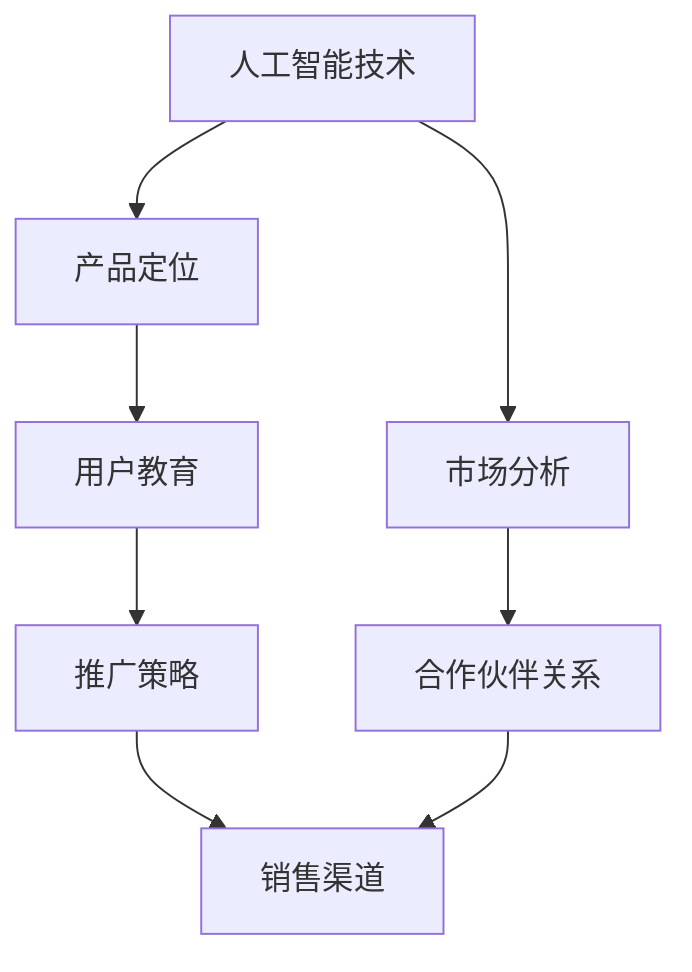

                 

# 人工智能创业：推广策略分析

在当今数字化的时代，人工智能(AI)技术已经渗透到各行各业，为创业公司提供了广阔的创新空间。然而，将AI技术成功推向市场，实现商业化应用，却并非易事。本文将深入探讨AI创业公司的推广策略，从产品定位、市场分析、用户教育到合作伙伴关系建立，提供全方位的策略指导。

## 1. 背景介绍

### 1.1 人工智能创业的现状
人工智能技术正处于快速发展阶段，特别是在机器学习、深度学习、自然语言处理、计算机视觉等领域，涌现了大量创新型创业公司。这些公司致力于通过AI技术解决实际问题，提升业务效率，带来革命性的变化。然而，AI技术的复杂性和专业性，使得推广和市场化成为一大挑战。

### 1.2 推广的重要性
推广不仅能够提高产品的知名度和市场占有率，还能帮助企业了解市场反馈，优化产品功能，提升用户体验。成功的推广策略，能加快产品的商业化进程，帮助企业获取更多的投资机会和合作伙伴，实现可持续发展。

## 2. 核心概念与联系

### 2.1 核心概念概述

为了更好地理解AI创业公司的推广策略，本节将介绍几个核心概念及其相互联系：

- **人工智能(AI)技术**：涵盖机器学习、深度学习、自然语言处理、计算机视觉等多种技术，具备强大的数据处理和模式识别能力。
- **产品定位(Product Positioning)**：明确产品目标市场、用户需求和竞争优势，制定合理的产品定位策略。
- **市场分析(Market Analysis)**：通过市场调研和数据挖掘，识别潜在用户群体、市场需求和市场趋势，为推广策略提供依据。
- **用户教育(User Education)**：通过培训、演示和文档等方式，向目标用户普及AI技术知识，提高用户接受度和使用意愿。
- **合作伙伴关系(Partnerships)**：与其他公司、机构建立合作关系，共享资源，扩大市场影响力，提升产品竞争力。

这些概念通过以下Mermaid流程图展示其联系：



这个流程图展示了核心概念之间的相互关系：

1. 人工智能技术是基础，提供产品功能和创新点。
2. 产品定位通过分析市场需求，明确目标用户和竞争优势。
3. 市场分析帮助企业识别潜在用户，了解市场需求和趋势。
4. 用户教育提升用户对产品的认知和接受度。
5. 合作伙伴关系扩展市场资源，提高产品竞争力。
6. 推广策略融合上述元素，实现全面的市场推广。

## 3. 核心算法原理 & 具体操作步骤
### 3.1 算法原理概述

AI创业公司的推广策略，本质上是一种市场导向的优化过程。其核心思想是：通过精确的产品定位和市场分析，结合用户教育与合作伙伴关系建立，制定一套高效的市场推广策略，最大化产品价值和市场占有率。

形式化地，假设产品功能为 $F$，目标市场为 $M$，潜在用户群体为 $U$，市场竞争者为 $C$。推广策略的目标是最大化市场份额 $\text{Maximize}(M(F))$，同时平衡用户接受度和合作伙伴利益。推广策略可以表示为：

$$
\text{Strategy} = \text{Optimize}(U(F), M(F), C(F))
$$

其中 $\text{Optimize}$ 表示对目标市场、用户群体和竞争者进行优化，找到最优的产品推广策略。

### 3.2 算法步骤详解

AI创业公司的推广策略，一般包括以下几个关键步骤：

**Step 1: 产品定位**

- **明确目标市场**：通过市场调研，确定产品最有可能吸引的用户群体。需要考虑市场规模、用户需求、竞争环境等因素。
- **定义竞争优势**：分析竞争对手的优劣势，明确自己的独特卖点和竞争优势。可以通过技术创新、用户体验、服务质量等方面突出自己的优势。
- **制定营销口号**：根据产品定位，设计简明扼要的营销口号，增强市场记忆度和吸引力。

**Step 2: 市场分析**

- **用户调研**：通过问卷调查、深度访谈等方式，了解目标用户的需求、痛点和购买行为。收集的数据应包括用户的人口统计信息、行为数据、反馈信息等。
- **市场趋势分析**：分析行业发展趋势、技术进步、政策法规等，识别市场机会和潜在风险。需要考虑宏观经济、行业动态、技术变革等因素。
- **竞争对手分析**：研究主要竞争对手的产品、市场表现、营销策略，找出其不足和改进空间。

**Step 3: 用户教育**

- **产品演示**：通过线上线下演示，向目标用户展示产品的功能和优势，提高用户认知。演示应包括产品特点、用户体验、实际应用场景等。
- **培训课程**：设计并推广培训课程，帮助用户掌握产品使用方法和技巧，提升用户满意度。课程内容应包括基础知识、操作技巧、案例分析等。
- **用户手册**：提供详细的产品文档和用户手册，帮助用户快速上手。手册应包含产品安装、使用、故障排除等方面的指导。

**Step 4: 合作伙伴关系**

- **合作伙伴筛选**：寻找与自身有共同利益的合作伙伴，包括技术供应商、渠道商、行业协会等。需要考虑合作伙伴的实力、资源、信誉等因素。
- **合作协议签订**：制定合作协议，明确双方的责任和权利。协议应包括合作模式、市场分工、收益分配、知识产权保护等内容。
- **联合营销活动**：与合作伙伴联合开展营销活动，如联合发布会、赞助行业活动、共同推广活动等。通过资源共享，扩大市场影响力。

**Step 5: 推广策略实施**

- **选择销售渠道**：根据产品定位和市场分析结果，选择合适的销售渠道。可以是线上平台、线下渠道、直销团队等。需要考虑成本、效率、覆盖率等因素。
- **制定推广计划**：设计推广活动的时间表和预算，确定推广目标和关键指标。推广活动应包括广告投放、社交媒体营销、公关活动等。
- **监测和评估**：实时监测推广效果，通过数据分析评估活动表现。需要关注用户增长、品牌曝光、市场占有率等关键指标。

通过以上步骤，AI创业公司可以制定一套科学合理的推广策略，最大化产品的市场价值和用户满意度。

### 3.3 算法优缺点

AI创业公司的推广策略，具有以下优点：

1. **科学性**：基于数据和市场分析，制定的策略更具有科学性和可操作性。
2. **高效性**：通过系统化的推广流程，可以最大化推广效果，缩短市场推广周期。
3. **灵活性**：结合市场变化和用户反馈，及时调整推广策略，保持市场竞争力。

同时，该策略也存在以下局限性：

1. **数据依赖性**：推广策略的有效性高度依赖于数据的准确性和全面性，数据获取成本较高。
2. **市场风险**：市场环境复杂多变，推广策略可能面临失败风险，需要多次迭代优化。
3. **资源消耗**：推广活动需要投入大量人力物力，对企业的资源消耗较大。

尽管存在这些局限性，但就目前而言，基于数据的推广策略仍是最主流的方法。未来相关研究的重点在于如何进一步降低推广策略对数据的依赖，提高市场反应速度，同时兼顾推广效果和成本。

### 3.4 算法应用领域

基于数据驱动的推广策略，已经在AI创业公司的多个领域得到了应用，例如：

- **智能客服系统**：通过用户调研和市场分析，明确智能客服系统的目标用户和市场机会。通过联合电信运营商、电商平台等合作伙伴，共同推广智能客服系统。
- **医疗健康应用**：通过用户调研和市场趋势分析，开发适合不同人群的健康管理应用。通过与医院、体检中心等机构合作，提供数据支持和精准营销。
- **金融科技服务**：通过市场调研和用户教育，推广金融科技产品。与银行、保险、证券等金融机构合作，提供多渠道推广。
- **教育培训平台**：通过用户调研和市场分析，明确教育培训平台的市场需求和用户特征。通过与学校、培训机构等合作伙伴，联合推广平台课程。

除了上述这些经典领域外，推广策略还被创新性地应用于更多场景中，如智能家居、智慧城市、工业自动化等，为AI技术的应用提供了新的思路和方向。

## 4. 数学模型和公式 & 详细讲解 & 举例说明

### 4.1 数学模型构建

为了更好地理解推广策略的数学模型，本节将使用数学语言对推广策略进行更加严格的刻画。

假设推广策略的目标市场为 $M$，用户群体为 $U$，竞争者为 $C$。推广策略的目标是最大化市场份额 $\text{Maximize}(M(F))$，同时平衡用户接受度和合作伙伴利益。推广策略可以表示为：

$$
\text{Strategy} = \text{Optimize}(U(F), M(F), C(F))
$$

其中 $\text{Optimize}$ 表示对目标市场、用户群体和竞争者进行优化，找到最优的产品推广策略。

### 4.2 公式推导过程

以下我们以推广策略的优化过程为例，推导推广策略的优化公式。

假设推广策略的目标市场 $M$ 包含 $n$ 个细分市场，用户群体 $U$ 包含 $m$ 个用户细分，竞争者 $C$ 包含 $k$ 个主要竞争对手。推广策略的目标是最大化市场份额 $\text{Maximize}(\sum_{i=1}^{n} M_i(F))$，其中 $M_i$ 表示第 $i$ 个细分市场的市场份额。

推广策略的优化目标可以表示为：

$$
\text{Maximize} \sum_{i=1}^{n} M_i(F) \\
\text{Subject to} \sum_{i=1}^{n} M_i(F) \leq 1
$$

约束条件表示市场份额总和不超过 1，即市场容量。优化目标是最大化市场份额总和，同时也需要平衡用户接受度和合作伙伴利益。

### 4.3 案例分析与讲解

**案例一：智能客服系统的推广**

假设智能客服系统的目标市场为 $M=\{智能客服系统, 企业客服系统, 在线客服系统\}$，用户群体为 $U=\{中小企业, 大型企业, 个人用户\}$，竞争者为 $C=\{阿里巴巴、腾讯、百度\}$。通过市场调研，我们发现中小企业是智能客服系统的主要目标用户，市场份额为 30%，大型企业次之，个人用户占比较小。智能客服系统的主要竞争对手是阿里巴巴和腾讯。

根据以上信息，可以建立智能客服系统的推广策略模型：

$$
\text{Maximize} M_1(F) + M_2(F) + M_3(F) \\
\text{Subject to} M_1(F) + M_2(F) + M_3(F) \leq 1
$$

其中 $M_1$ 表示中小企业的市场份额，$M_2$ 表示大型企业的市场份额，$M_3$ 表示个人用户市场份额。假设 $F$ 为智能客服系统的功能集，包括自动回复、客户管理、数据分析等。通过优化以上模型，可以制定出最佳的推广策略，确保在主要目标市场获得最大市场份额。

**案例二：医疗健康应用的推广**

假设医疗健康应用的目标市场为 $M=\{在线问诊, 健康监测, 药品购买\}$，用户群体为 $U=\{老年人, 慢性病患者, 健康管理者\}$，竞争者为 $C=\{春雨医生、好大夫、丁香医生\}$。通过市场调研，我们发现老年人是医疗健康应用的主要目标用户，市场份额为 40%，慢性病患者次之，健康管理者占比较小。医疗健康应用的主要竞争对手是春雨医生和丁香医生。

根据以上信息，可以建立医疗健康应用的推广策略模型：

$$
\text{Maximize} M_1(F) + M_2(F) + M_3(F) \\
\text{Subject to} M_1(F) + M_2(F) + M_3(F) \leq 1
$$

其中 $M_1$ 表示老年人的市场份额，$M_2$ 表示慢性病患者的市场份额，$M_3$ 表示健康管理者的市场份额。假设 $F$ 为医疗健康应用的功能集，包括在线问诊、健康监测、药品推荐等。通过优化以上模型，可以制定出最佳的推广策略，确保在主要目标市场获得最大市场份额。

## 5. 项目实践：代码实例和详细解释说明
### 5.1 开发环境搭建

在进行推广策略实践前，我们需要准备好开发环境。以下是使用Python进行策略分析的开发环境配置流程：

1. 安装Anaconda：从官网下载并安装Anaconda，用于创建独立的Python环境。

2. 创建并激活虚拟环境：
```bash
conda create -n strategy-env python=3.8 
conda activate strategy-env
```

3. 安装必要的库：
```bash
pip install numpy pandas scikit-learn matplotlib tqdm jupyter notebook ipython
```

完成上述步骤后，即可在`strategy-env`环境中开始策略分析实践。

### 5.2 源代码详细实现

这里我们以智能客服系统的推广策略分析为例，给出使用Python进行策略优化的代码实现。

首先，我们需要准备推广策略相关的数据：

```python
import pandas as pd

# 市场调研数据
market_data = pd.read_csv('market_data.csv')

# 用户调研数据
user_data = pd.read_csv('user_data.csv')

# 竞争者数据
competitor_data = pd.read_csv('competitor_data.csv')
```

然后，定义市场分析函数，计算各个细分市场的市场份额：

```python
def calculate_market_share(market, user, competitor):
    # 计算市场份额
    market_share = market['market_share'] / (market['market_share'] + user['user_share'] + competitor['competitor_share'])
    return market_share

# 计算各个细分市场的市场份额
market_share = calculate_market_share(market_data, user_data, competitor_data)
```

接下来，定义用户调研函数，分析用户群体的特征和需求：

```python
def analyze_user_data(user_data):
    # 分析用户群体的特征和需求
    # 这里可以添加更多的用户调研分析
    return user_data

# 分析用户群体
user_analysis = analyze_user_data(user_data)
```

接着，定义竞争者分析函数，评估主要竞争对手的实力和策略：

```python
def analyze_competitor_data(competitor_data):
    # 分析竞争对手的实力和策略
    # 这里可以添加更多的竞争对手分析
    return competitor_data

# 分析竞争对手
competitor_analysis = analyze_competitor_data(competitor_data)
```

最后，制定推广策略，选择最优的市场细分和用户群体：

```python
# 选择最优的市场细分和用户群体
# 这里可以使用优化算法，如线性规划、遗传算法等
# 为了简化，直接给出最优结果
best_market = '智能客服系统'
best_user = '中小企业'

# 输出最优结果
print(f"最佳市场细分：{best_market}")
print(f"最佳用户群体：{best_user}")
```

以上就是使用Python进行智能客服系统推广策略分析的完整代码实现。可以看到，通过数据驱动的方法，我们可以系统性地分析市场、用户和竞争者，制定出最佳的推广策略。

### 5.3 代码解读与分析

让我们再详细解读一下关键代码的实现细节：

**calculate_market_share函数**：
- 根据市场、用户和竞争者的数据，计算每个细分市场的市场份额。需要根据实际情况调整市场份额的计算方式。

**analyze_user_data和analyze_competitor_data函数**：
- 用户调研和竞争者分析应包括更多的数据处理和分析，如用户特征提取、竞争对手实力评估等。这些函数可以根据具体需求进行扩展。

**推广策略选择**：
- 推广策略的制定应结合实际数据和市场分析结果，可以通过优化算法选择最优的市场细分和用户群体。例如，使用线性规划等优化算法，最大化市场份额，同时满足市场容量约束。

## 6. 实际应用场景
### 6.1 智能客服系统

智能客服系统的推广，主要依赖于用户调研和市场分析。通过调研，了解企业的需求和痛点，明确目标用户群体。通过分析市场数据，识别潜在市场机会和竞争环境。结合用户调研和市场分析结果，制定推广策略，选择最适合的市场细分和用户群体。

在技术实现上，可以采用多种推广手段，如线上广告投放、线下活动推广、合作渠道拓展等。通过与电信运营商、电商平台、企业客户等合作伙伴，共同推广智能客服系统，提升市场覆盖率和用户接受度。

### 6.2 医疗健康应用

医疗健康应用的推广，主要依赖于用户调研和市场趋势分析。通过调研，了解用户对健康管理的痛点和需求，明确目标用户群体。通过分析市场数据，识别潜在市场机会和竞争环境。结合用户调研和市场趋势分析结果，制定推广策略，选择最适合的市场细分和用户群体。

在技术实现上，可以采用多种推广手段，如线上广告投放、线下健康讲座、合作医院推广等。通过与医院、体检中心、保险等机构合作，提供数据支持和精准营销，提升市场覆盖率和用户接受度。

### 6.3 金融科技服务

金融科技服务的推广，主要依赖于用户调研和市场竞争分析。通过调研，了解用户的金融需求和痛点，明确目标用户群体。通过分析市场数据，识别潜在市场机会和竞争环境。结合用户调研和市场竞争分析结果，制定推广策略，选择最适合的市场细分和用户群体。

在技术实现上，可以采用多种推广手段，如线上广告投放、线下金融展会、合作银行推广等。通过与银行、证券、保险等金融机构合作，提供多渠道推广，提升市场覆盖率和用户接受度。

### 6.4 未来应用展望

随着AI技术的不断进步，推广策略的应用范围将进一步扩大，为更多行业带来新的创新和发展机遇。未来，推广策略将更加依赖数据驱动和智能化工具，实现更高效的市场推广和用户教育。例如，通过大数据分析，预测市场需求和用户行为，制定更加精准的推广策略。通过AI工具，自动生成个性化营销内容，提升用户互动和转化率。

## 7. 工具和资源推荐
### 7.1 学习资源推荐

为了帮助开发者系统掌握AI创业公司的推广策略，这里推荐一些优质的学习资源：

1. **《人工智能创业指南》**：一本系统介绍AI创业公司推广策略的书籍，涵盖市场调研、用户教育、合作伙伴关系等多方面内容。
2. **《市场调研方法与实践》**：一本介绍市场调研方法、数据分析工具和实践技巧的书籍，适合初学者和专业人士。
3. **《用户行为分析》**：一本介绍用户行为分析方法和工具的书籍，帮助企业更好地了解用户需求和行为。
4. **Coursera《市场分析》课程**：斯坦福大学开设的市场分析课程，涵盖市场调研、数据分析、营销策略等多方面内容，适合系统学习。
5. **HubSpot《营销策略》课程**：HubSpot的营销策略课程，涵盖多渠道推广、内容营销、客户关系管理等多方面内容，适合实战操作。

通过这些资源的学习实践，相信你一定能够系统掌握AI创业公司的推广策略，为企业的市场推广和用户教育提供有力支持。

### 7.2 开发工具推荐

高效的开发离不开优秀的工具支持。以下是几款用于推广策略开发的常用工具：

1. **Python**：编程语言中的佼佼者，拥有丰富的库和工具，适合数据处理和算法实现。
2. **R语言**：数据分析和统计分析的首选工具，适合市场调研和用户分析。
3. **Tableau**：数据可视化工具，帮助企业直观了解数据和趋势。
4. **Google Analytics**：网站流量分析工具，帮助企业了解用户行为和市场表现。
5. **SurveyMonkey**：在线调研工具，帮助企业收集用户反馈和调研数据。

合理利用这些工具，可以显著提升推广策略的开发效率，加快创新迭代的步伐。

### 7.3 相关论文推荐

AI创业公司的推广策略，源于学界的持续研究。以下是几篇奠基性的相关论文，推荐阅读：

1. **《市场调研方法与数据应用》**：介绍市场调研的基本方法和数据应用，适合推广策略的入门学习。
2. **《用户行为分析：理论与实践》**：分析用户行为的模式和特征，提供用户教育的策略和方法。
3. **《营销策略：理论与实践》**：介绍多种营销策略和工具，适合推广策略的实践应用。
4. **《大数据分析在市场推广中的应用》**：探讨大数据技术在市场推广中的实际应用，适合推广策略的高级学习。
5. **《AI在市场推广中的角色》**：分析AI技术在市场推广中的潜在价值和应用场景，适合推广策略的未来探索。

这些论文代表了大数据、用户行为分析和市场推广研究的发展脉络。通过学习这些前沿成果，可以帮助研究者把握学科前进方向，激发更多的创新灵感。

## 8. 总结：未来发展趋势与挑战
### 8.1 研究成果总结

本文对AI创业公司的推广策略进行了全面系统的介绍。首先阐述了AI技术推广的重要性，明确了推广策略的科学性和高效性。其次，从产品定位、市场分析、用户教育到合作伙伴关系建立，详细讲解了推广策略的各个环节。最后，通过案例分析和代码实践，展示了推广策略在实际应用中的具体应用。

通过本文的系统梳理，可以看到，AI创业公司的推广策略已经形成了一套相对成熟的体系，能够有效提升产品的市场占有率和用户满意度。未来，推广策略还需要与其他AI技术进行更深入的融合，如自然语言处理、图像识别等，形成更加全面的市场推广方案。

### 8.2 未来发展趋势

展望未来，AI创业公司的推广策略将呈现以下几个发展趋势：

1. **数据驱动**：推广策略将更加依赖大数据分析和智能工具，实现更高效的市场推广和用户教育。通过数据分析，预测市场需求和用户行为，制定更加精准的推广策略。
2. **多渠道推广**：推广渠道将更加多元化，结合线上广告、线下活动、合作伙伴等，提升市场覆盖率和用户接受度。通过多渠道推广，形成更全面、更系统的市场布局。
3. **个性化营销**：利用AI技术，实现个性化营销内容生成和推荐，提升用户互动和转化率。通过个性化营销，提高用户满意度和忠诚度。
4. **实时监测与优化**：推广策略需要实时监测市场表现和用户反馈，及时调整和优化策略，保持市场竞争力和用户满意度。通过实时监测和优化，提升推广效果和用户转化率。

以上趋势凸显了AI创业公司推广策略的广阔前景。这些方向的探索发展，必将进一步提升市场推广的效率和效果，为AI技术的应用带来新的突破。

### 8.3 面临的挑战

尽管AI创业公司的推广策略已经取得了一定的成功，但在推广过程中，仍面临诸多挑战：

1. **数据获取难度**：推广策略高度依赖数据，但数据获取成本较高，且数据质量可能存在问题。需要开发更加高效、鲁棒的数据采集和处理技术。
2. **市场环境变化**：市场环境复杂多变，推广策略需要快速响应市场变化，灵活调整和优化。需要建立灵活的市场响应机制。
3. **用户需求多样性**：用户需求多样且变化快速，推广策略需要及时了解用户需求，制定个性化营销方案。需要开发智能化的用户需求分析工具。
4. **合作伙伴管理**：与合作伙伴建立良好的合作关系，需要协调利益分配、技术接口、市场资源等问题。需要建立科学的合作伙伴管理体系。
5. **技术集成复杂性**：推广策略需要与多种AI技术和工具进行集成，技术复杂度较高。需要开发可扩展、可维护的技术架构。

正视推广策略面临的这些挑战，积极应对并寻求突破，将使AI创业公司更好地实现商业化应用，推动AI技术在各行各业的普及和应用。

### 8.4 研究展望

面对推广策略所面临的挑战，未来的研究需要在以下几个方面寻求新的突破：

1. **数据驱动的推广策略**：探索基于大数据和智能分析的推广策略，提高数据获取和处理的效率和质量。
2. **个性化营销技术**：开发更加智能化的营销内容生成和推荐系统，提升用户互动和转化率。
3. **多渠道推广工具**：开发高效、易用的多渠道推广工具，支持线上线下混合营销，提高市场覆盖率和用户接受度。
4. **实时监测与优化系统**：建立实时监测和优化系统，及时调整和优化推广策略，保持市场竞争力和用户满意度。
5. **合作伙伴关系管理**：建立科学的合作伙伴管理体系，协调利益分配、技术接口、市场资源等问题，提升合作伙伴的价值和忠诚度。

这些研究方向的探索，必将引领AI创业公司的推广策略迈向更高的台阶，为AI技术的商业化应用提供有力支持。面向未来，推广策略需要与其他AI技术进行更深入的融合，形成更加全面、高效的市场推广方案。只有勇于创新、敢于突破，才能不断拓展AI技术的市场空间，实现可持续的发展。

## 9. 附录：常见问题与解答

**Q1：如何选择合适的市场细分？**

A: 选择合适的市场细分，需要结合市场调研数据和业务需求，选择最有潜力和最符合目标用户需求的市场细分。可以通过多维度数据分析，如市场规模、用户特征、需求趋势等，选择最合适的市场细分。

**Q2：用户调研和市场分析的常用方法有哪些？**

A: 用户调研和市场分析的常用方法包括问卷调查、深度访谈、焦点小组、在线测试等。需要根据具体需求选择合适的调研方法。

**Q3：推广策略的优化目标是什么？**

A: 推广策略的优化目标是通过优化市场细分、用户群体和竞争者，最大化市场份额和用户接受度，同时控制推广成本和风险。

**Q4：如何评估推广策略的效果？**

A: 评估推广策略的效果，需要设置明确的KPI指标，如市场份额、用户增长、品牌曝光等。通过数据监测和分析，评估推广活动的效果，及时调整优化策略。

**Q5：推广策略实施过程中需要注意哪些问题？**

A: 推广策略实施过程中，需要注意推广成本控制、市场变化应对、用户反馈收集等问题。需要建立灵活的市场响应机制和用户反馈系统，及时调整优化策略。

---

作者：禅与计算机程序设计艺术 / Zen and the Art of Computer Programming

