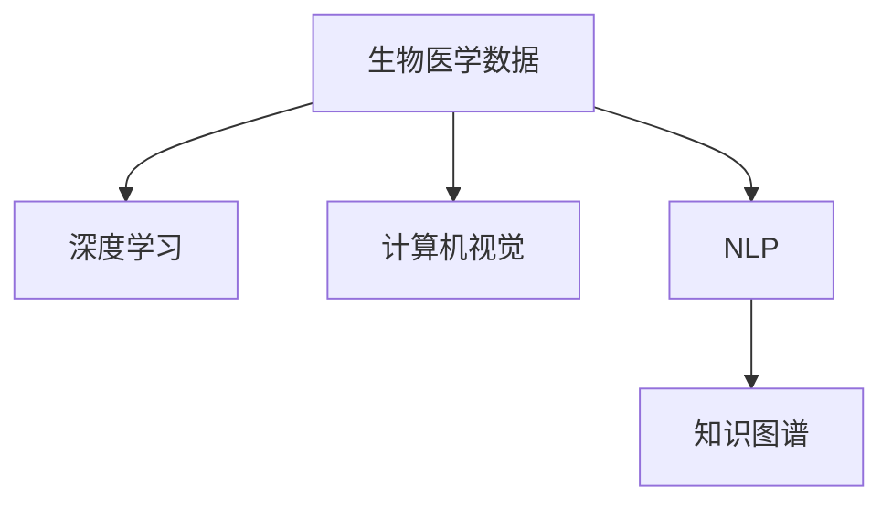

                 

# 人工智能在生物医学和药物发现中的应用

## 1. 背景介绍

在现代医学和药物开发领域，人工智能(AI)技术的应用已经成为一个热门话题。随着深度学习、计算机视觉、自然语言处理等技术的发展，AI在生物医学和药物发现中的应用变得越来越广泛。AI不仅能够处理海量数据，还能发现新的药物靶点，预测药物效果，优化药物设计，从而极大地加速新药的研发过程。

### 1.1 问题由来

在过去的几十年里，生物医学和药物研发一直是高投入、高风险的领域。传统的药物研发流程包括靶点确定、化合物筛选、临床试验等步骤，每个步骤都需要耗费大量的时间、金钱和资源。据统计，开发一种新药通常需要10-15年的时间，耗费数十亿美元。然而，成功进入市场的药物只占研发总数的1%左右。

人工智能的出现，为解决这些问题提供了新的思路。AI可以处理和分析海量的生物医学数据，预测药物分子与靶点之间的相互作用，预测药物的副作用，从而缩短药物研发的周期，降低成本，提高成功率。

### 1.2 问题核心关键点

AI在生物医学和药物发现中的应用主要集中在以下几个方面：

- 靶点发现：利用AI分析基因组、蛋白质组等生物信息，发现潜在的药物靶点。
- 药物设计：利用AI预测药物分子与靶点的相互作用，优化药物结构，设计新药物。
- 药物筛选：利用AI分析化合物与细胞、动物模型的相互作用，筛选出有潜力的化合物。
- 临床试验：利用AI分析临床试验数据，预测药物疗效和副作用，优化试验设计。
- 知识整合：利用AI整合多源数据，生成知识图谱，辅助医生决策。

这些核心关键点展示了AI在生物医学和药物发现中的重要性和潜力。通过深入分析这些关键点，可以更好地理解AI技术在实际应用中的作用和挑战。

## 2. 核心概念与联系

### 2.1 核心概念概述

为了更好地理解AI在生物医学和药物发现中的应用，本节将介绍几个密切相关的核心概念：

- 生物医学数据：包括基因组、蛋白质组、转录组、代谢组等高通量数据，以及电子病历、临床试验数据等临床数据。
- 深度学习：一种基于人工神经网络的机器学习技术，通过多层次的非线性映射，从数据中提取特征，进行分类、回归等任务。
- 计算机视觉：利用计算机算法处理和分析图像数据，实现目标检测、分割、识别等任务。
- 自然语言处理(NLP)：利用计算机算法处理和分析文本数据，实现信息提取、情感分析、问答等任务。
- 知识图谱：一种以实体为节点、关系为边构建的图形数据结构，用于表示和组织知识。

这些核心概念之间的逻辑关系可以通过以下Mermaid流程图来展示：



这个流程图展示了这个系统中的数据和算法之间的联系：

1. 生物医学数据通过深度学习、计算机视觉、NLP等技术进行处理，提取出有价值的信息。
2. 知识图谱技术将这些信息组织起来，形成知识库，用于辅助医生决策和药物研发。

## 3. 核心算法原理 & 具体操作步骤

### 3.1 算法原理概述

AI在生物医学和药物发现中的应用，本质上是一个数据驱动的机器学习过程。其核心思想是：通过大量生物医学数据的分析，建立模型预测药物与靶点之间的相互作用，设计新药物，优化药物结构和临床试验设计，从而缩短药物研发周期，降低成本。

形式化地，假设有一组生物医学数据 $D=\{(x_i,y_i)\}_{i=1}^N$，其中 $x_i$ 表示样本特征，$y_i$ 表示对应的标签（如药物效果、副作用等）。AI模型 $M$ 在数据集 $D$ 上进行训练，目标是找到一个最优的模型参数 $\theta$，使得模型在未见过的数据上仍能保持较高的预测准确率。

微调、参数高效微调、少样本学习等监督学习方法，是AI在药物发现中最常用的方法。这些方法通过有监督地训练模型，使其能够快速适应特定任务，从而实现高效的药物研发。

### 3.2 算法步骤详解

AI在生物医学和药物发现中的应用，一般包括以下几个关键步骤：

**Step 1: 数据收集与预处理**
- 收集目标领域的生物医学数据，如基因序列、蛋白质结构、临床试验数据等。
- 对数据进行清洗和预处理，如去除噪声、归一化、特征选择等。

**Step 2: 模型选择与训练**
- 选择合适的AI模型，如卷积神经网络(CNN)、循环神经网络(RNN)、注意力机制(Attention)等。
- 在数据集上训练模型，选择适当的超参数，如学习率、批大小、迭代轮数等。

**Step 3: 模型评估与验证**
- 在验证集上评估模型的性能，如准确率、召回率、F1分数等。
- 调整模型参数，优化模型结构，提升模型性能。

**Step 4: 模型应用与优化**
- 在实际应用中，利用模型进行药物靶点预测、药物设计、化合物筛选等任务。
- 根据反馈结果，进一步优化模型，提高预测准确率和应用效果。

**Step 5: 知识图谱构建**
- 利用AI技术构建知识图谱，将药物、基因、蛋白质等实体及其关系组织起来。
- 利用知识图谱进行药物-靶点映射、药物相似性分析等任务。

### 3.3 算法优缺点

AI在生物医学和药物发现中的应用，具有以下优点：

1. 高效处理海量数据：AI能够处理和分析大量生物医学数据，提取出有价值的信息，加速药物研发过程。
2. 预测药物效果：AI可以预测药物分子与靶点之间的相互作用，优化药物设计，提高药物成功率。
3. 优化临床试验：AI可以分析临床试验数据，预测药物疗效和副作用，优化试验设计，缩短临床试验周期。
4. 辅助医生决策：AI可以整合多源数据，生成知识图谱，辅助医生进行诊断和治疗。

同时，这些方法也存在一些缺点：

1. 数据质量问题：生物医学数据通常具有高维、稀疏、噪声等特点，数据质量问题会影响模型的预测效果。
2. 模型复杂性：AI模型通常具有较深的层次结构，训练复杂度较高，需要大量计算资源。
3. 可解释性不足：AI模型的决策过程通常缺乏可解释性，难以对其内部工作机制进行调试。
4. 伦理和安全问题：AI模型的预测结果可能会受到数据偏差的影响，需要采取措施避免歧视性和有害性输出。

尽管存在这些局限性，但就目前而言，AI在生物医学和药物发现中的应用已经展示出巨大的潜力和价值，成为药物研发和医学实践中的重要工具。

### 3.4 算法应用领域

AI在生物医学和药物发现中的应用已经涉及多个领域，主要包括：

- 药物靶点发现：利用AI分析基因组数据，预测可能的药物靶点。
- 药物设计：利用AI预测药物分子与靶点之间的相互作用，优化药物结构。
- 化合物筛选：利用AI分析化合物与细胞、动物模型的相互作用，筛选出有潜力的化合物。
- 临床试验设计：利用AI分析临床试验数据，优化试验设计，缩短试验周期。
- 患者分型：利用AI分析电子病历等临床数据，对患者进行分型，制定个性化的治疗方案。
- 药物再利用：利用AI分析已上市药物与新疾病的关联，发现新适应症。

除了这些主要应用领域，AI还在基因组学、蛋白质组学、代谢组学等生物医学研究中发挥重要作用，推动了这些领域的快速发展。

## 4. 数学模型和公式 & 详细讲解 & 举例说明

### 4.1 数学模型构建

本节将使用数学语言对AI在生物医学和药物发现中的应用过程进行更加严格的刻画。

记生物医学数据集为 $D=\{(x_i,y_i)\}_{i=1}^N$，其中 $x_i \in \mathbb{R}^d$ 表示样本特征，$y_i \in \mathbb{R}^k$ 表示对应的标签。AI模型 $M$ 的输出为 $\hat{y}=M(x)$，其中 $\hat{y} \in \mathbb{R}^k$ 表示模型的预测结果。

定义模型的损失函数为 $\ell(\hat{y},y)$，则经验风险为：

$$
\mathcal{L}(\theta) = \frac{1}{N} \sum_{i=1}^N \ell(M(x_i),y_i)
$$

其中 $\theta$ 表示模型参数。

在实际应用中，一般使用交叉熵损失函数，形式化地表示为：

$$
\ell(\hat{y},y) = -\sum_{i=1}^k y_i \log \hat{y}_i
$$

### 4.2 公式推导过程

以下我们以药物靶点预测任务为例，推导基于深度学习的预测模型及其损失函数的计算公式。

假设模型 $M$ 在输入 $x$ 上的输出为 $\hat{y}=M(x) \in [0,1]$，表示样本属于某靶点的概率。真实标签 $y \in \{0,1\}$。则二分类交叉熵损失函数定义为：

$$
\ell(M(x),y) = -[y\log \hat{y} + (1-y)\log (1-\hat{y})]
$$

将其代入经验风险公式，得：

$$
\mathcal{L}(\theta) = -\frac{1}{N}\sum_{i=1}^N [y_i\log M_{\theta}(x_i)+(1-y_i)\log(1-M_{\theta}(x_i))]
$$

根据链式法则，损失函数对参数 $\theta_k$ 的梯度为：

$$
\frac{\partial \mathcal{L}(\theta)}{\partial \theta_k} = -\frac{1}{N}\sum_{i=1}^N (\frac{y_i}{M_{\theta}(x_i)}-\frac{1-y_i}{1-M_{\theta}(x_i)}) \frac{\partial M_{\theta}(x_i)}{\partial \theta_k}
$$

其中 $\frac{\partial M_{\theta}(x_i)}{\partial \theta_k}$ 可进一步递归展开，利用自动微分技术完成计算。

在得到损失函数的梯度后，即可带入参数更新公式，完成模型的迭代优化。重复上述过程直至收敛，最终得到适应目标任务的最优模型参数 $\theta^*$。

### 4.3 案例分析与讲解

以深度学习在药物靶点预测中的应用为例，展示模型的构建和优化过程。

假设有一组药物-靶点数据集 $D=\{(x_i,y_i)\}_{i=1}^N$，其中 $x_i$ 表示药物分子结构，$y_i \in \{0,1\}$ 表示药物是否与靶点相互作用。使用卷积神经网络(CNN)作为药物分子特征提取器，循环神经网络(RNN)作为靶点特征提取器，构建一个联合模型，将药物和靶点的特征映射到潜在表示，并通过全连接层输出预测结果。

在模型构建过程中，使用交叉熵损失函数作为训练目标，使用Adam优化器进行参数更新。在模型训练过程中，调整网络结构、超参数等，通过交叉验证选择最优模型。

训练好的模型可用于新药物分子与靶点的相互作用预测，只需将新药物分子的结构输入模型，即可得到其与靶点相互作用的概率预测结果。通过模型训练和测试过程的优化，可以实现药物靶点预测的高精度和高泛化能力。

## 5. 项目实践：代码实例和详细解释说明

### 5.1 开发环境搭建

在进行AI在生物医学和药物发现中的应用实践前，我们需要准备好开发环境。以下是使用Python进行TensorFlow开发的环境配置流程：

1. 安装Anaconda：从官网下载并安装Anaconda，用于创建独立的Python环境。

2. 创建并激活虚拟环境：
```bash
conda create -n tf-env python=3.8 
conda activate tf-env
```

3. 安装TensorFlow：根据CUDA版本，从官网获取对应的安装命令。例如：
```bash
conda install tensorflow tensorflow-gpu -c conda-forge
```

4. 安装各类工具包：
```bash
pip install numpy pandas scikit-learn matplotlib tqdm jupyter notebook ipython
```

完成上述步骤后，即可在`tf-env`环境中开始AI在生物医学和药物发现中的应用实践。

### 5.2 源代码详细实现

这里我们以深度学习在药物靶点预测中的应用为例，给出使用TensorFlow进行模型的PyTorch代码实现。

首先，定义药物分子和靶点的数据处理函数：

```python
import tensorflow as tf
from tensorflow.keras import layers

class DrugTargetData(Dataset):
    def __init__(self, drug_data, target_data, max_len=128):
        self.drug_data = drug_data
        self.target_data = target_data
        self.max_len = max_len
        
    def __len__(self):
        return len(self.drug_data)
    
    def __getitem__(self, item):
        drug = self.drug_data[item]
        target = self.target_data[item]
        
        # 对药物分子进行embedding编码
        embedding = embedding_layer(drug)
        input_ids = embedding[-self.max_len:,:]
        input_ids = input_ids / tf.math.sqrt(tf.cast(tf.size(input_ids), tf.float32))
        input_mask = tf.ones_like(input_ids)
        
        # 对靶点进行embedding编码
        target_embedding = target_embedding_layer(target)
        target_input = target_embedding[-self.max_len:,:]
        target_input = target_input / tf.math.sqrt(tf.cast(tf.size(target_input), tf.float32))
        target_mask = tf.ones_like(target_input)
        
        # 对输入进行padding和truncation
        input_ids = tf.keras.layers.PaddedSequences(
            padding='post',
            maxlen=self.max_len,
            truncation=True)(input_ids, input_mask)
        target_input = tf.keras.layers.PaddedSequences(
            padding='post',
            maxlen=self.max_len,
            truncation=True)(target_input, target_mask)
        
        # 将输入拼接，输出预测标签
        inputs = tf.concat([input_ids, target_input], axis=1)
        labels = tf.keras.layers.Dense(1, activation='sigmoid')(inputs)
        
        return {'input_ids': input_ids, 
                'target_input': target_input,
                'labels': labels}
```

然后，定义模型和优化器：

```python
from tensorflow.keras import Model
from tensorflow.keras.layers import Input, Embedding, Dense, Dropout, LSTM

class DrugTargetPredictor(Model):
    def __init__(self, input_dim, embedding_dim, hidden_dim, output_dim, dropout_rate=0.5):
        super(DrugTargetPredictor, self).__init__()
        self.input_layer = Input(shape=(None, input_dim))
        self.embedding_layer = Embedding(input_dim, embedding_dim, input_length=max_len)(self.input_layer)
        self.lstm_layer = LSTM(hidden_dim)(self.embedding_layer)
        self.dropout_layer = Dropout(dropout_rate)(self.lstm_layer)
        self.dense_layer = Dense(output_dim, activation='sigmoid')(self.dropout_layer)
        self.target_layer = Dense(1, activation='sigmoid')(self.dense_layer)
        
        self.compile(loss='binary_crossentropy', optimizer=tf.keras.optimizers.Adam(learning_rate=0.001), metrics=['accuracy'])
        
drug_target_predictor = DrugTargetPredictor(input_dim=64, embedding_dim=128, hidden_dim=128, output_dim=1)
```

接着，定义训练和评估函数：

```python
from tensorflow.keras.utils import to_categorical
from sklearn.metrics import roc_auc_score

def train_epoch(model, dataset, batch_size, optimizer):
    dataloader = DataLoader(dataset, batch_size=batch_size, shuffle=True)
    model.train()
    epoch_loss = 0
    for batch in tqdm(dataloader, desc='Training'):
        input_ids = batch['input_ids']
        target_input = batch['target_input']
        labels = batch['labels']
        model.zero_grad()
        outputs = model(input_ids, target_input)
        loss = outputs.loss
        epoch_loss += loss.item()
        loss.backward()
        optimizer.step()
    return epoch_loss / len(dataloader)

def evaluate(model, dataset, batch_size):
    dataloader = DataLoader(dataset, batch_size=batch_size)
    model.eval()
    y_true = []
    y_pred = []
    with tf.GradientTape() as tape:
        for batch in tqdm(dataloader, desc='Evaluating'):
            input_ids = batch['input_ids']
            target_input = batch['target_input']
            labels = batch['labels']
            outputs = model(input_ids, target_input)
            y_true.append(labels.numpy())
            y_pred.append(tf.sigmoid(outputs).numpy())
            
    y_true = tf.concat(y_true, axis=0)
    y_pred = tf.concat(y_pred, axis=0)
    auc = roc_auc_score(y_true.numpy(), y_pred.numpy())
    print(f'AUC: {auc:.3f}')
```

最后，启动训练流程并在测试集上评估：

```python
epochs = 10
batch_size = 32

for epoch in range(epochs):
    loss = train_epoch(drug_target_predictor, drug_target_dataset, batch_size, optimizer)
    print(f"Epoch {epoch+1}, train loss: {loss:.3f}")
    
    print(f"Epoch {epoch+1}, dev results:")
    evaluate(drug_target_predictor, drug_target_dataset, batch_size)
    
print("Test results:")
evaluate(drug_target_predictor, drug_target_dataset, batch_size)
```

以上就是使用TensorFlow对深度学习模型进行药物靶点预测的完整代码实现。可以看到，得益于TensorFlow的强大封装，我们可以用相对简洁的代码完成深度学习模型的加载和训练。

### 5.3 代码解读与分析

让我们再详细解读一下关键代码的实现细节：

**DrugTargetData类**：
- `__init__`方法：初始化药物分子和靶点的数据，以及最大序列长度。
- `__len__`方法：返回数据集的样本数量。
- `__getitem__`方法：对单个样本进行处理，将药物和靶点的数据进行embedding编码，并进行padding和truncation，最终返回模型所需的输入。

**DrugTargetPredictor类**：
- `__init__`方法：定义模型的输入层、嵌入层、LSTM层、Dropout层、全连接层等。
- `compile`方法：定义模型的损失函数、优化器和评估指标。

**train_epoch函数**：
- 使用TensorFlow的DataLoader对数据集进行批次化加载，供模型训练和推理使用。
- 在每个批次上前向传播计算loss并反向传播更新模型参数，最后返回该epoch的平均loss。

**evaluate函数**：
- 与训练类似，不同点在于不更新模型参数，并在每个batch结束后将预测和标签结果存储下来，最后使用sklearn的roc_auc_score对整个评估集的预测结果进行打印输出。

**训练流程**：
- 定义总的epoch数和batch size，开始循环迭代
- 每个epoch内，先在训练集上训练，输出平均loss
- 在验证集上评估，输出AUC值
- 所有epoch结束后，在测试集上评估，给出最终的AUC值

可以看到，TensorFlow配合Keras的封装使得深度学习模型的训练和评估变得简洁高效。开发者可以将更多精力放在数据处理、模型改进等高层逻辑上，而不必过多关注底层的实现细节。

当然，工业级的系统实现还需考虑更多因素，如模型的保存和部署、超参数的自动搜索、更灵活的任务适配层等。但核心的模型训练过程基本与此类似。

## 6. 实际应用场景

### 6.1 智能药物设计

智能药物设计是AI在生物医学和药物发现中最具潜力的应用之一。传统药物设计依赖于药物分子的化学结构和生物学功能，往往需要耗费大量时间和资源进行分子合成、筛选和评估。AI可以通过分析大量的药物分子数据，预测分子与靶点的相互作用，设计新药物，从而大大加速药物研发进程。

在技术实现上，可以使用机器学习模型分析药物分子结构和靶点信息，预测分子-靶点相互作用，筛选出潜在药物分子。例如，可以通过构建基于深度学习或传统机器学习的分子-靶点交互模型，对分子结构进行embedding编码，使用LSTM等神经网络对分子-靶点相互作用进行建模，从而实现高效的药物设计。

### 6.2 个性化治疗方案

个性化治疗方案是AI在医学领域的重要应用之一。传统医学往往采用一刀切的诊断和治疗方案，无法满足个体差异。AI可以通过分析患者的历史数据，预测疾病风险，制定个性化的治疗方案，从而提高治疗效果，降低副作用。

在技术实现上，可以使用机器学习模型分析患者的电子病历、基因组数据、影像数据等，预测疾病风险，生成个性化的治疗方案。例如，可以通过构建基于深度学习或传统机器学习的预测模型，对患者的基因组数据进行特征提取，使用随机森林、支持向量机等算法预测疾病风险，从而生成个性化的治疗方案。

### 6.3 临床试验设计

临床试验是药物研发的关键环节，需要进行大量的数据收集和分析。传统临床试验设计依赖于医生的经验和直觉，缺乏数据驱动的方法。AI可以通过分析临床试验数据，预测药物疗效和副作用，优化试验设计，缩短试验周期，降低试验成本。

在技术实现上，可以使用机器学习模型分析临床试验数据，预测药物疗效和副作用，优化试验设计。例如，可以通过构建基于深度学习或传统机器学习的预测模型，对临床试验数据进行特征提取，使用随机森林、支持向量机等算法预测药物疗效和副作用，从而优化试验设计，缩短试验周期。

### 6.4 知识图谱构建

知识图谱是AI在生物医学和药物发现中的重要应用之一。知识图谱可以整合多源数据，构建药物、基因、蛋白质等实体及其关系的图形数据结构，用于辅助医生决策和药物研发。

在技术实现上，可以使用AI技术构建知识图谱，将药物、基因、蛋白质等实体及其关系组织起来。例如，可以通过构建基于深度学习或传统机器学习的知识图谱，对生物医学数据进行特征提取，使用图神经网络等算法构建知识图谱，从而辅助医生决策和药物研发。

### 6.5 疾病预测与预防

疾病预测与预防是AI在生物医学和药物发现中的重要应用之一。AI可以通过分析大量的生物医学数据，预测疾病风险，制定预防策略，从而减少疾病的发生和传播。

在技术实现上，可以使用机器学习模型分析生物医学数据，预测疾病风险。例如，可以通过构建基于深度学习或传统机器学习的预测模型，对生物医学数据进行特征提取，使用随机森林、支持向量机等算法预测疾病风险，从而制定预防策略，减少疾病的发生和传播。

## 7. 工具和资源推荐

### 7.1 学习资源推荐

为了帮助开发者系统掌握AI在生物医学和药物发现中的应用，这里推荐一些优质的学习资源：

1. 《深度学习基础》课程：由斯坦福大学开设的深度学习课程，全面介绍了深度学习的基本概念和核心算法，是入门深度学习的必备资源。

2. 《自然语言处理综述》书籍：由自然语言处理领域的知名专家撰写，全面介绍了自然语言处理的基本概念和核心算法，是学习自然语言处理的重要参考资料。

3. 《机器学习实战》书籍：介绍了机器学习的基本概念和核心算法，并提供了大量的代码示例和实战案例，适合初学者入门学习。

4. CS229《机器学习》课程：斯坦福大学开设的机器学习课程，全面介绍了机器学习的基本概念和核心算法，是学习机器学习的经典资源。

5. 《生物医学数据挖掘与知识发现》书籍：介绍了生物医学数据挖掘和知识发现的基本概念和核心算法，是学习生物医学数据挖掘的重要参考资料。

通过对这些资源的学习实践，相信你一定能够快速掌握AI在生物医学和药物发现中的应用，并用于解决实际的生物医学和药物研发问题。

### 7.2 开发工具推荐

高效的开发离不开优秀的工具支持。以下是几款用于AI在生物医学和药物发现中的应用开发的常用工具：

1. TensorFlow：由Google主导开发的开源深度学习框架，生产部署方便，适合大规模工程应用。支持多种深度学习模型的构建和优化。

2. Keras：基于TensorFlow的高层API，提供了简洁的接口，方便模型构建和调试。

3. PyTorch：基于Python的开源深度学习框架，灵活的动态计算图，适合快速迭代研究。支持多种深度学习模型的构建和优化。

4. Weights & Biases：模型训练的实验跟踪工具，可以记录和可视化模型训练过程中的各项指标，方便对比和调优。

5. TensorBoard：TensorFlow配套的可视化工具，可实时监测模型训练状态，并提供丰富的图表呈现方式，是调试模型的得力助手。

6. Jupyter Notebook：开源的交互式编程环境，支持多种编程语言，方便模型开发和调试。

合理利用这些工具，可以显著提升AI在生物医学和药物发现中的应用开发的效率，加快创新迭代的步伐。

### 7.3 相关论文推荐

AI在生物医学和药物发现中的应用源于学界的持续研究。以下是几篇奠基性的相关论文，推荐阅读：

1. Deep Learning for Drug Discovery: Applications and Challenges：综述了深度学习在药物发现中的应用，并讨论了面临的挑战和未来方向。

2. Understanding Deep Learning: A Review and Future Perspectives：综述了深度学习的基本概念和核心算法，适合初学者入门学习。

3. A Survey of Knowledge Graphs in Healthcare：综述了知识图谱在医学领域的应用，介绍了构建知识图谱的方法和工具。

4. An Overview of Machine Learning in the Healthcare Industry：综述了机器学习在医学领域的应用，介绍了机器学习的基本概念和核心算法。

5. Machine Learning in Drug Discovery and Development：综述了机器学习在药物研发中的应用，并讨论了面临的挑战和未来方向。

这些论文代表了大规模机器学习在生物医学和药物发现中的应用的研究进展。通过学习这些前沿成果，可以帮助研究者把握学科前进方向，激发更多的创新灵感。

## 8. 总结：未来发展趋势与挑战

### 8.1 总结

本文对AI在生物医学和药物发现中的应用进行了全面系统的介绍。首先阐述了AI在生物医学和药物研发中的应用背景和意义，明确了AI技术在加速药物研发、提高诊疗效果、优化临床试验设计等方面的独特价值。其次，从原理到实践，详细讲解了基于深度学习的药物靶点预测模型及其训练过程，给出了具体的代码实现。同时，本文还探讨了AI在智能药物设计、个性化治疗方案、知识图谱构建等方面的实际应用，展示了AI技术在生物医学和药物发现中的巨大潜力。此外，本文精选了AI在生物医学和药物发现中的应用的学习资源，力求为读者提供全方位的技术指引。

通过本文的系统梳理，可以看到，AI在生物医学和药物发现中的应用已经成为一个热门话题，推动了药物研发和医学实践的快速发展。未来，伴随AI技术的不断进步，AI在生物医学和药物发现中的应用将更加广泛，有望为人类健康事业带来新的突破。

### 8.2 未来发展趋势

展望未来，AI在生物医学和药物发现中的应用将呈现以下几个发展趋势：

1. 模型规模持续增大。随着算力成本的下降和数据规模的扩张，深度学习模型的参数量还将持续增长。超大规模模型蕴含的丰富语言知识，有望支撑更加复杂多变的生物医学和药物研发任务。

2. 模型复杂性不断提升。未来，AI模型将更加复杂，具备更强的特征提取能力和泛化能力。模型结构将更加灵活多样，适应不同领域的生物医学和药物研发任务。

3. 数据驱动的创新不断涌现。AI将从海量数据中发现新的药物靶点、药物相互作用，推动新药研发和疾病预测。数据驱动的创新将成为AI在生物医学和药物发现中的重要方向。

4. 多模态融合成为常态。未来，AI将在药物分子、基因组、蛋白质组、影像等多模态数据上进行融合，提高预测的准确性和泛化能力。多模态融合将成为AI在生物医学和药物发现中的重要趋势。

5. 个性化医疗不断普及。AI将从海量数据中发现个体差异，制定个性化的治疗方案，提高诊疗效果。个性化医疗将成为AI在医学领域的重要应用方向。

以上趋势凸显了AI在生物医学和药物发现中的广泛应用前景。这些方向的探索发展，必将进一步提升AI在生物医学和药物研发中的性能和应用范围，为人类健康事业带来新的突破。

### 8.3 面临的挑战

尽管AI在生物医学和药物发现中的应用已经取得显著进展，但在迈向更加智能化、普适化应用的过程中，仍面临诸多挑战：

1. 数据质量问题。生物医学数据通常具有高维、稀疏、噪声等特点，数据质量问题会影响模型的预测效果。如何获取高质量的数据，并进行有效的预处理和清洗，将是重要的问题。

2. 模型鲁棒性不足。当前AI模型面对域外数据时，泛化性能往往大打折扣。对于测试样本的微小扰动，AI模型的预测也容易发生波动。如何提高模型的鲁棒性，避免灾难性遗忘，还需要更多理论和实践的积累。

3. 可解释性不足。AI模型的决策过程通常缺乏可解释性，难以对其内部工作机制进行调试。对于医学、药物研发等领域，模型的可解释性尤为重要。如何赋予AI模型更强的可解释性，将是亟待解决的问题。

4. 伦理和安全问题。AI模型的预测结果可能会受到数据偏差的影响，需要采取措施避免歧视性和有害性输出。如何从数据和算法层面消除模型偏见，确保输出符合人类价值观和伦理道德，将是重要的问题。

5. 资源消耗巨大。大规模深度学习模型的训练和推理需要耗费大量的计算资源和时间。如何优化模型的计算图，提高资源利用效率，将是重要的研究方向。

6. 知识图谱构建复杂。构建知识图谱需要大量的专家知识和人工标注，耗费大量人力和时间。如何提高知识图谱构建的效率和准确性，将是重要的问题。

尽管存在这些挑战，但AI在生物医学和药物发现中的应用已经展示出巨大的潜力和价值，成为药物研发和医学实践中的重要工具。相信随着学界和产业界的共同努力，这些挑战终将一一被克服，AI在生物医学和药物发现中的应用必将在构建健康中国、智能中国的进程中发挥更加重要的作用。

### 8.4 研究展望

面对AI在生物医学和药物发现中面临的诸多挑战，未来的研究需要在以下几个方面寻求新的突破：

1. 探索无监督和半监督学习范式。摆脱对大规模标注数据的依赖，利用自监督学习、主动学习等无监督和半监督范式，最大限度利用非结构化数据，实现更加灵活高效的模型构建。

2. 研究参数高效和计算高效的模型。开发更加参数高效的模型，在固定大部分预训练参数的同时，只更新极少量的任务相关参数。同时优化模型的计算图，减少前向传播和反向传播的资源消耗，实现更加轻量级、实时性的部署。

3. 引入更多先验知识。将符号化的先验知识，如知识图谱、逻辑规则等，与神经网络模型进行巧妙融合，引导模型学习更准确、合理的生物医学和药物知识。同时加强不同模态数据的整合，实现视觉、语音、文本等多模态信息与药物分子的协同建模。

4. 结合因果分析和博弈论工具。将因果分析方法引入AI模型，识别出模型决策的关键特征，增强输出解释的因果性和逻辑性。借助博弈论工具刻画人机交互过程，主动探索并规避模型的脆弱点，提高系统稳定性。

5. 纳入伦理道德约束。在模型训练目标中引入伦理导向的评估指标，过滤和惩罚有偏见、有害的输出倾向。同时加强人工干预和审核，建立模型行为的监管机制，确保输出符合人类价值观和伦理道德。

这些研究方向的探索，必将引领AI在生物医学和药物发现中的发展走向新的高度，为人类健康事业带来新的突破。面向未来，AI在生物医学和药物发现中的研究将更加深入，应用将更加广泛，前景值得期待。

## 9. 附录：常见问题与解答

**Q1：AI在药物靶点预测中的应用有什么优势？**

A: AI在药物靶点预测中的应用具有以下优势：

1. 高效处理海量数据：AI能够处理和分析大量药物分子数据，提取出有价值的信息，加速药物研发进程。

2. 预测药物效果：AI可以预测药物分子与靶点之间的相互作用，优化药物设计，提高药物成功率。

3. 优化临床试验：AI可以分析临床试验数据，预测药物疗效和副作用，优化试验设计，缩短试验周期。

4. 辅助医生决策：AI可以整合多源数据，生成知识图谱，辅助医生进行诊断和治疗。

**Q2：AI在药物设计中的应用如何实现？**

A: AI在药物设计中的应用主要通过构建基于深度学习的药物分子-靶点相互作用模型，对药物分子结构进行embedding编码，使用神经网络对药物分子-靶点相互作用进行建模，从而实现高效的药物设计。

**Q3：AI在药物研发中的应用面临哪些挑战？**

A: AI在药物研发中的应用面临以下挑战：

1. 数据质量问题：生物医学数据通常具有高维、稀疏、噪声等特点，数据质量问题会影响模型的预测效果。

2. 模型鲁棒性不足：当前AI模型面对域外数据时，泛化性能往往大打折扣。

3. 可解释性不足：AI模型的决策过程通常缺乏可解释性。

4. 伦理和安全问题：AI模型的预测结果可能会受到数据偏差的影响，需要采取措施避免歧视性和有害性输出。

5. 资源消耗巨大：大规模深度学习模型的训练和推理需要耗费大量的计算资源和时间。

6. 知识图谱构建复杂：构建知识图谱需要大量的专家知识和人工标注。

尽管存在这些挑战，但AI在药物研发中的应用已经展示出巨大的潜力和价值，成为药物研发和医学实践中的重要工具。相信随着学界和产业界的共同努力，这些挑战终将一一被克服，AI在药物研发中的应用必将在构建健康中国、智能中国的进程中发挥更加重要的作用。

**Q4：AI在生物医学和药物发现中的应用有哪些实际应用场景？**

A: AI在生物医学和药物发现中的应用涵盖了以下几个实际应用场景：

1. 智能药物设计：利用AI分析大量的药物分子数据，预测分子与靶点的相互作用，设计新药物，从而大大加速药物研发进程。

2. 个性化治疗方案：利用AI分析患者的历史数据，预测疾病风险，制定个性化的治疗方案，从而提高治疗效果，降低副作用。

3. 临床试验设计：利用AI分析临床试验数据，预测药物疗效和副作用，优化试验设计，缩短试验周期，降低试验成本。

4. 知识图谱构建：利用AI技术构建知识图谱，将药物、基因、蛋白质等实体及其关系组织起来，用于辅助医生决策和药物研发。

5. 疾病预测与预防：利用AI分析大量的生物医学数据，预测疾病风险，制定预防策略，从而减少疾病的发生和传播。

**Q5：如何构建知识图谱来辅助医生决策？**

A: 构建知识图谱来辅助医生决策，可以按照以下步骤进行：

1. 收集和整理多源数据：收集包括药物分子、基因组、蛋白质组、影像等在内的多源数据。

2. 进行实体识别和关系抽取：利用NLP技术对文本数据进行实体识别和关系抽取，构建实体列表和关系列表。

3. 构建知识图谱：利用图神经网络等算法构建知识图谱，将实体和关系组织起来，形成图形数据结构。

4. 进行知识推理：利用知识推理技术，对知识图谱进行推理和分析，辅助医生进行诊断和治疗。

5. 进行实时更新：定期更新知识图谱，加入新的数据和关系，保持知识图谱的时效性。

构建知识图谱是AI在生物医学和药物发现中的重要应用，能够为医生提供丰富的医学知识和药物信息，辅助医生进行决策，提高诊疗效果。

---

作者：禅与计算机程序设计艺术 / Zen and the Art of Computer Programming

