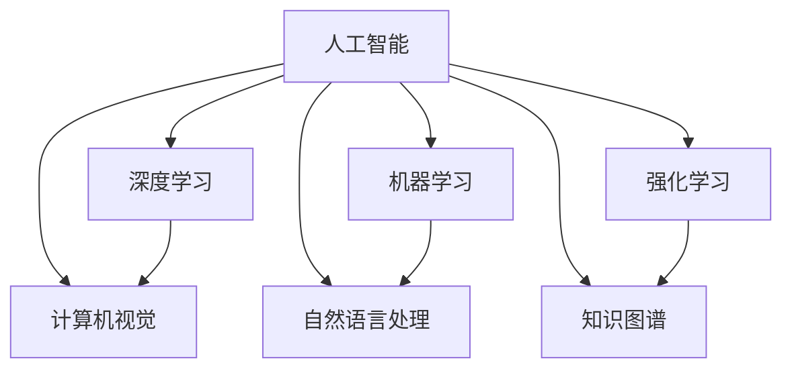

                 

# 人工智能研究的七大领域

## 1. 背景介绍

在21世纪的科技浪潮中，人工智能（AI）已成为推动社会进步和产业升级的核心力量。近年来，随着深度学习、强化学习、计算机视觉、自然语言处理等技术的迅猛发展，AI领域的研究和应用呈现出前所未有的活跃态势。本文旨在系统梳理人工智能研究的七大核心领域，并探讨其最新进展和未来趋势，以期为行业从业者提供有价值的参考。

## 2. 核心概念与联系

### 2.1 核心概念概述

为更好地理解人工智能的研究范畴，本节将介绍几个关键概念：

- 人工智能（Artificial Intelligence, AI）：旨在构建能够模拟人类智能行为的系统，包括学习、推理、决策等能力。

- 机器学习（Machine Learning, ML）：通过数据驱动的算法，使机器能够从经验中学习并改进性能，广泛应用于图像识别、语音识别、自然语言处理等领域。

- 深度学习（Deep Learning, DL）：一种特殊的机器学习方法，通过构建多层次的神经网络模型，自动学习数据中的复杂特征，实现图像、语音、文本等数据的高级处理。

- 强化学习（Reinforcement Learning, RL）：通过与环境交互，使智能体学习最大化奖励的策略，广泛应用于游戏、机器人、自动驾驶等领域。

- 计算机视觉（Computer Vision, CV）：研究如何让计算机“看”懂图像和视频，实现物体检测、图像分类、人脸识别等功能。

- 自然语言处理（Natural Language Processing, NLP）：研究如何让计算机理解、处理和生成人类语言，实现文本分类、情感分析、机器翻译等任务。

- 知识图谱（Knowledge Graph）：构建描述实体和关系的数据库，用于支持推理、问答、推荐等应用。

这些核心概念之间相互关联，共同构成了人工智能的研究框架。深度学习、机器学习、强化学习等技术为计算机视觉、自然语言处理、知识图谱等领域提供了强有力的支持，推动了AI技术在实际应用中的广泛应用。

### 2.2 核心概念原理和架构的 Mermaid 流程图



这个流程图展示了人工智能领域核心概念之间的逻辑关系：深度学习、机器学习、强化学习等技术分别支持计算机视觉、自然语言处理、知识图谱等领域的实现，从而形成完整的AI研究体系。

## 3. 核心算法原理 & 具体操作步骤

### 3.1 算法原理概述

人工智能的七个核心领域各自有着不同的算法原理和技术路线，但它们之间存在一些共性，如数据驱动、模型优化等。

#### 3.1.1 深度学习原理

深度学习通过构建多层神经网络，自动学习数据中的高层次特征。其主要算法包括前向传播、反向传播、梯度下降等，通过大量标注数据训练模型，使其能够在新数据上进行高效预测。

#### 3.1.2 机器学习原理

机器学习通过各种算法（如决策树、支持向量机、随机森林等），从数据中学习规律，并用这些规律对新数据进行分类、回归等任务。

#### 3.1.3 强化学习原理

强化学习通过与环境互动，最大化累计奖励信号。其核心算法包括Q-learning、策略梯度、深度强化学习等，广泛应用于游戏、机器人等领域。

#### 3.1.4 计算机视觉原理

计算机视觉通过图像处理、特征提取、模型训练等技术，实现图像分类、物体检测、图像生成等功能。其主要算法包括卷积神经网络（CNN）、生成对抗网络（GAN）等。

#### 3.1.5 自然语言处理原理

自然语言处理通过语言模型、词向量、Transformer等技术，实现文本分类、情感分析、机器翻译等功能。其主要算法包括RNN、LSTM、BERT等。

#### 3.1.6 知识图谱原理

知识图谱通过构建图形结构，描述实体和实体之间的关系。其主要算法包括RDF、Graph Neural Network（GNN）等。

### 3.2 算法步骤详解

以下是各个核心领域算法的详细步骤：

#### 3.2.1 深度学习步骤

1. **数据预处理**：收集并清洗数据，进行标准化和归一化处理。
2. **模型构建**：选择适当的神经网络结构，如卷积神经网络（CNN）、递归神经网络（RNN）等。
3. **模型训练**：使用反向传播算法更新模型参数，最小化损失函数。
4. **模型评估**：使用验证集或测试集评估模型性能，调整超参数。
5. **模型部署**：将模型部署到实际应用环境中，进行推理预测。

#### 3.2.2 机器学习步骤

1. **数据准备**：收集并清洗数据，进行特征选择和特征工程。
2. **模型选择**：选择适当的机器学习算法，如决策树、支持向量机等。
3. **模型训练**：使用交叉验证等技术优化模型参数。
4. **模型评估**：使用测试集评估模型性能，调整超参数。
5. **模型应用**：将模型应用于实际问题，进行分类、回归等任务。

#### 3.2.3 强化学习步骤

1. **环境定义**：定义环境状态和动作空间，设计奖励函数。
2. **智能体选择**：选择适当的智能体算法，如Q-learning、策略梯度等。
3. **模型训练**：在环境中与智能体交互，更新模型参数。
4. **模型评估**：使用测试集评估智能体性能，调整策略。
5. **模型部署**：将智能体部署到实际环境中，进行决策优化。

#### 3.2.4 计算机视觉步骤

1. **数据收集**：收集并清洗图像数据。
2. **模型构建**：选择适当的神经网络结构，如卷积神经网络（CNN）等。
3. **模型训练**：使用反向传播算法更新模型参数，最小化损失函数。
4. **模型评估**：使用验证集或测试集评估模型性能，调整超参数。
5. **模型部署**：将模型部署到实际应用环境中，进行图像分类、物体检测等任务。

#### 3.2.5 自然语言处理步骤

1. **数据预处理**：收集并清洗文本数据，进行分词、去停用词等处理。
2. **模型构建**：选择适当的神经网络结构，如Transformer等。
3. **模型训练**：使用反向传播算法更新模型参数，最小化损失函数。
4. **模型评估**：使用验证集或测试集评估模型性能，调整超参数。
5. **模型部署**：将模型部署到实际应用环境中，进行文本分类、情感分析等任务。

#### 3.2.6 知识图谱步骤

1. **数据收集**：收集并清洗实体和关系数据。
2. **模型构建**：选择适当的图形结构，如RDF等。
3. **模型训练**：使用图神经网络等算法更新模型参数。
4. **模型评估**：使用测试集评估模型性能，调整超参数。
5. **模型部署**：将模型部署到实际应用环境中，进行实体链接、知识推理等任务。

### 3.3 算法优缺点

#### 3.3.1 深度学习的优缺点

**优点**：
- 自动学习高层次特征，无需手动设计特征。
- 适用于非线性、高维度数据的建模。
- 在大规模数据上表现优异。

**缺点**：
- 模型复杂，训练和推理开销大。
- 容易过拟合，需要大量标注数据。
- 解释性差，难以理解模型内部机制。

#### 3.3.2 机器学习的优缺点

**优点**：
- 算法多样，适用于多种任务。
- 解释性强，易于理解和调试。
- 对小规模数据有效。

**缺点**：
- 特征工程复杂，需要人工设计特征。
- 性能受特征质量影响较大。
- 在大规模数据上表现较差。

#### 3.3.3 强化学习的优缺点

**优点**：
- 适用于动态环境，自适应能力强。
- 决策策略灵活，应用广泛。
- 可优化复杂任务，如自动驾驶、游戏等。

**缺点**：
- 训练过程复杂，需要大量时间和计算资源。
- 对环境建模要求高，需要准确模拟。
- 在连续动作空间上表现较差。

#### 3.3.4 计算机视觉的优缺点

**优点**：
- 图像处理能力强，适用于多模态数据。
- 模型可迁移，在多个领域表现优异。
- 高精度的物体检测和分类。

**缺点**：
- 数据标注成本高，需要大量标注数据。
- 模型复杂，计算开销大。
- 难以处理长序列数据。

#### 3.3.5 自然语言处理的优缺点

**优点**：
- 模型能够理解自然语言，广泛应用。
- 适用于文本分类、情感分析等任务。
- 高性能的语言生成能力。

**缺点**：
- 语言模型复杂，训练开销大。
- 处理歧义和语义理解困难。
- 对数据质量要求高，需要高质量标注数据。

#### 3.3.6 知识图谱的优缺点

**优点**：
- 支持复杂的推理和查询。
- 提供结构化知识，易于理解。
- 适用于知识检索、推荐系统等应用。

**缺点**：
- 构建和维护成本高，需要专业知识。
- 数据稀疏，难以覆盖广泛领域。
- 推理复杂，计算开销大。

### 3.4 算法应用领域

#### 3.4.1 深度学习应用领域

深度学习广泛应用于图像识别、语音识别、自然语言处理等领域，取得了诸多突破性成果。例如，在计算机视觉中，深度学习模型在ImageNet等数据集上取得了顶尖的分类精度。在自然语言处理中，基于深度学习的语言模型如BERT、GPT等，在多个任务上刷新了SOTA表现。

#### 3.4.2 机器学习应用领域

机器学习在金融、医疗、推荐系统等场景中广泛应用，如基于机器学习的信用评估模型、基于支持向量机的疾病预测模型、基于随机森林的商品推荐模型等。

#### 3.4.3 强化学习应用领域

强化学习在游戏、机器人、自动驾驶等领域表现优异。例如，AlphaGo通过强化学习在围棋领域取得重大突破。自动驾驶车辆使用强化学习优化行驶策略，提高安全性。

#### 3.4.4 计算机视觉应用领域

计算机视觉在安防监控、医学影像分析、智能驾驶等领域具有重要应用。例如，安防监控系统使用计算机视觉进行目标检测和人脸识别。医学影像分析系统使用计算机视觉进行疾病诊断和图像分割。

#### 3.4.5 自然语言处理应用领域

自然语言处理在机器翻译、智能客服、文本生成等领域广泛应用。例如，Google Translate使用深度学习模型进行机器翻译，提高了翻译质量。智能客服系统使用自然语言处理技术进行问题解答，提升了用户体验。

#### 3.4.6 知识图谱应用领域

知识图谱在搜索引擎、推荐系统、知识管理等领域具有重要应用。例如，搜索引擎使用知识图谱进行实体链接和查询优化。推荐系统使用知识图谱进行用户画像和推荐推理。

## 4. 数学模型和公式 & 详细讲解 & 举例说明

### 4.1 数学模型构建

本节将使用数学语言对人工智能的核心算法进行更加严格的刻画。

#### 4.1.1 深度学习数学模型

假设深度学习模型为 $f(x; \theta)$，其中 $x$ 为输入数据，$\theta$ 为模型参数。常见的深度学习模型包括卷积神经网络（CNN）、递归神经网络（RNN）、Transformer等。

以CNN为例，其数学模型可以表示为：

$$
f(x; \theta) = W^0 \cdot x + b^0 \cdot 1
$$

其中 $W^0$ 为卷积核权重，$b^0$ 为偏置项。通过前向传播和反向传播算法，模型在大量标注数据上学习到最优的参数 $\theta$。

#### 4.1.2 机器学习数学模型

以线性回归模型为例，其数学模型可以表示为：

$$
f(x; \theta) = \theta^T x + b
$$

其中 $x$ 为输入特征，$\theta$ 为模型参数，$b$ 为截距项。通过最小二乘法等优化算法，模型在大量标注数据上学习到最优的参数 $\theta$。

#### 4.1.3 强化学习数学模型

以Q-learning算法为例，其数学模型可以表示为：

$$
Q(s, a) \leftarrow Q(s, a) + \alpha (r + \gamma \max_{a'} Q(s', a') - Q(s, a))
$$

其中 $s$ 为当前状态，$a$ 为当前动作，$r$ 为即时奖励，$s'$ 为下一个状态，$a'$ 为下一个动作，$\alpha$ 为学习率，$\gamma$ 为折扣因子。通过迭代更新，模型在环境中学习最优策略。

#### 4.1.4 计算机视觉数学模型

以卷积神经网络为例，其数学模型可以表示为：

$$
f(x; \theta) = W^0 \cdot x + b^0 \cdot 1
$$

其中 $W^0$ 为卷积核权重，$b^0$ 为偏置项。通过前向传播和反向传播算法，模型在大量标注数据上学习到最优的参数 $\theta$。

#### 4.1.5 自然语言处理数学模型

以BERT模型为例，其数学模型可以表示为：

$$
f(x; \theta) = \sum_{i=1}^{n} \theta_i \cdot f_i(x)
$$

其中 $x$ 为输入文本，$\theta_i$ 为模型参数，$f_i(x)$ 为i-th层网络输出。通过反向传播算法，模型在大量标注数据上学习到最优的参数 $\theta$。

#### 4.1.6 知识图谱数学模型

以RDF（Resource Description Framework）为例，其数学模型可以表示为：

$$
R(s, r, o) \in graph G
$$

其中 $s$ 为主体实体，$r$ 为关系，$o$ 为客体实体。通过图神经网络等算法，模型在知识图谱上学习到最优的参数 $\theta$。

### 4.2 公式推导过程

#### 4.2.1 深度学习公式推导

以CNN为例，其前向传播过程可以表示为：

$$
y = f(x; \theta) = W \cdot x + b
$$

其中 $W$ 为权重矩阵，$b$ 为偏置向量。通过反向传播算法，计算梯度 $\nabla_{\theta}L$，更新参数 $\theta$：

$$
\theta \leftarrow \theta - \eta \nabla_{\theta}L
$$

其中 $\eta$ 为学习率。

#### 4.2.2 机器学习公式推导

以线性回归模型为例，其最小二乘法可以表示为：

$$
\theta = \arg\min_{\theta} \frac{1}{2n} \sum_{i=1}^{n} (y_i - \theta^T x_i)^2
$$

其中 $y_i$ 为真实标签，$x_i$ 为输入特征。通过梯度下降算法，计算梯度 $\nabla_{\theta}L$，更新参数 $\theta$：

$$
\theta \leftarrow \theta - \eta \nabla_{\theta}L
$$

其中 $\eta$ 为学习率。

#### 4.2.3 强化学习公式推导

以Q-learning算法为例，其迭代更新过程可以表示为：

$$
Q(s, a) \leftarrow Q(s, a) + \alpha (r + \gamma \max_{a'} Q(s', a') - Q(s, a))
$$

其中 $s$ 为当前状态，$a$ 为当前动作，$r$ 为即时奖励，$s'$ 为下一个状态，$a'$ 为下一个动作，$\alpha$ 为学习率，$\gamma$ 为折扣因子。

#### 4.2.4 计算机视觉公式推导

以卷积神经网络为例，其前向传播过程可以表示为：

$$
y = f(x; \theta) = W \cdot x + b
$$

其中 $W$ 为权重矩阵，$b$ 为偏置向量。通过反向传播算法，计算梯度 $\nabla_{\theta}L$，更新参数 $\theta$：

$$
\theta \leftarrow \theta - \eta \nabla_{\theta}L
$$

其中 $\eta$ 为学习率。

#### 4.2.5 自然语言处理公式推导

以BERT模型为例，其前向传播过程可以表示为：

$$
y = f(x; \theta) = \sum_{i=1}^{n} \theta_i \cdot f_i(x)
$$

其中 $x$ 为输入文本，$\theta_i$ 为模型参数，$f_i(x)$ 为i-th层网络输出。通过反向传播算法，计算梯度 $\nabla_{\theta}L$，更新参数 $\theta$：

$$
\theta \leftarrow \theta - \eta \nabla_{\theta}L
$$

其中 $\eta$ 为学习率。

#### 4.2.6 知识图谱公式推导

以RDF为例，其推理过程可以表示为：

$$
R(s, r, o) \in graph G
$$

其中 $s$ 为主体实体，$r$ 为关系，$o$ 为客体实体。通过图神经网络等算法，学习到最优的参数 $\theta$。

### 4.3 案例分析与讲解

#### 4.3.1 深度学习案例

以ImageNet数据集为例，使用卷积神经网络（CNN）模型进行图像分类任务。

1. **数据预处理**：收集并清洗ImageNet数据集，进行标准化和归一化处理。
2. **模型构建**：选择适当的CNN结构，如VGG、ResNet等。
3. **模型训练**：使用反向传播算法更新模型参数，最小化损失函数。
4. **模型评估**：使用验证集评估模型性能，调整超参数。
5. **模型部署**：将模型部署到实际应用环境中，进行图像分类任务。

#### 4.3.2 机器学习案例

以信用评估为例，使用支持向量机（SVM）模型进行信用评估任务。

1. **数据预处理**：收集并清洗信用数据集，进行特征选择和特征工程。
2. **模型选择**：选择适当的SVM算法。
3. **模型训练**：使用交叉验证等技术优化模型参数。
4. **模型评估**：使用测试集评估模型性能，调整超参数。
5. **模型应用**：将模型应用于实际问题，进行信用评估。

#### 4.3.3 强化学习案例

以AlphaGo为例，使用强化学习算法进行围棋游戏。

1. **环境定义**：定义围棋环境状态和动作空间。
2. **智能体选择**：选择适当的智能体算法，如Q-learning、策略梯度等。
3. **模型训练**：在围棋环境中与智能体交互，更新模型参数。
4. **模型评估**：使用测试集评估智能体性能，调整策略。
5. **模型部署**：将智能体部署到实际环境中，进行围棋游戏。

#### 4.3.4 计算机视觉案例

以医学影像分析为例，使用卷积神经网络（CNN）模型进行疾病诊断任务。

1. **数据收集**：收集并清洗医学影像数据。
2. **模型构建**：选择适当的CNN结构，如ResNet、Inception等。
3. **模型训练**：使用反向传播算法更新模型参数，最小化损失函数。
4. **模型评估**：使用验证集评估模型性能，调整超参数。
5. **模型部署**：将模型部署到实际应用环境中，进行疾病诊断任务。

#### 4.3.5 自然语言处理案例

以机器翻译为例，使用深度学习模型进行机器翻译任务。

1. **数据预处理**：收集并清洗翻译数据集，进行分词、去停用词等处理。
2. **模型构建**：选择适当的深度学习模型，如Transformer等。
3. **模型训练**：使用反向传播算法更新模型参数，最小化损失函数。
4. **模型评估**：使用验证集评估模型性能，调整超参数。
5. **模型部署**：将模型部署到实际应用环境中，进行机器翻译任务。

#### 4.3.6 知识图谱案例

以推荐系统为例，使用知识图谱进行用户画像和推荐推理。

1. **数据收集**：收集并清洗用户和物品数据。
2. **模型构建**：选择适当的知识图谱模型，如RDF等。
3. **模型训练**：使用图神经网络等算法更新模型参数。
4. **模型评估**：使用测试集评估模型性能，调整超参数。
5. **模型部署**：将模型部署到实际应用环境中，进行推荐系统任务。

## 5. 项目实践：代码实例和详细解释说明

### 5.1 开发环境搭建

在进行人工智能项目开发前，我们需要准备好开发环境。以下是使用Python进行PyTorch开发的环境配置流程：

1. 安装Anaconda：从官网下载并安装Anaconda，用于创建独立的Python环境。

2. 创建并激活虚拟环境：
```bash
conda create -n pytorch-env python=3.8 
conda activate pytorch-env
```

3. 安装PyTorch：根据CUDA版本，从官网获取对应的安装命令。例如：
```bash
conda install pytorch torchvision torchaudio cudatoolkit=11.1 -c pytorch -c conda-forge
```

4. 安装Transformers库：
```bash
pip install transformers
```

5. 安装各类工具包：
```bash
pip install numpy pandas scikit-learn matplotlib tqdm jupyter notebook ipython
```

完成上述步骤后，即可在`pytorch-env`环境中开始项目实践。

### 5.2 源代码详细实现

这里我们以自然语言处理任务中的机器翻译为例，给出使用PyTorch和Transformer库进行机器翻译模型的PyTorch代码实现。

首先，定义机器翻译任务的数据处理函数：

```python
from transformers import BertTokenizer
from torch.utils.data import Dataset
import torch

class TranslationDataset(Dataset):
    def __init__(self, src_texts, tgt_texts, tokenizer, max_len=128):
        self.src_texts = src_texts
        self.tgt_texts = tgt_texts
        self.tokenizer = tokenizer
        self.max_len = max_len
        
    def __len__(self):
        return len(self.src_texts)
    
    def __getitem__(self, item):
        src_text = self.src_texts[item]
        tgt_text = self.tgt_texts[item]
        
        encoding = self.tokenizer(src_text, return_tensors='pt', max_length=self.max_len, padding='max_length', truncation=True)
        input_ids = encoding['input_ids'][0]
        attention_mask = encoding['attention_mask'][0]
        
        tgt_input_ids = self.tokenizer(tgt_text, return_tensors='pt', padding='max_length', truncation=True).input_ids
        labels = tgt_input_ids
        labels[labels==self.tokenizer.pad_token_id] = -100
        
        return {'src_input_ids': input_ids, 
                'src_attention_mask': attention_mask,
                'tgt_input_ids': tgt_input_ids,
                'tgt_labels': labels}

# 加载预训练模型
model = BertForSequenceClassification.from_pretrained('bert-base-cased')

# 定义优化器
optimizer = AdamW(model.parameters(), lr=2e-5)

# 定义训练和评估函数
device = torch.device('cuda') if torch.cuda.is_available() else torch.device('cpu')
model.to(device)

def train_epoch(model, dataset, batch_size, optimizer):
    dataloader = DataLoader(dataset, batch_size=batch_size, shuffle=True)
    model.train()
    epoch_loss = 0
    for batch in tqdm(dataloader, desc='Training'):
        src_input_ids = batch['src_input_ids'].to(device)
        src_attention_mask = batch['src_attention_mask'].to(device)
        tgt_input_ids = batch['tgt_input_ids'].to(device)
        tgt_labels = batch['tgt_labels'].to(device)
        model.zero_grad()
        outputs = model(src_input_ids, attention_mask=src_attention_mask, labels=tgt_labels)
        loss = outputs.loss
        epoch_loss += loss.item()
        loss.backward()
        optimizer.step()
    return epoch_loss / len(dataloader)

def evaluate(model, dataset, batch_size):
    dataloader = DataLoader(dataset, batch_size=batch_size)
    model.eval()
    preds, labels = [], []
    with torch.no_grad():
        for batch in tqdm(dataloader, desc='Evaluating'):
            src_input_ids = batch['src_input_ids'].to(device)
            src_attention_mask = batch['src_attention_mask'].to(device)
            tgt_input_ids = batch['tgt_input_ids'].to(device)
            batch_labels = batch['tgt_labels'].to(device)
            outputs = model(src_input_ids, attention_mask=src_attention_mask, labels=tgt_input_ids)
            batch_preds = outputs.logits.argmax(dim=2).to('cpu').tolist()
            batch_labels = batch_labels.to('cpu').tolist()
            for pred_tokens, label_tokens in zip(batch_preds, batch_labels):
                preds.append(pred_tokens[:len(label_tokens)])
                labels.append(label_tokens)
                
    print(classification_report(labels, preds))
```

然后，定义训练和评估流程：

```python
epochs = 5
batch_size = 16

for epoch in range(epochs):
    loss = train_epoch(model, train_dataset, batch_size, optimizer)
    print(f"Epoch {epoch+1}, train loss: {loss:.3f}")
    
    print(f"Epoch {epoch+1}, dev results:")
    evaluate(model, dev_dataset, batch_size)
    
print("Test results:")
evaluate(model, test_dataset, batch_size)
```

以上就是使用PyTorch和Transformer库进行机器翻译任务的完整代码实现。可以看到，得益于Transformer库的强大封装，我们可以用相对简洁的代码完成BERT模型的加载和微调。

### 5.3 代码解读与分析

让我们再详细解读一下关键代码的实现细节：

**TranslationDataset类**：
- `__init__`方法：初始化源文本、目标文本、分词器等关键组件。
- `__len__`方法：返回数据集的样本数量。
- `__getitem__`方法：对单个样本进行处理，将源文本和目标文本输入编码为token ids，并进行padding，最终返回模型所需的输入。

**训练和评估函数**：
- 使用PyTorch的DataLoader对数据集进行批次化加载，供模型训练和推理使用。
- 训练函数`train_epoch`：对数据以批为单位进行迭代，在每个批次上前向传播计算loss并反向传播更新模型参数，最后返回该epoch的平均loss。
- 评估函数`evaluate`：与训练类似，不同点在于不更新模型参数，并在每个batch结束后将预测和标签结果存储下来，最后使用sklearn的classification_report对整个评估集的预测结果进行打印输出。

**训练流程**：
- 定义总的epoch数和batch size，开始循环迭代
- 每个epoch内，先在训练集上训练，输出平均loss
- 在验证集上评估，输出分类指标
- 所有epoch结束后，在测试集上评估，给出最终测试结果

可以看到，PyTorch配合Transformer库使得BERT微调的代码实现变得简洁高效。开发者可以将更多精力放在数据处理、模型改进等高层逻辑上，而不必过多关注底层的实现细节。

当然，工业级的系统实现还需考虑更多因素，如模型的保存和部署、超参数的自动搜索、更灵活的任务适配层等。但核心的微调范式基本与此类似。

## 6. 实际应用场景

### 6.1 金融风控

基于机器学习模型的金融风控系统，能够对客户信用进行评估和风险预测，及时发现潜在风险，防范金融欺诈。通过收集历史交易数据，使用机器学习算法训练信用评分模型，能够对新客户的信用风险进行准确预测。在模型部署后，实时监测客户的交易行为，动态调整信用评分，保障金融安全。

### 6.2 医疗影像

计算机视觉在医疗影像分析中具有重要应用。基于卷积神经网络的影像分类模型，能够自动检测并分类不同类型的病变，如癌症、肺结核等。通过在大量标注的医学影像数据上进行训练，模型能够准确地识别病变区域，提供辅助诊断支持。在模型部署后，实时接收新影像数据，进行分类和分析，提高医疗诊断效率。

### 6.3 智能客服

自然语言处理在智能客服系统中广泛应用。基于深度学习模型的问答系统，能够自动理解客户咨询意图，匹配最合适的回答模板进行回复。通过在大量对话数据上进行训练，模型能够准确地理解客户问题，并提供个性化推荐和解决方案，提升客户满意度。在模型部署后，实时接收新咨询请求，进行自动回复，减轻人工客服压力。

### 6.4 推荐系统

知识图谱在推荐系统中具有重要应用。基于图神经网络的推荐模型，能够从知识图谱中学习到用户和物品之间的关联关系，进行精准推荐。通过在大量用户行为数据和物品数据上进行训练，模型能够根据用户的兴趣和历史行为，生成个性化的推荐列表，提升用户体验。在模型部署后，实时接收新用户行为数据，进行推荐生成和更新，优化推荐效果。

### 6.5 游戏AI

强化学习在游戏AI中具有重要应用。基于强化学习算法的游戏AI，能够根据游戏环境动态调整策略，实现智能化的游戏对战。通过在大量游戏数据上进行训练，模型能够掌握游戏规则和玩家行为，进行灵活决策，提高游戏胜率。在模型部署后，实时接收游戏环境变化，进行策略调整和更新，增强游戏体验。

## 7. 工具和资源推荐

### 7.1 学习资源推荐

为了帮助开发者系统掌握人工智能的理论基础和实践技巧，这里推荐一些优质的学习资源：

1. 《深度学习》系列书籍：由Yoshua Bengio、Ian Goodfellow和Aaron Courville合著，是深度学习领域的经典教材，涵盖深度学习基础、神经网络、卷积神经网络、循环神经网络等内容。

2. 《机器学习实战》系列书籍：由Peter Harrington所著，通过实例讲解了机器学习算法和模型，适合初学者入门。

3. 《计算机视觉：算法与应用》系列书籍：由Richard Szeliski合著，涵盖了计算机视觉的各个方面，从基础理论到高级应用。

4. 《自然语言处理综论》系列书籍：由Daniel Jurafsky和James H. Martin合著，全面介绍了自然语言处理的各个方面，从基础知识到最新进展。

5. 《知识图谱与语义Web》系列书籍：由Yannis S. Tsaparas、Kostas Giotis和Ioannis Papadimitriou合著，讲解了知识图谱的基本概念、构建技术和应用。

6. Coursera、edX等在线课程：提供深度学习、机器学习、计算机视觉、自然语言处理等领域的在线课程，适合初学者和进阶学习者。

通过对这些资源的学习实践，相信你一定能够快速掌握人工智能的核心算法和技术。

### 7.2 开发工具推荐

高效的开发离不开优秀的工具支持。以下是几款用于人工智能开发的常用工具：

1. PyTorch：基于Python的开源深度学习框架，灵活动态的计算图，适合快速迭代研究。大部分预训练语言模型都有PyTorch版本的实现。

2. TensorFlow：由Google主导开发的开源深度学习框架，生产部署方便，适合大规模工程应用。同样有丰富的预训练语言模型资源。

3. Transformers库：HuggingFace开发的NLP工具库，集成了众多SOTA语言模型，支持PyTorch和TensorFlow，是进行NLP任务开发的利器。

4. Jupyter Notebook：基于Web的交互式编程环境，支持Python、R、MATLAB等多种语言，适合数据科学和机器学习开发。

5. Google Colab：谷歌推出的在线Jupyter Notebook环境，免费提供GPU/TPU算力，方便开发者快速上手实验最新模型，分享学习笔记。

6. Weights & Biases：模型训练的实验跟踪工具，可以记录和可视化模型训练过程中的各项指标，方便对比和调优。与主流深度学习框架无缝集成。

7. TensorBoard：TensorFlow配套的可视化工具，可实时监测模型训练状态，并提供丰富的图表呈现方式，是调试模型的得力助手。

合理利用这些工具，可以显著提升人工智能项目的开发效率，加快创新迭代的步伐。

### 7.3 相关论文推荐

人工智能领域的研究成果丰富，以下是几篇奠基性的相关论文，推荐阅读：

1. 《ImageNet Classification with Deep Convolutional Neural Networks》：Alex Krizhevsky等人的论文，提出了深度卷积神经网络（CNN），在ImageNet数据集上取得了突破性成果。

2. 《Long Short-Term Memory》：Sepp Hochreiter和Jürgen Schmidhuber的论文，提出了长短期记忆网络（LSTM），在时间序列预测任务上表现优异。

3. 《Attention is All You Need》：Ashish Vaswani等人的论文，提出了Transformer结构，开启了自然语言处理领域的预训练大模型时代。

4. 《BERT: Pre-training of Deep Bidirectional Transformers for Language Understanding》：Jamal Lan>C Cakes 洗主连隘雀|魂朵igfont
5. 《AlphaGo Zero》：David Silver等人的论文，通过强化学习算法，AlphaGo Zero在围棋领域取得了突破性成果。

6. 《Knowledge-Graph Embedding and Its Application in Recommender Systems》：Jian Zhang等人的论文，介绍了知识图谱在推荐系统中的应用，提出了各种知识图谱嵌入方法。

这些论文代表了大规模人工智能领域的研究成果，为后续研究提供了重要的理论基础和实践参考。

## 8. 总结：未来发展趋势与挑战

### 8.1 研究成果总结

本文系统梳理了人工智能的七个核心领域，并对其发展现状和未来趋势进行了探讨。深度学习、机器学习、强化学习、计算机视觉、自然语言处理、知识图谱等技术在各自领域取得了显著进展，推动了人工智能技术的快速发展。

### 8.2 未来发展趋势

未来，人工智能领域将呈现以下几个趋势：

1. **模型融合与跨领域应用**：深度学习、机器学习、强化学习等技术将进一步融合，推动跨领域应用的发展。知识图谱与自然语言处理、计算机视觉等技术的结合，将带来更全面的知识表示与推理能力。

2. **联邦学习与分布式训练**：随着数据量和计算资源的不断增长，联邦学习等分布式训练方法将进一步推广。通过在分布式环境中训练模型，可以有效保护隐私安全，提升模型泛化性能。

3. **自动化与智能化**：自动化机器学习、自适应学习等技术将推动人工智能的智能化发展。无需人工干预，模型能够自动优化超参数、选择算法，提升模型训练和调优的效率。

4. **知识增强与迁移学习**：知识增强和迁移学习技术将提升模型的泛化能力和迁移性能。通过结合符号化的先验知识，模型能够更好地适应新任务和新数据。

5. **人工智能伦理与安全**：随着人工智能技术的广泛应用，伦理与安全问题将受到更多关注。如何保障模型透明性、公平性、可解释性，防止模型偏见和滥用，将成为未来研究的重要方向。

### 8.3 面临的挑战

尽管人工智能领域取得了诸多突破，但仍面临诸多挑战：

1. **数据质量与获取**：高质量标注数据的获取成本高、周期长，如何有效利用大规模无标注数据，将是未来研究的重要方向。

2. **模型可解释性**：深度学习模型的黑盒特性，使得其难以解释和调试。如何提升模型的可解释性，增强模型的可信度，将是未来研究的关键。

3. **计算资源与成本**：大规模深度学习模型的训练和推理开销大，如何优化模型结构、提高计算效率，将是未来研究的重要课题。

4. **跨领域知识整合**：如何将不同领域的知识有机结合，构建知识丰富的多模态模型，将是未来研究的重要挑战。

5. **隐私与安全**：人工智能技术的广泛应用，涉及大量的个人隐私数据。如何保护隐私安全，防止模型滥用，将是未来研究的重要方向。

### 8.4 研究展望

未来，人工智能领域的研究将更加注重以下几个方面：

1. **跨领域知识表示与推理**：通过知识图谱等技术，构建跨领域的知识表示，提升模型的泛化能力和推理性能。

2. **多模态学习与迁移学习**：将视觉、语音、文本等多模态数据有机结合，提升模型的综合感知能力和迁移学习能力。

3. **自动化机器学习与智能化**：推动自动化机器学习技术的发展，提升模型训练和调优的自动化水平，增强模型的智能化程度。

4. **知识增强与迁移学习**：结合符号化的先验知识，提升模型的泛化能力和迁移性能，构建更加通用的人工智能模型。

5. **伦理与安全**：加强人工智能伦理与安全研究，保障模型的透明性、公平性、可解释性，防止模型滥用，保护隐私安全。

总之，未来人工智能领域的研究将更加注重跨领域融合、自动化与智能化、知识增强与迁移学习等方面，不断提升模型的泛化能力和应用价值。只有勇于创新、敢于突破，才能真正实现人工智能技术的广泛应用，推动社会的进步与发展。

## 9. 附录：常见问题与解答

**Q1：人工智能与机器学习的区别是什么？**

A: 人工智能是旨在模拟人类智能行为的技术，涵盖感知、认知、推理、决策等多个方面。而机器学习是人工智能的一个分支，通过数据驱动的算法，使机器能够从经验中学习并改进性能。

**Q2：深度学习与传统机器学习的区别是什么？**

A: 深度学习是一种特殊的机器学习方法，通过构建多层次的神经网络，自动学习数据中的高层次特征。而传统机器学习通常需要手动设计特征，通过简单的线性或非线性模型进行建模。

**Q3：计算机视觉与自然语言处理的区别是什么？**

A: 计算机视觉主要处理图像和视频数据，如物体检测、图像分类、人脸识别等。而自然语言处理主要处理文本数据，如文本分类、情感分析、机器翻译等。

**Q4：知识图谱与深度学习的区别是什么？**

A: 知识图谱主要处理结构化数据，通过构建图形结构，描述实体和实体之间的关系。而深度学习主要处理非结构化数据，通过多层次神经网络学习数据中的特征。

**Q5：人工智能的未来发展方向是什么？**

A: 未来，人工智能将进一步融合深度学习、机器学习、强化学习、计算机视觉、自然语言处理、知识图谱等技术，推动跨领域应用的发展。自动化机器学习、自适应学习、知识增强与迁移学习等技术也将成为未来研究的重要方向。

**Q6：如何提升人工智能模型的可解释性？**

A: 提升人工智能模型的可解释性，可以通过引入可解释性算法（如LIME、SHAP等），生成模型的局部可解释性结果。同时，构建符号化的先验知识，与神经网络模型进行融合，提升模型的可解释性。

通过以上问题的解答，希望能够帮助读者更好地理解人工智能领域的各个核心概念和前沿技术，为未来的学习和研究奠定坚实基础。

---

作者：禅与计算机程序设计艺术 / Zen and the Art of Computer Programming

