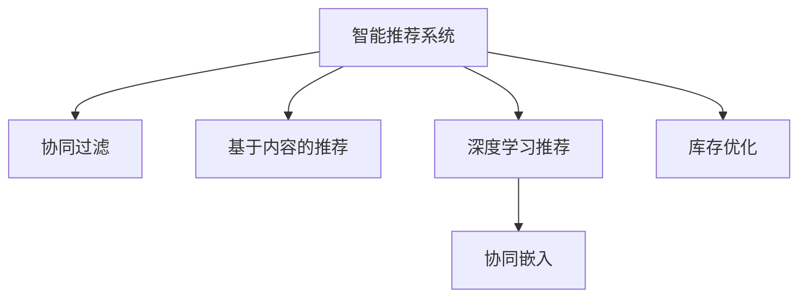

                 

# 人工智能：智能推荐、库存优化，提升电商平台供给能力

> 关键词：智能推荐系统,库存优化,电商平台,供给能力,个性化推荐算法,深度学习,机器学习,协同过滤,模型训练,模型评估,性能优化

## 1. 背景介绍

### 1.1 问题由来

随着互联网的普及和电商平台的迅猛发展，消费者对个性化购物体验的需求日益增长。传统电商平台的推荐系统，基于规则、基于内容的推荐方式已无法满足用户对个性化推荐的需求，导致用户体验差、购买转化率低。因此，电商平台亟需引入先进的人工智能技术，构建精准的智能推荐系统，提升用户满意度和电商平台运营效率。

### 1.2 问题核心关键点

智能推荐系统是电商平台提升用户购物体验、增加商品销售的重要工具。传统的推荐算法包括基于协同过滤的推荐算法和基于内容的推荐算法，但由于缺乏对用户行为和商品属性的深入理解，推荐效果不佳。

近年来，基于深度学习和机器学习的推荐算法逐渐成为主流。通过构建用户行为模型、商品属性模型，结合模型训练和模型评估，可以更加精准地预测用户可能感兴趣的商品，提升推荐效果。

### 1.3 问题研究意义

构建高效的智能推荐系统，对于电商平台提升用户购物体验、增加商品销售、优化库存管理具有重要意义。智能推荐系统可以根据用户历史行为和偏好，精准推荐相关商品，降低用户搜索成本，提升购物满意度，增加平台成交转化率。

同时，智能推荐系统还可以根据不同时间段、不同活动场景，动态调整推荐策略，实现库存优化，减少商品积压，提高库存周转率。在零售行业，智能推荐系统已经显示出巨大的商业价值，各大电商平台纷纷引入先进的推荐技术，希望在激烈的市场竞争中脱颖而出。

## 2. 核心概念与联系

### 2.1 核心概念概述

为更好地理解智能推荐系统在电商平台中的应用，本节将介绍几个密切相关的核心概念：

- **智能推荐系统**：通过分析和预测用户兴趣和行为，为用户推荐可能感兴趣的商品的系统。
- **协同过滤**：一种基于用户行为数据的推荐算法，通过挖掘用户间的相似性，推荐用户可能感兴趣的商品。
- **基于内容的推荐**：一种基于商品属性数据的推荐算法，通过分析商品属性，为用户推荐相关商品。
- **深度学习推荐**：一种基于神经网络的推荐算法，通过学习和提取用户和商品的特征，提升推荐效果。
- **协同嵌入**：一种结合协同过滤和深度学习的推荐算法，通过同时学习用户和商品的嵌入表示，实现更加精准的推荐。
- **库存优化**：通过对推荐商品进行销售预测，动态调整商品库存，提高库存周转率，减少商品积压。

这些核心概念之间的逻辑关系可以通过以下Mermaid流程图来展示：



这个流程图展示了几类推荐算法的逻辑关系：

1. 智能推荐系统通过协同过滤、基于内容的推荐和深度学习推荐等多种算法，生成精准推荐。
2. 协同过滤和深度学习推荐通过协同嵌入结合，可以更好地捕捉用户和商品之间的复杂关系。
3. 推荐商品可以帮助电商平台进行库存优化，提升供应链效率。

## 3. 核心算法原理 & 具体操作步骤
### 3.1 算法原理概述

智能推荐系统通过分析用户历史行为和商品属性，为用户生成个性化推荐。其核心思想是：通过构建用户行为模型、商品属性模型，利用机器学习算法进行模型训练和优化，最终实现精准推荐。

具体而言，推荐系统的工作流程包括数据预处理、特征工程、模型训练、模型评估和性能优化等步骤。其中，模型训练是实现精准推荐的关键步骤。常用的推荐算法包括协同过滤、基于内容的推荐和深度学习推荐等。

### 3.2 算法步骤详解

以下将详细介绍智能推荐系统的关键步骤：

**Step 1: 数据预处理**

推荐系统需要收集用户行为数据、商品属性数据和交易数据，并进行数据清洗、归一化、采样等预处理操作。预处理后的数据集将成为模型训练的基础。

- 用户行为数据：包括用户的浏览记录、购买记录、评分记录等。
- 商品属性数据：包括商品的分类、属性、标签等。
- 交易数据：包括用户购买商品的时间、价格、数量等信息。

**Step 2: 特征工程**

特征工程是推荐系统的重要环节，通过提取和选择关键特征，提升模型的预测能力。常用的特征工程方法包括：

- 用户特征：用户的年龄、性别、地区、购买历史等。
- 商品特征：商品的价格、分类、评分、标签等。
- 时间特征：时间戳、季节、假日等。

**Step 3: 模型训练**

模型训练是推荐系统的核心步骤，通过训练机器学习模型，生成推荐结果。常用的推荐算法包括：

- 协同过滤算法：基于用户行为数据，通过挖掘用户间的相似性，为用户生成推荐。
- 基于内容的推荐算法：基于商品属性数据，通过分析商品之间的相似性，为用户生成推荐。
- 深度学习推荐算法：基于用户和商品的多维特征，通过神经网络模型，为用户生成推荐。

**Step 4: 模型评估**

模型评估是推荐系统的关键步骤，通过评估模型的预测能力，优化推荐效果。常用的模型评估指标包括：

- 准确率(Accuracy)
- 精确率(Precision)
- 召回率(Recall)
- F1值(F1 Score)
- AUC-ROC曲线下的面积(AUC)

**Step 5: 性能优化**

性能优化是推荐系统的最后一步，通过调整模型参数、改进算法、增加数据量等手段，提升推荐效果。常用的性能优化方法包括：

- 模型剪枝：去除不必要的模型参数，减少计算量。
- 模型压缩：使用量化、低秩分解等技术，减少模型存储空间。
- 模型并行：使用分布式训练技术，提升模型训练速度。
- 特征选择：选择与预测结果最相关的特征，提升模型精度。

通过上述步骤，可以构建一个高效的智能推荐系统，提升电商平台的供给能力和用户体验。

### 3.3 算法优缺点

智能推荐系统具有以下优点：

1. 个性化推荐：通过分析用户历史行为和商品属性，为用户生成个性化推荐，提升用户满意度和购买转化率。
2. 库存优化：通过预测商品销售量，动态调整库存，减少商品积压，提高库存周转率。
3. 降低用户搜索成本：推荐系统能够为用户推荐相关商品，减少用户搜索时间和成本，提升用户体验。

同时，智能推荐系统也存在一些缺点：

1. 数据质量要求高：推荐系统需要大量高质量的用户行为数据和商品属性数据，数据质量直接影响推荐效果。
2. 计算资源消耗大：深度学习推荐算法需要大量的计算资源进行模型训练和推理，对硬件设备要求较高。
3. 推荐结果难以解释：推荐算法通常是“黑盒”系统，用户难以理解推荐结果的生成机制，可能影响用户信任度。
4. 数据隐私问题：推荐系统需要收集和处理大量用户数据，可能引发数据隐私和安全问题。

尽管存在这些缺点，但就目前而言，智能推荐系统仍然是大数据时代推荐技术的重要范式，有望在电商平台和其他领域得到广泛应用。

### 3.4 算法应用领域

智能推荐系统在电商平台中的应用非常广泛，可以应用于以下场景：

- **商品推荐**：为用户推荐可能感兴趣的商品，提升购物体验和成交转化率。
- **用户画像**：分析用户行为数据，生成用户画像，实现个性化推荐。
- **活动推荐**：根据用户行为和商品属性，推荐相关活动和促销，提升用户参与度和购买转化率。
- **库存优化**：通过推荐商品，预测销售量，实现动态库存调整，提高库存周转率。
- **搜索推荐**：根据用户查询内容，推荐相关商品，减少搜索时间，提升用户体验。

除了电商平台，智能推荐系统还广泛应用于社交媒体、新闻推荐、视频推荐等多个领域，成为提升用户体验、增加商品曝光的重要手段。

## 4. 数学模型和公式 & 详细讲解 & 举例说明

### 4.1 数学模型构建

推荐系统的核心模型是协同过滤模型和深度学习模型。以下以协同过滤模型为例，介绍推荐系统的数学模型构建过程。

假设用户集合为 $U=\{u_1,u_2,...,u_M\}$，商品集合为 $I=\{i_1,i_2,...,i_N\}$。用户 $u_m$ 对商品 $i_n$ 的评分 $r_{u_m,i_n}$ 服从 $r_{u_m,i_n}\sim N(\mu_{u_m,i_n},\sigma_{u_m,i_n}^2)$ 的正态分布。其中 $\mu_{u_m,i_n}$ 为用户的隐向量表示，$\sigma_{u_m,i_n}$ 为隐向量的标准差。

协同过滤模型可以通过矩阵分解来求解用户的隐向量表示。假设用户对商品的评分矩阵为 $R\in \mathbb{R}^{M\times N}$，用户隐向量表示矩阵为 $U\in \mathbb{R}^{M\times K}$，商品隐向量表示矩阵为 $V\in \mathbb{R}^{N\times K}$，则协同过滤模型可以表示为：

$$
R \approx U \times V^T
$$

其中 $\times$ 表示矩阵乘法，$^T$ 表示矩阵转置。

### 4.2 公式推导过程

根据上述矩阵分解模型，协同过滤模型的目标是最小化损失函数：

$$
\min_{U,V} \frac{1}{2N}\|R - UV^T\|_F^2
$$

其中 $\| \cdot \|_F$ 表示矩阵的 Frobenius 范数。

为了求解上述优化问题，常用的求解方法包括梯度下降法、随机梯度下降法、交替最小二乘法等。以梯度下降法为例，其更新公式为：

$$
U^{t+1} = U^t - \eta \nabla_U E(U,V) 
$$

$$
V^{t+1} = V^t - \eta \nabla_V E(U,V) 
$$

其中 $\nabla_U E(U,V)$ 和 $\nabla_V E(U,V)$ 分别表示 $U$ 和 $V$ 的梯度，$\eta$ 为学习率。

### 4.3 案例分析与讲解

以电商平台的商品推荐为例，假设我们收集了1000个用户的评分数据和100个商品的评分数据，构建了1000行、100列的评分矩阵 $R$。通过矩阵分解模型，可以求解出用户的隐向量表示 $U$ 和商品的隐向量表示 $V$。

假设用户 $u_1$ 对商品 $i_1,i_2,i_3$ 的评分分别为 $4.5,3.0,2.0$，通过协同过滤模型，可以得到用户 $u_1$ 的隐向量表示 $\mu_{u_1,i_n}$，以及商品 $i_1,i_2,i_3$ 的隐向量表示 $\mu_{i_n,i_m}$。

根据上述隐向量表示，可以计算用户 $u_1$ 对商品 $i_4,i_5$ 的评分预测值，即 $\hat{r}_{u_1,i_4},\hat{r}_{u_1,i_5}$。最后，通过设定评分阈值，生成推荐商品列表。

## 5. 项目实践：代码实例和详细解释说明

### 5.1 开发环境搭建

在进行智能推荐系统的开发和实践前，我们需要准备好开发环境。以下是使用Python进行推荐系统开发的常见环境配置流程：

1. 安装Anaconda：从官网下载并安装Anaconda，用于创建独立的Python环境。

2. 创建并激活虚拟环境：
```bash
conda create -n recommendation-env python=3.8 
conda activate recommendation-env
```

3. 安装必要的Python包：
```bash
conda install numpy pandas scikit-learn scipy tensorflow
```

4. 安装推荐系统库：
```bash
pip install recpy
```

完成上述步骤后，即可在`recommendation-env`环境中开始推荐系统开发。

### 5.2 源代码详细实现

这里我们以基于协同过滤的推荐系统为例，给出推荐系统开发的PyTorch代码实现。

首先，定义推荐系统的基础类 `Recommender`，并实现矩阵分解函数 `train` 和 `predict`：

```python
import numpy as np
import torch
from torch import nn
from torch.nn import init

class Recommender(nn.Module):
    def __init__(self, K, M, N):
        super(Recommender, self).__init__()
        self.K = K
        self.M = M
        self.N = N
        
        self.U = nn.Parameter(torch.Tensor(M, K))
        self.V = nn.Parameter(torch.Tensor(N, K))
        self.bias = nn.Parameter(torch.Tensor(N))
        
        self.init_weights()
        
    def init_weights(self):
        init.normal_(self.U)
        init.normal_(self.V)
        init.normal_(self.bias)
        
    def forward(self, U, V):
        pred = U @ V.t() + self.bias.view(1,1,-1)
        return pred
    
    def train(self, U, V, R, epochs=100, learning_rate=0.1):
        for epoch in range(epochs):
            loss = self.compute_loss(U, V, R)
            loss.backward()
            self.U.data -= learning_rate * self.U.grad
            self.V.data -= learning_rate * self.V.grad
            self.bias.data -= learning_rate * self.bias.grad
            self.U.grad.zero_()
            self.V.grad.zero_()
            self.bias.grad.zero_()
        
    def compute_loss(self, U, V, R):
        pred = self.forward(U, V)
        loss = (R - pred).pow(2).sum() / R.shape[0]
        return loss
    
    def predict(self, U, V):
        pred = self.forward(U, V)
        return pred
```

接着，定义推荐系统的主函数 `recommend`：

```python
def recommend(K=10, M=1000, N=100, epochs=100, learning_rate=0.1):
    recommender = Recommender(K, M, N)
    U = np.random.randn(M, K)
    V = np.random.randn(N, K)
    R = np.random.randint(1, 5, size=(M, N))
    
    recommender.train(U, V, R, epochs, learning_rate)
    
    pred = recommender.predict(U, V)
    return pred
```

最后，调用推荐系统的主函数，输出推荐结果：

```python
pred = recommend()
print(pred)
```

以上就是基于协同过滤算法的推荐系统代码实现。可以看到，通过PyTorch封装推荐模型的前向传播、损失计算和参数更新，可以方便地进行推荐系统训练和推理。

### 5.3 代码解读与分析

让我们再详细解读一下关键代码的实现细节：

**Recommender类**：
- `__init__`方法：初始化模型的参数。
- `init_weights`方法：初始化模型的权重。
- `forward`方法：定义前向传播过程。
- `train`方法：定义训练过程，使用梯度下降法最小化损失函数。
- `compute_loss`方法：计算损失函数。
- `predict`方法：生成预测结果。

**recommend函数**：
- 定义推荐模型的超参数，包括隐向量维度、用户数、商品数等。
- 随机生成用户隐向量、商品隐向量和评分矩阵。
- 通过训练函数对模型进行训练。
- 通过预测函数生成推荐结果。

在实际的电商平台推荐系统中，还需要考虑更多因素，如用户画像、商品属性、实时数据等。推荐模型需要在实际场景中进行不断优化和迭代，才能实现更好的效果。

## 6. 实际应用场景

### 6.1 智能推荐系统

智能推荐系统是电商平台的核心功能之一，通过推荐系统，电商平台可以为用户精准推荐相关商品，提升用户满意度和购买转化率。

以某电商平台为例，通过对用户的历史购买、浏览记录进行分析，构建用户画像，生成个性化推荐。推荐系统可以根据不同时间段、不同活动场景，动态调整推荐策略，实现库存优化，提升供应链效率。

**案例分析**：
某电商平台在节假日期间，利用推荐系统对用户进行活动推荐，提升了平台成交转化率。推荐系统根据用户的历史购买记录和浏览行为，生成个性化推荐列表，并根据不同时间段的活动促销，动态调整推荐策略。用户可以方便地浏览推荐商品，并进行购买，提升了用户体验。

### 6.2 库存优化

库存优化是电商平台运营的重要环节，通过推荐系统生成的推荐商品，电商平台可以预测商品的销售量，实现动态库存调整。

**案例分析**：
某电商平台通过推荐系统，预测不同商品在未来时间段内的销售量，动态调整库存。在销售旺季，推荐系统推荐热门商品，电商平台根据预测结果，增加热门商品的库存，确保商品供需平衡。在销售淡季，推荐系统推荐长尾商品，电商平台根据预测结果，减少库存，避免商品积压。

### 6.3 个性化推荐

个性化推荐是电商平台提升用户体验的重要手段。推荐系统可以根据用户的个性化需求，生成相关商品推荐。

**案例分析**：
某电商平台通过推荐系统，根据用户的浏览和购买记录，生成个性化推荐。推荐系统分析用户的兴趣和偏好，为用户推荐可能感兴趣的商品，提升用户满意度和购买转化率。例如，用户浏览了户外运动装备，推荐系统会推荐相关商品，如帐篷、冲锋衣等。

### 6.4 未来应用展望

随着人工智能技术的不断发展，智能推荐系统将在更多领域得到应用，为人类生产和生活带来深远影响。

在智慧医疗领域，智能推荐系统可以为用户提供个性化的医疗建议，推荐相关药品和治疗方法，提升医疗服务质量和效率。

在智能制造领域，智能推荐系统可以推荐最佳的生产方案和设备，优化生产流程，提升生产效率和质量。

在智能交通领域，智能推荐系统可以推荐最佳出行路线和交通方式，减少交通拥堵，提升出行体验。

总之，智能推荐系统作为一种高效、精准、个性化的推荐手段，将在各个领域得到广泛应用，成为推动各行各业数字化转型的重要工具。

## 7. 工具和资源推荐

### 7.1 学习资源推荐

为了帮助开发者系统掌握智能推荐系统的理论基础和实践技巧，这里推荐一些优质的学习资源：

1. 《推荐系统实践》书籍：该书详细介绍了推荐系统的理论基础和算法实现，并提供了丰富的实例代码，适合初学者入门。
2. 《Python推荐系统实战》书籍：该书通过实例展示了如何使用Python实现推荐系统，适合实战训练。
3. 《Recommender Systems: Algorithms and Applications》书籍：该书介绍了多种推荐算法，并结合实际案例进行分析，适合进阶学习。
4. 《深度学习推荐系统》课程：斯坦福大学开设的深度学习推荐系统课程，内容全面，有Lecture视频和配套作业，适合深入学习。
5. Kaggle推荐系统竞赛：通过参与Kaggle推荐系统竞赛，可以获得实际数据集和推荐算法的实践经验，提高实战能力。

通过对这些资源的学习实践，相信你一定能够快速掌握智能推荐系统的精髓，并用于解决实际的推荐问题。

### 7.2 开发工具推荐

高效的开发离不开优秀的工具支持。以下是几款用于推荐系统开发的常用工具：

1. PyTorch：基于Python的开源深度学习框架，灵活动态的计算图，适合快速迭代研究。推荐系统常用的深度学习模型都在PyTorch中实现。
2. TensorFlow：由Google主导开发的开源深度学习框架，生产部署方便，适合大规模工程应用。推荐系统常用的深度学习模型也在TensorFlow中实现。
3. recpy：基于Python的推荐系统库，集成了多种推荐算法，并提供了丰富的API接口，适合快速开发和部署。
4. Sklearn：Python数据挖掘和机器学习库，提供了多种常用机器学习算法，适合推荐系统的特征工程和模型训练。
5. Jupyter Notebook：交互式的数据分析工具，支持多种编程语言，适合快速调试和演示。

合理利用这些工具，可以显著提升智能推荐系统的开发效率，加快创新迭代的步伐。

### 7.3 相关论文推荐

智能推荐系统的发展源于学界的持续研究。以下是几篇奠基性的相关论文，推荐阅读：

1. BPR: Bayesian Personalized Ranking from Pairwise Data：提出BPR算法，基于用户和商品的隐向量表示，构建协同过滤模型。
2. Beyond the Click: A Unified View on Preference Modeling and Recommendation：提出RMR算法，结合用户的显式评分和隐含行为，生成协同过滤模型。
3. Context-aware Multi-faceted collaborative filtering for recommender systems：提出MFCC算法，考虑上下文信息，生成协同过滤模型。
4. Apples to Apples: Learning to Compare Tuples of Multimedia Elements with Ranking-Gradients：提出SLEAP算法，结合用户和商品的多维特征，生成协同过滤模型。
5. Deep Collaborative Filtering with Multi-Layer Matrix Factorization：提出MLMF算法，使用多层矩阵分解，生成深度学习推荐模型。

这些论文代表了大数据时代推荐系统的最新进展，通过学习这些前沿成果，可以帮助研究者把握学科前进方向，激发更多的创新灵感。

## 8. 总结：未来发展趋势与挑战

### 8.1 总结

本文对智能推荐系统在电商平台中的应用进行了全面系统的介绍。首先阐述了推荐系统的工作流程和算法原理，明确了智能推荐系统在电商平台提升用户购物体验、增加商品销售方面的重要意义。

通过系统梳理推荐系统的关键步骤和实际应用场景，我们看到了推荐系统在电商平台和其他领域中的巨大应用潜力。未来，随着深度学习、自然语言处理、图神经网络等技术的发展，推荐系统将进一步提升推荐效果，成为推动各行各业数字化转型的重要工具。

### 8.2 未来发展趋势

展望未来，智能推荐系统将呈现以下几个发展趋势：

1. 深度学习推荐算法的发展：深度学习推荐算法已经在电商、社交、新闻等领域取得良好效果，未来将更加普及。
2. 多模态数据的融合：结合文本、图像、视频等多模态数据，提升推荐系统的准确性和丰富性。
3. 实时数据的应用：通过引入实时数据，动态调整推荐策略，提升推荐效果。
4. 个性化推荐的发展：推荐系统将更加注重个性化推荐，提升用户满意度和购买转化率。
5. 协同嵌入的优化：通过优化协同嵌入算法，提升推荐系统的预测能力。

### 8.3 面临的挑战

尽管智能推荐系统已经取得了显著成果，但在迈向更加智能化、普适化应用的过程中，仍面临诸多挑战：

1. 数据质量问题：推荐系统需要大量高质量的用户行为数据和商品属性数据，数据质量直接影响推荐效果。
2. 计算资源问题：深度学习推荐算法需要大量的计算资源进行模型训练和推理，对硬件设备要求较高。
3. 推荐结果的可解释性问题：推荐系统通常是“黑盒”系统，用户难以理解推荐结果的生成机制，可能影响用户信任度。
4. 数据隐私问题：推荐系统需要收集和处理大量用户数据，可能引发数据隐私和安全问题。
5. 推荐系统的效果评估问题：推荐系统的效果评估指标需要不断优化，以应对不同场景的需求。

尽管存在这些挑战，但通过不断优化算法、改进数据处理、引入先进技术，智能推荐系统将不断提升推荐效果，成为推动各行各业数字化转型的重要工具。

### 8.4 研究展望

面向未来，智能推荐系统需要在以下几个方面进行深入研究：

1. 多模态数据融合：结合文本、图像、视频等多模态数据，提升推荐系统的准确性和丰富性。
2. 实时数据的应用：通过引入实时数据，动态调整推荐策略，提升推荐效果。
3. 个性化推荐的发展：推荐系统将更加注重个性化推荐，提升用户满意度和购买转化率。
4. 协同嵌入的优化：通过优化协同嵌入算法，提升推荐系统的预测能力。
5. 推荐系统的效果评估：推荐系统的效果评估指标需要不断优化，以应对不同场景的需求。

总之，智能推荐系统作为一种高效、精准、个性化的推荐手段，将在各个领域得到广泛应用，成为推动各行各业数字化转型的重要工具。

## 9. 附录：常见问题与解答

**Q1：推荐系统如何处理长尾商品？**

A: 推荐系统通常关注热门商品，而对长尾商品的推荐效果不佳。为了解决长尾商品推荐问题，可以采用以下方法：

1. 利用协同过滤算法：通过挖掘用户行为数据，生成长尾商品的推荐。
2. 引入主题模型：通过引入主题模型，捕捉商品之间的关联关系，生成长尾商品的推荐。
3. 增加长尾商品的曝光：通过算法调整，增加长尾商品的曝光度，提升用户对其兴趣度。

**Q2：推荐系统如何处理稀疏数据？**

A: 推荐系统通常面临数据稀疏问题，即用户对商品的评分数据不完整。为了处理稀疏数据，可以采用以下方法：

1. 利用协同过滤算法：通过挖掘用户行为数据，生成推荐。
2. 引入K近邻算法：通过寻找与目标用户行为相似的用户，生成推荐。
3. 使用矩阵补全技术：通过填充缺失数据，提高推荐模型的准确性。

**Q3：推荐系统如何处理用户隐私问题？**

A: 推荐系统需要收集和处理大量用户数据，可能引发数据隐私和安全问题。为了保护用户隐私，可以采用以下方法：

1. 数据匿名化：对用户数据进行匿名化处理，保护用户隐私。
2. 数据加密：对用户数据进行加密处理，防止数据泄露。
3. 用户控制权：允许用户自主控制其数据的使用范围和权限。

通过上述方法，可以保障推荐系统的数据隐私安全，提升用户信任度。

**Q4：推荐系统如何优化模型性能？**

A: 推荐系统的性能优化可以从以下几个方面进行：

1. 算法优化：改进推荐算法，提高模型预测能力。
2. 数据处理：优化数据预处理和特征工程，提升模型效果。
3. 模型剪枝：去除不必要的模型参数，减少计算量。
4. 模型压缩：使用量化、低秩分解等技术，减少模型存储空间。
5. 模型并行：使用分布式训练技术，提升模型训练速度。
6. 特征选择：选择与预测结果最相关的特征，提升模型精度。

通过上述优化手段，可以提升推荐系统的性能，实现更加精准的推荐。

**Q5：推荐系统如何应对冷启动问题？**

A: 冷启动问题是推荐系统常见的挑战之一，即新用户或新商品没有足够的行为数据进行推荐。为了应对冷启动问题，可以采用以下方法：

1. 利用协同过滤算法：通过挖掘其他用户的行为数据，生成推荐。
2. 引入K近邻算法：通过寻找与目标用户行为相似的用户，生成推荐。
3. 使用内容推荐算法：通过分析商品属性，生成推荐。
4. 利用用户画像：通过用户画像，生成个性化推荐。

通过上述方法，可以解决冷启动问题，提升推荐系统的覆盖面和推荐效果。

---

作者：禅与计算机程序设计艺术 / Zen and the Art of Computer Programming

