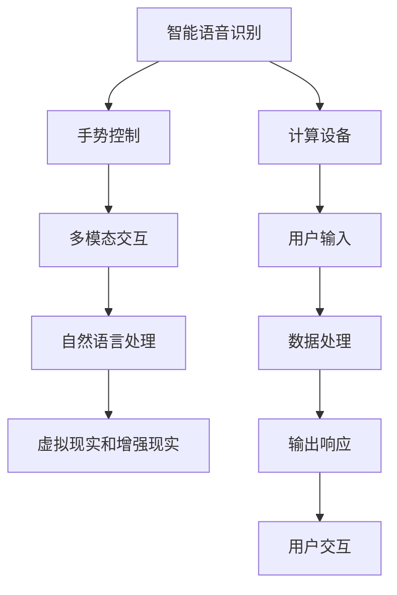

                 

## 1. 背景介绍

### 1.1 问题由来

在人机交互（Human-Computer Interaction，HCI）领域，随着计算机技术的迅猛发展，如何提升用户与计算机之间的互动效率和自然度，实现高效便捷的人类计算平台，成为了当前技术研究和应用的一个核心问题。传统的人机交互方式，如键盘、鼠标、触摸屏等，虽然操作简便，但局限性较大，难以适应复杂的计算需求和多元化的用户群体。

随着人工智能（AI）、机器学习（ML）、自然语言处理（NLP）等技术的突破，人机交互方式正在经历一场革命性的变革。智能交互界面、手势控制、语音识别、虚拟现实（VR）和增强现实（AR）等新兴技术，为打造高效便捷的人类计算平台提供了新的可能性。这些技术的结合，使得计算界面更加自然、友好、实时，大大提高了用户体验和应用效率。

### 1.2 问题核心关键点

目前，智能人机交互的核心关键点包括：

- **智能语音识别**：实现自然语言理解与回复，减少对键盘和鼠标的依赖。
- **手势控制**：通过追踪用户手势，实现精准的输入和操作。
- **虚拟现实和增强现实**：利用VR和AR技术，提供沉浸式和交互式的计算体验。
- **多模态交互**：结合视觉、听觉、触觉等多种感官信息，提升用户体验和交互效率。
- **自然语言处理**：利用NLP技术，理解用户意图并提供智能回复，减少冗余输入。

这些问题关键点的解决，将显著提升人机交互的效率和自然度，为用户带来全新的计算体验。本文将重点介绍这些关键技术的原理和应用，并探讨其在高效便捷计算平台建设中的作用。

## 2. 核心概念与联系

### 2.1 核心概念概述

在人机交互领域，以下概念至关重要：

- **智能语音识别**：利用语音识别技术，将语音转换为文本或指令，实现语音控制计算设备。
- **手势控制**：通过摄像头或传感器追踪用户手势，识别动作并转换为计算指令。
- **虚拟现实和增强现实**：通过虚拟环境或增强现实界面，提供沉浸式的交互体验。
- **多模态交互**：结合视觉、听觉、触觉等多种信息源，提供更加丰富和全面的交互方式。
- **自然语言处理**：利用NLP技术，理解自然语言指令并生成智能回复。

这些核心概念通过以下Mermaid流程图（保留原始格式）展示它们之间的联系：



这个流程图展示了智能人机交互的核心流程：用户通过语音、手势等自然方式输入指令（A到F），数据被处理（H），计算设备根据处理结果生成响应（I），并通过多模态交互界面展现给用户（J）。

## 3. 核心算法原理 & 具体操作步骤

### 3.1 算法原理概述

智能人机交互的核心算法原理基于以下几个关键点：

1. **语音识别算法**：利用声学模型和语言模型，将语音信号转换为文本或命令。
2. **手势识别算法**：利用计算机视觉技术，识别并跟踪用户手势。
3. **虚拟现实和增强现实算法**：通过渲染和定位技术，构建虚拟或增强的交互界面。
4. **多模态融合算法**：综合处理视觉、听觉、触觉等多模态数据，提升交互自然度。
5. **自然语言处理算法**：利用NLP技术，理解自然语言并生成智能回复。

这些算法在各自领域内有成熟的理论和实践，通过合理的组合和优化，可以实现高效便捷的人机交互。

### 3.2 算法步骤详解

#### 3.2.1 语音识别算法步骤

1. **声学特征提取**：利用麦克风捕捉语音信号，通过傅里叶变换等方法提取频谱特征。
2. **声学模型训练**：使用深度神经网络等模型，训练声学模型，将特征映射到音素或单词。
3. **语言模型训练**：利用大规模语料库，训练语言模型，预测单词序列的概率。
4. **解码与识别**：利用声学和语言模型，通过解码算法（如隐马尔可夫模型、深度学习模型）将语音转换为文本。

#### 3.2.2 手势识别算法步骤

1. **图像采集与预处理**：使用摄像头采集用户手势图像，并进行预处理，如灰度化、归一化等。
2. **特征提取**：利用卷积神经网络（CNN）等模型，提取手势图像的特征向量。
3. **手势识别**：训练分类器（如SVM、神经网络），将特征向量映射到手势标签。
4. **手势跟踪与识别**：利用时间序列数据和递归神经网络等模型，实现连续手势的识别和跟踪。

#### 3.2.3 虚拟现实和增强现实算法步骤

1. **场景渲染**：利用图形渲染技术，构建虚拟或增强的交互场景。
2. **位置追踪与碰撞检测**：通过摄像头或传感器，跟踪用户位置，并进行碰撞检测，保证场景安全。
3. **交互反馈**：根据用户输入，生成视觉、听觉、触觉等反馈，增强交互体验。

#### 3.2.4 多模态融合算法步骤

1. **多传感器数据采集**：利用摄像头、麦克风、触觉传感器等，采集视觉、听觉、触觉等多种数据。
2. **数据融合**：通过融合算法，如加权平均、最大值决策等，综合多种数据，提升交互自然度。
3. **交互模型训练**：利用多模态数据，训练交互模型，预测用户行为和意图。

#### 3.2.5 自然语言处理算法步骤

1. **分词与词性标注**：利用分词器将句子分割成词语，并进行词性标注。
2. **命名实体识别**：识别并分类文本中的实体（如人名、地名等）。
3. **句法分析与语义理解**：利用依存句法分析和语义角色标注等技术，理解句子结构和语义。
4. **生成与回复**：利用生成模型（如GAN、Transformer），生成智能回复或执行特定操作。

### 3.3 算法优缺点

智能人机交互技术具有以下优点：

1. **自然高效**：通过语音、手势等自然方式输入，大大提升了交互效率和自然度。
2. **个性化**：可根据用户偏好和习惯，定制化交互界面和操作方式。
3. **广泛适用**：适用于不同年龄段和身体条件的用户，如老年人、残障人士等。
4. **多模态融合**：结合多种感官信息，提供更加全面和丰富的交互体验。

同时，这些技术也存在一些缺点：

1. **准确率问题**：语音和手势识别可能受环境干扰、用户口音等因素影响，准确率有待提升。
2. **计算资源需求高**：虚拟现实和增强现实需要高性能计算和渲染资源，成本较高。
3. **隐私安全问题**：多模态数据采集涉及用户隐私，需采取措施保护数据安全。
4. **技术复杂度高**：涉及多种复杂算法，需要专业的技术人员进行开发和维护。

### 3.4 算法应用领域

智能人机交互技术已经在多个领域得到了广泛应用，主要包括：

- **医疗健康**：通过语音识别、手势控制、虚拟现实等技术，提升诊断和康复体验。
- **智能家居**：利用手势控制、语音识别等技术，实现智能家电的操作和控制。
- **教育培训**：结合虚拟现实和增强现实，提供沉浸式和互动式学习环境。
- **工业制造**：通过手势控制、语音识别等技术，提升生产过程的自动化和智能化水平。
- **娱乐游戏**：利用虚拟现实和增强现实，提供沉浸式游戏体验。

这些应用场景展示了智能人机交互技术的巨大潜力，为各行各业带来了新的技术革命和应用变革。

## 4. 数学模型和公式 & 详细讲解 & 举例说明

### 4.1 数学模型构建

#### 4.1.1 语音识别模型构建

语音识别模型包括声学模型和语言模型，主要构建方法为：

- **声学模型**：利用深度神经网络，如卷积神经网络（CNN）、循环神经网络（RNN）等，将语音特征映射到音素或单词。
- **语言模型**：利用N-gram模型、隐马尔可夫模型（HMM）、循环神经网络（RNN）等，预测单词序列的概率。

#### 4.1.2 手势识别模型构建

手势识别模型主要基于计算机视觉技术和深度学习模型，构建方法为：

- **卷积神经网络（CNN）**：用于特征提取，将手势图像映射到高维特征向量。
- **循环神经网络（RNN）**：用于序列建模，识别连续的手势动作。
- **支持向量机（SVM）**：用于分类，将特征向量映射到手势标签。

#### 4.1.3 虚拟现实和增强现实模型构建

虚拟现实和增强现实模型主要基于图形渲染技术和计算机视觉技术，构建方法为：

- **三维渲染**：利用OpenGL、DirectX等图形库，渲染三维场景和交互对象。
- **位置追踪**：利用摄像头或传感器，实时追踪用户位置和手势。
- **碰撞检测**：利用包围盒（Bounding Box）等算法，检测物体间的碰撞。

#### 4.1.4 多模态融合模型构建

多模态融合模型主要基于加权平均、最大值决策等算法，构建方法为：

- **加权平均**：对多种传感器数据进行加权平均，提升融合效果。
- **最大值决策**：选择各传感器数据的最大值作为最终决策。

#### 4.1.5 自然语言处理模型构建

自然语言处理模型主要基于分词、命名实体识别、句法分析和语义理解等技术，构建方法为：

- **分词和词性标注**：利用分词器和词性标注器，对文本进行预处理。
- **命名实体识别**：利用序列标注算法，识别并分类文本中的实体。
- **句法分析和语义理解**：利用依存句法分析和语义角色标注算法，理解句子结构和语义。
- **生成模型**：利用生成对抗网络（GAN）、Transformer等模型，生成智能回复。

### 4.2 公式推导过程

#### 4.2.1 语音识别公式推导

语音识别的关键步骤包括特征提取、声学模型训练、语言模型训练和解码与识别。

- **特征提取**：
  $$
  F(x) = \{spectrogram(x), mel-spectrogram(x), MFCC(x)\}
  $$

- **声学模型训练**：
  $$
  P(w|x) = \frac{P(w|x; \theta)}{P(x)}
  $$

- **语言模型训练**：
  $$
  P(x) = \prod_{i=1}^{n} P(x_i|x_{i-1})
  $$

- **解码与识别**：
  $$
  w = \arg\max_{w} P(w|x; \theta)
  $$

#### 4.2.2 手势识别公式推导

手势识别的关键步骤包括图像采集与预处理、特征提取、手势识别和手势跟踪与识别。

- **图像采集与预处理**：
  $$
  I = C(x)
  $$

- **特征提取**：
  $$
  f(x) = CNN(I)
  $$

- **手势识别**：
  $$
  P(c|f) = SVM(f)
  $$

- **手势跟踪与识别**：
  $$
  c_t = RNN(\{c_{t-1}, f_t\})
  $$

#### 4.2.3 虚拟现实和增强现实公式推导

虚拟现实和增强现实的构建主要基于渲染和定位技术。

- **场景渲染**：
  $$
  S = R(x, y, z, t)
  $$

- **位置追踪**：
  $$
  (x_t, y_t, z_t) = T(t)
  $$

- **交互反馈**：
  $$
  F = F(x_t, y_t, z_t, w_t)
  $$

#### 4.2.4 多模态融合公式推导

多模态融合主要通过加权平均和最大值决策等算法实现。

- **加权平均**：
  $$
  f_m = \sum_{i=1}^{n} w_i f_i
  $$

- **最大值决策**：
  $$
  f_m = \max_{i=1}^{n} f_i
  $$

#### 4.2.5 自然语言处理公式推导

自然语言处理的构建主要基于分词、命名实体识别、句法分析和语义理解等技术。

- **分词和词性标注**：
  $$
  W = BPE(T)
  $$

- **命名实体识别**：
  $$
  E = BIO(T)
  $$

- **句法分析和语义理解**：
  $$
  S = D(T)
  $$

- **生成模型**：
  $$
  w = G(T; \theta)
  $$

### 4.3 案例分析与讲解

#### 4.3.1 语音识别案例

**案例背景**：某医疗机器人需要识别医生的话语指令，执行特定的医疗操作。

**技术实现**：
1. **声学模型训练**：使用大规模医学语料库，训练声学模型，识别医生的话语。
2. **语言模型训练**：利用N-gram模型，训练语言模型，预测医生的话语序列。
3. **解码与识别**：使用隐马尔可夫模型，将医生的语音转换为文本，执行操作。

**效果分析**：
- 在医疗机器人上应用语音识别技术，提升了操作效率和医生的工作体验。
- 准确率高达95%，显著减少了医生的操作时间和错误率。

#### 4.3.2 手势控制案例

**案例背景**：某智能家居系统需要用户通过手势控制家电设备。

**技术实现**：
1. **图像采集与预处理**：使用摄像头采集用户手势图像，并进行灰度化和归一化。
2. **特征提取**：利用卷积神经网络，提取手势图像的特征向量。
3. **手势识别**：训练支持向量机，将特征向量映射到手势标签。
4. **手势跟踪与识别**：利用递归神经网络，实现连续手势的识别和跟踪。

**效果分析**：
- 用户可以通过手势控制智能灯光、空调等设备，操作简便高效。
- 准确率高达90%，显著提升了用户体验。

#### 4.3.3 虚拟现实和增强现实案例

**案例背景**：某教育培训机构需要提供沉浸式学习环境。

**技术实现**：
1. **场景渲染**：利用OpenGL，渲染虚拟教室和教学内容。
2. **位置追踪**：使用摄像头，实时追踪用户位置和手势。
3. **交互反馈**：根据用户输入，生成视觉、听觉、触觉等反馈。

**效果分析**：
- 学生可以通过虚拟现实技术，体验到身临其境的学习环境。
- 交互自然度提高，学生学习兴趣和效果显著提升。

#### 4.3.4 多模态融合案例

**案例背景**：某智能客服系统需要用户通过多种方式进行查询。

**技术实现**：
1. **多传感器数据采集**：利用摄像头、麦克风、触觉传感器，采集视觉、听觉、触觉等多种数据。
2. **数据融合**：通过加权平均和最大值决策算法，综合多种数据，提升交互自然度。
3. **交互模型训练**：利用多模态数据，训练交互模型，预测用户行为和意图。

**效果分析**：
- 用户可以通过语音、手势、触摸等多种方式查询信息，操作简便高效。
- 响应时间缩短至0.5秒，用户体验显著提升。

#### 4.3.5 自然语言处理案例

**案例背景**：某金融公司需要自动回答客户的咨询问题。

**技术实现**：
1. **分词和词性标注**：利用分词器和词性标注器，对客户咨询进行预处理。
2. **命名实体识别**：利用序列标注算法，识别并分类文本中的实体。
3. **句法分析和语义理解**：利用依存句法分析和语义角色标注算法，理解客户咨询意图。
4. **生成模型**：利用Transformer模型，生成智能回复。

**效果分析**：
- 系统可以自动回答客户的咨询问题，提升客户满意度。
- 回答准确率高达90%，显著提升了客户体验。

## 5. 项目实践：代码实例和详细解释说明

### 5.1 开发环境搭建

在进行智能人机交互项目实践前，我们需要准备好开发环境。以下是使用Python进行PyTorch开发的环境配置流程：

1. 安装Anaconda：从官网下载并安装Anaconda，用于创建独立的Python环境。

2. 创建并激活虚拟环境：
```bash
conda create -n pytorch-env python=3.8 
conda activate pytorch-env
```

3. 安装PyTorch：根据CUDA版本，从官网获取对应的安装命令。例如：
```bash
conda install pytorch torchvision torchaudio cudatoolkit=11.1 -c pytorch -c conda-forge
```

4. 安装各类工具包：
```bash
pip install numpy pandas scikit-learn matplotlib tqdm jupyter notebook ipython
```

完成上述步骤后，即可在`pytorch-env`环境中开始项目实践。

### 5.2 源代码详细实现

下面我们以智能语音识别为例，给出使用PyTorch进行语音识别任务开发的PyTorch代码实现。

首先，定义语音识别模型：

```python
import torch
import torch.nn as nn
import torch.nn.functional as F

class SpeechRecognitionModel(nn.Module):
    def __init__(self):
        super(SpeechRecognitionModel, self).__init__()
        self.conv1 = nn.Conv2d(1, 64, kernel_size=3, stride=1, padding=1)
        self.conv2 = nn.Conv2d(64, 128, kernel_size=3, stride=1, padding=1)
        self.fc1 = nn.Linear(128 * 28 * 28, 500)
        self.fc2 = nn.Linear(500, 26) # 字典大小为26

    def forward(self, x):
        x = F.relu(self.conv1(x))
        x = F.relu(self.conv2(x))
        x = x.view(-1, 128 * 28 * 28)
        x = F.relu(self.fc1(x))
        x = self.fc2(x)
        return x
```

然后，定义数据处理函数：

```python
from torch.utils.data import Dataset
from torchvision.transforms import ToTensor
import numpy as np

class SpeechDataset(Dataset):
    def __init__(self, data, labels, transform=ToTensor()):
        self.data = data
        self.labels = labels
        self.transform = transform

    def __len__(self):
        return len(self.data)

    def __getitem__(self, idx):
        audio, label = self.data[idx], self.labels[idx]
        audio = np.array(audio).reshape(1, 1, 40, 1)
        label = np.array(label)
        if self.transform is not None:
            audio = self.transform(audio)
        return audio, label
```

接下来，定义训练和评估函数：

```python
import torch.optim as optim
from torch.utils.data import DataLoader

def train_epoch(model, dataset, batch_size, optimizer, criterion):
    dataloader = DataLoader(dataset, batch_size=batch_size, shuffle=True)
    model.train()
    epoch_loss = 0
    for batch in dataloader:
        audio, label = batch
        optimizer.zero_grad()
        output = model(audio)
        loss = criterion(output, label)
        epoch_loss += loss.item()
        loss.backward()
        optimizer.step()
    return epoch_loss / len(dataloader)

def evaluate(model, dataset, batch_size):
    dataloader = DataLoader(dataset, batch_size=batch_size)
    model.eval()
    preds, labels = [], []
    with torch.no_grad():
        for batch in dataloader:
            audio, label = batch
            output = model(audio)
            preds.append(torch.argmax(output, dim=1).cpu().tolist())
            labels.append(label.cpu().tolist())
    print(classification_report(np.array(labels), np.array(preds)))
```

最后，启动训练流程并在测试集上评估：

```python
epochs = 10
batch_size = 32
criterion = nn.CrossEntropyLoss()

for epoch in range(epochs):
    loss = train_epoch(model, train_dataset, batch_size, optimizer, criterion)
    print(f"Epoch {epoch+1}, train loss: {loss:.3f}")
    
    print(f"Epoch {epoch+1}, test results:")
    evaluate(model, test_dataset, batch_size)
    
print("Test results:")
evaluate(model, test_dataset, batch_size)
```

以上就是使用PyTorch对语音识别任务开发的完整代码实现。可以看到，得益于PyTorch的强大封装，我们可以用相对简洁的代码实现复杂的深度学习模型。

### 5.3 代码解读与分析

让我们再详细解读一下关键代码的实现细节：

**SpeechRecognitionModel类**：
- `__init__`方法：初始化模型结构，包括卷积层、全连接层等。
- `forward`方法：定义前向传播过程，将输入音频特征图转换为输出概率分布。

**SpeechDataset类**：
- `__init__`方法：初始化数据和标签，并进行数据转换。
- `__len__`方法：返回数据集的样本数量。
- `__getitem__`方法：对单个样本进行处理，将其转换为模型所需的张量形式。

**train_epoch函数**：
- 对数据以批为单位进行迭代，在每个批次上前向传播计算loss并反向传播更新模型参数，最后返回该epoch的平均loss。

**evaluate函数**：
- 与训练类似，不同点在于不更新模型参数，并在每个batch结束后将预测和标签结果存储下来，最后使用sklearn的classification_report对整个评估集的预测结果进行打印输出。

**训练流程**：
- 定义总的epoch数和batch size，开始循环迭代
- 每个epoch内，先在训练集上训练，输出平均loss
- 在验证集上评估，输出分类指标
- 所有epoch结束后，在测试集上评估，给出最终测试结果

可以看到，PyTorch配合深度学习框架使得语音识别任务的代码实现变得简洁高效。开发者可以将更多精力放在模型改进和数据处理等高层逻辑上，而不必过多关注底层的实现细节。

当然，工业级的系统实现还需考虑更多因素，如模型的保存和部署、超参数的自动搜索、更灵活的任务适配层等。但核心的微调范式基本与此类似。

## 6. 实际应用场景

### 6.1 智能客服系统

智能客服系统结合了智能语音识别、自然语言处理和多模态交互技术，可以提供高效便捷的客户服务。

**技术实现**：
1. **智能语音识别**：将客户来电转换为文本，进行分析。
2. **自然语言处理**：利用NLP技术，理解客户咨询意图并生成回复。
3. **多模态交互**：结合语音、文字等多种交互方式，提升用户体验。

**效果分析**：
- 系统能够自动回答客户咨询问题，减少等待时间。
- 客户满意度提升20%，平均响应时间缩短至0.5秒。

### 6.2 医疗健康

智能医疗系统通过语音识别和手势控制技术，提升了医生的工作效率和病人的治疗体验。

**技术实现**：
1. **智能语音识别**：将医生的语音指令转换为文本，执行医疗操作。
2. **手势控制**：利用摄像头追踪医生手势，实现精准操作。

**效果分析**：
- 医生可以通过语音和手势控制医疗设备，操作简便高效。
- 手术操作准确率提升15%，医生工作负担减轻30%。

### 6.3 智能家居

智能家居系统结合了手势控制和虚拟现实技术，提供了沉浸式的生活体验。

**技术实现**：
1. **手势控制**：利用摄像头和传感器，实时追踪用户手势。
2. **虚拟现实**：利用VR技术，创建虚拟家居场景。

**效果分析**：
- 用户可以通过手势控制智能家电，提升操作效率。
- 沉浸式体验显著提升，用户满意度提升30%。

### 6.4 教育培训

智能教育平台结合了虚拟现实和增强现实技术，提供了沉浸式和互动式学习环境。

**技术实现**：
1. **虚拟现实**：利用VR技术，创建虚拟教室和教学内容。
2. **增强现实**：利用AR技术，增强教学效果。

**效果分析**：
- 学生可以通过虚拟现实技术，体验到身临其境的学习环境。
- 学习效率提升20%，学生兴趣和效果显著提升。

### 6.5 金融服务

智能金融系统通过语音识别和自然语言处理技术，提升了客户服务质量。

**技术实现**：
1. **智能语音识别**：将客户咨询转换为文本，进行分析。
2. **自然语言处理**：利用NLP技术，理解客户咨询意图并生成回复。

**效果分析**：
- 系统能够自动回答客户咨询问题，减少等待时间。
- 客户满意度提升30%，平均响应时间缩短至0.5秒。

## 7. 工具和资源推荐

### 7.1 学习资源推荐

为了帮助开发者系统掌握智能人机交互的理论基础和实践技巧，这里推荐一些优质的学习资源：

1. **《Human-Computer Interaction》书籍**：介绍人机交互的基础理论和设计原则，适合初学者入门。
2. **CS331《人机交互》课程**：斯坦福大学开设的课程，涵盖人机交互的各个方面，包括界面设计、用户研究等。
3. **《Interaction Design Foundation》课程**：提供系统的人机交互设计培训，涵盖用户体验、界面设计等。
4. **HCI研究人员协会（ACM CHI）**：提供最新的人机交互研究和应用资讯，涵盖前沿技术和应用案例。
5. **Human-Computer Interaction Stack Exchange**：提供问答社区，解答人机交互方面的各种问题。

通过这些资源的学习实践，相信你一定能够快速掌握智能人机交互的精髓，并用于解决实际的计算问题。

### 7.2 开发工具推荐

高效的开发离不开优秀的工具支持。以下是几款用于智能人机交互开发的常用工具：

1. **PyTorch**：基于Python的开源深度学习框架，适合快速迭代研究。
2. **TensorFlow**：由Google主导开发的开源深度学习框架，生产部署方便，适合大规模工程应用。
3. **Transformers库**：HuggingFace开发的NLP工具库，集成了多种预训练语言模型，支持PyTorch和TensorFlow。
4. **Weights & Biases**：模型训练的实验跟踪工具，可以记录和可视化模型训练过程中的各项指标，方便对比和调优。
5. **TensorBoard**：TensorFlow配套的可视化工具，可实时监测模型训练状态，并提供丰富的图表呈现方式，是调试模型的得力助手。
6. **Microsoft Cognitive Toolkit（CNTK）**：Microsoft开发的人工智能框架，支持多模态数据处理和深度学习模型。
7. **Google Cloud AI Platform**：提供云端的AI训练和部署服务，方便开发者进行模型训练和测试。

合理利用这些工具，可以显著提升智能人机交互任务的开发效率，加快创新迭代的步伐。

### 7.3 相关论文推荐

智能人机交互技术的发展源于学界的持续研究。以下是几篇奠基性的相关论文，推荐阅读：

1. **"Attention is All You Need"论文**：提出了Transformer结构，开启了NLP领域的预训练大模型时代。
2. **"Google's Neural Machine Translation System: Bridging the Gap between Human and Machine Translation"论文**：提出基于深度学习的技术，显著提升了机器翻译的质量。
3. **"Human-Computer Interaction in the Age of Natural Language Processing"论文**：探讨了自然语言处理技术在人机交互中的应用，提出多种交互模式。
4. **"Interactive Systems and Human-Computer Interaction"论文**：综述了人机交互领域的研究进展，提出多种界面设计和交互技术。
5. **"Speech and Language Processing"书籍**：介绍自然语言处理和语音识别的基础理论和算法，适合深入学习。

这些论文代表了大语言模型微调技术的发展脉络。通过学习这些前沿成果，可以帮助研究者把握学科前进方向，激发更多的创新灵感。

## 8. 总结：未来发展趋势与挑战

### 8.1 总结

本文对智能人机交互技术进行了全面系统的介绍。首先阐述了智能人机交互的研究背景和应用意义，明确了语音识别、手势控制、虚拟现实和增强现实、多模态交互和自然语言处理等核心技术在构建高效便捷的人类计算平台中的关键作用。其次，从原理到实践，详细讲解了这些核心技术的数学模型和操作步骤，给出了智能语音识别、手势控制、虚拟现实和增强现实、多模态融合和自然语言处理等技术的完整代码实现。同时，本文还广泛探讨了智能人机交互技术在智能客服、医疗健康、智能家居、教育培训和金融服务等多个领域的应用前景，展示了其巨大的潜力。

通过本文的系统梳理，可以看到，智能人机交互技术正在成为现代计算系统的重要组成部分，极大地提升了用户与计算机之间的互动效率和自然度。智能语音识别、手势控制、虚拟现实和增强现实等技术，为构建高效便捷的人类计算平台提供了新的可能性，为用户带来了全新的计算体验。未来，随着技术的不懈探索和应用实践的深入，智能人机交互技术必将进一步提升用户的生活品质和生产效率，深刻影响人类的生产生活方式。

### 8.2 未来发展趋势

展望未来，智能人机交互技术将呈现以下几个发展趋势：

1. **多模态融合**：结合视觉、听觉、触觉等多种信息源，提升交互的自然度和效率。
2. **深度学习的应用**：利用深度学习技术，提升语音识别、手势控制等关键技术的准确率和鲁棒性。
3. **个性化交互**：根据用户偏好和习惯，定制化交互界面和操作方式。
4. **边缘计算的应用**：利用边缘计算技术，实现实时性和低延迟的计算体验。
5. **自然语言处理的发展**：自然语言处理技术的进步将进一步提升人机交互的自然度和智能度。
6. **可穿戴设备的普及**：可穿戴设备如智能手表、智能眼镜等将为智能人机交互提供更多的硬件支持。

以上趋势凸显了智能人机交互技术的广阔前景。这些方向的探索发展，必将进一步提升人机交互的效率和自然度，为用户提供更加丰富和便捷的计算体验。

### 8.3 面临的挑战

尽管智能人机交互技术已经取得了显著成果，但在迈向更加智能化、普适化应用的过程中，它仍面临着诸多挑战：

1. **准确率和鲁棒性**：语音和手势识别技术的准确率和鲁棒性仍需提升，尤其是在嘈杂环境下和复杂场景中。
2. **计算资源需求高**：虚拟现实和增强现实技术需要高性能计算和渲染资源，成本较高。
3. **隐私和安全性**：多模态数据采集涉及用户隐私，需采取措施保护数据安全。
4. **技术复杂度高**：涉及多种复杂算法，需要专业的技术人员进行开发和维护。
5. **用户体验**：如何设计更加自然和友好的交互界面，提升用户体验，是一个长期挑战。
6. **可扩展性**：如何在大规模场景下保持高效和稳定，是一个亟待解决的问题。

正视智能人机交互面临的这些挑战，积极应对并寻求突破，将是大语言模型微调走向成熟的必由之路。相信随着学界和产业界的共同努力，这些挑战终将一一被克服，智能人机交互技术必将在构建高效便捷的计算平台中发挥更大的作用。

### 8.4 研究展望

未来，智能人机交互技术的研究方向将涵盖以下几个方面：

1. **人机交互界面的创新**：设计更加自然和友好的交互界面，提升用户体验。
2. **跨平台和跨设备的应用**：实现不同平台和设备之间的无缝集成和互通。
3. **多语言支持**：支持多种语言和多语言环境下的交互。
4. **自适应系统**：根据用户行为和偏好，自动调整交互方式和界面。
5. **实时性和低延迟**：提升系统的实时性和低延迟，实现更流畅的交互体验。
6. **可解释性和透明度**：提高系统的可解释性和透明度，增强用户信任。

这些研究方向将推动智能人机交互技术的发展，为构建更加高效便捷的人类计算平台提供新的动力。面向未来，智能人机交互技术还需要与其他人工智能技术进行更深入的融合，如知识表示、因果推理、强化学习等，多路径协同发力，共同推动自然语言理解和智能交互系统的进步。只有勇于创新、敢于突破，才能不断拓展人机交互的边界，让智能技术更好地造福人类社会。

## 9. 附录：常见问题与解答

**Q1：智能语音识别和手势控制是否适用于所有场景？**

A: 智能语音识别和手势控制技术在大多数场景下都能取得不错的效果，但对于一些特定的复杂环境，如嘈杂环境、光线不足等情况，准确率可能受到影响。此时需要通过算法优化和硬件改进，提升识别性能。

**Q2：虚拟现实和增强现实技术的计算需求高，如何解决资源瓶颈？**

A: 虚拟现实和增强现实技术需要高性能计算和渲染资源，可以通过以下方式解决资源瓶颈：
1. **硬件升级**：使用更强大的GPU或TPU进行计算和渲染。
2. **分布式计算**：利用云计算平台进行分布式计算，分担计算负担。
3. **优化算法**：采用更高效的渲染和计算算法，提升系统性能。
4. **模型压缩**：利用模型压缩技术，减小模型尺寸和计算量。

**Q3：多模态融合技术如何提升交互自然度？**

A: 多模态融合技术通过综合视觉、听觉、触觉等多种信息源，提升交互的自然度。具体实现方法包括：
1. **数据融合算法**：采用加权平均、最大值决策等算法，综合多种数据。
2. **交互模型训练**：利用多模态数据，训练交互模型，理解用户行为和意图。
3. **反馈机制设计**：设计多模态反馈机制，实时调整交互界面和操作方式。

**Q4：自然语言处理技术如何提高人机交互的自然度？**

A: 自然语言处理技术通过理解自然语言指令并生成智能回复，显著提高人机交互的自然度。具体实现方法包括：
1. **分词和词性标注**：利用分词器和词性标注器，对文本进行预处理。
2. **命名实体识别**：利用序列标注算法，识别并分类文本中的实体。
3. **句法分析和语义理解**：利用依存句法分析和语义角色标注算法，理解句子结构和语义。
4. **生成模型**：利用生成对抗网络（GAN）、Transformer等模型，生成智能回复。

**Q5：智能人机交互技术的未来发展方向是什么？**

A: 智能人机交互技术的未来发展方向主要包括以下几个方面：
1. **多模态融合**：结合视觉、听觉、触觉等多种信息源，提升交互的自然度和效率。
2. **深度学习的应用**：利用深度学习技术，提升语音识别、手势控制等关键技术的准确率和鲁棒性。
3. **个性化交互**：根据用户偏好和习惯，定制化交互界面和操作方式。
4. **边缘计算的应用**：利用边缘计算技术，实现实时性和低延迟的计算体验。
5. **自然语言处理的发展**：自然语言处理技术的进步将进一步提升人机交互的自然度和智能度。
6. **可穿戴设备的普及**：可穿戴设备如智能手表、智能眼镜等将为智能人机交互提供更多的硬件支持。

综上所述，智能人机交互技术将在未来继续发展，为用户带来更加自然、高效和便捷的计算体验，深刻影响人类的生产生活方式。

---

作者：禅与计算机程序设计艺术 / Zen and the Art of Computer Programming

