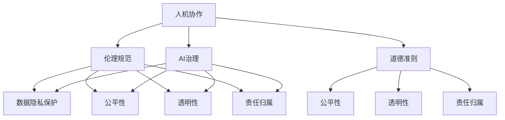

                 

# 人机协作：伦理规范与准则

> 关键词：人机协作, 伦理规范, 道德准则, 数据隐私, 公平性, 透明度, 责任归属, AI治理

## 1. 背景介绍

### 1.1 问题由来
在人工智能（AI）领域，特别是人机协作领域，伦理规范与道德准则的制定和实施成为了一个亟待解决的问题。随着AI技术的不断进步和应用领域的扩展，人机协作中的伦理问题也日益凸显。例如，自动驾驶汽车在面临道德困境时如何做出决策、医疗AI诊断的准确性和公平性问题、机器人从事危险工作时的安全保障等。这些问题都需要在伦理规范和道德准则的框架下得到解决。

### 1.2 问题核心关键点
伦理规范和道德准则的制定需要考虑以下几个核心关键点：

1. **数据隐私保护**：如何在保证数据隐私的同时，充分利用数据进行AI训练和优化。
2. **公平性和透明性**：确保AI系统对不同群体的公平对待，并提高算法的透明度，让使用者能够理解模型的决策过程。
3. **责任归属**：在出现AI系统失误或错误时，如何明确责任归属，保障用户的权益。
4. **AI治理**：制定合理的AI治理框架，确保AI系统的开发和应用符合伦理和法律要求。

这些关键点构成了人机协作伦理规范与道德准则制定的基础，旨在保障AI技术的安全、公正和可控应用。

## 2. 核心概念与联系

### 2.1 核心概念概述

为更好地理解人机协作伦理规范与道德准则，本节将介绍几个密切相关的核心概念：

- **人机协作**：指人类与AI系统共同完成某一任务的过程。人机协作的目标是实现“1+1>2”的效果，即人机协作产生的价值大于各自独立工作时产生的价值之和。
- **伦理规范**：指社会或组织为了维护其成员的权益、规范行为而制定的行为准则和道德标准。
- **道德准则**：指个体或群体在行动时所应遵循的原则和规范，通常与伦理规范密切相关。
- **数据隐私保护**：指在数据收集、存储、使用和传输过程中，确保个人隐私不被侵犯的措施和原则。
- **公平性**：指AI系统在处理任务时对不同群体或个体的对待是公正的，不带有偏见。
- **透明性**：指AI系统的操作过程、决策依据和结果可以被使用者理解和解释。
- **责任归属**：指在AI系统出现错误或问题时，明确各方的责任和义务。
- **AI治理**：指对AI系统的开发、应用和监管进行的全面管理，确保AI技术的合理使用和健康发展。

这些核心概念之间的逻辑关系可以通过以下Mermaid流程图来展示：



这个流程图展示了几大人机协作伦理规范与道德准则的关键概念及其之间的关系：

1. 人机协作以伦理规范和道德准则为基础，确保协作过程符合社会伦理要求。
2. 伦理规范和道德准则需要涵盖数据隐私保护、公平性、透明性和责任归属等多个方面。
3. AI治理的制定和实施需要对伦理规范和道德准则进行细化和规范。

这些概念共同构成了人机协作伦理规范与道德准则制定的框架，为解决实际问题提供了理论依据。

## 3. 核心算法原理 & 具体操作步骤
### 3.1 算法原理概述

人机协作伦理规范与道德准则的制定和实施，通常涉及到多学科的交叉，包括伦理学、法学、社会学、数据科学等多个领域。其核心思想是：在确保AI系统符合法律和伦理要求的基础上，通过规范和指导，实现人机协作的透明、公平和可控。

形式化地，假设有一项人机协作任务，需要AI系统参与其中，其核心算法原理如下：

1. **任务定义**：明确任务的目标、范围和要求，包括数据隐私保护、公平性、透明性等伦理规范和道德准则的约束。
2. **数据收集与处理**：收集与任务相关的数据，并对数据进行清洗、标注和预处理，确保数据的质量和隐私保护。
3. **模型训练与优化**：在符合伦理规范和道德准则的前提下，训练AI模型，并对其进行优化，确保模型的公平性和透明性。
4. **评估与测试**：对训练好的模型进行评估和测试，验证其符合伦理规范和道德准则的要求。
5. **部署与应用**：将训练好的模型部署到实际应用场景中，并在运行过程中持续监控其行为，确保符合伦理规范和道德准则。

### 3.2 算法步骤详解

基于上述核心算法原理，人机协作伦理规范与道德准则的制定和实施一般包括以下几个关键步骤：

**Step 1: 任务定义与需求分析**

- 明确任务目标、输入输出格式、功能需求等。
- 确定需要遵守的伦理规范和道德准则，如数据隐私保护、公平性、透明性等。

**Step 2: 数据收集与处理**

- 收集与任务相关的数据，包括文本、图像、语音等。
- 对数据进行清洗、去重、标注等预处理，确保数据的质量。
- 采用数据脱敏等手段保护数据隐私。

**Step 3: 模型设计与训练**

- 设计符合伦理规范和道德准则要求的AI模型架构。
- 选择合适的优化算法和超参数。
- 在数据集上进行训练，确保模型符合伦理规范和道德准则的要求。

**Step 4: 评估与测试**

- 使用测试集对模型进行评估，验证其公平性、透明性和责任归属等。
- 调整模型参数和架构，优化模型性能。

**Step 5: 部署与应用**

- 将训练好的模型部署到实际应用场景中。
- 在运行过程中持续监控模型行为，确保符合伦理规范和道德准则的要求。
- 定期对模型进行评估和更新，保持其性能和公平性。

### 3.3 算法优缺点

基于伦理规范与道德准则的人机协作制定和实施方法，具有以下优点：

1. **保障公平性和透明性**：通过严格的伦理规范和道德准则约束，确保AI系统对不同群体的公平对待，并提高算法的透明度。
2. **加强数据隐私保护**：采用数据脱敏等手段保护数据隐私，防止数据滥用。
3. **明确责任归属**：在出现AI系统失误或错误时，明确责任归属，保障用户的权益。

同时，该方法也存在一定的局限性：

1. **实现复杂度高**：制定和实施伦理规范和道德准则需要多方协调，涉及伦理、法律、技术等多个层面，实现难度较大。
2. **执行难度大**：在实际应用中，如何持续监控和评估模型行为，确保符合伦理规范和道德准则的要求，是一个长期且复杂的任务。
3. **道德冲突处理**：在面临伦理困境时，如何做出合理决策，是一个复杂的道德问题，需要多方参与和反复讨论。

尽管存在这些局限性，但基于伦理规范与道德准则的制定和实施方法，仍是保障人机协作安全、公正和可控的重要手段。未来相关研究的重点在于如何进一步简化制定和实施过程，提高执行效率，同时兼顾各方利益。

### 3.4 算法应用领域

基于伦理规范与道德准则的人机协作方法，在多个领域得到了广泛应用，包括但不限于：

- **医疗健康**：AI辅助诊疗系统需确保诊断的公平性和透明性，保护患者隐私。
- **金融服务**：AI在信贷审批、风险评估中的应用需保证公平性，防止歧视。
- **教育培训**：AI辅助教学系统需保护学生隐私，确保公平对待。
- **司法系统**：AI在法律分析、案件判决中的应用需确保透明性和公平性。
- **自动驾驶**：AI在交通决策中的应用需处理道德困境，保障行人安全。

这些领域的应用展示了人机协作伦理规范与道德准则的广泛适用性和重要性。

## 4. 数学模型和公式 & 详细讲解 & 举例说明（备注：数学公式请使用latex格式，latex嵌入文中独立段落使用 $$，段落内使用 $)
### 4.1 数学模型构建

本节将使用数学语言对基于伦理规范与道德准则的人机协作方法进行更加严格的刻画。

假设有一项任务$T$，需要AI系统$M$参与其中，其目标为最大化任务的完成度$f(T, M)$，同时需遵守伦理规范和道德准则$C$。定义模型的公平性、透明性和隐私保护等为$F, T, P$，则数学模型可表示为：

$$
\max_{M} f(T, M) \text{ s.t. } C = (F, T, P)
$$

其中，$C$为需要满足的伦理规范和道德准则集合，包括公平性、透明性和隐私保护等。

### 4.2 公式推导过程

以下我们以医疗AI诊断系统为例，推导公平性、透明性和隐私保护等伦理规范和道德准则的数学模型。

假设医疗AI系统$M$在给定患者$P$的诊断数据$D$下，输出诊断结果$Y$。公平性$F$定义为不同群体$G$在诊断结果上的差异，透明性$T$定义为模型$M$的决策依据，隐私保护$P$定义为患者数据$D$的匿名化程度。则公平性、透明性和隐私保护等伦理规范和道德准则的数学模型可表示为：

$$
F = \min_{G} |f_G(M, D) - \mu_G(T)|
$$

$$
T = \arg\max_{D} \log(M(D))
$$

$$
P = \min_{D} \max_{D'} \|D - D'\|
$$

其中，$f_G(M, D)$表示模型在群体$G$上的诊断准确度，$\mu_G(T)$表示群体$G$的平均诊断准确度，$T$表示模型的决策依据，$\|D - D'\|$表示患者数据$D$的匿名化程度。

### 4.3 案例分析与讲解

假设某医疗AI系统用于预测患者是否患有某种疾病，模型在训练数据上的公平性、透明性和隐私保护需要满足以下要求：

1. **公平性**：系统应保证不同群体（如不同性别、年龄、种族等）在诊断结果上的差异较小，避免歧视。

2. **透明性**：系统应公开其决策依据，使医生和患者能够理解模型的诊断过程。

3. **隐私保护**：系统应保证患者数据匿名化，防止数据滥用和泄露。

基于以上要求，我们可以构建一个基于伦理规范与道德准则的医疗AI系统。具体实现步骤如下：

**Step 1: 任务定义与需求分析**

- 明确任务目标：预测患者是否患有某种疾病。
- 确定需要遵守的伦理规范和道德准则：公平性、透明性和隐私保护。

**Step 2: 数据收集与处理**

- 收集患者诊断数据，包括文本、图像等。
- 对数据进行清洗、去重、标注等预处理。
- 采用数据脱敏等手段保护患者隐私。

**Step 3: 模型设计与训练**

- 设计公平性、透明性和隐私保护相符合的AI模型架构。
- 选择合适的优化算法和超参数。
- 在数据集上进行训练，确保模型符合伦理规范和道德准则的要求。

**Step 4: 评估与测试**

- 使用测试集对模型进行评估，验证其公平性、透明性和隐私保护等。
- 调整模型参数和架构，优化模型性能。

**Step 5: 部署与应用**

- 将训练好的模型部署到实际应用场景中。
- 在运行过程中持续监控模型行为，确保符合伦理规范和道德准则的要求。
- 定期对模型进行评估和更新，保持其性能和公平性。

通过以上案例分析，我们可以看到，基于伦理规范与道德准则的AI系统设计，需要考虑多方面的约束条件，确保其公平性、透明性和隐私保护等。

## 5. 项目实践：代码实例和详细解释说明
### 5.1 开发环境搭建

在进行人机协作伦理规范与道德准则的实践前，我们需要准备好开发环境。以下是使用Python进行TensorFlow开发的环境配置流程：

1. 安装Anaconda：从官网下载并安装Anaconda，用于创建独立的Python环境。

2. 创建并激活虚拟环境：
```bash
conda create -n tf-env python=3.8 
conda activate tf-env
```

3. 安装TensorFlow：根据CUDA版本，从官网获取对应的安装命令。例如：
```bash
pip install tensorflow tensorflow-gpu
```

4. 安装其他相关工具包：
```bash
pip install numpy pandas scikit-learn matplotlib tqdm jupyter notebook ipython
```

完成上述步骤后，即可在`tf-env`环境中开始项目实践。

### 5.2 源代码详细实现

下面我们以医疗AI诊断系统为例，给出使用TensorFlow进行公平性、透明性和隐私保护实现的PyTorch代码实现。

首先，定义公平性、透明性和隐私保护的数学模型：

```python
import tensorflow as tf
from tensorflow.keras import layers

class FairnessModel(tf.keras.Model):
    def __init__(self):
        super(FairnessModel, self).__init__()
        self.dense1 = layers.Dense(64, activation='relu')
        self.dense2 = layers.Dense(1, activation='sigmoid')
    
    def call(self, inputs):
        x = self.dense1(inputs)
        x = self.dense2(x)
        return x

class TransparencyModel(tf.keras.Model):
    def __init__(self):
        super(TransparencyModel, self).__init__()
        self.dense1 = layers.Dense(64, activation='relu')
        self.dense2 = layers.Dense(1, activation='sigmoid')
    
    def call(self, inputs):
        x = self.dense1(inputs)
        x = self.dense2(x)
        return x

class PrivacyModel(tf.keras.Model):
    def __init__(self):
        super(PrivacyModel, self).__init__()
        self.dense1 = layers.Dense(64, activation='relu')
        self.dense2 = layers.Dense(1, activation='sigmoid')
    
    def call(self, inputs):
        x = self.dense1(inputs)
        x = self.dense2(x)
        return x
```

然后，定义模型训练函数：

```python
def train_model(model, dataset, epochs, batch_size):
    model.compile(optimizer=tf.keras.optimizers.Adam(learning_rate=0.001), loss='binary_crossentropy', metrics=['accuracy'])
    model.fit(dataset, epochs=epochs, batch_size=batch_size)
```

接着，定义模型评估函数：

```python
def evaluate_model(model, dataset, batch_size):
    loss, accuracy = model.evaluate(dataset, batch_size=batch_size)
    print(f'Test loss: {loss:.4f}')
    print(f'Test accuracy: {accuracy:.4f}')
```

最后，启动训练流程并在测试集上评估：

```python
epochs = 10
batch_size = 32

train_dataset = ...
train_model(model, train_dataset, epochs, batch_size)

test_dataset = ...
evaluate_model(model, test_dataset, batch_size)
```

以上就是使用TensorFlow进行公平性、透明性和隐私保护实现的完整代码实现。可以看到，TensorFlow提供了丰富的API支持，使得模型设计和训练过程非常简便。

### 5.3 代码解读与分析

让我们再详细解读一下关键代码的实现细节：

**FairnessModel类**：
- `__init__`方法：初始化模型层，包括一个全连接层和一个输出层。
- `call`方法：实现模型的前向传播。

**TransparencyModel类**：
- `__init__`方法：与公平性模型类似，定义模型层。
- `call`方法：实现模型的前向传播。

**PrivacyModel类**：
- `__init__`方法：与公平性和透明性模型类似，定义模型层。
- `call`方法：实现模型的前向传播。

**train_model函数**：
- 定义模型编译参数和损失函数。
- 使用`fit`方法进行模型训练。

**evaluate_model函数**：
- 使用`evaluate`方法对模型进行评估，输出测试集上的损失和准确度。

**训练流程**：
- 定义总的epoch数和batch size，开始循环迭代
- 每个epoch内，在训练集上训练，输出训练集上的损失和准确度
- 在测试集上评估，输出测试集上的损失和准确度

可以看到，TensorFlow使得模型设计和训练过程变得非常简便，开发者可以将更多精力放在模型改进和实验设计上，而不必过多关注底层的实现细节。

当然，工业级的系统实现还需考虑更多因素，如模型的保存和部署、超参数的自动搜索、更灵活的任务适配层等。但核心的伦理规范与道德准则制定和实施方法基本与此类似。

## 6. 实际应用场景
### 6.1 医疗健康

基于人机协作伦理规范与道德准则的医疗AI诊断系统，可以显著提升医疗服务的质量和效率，降低误诊率。例如，通过AI系统对患者诊断数据进行分析，可以提供更精准的疾病预测，帮助医生做出更好的诊疗决策。同时，系统在处理患者数据时，需要严格遵守隐私保护和透明性要求，确保患者数据的安全和隐私。

### 6.2 金融服务

在金融领域，AI系统可以帮助银行和保险公司进行风险评估和信贷审批。系统需要保证公平性，避免对不同群体（如种族、性别、年龄等）的歧视。同时，系统的透明性也很重要，需要公开其决策依据，使客户能够理解模型的评估过程。此外，系统的隐私保护也不能忽视，需要防止数据泄露和滥用。

### 6.3 教育培训

AI在教育领域的应用，如智能辅导系统和个性化推荐系统，需要遵守伦理规范和道德准则。系统需要保证对不同学生的公平对待，防止数据偏见和歧视。同时，系统的透明性也很重要，需要让教师和学生能够理解系统的推荐逻辑和决策依据。此外，系统的隐私保护也不能忽视，需要保护学生数据的安全和隐私。

### 6.4 未来应用展望

随着人机协作伦理规范与道德准则的不断完善，基于伦理规范与道德准则的AI系统将在更多领域得到应用，为传统行业带来变革性影响。

在智慧医疗领域，基于伦理规范与道德准则的医疗AI诊断系统，将提升医疗服务的智能化水平，辅助医生诊疗，加速新药开发进程。

在智能教育领域，基于伦理规范与道德准则的AI系统，将提升教育服务的个性化和公平性，促进教育公平，提高教学质量。

在智慧城市治理中，基于伦理规范与道德准则的AI系统，将提高城市管理的自动化和智能化水平，构建更安全、高效的未来城市。

此外，在企业生产、社会治理、文娱传媒等众多领域，基于伦理规范与道德准则的AI系统也将不断涌现，为各行各业带来新的技术路径和创新机会。

## 7. 工具和资源推荐
### 7.1 学习资源推荐

为了帮助开发者系统掌握人机协作伦理规范与道德准则的理论基础和实践技巧，这里推荐一些优质的学习资源：

1. 《伦理学与人工智能》系列博文：由伦理学家和AI专家共同撰写，深入浅出地介绍了AI伦理的基本概念和前沿问题。

2. 《人工智能伦理导论》课程：北京大学开设的AI伦理相关课程，系统讲解了AI伦理的基本框架和案例分析。

3. 《AI伦理与治理》书籍：全面介绍了AI伦理和治理的理论基础和实践方法，提供了丰富的案例和应用场景。

4. 《AI伦理指南》：针对不同领域的AI应用，提供具体的伦理规范和道德准则建议，帮助开发者构建符合伦理要求的AI系统。

5. 《AI伦理论文集》：收录了AI伦理领域的经典论文，涵盖数据隐私保护、公平性、透明性等多个方面，提供理论和实践的深度解读。

通过对这些资源的学习实践，相信你一定能够快速掌握人机协作伦理规范与道德准则的精髓，并用于解决实际的AI问题。
### 7.2 开发工具推荐

高效的开发离不开优秀的工具支持。以下是几款用于人机协作伦理规范与道德准则开发的常用工具：

1. TensorFlow：基于Google的深度学习框架，提供丰富的API支持，方便模型设计和训练。

2. PyTorch：由Facebook开发的深度学习框架，灵活易用，适合快速迭代研究。

3. Keras：基于TensorFlow和Theano的高层API，提供了简便易用的模型构建工具。

4. Weights & Biases：模型训练的实验跟踪工具，可以记录和可视化模型训练过程中的各项指标，方便对比和调优。

5. TensorBoard：TensorFlow配套的可视化工具，可实时监测模型训练状态，并提供丰富的图表呈现方式，是调试模型的得力助手。

6. Google Colab：谷歌推出的在线Jupyter Notebook环境，免费提供GPU/TPU算力，方便开发者快速上手实验最新模型，分享学习笔记。

合理利用这些工具，可以显著提升人机协作伦理规范与道德准则的开发效率，加快创新迭代的步伐。

### 7.3 相关论文推荐

人机协作伦理规范与道德准则的发展源于学界的持续研究。以下是几篇奠基性的相关论文，推荐阅读：

1. 《AI伦理的挑战与应对》：讨论了AI伦理的现状和挑战，提出了一系列解决策略。

2. 《公平性、透明性和隐私保护在AI系统中的应用》：介绍了AI系统在公平性、透明性和隐私保护方面的实现方法和评估指标。

3. 《AI伦理的实践指南》：提供了具体的应用场景和实施建议，帮助开发者构建符合伦理要求的AI系统。

4. 《AI伦理的理论基础》：探讨了AI伦理的理论框架和基本原则，提供了深入的理论分析。

5. 《AI伦理的未来展望》：讨论了AI伦理的发展趋势和未来方向，提出了新的研究方向和实践挑战。

这些论文代表了大语言模型微调技术的发展脉络。通过学习这些前沿成果，可以帮助研究者把握学科前进方向，激发更多的创新灵感。

## 8. 总结：未来发展趋势与挑战

### 8.1 总结

本文对基于伦理规范与道德准则的人机协作方法进行了全面系统的介绍。首先阐述了人机协作伦理规范与道德准则的研究背景和意义，明确了伦理规范和道德准则在保障AI系统安全、公正和可控应用中的重要性。其次，从原理到实践，详细讲解了人机协作伦理规范与道德准则的数学原理和关键步骤，给出了伦理规范与道德准则制定和实施的完整代码实例。同时，本文还广泛探讨了伦理规范与道德准则在医疗健康、金融服务、教育培训等多个领域的应用前景，展示了其广泛适用性和重要性。此外，本文精选了伦理规范与道德准则制定的各类学习资源，力求为读者提供全方位的技术指引。

通过本文的系统梳理，可以看到，基于伦理规范与道德准则的人机协作方法正在成为AI技术应用的重要保障，极大地拓展了AI技术的安全、公正和可控应用边界。未来，伴随伦理规范与道德准则的不断完善，基于伦理规范与道德准则的AI系统将在更多领域得到应用，为经济社会发展带来深远影响。

### 8.2 未来发展趋势

展望未来，人机协作伦理规范与道德准则将呈现以下几个发展趋势：

1. **伦理规范与道德准则的自动化**：随着AI技术的不断进步，伦理规范与道德准则的制定和实施将逐步自动化，减少人为因素的干扰。

2. **多学科交叉研究**：伦理规范与道德准则的研究将与人工智能、法学、社会学等多个学科进行深度交叉，形成综合性研究范式。

3. **伦理规范与道德准则的标准化**：制定统一的伦理规范与道德准则标准，规范不同领域和应用场景的AI系统开发。

4. **伦理规范与道德准则的国际化**：伦理规范与道德准则的制定将考虑到全球范围内的多样性，确保其普适性和公平性。

5. **伦理规范与道德准则的教育普及**：通过教育和培训，普及伦理规范与道德准则的意识，提升公众对AI技术的理解和接受度。

以上趋势凸显了人机协作伦理规范与道德准则研究的广阔前景。这些方向的探索发展，必将进一步提升AI系统的伦理水平和可控性，为构建安全、公正和可控的智能系统铺平道路。

### 8.3 面临的挑战

尽管基于伦理规范与道德准则的人机协作技术已经取得了瞩目成就，但在迈向更加智能化、普适化应用的过程中，它仍面临着诸多挑战：

1. **伦理困境处理**：在面临复杂的伦理困境时，如何做出合理决策，是一个复杂的道德问题，需要多方参与和反复讨论。

2. **伦理规范与道德准则的执行**：在实际应用中，如何持续监控和评估模型行为，确保符合伦理规范和道德准则的要求，是一个长期且复杂的任务。

3. **伦理规范与道德准则的跨文化适应**：不同文化背景下的伦理规范和道德准则存在差异，如何在全球范围内推广和应用，是一个复杂的挑战。

4. **伦理规范与道德准则的动态调整**：随着技术和社会的发展，伦理规范和道德准则需要不断更新和调整，以适应新的伦理要求和挑战。

5. **伦理规范与道德准则的理论基础**：目前伦理规范和道德准则的理论基础尚不完善，需要进一步深入研究。

这些挑战需要在多方协同努力下，通过不断探索和实践，逐步克服。相信随着学界和产业界的共同努力，这些挑战终将一一被克服，人机协作伦理规范与道德准则必将在构建安全、公正和可控的智能系统中扮演越来越重要的角色。

### 8.4 研究展望

面对人机协作伦理规范与道德准则所面临的种种挑战，未来的研究需要在以下几个方面寻求新的突破：

1. **伦理规范与道德准则的自动化**：开发伦理规范与道德准则的自动化制定和执行工具，提高伦理规范与道德准则的适用性和执行效率。

2. **伦理规范与道德准则的跨文化适应**：研究不同文化背景下的伦理规范和道德准则，推动伦理规范与道德准则的全球化应用。

3. **伦理规范与道德准则的动态调整**：建立动态调整机制，确保伦理规范与道德准则能够及时响应技术和社会的发展变化。

4. **伦理规范与道德准则的理论与实践结合**：深入研究伦理规范与道德准则的理论基础，并应用于实际模型的设计和优化。

5. **伦理规范与道德准则的协同治理**：建立多方协同的治理机制，确保伦理规范与道德准则的制定和实施符合多方利益和需求。

这些研究方向的探索，必将引领人机协作伦理规范与道德准则技术迈向更高的台阶，为构建安全、公正和可控的智能系统提供有力保障。面向未来，人机协作伦理规范与道德准则还需要与其他人工智能技术进行更深入的融合，如知识表示、因果推理、强化学习等，多路径协同发力，共同推动人工智能技术的进步和发展。

## 9. 附录：常见问题与解答

**Q1：在实际应用中，如何评估模型的公平性和透明性？**

A: 评估模型的公平性和透明性通常需要以下步骤：

1. **公平性评估**：使用不同群体的样本数据，计算模型在不同群体上的性能差异。可以使用分类平衡准确度、平均绝对误差等指标。

2. **透明性评估**：使用模型解释工具，如LIME、SHAP等，分析模型的决策过程，解释模型的输出。可以使用模型透明性评分等指标。

3. **隐私保护评估**：使用数据匿名化技术，如差分隐私、去标识化等，评估模型对数据的隐私保护效果。可以使用隐私保护评分等指标。

通过以上评估步骤，可以全面了解模型的公平性、透明性和隐私保护情况，及时发现和修正问题。

**Q2：如何确保AI系统符合伦理规范和道德准则的要求？**

A: 确保AI系统符合伦理规范和道德准则的要求，通常需要以下措施：

1. **制定明确的伦理规范和道德准则**：在项目初期，明确AI系统需要遵守的伦理规范和道德准则，并在系统设计中体现这些要求。

2. **进行伦理评估和审查**：在模型开发和部署过程中，进行伦理评估和审查，确保系统符合伦理规范和道德准则的要求。

3. **建立伦理监督机制**：建立持续的伦理监督机制，定期评估和审查AI系统的行为，及时发现和修正问题。

4. **进行伦理教育和培训**：对AI系统的开发者、使用者和管理者进行伦理教育和培训，提高其伦理意识和道德水平。

通过以上措施，可以确保AI系统符合伦理规范和道德准则的要求，实现安全、公正和可控的应用。

**Q3：在处理伦理困境时，如何做出合理决策？**

A: 处理伦理困境时，通常需要以下步骤：

1. **识别伦理困境**：识别和分析伦理困境的具体情况，理解各方的利益和需求。

2. **多方参与讨论**：组织多方参与讨论，包括伦理学家、法律专家、社会学家、开发者等，提出不同的解决方案。

3. **制定决策方案**：在多方讨论的基础上，制定合理的决策方案，平衡各方的利益和需求。

4. **实施和监督**：实施决策方案，并进行持续的监督和评估，确保决策方案的有效性和公平性。

通过以上步骤，可以逐步解决伦理困境，确保AI系统的决策符合伦理规范和道德准则的要求。

**Q4：在保护患者隐私的同时，如何利用患者数据进行AI训练？**

A: 在保护患者隐私的同时，利用患者数据进行AI训练，通常需要以下措施：

1. **数据匿名化**：对患者数据进行匿名化处理，去除或加密患者的个人身份信息。

2. **差分隐私**：使用差分隐私技术，在保证数据隐私的前提下，进行模型训练。

3. **数据脱敏**：对敏感数据进行脱敏处理，确保患者数据的安全。

4. **多方安全计算**：在多方安全计算环境中进行模型训练，确保患者数据不泄露给第三方。

通过以上措施，可以在保护患者隐私的前提下，利用患者数据进行AI训练，实现AI系统的安全应用。

**Q5：在处理伦理规范与道德准则时，如何兼顾公平性和透明性？**

A: 在处理伦理规范与道德准则时，兼顾公平性和透明性通常需要以下步骤：

1. **明确公平性目标**：明确AI系统需要实现的公平性目标，如消除偏见、确保机会均等等。

2. **透明性设计**：在AI系统设计中，采用透明的模型架构和算法，确保模型的决策过程可以被理解和解释。

3. **公平性评估**：使用公平性评估工具，如公平性评分、差异分析等，评估模型的公平性表现。

4. **透明性评估**：使用透明性评估工具，如模型解释工具、公平性可视化等，评估模型的透明性表现。

通过以上步骤，可以兼顾公平性和透明性，确保AI系统在满足伦理规范和道德准则的前提下，实现高效和公正的应用。

---

作者：禅与计算机程序设计艺术 / Zen and the Art of Computer Programming

