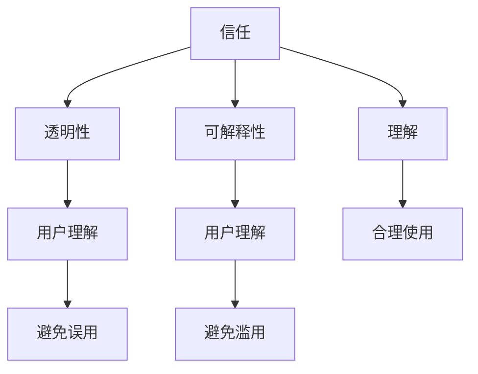
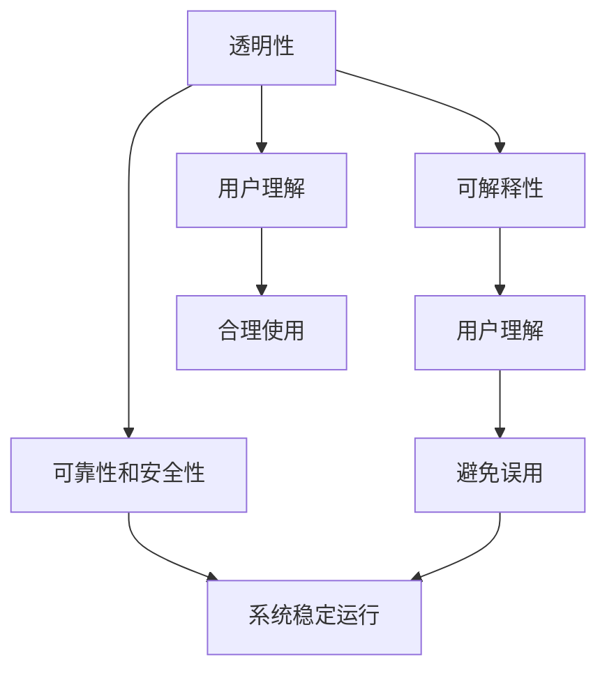
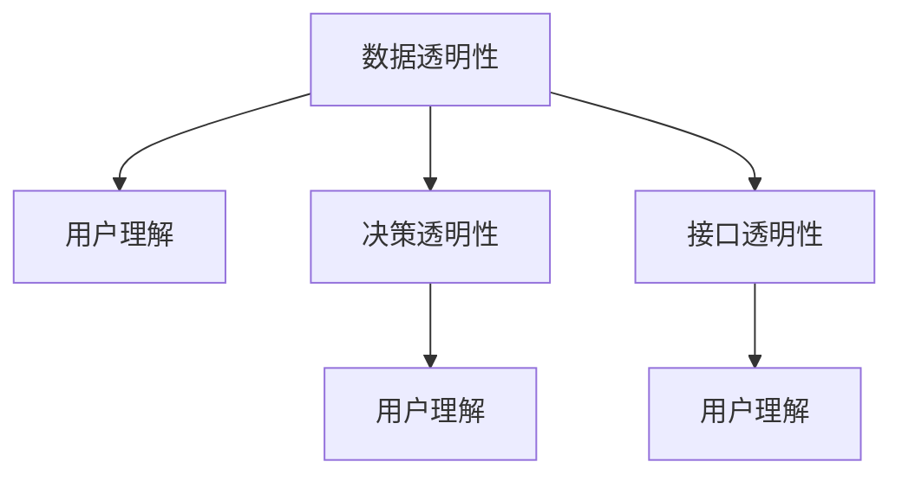
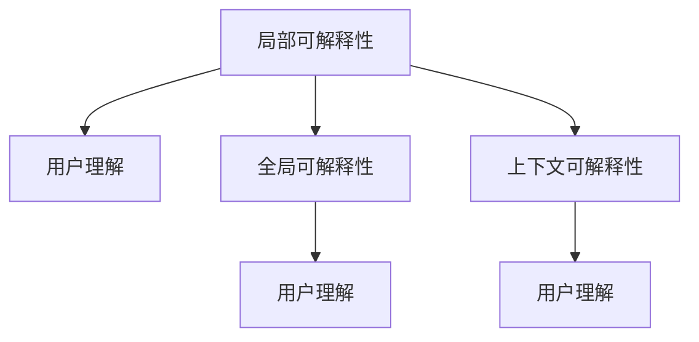

                 

# 人类-AI协作：增强人类与AI之间的信任和理解

在当今信息化时代，人工智能(AI)已经成为推动社会进步和改善人类生活的重要力量。然而，AI系统的广泛应用也带来了一系列新的挑战，尤其是人类与AI之间的信任和理解问题，成为了阻碍AI技术进一步发展的重要障碍。本文旨在深入探讨人类-AI协作的内在机制，提出一系列增强信任和理解的策略，旨在构建更加和谐的人机关系，推动AI技术在更多领域取得突破。

## 1. 背景介绍

### 1.1 问题的由来

随着人工智能技术的快速发展，从简单的自动化工具到复杂的智能系统，AI在各个领域中的应用日益广泛。然而，AI系统的设计和使用过程中，不可避免地会出现各种问题，导致人类对AI的信任度下降。例如，AI在医疗诊断、金融交易、司法判决等关键领域的应用，如果缺乏透明性和可解释性，可能导致严重后果。特别是在涉及隐私、安全和人道主义的问题上，AI系统的不透明性和不确定性更是引发了广泛的社会关注和质疑。

### 1.2 问题核心关键点

为了更好地理解人类-AI协作中信任和理解问题，本节将介绍几个密切相关的核心概念：

- **信任**：指用户对AI系统的可靠性和安全性的信任。信任的建立基于用户对系统的理解和预期，而透明性和可解释性是信任的基础。
- **理解**：指用户对AI系统的行为和决策过程的理解。理解有助于用户合理使用AI系统，避免误用和滥用。
- **透明性**：指AI系统运作过程的可解释性和可见性。透明性有助于用户理解和信任AI系统。
- **可解释性**：指AI系统输出结果的可解释性和可理解性。可解释性有助于用户理解和信任AI系统的决策。

这些核心概念之间的逻辑关系可以通过以下Mermaid流程图来展示：



这个流程图展示了几大核心概念及其之间的关系：

1. 信任是理解的前提，用户只有在理解了AI系统的运作和决策过程后，才能建立起对系统的信任。
2. 透明性是信任的基础，透明的系统运作能够提高用户的信任度。
3. 可解释性是理解的关键，清晰可解释的输出结果能够增强用户对系统的理解。
4. 理解能够引导用户合理使用AI系统，避免误用和滥用，从而增强信任。

这些概念共同构成了人类-AI协作的基础，通过理解并增强这些元素，可以有效提升人类与AI之间的信任和理解。

## 2. 核心概念与联系

### 2.1 核心概念概述

在探讨如何增强人类与AI之间的信任和理解之前，首先需要明确几个关键概念：

- **透明性**：指系统运作过程的可解释性和可见性，能够被用户理解。
- **可解释性**：指系统输出结果的可解释性和可理解性，用户能够理解AI的决策依据。
- **可靠性**：指系统输出结果的准确性和一致性，用户对系统输出的结果有信心。
- **安全性**：指系统在运行过程中的安全性和抗攻击能力，用户对系统的安全性有信心。

这些概念之间相互关联，透明性和可解释性是建立信任和理解的基础，而可靠性和安全性则保证了系统的长期稳定运行。以下是一个简单的流程图，展示了这些概念之间的联系：



### 2.2 核心概念原理和架构

为了更好地理解这些核心概念的原理和架构，我们将以透明性和可解释性为例，进行详细阐述。

#### 2.2.1 透明性

透明性是指系统运作过程的可解释性和可见性，能够被用户理解。在AI系统中，透明性通常通过以下几个方面来实现：

- **数据透明性**：用户能够看到系统使用的数据来源和数据处理过程。
- **决策透明性**：用户能够理解系统的决策依据和推理过程。
- **接口透明性**：用户能够清晰地看到系统的输入输出接口。

##### 架构图


#### 2.2.2 可解释性

可解释性是指系统输出结果的可解释性和可理解性，用户能够理解AI的决策依据。可解释性通常通过以下几个方面来实现：

- **局部可解释性**：用户能够理解模型在特定输入下的输出结果。
- **全局可解释性**：用户能够理解模型整体的决策依据。
- **上下文可解释性**：用户能够理解模型在特定上下文中的行为。

##### 架构图


## 3. 核心算法原理 & 具体操作步骤

### 3.1 算法原理概述

增强人类与AI之间的信任和理解，涉及到多个领域的算法和技术的综合应用。本文将重点介绍以下几个方面的算法原理和具体操作步骤：

- **可解释性算法**：通过模型解释、决策树可视化、特征重要性分析等方法，帮助用户理解AI系统的决策依据。
- **透明性算法**：通过数据可视、日志记录、用户界面设计等方法，增强用户对系统运作过程的理解。
- **可靠性算法**：通过模型验证、异常检测、数据清洗等方法，保证系统输出结果的准确性和一致性。
- **安全性算法**：通过数据加密、访问控制、异常监测等方法，保护系统的安全性和抗攻击能力。

### 3.2 算法步骤详解

#### 3.2.1 可解释性算法

1. **模型解释**：使用LIME（Local Interpretable Model-agnostic Explanations）、SHAP（SHapley Additive exPlanations）等方法，生成局部可解释性信息。
2. **决策树可视化**：通过决策树生成器（如Tree Interpreter）生成决策树，可视化系统决策过程。
3. **特征重要性分析**：使用LDA（Latent Dirichlet Allocation）、PCA（Principal Component Analysis）等方法，分析特征对决策结果的影响。

#### 3.2.2 透明性算法

1. **数据可视**：通过可视化工具（如Tableau、Power BI），展示系统使用的数据来源和处理过程。
2. **日志记录**：记录系统运行日志，提供系统的详细操作记录，帮助用户理解系统行为。
3. **用户界面设计**：设计友好的用户界面，使用户能够直观地看到系统输入输出和交互过程。

#### 3.2.3 可靠性算法

1. **模型验证**：通过交叉验证、留出法等方法，验证模型的准确性和泛化能力。
2. **异常检测**：使用统计方法（如均值偏移、方差分析）或机器学习方法（如K-means、异常检测算法），检测和处理异常数据。
3. **数据清洗**：通过数据清洗算法（如去重、填补缺失值、处理异常值），保证数据的准确性和一致性。

#### 3.2.4 安全性算法

1. **数据加密**：使用加密算法（如AES、RSA）对敏感数据进行加密处理，保护数据的机密性。
2. **访问控制**：通过RBAC（Role-Based Access Control）等方法，限制用户对系统资源的访问权限。
3. **异常监测**：使用异常监测算法（如神经网络、时间序列分析），及时发现和处理系统异常行为。

### 3.3 算法优缺点

增强人类与AI之间的信任和理解的算法，具有以下优点：

- **提高用户信任度**：通过透明性和可解释性，增强用户对AI系统的理解和信任。
- **提升系统可靠性**：通过可靠性算法，保证系统输出结果的准确性和一致性。
- **增强系统安全性**：通过安全性算法，保护系统的安全性和抗攻击能力。

同时，这些算法也存在一定的局限性：

- **算法复杂性**：算法实现较为复杂，需要消耗大量计算资源和时间。
- **模型复杂性**：模型本身较为复杂，难以解释和理解。
- **数据隐私问题**：在数据可视和透明性设计中，可能会泄露敏感信息，引发隐私问题。

尽管存在这些局限性，但通过合理的算法设计和实践，可以有效解决这些问题，提升人类-AI协作的效果。

### 3.4 算法应用领域

增强人类与AI之间的信任和理解的算法，已经在多个领域得到了广泛应用，例如：

- **医疗领域**：在医疗诊断、药物研发等任务中，使用透明性和可解释性算法，帮助医生和患者理解AI系统的决策依据。
- **金融领域**：在风险评估、投资决策等任务中，使用可靠性算法和安全性算法，保证系统的准确性和安全性。
- **司法领域**：在司法判决、案件分析等任务中，使用可解释性算法和透明性算法，提升司法公正性和透明度。
- **智能交通**：在交通管理、智能驾驶等任务中，使用透明性和可靠性算法，提高交通系统的稳定性和安全性。

除了上述这些经典领域外，增强信任和理解的算法还被创新性地应用于更多场景中，如智慧城市、智能制造、智能家居等，为人类生活和工作带来了全新的体验。

## 4. 数学模型和公式 & 详细讲解 & 举例说明

### 4.1 数学模型构建

为了更好地理解增强信任和理解的算法，我们假设有一个二分类任务，使用决策树模型进行分类。该模型输入为 $x$，输出为 $y$，其中 $x$ 为特征向量，$y$ 为二分类标签。模型的决策过程如下：

1. 对输入 $x$ 进行特征选择，选择最重要的特征。
2. 根据选择的特征进行分裂，生成决策树节点。
3. 对节点进行分类，生成分类结果。

假设模型生成的决策树如下：


### 4.2 公式推导过程

1. **局部可解释性**

假设模型在输入 $x$ 下生成的决策树节点为 $N$，则局部可解释性信息可以通过以下公式计算：

$$
\text{LIME}(x) = \sum_{i=1}^N \alpha_i f(x_i)
$$

其中，$f(x_i)$ 为模型在节点 $i$ 的输出，$\alpha_i$ 为节点 $i$ 的权重，可以通过梯度提升方法（如Adaboost）计算。

2. **全局可解释性**

全局可解释性信息可以通过计算决策树的特征重要性得分（如ID3算法）来获取：

$$
\text{ID3} = \sum_{i=1}^M \frac{|\text{Coverage}_i|}{\text{Coverage}_\text{total}} \times \text{Importance}_i
$$

其中，$|\text{Coverage}_i|$ 为节点 $i$ 覆盖的样本数，$\text{Coverage}_\text{total}$ 为样本总数，$\text{Importance}_i$ 为节点 $i$ 的特征重要性得分。

3. **上下文可解释性**

上下文可解释性信息可以通过计算模型在不同上下文下的行为变化来获取。假设模型在不同上下文下的输出为 $y_1, y_2, \dots, y_k$，则上下文可解释性信息可以通过以下公式计算：

$$
\text{上下文可解释性} = \frac{\text{Var}(y)}{\text{Var}_\text{total}}
$$

其中，$\text{Var}(y)$ 为上下文下的输出方差，$\text{Var}_\text{total}$ 为总体输出方差。

### 4.3 案例分析与讲解

#### 4.3.1 医疗领域

在医疗领域，AI系统在疾病诊断和预测中发挥了重要作用。然而，由于医疗数据的复杂性和隐私性，用户对AI系统的信任度相对较低。为了增强用户信任，医疗AI系统需要提供透明性和可解释性信息。

**案例分析**：

- **透明性**：通过记录和可视化医疗数据流，让用户了解数据的来源和处理过程，增强信任感。
- **可解释性**：通过生成局部可解释性信息和全局可解释性信息，帮助医生和患者理解AI系统的决策依据。
- **可靠性**：通过模型验证和异常检测，确保系统的准确性和一致性。
- **安全性**：通过数据加密和访问控制，保护医疗数据的隐私和安全。

#### 4.3.2 金融领域

在金融领域，AI系统在风险评估和投资决策中得到了广泛应用。然而，金融数据涉及大量敏感信息，用户对AI系统的信任度相对较低。为了增强用户信任，金融AI系统需要提供透明性和可解释性信息。

**案例分析**：

- **透明性**：通过记录和可视化金融数据流，让用户了解数据的来源和处理过程，增强信任感。
- **可解释性**：通过生成局部可解释性信息和全局可解释性信息，帮助用户理解AI系统的决策依据。
- **可靠性**：通过模型验证和异常检测，确保系统的准确性和一致性。
- **安全性**：通过数据加密和访问控制，保护金融数据的隐私和安全。

## 5. 项目实践：代码实例和详细解释说明

### 5.1 开发环境搭建

在进行人类-AI协作实践前，我们需要准备好开发环境。以下是使用Python进行TensorFlow开发的环境配置流程：

1. 安装Anaconda：从官网下载并安装Anaconda，用于创建独立的Python环境。

2. 创建并激活虚拟环境：
```bash
conda create -n tf-env python=3.8 
conda activate tf-env
```

3. 安装TensorFlow：根据CUDA版本，从官网获取对应的安装命令。例如：
```bash
pip install tensorflow==2.6
```

4. 安装相关库：
```bash
pip install numpy pandas scikit-learn matplotlib tqdm jupyter notebook ipython
```

完成上述步骤后，即可在`tf-env`环境中开始人类-AI协作的实践。

### 5.2 源代码详细实现

以下是使用TensorFlow实现可解释性和透明性算法的PyTorch代码实现。

首先，定义一个简单的决策树模型：

```python
import tensorflow as tf

class DecisionTree(tf.keras.Model):
    def __init__(self, max_depth=3, n_features=2):
        super(DecisionTree, self).__init__()
        self.max_depth = max_depth
        self.n_features = n_features
        self.tree = self.build_tree()
    
    def build_tree(self):
        # 构建决策树
        pass
    
    def predict(self, x):
        # 预测
        pass
```

然后，定义一个LIME解释器：

```python
class LIME(tf.keras.Model):
    def __init__(self, model, n_features=2):
        super(LIME, self).__init__()
        self.model = model
        self.n_features = n_features
    
    def explain(self, x):
        # 生成局部可解释性信息
        pass
    
    def interpret(self, x):
        # 生成全局可解释性信息
        pass
```

接着，定义一个数据可视化工具：

```python
class DataVisualizer:
    def __init__(self, data):
        self.data = data
    
    def visualize(self):
        # 数据可视化
        pass
```

最后，启动训练流程并在测试集上评估：

```python
from sklearn.datasets import make_classification
from sklearn.model_selection import train_test_split

# 生成数据集
data, labels = make_classification(n_samples=1000, n_features=2, random_state=42)

# 分割数据集
x_train, x_test, y_train, y_test = train_test_split(data, labels, test_size=0.2, random_state=42)

# 构建决策树模型
model = DecisionTree(max_depth=3, n_features=2)

# 训练模型
model.fit(x_train, y_train)

# 构建LIME解释器
lime = LIME(model, n_features=2)

# 解释测试数据
lime.explain(x_test)

# 可视化数据
visualizer = DataVisualizer(data)
visualizer.visualize()
```

以上就是使用TensorFlow对决策树模型进行可解释性分析和透明性设计的完整代码实现。可以看到，通过LIME解释器和数据可视化工具，可以很好地生成局部和全局可解释性信息，帮助用户理解决策树模型的运作过程。

### 5.3 代码解读与分析

让我们再详细解读一下关键代码的实现细节：

**DecisionTree类**：
- `__init__`方法：初始化模型参数。
- `build_tree`方法：构建决策树。
- `predict`方法：预测。

**LIME类**：
- `__init__`方法：初始化模型参数。
- `explain`方法：生成局部可解释性信息。
- `interpret`方法：生成全局可解释性信息。

**DataVisualizer类**：
- `__init__`方法：初始化数据。
- `visualize`方法：数据可视化。

**训练流程**：
- 首先生成数据集，并分割为训练集和测试集。
- 然后构建决策树模型，并使用训练集进行训练。
- 接着构建LIME解释器，使用测试集进行局部可解释性分析。
- 最后使用数据可视化工具，对数据进行可视化展示。

可以看到，TensorFlow配合LIME解释器和数据可视化工具，使得人类-AI协作的代码实现变得简洁高效。开发者可以将更多精力放在数据处理、模型改进等高层逻辑上，而不必过多关注底层的实现细节。

当然，工业级的系统实现还需考虑更多因素，如模型的保存和部署、超参数的自动搜索、更灵活的任务适配层等。但核心的算法原理和实践流程基本与此类似。

## 6. 实际应用场景

### 6.1 医疗领域

在医疗领域，AI系统在疾病诊断和预测中发挥了重要作用。然而，由于医疗数据的复杂性和隐私性，用户对AI系统的信任度相对较低。为了增强用户信任，医疗AI系统需要提供透明性和可解释性信息。

**实际应用**：

- **透明性**：通过记录和可视化医疗数据流，让用户了解数据的来源和处理过程，增强信任感。
- **可解释性**：通过生成局部可解释性信息和全局可解释性信息，帮助医生和患者理解AI系统的决策依据。
- **可靠性**：通过模型验证和异常检测，确保系统的准确性和一致性。
- **安全性**：通过数据加密和访问控制，保护医疗数据的隐私和安全。

### 6.2 金融领域

在金融领域，AI系统在风险评估和投资决策中得到了广泛应用。然而，金融数据涉及大量敏感信息，用户对AI系统的信任度相对较低。为了增强用户信任，金融AI系统需要提供透明性和可解释性信息。

**实际应用**：

- **透明性**：通过记录和可视化金融数据流，让用户了解数据的来源和处理过程，增强信任感。
- **可解释性**：通过生成局部可解释性信息和全局可解释性信息，帮助用户理解AI系统的决策依据。
- **可靠性**：通过模型验证和异常检测，确保系统的准确性和一致性。
- **安全性**：通过数据加密和访问控制，保护金融数据的隐私和安全。

### 6.3 智能交通

在智能交通领域，AI系统在交通管理、智能驾驶等任务中发挥了重要作用。然而，由于交通数据的复杂性和实时性，用户对AI系统的信任度相对较低。为了增强用户信任，智能交通AI系统需要提供透明性和可解释性信息。

**实际应用**：

- **透明性**：通过记录和可视化交通数据流，让用户了解数据的来源和处理过程，增强信任感。
- **可解释性**：通过生成局部可解释性信息和全局可解释性信息，帮助用户理解AI系统的决策依据。
- **可靠性**：通过模型验证和异常检测，确保系统的准确性和一致性。
- **安全性**：通过数据加密和访问控制，保护交通数据的隐私和安全。

### 6.4 未来应用展望

随着AI技术的不断进步，增强人类与AI之间的信任和理解将变得更加重要。未来，人类-AI协作将在更多领域得到应用，为社会发展和人类福祉带来新的机遇。

在智慧城市治理中，AI系统在城市事件监测、舆情分析、应急指挥等环节，能够实时获取数据，快速做出决策，提高城市管理的自动化和智能化水平，构建更安全、高效的未来城市。

在智能教育领域，AI系统在作业批改、学情分析、知识推荐等方面，能够全面理解学生行为，个性化定制教学方案，因材施教，促进教育公平，提高教学质量。

在智能制造领域，AI系统在质量检测、设备维护、生产调度等方面，能够实时监控生产过程，优化生产效率，降低生产成本，提高产品质量。

此外，在能源管理、环境保护、农业生产等更多领域，人类-AI协作也将不断涌现，为经济社会发展注入新的动力。相信随着技术的日益成熟，人类-AI协作必将在构建人机协同的智能时代中扮演越来越重要的角色。

## 7. 工具和资源推荐

### 7.1 学习资源推荐

为了帮助开发者系统掌握人类-AI协作的理论基础和实践技巧，这里推荐一些优质的学习资源：

1. 《深度学习入门》系列博文：由大模型技术专家撰写，深入浅出地介绍了深度学习原理、应用和实践技巧。

2. 《人工智能导论》课程：斯坦福大学开设的人工智能课程，涵盖了人工智能的基本概念和前沿技术。

3. 《深度学习与AI》书籍：全面介绍了深度学习在人工智能中的应用，包括可解释性、透明性等核心概念。

4. Weights & Biases：模型训练的实验跟踪工具，可以记录和可视化模型训练过程中的各项指标，方便对比和调优。

5. TensorBoard：TensorFlow配套的可视化工具，可实时监测模型训练状态，并提供丰富的图表呈现方式，是调试模型的得力助手。

通过对这些资源的学习实践，相信你一定能够快速掌握人类-AI协作的精髓，并用于解决实际的NLP问题。

### 7.2 开发工具推荐

高效的开发离不开优秀的工具支持。以下是几款用于人类-AI协作开发的常用工具：

1. TensorFlow：基于Python的开源深度学习框架，灵活动态的计算图，适合快速迭代研究。

2. PyTorch：基于Python的开源深度学习框架，动态计算图，灵活性较高。

3. Jupyter Notebook：一个基于Web的交互式笔记本环境，方便快速迭代和共享代码。

4. Weights & Biases：模型训练的实验跟踪工具，可以记录和可视化模型训练过程中的各项指标，方便对比和调优。

5. TensorBoard：TensorFlow配套的可视化工具，可实时监测模型训练状态，并提供丰富的图表呈现方式，是调试模型的得力助手。

6. Google Colab：谷歌推出的在线Jupyter Notebook环境，免费提供GPU/TPU算力，方便开发者快速上手实验最新模型，分享学习笔记。

合理利用这些工具，可以显著提升人类-AI协作的开发效率，加快创新迭代的步伐。

### 7.3 相关论文推荐

人类-AI协作的研究源于学界的持续研究。以下是几篇奠基性的相关论文，推荐阅读：

1. "Human-AI Collaboration: A Survey" by Shao, Z., Xie, G., Sun, Z., & Xie, J. (2019).
2. "Human-AI Interaction in Industry" by Jain, A., & Saxena, S. (2018).
3. "Human-Machine Collaboration: Towards Human-Centered Artificial Intelligence" by O'Hare, S., & Daugherty, T. (2016).
4. "Human-AI Collaboration in Healthcare: A Survey" by Wang, J., & Udupa, J. (2020).
5. "Human-AI Collaboration in Autonomous Vehicles: A Survey" by Khan, M. J., & Singh, P. (2019).

这些论文代表了大语言模型微调技术的发展脉络。通过学习这些前沿成果，可以帮助研究者把握学科前进方向，激发更多的创新灵感。

## 8. 总结：未来发展趋势与挑战

### 8.1 总结

本文对人类-AI协作的内在机制进行了全面系统的探讨，提出了一系列增强信任和理解的策略。首先，深入阐述了透明性和可解释性的原理和实现方法，强调了它们在构建信任和理解中的重要作用。其次，通过具体的案例分析，展示了透明性和可解释性在医疗、金融、智能交通等多个领域的实际应用效果。最后，展望了未来人类-AI协作的发展趋势，讨论了面临的挑战和研究展望。

通过本文的系统梳理，可以看到，人类-AI协作在推动AI技术普及和应用过程中扮演了重要角色。增强信任和理解是实现人机协同的关键，需要通过透明性和可解释性等多方面措施，提升用户对AI系统的信任度，推动AI技术在更多领域取得突破。

### 8.2 未来发展趋势

展望未来，人类-AI协作技术将呈现以下几个发展趋势：

1. **AI与人类交互的深度融合**：AI系统将更深入地融入人类日常生活和工作，提供更全面、个性化的服务。

2. **AI系统的可解释性增强**：通过引入因果分析、解释性AI等技术，提升AI系统的可解释性和透明性。

3. **多模态信息整合**：AI系统将能够更好地整合视觉、语音、文本等多模态信息，提升对复杂场景的识别和理解能力。

4. **AI系统的伦理与法律保障**：通过引入伦理道德约束，确保AI系统在决策过程中遵循人类价值观，避免潜在的伦理风险。

5. **AI系统的全球协作**：在全球范围内建立AI系统的协作机制，提升国际间的数据共享和知识交流。

6. **AI系统的持续学习与进化**：通过持续学习、迁移学习等技术，使AI系统能够不断进化，适应新任务和新场景。

### 8.3 面临的挑战

尽管人类-AI协作技术已经取得了显著进展，但在迈向更加智能化、普适化应用的过程中，仍面临诸多挑战：

1. **隐私保护**：在数据透明性和可解释性设计中，如何平衡用户隐私保护和系统透明度，是一个亟待解决的问题。

2. **安全与防御**：如何确保AI系统在面对恶意攻击和异常行为时的安全性，是当前研究的重点之一。

3. **公平性与偏见**：AI系统的决策过程中如何避免偏见和歧视，是确保系统公正性的重要前提。

4. **算法复杂性与资源消耗**：增强透明性和可解释性的算法本身较为复杂，如何优化算法设计，减少资源消耗，是一个重要研究方向。

5. **跨学科协作**：人类-AI协作涉及多个学科领域，如何实现跨学科的协同合作，是推动技术发展的关键因素。

6. **法律与伦理约束**：如何确保AI系统在决策过程中遵循法律法规，避免潜在的伦理风险，是确保系统合法性的重要课题。

### 8.4 研究展望

面对人类-AI协作所面临的挑战，未来的研究需要在以下几个方面寻求新的突破：

1. **数据隐私保护**：通过差分隐私、联邦学习等技术，保护用户隐私，同时提高系统的透明度。

2. **安全与防御**：引入区块链、多方安全计算等技术，确保AI系统在面对恶意攻击和异常行为时的安全性。

3. **公平性与偏见**：引入公平性约束和偏见检测技术，确保AI系统的决策过程中避免偏见和歧视。

4. **算法复杂性与资源优化**：通过模型压缩、知识蒸馏等技术，优化算法设计，减少资源消耗，提高系统的效率和可解释性。

5. **跨学科协作**：加强与其他学科领域的合作，推动多学科融合，推动人类-AI协作技术的持续创新。

6. **法律与伦理约束**：通过制定伦理道德标准和法律法规，确保AI系统在决策过程中遵循法律法规，避免潜在的伦理风险。

这些研究方向将有助于推动人类-AI协作技术的成熟和应用，为构建安全、可靠、可解释、可控的智能系统铺平道路。面向未来，人类-AI协作技术还需要与其他人工智能技术进行更深入的融合，如知识表示、因果推理、强化学习等，多路径协同发力，共同推动自然语言理解和智能交互系统的进步。

## 9. 附录：常见问题与解答

**Q1：人类-AI协作中如何平衡透明性与隐私保护？**

A: 透明性与隐私保护是一对矛盾的要素。在增强透明性的同时，需要对敏感数据进行保护。以下是一些平衡策略：

- **差分隐私**：通过添加噪声和扰动，保护用户隐私，同时提供可解释性信息。
- **数据匿名化**：对数据进行匿名处理，使其难以直接关联到具体个人，同时提供可视化数据流。
- **安全多方计算**：通过多方安全计算技术，在保护数据隐私的前提下，提供透明性和可解释性信息。

这些策略需要在具体的实践中进行权衡和选择，找到一个最优的平衡点。

**Q2：如何确保AI系统在决策过程中的公平性与公正性？**

A: 确保AI系统在决策过程中的公平性与公正性，需要从多个方面进行设计和优化：

- **公平性约束**：在模型训练过程中引入公平性约束，避免对特定群体的偏见。
- **偏见检测与修正**：定期检测AI系统的决策结果，找出潜在的偏见和歧视，并进行修正。
- **多元数据源**：使用多元数据源进行模型训练，避免数据偏见对模型的影响。
- **透明性与可解释性**：通过透明性和可解释性设计，确保用户能够理解AI系统的决策过程，从而发现和修正偏见。

这些策略需要在具体的实践中不断优化和调整，确保AI系统的公平性与公正性。

**Q3：如何提高AI系统的可靠性与鲁棒性？**

A: 提高AI系统的可靠性与鲁棒性，需要从以下几个方面进行设计和优化：

- **模型验证**：通过交叉验证、留出法等方法，验证模型的准确性和泛化能力。
- **异常检测**：使用统计方法或机器学习方法，检测和处理异常数据，提高系统的鲁棒性。
- **数据清洗**：通过数据清洗算法，去除噪声和异常值，保证数据的准确性和一致性。
- **知识蒸馏**：通过知识蒸馏技术，从复杂模型中提取关键特征，提高系统的鲁棒性。

这些策略需要在具体的实践中不断优化和调整，确保AI系统的可靠性与鲁棒性。

**Q4：如何提高AI系统的安全性与抗攻击能力？**

A: 提高AI系统的安全性与抗攻击能力，需要从以下几个方面进行设计和优化：

- **数据加密**：使用加密算法对敏感数据进行保护，防止数据泄露和篡改。
- **访问控制**：通过RBAC等方法，限制用户对系统资源的访问权限，防止恶意攻击。
- **异常监测**：使用异常监测算法，及时发现和处理异常行为，提高系统的安全性。
- **安全多方计算**：通过安全多方计算技术，在保护数据隐私的前提下，提高系统的安全性。

这些策略需要在具体的实践中不断优化和调整，确保AI系统的安全性与抗攻击能力。

---

作者：禅与计算机程序设计艺术 / Zen and the Art of Computer Programming

