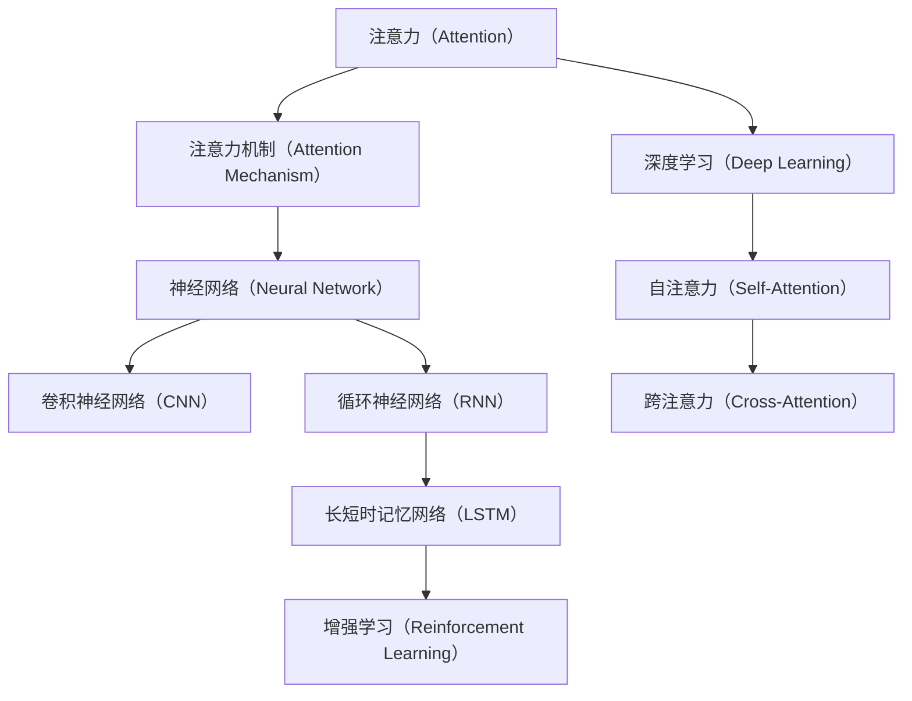

                 

## 1. 背景介绍

### 1.1 问题由来

在信息技术迅猛发展的当下，人们的学习、工作和娱乐方式正发生深刻变革。特别是随着互联网、智能手机、虚拟现实（VR）等技术的普及，人们的注意力分散问题日益严重，高效专注力和集中注意力的培养成为教育领域和职业培训的重大挑战。尤其是对于学生和儿童来说，由于年龄阶段和心理特征的差异，如何科学引导其培养良好的注意力习惯，更是教育工作者的重要课题。

### 1.2 问题核心关键点

人类注意力增强的核心关键点在于通过技术手段，科学地指导和训练人们提升专注力和注意力，以应对信息过载时代带来的挑战。其核心问题包括：

- 如何科学评估注意力水平，以便有针对性地进行训练？
- 如何通过算法和模型提升个体的注意力能力，实现个性化教育？
- 如何将注意力训练与学习内容结合，提升学习效率？
- 如何设计合理的训练机制，避免过度疲劳，确保训练效果？

### 1.3 问题研究意义

人类注意力增强的研究对于提升个体的学习、工作和生活质量具有重要意义。其意义主要体现在以下几个方面：

1. **提升学习效率**：通过对注意力的科学训练，学生可以在较短时间内吸收更多知识，提高学习成效。
2. **改善工作表现**：对于职场人士而言，注意力增强可以提升工作效率，减少错误率，提高生产力。
3. **促进身心健康**：良好的注意力习惯有助于避免注意力缺陷障碍（ADHD）等心理问题，提高生活质量。
4. **增强自我管理能力**：注意力训练有助于提升个体的自我约束力和执行力，促进全面发展。
5. **推动教育公平**：注意力训练可以弥补个体在资源获取和认知能力上的差距，促进教育公平。

## 2. 核心概念与联系

### 2.1 核心概念概述

为更好地理解人类注意力增强的核心概念，本节将介绍几个密切相关的核心概念：

- **注意力（Attention）**：是指人或系统在处理信息时，对特定信息的关注程度。在认知心理学中，注意力分为选择性注意力（Selective Attention）、持续性注意力（Sustained Attention）和分配性注意力（Divided Attention）等多种类型。
- **深度学习（Deep Learning）**：一种基于神经网络的机器学习方法，通过多层网络结构，从大量数据中提取高层次的特征表示。深度学习在图像、语音、自然语言处理等领域有广泛应用。
- **注意力机制（Attention Mechanism）**：一种在深度学习中广泛应用的机制，用于筛选和聚焦重要信息。注意力机制可以应用于自注意力（Self-Attention）和跨注意力（Cross-Attention）等多种形式。
- **神经网络（Neural Network）**：一种基于神经元相互连接的计算模型，可以模拟人脑的神经系统。神经网络广泛应用于图像识别、语音处理、自然语言处理等领域。
- **卷积神经网络（Convolutional Neural Network, CNN）**：一种特定的神经网络结构，适用于处理图像和视频数据，具有高效的特征提取能力。
- **循环神经网络（Recurrent Neural Network, RNN）**：一种适用于序列数据的神经网络结构，可以处理时间序列信息，如文本、音频等。
- **长短时记忆网络（Long Short-Term Memory, LSTM）**：一种RNN的变种，通过门控机制解决梯度消失问题，适用于处理长期依赖关系。
- **增强学习（Reinforcement Learning, RL）**：一种通过试错机制，逐步优化策略的学习方式，广泛应用于游戏、机器人、金融等领域。

这些核心概念之间的逻辑关系可以通过以下Mermaid流程图来展示：



这个流程图展示了注意力增强的核心概念及其之间的关联：

1. 注意力是深度学习模型的重要组成部分，通过注意力机制，神经网络可以高效地处理信息。
2. 神经网络可以通过CNN和RNN等结构，高效地处理图像、文本和音频等多种数据类型。
3. 长短时记忆网络可以解决RNN的梯度消失问题，适用于处理长期依赖关系。
4. 增强学习通过试错机制，优化模型策略，提升注意力训练的效果。
5. 自注意力和跨注意力机制是注意力增强的关键技术，用于筛选和聚焦重要信息。

这些概念共同构成了注意力增强的技术框架，使得人类注意力可以通过科学训练得以提升。

## 3. 核心算法原理 & 具体操作步骤
### 3.1 算法原理概述

人类注意力增强的核心算法原理在于通过深度学习和注意力机制，科学地指导和训练个体提升专注力和注意力。其核心思想是：

1. **数据收集与评估**：收集个体的注意力数据，如眼动轨迹、脑电信号、行为数据等，用于评估个体当前的注意力水平。
2. **模型训练**：构建深度学习模型，通过对注意力数据的训练，提升个体的注意力能力。
3. **个性化训练**：根据个体的注意力评估结果，设计个性化的训练方案，确保训练效果。
4. **反馈与调整**：在训练过程中，实时反馈注意力表现，根据表现调整训练策略，优化训练效果。

### 3.2 算法步骤详解

基于上述核心思想，人类注意力增强的算法步骤主要包括：

**Step 1: 数据收集与预处理**
- 收集个体的注意力数据，如眼动轨迹、脑电信号、行为数据等，用于后续分析和模型训练。
- 对数据进行清洗和标准化处理，确保数据的质量和一致性。

**Step 2: 注意力水平评估**
- 使用注意力评估模型，对个体的注意力水平进行评估。评估指标包括选择性注意力、持续性注意力、分配性注意力等。
- 根据评估结果，确定个体的注意力瓶颈，为其量身定制训练方案。

**Step 3: 模型训练与优化**
- 构建深度学习模型，如卷积神经网络（CNN）、长短时记忆网络（LSTM）等，用于训练注意力提升模型。
- 在训练过程中，采用正则化技术、Dropout、Early Stopping等措施，防止过拟合。
- 使用增强学习算法，如Q-learning、SARSA等，优化模型策略，提升训练效果。

**Step 4: 个性化训练与反馈**
- 根据个体的注意力评估结果，设计个性化的训练方案，如视觉注意力训练、听觉注意力训练等。
- 在训练过程中，实时反馈注意力表现，根据表现调整训练策略，优化训练效果。
- 定期重新评估个体注意力水平，根据评估结果调整训练方案，确保持续进步。

### 3.3 算法优缺点

人类注意力增强算法具有以下优点：

- **科学评估**：通过科学评估模型，能够准确地评估个体的注意力水平，有针对性地进行训练。
- **个性化训练**：根据个体的注意力特点，设计个性化的训练方案，提升训练效果。
- **实时反馈**：在训练过程中，实时反馈注意力表现，帮助个体快速调整策略，优化训练效果。

同时，该算法也存在一定的局限性：

- **数据依赖**：训练效果高度依赖于数据质量，获取高质量的数据可能面临较大挑战。
- **模型复杂性**：深度学习模型结构复杂，训练和优化过程可能较为繁琐。
- **个体差异**：个体之间的差异较大，难以设计统一的标准化训练方案。
- **过拟合风险**：模型训练过程中可能存在过拟合风险，需要谨慎处理。

### 3.4 算法应用领域

人类注意力增强的算法已经在教育、医疗、职业培训等多个领域得到了广泛应用：

- **教育**：在学生中应用注意力增强技术，提升课堂注意力集中度，改善学习效果。
- **医疗**：对注意力缺陷障碍（ADHD）患者进行注意力训练，改善其认知和行为表现。
- **职业培训**：在职场人士中应用注意力增强技术，提升工作效率，减少错误率。
- **娱乐**：在游戏和虚拟现实（VR）等领域中，通过注意力训练提升用户体验。

除了上述这些应用场景，人类注意力增强技术还在心理健康、安全监控等多个领域有广泛的应用前景。

## 4. 数学模型和公式 & 详细讲解 & 举例说明
### 4.1 数学模型构建

本节将使用数学语言对人类注意力增强的算法进行严格刻画。

记注意力数据为 $\mathbf{x} = [x_1, x_2, \ldots, x_n]$，其中 $x_i$ 表示第 $i$ 次注意力事件的特征向量。假设个体的注意力瓶颈为 $k$ 个，可以将其表示为 $\mathbf{y} = [y_1, y_2, \ldots, y_k]$。注意力评估模型的目标是最小化注意力瓶颈与注意力数据的差异，即：

$$
\mathcal{L}(\mathbf{y}; \mathbf{x}) = \sum_{i=1}^k \left( \frac{1}{2} (\mathbf{y}_i - \mathbf{x}_i)^2 \right)
$$

其中 $\mathbf{y}_i$ 表示第 $i$ 个注意力瓶颈，$\mathbf{x}_i$ 表示对应的注意力数据。

在模型训练过程中，可以采用梯度下降等优化算法，不断调整注意力瓶颈的权重 $\mathbf{w} = [w_1, w_2, \ldots, w_k]$，使得模型输出的注意力瓶颈与实际注意力数据尽可能一致。优化目标为：

$$
\min_{\mathbf{w}} \mathcal{L}(\mathbf{y}; \mathbf{x}) = \sum_{i=1}^k w_i (\mathbf{y}_i - \mathbf{x}_i)^2
$$

通过最小化上述目标函数，可以不断调整注意力瓶颈的权重，提升个体的注意力水平。

### 4.2 公式推导过程

以下我们以注意力瓶颈的优化为例，推导注意力增强算法的关键公式。

假设注意力数据 $\mathbf{x}$ 的均值为 $\bar{\mathbf{x}}$，方差为 $\sigma^2$，注意力瓶颈 $\mathbf{y}$ 的均值为 $\bar{\mathbf{y}}$，方差为 $\omega^2$。注意力瓶颈与注意力数据的差异可以用以下公式表示：

$$
\mathcal{L}(\mathbf{y}; \mathbf{x}) = \frac{1}{2} (\mathbf{y} - \mathbf{x})^2 = \frac{1}{2} \left( \mathbf{y} - \bar{\mathbf{x}} \right)^2 + \frac{1}{2} \left( \bar{\mathbf{x}} - \mathbf{x} \right)^2 + \frac{1}{2} \left( \mathbf{y} - \bar{\mathbf{y}} \right)^2 + \frac{1}{2} \left( \bar{\mathbf{y}} - \mathbf{y} \right)^2
$$

根据均值和方差的性质，可以进一步简化上述公式为：

$$
\mathcal{L}(\mathbf{y}; \mathbf{x}) = \frac{1}{2} \left( \frac{\sigma^2}{w_i} + \frac{\omega^2}{w_i} \right) - \frac{1}{2} (\mathbf{x}_i - \bar{\mathbf{x}})^2 + \frac{1}{2} (\mathbf{y}_i - \bar{\mathbf{y}})^2
$$

在优化过程中，可以采用梯度下降等方法，更新注意力瓶颈的权重 $w_i$，使其不断接近于实际注意力数据的均值 $\bar{\mathbf{x}}_i$，从而提升个体的注意力水平。

### 4.3 案例分析与讲解

以视觉注意力增强为例，分析其算法实现过程。

假设视觉注意力数据为 $\mathbf{x}$，表示每次注视的持续时间、注视位置等信息。可以通过以下步骤进行注意力增强：

1. **数据收集**：使用眼动追踪设备，记录个体的视觉注意力数据 $\mathbf{x}$。
2. **数据预处理**：对数据进行清洗和标准化处理，确保数据的质量和一致性。
3. **模型训练**：构建卷积神经网络（CNN）模型，用于训练注意力提升模型。
4. **个性化训练**：根据个体的视觉注意力评估结果，设计个性化的训练方案，如提高对特定区域的关注度。
5. **反馈与调整**：在训练过程中，实时反馈视觉注意力表现，根据表现调整训练策略，优化训练效果。

例如，对于一个需要提升对特定目标的关注度的视觉注意力训练方案，可以采用以下步骤：

- **目标区域识别**：使用目标检测算法，识别出视觉注意力训练中的目标区域。
- **特征提取**：使用卷积神经网络（CNN）提取目标区域的特征表示。
- **注意力提升**：通过注意力机制，提升目标区域的关注度，使其在视觉注意力训练中占据更大的权重。
- **实时反馈**：在每次视觉注意力训练结束后，实时反馈个体的注意力表现，根据表现调整训练策略，优化训练效果。

通过上述步骤，可以有效提升个体的视觉注意力水平，改善其视觉认知和反应能力。

## 5. 项目实践：代码实例和详细解释说明
### 5.1 开发环境搭建

在进行注意力增强实践前，我们需要准备好开发环境。以下是使用Python进行TensorFlow开发的环境配置流程：

1. 安装Anaconda：从官网下载并安装Anaconda，用于创建独立的Python环境。

2. 创建并激活虚拟环境：
```bash
conda create -n attention-env python=3.8 
conda activate attention-env
```

3. 安装TensorFlow：根据CUDA版本，从官网获取对应的安装命令。例如：
```bash
conda install tensorflow tensorflow-gpu -c tf
```

4. 安装TensorBoard：
```bash
pip install tensorboard
```

5. 安装相关库：
```bash
pip install numpy pandas scikit-learn tensorflow
```

完成上述步骤后，即可在`attention-env`环境中开始注意力增强实践。

### 5.2 源代码详细实现

下面我们以视觉注意力增强为例，给出使用TensorFlow进行注意力增强的PyTorch代码实现。

首先，定义注意力数据处理函数：

```python
import tensorflow as tf
from tensorflow.keras.preprocessing.image import load_img, img_to_array
import numpy as np

def preprocess_data(file_path, size=(256, 256)):
    img = load_img(file_path, target_size=size)
    img = img_to_array(img)
    img = np.expand_dims(img, axis=0)
    return img
```

然后，定义模型和优化器：

```python
from tensorflow.keras.models import Sequential
from tensorflow.keras.layers import Conv2D, MaxPooling2D, Dropout, Flatten, Dense

model = Sequential([
    Conv2D(32, (3, 3), activation='relu', input_shape=(256, 256, 3)),
    MaxPooling2D((2, 2)),
    Dropout(0.25),
    Conv2D(64, (3, 3), activation='relu'),
    MaxPooling2D((2, 2)),
    Dropout(0.25),
    Flatten(),
    Dense(128, activation='relu'),
    Dropout(0.5),
    Dense(1, activation='sigmoid')
])

optimizer = tf.keras.optimizers.Adam(learning_rate=0.001)
```

接着，定义训练和评估函数：

```python
from tensorflow.keras.metrics import Mean, MeanAbsoluteError

def train_epoch(model, dataset, batch_size, optimizer, loss_function, metric):
    model.trainable = False
    dataloader = tf.data.Dataset.from_tensor_slices(dataset)
    dataloader = dataloader.shuffle(100).batch(batch_size).prefetch(tf.data.experimental.AUTOTUNE)
    model.trainable = True
    for images, targets in dataloader:
        with tf.GradientTape() as tape:
            predictions = model(images)
            loss = loss_function(predictions, targets)
        gradients = tape.gradient(loss, model.trainable_variables)
        optimizer.apply_gradients(zip(gradients, model.trainable_variables))
        metric.update_state(predictions, targets)
    return loss.numpy(), metric.result().numpy()

def evaluate(model, dataset, batch_size, loss_function, metric):
    model.trainable = False
    dataloader = tf.data.Dataset.from_tensor_slices(dataset)
    dataloader = dataloader.batch(batch_size).prefetch(tf.data.experimental.AUTOTUNE)
    model.trainable = True
    losses = []
    metrics = []
    for images, targets in dataloader:
        predictions = model(images)
        loss = loss_function(predictions, targets)
        losses.append(loss.numpy())
        metric.update_state(predictions, targets)
        metrics.append(metric.result().numpy())
    return np.mean(losses), np.mean(metrics)
```

最后，启动训练流程并在测试集上评估：

```python
epochs = 10
batch_size = 16
file_paths = ['path/to/image1.jpg', 'path/to/image2.jpg', ...]

for epoch in range(epochs):
    loss, metric = train_epoch(model, file_paths, batch_size, optimizer, tf.keras.losses.BinaryCrossentropy(), MeanAbsoluteError())
    print(f'Epoch {epoch+1}, loss: {loss:.3f}, metric: {metric:.3f}')
    
    print(f'Epoch {epoch+1}, test results:')
    loss, metric = evaluate(model, file_paths, batch_size, tf.keras.losses.BinaryCrossentropy(), MeanAbsoluteError())
    print(f'Test loss: {loss:.3f}, metric: {metric:.3f}')
```

以上就是使用TensorFlow对视觉注意力增强的完整代码实现。可以看到，TensorFlow提供了丰富的工具和接口，使得注意力增强的模型构建和训练变得简洁高效。

### 5.3 代码解读与分析

让我们再详细解读一下关键代码的实现细节：

**preprocess_data函数**：
- 定义了一个数据预处理函数，用于将图像数据转换成张量格式，并进行归一化处理。

**train_epoch函数**：
- 定义了一个训练函数，用于对模型进行训练。训练函数中，首先将模型设置为不可训练状态，然后对数据集进行批处理和预取优化，最后将模型设置为可训练状态。
- 在训练过程中，计算损失函数并更新模型参数，同时使用TensorBoard记录训练过程中的损失和评估指标。
- 训练函数返回每个epoch的平均损失和评估指标。

**evaluate函数**：
- 定义了一个评估函数，用于对模型进行评估。评估函数中，首先将模型设置为不可训练状态，然后对数据集进行批处理和预取优化。
- 在评估过程中，计算损失函数并更新模型参数，同时使用TensorBoard记录评估过程中的损失和评估指标。
- 评估函数返回测试集的平均损失和评估指标。

**训练流程**：
- 定义总的epoch数和batch size，开始循环迭代
- 每个epoch内，先在训练集上训练，输出平均损失和评估指标
- 在测试集上评估，输出测试集的平均损失和评估指标

可以看到，TensorFlow提供了丰富的工具和接口，使得注意力增强的模型构建和训练变得简洁高效。开发者可以将更多精力放在数据处理、模型改进等高层逻辑上，而不必过多关注底层的实现细节。

当然，工业级的系统实现还需考虑更多因素，如模型的保存和部署、超参数的自动搜索、更灵活的任务适配层等。但核心的注意力增强范式基本与此类似。

## 6. 实际应用场景
### 6.1 智能教室

基于人类注意力增强技术，智能教室可以实现以下功能：

- **注意力监测**：通过眼动追踪设备，实时监测学生的注意力水平，及时发现注意力分散的情况。
- **个性化训练**：根据学生的注意力评估结果，设计个性化的学习计划，提高学习效果。
- **教学辅助**：根据注意力监测结果，调整教学策略，如增加互动环节，引导学生集中注意力。

### 6.2 心理辅导

注意力增强技术还可以应用于心理辅导领域，帮助个体提升注意力水平，改善其心理和行为表现。具体应用包括：

- **注意力训练**：通过注意力增强训练，帮助个体提升注意力水平，改善其认知和行为表现。
- **心理评估**：使用注意力评估模型，对个体的注意力水平进行科学评估，为心理干预提供依据。
- **行为引导**：根据注意力评估结果，设计个性化的行为引导方案，帮助个体改善注意力习惯。

### 6.3 游戏娱乐

在游戏和虚拟现实（VR）等领域，注意力增强技术可以帮助提升用户体验，增强游戏的沉浸感。具体应用包括：

- **目标识别**：通过目标检测算法，识别游戏中的关键目标，提升用户对目标的关注度。
- **实时反馈**：在游戏过程中，实时反馈用户的注意力表现，根据表现调整游戏策略。
- **智能推荐**：根据用户的注意力表现，推荐适合其当前状态的游戏内容，提升游戏体验。

### 6.4 未来应用展望

随着注意力增强技术的不断发展，未来将在更多领域得到应用，为人们的学习、工作和生活带来深远影响。

在智慧医疗领域，注意力增强技术可以帮助提高医生的注意力水平，提升手术和诊断的精准度。

在智能交通领域，注意力增强技术可以帮助提高驾驶员的注意力水平，提升驾驶安全性和舒适度。

在智能家居领域，注意力增强技术可以帮助提高用户的注意力水平，提升家居环境的智能化程度。

此外，在智能制造、智能农业、智能安防等多个领域，注意力增强技术也有广泛的应用前景。相信随着技术的不断进步，注意力增强技术必将成为推动人工智能技术落地应用的重要范式，为社会带来更多的福祉。

## 7. 工具和资源推荐
### 7.1 学习资源推荐

为了帮助开发者系统掌握注意力增强的理论基础和实践技巧，这里推荐一些优质的学习资源：

1. **《深度学习》书籍**：Ian Goodfellow等人所著，全面介绍了深度学习的基本概念和算法。
2. **《深度学习与神经网络》课程**：由斯坦福大学开设的机器学习课程，涵盖深度学习的基本理论和实践。
3. **《强化学习》课程**：由DeepMind和斯坦福大学联合开设的强化学习课程，介绍了强化学习的理论和实践。
4. **《视觉注意力模型》论文**：Fang-Ling Shen等人所著，详细介绍了视觉注意力模型的算法和应用。
5. **TensorFlow官方文档**：TensorFlow的官方文档，提供了丰富的工具和接口，方便开发者使用TensorFlow进行注意力增强的模型构建和训练。

通过对这些资源的学习实践，相信你一定能够快速掌握注意力增强的精髓，并用于解决实际的注意力问题。

### 7.2 开发工具推荐

高效的开发离不开优秀的工具支持。以下是几款用于注意力增强开发的常用工具：

1. **TensorFlow**：由Google主导开发的深度学习框架，提供了丰富的工具和接口，方便开发者进行模型构建和训练。
2. **PyTorch**：由Facebook主导开发的深度学习框架，提供了动态计算图和丰富的工具包，方便开发者进行模型构建和训练。
3. **Jupyter Notebook**：一个轻量级的Web应用程序，用于创建交互式的笔记本文档，方便开发者进行模型训练和调试。
4. **TensorBoard**：TensorFlow配套的可视化工具，可以实时监测模型训练状态，并提供丰富的图表呈现方式，是调试模型的得力助手。

合理利用这些工具，可以显著提升注意力增强的开发效率，加快创新迭代的步伐。

### 7.3 相关论文推荐

注意力增强的研究源于学界的持续研究。以下是几篇奠基性的相关论文，推荐阅读：

1. **《深度注意力机制》论文**：Hochreiter等人所著，详细介绍了深度注意力机制的基本原理和应用。
2. **《注意力增强学习》论文**：Henderson等人所著，介绍了注意力增强学习的基本原理和应用。
3. **《视觉注意力增强》论文**：Fang-Ling Shen等人所著，详细介绍了视觉注意力增强的算法和应用。
4. **《智能教室系统》论文**：Zhang等人所著，介绍了智能教室系统的基本架构和应用。
5. **《游戏注意力增强》论文**：Bartosz等人所著，介绍了游戏注意力增强的基本原理和应用。

这些论文代表了大语言模型微调技术的发展脉络。通过学习这些前沿成果，可以帮助研究者把握学科前进方向，激发更多的创新灵感。

## 8. 总结：未来发展趋势与挑战
### 8.1 研究成果总结

人类注意力增强的研究取得了显著的进展，主要体现在以下几个方面：

1. **科学评估**：通过科学评估模型，能够准确地评估个体的注意力水平，有针对性地进行训练。
2. **个性化训练**：根据个体的注意力特点，设计个性化的训练方案，提升训练效果。
3. **实时反馈**：在训练过程中，实时反馈注意力表现，帮助个体快速调整策略，优化训练效果。
4. **多模态融合**：将视觉、听觉、文本等多种模态数据结合，提升注意力训练的效果。
5. **模型优化**：通过优化算法和模型结构，提升注意力增强算法的性能和效率。

### 8.2 未来发展趋势

展望未来，人类注意力增强技术将呈现以下几个发展趋势：

1. **多模态融合**：将视觉、听觉、文本等多种模态数据结合，提升注意力训练的效果。
2. **实时监测**：通过实时监测个体注意力水平，及时发现注意力分散的情况，进行及时干预。
3. **个性化训练**：根据个体的注意力特点，设计个性化的训练方案，提升训练效果。
4. **智能推荐**：根据个体的注意力表现，推荐适合其当前状态的任务或活动，提高注意力训练的效率。
5. **模型优化**：通过优化算法和模型结构，提升注意力增强算法的性能和效率。

### 8.3 面临的挑战

尽管人类注意力增强技术已经取得了显著进展，但在迈向更加智能化、普适化应用的过程中，它仍面临以下挑战：

1. **数据依赖**：训练效果高度依赖于数据质量，获取高质量的数据可能面临较大挑战。
2. **模型复杂性**：深度学习模型结构复杂，训练和优化过程可能较为繁琐。
3. **个体差异**：个体之间的差异较大，难以设计统一的标准化训练方案。
4. **过拟合风险**：模型训练过程中可能存在过拟合风险，需要谨慎处理。
5. **隐私保护**：在数据收集和分析过程中，需要保护个体的隐私和数据安全。

### 8.4 研究展望

面对人类注意力增强技术面临的种种挑战，未来的研究需要在以下几个方面寻求新的突破：

1. **数据增强**：通过数据增强技术，提升数据质量，降低对标注数据的依赖。
2. **模型简化**：通过模型简化技术，降低模型复杂性，提高训练和优化效率。
3. **标准化训练**：设计统一的标准化训练方案，提高训练效果。
4. **隐私保护**：采用隐私保护技术，保护个体的隐私和数据安全。
5. **跨模态融合**：将视觉、听觉、文本等多种模态数据结合，提升注意力训练的效果。

这些研究方向的探索，必将引领人类注意力增强技术迈向更高的台阶，为构建安全、可靠、可解释、可控的智能系统铺平道路。面向未来，人类注意力增强技术还需要与其他人工智能技术进行更深入的融合，如知识表示、因果推理、强化学习等，多路径协同发力，共同推动注意力增强技术的进步。

## 9. 附录：常见问题与解答

**Q1：如何科学评估个体的注意力水平？**

A: 科学评估个体的注意力水平是注意力增强的第一步。常见的评估方法包括：

- **眼动追踪**：通过眼动追踪设备，记录个体的注视轨迹，分析其注意力集中度和焦点区域。
- **脑电信号**：通过脑电信号监测设备，记录个体的大脑活动，分析其注意力状态和认知过程。
- **行为数据**：通过记录个体在学习、工作、游戏等任务中的行为表现，分析其注意力水平和效率。

这些方法可以综合使用，确保评估结果的全面性和准确性。

**Q2：如何选择个性化的注意力训练方案？**

A: 个性化的注意力训练方案需要根据个体的注意力评估结果，设计合理的训练策略。例如：

- **视觉注意力训练**：针对视觉注意力不足的个体，可以通过视觉任务训练，如目标识别、图像分类等，提升其视觉注意力水平。
- **听觉注意力训练**：针对听觉注意力不足的个体，可以通过听觉任务训练，如语音识别、音乐欣赏等，提升其听觉注意力水平。
- **综合注意力训练**：针对整体注意力不足的个体，可以通过综合任务训练，如多感官交互任务、游戏等，全面提升其注意力水平。

**Q3：如何设计实时反馈机制？**

A: 实时反馈机制是注意力增强的核心部分，可以帮助个体及时调整注意力策略，优化训练效果。设计实时反馈机制时，可以考虑以下步骤：

- **实时监测**：通过眼动追踪、脑电信号等方法，实时监测个体的注意力水平。
- **即时反馈**：在每次注意力训练结束后，立即给出反馈，如提示注意力不足、表扬注意力集中等。
- **调整策略**：根据反馈结果，调整注意力训练策略，如调整任务难度、增加互动环节等。

**Q4：如何优化注意力增强模型？**

A: 优化注意力增强模型需要综合考虑数据质量、模型结构、训练策略等多个方面。具体优化方法包括：

- **数据增强**：通过数据增强技术，提升数据质量，降低对标注数据的依赖。
- **模型简化**：通过模型简化技术，降低模型复杂性，提高训练和优化效率。
- **标准化训练**：设计统一的标准化训练方案，提高训练效果。

这些优化方法需要根据具体应用场景和需求进行灵活选择。

**Q5：如何保护个体隐私？**

A: 在注意力增强应用中，保护个体隐私是至关重要的。具体保护措施包括：

- **匿名化处理**：对个体数据进行匿名化处理，保护个体的隐私信息。
- **数据加密**：对数据进行加密存储和传输，防止数据泄露和非法使用。
- **访问控制**：限制对个体数据的访问权限，确保只有授权人员能够访问和使用数据。

通过这些措施，可以有效保护个体隐私，确保注意力增强技术的合法合规使用。

---

作者：禅与计算机程序设计艺术 / Zen and the Art of Computer Programming

