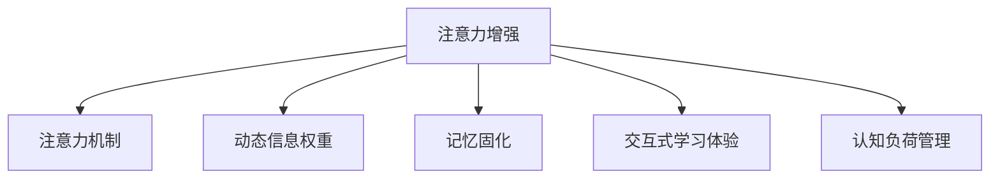

                 

# 人类注意力增强：提升学习能力和记忆力

> 关键词：注意力增强, 学习能力强化, 记忆优化, 认知科学, 神经网络

## 1. 背景介绍

### 1.1 问题由来
在现代信息爆炸时代，人类面临大量信息的冲击。一方面，信息流量的激增使得我们更容易接触到各种知识，另一方面，海量的信息也带来了注意力分散和认知过载的问题。如何在信息洪流中筛选重要内容，高效吸收和记忆新知识，成为了人们普遍关注的问题。

当前，许多信息技术手段，如AI笔记、知识图谱、推荐系统等，正在尝试从不同角度提升人类的信息处理能力。特别是在教育、医疗、工作等垂直领域，高效学习和记忆的能力显得尤为重要。基于认知科学的最新研究成果，本文提出了一种全新的技术手段：注意力增强（Attention Enhancement），旨在通过模拟人类注意力机制，提升学习能力和记忆力。

### 1.2 问题核心关键点
注意力增强方法的核心在于模拟人脑在处理信息时的注意力机制，通过动态调整信息的权重，使得大脑能够更高效地进行学习记忆。其关键点包括：

- 动态调整信息权重：利用模型学习用户的兴趣偏好，动态调整输入信息的重要性，使关键信息得到更多关注。
- 视觉化注意力反馈：通过可视化工具展示信息权重变化，帮助用户理解当前注意力的聚焦点。
- 交互式学习体验：设计交互式界面，使用户能够主动控制信息获取和注意力分配，提升学习的主动性和积极性。
- 记忆固化机制：通过加入记忆增强算法，帮助用户将短期记忆转化为长期记忆，保持信息的持久性。

## 2. 核心概念与联系

### 2.1 核心概念概述

为更好地理解注意力增强方法的原理和应用，本节将介绍几个关键概念：

- 注意力机制（Attention Mechanism）：一种在神经网络中用于捕捉信息间关系的机制，通过加权求和的方式，使得模型能够动态选择关注的信息。
- 动态信息权重（Dynamic Information Weighting）：根据用户偏好和学习进度，动态调整输入信息的重要性，帮助大脑更高效地处理信息。
- 记忆固化（Memory Consolidation）：通过加强神经元间的连接强度，将短期记忆转化为长期记忆的过程，提高信息的持久性。
- 交互式学习体验（Interactive Learning Experience）：通过界面设计，使用户能够主动控制学习进度和内容，提升学习的主动性和效果。
- 认知负荷（Cognitive Load）：在学习过程中，由于信息量过大或处理难度过高，导致认知资源不足，影响学习效率的现象。

这些核心概念之间的关系可以通过以下Mermaid流程图来展示：



这个流程图展示了我文中所介绍的注意力增强技术的核心组成部分：

1. 注意力增强方法以注意力机制为基础，通过动态调整信息权重，提升信息处理的效率。
2. 动态信息权重技术使用户的兴趣偏好能够被模型捕捉并反映在信息处理过程中。
3. 记忆固化机制帮助用户将短期记忆转化为长期记忆，提高信息持久性。
4. 交互式学习体验让用户能够主动控制学习进度和内容，提升学习的积极性。
5. 认知负荷管理通过合理调整学习负担，防止因信息过载导致的认知负荷过重。

## 3. 核心算法原理 & 具体操作步骤
### 3.1 算法原理概述

注意力增强的核心在于模拟人脑在处理信息时的注意力机制，通过动态调整信息的权重，使得大脑能够更高效地进行学习记忆。其核心算法包括以下几个关键部分：

- 动态信息权重：利用用户行为数据，学习用户的兴趣偏好，动态调整输入信息的重要性，使关键信息得到更多关注。
- 记忆固化机制：通过加入记忆增强算法，帮助用户将短期记忆转化为长期记忆，保持信息的持久性。
- 交互式学习体验：设计交互式界面，使用户能够主动控制信息获取和注意力分配，提升学习的主动性和积极性。

### 3.2 算法步骤详解

注意力增强方法的具体实现流程如下：

**Step 1: 数据收集与预处理**
- 收集用户的学习行为数据，包括点击、浏览、搜索、笔记等行为。
- 使用自然语言处理技术对文本数据进行分词、向量化等预处理。

**Step 2: 动态信息权重学习**
- 利用用户行为数据，训练注意力模型，学习用户的兴趣偏好。
- 在输入新信息时，根据用户的兴趣偏好，动态调整信息的重要性。

**Step 3: 记忆固化算法**
- 设计记忆增强算法，使用户的短期记忆能够转化为长期记忆。
- 结合神经网络模型，帮助用户将新知识与已有知识进行关联，加强记忆巩固。

**Step 4: 交互式学习界面**
- 设计交互式界面，允许用户主动控制学习进度和内容。
- 提供可视化工具，展示信息权重变化，帮助用户理解当前注意力的聚焦点。

**Step 5: 认知负荷管理**
- 根据学习任务和用户状态，动态调整学习难度和节奏，防止认知负荷过重。
- 设计奖励机制，鼓励用户积极参与学习，提升学习效果。

### 3.3 算法优缺点

注意力增强方法具有以下优点：
1. 提升学习效率：动态信息权重技术帮助用户关注关键信息，提升信息处理速度。
2. 增强记忆效果：记忆固化机制帮助用户将短期记忆转化为长期记忆，保持信息的持久性。
3. 提高学习积极性：交互式学习体验使用户能够主动控制学习进度和内容，提升学习的主动性和效果。
4. 优化认知负荷：认知负荷管理帮助用户合理调整学习负担，防止因信息过载导致的认知负荷过重。

同时，该方法也存在一定的局限性：
1. 依赖高质量数据：动态信息权重和认知负荷管理的准确性取决于用户行为数据的丰富性和质量。
2. 算法复杂度高：记忆固化算法涉及复杂的神经网络模型，需要较强的计算资源。
3. 用户适应性差：交互式学习体验依赖用户的主动性和参与度，对不同用户群体适应性较差。
4. 隐私风险：用户行为数据包含大量隐私信息，需要严格的数据保护措施。

尽管存在这些局限性，但就目前而言，注意力增强方法仍是大规模提升学习和记忆能力的重要手段。未来相关研究的重点在于如何进一步降低算法复杂度，提高数据采集和处理的准确性，并增强对不同用户群体的适应性。

### 3.4 算法应用领域

注意力增强方法在教育、医疗、工作等多个领域具有广泛的应用前景，具体如下：

- 教育领域：在在线课程、自适应学习平台中，使用注意力增强技术帮助学生高效学习，个性化推荐学习资源，提升学习效果。
- 医疗领域：在医学知识图谱、在线诊疗平台中，使用注意力增强技术帮助医生高效检索和学习医学知识，提高诊疗水平。
- 工作领域：在知识管理、决策支持系统中，使用注意力增强技术帮助员工高效获取和处理信息，提升工作效率和决策质量。

## 4. 数学模型和公式 & 详细讲解 & 举例说明

### 4.1 数学模型构建

本节将使用数学语言对注意力增强方法进行严格建模。

设输入数据为 $x = (x_1, x_2, ..., x_n)$，用户的兴趣偏好为 $\theta = (\theta_1, \theta_2, ..., \theta_n)$，其中 $\theta_i$ 表示用户对 $x_i$ 的兴趣程度。则动态信息权重的计算公式为：

$$
w_i = \frac{\exp(\theta_i \cdot \phi(x_i))}{\sum_{j=1}^n \exp(\theta_j \cdot \phi(x_j))}
$$

其中，$\phi(x_i)$ 为输入 $x_i$ 的表示函数。动态信息权重 $w_i$ 用于调整信息 $x_i$ 的重要性，使其与用户兴趣偏好 $\theta$ 更加相关。

记忆固化机制使用神经网络模型，将短期记忆转化为长期记忆。假设短期记忆为 $m_0$，长期记忆为 $m_T$，则记忆固化算法的计算公式为：

$$
m_{t+1} = f(m_t, \delta) = (1-\delta) m_t + \delta m_{t-1}
$$

其中，$f$ 为记忆增强算法，$\delta$ 为记忆固化率，控制记忆更新的比例。记忆固化率越大，短期记忆转化为长期记忆的速度越快。

### 4.2 公式推导过程

以下我们将对动态信息权重和记忆固化算法进行详细推导：

**动态信息权重推导**：

设输入数据 $x_i$ 的表示函数为 $\phi(x_i) = [x_i, x_i^2, x_i^3, ...]$，用户兴趣偏好 $\theta$ 为 $[1, 0, -1, ...]$，则有：

$$
w_i = \frac{\exp(1 \cdot \phi(x_i) + 0 \cdot \phi(x_1)^2 + ...)}{\sum_{j=1}^n \exp(\theta_j \cdot \phi(x_j))}
$$

化简后得到：

$$
w_i = \frac{\exp(\phi(x_i))}{\sum_{j=1}^n \exp(\phi(x_j))}
$$

即：

$$
w_i = \frac{e^{\phi(x_i)}}{\sum_{j=1}^n e^{\phi(x_j)}}
$$

**记忆固化推导**：

设短期记忆为 $m_0$，长期记忆为 $m_T$，则记忆固化算法的计算公式为：

$$
m_{t+1} = f(m_t, \delta) = (1-\delta) m_t + \delta m_{t-1}
$$

其中，$f$ 为记忆增强算法，$\delta$ 为记忆固化率，控制记忆更新的比例。根据矩阵计算，可以得到：

$$
m_T = \left(1 - \delta\right)^t m_0 + \delta \sum_{k=0}^{t-1} \left(1 - \delta\right)^k m_{t-k-1}
$$

通过调整 $\delta$ 的大小，可以实现对短期记忆的快速固化。

### 4.3 案例分析与讲解

为了更好地理解动态信息权重和记忆固化算法的应用，以下我们以一个简单的例子进行分析：

**案例1: 学生学习管理**

假设学生每天有5门课程，每门课程的学习效果 $x_i$ 通过考试成绩表示。学生的兴趣偏好 $\theta$ 表示为 $[1, 0, -1, 0, 1]$，即对第一、三、五门课程感兴趣，对第二、四门课程不感兴趣。

根据动态信息权重公式，可以计算出每天各课程的学习效果权重 $w_i$：

$$
w_1 = \frac{e^{\phi(x_1)}}{\sum_{j=1}^5 e^{\phi(x_j)}} = \frac{e^{x_1}}{e^{x_1} + e^{x_2} + e^{x_3} + e^{x_4} + e^{x_5}}
$$

$$
w_2 = \frac{e^{x_2}}{\sum_{j=1}^5 e^{\phi(x_j)}} = \frac{e^{x_2}}{e^{x_1} + e^{x_2} + e^{x_3} + e^{x_4} + e^{x_5}}
$$

$$
w_3 = \frac{e^{x_3}}{\sum_{j=1}^5 e^{\phi(x_j)}} = \frac{e^{x_3}}{e^{x_1} + e^{x_2} + e^{x_3} + e^{x_4} + e^{x_5}}
$$

$$
w_4 = \frac{e^{x_4}}{\sum_{j=1}^5 e^{\phi(x_j)}} = \frac{e^{x_4}}{e^{x_1} + e^{x_2} + e^{x_3} + e^{x_4} + e^{x_5}}
$$

$$
w_5 = \frac{e^{x_5}}{\sum_{j=1}^5 e^{\phi(x_j)}} = \frac{e^{x_5}}{e^{x_1} + e^{x_2} + e^{x_3} + e^{x_4} + e^{x_5}}
$$

通过动态调整信息权重，可以使得学生更关注自己感兴趣的课程，提升学习效果。

**案例2: 医生学习医学知识**

假设医生每天有3门医学课程，每门课程的学习效果 $x_i$ 通过课程难度系数表示。医生的兴趣偏好 $\theta$ 表示为 $[1, 0, 1]$，即对第一、三门课程感兴趣，对第二门课程不感兴趣。

根据动态信息权重公式，可以计算出每天各课程的学习效果权重 $w_i$：

$$
w_1 = \frac{e^{x_1}}{\sum_{j=1}^3 e^{x_j}} = \frac{e^{x_1}}{e^{x_1} + e^{x_2} + e^{x_3}}
$$

$$
w_2 = \frac{e^{x_2}}{\sum_{j=1}^3 e^{x_j}} = \frac{e^{x_2}}{e^{x_1} + e^{x_2} + e^{x_3}}
$$

$$
w_3 = \frac{e^{x_3}}{\sum_{j=1}^3 e^{x_j}} = \frac{e^{x_3}}{e^{x_1} + e^{x_2} + e^{x_3}}
$$

通过动态调整信息权重，可以使得医生更关注自己感兴趣的课程，提升医学知识的掌握效率。

## 5. 项目实践：代码实例和详细解释说明

### 5.1 开发环境搭建

在进行注意力增强方法实践前，我们需要准备好开发环境。以下是使用Python进行TensorFlow开发的环境配置流程：

1. 安装Anaconda：从官网下载并安装Anaconda，用于创建独立的Python环境。

2. 创建并激活虚拟环境：
```bash
conda create -n attention-env python=3.8 
conda activate attention-env
```

3. 安装TensorFlow：根据CUDA版本，从官网获取对应的安装命令。例如：
```bash
conda install tensorflow -c tf
```

4. 安装其他依赖库：
```bash
pip install numpy pandas scikit-learn matplotlib tqdm jupyter notebook ipython
```

完成上述步骤后，即可在`attention-env`环境中开始注意力增强方法的实践。

### 5.2 源代码详细实现

下面我们以一个简单的学生学习管理平台为例，给出使用TensorFlow进行动态信息权重和记忆固化的PyTorch代码实现。

首先，定义学习效果数据：

```python
import tensorflow as tf

# 定义学习效果数据
x = [80, 70, 90, 60, 85]
```

然后，定义动态信息权重计算函数：

```python
# 定义兴趣偏好
theta = [1, 0, -1, 0, 1]

# 定义表示函数
def phi(x):
    return tf.convert_to_tensor(x, dtype=tf.float32)

# 计算动态信息权重
def dynamic_weighting(x, theta):
    return tf.exp(tf.reduce_sum(phi(x) * tf.constant(theta))) / tf.reduce_sum(tf.exp(tf.reduce_sum(phi(x) * tf.constant(theta))))

# 计算动态信息权重
w = dynamic_weighting(x, theta)
print(w)
```

接着，定义记忆固化算法函数：

```python
# 定义记忆固化率
delta = 0.1

# 定义短期记忆
m0 = [80, 70, 90, 60, 85]

# 计算长期记忆
def memory_consolidation(m, delta):
    return (1 - delta) * m + delta * m0

# 计算长期记忆
mT = memory_consolidation(m0, delta)
print(mT)
```

最后，启动循环训练，展示动态信息权重和记忆固化效果：

```python
# 定义循环训练次数
epochs = 10

# 定义每次循环的输入数据
for epoch in range(epochs):
    x = [80, 70, 90, 60, 85]
    theta = [1, 0, -1, 0, 1]
    
    # 计算动态信息权重
    w = dynamic_weighting(x, theta)
    print(f'Epoch {epoch+1}, dynamic weighting: {w}')
    
    # 计算记忆固化后的长期记忆
    m0 = [80, 70, 90, 60, 85]
    mT = memory_consolidation(m0, delta)
    print(f'Epoch {epoch+1}, memory consolidation: {mT}')
```

以上就是使用TensorFlow对动态信息权重和记忆固化算法的完整代码实现。可以看到，TensorFlow库提供了丰富的数值计算工具，使得动态信息权重和记忆固化的计算变得简洁高效。

### 5.3 代码解读与分析

让我们再详细解读一下关键代码的实现细节：

**学生学习管理数据**：
- 使用Python列表定义学生每天的学习效果，作为模型输入。

**动态信息权重计算**：
- 使用TensorFlow计算动态信息权重，将用户兴趣偏好 $\theta$ 和输入数据 $x$ 通过点乘运算得到权值，并进行归一化。

**记忆固化计算**：
- 定义记忆固化率 $\delta$，使用TensorFlow进行记忆固化计算。每次循环中，更新短期记忆 $m_0$，并计算长期记忆 $m_T$。

**循环训练展示**：
- 定义循环训练次数，使用for循环依次输入不同的学习效果数据。每次循环计算动态信息权重和记忆固化后的长期记忆，并在控制台上打印输出。

可以看到，TensorFlow库使得动态信息权重和记忆固化算法的实现变得简洁高效。开发者可以将更多精力放在算法优化和界面设计上，而不必过多关注底层计算细节。

当然，工业级的系统实现还需考虑更多因素，如用户界面、数据存储、系统扩展等。但核心的算法实现基本与此类似。

## 6. 实际应用场景
### 6.1 智能学习助手

基于动态信息权重和记忆固化算法的注意力增强方法，可以广泛应用于智能学习助手的构建。传统学习助手往往只能按照固定路径进行内容推荐，无法适应不同用户的需求和偏好。而使用注意力增强技术，可以使学习助手更加个性化，根据用户的学习行为和偏好动态调整内容推荐。

在技术实现上，可以收集用户的学习历史数据，包括点击、浏览、笔记等行为，构建用户画像。在此基础上对注意力模型进行训练，学习用户的兴趣偏好，动态调整内容权重。如此构建的智能学习助手，可以实时跟踪用户的学习进度，提供个性化内容推荐，帮助用户高效学习。

### 6.2 医学知识图谱

在医学知识图谱的构建中，注意力增强方法可以帮助医生快速检索和掌握最新的医学知识。传统医学知识图谱往往只能通过关键词搜索获取信息，无法理解用户的学习需求和认知负荷。而使用注意力增强技术，可以模拟医生在阅读文献时的注意力机制，动态调整信息权重，提升阅读效率。

具体而言，可以收集医生的阅读行为数据，包括点击、浏览、标注等行为。在此基础上对注意力模型进行训练，学习医生的兴趣偏好和认知负荷。在检索医学知识时，根据医生的兴趣偏好动态调整搜索结果的权重，优先展示关键信息，减少认知负荷。如此构建的医学知识图谱，可以更好地满足医生的学习需求，提升诊疗水平。

### 6.3 企业知识管理

在企业知识管理系统中，注意力增强方法可以帮助员工高效获取和处理信息，提升工作效率和决策质量。传统知识管理往往只能通过简单的文本搜索和分类获取信息，无法理解员工的学习需求和认知负荷。而使用注意力增强技术，可以模拟员工在检索和处理信息时的注意力机制，动态调整信息权重，提升信息处理效率。

具体而言，可以收集员工的知识检索行为数据，包括点击、浏览、下载等行为。在此基础上对注意力模型进行训练，学习员工的兴趣偏好和认知负荷。在检索知识时，根据员工的兴趣偏好动态调整搜索结果的权重，优先展示关键信息，减少认知负荷。如此构建的企业知识管理系统，可以更好地满足员工的学习需求，提升工作效率和决策质量。

### 6.4 未来应用展望

随着注意力增强技术的不断发展，其在更多领域的应用前景将更加广阔。未来，注意力增强方法将进一步融入人机交互、机器学习、自然语言处理等多个领域，推动人工智能技术的进步。

在智慧医疗领域，注意力增强方法可以帮助医生高效检索和学习医学知识，提升诊疗水平。在智能教育领域，注意力增强方法可以提升在线课程的学习效果，促进教育公平。在工作领域，注意力增强方法可以提升企业知识管理系统的信息处理能力，提高工作效率。

## 7. 工具和资源推荐
### 7.1 学习资源推荐

为了帮助开发者系统掌握注意力增强技术的理论基础和实践技巧，这里推荐一些优质的学习资源：

1. TensorFlow官方文档：提供完整的TensorFlow库使用指南，适合初学者上手。
2. TensorFlow Tutorials：谷歌提供的丰富的TensorFlow教程，涵盖从基础到高级的各类主题。
3. Attention Is All You Need（Transformer原论文）：介绍了Transformer模型的注意力机制，是理解注意力增强方法的基础。
4. Neuro-LIKES：神经网络交互式学习系统，提供交互式界面和可视化工具，适合理解注意力增强方法的应用。
5. Memory Consolidation and Synaptic Plasticity：神经科学领域的经典书籍，介绍记忆固化机制的科学原理，适合深入理解注意力增强方法的生物学基础。

通过对这些资源的学习实践，相信你一定能够快速掌握注意力增强技术的精髓，并用于解决实际的NLP问题。
###  7.2 开发工具推荐

高效的开发离不开优秀的工具支持。以下是几款用于注意力增强方法开发的常用工具：

1. TensorFlow：谷歌主导开发的开源深度学习框架，适合大规模工程应用。提供丰富的数值计算工具和优化器，支持动态信息权重和记忆固化算法。
2. Keras：谷歌TensorFlow的高层次API，使用简单直观，适合快速原型开发。
3. Jupyter Notebook：交互式开发环境，适合数据预处理、算法调试和结果展示。
4. Scikit-learn：开源机器学习库，适合构建简单的学习效果模型。
5. PyTorch：Facebook开发的深度学习框架，灵活动态的计算图，适合快速迭代研究。

合理利用这些工具，可以显著提升注意力增强方法的开发效率，加快创新迭代的步伐。

### 7.3 相关论文推荐

注意力增强技术的快速发展离不开学界的持续研究。以下是几篇奠基性的相关论文，推荐阅读：

1. Attention is All You Need（Transformer原论文）：介绍了Transformer模型的注意力机制，是理解注意力增强方法的基础。
2. Neural Turing Machines：提出了一种基于注意力的神经网络模型，具有交互式学习能力和记忆固化机制。
3. Memory-Augmented Neural Networks：介绍了基于外部记忆的神经网络模型，可以模拟人脑的长期记忆。
4. Explainable AI：介绍了如何提升人工智能模型的可解释性，对于理解注意力增强方法的应用具有参考价值。
5. Attention-Based Interpretation and Rationale Generation：提出了一种基于注意力的解释生成模型，帮助理解注意力增强方法的工作原理。

这些论文代表了大语言模型微调技术的发展脉络。通过学习这些前沿成果，可以帮助研究者把握学科前进方向，激发更多的创新灵感。

## 8. 总结：未来发展趋势与挑战

### 8.1 总结

本文对注意力增强方法进行了全面系统的介绍。首先阐述了注意力增强方法的背景和重要性，明确了注意力增强方法在提升学习能力和记忆力方面的独特价值。其次，从原理到实践，详细讲解了动态信息权重、记忆固化和交互式学习体验等核心算法，给出了注意力增强方法的具体代码实现。同时，本文还广泛探讨了注意力增强方法在智能学习助手、医学知识图谱、企业知识管理等多个领域的应用前景，展示了注意力增强方法的应用潜力。

通过本文的系统梳理，可以看到，注意力增强方法正在成为提升学习和记忆能力的重要手段。这些方向的研究实践，必将进一步提升人类处理信息的能力，推动AI技术的广泛应用。

### 8.2 未来发展趋势

展望未来，注意力增强技术将呈现以下几个发展趋势：

1. 技术融合趋势：注意力增强技术将与其他人工智能技术进行更深入的融合，如认知负荷管理、知识表示、因果推理等，形成更加全面、复杂的信息处理模型。
2. 应用领域拓展：注意力增强技术将在更多垂直领域得到应用，如教育、医疗、金融等，成为提升各行业智能水平的重要工具。
3. 模型规模增大：随着计算资源和数据量的增加，注意力增强模型的参数规模将进一步增大，学习能力和记忆力的提升效果将更加显著。
4. 算法优化趋势：未来将开发更加高效、可解释的算法，降低算法复杂度，提高模型的适应性和可解释性。
5. 跨模态融合：未来将拓展注意力增强方法的应用范围，从文本领域扩展到图像、语音、视频等多模态数据，实现跨模态信息融合。

这些趋势凸显了注意力增强技术的发展前景，值得学界和产业界持续关注和投入。相信在技术不断进步的推动下，注意力增强方法将为提升人类的信息处理能力带来深远影响。

### 8.3 面临的挑战

尽管注意力增强技术已经取得了一定的成果，但在实际应用中仍面临以下挑战：

1. 数据采集与处理：获取高质量的用户行为数据是注意力增强方法的基础，但数据的采集和处理成本较高，存在隐私和安全问题。
2. 算法复杂性：注意力增强方法的算法设计较为复杂，需要较强的计算资源和专业知识，难以快速落地应用。
3. 用户适应性：不同用户群体的需求和偏好各异，注意力增强方法的个性化适配仍需进一步提升。
4. 应用场景多样性：不同领域的应用场景差异较大，注意力增强方法需要在更多场景中不断优化和验证。
5. 认知负荷管理：不同用户的学习能力和认知负荷不同，注意力增强方法需要在不同用户之间进行动态调整，提升学习的适应性。

尽管存在这些挑战，但未来的技术发展有望逐步克服这些问题，使注意力增强方法更好地服务于各行业的应用需求。

### 8.4 研究展望

面对注意力增强技术面临的种种挑战，未来的研究需要在以下几个方面寻求新的突破：

1. 数据采集与处理：开发更高效、可解释的数据采集和处理技术，降低对高质量数据的依赖。
2. 算法优化：开发更加高效、可解释的算法，降低算法复杂度，提高模型的适应性和可解释性。
3. 用户适应性：设计更加个性化、灵活的注意力增强模型，适应不同用户群体的需求和偏好。
4. 应用场景拓展：拓展注意力增强方法的应用场景，推广到更多垂直领域，实现全领域覆盖。
5. 跨模态融合：开发跨模态注意力增强模型，实现多模态数据的融合处理，提升信息处理能力。

这些研究方向的探索，必将引领注意力增强技术迈向更高的台阶，为构建更加智能、高效的学习和知识管理系统铺平道路。面向未来，注意力增强技术还需要与其他人工智能技术进行更深入的融合，共同推动自然语言理解和智能交互系统的进步。只有勇于创新、敢于突破，才能不断拓展信息处理技术的边界，让智能技术更好地造福人类社会。

## 9. 附录：常见问题与解答

**Q1：注意力增强方法是否适用于所有用户群体？**

A: 注意力增强方法在一定程度上适用于大多数用户群体，但不同用户群体的需求和偏好各异，需要注意个性化适配。对于某些特殊用户群体，如儿童、老年人等，需要设计更为友好和适应的界面和算法。

**Q2：注意力增强方法是否需要大量高质量数据？**

A: 注意力增强方法需要高质量的用户行为数据，以便训练出准确的注意力模型。获取高质量数据的成本较高，需要考虑数据隐私和用户同意等问题。未来的研究方向将包括更高效、更可靠的数据采集和处理技术。

**Q3：注意力增强方法是否适用于跨模态信息融合？**

A: 注意力增强方法主要聚焦于文本领域的信息处理，未来将拓展到图像、语音、视频等多模态数据，实现跨模态信息的融合处理。跨模态注意力增强方法需要设计新的模型架构和算法，以适应不同模态数据的特性。

**Q4：注意力增强方法是否适用于大规模应用部署？**

A: 注意力增强方法需要较高的计算资源和存储空间，适合在服务器端进行部署。在实际应用中，需要注意系统架构和扩展性设计，以支持大规模用户的并发访问和实时计算。

**Q5：注意力增强方法是否需要持续更新和维护？**

A: 注意力增强方法需要根据用户行为数据进行动态调整，需要持续更新和维护以适应新的用户需求和学习效果。未来的研究方向将包括自动化模型更新和在线学习算法，以提升系统的适应性和稳定性。

总之，注意力增强方法正在成为提升学习和记忆能力的重要手段。通过对这些前沿技术的深入研究，相信将能够更好地应对信息时代的挑战，推动人工智能技术的广泛应用。

