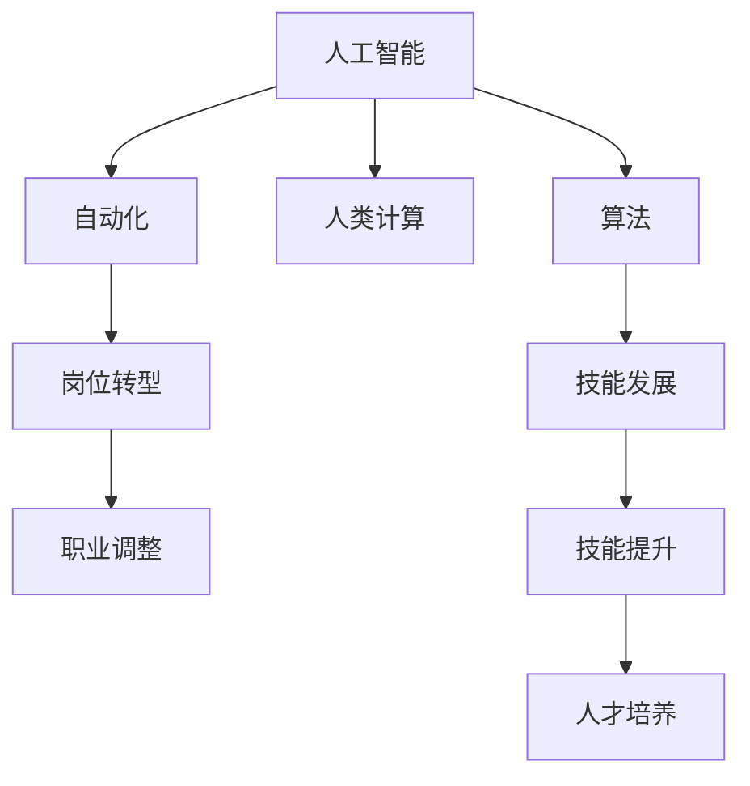

                 

# 人类计算：AI时代的未来就业市场与技能发展预测

> 关键词：人工智能,未来就业,技能发展,人类计算,岗位转型

## 1. 背景介绍

### 1.1 问题由来
随着人工智能(AI)技术的快速发展，未来就业市场正面临前所未有的变革。人工智能的兴起不仅改变了传统行业的运作模式，也催生了大量新兴职业。同时，AI的广泛应用也在加速就业市场的调整和分化。面对这一趋势，理解AI时代未来就业市场的变化，掌握AI时代必备的技能，成为每个职场人士的迫切需求。

### 1.2 问题核心关键点
- 人工智能技术的进步将如何影响各个行业和岗位。
- 未来就业市场对技能的要求将有何变化。
- 在AI时代，如何更好地适应和利用新技术。
- AI时代的技能发展趋势和未来职业形态。
- 企业如何有效培养和引进AI时代的技能人才。

### 1.3 问题研究意义
研究AI时代的就业市场和技能发展趋势，对于理解AI技术对经济社会的影响、帮助职场人士规划职业发展路径、指导企业制定人才培养策略，具有重要意义。

## 2. 核心概念与联系

### 2.1 核心概念概述

为更好地理解AI时代就业市场的变化和技能发展趋势，本节将介绍几个关键概念：

- 人工智能(Artificial Intelligence, AI)：指模拟人类智能行为的技术体系，包括机器学习、深度学习、自然语言处理等分支。
- 自动化(Automation)：通过AI技术实现工作流程的自动化，包括机器人流程自动化(RPA)、自然语言处理(NLP)等。
- 人类计算(Human Computation)：指利用人类智慧和创造力，结合AI技术，共同解决复杂问题的计算范式。
- 算法(Architecture)：指实现AI功能的计算步骤和原理，包括模型构建、优化、评估等过程。
- 岗位转型(Job Transformation)：指AI技术应用后，原有岗位角色、职责和需求的变化。
- 技能发展(Skill Development)：指在AI时代，职场人士需要培养和提升的新技能。

这些概念之间的联系可以通过以下Mermaid流程图来展示：



这个流程图展示了几大关键概念之间的逻辑关系：

1. 人工智能技术的发展，通过自动化，影响岗位角色的变化。
2. 人类计算范式的引入，赋予AI更加灵活和富有创造力的能力。
3. 算法的创新，推动技术应用的进步，引发岗位需求的调整。
4. 岗位转型导致职业形态的演变，进而影响技能的发展。
5. 技能发展为人才的培养提供了方向，助力职场人士的职业生涯规划。

这些概念共同构成了AI时代就业市场和技能发展的宏观框架，为我们理解和应对未来的变革提供了理论基础。

## 3. 核心算法原理 & 具体操作步骤
### 3.1 算法原理概述

AI时代的就业市场和技能发展预测，本质上是一个多因素、多变量的预测模型构建问题。其核心思想是：利用历史数据和AI算法，建立模型预测未来就业市场的变化和技能发展的趋势。

形式化地，假设历史数据为 $\mathcal{D}=\{(X_i,Y_i)\}_{i=1}^N$，其中 $X_i$ 为输入变量（如技术趋势、经济指标等），$Y_i$ 为输出变量（如岗位需求、技能需求等）。目标是找到模型 $M$，使得模型在新的输入数据上能够准确预测输出。

预测模型的建立通常包括数据预处理、特征工程、模型选择与训练、模型评估与优化等步骤。具体来说：

1. **数据预处理**：对原始数据进行清洗、归一化、降维等处理，准备模型训练。
2. **特征工程**：从原始数据中提取对预测有影响的特征，进行特征选择和工程设计。
3. **模型选择与训练**：根据预测问题选择合适的模型，如回归模型、分类模型、序列模型等，使用历史数据对模型进行训练。
4. **模型评估与优化**：使用测试集评估模型性能，通过交叉验证、超参数调优等方法优化模型。
5. **预测与应用**：使用优化后的模型对新的输入数据进行预测，并应用于职业规划、人才培养等场景。

### 3.2 算法步骤详解

以下是AI时代就业市场和技能发展预测的核心算法步骤：

**Step 1: 数据收集与处理**
- 收集相关领域的经济数据、技术发展、岗位需求等历史数据。
- 对数据进行清洗、筛选、去重，确保数据质量和一致性。
- 将数据按时间序列排列，便于进行时间趋势分析。

**Step 2: 特征工程**
- 分析数据特征，提取对预测有影响的变量，如技术创新频率、行业增长率、教育背景等。
- 进行特征选择，确定对模型预测贡献最大的特征。
- 进行特征工程设计，如特征标准化、特征降维等，提高模型效率。

**Step 3: 模型选择与训练**
- 选择合适的预测模型，如线性回归、随机森林、神经网络等。
- 对模型进行训练，使用历史数据调整模型参数，确保模型准确度。
- 使用交叉验证等方法对模型进行调优，防止过拟合。

**Step 4: 模型评估与优化**
- 使用测试集对模型进行评估，计算预测误差、R²值等指标。
- 对模型进行优化，调整参数、增加特征等，提高预测精度。
- 进行模型稳健性测试，确保模型在不同数据分布上的表现一致。

**Step 5: 预测与应用**
- 使用优化后的模型对新的输入数据进行预测，获取未来就业市场和技能发展的趋势。
- 结合实际情况，制定职业规划、人才培养等策略。
- 持续收集新数据，更新模型，确保预测的准确性。

### 3.3 算法优缺点

AI时代的就业市场和技能发展预测方法具有以下优点：
1. 数据驱动：通过历史数据训练模型，能够更准确地预测未来趋势。
2. 多因素分析：考虑经济、技术、教育等多因素，提供更全面的预测。
3. 灵活可调：模型选择和参数调整灵活，能够适应不同的预测任务。
4. 可扩展性：模型可应用于不同行业和岗位，具有广泛的适用性。

同时，该方法也存在一些局限性：
1. 数据质量依赖：预测结果依赖于数据的质量和全面性，数据偏差可能导致预测误差。
2. 模型复杂性：复杂的模型可能存在解释性不足的问题，难以理解模型内部逻辑。
3. 预测不确定性：由于未来数据未知，预测结果存在一定的不确定性。
4. 技术门槛较高：需要具备数据科学、机器学习等专业知识，对一般职场人士有较高要求。

尽管存在这些局限性，但AI时代就业市场和技能发展预测方法仍是目前研究和应用的热点，其预测结果对于政策制定、教育培训、职业规划等领域具有重要参考价值。

### 3.4 算法应用领域

AI时代就业市场和技能发展预测方法，已经在多个领域得到广泛应用，例如：

- 人力资源管理：帮助企业制定岗位需求预测、人才储备规划等策略。
- 教育培训：指导教育机构调整课程设置、优化教学方法。
- 政策制定：为政府部门制定就业政策、技能培训计划提供数据支持。
- 职业规划：帮助职场人士根据市场需求，进行职业发展路径规划。
- 企业发展：指导企业进行技术创新、岗位优化，提升竞争力。

除了上述这些经典应用外，AI时代就业市场和技能发展预测方法还在新兴职业发展、产业升级、人才迁移等方面展现出巨大的潜力，为经济社会发展提供了重要参考。

## 4. 数学模型和公式 & 详细讲解 & 举例说明

### 4.1 数学模型构建

本节将使用数学语言对AI时代就业市场和技能发展预测模型进行更详细的描述。

假设预测模型的输入变量为 $X$，输出变量为 $Y$，模型为 $M$。预测模型的目标是最小化预测误差 $E(Y,\hat{Y})$，其中 $\hat{Y}=M(X)$ 为模型的预测结果。

预测误差通常通过均方误差(MSE)或均方根误差(RMSE)来衡量：

$$
E(Y,\hat{Y}) = \frac{1}{N}\sum_{i=1}^N (Y_i-\hat{Y}_i)^2
$$

预测模型的构建通常包括以下步骤：

1. **数据预处理**：使用标准化、归一化等方法处理数据，确保数据格式一致。
2. **特征工程**：提取对预测有影响的特征，如技术创新频率、行业增长率、教育背景等。
3. **模型训练**：选择合适的预测模型，如线性回归、随机森林、神经网络等，使用历史数据对模型进行训练。
4. **模型评估**：使用测试集对模型进行评估，计算预测误差、R²值等指标。
5. **模型优化**：调整模型参数，增加特征等，提高模型准确度。

### 4.2 公式推导过程

以下我们将以线性回归模型为例，推导预测误差公式及其梯度计算方法。

假设线性回归模型为：

$$
\hat{Y} = \theta_0 + \theta_1X_1 + \theta_2X_2 + ... + \theta_pX_p
$$

其中 $\theta_0,\theta_1,...,\theta_p$ 为模型参数。预测误差为：

$$
E(Y,\hat{Y}) = \frac{1}{N}\sum_{i=1}^N (Y_i-\hat{Y}_i)^2
$$

对上述误差函数求梯度，得：

$$
\frac{\partial E}{\partial \theta_j} = \frac{2}{N}\sum_{i=1}^N (Y_i-\hat{Y}_i)(-X_i^j)
$$

其中 $X_i^j$ 为 $X_i$ 的第 $j$ 个特征。根据梯度下降算法，对模型参数进行更新：

$$
\theta_j \leftarrow \theta_j - \eta\frac{\partial E}{\partial \theta_j}
$$

其中 $\eta$ 为学习率，控制模型参数更新的步长。

### 4.3 案例分析与讲解

考虑一个简单案例，预测某个技术领域的就业需求变化。假设收集了过去10年的数据，包含了技术创新频率、行业增长率、教育背景等特征。使用线性回归模型进行预测，步骤如下：

1. **数据预处理**：对原始数据进行清洗、归一化、降维等处理。
2. **特征工程**：提取对就业需求有影响的特征，如技术创新频率、行业增长率、教育背景等。
3. **模型训练**：选择线性回归模型，使用历史数据对模型进行训练，调整参数 $\theta_0,\theta_1,...,\theta_p$。
4. **模型评估**：使用测试集对模型进行评估，计算预测误差、R²值等指标。
5. **模型优化**：对模型进行调优，增加特征、调整参数等，提高模型准确度。

最终，通过优化后的模型可以对未来的就业需求进行预测，为政策制定、教育培训、职业规划等领域提供数据支持。

## 5. 项目实践：代码实例和详细解释说明
### 5.1 开发环境搭建

在进行AI时代就业市场和技能发展预测实践前，我们需要准备好开发环境。以下是使用Python进行Python进行Scikit-learn开发的流程：

1. 安装Anaconda：从官网下载并安装Anaconda，用于创建独立的Python环境。

2. 创建并激活虚拟环境：
```bash
conda create -n sklearn-env python=3.8 
conda activate sklearn-env
```

3. 安装Scikit-learn：
```bash
pip install -U scikit-learn
```

4. 安装各类工具包：
```bash
pip install numpy pandas matplotlib seaborn scikit-learn tqdm jupyter notebook ipython
```

完成上述步骤后，即可在`sklearn-env`环境中开始预测实践。

### 5.2 源代码详细实现

下面我们以预测技术领域的就业需求为例，给出使用Scikit-learn库进行线性回归的Python代码实现。

首先，定义数据处理函数：

```python
import pandas as pd
from sklearn.model_selection import train_test_split

def load_data(file_path):
    data = pd.read_csv(file_path)
    X = data[['技术创新频率', '行业增长率', '教育背景']]
    Y = data['就业需求']
    return X, Y

X, Y = load_data('就业数据.csv')
```

然后，定义模型训练函数：

```python
from sklearn.linear_model import LinearRegression
from sklearn.metrics import mean_squared_error, r2_score

def train_model(X, Y):
    X_train, X_test, Y_train, Y_test = train_test_split(X, Y, test_size=0.2, random_state=42)
    model = LinearRegression()
    model.fit(X_train, Y_train)
    Y_pred = model.predict(X_test)
    mse = mean_squared_error(Y_test, Y_pred)
    r2 = r2_score(Y_test, Y_pred)
    return mse, r2
```

接着，训练模型并评估：

```python
mse, r2 = train_model(X, Y)
print(f'均方误差: {mse:.2f}')
print(f'R²值: {r2:.2f}')
```

以上就是使用Scikit-learn库进行线性回归的预测模型的完整代码实现。可以看到，使用Scikit-learn库进行机器学习模型的开发，代码实现非常简洁高效。

### 5.3 代码解读与分析

让我们再详细解读一下关键代码的实现细节：

**load_data函数**：
- 定义数据处理函数，加载就业数据文件，将特征数据和目标数据分离。
- 返回分离后的特征和目标数据。

**train_model函数**：
- 定义模型训练函数，将数据分为训练集和测试集，使用线性回归模型进行训练。
- 返回训练后的模型在测试集上的预测误差和R²值。
- 使用sklearn的train_test_split函数，方便进行数据划分和模型评估。
- 使用sklearn的LinearRegression模型，实现线性回归的预测。
- 使用sklearn的mean_squared_error和r2_score函数，计算预测误差和R²值。

**训练模型并评估**：
- 调用训练函数，获取训练后的模型预测误差和R²值。
- 使用print函数，输出预测误差和R²值，进行模型评估。

可以看到，Scikit-learn库的强大封装使得模型训练和评估变得非常简单，开发者可以将更多精力放在数据处理、模型优化等核心逻辑上。

当然，实际应用中还需要针对具体任务进行优化设计，如模型选择、特征工程、超参数调优等。但核心的预测范式基本与此类似。

## 6. 实际应用场景
### 6.1 人力资源管理

AI时代就业市场和技能发展预测方法，可以帮助人力资源部门制定更科学、更高效的岗位需求预测和人才储备策略。通过分析历史数据，结合技术发展趋势和经济指标，预测未来的人才需求，优化招聘计划和员工培训，提升企业竞争力。

### 6.2 教育培训

在教育培训领域，预测方法可以指导教育机构调整课程设置、优化教学方法。通过分析学生就业趋势和技术发展需求，设计符合市场需求的课程体系，提升教育质量，增强学生的就业竞争力。

### 6.3 政策制定

政府部门可以利用预测方法，制定更科学合理的就业政策和技能培训计划。通过分析经济、技术、教育等多元数据，预测未来就业市场变化，制定有针对性的政策，促进就业和经济发展。

### 6.4 职业规划

职场人士可以利用预测方法，制定个人职业发展路径。通过分析技术趋势和岗位需求，选择符合未来发展的职业方向，提升自身技能，增强就业竞争力。

### 6.5 企业发展

企业可以利用预测方法，指导技术创新和岗位优化。通过分析市场变化和技术趋势，调整产品线和业务策略，提升企业竞争力，适应市场变化。

### 6.6 新兴职业发展

预测方法还可以分析新兴职业的发展趋势，为职业教育和职业培训提供数据支持。通过预测未来新兴职业的需求和技能要求，设计符合市场需求的教育培训课程，为职业人士提供更多职业发展机会。

### 6.7 产业升级

预测方法可以帮助产业升级，通过分析技术趋势和市场需求，指导产业转型和升级，提高产业竞争力。

### 6.8 人才迁移

预测方法还可以分析人才迁移趋势，为区域发展提供数据支持。通过预测人才流动的趋势，优化区域人才政策，吸引人才，促进区域经济发展。

## 7. 工具和资源推荐
### 7.1 学习资源推荐

为了帮助开发者系统掌握AI时代就业市场和技能发展预测的理论基础和实践技巧，这里推荐一些优质的学习资源：

1. 《Python数据科学手册》：详细介绍了Python在数据科学和机器学习中的应用，适合初学者和进阶者。
2. 《统计学习方法》：清华大学机器学习课程，全面介绍了机器学习的基本原理和应用，是学习机器学习的重要参考资料。
3. 《深度学习》：斯坦福大学深度学习课程，涵盖深度学习的基本概念和前沿技术，适合深入理解AI技术的原理。
4. Kaggle平台：提供了大量的机器学习竞赛和数据集，适合实战练习和数据探索。
5. Coursera、edX等在线教育平台：提供了大量的AI和数据科学课程，适合系统学习。

通过对这些资源的学习实践，相信你一定能够快速掌握AI时代就业市场和技能发展预测的精髓，并用于解决实际的就业市场问题。

### 7.2 开发工具推荐

高效的开发离不开优秀的工具支持。以下是几款用于AI时代就业市场和技能发展预测开发的常用工具：

1. Python：作为机器学习和数据科学的主流语言，Python拥有丰富的机器学习库和数据处理工具。
2. Jupyter Notebook：提供了交互式编程环境，方便数据探索和模型调试。
3. TensorBoard：提供了模型训练和评估的可视化工具，方便模型调优和调试。
4. PyTorch：开源深度学习框架，提供了灵活的计算图和高效的模型训练工具。
5. Scikit-learn：提供了丰富的机器学习算法和工具，适合快速原型开发。

合理利用这些工具，可以显著提升AI时代就业市场和技能发展预测的开发效率，加快创新迭代的步伐。

### 7.3 相关论文推荐

AI时代就业市场和技能发展预测领域的研究已经取得了显著进展。以下是几篇奠基性的相关论文，推荐阅读：

1. 《人工智能与就业市场》（Artificial Intelligence and the Labor Market）：通过对历史数据和现实市场的分析，探讨AI技术对就业市场的影响。
2. 《技术创新与就业增长》（Technological Innovation and Employment Growth）：分析技术创新对就业市场的影响，提供数据支持和政策建议。
3. 《技能需求变化与教育培训》（Skill Demand Changes and Education and Training）：通过分析未来技能需求的变化，指导教育培训政策的制定。
4. 《未来职业发展与AI技术》（Future Career Development and AI Technology）：探讨AI技术对未来职业形态的影响，提供职业规划建议。
5. 《数据驱动的就业预测模型》（Data-Driven Employment Forecasting Model）：介绍数据驱动的预测模型构建方法，适用于各类就业预测场景。

这些论文代表了大语言模型微调技术的发展脉络。通过学习这些前沿成果，可以帮助研究者把握学科前进方向，激发更多的创新灵感。

## 8. 总结：未来发展趋势与挑战

### 8.1 总结

本文对AI时代就业市场和技能发展预测方法进行了全面系统的介绍。首先阐述了AI技术对就业市场和技能发展的影响，明确了预测方法在理解未来趋势、指导职业规划和人才培养中的重要性。其次，从原理到实践，详细讲解了预测模型的构建过程和关键步骤，给出了预测任务开发的完整代码实例。同时，本文还广泛探讨了预测方法在人力资源管理、教育培训、政策制定等多个领域的应用前景，展示了预测范式的广泛适用性。

通过本文的系统梳理，可以看到，AI时代就业市场和技能发展预测方法正在成为AI技术应用的重要范式，极大地拓展了数据科学在经济社会发展中的作用。未来，伴随预测方法的不断进步，能够提供更全面、更精准的预测结果，为政策制定、企业决策和职业规划提供有力支持。

### 8.2 未来发展趋势

展望未来，AI时代就业市场和技能发展预测方法将呈现以下几个发展趋势：

1. **数据质量的提升**：未来，随着数据采集和处理技术的进步，数据质量将得到显著提升，预测结果也将更加准确。
2. **多模态数据的融合**：未来，预测模型将融合多种数据源，如文本、图像、视频等，提供更全面的分析结果。
3. **跨领域应用**：未来，预测方法将在更多领域得到应用，如医疗、金融、教育等，为各行各业提供数据支持。
4. **实时预测能力**：未来，预测模型将具备实时预测能力，及时响应市场变化，提供动态的决策支持。
5. **个性化预测**：未来，预测模型将提供个性化预测，根据个人特征和偏好，提供定制化的职业规划和发展建议。

这些趋势凸显了AI时代就业市场和技能发展预测方法的重要性和未来前景，为经济社会的发展提供了强有力的数据支持。

### 8.3 面临的挑战

尽管AI时代就业市场和技能发展预测方法已经取得了显著进展，但在迈向更加智能化、普适化应用的过程中，它仍面临着诸多挑战：

1. **数据获取的难度**：高质量、全面、实时数据的获取是预测模型的基础，但数据获取和处理过程复杂，成本较高。
2. **模型复杂性**：预测模型的构建和调优过程复杂，需要具备丰富的数据科学和机器学习知识，对一般职场人士有较高要求。
3. **预测不确定性**：由于未来数据未知，预测结果存在一定的不确定性，难以完全准确反映市场变化。
4. **技术更新迅速**：AI技术和市场需求变化迅速，预测模型需要不断更新和优化，以保持预测的准确性。
5. **伦理和隐私问题**：预测模型在收集和使用数据过程中，可能涉及隐私和伦理问题，需要谨慎处理。

尽管存在这些挑战，但AI时代就业市场和技能发展预测方法的研究方向和应用前景广阔，相信随着技术的不断进步，这些挑战终将逐步克服，预测方法将在更多领域发挥重要作用。

### 8.4 研究展望

面对AI时代就业市场和技能发展预测所面临的挑战，未来的研究需要在以下几个方面寻求新的突破：

1. **多源数据融合**：通过融合多种数据源，提高预测模型的全面性和准确性。
2. **实时数据处理**：发展实时数据处理技术，实现预测模型的实时更新和预测。
3. **个性化预测算法**：研究个性化预测算法，提供定制化的职业规划和发展建议。
4. **模型解释性**：提高预测模型的可解释性，增强对预测结果的理解和信任。
5. **隐私保护技术**：发展隐私保护技术，确保数据使用的合法性和安全性。

这些研究方向将推动AI时代就业市场和技能发展预测方法走向更加智能化、普适化，为经济社会的发展提供更加全面和可靠的数据支持。面向未来，预测方法还需要与其他AI技术进行更深入的融合，如因果推理、强化学习等，共同推动经济社会的智能化转型。总之，预测方法需要在数据、算法、工程、伦理等多个维度进行全面优化，方能真正实现其在就业市场和技能发展中的应用价值。

## 9. 附录：常见问题与解答

**Q1：AI时代就业市场和技能发展预测是否适用于所有行业和岗位？**

A: AI时代就业市场和技能发展预测方法在大多数行业和岗位上都能取得不错的效果。但对于一些特定领域的岗位，如医疗、法律等，需要根据具体任务进行优化，才能获得理想的预测结果。

**Q2：预测模型如何选择合适的特征？**

A: 预测模型特征的选择需要考虑特征的代表性、相关性和区分度。通常通过特征工程方法，如主成分分析(PCA)、线性判别分析(LDA)等，提取对预测有影响的特征。特征选择还需要考虑特征的数量和计算效率，避免过度拟合。

**Q3：预测模型在实际应用中需要注意哪些问题？**

A: 预测模型在实际应用中需要注意以下问题：
1. 数据质量：确保数据的准确性和完整性，避免数据偏差影响预测结果。
2. 模型解释性：提高模型的可解释性，增强对预测结果的理解和信任。
3. 实时更新：定期更新模型，反映最新的数据变化。
4. 数据隐私：在数据收集和使用过程中，注意隐私保护和伦理问题。
5. 应用场景：根据具体应用场景，调整模型参数和优化算法。

**Q4：预测模型如何应对未来的技术变革？**

A: 预测模型需要不断更新和优化，以应对未来的技术变革。可以定期重新训练模型，加入新的数据和特征，提高预测的准确性和时效性。同时，结合新算法和新工具，不断改进预测模型，使其能够适应新的技术趋势和市场需求。

**Q5：AI时代就业市场和技能发展预测对职场人士有何帮助？**

A: AI时代就业市场和技能发展预测方法可以帮助职场人士理解未来就业趋势，制定科学的职业规划和发展路径。通过分析技术趋势和岗位需求，选择符合未来发展的职业方向，提升自身技能，增强就业竞争力。同时，预测方法还可以提供个性化的职业建议，帮助职场人士更好地适应未来的就业环境。

---

作者：禅与计算机程序设计艺术 / Zen and the Art of Computer Programming

