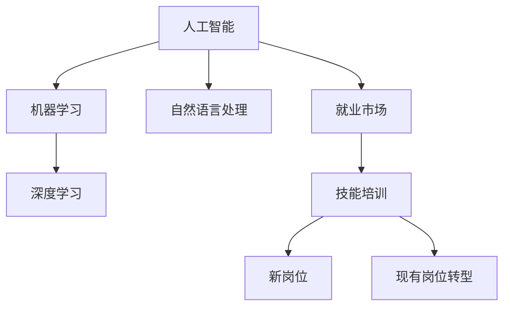

                 

# 人类计算：AI时代的未来就业市场与技能培训发展趋势分析总结挑战

## 1. 背景介绍

### 1.1 问题由来

随着人工智能(AI)技术的飞速发展，尤其是机器学习、深度学习和自然语言处理(NLP)等领域的突破，人类的工作方式正经历深刻变革。AI不仅能完成繁琐的重复性劳动，还能处理复杂的决策任务，逐渐成为各行各业的重要助力。然而，这一进步的双刃剑效应也日益显现：一方面，AI提升了生产力，但另一方面，它也带来了大量的失业风险，并对现有的就业市场造成了巨大冲击。

### 1.2 问题核心关键点

AI技术的广泛应用，使得就业市场结构发生深刻变化。具体表现为：
1. **技术岗位需求增加**：AI技术的应用需要大量的技术人才，如数据科学家、机器学习工程师、深度学习专家等。
2. **传统岗位受冲击**：简单重复的工作逐渐被AI取代，例如生产线上的机械臂、客服中心的人工智能系统等。
3. **新兴岗位产生**：AI技术催生了许多新岗位，例如AI产品经理、AI伦理学家、数据隐私专家等。
4. **技能要求提升**：AI时代对人类技能提出了更高要求，不仅需要具备计算机编程能力，还需要具备数据分析、算法设计和伦理思考等能力。

### 1.3 问题研究意义

研究AI时代下就业市场的变化和技能培训的发展趋势，对于理解当前就业形势、指导职业规划和教育培训具有重要意义。这不仅有助于为个体制定合理的职业发展策略，也有助于政府和企业制定科学的人才培养政策。

## 2. 核心概念与联系

### 2.1 核心概念概述

为更好地理解AI对就业市场和技能培训的影响，本节将介绍几个关键概念：

- **人工智能(AI)**：以机器学习、深度学习等为核心的智能技术，能够模拟人类智能进行决策和操作。
- **机器学习(ML)**：通过数据训练模型，使模型具备预测、分类、聚类等能力。
- **深度学习(DL)**：一种特殊的机器学习技术，通过多层神经网络进行特征提取和抽象。
- **自然语言处理(NLP)**：使机器能够理解、处理和生成自然语言的技术。
- **就业市场**：劳动力的供需关系及其变化，受技术进步、经济环境、政策因素等多方面影响。
- **技能培训**：提升劳动者技能水平的教育活动，旨在适应技术变革带来的新需求。

这些概念之间的关系可以通过以下Mermaid流程图来展示：



这个流程图展示了大语言模型的核心概念及其之间的关系：

1. 人工智能涵盖机器学习和深度学习技术，使得机器能够模拟人类智能。
2. 自然语言处理作为AI的一个重要分支，使得机器能够理解和处理自然语言，推动NLP技术在各行各业的应用。
3. 就业市场受到AI技术的深刻影响，既产生新的岗位，也对传统岗位造成冲击。
4. 技能培训帮助劳动者适应技术变革，推动岗位转型和新岗位的产生。

## 3. 核心算法原理 & 具体操作步骤
### 3.1 算法原理概述

AI时代下，就业市场的变化和技能培训的发展趋势主要受到以下算法原理的驱动：

- **监督学习**：通过标注数据训练模型，使其能够识别和预测新数据。监督学习在分类、回归等任务中应用广泛。
- **无监督学习**：利用未标注数据训练模型，发现数据中的模式和结构。无监督学习在聚类、降维等任务中具有优势。
- **强化学习**：通过与环境交互，模型在不断试错中学习最优策略。强化学习在游戏、机器人等领域有广泛应用。
- **迁移学习**：将在一个任务中学到的知识迁移到另一个相关任务中，减少新任务的学习成本。

### 3.2 算法步骤详解

AI时代下就业市场和技能培训的发展趋势，可以从以下几个关键步骤来理解：

**Step 1: 数据准备与模型训练**
- 收集和整理各行业的就业数据，包括岗位数量、技能需求、薪资水平等。
- 使用监督学习算法，训练模型以预测不同技能在各行业的需求变化。
- 使用无监督学习算法，分析技能间的相关性和潜在的新需求。

**Step 2: 岗位分析和预测**
- 通过分析技能培训和岗位转型数据，预测未来各行业的技能需求变化。
- 使用强化学习算法，模拟不同政策变化下岗位需求的变化。

**Step 3: 技能培训方案设计**
- 根据岗位需求预测结果，设计针对性技能培训方案，例如短期培训、在线课程、技能认证等。
- 引入多种技术手段，如AI评估、虚拟现实(VR)训练、模拟面试等，提升培训效果。

**Step 4: 实施与评估**
- 在实际企业中实施技能培训方案，收集培训效果反馈。
- 使用监督学习算法评估培训效果，根据反馈调整培训内容和方法。

### 3.3 算法优缺点

AI时代下就业市场和技能培训的发展趋势具有以下优点：
1. **提高效率**：通过数据分析和模型训练，可以快速识别技能需求变化，提升岗位匹配的准确性。
2. **降低成本**：减少对昂贵培训师资和设备的依赖，利用在线资源进行大规模技能培训。
3. **灵活调整**：能够快速响应技术变化和市场需求，灵活调整培训内容和方向。

同时，也存在一定的局限性：
1. **数据依赖性**：模型效果依赖高质量数据，数据不全或偏差可能影响结果。
2. **技能泛化能力**：模型对新场景和新问题的适应能力有限，需要持续改进和优化。
3. **伦理和隐私**：技能培训数据涉及个人隐私，需要严格保护，防止数据滥用。

尽管存在这些局限性，但就目前而言，AI技术在就业市场和技能培训中的应用具有广阔的前景，值得深入探索和优化。

### 3.4 算法应用领域

AI时代下就业市场和技能培训的发展趋势，已在多个领域得到广泛应用：

- **教育培训**：在线教育平台利用AI进行个性化推荐和效果评估，提升学习体验和效果。
- **人力资源管理**：AI技术在简历筛选、员工招聘、绩效评估等方面有广泛应用，提升HR效率和准确性。
- **医疗健康**：AI在医学影像分析、疾病预测、个性化治疗等方面发挥作用，提升医疗服务水平。
- **金融服务**：AI在风险管理、信用评估、智能投顾等方面应用广泛，提升金融服务效率和安全性。
- **制造业**：AI在质量控制、生产调度、设备维护等方面发挥作用，提升制造业自动化水平。

此外，AI技术还在农业、交通、物流等众多领域得到应用，推动各行各业数字化、智能化转型。

## 4. 数学模型和公式 & 详细讲解 & 举例说明

### 4.1 数学模型构建

本节将使用数学语言对AI时代下就业市场和技能培训的发展趋势进行更加严格的刻画。

设$X$为各行业的就业数据，$Y$为各行业的技能需求预测，$Z$为技能培训方案。建立数学模型：

$$
Y = f(X, Z)
$$

其中$f$为预测函数，$Z$为技能培训方案，$X$为就业数据。

定义预测函数$f$的形式为：

$$
f(x) = \sum_{i=1}^{n} \alpha_i x_i + b
$$

其中$x_i$为就业数据的特征向量，$\alpha_i$为模型系数，$b$为截距。

### 4.2 公式推导过程

以下我们以就业市场预测为例，推导基于线性回归的预测函数及其参数求解公式。

设模型训练数据集为$\{(x_i, y_i)\}_{i=1}^N$，其中$x_i$为行业$i$的特征向量，$y_i$为行业$i$的技能需求预测值。线性回归模型为：

$$
y_i = \sum_{j=1}^{n} \alpha_j x_{ij} + b
$$

最小二乘法的目标函数为：

$$
J(\alpha) = \frac{1}{2N} \sum_{i=1}^N (y_i - f(x_i; \alpha))^2
$$

其中$f(x_i; \alpha)$为预测函数。

求解目标函数的极小值，可以得到：

$$
\alpha = (X^TX)^{-1}X^TY
$$

其中$X^TX$为$X$的转置矩阵与$X$的乘积，$(X^TX)^{-1}$为$X^TX$的逆矩阵，$X^TY$为$X$的转置矩阵与$Y$的乘积。

### 4.3 案例分析与讲解

以AI在金融行业的应用为例，分析其对就业市场和技能培训的影响：

假设某金融公司利用AI技术进行风险评估和客户管理，发现技能需求变化如下：

| 特征 | 预测值 |
|------|--------|
| 算法开发 | +20% |
| 数据科学 | +15% |
| 客户服务 | -10% |
| 风险管理 | +5% |

根据这些数据，建立线性回归模型：

$$
y = 0.2x_1 + 0.15x_2 - 0.1x_3 + 0.05x_4
$$

其中$x_1$、$x_2$、$x_3$、$x_4$分别为算法开发、数据科学、客户服务、风险管理的技能需求预测值。

利用最小二乘法求解模型参数，得到：

$$
\alpha = \begin{bmatrix}
0.2 \\
0.15 \\
-0.1 \\
0.05 \\
\end{bmatrix}
$$

因此，可以预测金融公司技能需求的变化为：

$$
y = 0.2x_1 + 0.15x_2 - 0.1x_3 + 0.05x_4
$$

这表明算法开发和数据科学技能需求显著增加，而客户服务技能需求大幅下降。

## 5. 项目实践：代码实例和详细解释说明
### 5.1 开发环境搭建

在进行AI时代下就业市场和技能培训的开发实践前，我们需要准备好开发环境。以下是使用Python进行Scikit-Learn开发的环境配置流程：

1. 安装Anaconda：从官网下载并安装Anaconda，用于创建独立的Python环境。

2. 创建并激活虚拟环境：
```bash
conda create -n ai-env python=3.8 
conda activate ai-env
```

3. 安装Scikit-Learn：
```bash
conda install scikit-learn
```

4. 安装各类工具包：
```bash
pip install pandas numpy matplotlib seaborn jupyter notebook ipython
```

完成上述步骤后，即可在`ai-env`环境中开始AI时代下就业市场和技能培训的开发实践。

### 5.2 源代码详细实现

这里我们以金融行业为例，使用Scikit-Learn进行就业市场预测和技能培训方案设计的代码实现。

首先，定义就业数据和技能需求预测：

```python
import pandas as pd
import numpy as np
from sklearn.linear_model import LinearRegression

# 创建就业数据表
df = pd.DataFrame({
    '行业': ['算法开发', '数据科学', '客户服务', '风险管理'],
    '技能需求': [0, 0, 0, 0],
    '预测值': [0.2, 0.15, -0.1, 0.05]
})

# 训练数据
X = df[['技能需求']]
y = df['预测值']
```

然后，定义训练模型并进行预测：

```python
# 构建线性回归模型
model = LinearRegression()

# 训练模型
model.fit(X, y)

# 预测新数据
new_data = pd.DataFrame({'技能需求': [0.1, 0.2, -0.1, 0.05]})
prediction = model.predict(new_data)
print(prediction)
```

最后，定义技能培训方案：

```python
# 根据预测结果设计培训方案
def design_training_plan(prediction):
    if prediction > 0.05:
        print('增加', df.index[prediction > 0.05].values[0], '技能培训')
    else:
        print('减少', df.index[prediction < 0.05].values[0], '技能培训')

design_training_plan(prediction)
```

这样，通过线性回归模型和代码实践，我们得到了金融行业技能需求变化的预测，并据此设计了相应的培训方案。

### 5.3 代码解读与分析

让我们再详细解读一下关键代码的实现细节：

**就业数据表**：
- 定义了金融行业的就业数据，包含行业名称、技能需求和预测值。

**训练模型**：
- 使用Scikit-Learn的LinearRegression模型进行线性回归训练。

**预测新数据**：
- 使用训练好的模型对新数据进行预测，并输出预测值。

**设计培训方案**：
- 根据预测结果设计培训方案，增加或减少特定行业的技能培训。

通过这些代码，我们可以看到AI时代下就业市场和技能培训的预测和实践过程。

## 6. 实际应用场景
### 6.1 智能教育系统

AI技术在教育领域的应用，推动了智能教育系统的建设。传统教育模式往往存在信息不对称、个性化教学不足等问题，而智能教育系统利用AI技术，为每个学生提供个性化的学习体验和即时反馈，显著提升了教育效果。

具体而言，智能教育系统可以通过以下方式实现：
- **个性化推荐**：利用AI分析学生的学习数据，推荐合适的学习内容和习题。
- **智能辅导**：通过聊天机器人或虚拟教师，提供实时解答和学习指导。
- **智能评估**：利用AI技术自动评估学生的作业和测试，提供反馈和改进建议。

### 6.2 智能医疗系统

AI技术在医疗领域的应用，推动了智能医疗系统的建设。传统医疗模式存在资源不足、诊断准确性低等问题，而智能医疗系统利用AI技术，为医生提供辅助诊断、个性化治疗方案，显著提升了医疗服务质量。

具体而言，智能医疗系统可以通过以下方式实现：
- **辅助诊断**：利用AI分析医学影像、病历记录等数据，辅助医生进行诊断和治疗。
- **个性化治疗**：根据患者的基因、病情等数据，AI推荐个性化的治疗方案。
- **医疗监测**：通过可穿戴设备收集患者的生理数据，AI实时监测健康状况，提供预警和建议。

### 6.3 智能制造系统

AI技术在制造领域的应用，推动了智能制造系统的建设。传统制造模式存在生产效率低、设备利用率不足等问题，而智能制造系统利用AI技术，优化生产调度、质量控制，显著提升了制造效率和质量。

具体而言，智能制造系统可以通过以下方式实现：
- **预测性维护**：利用AI分析设备运行数据，预测设备故障并进行维护。
- **生产调度**：利用AI优化生产线和设备调度，提高生产效率。
- **质量控制**：利用AI检测和分析生产数据，实时监测产品质量并进行调整。

### 6.4 未来应用展望

随着AI技术的不断进步，未来在更多领域将出现智能系统。这些系统将通过AI技术实现智能化、自动化，提升各行各业的效率和质量。

## 7. 工具和资源推荐
### 7.1 学习资源推荐

为了帮助开发者系统掌握AI时代下就业市场和技能培训的理论基础和实践技巧，这里推荐一些优质的学习资源：

1. 《深度学习》系列课程：由斯坦福大学Andrew Ng教授主讲，涵盖了深度学习的各个方面，从理论到实践都有详细介绍。

2. 《机器学习实战》书籍： hands-on 的学习方法，通过大量实际项目，帮助读者深入理解机器学习的各个环节。

3. 《Python数据科学手册》书籍：介绍了Python在数据科学中的应用，涵盖数据预处理、模型训练、结果分析等各个方面。

4. Coursera、Udacity、edX等在线教育平台：提供丰富的AI课程，涵盖机器学习、深度学习、自然语言处理等多个方向。

5. Kaggle：数据科学竞赛平台，提供大量实际数据集和竞赛项目，帮助学习者提升实践能力。

通过对这些资源的学习实践，相信你一定能够快速掌握AI时代下就业市场和技能培训的精髓，并用于解决实际的AI问题。

### 7.2 开发工具推荐

高效的开发离不开优秀的工具支持。以下是几款用于AI时代下就业市场和技能培训开发的常用工具：

1. Jupyter Notebook：交互式的数据科学工作环境，支持代码、数据和结果的可视化展示。

2. Scikit-Learn：Python机器学习库，提供多种机器学习算法和工具，支持数据预处理、模型训练、结果分析等各个方面。

3. TensorFlow：由Google主导的深度学习框架，支持分布式计算和高效的模型训练。

4. PyTorch：由Facebook主导的深度学习框架，灵活易用，支持动态图和静态图。

5. Keras：高级神经网络API，支持多种深度学习模型的快速搭建和训练。

6. Weights & Biases：模型训练的实验跟踪工具，可以记录和可视化模型训练过程中的各项指标，方便对比和调优。

合理利用这些工具，可以显著提升AI时代下就业市场和技能培训的开发效率，加快创新迭代的步伐。

### 7.3 相关论文推荐

AI时代下就业市场和技能培训的发展趋势源于学界的持续研究。以下是几篇奠基性的相关论文，推荐阅读：

1. 《机器学习：一个概率论视角》：阐述了机器学习的数学基础和理论框架，是机器学习领域的经典教材。

2. 《深度学习》（Ian Goodfellow）：介绍了深度学习的各个方面，从理论到实践都有详细介绍。

3. 《自然语言处理综论》（Daniel Jurafsky & James H. Martin）：涵盖了NLP的各个方向，从词法分析到语义理解都有详细讲解。

4. 《人机协同工作》（Jacob Eisenstein）：探讨了AI与人协同工作的可能性，提出了基于AI的协同工作模型。

5. 《AI时代的教育变革》（Fei-Fei Li）：分析了AI技术在教育领域的应用，提出了基于AI的教育模式。

这些论文代表了大语言模型微调技术的发展脉络。通过学习这些前沿成果，可以帮助研究者把握学科前进方向，激发更多的创新灵感。

## 8. 总结：未来发展趋势与挑战
### 8.1 总结

本文对AI时代下就业市场和技能培训的发展趋势进行了全面系统的介绍。首先阐述了AI技术对就业市场的深刻影响，明确了技能培训在技术变革中的重要地位。其次，从原理到实践，详细讲解了AI技术在就业市场和技能培训中的应用，给出了AI时代下就业市场和技能培训的完整代码实例。同时，本文还广泛探讨了AI技术在教育、医疗、制造等多个领域的应用前景，展示了AI技术的广阔应用空间。最后，本文精选了AI时代下就业市场和技能培训的各类学习资源，力求为读者提供全方位的技术指引。

通过本文的系统梳理，可以看到，AI技术正在深刻改变就业市场和技能培训的格局，为各行各业带来新的机遇和挑战。AI技术的不断进步，不仅提升了劳动生产率，也带来了新的职业机会和挑战，对社会的适应性和转型能力提出了更高要求。

### 8.2 未来发展趋势

展望未来，AI时代下就业市场和技能培训的发展趋势将呈现以下几个方向：

1. **自动化和智能化**：AI技术将继续提升各行各业的自动化水平，减少对人力资源的依赖，提高生产效率和质量。

2. **个性化和定制化**：AI技术将提供个性化的学习体验和定制化的服务，满足不同用户的需求。

3. **跨界融合**：AI技术与各个行业深度融合，推动跨行业创新和应用。

4. **终身学习**：AI技术的不断进步要求劳动者持续学习，提升终身学习能力和职业适应性。

5. **公平和包容**：AI技术的发展需要考虑社会公平和包容性，避免技术鸿沟加剧社会不平等。

6. **伦理和安全**：AI技术的应用需要严格遵守伦理和安全规范，确保数据隐私和算法透明。

以上趋势凸显了AI时代下就业市场和技能培训的广阔前景，AI技术的应用将进一步推动社会进步和经济发展。

### 8.3 面临的挑战

尽管AI技术带来了巨大的变革机遇，但在迈向更加智能化、普适化应用的过程中，它仍面临着诸多挑战：

1. **数据隐私和伦理**：AI技术的应用涉及大量个人数据，如何保护隐私和确保公平性是一个重要挑战。

2. **技术普及和公平性**：AI技术的应用存在技术鸿沟，如何普及技术并确保公平性是一个重要问题。

3. **就业市场适应性**：AI技术的应用可能导致部分岗位消失，如何适应新的就业市场结构是一个重要问题。

4. **技能培训资源不足**：技能培训资源不足，特别是高质量培训师资和设备缺乏，是一个重要问题。

5. **技术安全和风险**：AI技术的应用存在技术风险，如何确保系统安全和稳定性是一个重要问题。

6. **伦理和法律规范**：AI技术的应用需要制定相应的伦理和法律规范，确保技术应用合规合法。

这些挑战凸显了AI技术应用过程中需要解决的重要问题，需要全社会共同努力，确保技术应用的安全、公正和可持续发展。

### 8.4 研究展望

面对AI技术应用过程中面临的挑战，未来的研究需要在以下几个方面寻求新的突破：

1. **数据隐私保护**：开发更加安全、可靠的数据隐私保护技术，确保数据使用的合规性和安全性。

2. **技能培训创新**：开发更加灵活、高效的培训方法，如虚拟现实、模拟训练等，提升培训效果和覆盖面。

3. **技术普及策略**：制定技术普及政策和措施，缩小技术鸿沟，提升全社会的AI技术应用能力。

4. **就业市场转型**：制定就业市场转型政策，提供技能培训和职业指导，帮助劳动者适应新的就业市场结构。

5. **技术安全评估**：开发技术安全评估工具和方法，确保AI系统的可靠性和安全性。

6. **伦理和法律规范**：制定AI技术的伦理和法律规范，确保技术应用合规合法，保护社会公平和公众利益。

这些研究方向将引领AI技术应用走向成熟，确保技术应用的安全、公正和可持续发展。

## 9. 附录：常见问题与解答

**Q1：AI技术的应用会导致大规模失业吗？**

A: AI技术的应用确实可能对某些岗位造成冲击，但同时也会创造新的岗位。例如，在金融行业，AI技术的应用增加了数据科学、算法开发等岗位需求，但在客户服务领域，AI技术可能替代部分岗位。因此，需要关注技术对就业市场的双向影响，制定合理的就业市场转型策略。

**Q2：如何确保AI技术的公平性和安全性？**

A: 确保AI技术的公平性和安全性需要从多个方面入手，包括：
1. 制定公平性评估指标，评估算法输出是否存在偏见。
2. 引入伦理委员会，对AI技术的应用进行审查和监督。
3. 保护数据隐私，确保数据使用的合规性和安全性。
4. 开发透明、可解释的AI模型，提高算法的透明度和可理解性。
5. 制定技术规范和标准，确保技术应用合规合法。

**Q3：AI时代下技能培训应该关注哪些方面？**

A: AI时代下技能培训应该关注以下几个方面：
1. 提升学习者数据素养，提高其对数据的理解和分析能力。
2. 培养跨学科技能，提高学习者的综合素质和创新能力。
3. 强化AI伦理和法律知识，确保技术应用的合规性和合法性。
4. 提供灵活、高效的培训方法，如在线课程、虚拟现实等，提升培训效果和覆盖面。

**Q4：AI技术在教育领域的应用有哪些？**

A: AI技术在教育领域的应用包括：
1. 个性化推荐系统，根据学生的学习数据推荐合适的学习内容和习题。
2. 智能辅导系统，通过聊天机器人或虚拟教师，提供实时解答和学习指导。
3. 智能评估系统，利用AI技术自动评估学生的作业和测试，提供反馈和改进建议。

通过这些应用，AI技术显著提升了教育效果，为每个学生提供个性化的学习体验和即时反馈。

---

作者：禅与计算机程序设计艺术 / Zen and the Art of Computer Programming

