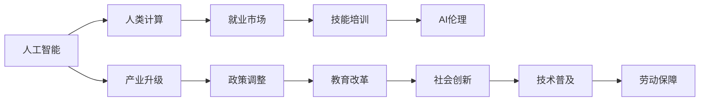

                 

# 人类计算：AI时代的未来就业市场与技能培训发展趋势分析机遇挑战机遇趋势分析

## 1. 背景介绍

### 1.1 问题由来
人工智能（AI）技术的迅猛发展已经深刻影响了各行各业。在AI时代，自动化、智能化的趋势不仅改变了企业的运作方式，也给人类就业市场带来了前所未有的变革。一方面，AI技术能够大幅提升生产效率和创新能力，优化资源配置，为企业创造更高的价值。但另一方面，自动化也会带来某些岗位的消失，传统劳动力市场受到冲击。

为应对这些挑战，全球许多国家和地区正在积极探索AI时代的人力资源政策，推动职业教育与技能培训的发展。人力资源和社会保障部、教育部、科技部等多个部门协同合作，推出各类AI培训项目，帮助劳动者提升技能，适应新的就业形势。

### 1.2 问题核心关键点
当前，AI技术正向各个行业渗透，机器学习、深度学习、自然语言处理、计算机视觉等技术的应用日益广泛。AI时代对人才的需求正在发生深刻变化，既包括高层次的算法工程师、数据科学家、AI架构师等专业人才，也包括基础技术工人、操作员等大量的一线劳动者。这些变化带来的不仅是机会，也带来了挑战。

面对AI时代的人才需求，当前技能培训系统尚需不断优化和调整，以适应新形势。如何有效提升劳动者的AI技能，成为当下的一大重要课题。本文将系统分析AI时代未来就业市场和技能培训的发展趋势，探讨其面临的机遇与挑战。

## 2. 核心概念与联系

### 2.1 核心概念概述

1. **人工智能**：利用机器学习、深度学习等算法构建的智能系统，能够模拟人类认知、决策和创造性思维过程，应用于各个行业，提升生产效率和创新能力。
2. **人类计算**：AI时代下，人机协作的新模式，强调通过人类智慧和AI技术的结合，提升计算能力和问题解决能力。
3. **就业市场**：劳动者的供给与岗位需求相匹配的动态体系，受到技术变革、产业升级、政策调整等多重因素影响。
4. **技能培训**：通过教育和培训，提升劳动者的专业技能和综合素质，适应新兴技术和新岗位要求的过程。
5. **AI伦理**：AI应用过程中，如何确保公平、透明、安全、负责任，避免算法偏见、隐私泄露等问题。

这些核心概念紧密相连，共同构成了AI时代技能培训和就业市场的全局框架。

### 2.2 核心概念原理和架构的 Mermaid 流程图



这个流程图展示了人工智能技术如何通过多个环节影响就业市场和技能培训。人工智能的广泛应用推动产业升级，进而引发政策调整和教育改革，这些变化最终促进技术普及和社会创新，构建新型的就业市场。在这个过程中，技能培训作为重要一环，保障了劳动者顺利适应新岗位。

## 3. 核心算法原理 & 具体操作步骤

### 3.1 算法原理概述

AI时代对人才需求的变化，要求技能培训体系做出相应调整，以适应新的就业市场形势。总体而言，AI技能培训需要结合以下几个方面：

1. **技能分类**：将AI技能分为算法与模型、数据处理与分析、系统架构与优化、人机交互与界面设计等多个模块，覆盖不同层次和领域。
2. **学习路径设计**：设计有针对性的学习路径，包括基础课程、进阶课程和实战项目，确保培训内容的系统性和实用性。
3. **课程体系构建**：构建涵盖技术基础、工具应用、算法设计与实现、项目实践等多层次的课程体系，保证培训的全面性和深入性。
4. **培训方式创新**：采用线上线下结合、混合教学、项目导向等多样化培训方式，提升学习效果。
5. **实战项目实践**：通过参与实际项目，提升学员的动手能力和解决实际问题的能力。
6. **持续职业发展**：提供持续的职业发展支持，包括职业规划、就业指导、再培训等，帮助劳动者不断提升自身竞争力。

### 3.2 算法步骤详解

AI技能培训的实施步骤如下：

1. **需求调研**：通过调研和分析，明确目标岗位对AI技能的具体需求，包括技能类型、深度和难度等级。
2. **课程设计**：基于调研结果，设计涵盖技能分类、学习路径和课程体系的培训方案。
3. **师资选拔**：选择具有行业经验和技术背景的师资力量，保证培训内容的准确性和实用性。
4. **教学实施**：采用多样化的教学方法，确保学员能够有效掌握所需技能。
5. **项目实践**：通过实战项目，提升学员的动手能力和解决实际问题的能力。
6. **评估反馈**：定期评估培训效果，收集学员和企业的反馈，持续改进培训方案。

### 3.3 算法优缺点

AI技能培训具有以下优点：

1. **提升劳动者的竞争力**：通过系统化的培训，劳动者可以掌握AI技能，提升自身竞争力，适应新兴就业岗位。
2. **推动产业升级**：劳动者技能的提升有助于推动产业升级，提升整体生产力。
3. **促进技术普及**：通过培训，AI技术可以更快地普及到各行各业，加速数字化转型。
4. **优化人力资源结构**：技能培训有助于优化人力资源结构，弥补AI自动化带来的岗位空缺。

但同时也存在以下不足：

1. **培训成本高**：高水平的AI技能培训需要投入大量资源，包括师资、场地、设备等，成本较高。
2. **课程内容更新快**：AI技术发展迅速，课程内容需要不断更新，保持最新性。
3. **师资力量不足**：目前具备AI技能的专业师资力量相对较少，难以满足大规模培训需求。
4. **学习效果参差不齐**：不同学员的学习能力和背景差异较大，学习效果也会有所差异。

### 3.4 算法应用领域

AI技能培训广泛应用于以下几个领域：

1. **制造业**：通过培训提升工人的自动化设备操作和维护技能，推动制造业智能化转型。
2. **金融业**：提升金融分析师的数据分析和预测能力，优化投资策略和风险管理。
3. **医疗健康**：培训医生和护士掌握AI辅助诊断和智能推荐系统的使用，提升医疗服务质量。
4. **教育行业**：提升教师的教育技术能力，开发个性化学习平台，提升教学效果。
5. **农业**：培训农民使用智能农机和农业数据分析工具，提升农业生产效率和精准化管理水平。
6. **零售行业**：提升销售员的数据分析和顾客行为预测能力，优化销售策略和顾客体验。

## 4. 数学模型和公式 & 详细讲解 & 举例说明

### 4.1 数学模型构建

AI技能培训的数学模型构建主要包括以下几个方面：

1. **技能模型**：定义技能体系，包括不同层次和类型的技能，用数学语言描述其结构和层次关系。
2. **学习模型**：描述学员在培训过程中的学习行为和知识积累，建立学习进度和效果之间的关系。
3. **评估模型**：建立学员技能掌握程度的评估标准和指标，通过测试和项目实践评估学习效果。
4. **优化模型**：基于评估结果，优化培训内容和方式，提高培训效果。

### 4.2 公式推导过程

以技能模型和评估模型为例，推导相关公式。

假设技能体系由 $K$ 个技能 $k_1, k_2, ..., k_K$ 构成，每个技能 $k_i$ 包含 $m_i$ 个子技能，用 $u_{ij}$ 表示学员掌握第 $j$ 个子技能 $k_i$ 的程度。

**技能模型**：

$$
K = \{k_1, k_2, ..., k_K\}
$$

$$
m_i = |k_i|, i \in \{1, 2, ..., K\}
$$

$$
u_{ij} \in [0, 1], j \in \{1, 2, ..., m_i\}, i \in \{1, 2, ..., K\}
$$

**评估模型**：

假设技能评估分为 $n$ 个指标 $p_1, p_2, ..., p_n$，每个指标 $p_j$ 的评分 $s_{ij}$ 为 $u_{ij}$ 的线性组合。

$$
p_j = \sum_{i=1}^K w_{ij}u_{ij}, j \in \{1, 2, ..., n\}
$$

其中 $w_{ij}$ 为权重，满足 $w_{ij} \in [0, 1]$，$\sum_{j=1}^nw_{ij} = 1$。

通过求解最优权重 $w_{ij}$，可以评估学员对每个指标的掌握程度。

### 4.3 案例分析与讲解

以下以制造业技能培训为例，详细分析技能模型和评估模型的实际应用：

**制造业技能体系**：

$$
K = \{技能A, 技能B, 技能C\}
$$

$$
m_A = 4, m_B = 3, m_C = 2
$$

$$
u_{A1} = 0.8, u_{A2} = 0.7, u_{A3} = 0.6, u_{A4} = 0.5, u_{B1} = 0.9, u_{B2} = 0.6, u_{B3} = 0.5, u_{C1} = 0.7, u_{C2} = 0.6
$$

**评估指标**：

$$
p_1 = 0.6u_{A1} + 0.3u_{A2} + 0.1u_{B1} + 0.2u_{B2} + 0.3u_{C1} + 0.2u_{C2}
$$

$$
p_2 = 0.7u_{A3} + 0.4u_{A4} + 0.3u_{B1} + 0.4u_{B2} + 0.3u_{C1} + 0.4u_{C2}
$$

假设学员在两个评估指标下的得分分别为 $s_1$ 和 $s_2$，则通过线性组合公式可计算出最终技能评估分数 $P$。

通过建立和优化这类数学模型，可以实现对技能培训效果的精确评估和持续改进，提升整体培训效果。

## 5. 项目实践：代码实例和详细解释说明

### 5.1 开发环境搭建

为了进行AI技能培训项目的开发，需要搭建一个包含以下组件的开发环境：

1. **编程语言**：Python是当前主流的AI开发语言，具备丰富的科学计算和机器学习库。
2. **深度学习框架**：如TensorFlow、PyTorch等，用于实现复杂的深度学习模型和算法。
3. **数据处理工具**：如Pandas、NumPy等，用于数据清洗、预处理和分析。
4. **云计算平台**：如AWS、Google Cloud、阿里云等，提供强大的计算资源和存储支持。
5. **学习管理系统(LMS)**：如Moodle、Canvas等，用于在线课程的发布和管理。

### 5.2 源代码详细实现

以下是一个基于Python的AI技能培训项目示例代码：

```python
import pandas as pd
from sklearn.linear_model import LinearRegression

# 读取数据
data = pd.read_csv('skill_data.csv')

# 数据处理
X = data.drop('skill_score', axis=1)
y = data['skill_score']

# 模型训练
model = LinearRegression()
model.fit(X, y)

# 预测评估
test_data = pd.read_csv('test_data.csv')
test_score = model.predict(test_data)
print(test_score)
```

该代码通过线性回归模型对技能评估进行训练和预测，具体步骤如下：

1. **数据读取**：从CSV文件中读取技能评估数据。
2. **数据处理**：分离特征数据和目标数据，准备用于模型训练。
3. **模型训练**：使用线性回归模型对特征和目标数据进行训练，建立技能评估模型。
4. **预测评估**：对测试数据进行预测，评估模型效果。

### 5.3 代码解读与分析

**数据读取与处理**：

通过Pandas库，我们可以轻松读取和处理数据。首先，使用`pd.read_csv`方法从CSV文件中读取数据，将其存储为DataFrame对象。然后，使用`drop`方法去除目标变量`skill_score`，将特征数据存储在`X`中，目标数据存储在`y`中。

**模型训练**：

使用`LinearRegression`类，我们定义一个线性回归模型。通过`fit`方法，使用特征数据`X`和目标数据`y`对模型进行训练。训练完成后，模型将能够对新的数据进行预测。

**预测评估**：

对测试数据进行预测，得到每个学员的技能评估分数。通过`predict`方法，将测试数据`test_data`输入模型，得到预测结果。

### 5.4 运行结果展示

运行上述代码，输出预测结果，显示每个学员的技能评估分数。这些分数可以用来评估学员的技能掌握程度，提供个性化的培训建议。

## 6. 实际应用场景

### 6.1 制造业

制造业是AI技能培训的重要领域之一。通过培训，提升工人的自动化设备操作和维护技能，推动制造业智能化转型。例如，某汽车制造企业培训工人掌握机器人操作和维护技能，大幅提升了生产效率和产品质量。

### 6.2 金融业

在金融业，通过培训金融分析师掌握数据分析和预测技能，优化投资策略和风险管理。例如，某投资公司培训分析师掌握机器学习技术，提高了市场预测的准确性，提升了投资回报率。

### 6.3 医疗健康

在医疗健康领域，通过培训医生和护士掌握AI辅助诊断和智能推荐系统的使用，提升医疗服务质量。例如，某医院培训医生使用AI辅助诊断系统，提高了诊断的准确性和效率。

### 6.4 教育行业

在教育行业，通过培训教师掌握教育技术能力，开发个性化学习平台，提升教学效果。例如，某在线教育平台培训教师使用AI技术，提供了个性化的学习推荐和辅导。

## 7. 工具和资源推荐

### 7.1 学习资源推荐

为了帮助开发者掌握AI技能培训，推荐以下学习资源：

1. **在线课程**：如Coursera、edX、Udacity等，提供系统化的AI技能培训课程。
2. **书籍**：如《机器学习实战》、《深度学习》等，详细介绍了AI算法的原理和应用。
3. **文档和教程**：如TensorFlow官方文档、PyTorch官方教程，提供丰富的学习资源和示例代码。
4. **社区和论坛**：如GitHub、Stack Overflow等，汇集了大量的开源项目和代码示例，便于学习和交流。

### 7.2 开发工具推荐

为了高效地进行AI技能培训开发，推荐以下开发工具：

1. **编程语言**：Python、R等，是当前最主流的AI开发语言。
2. **深度学习框架**：TensorFlow、PyTorch等，提供强大的计算能力和算法支持。
3. **数据处理工具**：Pandas、NumPy等，用于数据清洗、预处理和分析。
4. **云计算平台**：AWS、Google Cloud、阿里云等，提供强大的计算资源和存储支持。
5. **学习管理系统(LMS)**：Moodle、Canvas等，用于在线课程的发布和管理。

### 7.3 相关论文推荐

为了深入了解AI技能培训的发展趋势和前沿技术，推荐以下相关论文：

1. **《AI教育：技能培训与未来就业》**：详细探讨了AI时代技能培训的挑战和机遇，提出了未来发展的方向。
2. **《机器学习与职业教育的融合》**：分析了机器学习在职业教育中的应用，提出了提升教育质量的方法。
3. **《人机协同在制造业中的应用》**：介绍了人机协同在制造业中的实际应用案例，探讨了技能培训的重要性。

## 8. 总结：未来发展趋势与挑战

### 8.1 研究成果总结

本文系统分析了AI时代未来就业市场和技能培训的发展趋势，探讨了其面临的机遇与挑战。主要研究成果包括：

1. AI时代对人才需求的变化，要求技能培训体系做出相应调整。
2. AI技能培训需要系统化的课程设计、多样化的教学方法、实战项目实践等综合措施。
3. 通过建立和优化数学模型，可以实现对技能培训效果的精确评估和持续改进。
4. AI技能培训广泛应用于制造业、金融业、医疗健康、教育行业等多个领域。

### 8.2 未来发展趋势

展望未来，AI技能培训将呈现以下几个发展趋势：

1. **技能培训体系的完善**：建立更加全面、系统的技能培训体系，涵盖从基础到高级的各种技能。
2. **技术手段的创新**：采用虚拟现实(VR)、增强现实(AR)等新技术，提升培训效果。
3. **个性化培训的推广**：通过数据分析和算法优化，实现个性化、定制化的技能培训。
4. **行业应用的深化**：在各行业深入推广AI技能培训，推动产业升级和经济转型。
5. **国际合作与交流**：加强国际合作与交流，借鉴和推广先进的培训方法和经验。

### 8.3 面临的挑战

尽管AI技能培训发展迅速，但仍面临以下挑战：

1. **师资力量的不足**：具备AI技能的专业师资力量相对较少，难以满足大规模培训需求。
2. **培训成本高**：高水平的AI技能培训需要投入大量资源，成本较高。
3. **课程内容的更新**：AI技术发展迅速，课程内容需要不断更新，保持最新性。
4. **学习效果的参差不齐**：不同学员的学习能力和背景差异较大，学习效果也会有所差异。

### 8.4 研究展望

未来，AI技能培训的研究需要不断探索和创新，推动以下方向的发展：

1. **混合学习模式**：结合在线和线下培训，提高学习效果。
2. **动态评估机制**：通过实时反馈和动态调整，优化培训过程。
3. **跨学科融合**：将AI技术与多个学科相结合，提升培训的跨学科性和综合性。
4. **人工智能辅助培训**：利用AI技术，实现智能化的培训管理和评估。

## 9. 附录：常见问题与解答

**Q1: AI技能培训是否适用于所有行业？**

A: AI技能培训适用范围广泛，不仅限于制造业、金融业、医疗健康等传统领域，还涵盖教育、农业、零售等多个行业。不同行业可以根据自身需求，定制个性化的培训方案。

**Q2: 如何提升AI技能培训的质量？**

A: 提升培训质量需要从多个方面入手：
1. 选择优质的培训师资，确保教学质量。
2. 设计系统的培训课程，覆盖从基础到高级的各种技能。
3. 采用多样化的教学方法，如实战项目、案例分析等，提升学员的动手能力和实战经验。
4. 定期评估培训效果，根据反馈不断优化培训方案。

**Q3: 如何评估AI技能培训的效果？**

A: 评估AI技能培训的效果可以从以下几个方面入手：
1. 技能掌握程度的评估：通过测试和项目实践，评估学员对所学技能的掌握程度。
2. 培训后的就业情况：跟踪学员的就业情况，评估培训的实际效果。
3. 企业反馈：收集企业的反馈，了解培训对企业的影响和价值。

**Q4: 如何推动AI技能培训的普及？**

A: 推动AI技能培训的普及需要多方协同努力：
1. 政府政策支持：制定相关政策和法规，推动技能培训的普及。
2. 企业参与：企业应重视员工技能提升，积极开展内部培训。
3. 教育机构合作：与高校、培训机构等合作，开展系统化培训。
4. 社会推广：通过媒体、社交平台等渠道，宣传和推广AI技能培训。

---

作者：禅与计算机程序设计艺术 / Zen and the Art of Computer Programming

