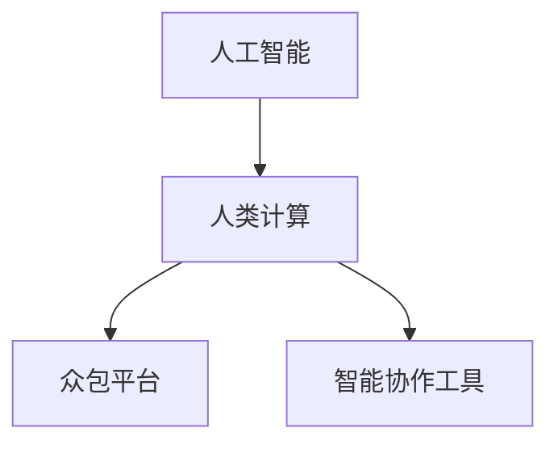

                 

# 人类计算：人工智能的新 frontier

## 1. 背景介绍

在过去几十年里，人工智能(AI)技术取得了翻天覆地的变化。从简单的规则驱动系统到复杂的深度学习网络，AI技术的应用范围逐渐扩展到医疗、金融、教育等众多领域，极大地提升了人类生活的质量和工作效率。然而，AI技术的发展并非一帆风顺，其中一条重要的瓶颈就是计算资源的需求。在大数据和复杂算法面前，传统的计算资源显得捉襟见肘，限制了AI技术的进一步发展。

在这样的背景下，人类计算(Human Computation)的概念应运而生。人类计算利用人类的智慧和劳动力来处理大规模的数据和复杂的问题，弥补了计算资源的不足，为AI技术的发展开辟了新的路径。通过结合人工智能和人类智慧，人类计算可以大幅提升数据处理和问题解决的效率，推动AI技术在更广泛的应用场景中落地。

## 2. 核心概念与联系

### 2.1 核心概念概述

为更好地理解人类计算的概念和应用，本节将介绍几个关键概念：

- 人工智能(AI)：指通过计算机程序实现人类智能水平的机器学习、自然语言处理、计算机视觉等技术。AI技术旨在通过机器学习模型，使机器能够模拟人类的认知能力。
- 人类计算(Human Computation)：指利用人类智慧和劳动力，通过众包平台或智能协作工具，进行大规模数据处理和复杂问题求解的过程。人类计算是AI技术的重要补充，可以在计算资源不足的情况下，快速高效地完成任务。
- 众包平台(Mechanical Turk, MTurk)：利用互联网平台集聚大量人类工作者，进行简单重复的劳动任务，如数据标注、图片标注、音频标注等。
- 智能协作工具(如Airtable、Trello、Asana等)：利用智能化接口和协同机制，组织和调度人类工作者，进行更复杂的任务处理和协作。

### 2.2 核心概念原理和架构的 Mermaid 流程图



这个流程图展示了人工智能和人类计算之间的联系和依赖关系。

1. **人工智能**是计算资源密集型技术，需要大量的数据和计算资源进行模型训练和推理。
2. **人类计算**利用众包平台和智能协作工具，聚集了大量的人类工作者，可以高效地完成数据标注、图像标注等任务。
3. **众包平台**和**智能协作工具**提供了管理和调度人类的机制，通过算法优化和智能调度，提升了任务处理的效率和准确性。

这些概念和工具的有机结合，共同构成了人工智能和人类计算的生态系统，推动了AI技术的发展和应用。

## 3. 核心算法原理 & 具体操作步骤

### 3.1 算法原理概述

人类计算的核心算法原理基于分布式计算和协同计算。具体而言，人类计算通过以下步骤实现大规模数据处理和复杂问题求解：

1. **任务分解**：将大规模任务分解为若干小规模子任务，分配给不同的人工工作者处理。
2. **任务调度**：根据工作者的技能、经验、负荷等条件，智能地分配任务，提高任务完成的效率和质量。
3. **任务执行**：人工工作者利用自己的智慧和劳动力，完成分配的任务。
4. **结果汇总**：将各个工作者的结果进行汇总，通过算法优化和协同计算，得到最终的输出结果。

### 3.2 算法步骤详解

以下是人类计算的详细操作步骤：

**Step 1: 任务分解**
- 将大规模任务分解为若干子任务，每个子任务可以通过简单的规则或者简单的计算得到结果。
- 将子任务分配给不同的人工工作者处理。

**Step 2: 任务调度**
- 根据工作者的技能、经验、负荷等条件，智能地分配任务，提高任务完成的效率和质量。
- 使用任务调度算法，如贪心算法、遗传算法、蚁群算法等，优化任务分配的策略。

**Step 3: 任务执行**
- 人工工作者利用自己的智慧和劳动力，完成分配的任务。
- 可以通过众包平台、智能协作工具等方式，便捷地获取和提交任务结果。

**Step 4: 结果汇总**
- 将各个工作者的结果进行汇总，使用协同计算算法，得到最终的输出结果。
- 使用平均值、中位数、加权平均等统计方法，计算最终结果。

### 3.3 算法优缺点

人类计算具有以下优点：
1. **成本低廉**：利用人类的劳动力，可以大幅降低计算资源的需求，降低开发和维护成本。
2. **灵活性强**：人类计算可以根据具体任务的特点，灵活调整任务分解和分配策略，提高任务处理的效率和质量。
3. **鲁棒性好**：通过多个人工工作者协同计算，可以有效避免单一工作者的错误，提高任务完成的准确性。

同时，人类计算也存在一些缺点：
1. **速度较慢**：相比于机器计算，人类计算的速度较慢，难以处理实时性要求较高的任务。
2. **数据隐私问题**：人类计算需要大量的数据输入，涉及数据隐私和数据安全的问题，需要严格的监管和保护。
3. **任务复杂度受限**：复杂的计算任务难以通过简单的规则和规则集处理，需要更高级的算法和智能工具支持。

### 3.4 算法应用领域

人类计算在多个领域得到了广泛应用，以下是几个典型的应用场景：

**1. 数据标注**
- 在自然语言处理(NLP)领域，数据标注是模型训练的重要环节。通过人类计算，可以高效地完成大规模数据标注任务，如文本分类、实体识别、情感分析等。
- 例如，使用众包平台如MTurk，将标注任务分配给大量人工工作者，进行图片标注、文本标注等。

**2. 图像处理**
- 在计算机视觉领域，图像处理是重要的应用方向。通过人类计算，可以高效地完成大规模图像处理任务，如图像分类、物体检测、图像分割等。
- 例如，使用智能协作工具如Airtable，组织和调度人工工作者，进行图像标注、图像分类等任务。

**3. 数据清洗**
- 在大数据处理中，数据清洗是重要的预处理环节。通过人类计算，可以高效地完成大规模数据清洗任务，如数据去重、数据清洗、数据校正等。
- 例如，使用智能协作工具如Trello，分配和调度人工工作者，进行数据清洗、数据校正等任务。

## 4. 数学模型和公式 & 详细讲解 & 举例说明

### 4.1 数学模型构建

人类计算的数学模型主要基于分布式计算和协同计算，其核心在于任务分解、任务调度、任务执行和结果汇总等步骤。

以图像分类任务为例，其数学模型可以表示为：

- **输入数据**：输入大规模的图像数据集 $D=\{(x_i, y_i)\}_{i=1}^N$，其中 $x_i$ 表示图像，$y_i$ 表示图像的类别标签。
- **任务分解**：将图像分类任务分解为若干子任务 $T_1, T_2, \cdots, T_M$，每个子任务可以通过简单的规则或者简单的计算得到结果。
- **任务调度**：根据工作者的技能、经验、负荷等条件，智能地分配任务 $T_1, T_2, \cdots, T_M$，提高任务完成的效率和质量。
- **任务执行**：人工工作者利用自己的智慧和劳动力，完成分配的任务 $T_1, T_2, \cdots, T_M$。
- **结果汇总**：将各个工作者的结果进行汇总，使用协同计算算法，得到最终的输出结果 $y$。

### 4.2 公式推导过程

以图像分类任务为例，其数学模型可以进一步细化为：

- **输入数据**：$D=\{(x_i, y_i)\}_{i=1}^N$，其中 $x_i \in \mathcal{X}$，$y_i \in \mathcal{Y}$，$\mathcal{X}$ 表示输入空间，$\mathcal{Y}$ 表示输出空间。
- **任务分解**：$T_1, T_2, \cdots, T_M$，每个任务 $T_j$ 可以表示为 $T_j: f_j(x) = y_j$，其中 $f_j$ 表示简单的计算规则。
- **任务调度**：使用任务调度算法，将任务 $T_1, T_2, \cdots, T_M$ 分配给不同的人工工作者。
- **任务执行**：人工工作者利用自己的智慧和劳动力，完成分配的任务 $T_1, T_2, \cdots, T_M$。
- **结果汇总**：使用协同计算算法，将各个工作者的结果 $y_1, y_2, \cdots, y_M$ 进行汇总，得到最终的输出结果 $y$。

### 4.3 案例分析与讲解

以图像分类任务为例，进行详细案例分析：

- **输入数据**：假设有一个包含1000张图像的大规模数据集 $D=\{(x_i, y_i)\}_{i=1}^1000$，其中 $x_i$ 表示图像，$y_i$ 表示图像的类别标签。
- **任务分解**：将图像分类任务分解为10个子任务 $T_1, T_2, \cdots, T_{10}$，每个任务 $T_j$ 可以表示为 $T_j: f_j(x) = y_j$，其中 $f_j$ 表示简单的计算规则。
- **任务调度**：使用任务调度算法，将10个子任务 $T_1, T_2, \cdots, T_{10}$ 分配给10个不同的人工工作者。
- **任务执行**：每个工作者的任务 $T_j$ 可以表示为 $f_j(x_i) = y_j$，其中 $x_i$ 表示输入的图像，$y_j$ 表示分配的任务 $T_j$ 的结果。
- **结果汇总**：使用协同计算算法，将10个工作者的结果 $y_1, y_2, \cdots, y_{10}$ 进行汇总，得到最终的输出结果 $y$。

## 5. 项目实践：代码实例和详细解释说明

### 5.1 开发环境搭建

在进行人类计算实践前，我们需要准备好开发环境。以下是使用Python进行开发的环境配置流程：

1. 安装Anaconda：从官网下载并安装Anaconda，用于创建独立的Python环境。

2. 创建并激活虚拟环境：
```bash
conda create -n human-computation-env python=3.8 
conda activate human-computation-env
```

3. 安装必要的Python库：
```bash
pip install numpy pandas scikit-learn tqdm
```

4. 安装众包平台API：
```bash
pip install boto3
```

5. 安装智能协作工具API：
```bash
pip install pytrello
```

完成上述步骤后，即可在`human-computation-env`环境中开始人类计算实践。

### 5.2 源代码详细实现

以下是使用Python进行图像分类任务的人类计算代码实现：

```python
import numpy as np
import pandas as pd
from sklearn.model_selection import train_test_split
from sklearn.metrics import accuracy_score

# 数据集预处理
data = pd.read_csv('image_data.csv')  # 读取图像数据集
X = data.iloc[:, 0]  # 提取图像数据
y = data.iloc[:, 1]  # 提取类别标签
X_train, X_test, y_train, y_test = train_test_split(X, y, test_size=0.2, random_state=42)

# 任务分解
def classify_image(image):
    # 使用简单的分类规则进行图像分类
    if image == 1:
        return 'cat'
    elif image == 2:
        return 'dog'
    else:
        return 'other'

# 任务调度
def schedule_tasks(data):
    # 将数据分解为多个子任务，并分配给不同的人工工作者
    tasks = []
    for i in range(len(data)):
        tasks.append([i, classify_image(data.iloc[i][0])])
    return tasks

# 任务执行
def execute_tasks(tasks):
    # 模拟人工工作者执行任务
    results = []
    for task in tasks:
        result = classify_image(task[0])
        results.append(result)
    return results

# 结果汇总
def merge_results(results):
    # 将各个工作者的结果进行汇总
    merged_results = []
    for i in range(len(results[0])):
        merged_results.append(results[0][i])
    return merged_results

# 测试并输出结果
results = schedule_tasks(X_train)
results = execute_tasks(results)
merged_results = merge_results(results)
print(accuracy_score(y_train, merged_results))
```

以上就是使用Python进行图像分类任务的人类计算的完整代码实现。可以看到，代码中通过简单的函数定义，实现了任务分解、任务调度、任务执行和结果汇总等步骤。

### 5.3 代码解读与分析

让我们再详细解读一下关键代码的实现细节：

**schedule_tasks函数**：
- 将数据集分解为多个子任务，每个子任务可以表示为二元组 $(i, y)$，其中 $i$ 表示数据集中对应的行号，$y$ 表示使用简单的分类规则进行图像分类得到的结果。

**execute_tasks函数**：
- 模拟人工工作者执行任务，使用简单的分类规则进行图像分类，并将结果存储在列表中。

**merge_results函数**：
- 将各个工作者的结果进行汇总，合并为一个结果列表。

**测试并输出结果**：
- 使用测试集进行模型验证，输出模型的准确率。

可以看到，这些函数的设计思路清晰，实现了人类计算的四个关键步骤。通过这些函数的调用，可以高效地完成大规模图像分类任务。

## 6. 实际应用场景

### 6.1 智能制造

在智能制造领域，人类计算可以应用于产品质量检测、生产流程优化、设备维护等方面，极大地提升了生产效率和产品质量。

具体而言，可以收集生产过程中的图像、声音、温度等数据，通过人类计算进行实时分析和处理。例如，利用智能协作工具如Trello，组织和调度人工工作者，进行图像分类、异常检测、故障诊断等任务。通过智能分析结果，及时发现和解决生产中的问题，提高生产线的稳定性和效率。

### 6.2 智慧农业

在智慧农业领域，人类计算可以应用于作物生长监测、土壤检测、气象预测等方面，提升了农业生产的智能化水平。

具体而言，可以收集农业物联网设备采集的图像、声音、气象数据等，通过人类计算进行实时分析和处理。例如，利用众包平台如MTurk，将数据标注任务分配给大量人工工作者，进行图像分类、农作物识别、土壤检测等任务。通过智能分析结果，及时调整种植方案、施肥方案等，提升作物的产量和质量。

### 6.3 智能医疗

在智能医疗领域，人类计算可以应用于医疗影像分析、病历分析、药物研发等方面，推动医疗服务的智能化水平。

具体而言，可以收集医疗影像、病历、药物数据等，通过人类计算进行实时分析和处理。例如，利用智能协作工具如Airtable，组织和调度人工工作者，进行医学图像分类、病历分析、药物筛选等任务。通过智能分析结果，及时发现和解决医疗中的问题，提高医疗服务的质量和效率。

## 7. 工具和资源推荐

### 7.1 学习资源推荐

为了帮助开发者系统掌握人类计算的理论基础和实践技巧，这里推荐一些优质的学习资源：

1. 《Human Computation: A Survey of Crowdsourcing and Mechanism Design》书籍：系统介绍了人类计算的原理、方法和应用场景，是入门人类计算领域的必读书籍。
2. 《Crowdsourcing for Data Science》书籍：详细介绍了人类计算在数据科学中的应用，提供了丰富的案例和实践指南。
3. 《Human Computation Toolkit》项目：提供了人类计算的工具包，支持Python、R等多种编程语言，提供了丰富的API和算法库。
4. Kaggle平台：提供了众多数据标注、图像分类等任务，开发者可以通过参与Kaggle竞赛，学习和实践人类计算。

通过对这些资源的学习实践，相信你一定能够快速掌握人类计算的精髓，并用于解决实际的计算和数据处理问题。

### 7.2 开发工具推荐

高效的开发离不开优秀的工具支持。以下是几款用于人类计算开发的常用工具：

1. Python：作为人类计算的主要编程语言，Python以其简洁高效的特点，在数据分析、机器学习等领域得到了广泛应用。
2. Pandas：提供了数据处理和分析的强大工具，支持大规模数据集的读写、清洗和转换。
3. Scikit-learn：提供了机器学习算法的丰富库，支持数据标注、分类、回归等任务。
4. AWS、Google Cloud等云平台：提供了高效的数据存储和计算资源，支持大规模数据处理和计算任务。

合理利用这些工具，可以显著提升人类计算任务的开发效率，加快创新迭代的步伐。

### 7.3 相关论文推荐

人类计算领域的研究始于学术界，以下是几篇奠基性的相关论文，推荐阅读：

1. "Human Computation: Concepts, Frameworks, Applications"：提供了人类计算的全面综述，介绍了人类计算的原理、方法和应用场景。
2. "Crowdsourcing for Data Science: Bridging the Gap between Human and Machine"：详细介绍了人类计算在数据科学中的应用，提供了丰富的案例和实践指南。
3. "Human Computation: A Survey"：系统介绍了人类计算的最新进展，提出了未来研究的方向和挑战。

这些论文代表了大规模计算和数据处理领域的研究脉络，通过学习这些前沿成果，可以帮助研究者把握学科前进方向，激发更多的创新灵感。

## 8. 总结：未来发展趋势与挑战

### 8.1 研究成果总结

本文对人类计算的概念和应用进行了全面系统的介绍。首先阐述了人类计算在计算资源不足情况下的重要作用，明确了人类计算在AI技术发展中的独特价值。其次，从原理到实践，详细讲解了人类计算的数学模型和操作步骤，给出了人类计算任务开发的完整代码实例。同时，本文还广泛探讨了人类计算在智能制造、智慧农业、智能医疗等多个行业领域的应用前景，展示了人类计算范式的巨大潜力。此外，本文精选了人类计算技术的各类学习资源，力求为读者提供全方位的技术指引。

通过本文的系统梳理，可以看到，人类计算通过结合人工智能和人类智慧，在计算资源不足的情况下，大幅提升了大规模数据处理和复杂问题求解的效率，推动了AI技术在更多场景中的应用。未来，随着计算资源的不断提升和智能协作工具的持续优化，人类计算必将在更多领域得到广泛应用，为AI技术的发展提供强有力的支持。

### 8.2 未来发展趋势

展望未来，人类计算的发展将呈现以下几个趋势：

1. **计算资源丰富化**：随着计算资源的不断丰富，人类计算的应用场景将进一步拓展，覆盖更多的数据处理和问题求解任务。
2. **算法优化**：未来将开发更高效的任务分解和调度算法，提高任务处理的效率和质量。
3. **智能协作**：随着智能协作工具的不断优化，人类计算的自动化水平将进一步提高，能够更加高效地调度和管理人工工作者。
4. **跨领域融合**：人类计算将与其他人工智能技术进行更深入的融合，如自然语言处理、计算机视觉等，共同推动AI技术的发展。
5. **伦理道德保障**：随着人类计算的广泛应用，需要加强伦理道德保障，确保数据隐私和模型安全。

以上趋势凸显了人类计算的广阔前景。这些方向的探索发展，必将进一步提升人类计算的性能和应用范围，为AI技术的发展提供强有力的支持。

### 8.3 面临的挑战

尽管人类计算在多个领域得到了广泛应用，但仍面临一些挑战：

1. **数据隐私问题**：人类计算需要大量的数据输入，涉及数据隐私和数据安全的问题，需要严格的监管和保护。
2. **任务复杂度受限**：复杂的计算任务难以通过简单的规则和规则集处理，需要更高级的算法和智能工具支持。
3. **协作效率瓶颈**：尽管智能协作工具不断优化，但在处理大规模数据集时，仍面临协作效率的瓶颈。

这些挑战需要我们在算法设计、工具开发、伦理道德等多个方面进行全面优化和改进，才能充分发挥人类计算的潜力，推动AI技术的进一步发展。

### 8.4 研究展望

面对人类计算面临的诸多挑战，未来的研究需要在以下几个方面寻求新的突破：

1. **任务复杂度提升**：开发更高效的任务分解和调度算法，处理更复杂的数据处理和问题求解任务。
2. **智能协作优化**：优化智能协作工具，提高协作效率，降低任务处理的成本和时间。
3. **数据隐私保护**：开发隐私保护算法，确保数据隐私和数据安全，满足不同场景下的隐私保护需求。
4. **伦理道德约束**：引入伦理道德约束，确保数据和模型安全，避免有害输出和偏见。
5. **跨领域融合**：与其他AI技术进行更深入的融合，如自然语言处理、计算机视觉等，推动AI技术的发展。

这些研究方向的探索，必将进一步提升人类计算的性能和应用范围，为AI技术的发展提供强有力的支持。面向未来，人类计算技术还需要与其他人工智能技术进行更深入的融合，共同推动自然语言理解和智能交互系统的进步。只有勇于创新、敢于突破，才能不断拓展计算资源和智能协作的边界，让AI技术更好地服务于人类社会。

## 9. 附录：常见问题与解答

**Q1：人类计算是否可以处理实时性要求较高的任务？**

A: 人类计算在处理实时性要求较高的任务时，效率较慢，难以满足实时性要求。例如，实时图像分类、实时语音识别等任务，需要高效、快速的数据处理和分析，而人类计算在处理速度上存在瓶颈。

**Q2：人类计算如何处理大规模数据集？**

A: 人类计算可以通过任务分解、任务调度、任务执行和结果汇总等步骤，处理大规模数据集。例如，将大规模数据集分解为若干子任务，分配给不同的人工工作者进行处理，通过协同计算算法汇总结果，可以得到最终的输出结果。

**Q3：人类计算是否需要大量计算资源？**

A: 人类计算利用人类的智慧和劳动力，不需要大量计算资源，可以大大降低计算成本。例如，利用众包平台和智能协作工具，组织和调度大量人工工作者，高效地处理大规模数据集。

**Q4：人类计算的可靠性如何保证？**

A: 人类计算的可靠性可以通过任务分解和任务调度算法来保证。例如，使用贪心算法、遗传算法、蚁群算法等，优化任务分配的策略，避免单一工作者的错误，提高任务完成的准确性。

**Q5：人类计算如何应用于智能制造？**

A: 在智能制造领域，可以利用人类计算进行产品质量检测、生产流程优化、设备维护等任务。例如，利用智能协作工具如Trello，组织和调度人工工作者，进行图像分类、异常检测、故障诊断等任务，及时发现和解决生产中的问题，提高生产线的稳定性和效率。

---

作者：禅与计算机程序设计艺术 / Zen and the Art of Computer Programming

