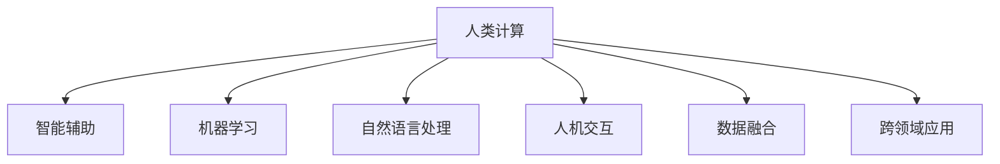

                 

## 1. 背景介绍

### 1.1 问题由来

随着计算技术的发展，人类计算的概念逐渐演变为一种综合运用人类智慧与技术工具解决复杂问题的能力。尤其是在人工智能和大数据等技术成熟之后，人类计算的应用领域得到了极大的扩展。人类计算不仅限于简单的数据处理和计算，更延伸到各个行业，如医疗、金融、教育、娱乐等。

### 1.2 问题核心关键点

人类计算的核心关键点在于将人类的思维能力与现代计算机技术结合，通过人机协同完成复杂任务。这种计算方式具有以下特点：

- **高效性**：利用人类高度专业化的知识，结合计算机的高效处理能力，可以在较短时间内解决复杂问题。
- **灵活性**：人类可以适应不同的问题环境和条件，而计算机的算法则可以根据不同情况进行优化和调整。
- **创造性**：人类在计算过程中的创造性思维可以弥补计算机算法的不足，提出新的解决方案和优化方法。

### 1.3 问题研究意义

研究人类计算的方法和应用，对于提升计算效率、降低计算成本、促进各行业的智能化转型具有重要意义：

1. **提升效率**：通过结合人类智慧和计算机技术，可以在短时间内完成大量复杂的计算任务，提高工作和生活效率。
2. **降低成本**：人类计算可以避免对昂贵设备和高技能人才的过度依赖，降低了计算成本。
3. **促进转型**：在传统行业，如制造业、医疗、金融等领域，人类计算可以推动产业升级，提升行业智能化水平。
4. **创造新价值**：通过人类计算，可以解锁新的应用场景，创造更多商业模式和价值。

## 2. 核心概念与联系

### 2.1 核心概念概述

为了更好地理解人类计算，本节将介绍几个密切相关的核心概念：

- **人类计算**：结合人类智慧与计算机技术解决复杂问题的计算方式。
- **智能辅助**：使用计算机技术辅助人类完成复杂任务，提高效率和准确性。
- **机器学习**：通过算法让机器自主学习和优化，以适应不同任务。
- **自然语言处理**：利用计算机理解、处理人类语言的能力，进行文本分析、语音识别等。
- **人机交互**：通过用户界面、语音、手势等方式实现人与计算机之间的信息交换和互动。
- **数据融合**：将不同来源的数据进行整合，利用数据分析提升决策质量。
- **跨领域应用**：将人类计算技术应用于不同领域，如医疗、金融、教育等。

这些概念之间的逻辑关系可以通过以下Mermaid流程图来展示：



这个流程图展示了一些核心概念及其之间的关系：

1. 人类计算通过智能辅助、机器学习、自然语言处理、人机交互等技术实现，提高任务的完成效率。
2. 数据融合和跨领域应用进一步拓展了人类计算的应用范围和深度。

## 3. 核心算法原理 & 具体操作步骤
### 3.1 算法原理概述

人类计算的核心算法原理主要涉及以下几个方面：

- **数据预处理**：对输入数据进行清洗、转换、归一化等处理，确保数据质量。
- **特征提取**：通过算法提取出有用的特征，如文本中的关键词、语音中的语调、图像中的边缘等。
- **模型训练**：利用机器学习算法对特征进行训练，构建出适合特定任务的模型。
- **模型评估**：通过测试数据集评估模型性能，根据评估结果进行优化。
- **人机协同**：在计算过程中加入人类智慧，如通过专家知识、经验、直觉等进行辅助决策。

### 3.2 算法步骤详解

基于上述原理，人类计算的基本算法步骤如下：

**Step 1: 数据收集与预处理**

- **数据收集**：从不同渠道获取所需的数据，如传感器数据、电子文档、语音记录等。
- **数据清洗**：去除噪声、缺失值、重复数据等，保证数据质量。
- **数据转换**：将不同格式的数据转换为统一的格式，便于后续处理。
- **特征提取**：从数据中提取有意义的特征，如文本的词频、语音的频谱特征等。

**Step 2: 特征处理与模型训练**

- **特征工程**：通过人工或自动的方式对提取的特征进行优化，如数据降维、特征选择等。
- **模型选择**：选择合适的机器学习算法，如决策树、神经网络、支持向量机等。
- **模型训练**：利用训练数据集训练模型，调整模型参数以优化性能。
- **模型评估**：使用测试数据集评估模型性能，选择性能最优的模型。

**Step 3: 人机协同与优化**

- **人机交互**：通过用户界面、语音助手等方式，实现人机协同计算。
- **专家知识融合**：将人类专家的知识和经验融入模型训练和优化过程中。
- **动态调整**：根据反馈数据和人类决策，动态调整模型参数和算法。

### 3.3 算法优缺点

人类计算的优点：

1. **高效性**：结合人类智慧和计算机技术，可以在短时间内解决复杂问题。
2. **灵活性**：人类可以适应不同环境和条件，灵活调整算法。
3. **创造性**：人类思维可以提供新的解决方案和优化方法。

人类计算的缺点：

1. **依赖人类**：人类计算高度依赖人类专家的知识和经验，如果专家经验不足，可能会影响计算结果。
2. **成本高**：聘请专家进行计算和决策，成本较高。
3. **可解释性不足**：一些复杂的计算过程难以解释，可能影响用户信任和接受度。

### 3.4 算法应用领域

人类计算在多个领域有广泛的应用，例如：

- **医疗诊断**：结合医生的知识和经验，利用机器学习算法分析医疗影像和病历，辅助诊断。
- **金融分析**：利用自然语言处理技术分析新闻、报告等文本数据，预测市场走势。
- **教育培训**：通过人工智能和大数据分析，为学生提供个性化学习方案和实时反馈。
- **智能制造**：利用传感器和物联网技术，结合人类智慧进行生产流程优化和质量控制。
- **娱乐媒体**：通过用户行为分析，推荐个性化内容，提升用户体验。

## 4. 数学模型和公式 & 详细讲解 & 举例说明

### 4.1 数学模型构建

在人类计算中，数学模型的构建是一个重要的步骤。下面以金融风险评估为例，构建一个简单的数学模型：

假设有一个金融产品，其价格受多种因素影响，如市场利率、通货膨胀率、政策变化等。记这些因素为 $X_1, X_2, ..., X_n$，设 $Y$ 为该金融产品的价格，则可构建如下线性回归模型：

$$
Y = \beta_0 + \beta_1 X_1 + \beta_2 X_2 + ... + \beta_n X_n + \epsilon
$$

其中 $\beta_0, \beta_1, ..., \beta_n$ 为模型参数，$\epsilon$ 为误差项。

### 4.2 公式推导过程

假设有一组历史数据 $(X_1, Y), (X_2, Y), ..., (X_m, Y)$，使用最小二乘法进行模型参数估计，求解 $\beta_0, \beta_1, ..., \beta_n$。

最小二乘法的目标是最小化误差项的平方和：

$$
\sum_{i=1}^m (Y_i - (\beta_0 + \beta_1 X_{1,i} + \beta_2 X_{2,i} + ... + \beta_n X_{n,i}))^2
$$

设误差项的平均值 $\overline{\epsilon} = \frac{1}{m} \sum_{i=1}^m \epsilon_i$，则有：

$$
\sum_{i=1}^m (Y_i - \overline{\epsilon})^2 = \sum_{i=1}^m (Y_i - \beta_0 - \beta_1 X_{1,i} - \beta_2 X_{2,i} - ... - \beta_n X_{n,i})^2
$$

化简可得：

$$
\sum_{i=1}^m (Y_i - \overline{Y})^2 = \sum_{i=1}^m (\overline{\epsilon} - \beta_0 - \beta_1 X_{1,i} - \beta_2 X_{2,i} - ... - \beta_n X_{n,i})^2
$$

进一步推导可得：

$$
\sum_{i=1}^m (Y_i - \overline{Y})^2 = \sum_{i=1}^m (Y_i - \beta_0 - \beta_1 X_{1,i} - \beta_2 X_{2,i} - ... - \beta_n X_{n,i})^2
$$

求解得：

$$
\beta_0 = \frac{1}{m} \sum_{i=1}^m Y_i - \frac{1}{m} \sum_{i=1}^m X_{1,i} \beta_1 - \frac{1}{m} \sum_{i=1}^m X_{2,i} \beta_2 - ... - \frac{1}{m} \sum_{i=1}^m X_{n,i} \beta_n
$$

将上式代入原模型，得到：

$$
Y = \frac{1}{m} \sum_{i=1}^m Y_i + \sum_{i=1}^n (\beta_i X_{i,i} - \frac{1}{m} \sum_{i=1}^m X_{i,i} \beta_i) X_i
$$

其中 $X_{i,i} = X_{1,i}^2 + X_{2,i}^2 + ... + X_{n,i}^2$。

### 4.3 案例分析与讲解

假设某金融公司有一批贷款申请，需要评估其违约风险。收集了历史数据 $(x_1, y_1), (x_2, y_2), ..., (x_m, y_m)$，其中 $x_i$ 为申请人的特征向量，如年龄、收入、信用记录等，$y_i = 1$ 表示违约，$y_i = 0$ 表示不违约。

使用上述线性回归模型进行预测，设 $\beta_0, \beta_1, \beta_2$ 为模型参数，计算得：

$$
\beta_0 = \frac{1}{m} \sum_{i=1}^m y_i - \frac{1}{m} \sum_{i=1}^m x_{1,i} \beta_1 - \frac{1}{m} \sum_{i=1}^m x_{2,i} \beta_2
$$

将上式代入模型，得到：

$$
y = \frac{1}{m} \sum_{i=1}^m y_i + \beta_1 (x_{1,i} - \frac{1}{m} \sum_{i=1}^m x_{1,i} \beta_1) + \beta_2 (x_{2,i} - \frac{1}{m} \sum_{i=1}^m x_{2,i} \beta_2)
$$

通过计算得到模型参数，即可对新的贷款申请进行风险评估。

## 5. 项目实践：代码实例和详细解释说明

### 5.1 开发环境搭建

在进行人类计算项目实践前，我们需要准备好开发环境。以下是使用Python进行开发的环境配置流程：

1. 安装Python：从官网下载并安装Python，安装最新的版本。
2. 安装必要的库：如Numpy、Pandas、Scikit-learn等，用于数据处理和模型训练。
3. 安装机器学习库：如TensorFlow、PyTorch等，用于构建和训练机器学习模型。
4. 安装Web框架：如Flask、Django等，用于构建Web应用，提供人机交互界面。
5. 安装数据可视化库：如Matplotlib、Seaborn等，用于数据可视化，展示计算结果。

完成上述步骤后，即可在本地环境中开始人类计算项目的开发。

### 5.2 源代码详细实现

这里以一个简单的金融风险评估项目为例，展示如何利用Python进行人类计算。

首先，导入必要的库和模块：

```python
import pandas as pd
import numpy as np
from sklearn.linear_model import LinearRegression
from sklearn.model_selection import train_test_split
from sklearn.metrics import mean_squared_error, r2_score
```

然后，读取数据集，进行预处理：

```python
data = pd.read_csv('loan_data.csv')
X = data[['age', 'income', 'credit_score']]
y = data['default']
X_train, X_test, y_train, y_test = train_test_split(X, y, test_size=0.3, random_state=42)
```

接着，构建线性回归模型，进行训练和测试：

```python
model = LinearRegression()
model.fit(X_train, y_train)
y_pred = model.predict(X_test)

print('R-squared:', r2_score(y_test, y_pred))
print('Mean squared error:', mean_squared_error(y_test, y_pred))
```

最后，使用Scikit-learn提供的可视化库，展示预测结果：

```python
import matplotlib.pyplot as plt

plt.scatter(y_test, y_pred)
plt.xlabel('True values')
plt.ylabel('Predicted values')
plt.title('Model performance')
plt.show()
```

以上就是人类计算项目的基本代码实现。可以看到，通过Python和Scikit-learn等库，我们可以轻松地构建、训练和评估机器学习模型，并利用可视化工具展示结果。

### 5.3 代码解读与分析

让我们再详细解读一下关键代码的实现细节：

**数据读取**：

```python
data = pd.read_csv('loan_data.csv')
```

这里使用Pandas库的`read_csv`函数读取CSV格式的数据文件，并将其存储为DataFrame对象。DataFrame对象是一个二维表格结构的数据集合，可以方便地进行数据操作。

**数据预处理**：

```python
X = data[['age', 'income', 'credit_score']]
y = data['default']
```

这里从数据集中选取了年龄、收入和信用评分作为特征，违约情况作为标签。使用DataFrame的列选择操作，可以方便地提取所需的数据。

**模型训练**：

```python
model = LinearRegression()
model.fit(X_train, y_train)
```

这里使用Scikit-learn库的`LinearRegression`类创建线性回归模型。使用`fit`方法对训练数据进行模型训练。

**模型评估**：

```python
y_pred = model.predict(X_test)
print('R-squared:', r2_score(y_test, y_pred))
print('Mean squared error:', mean_squared_error(y_test, y_pred))
```

使用训练好的模型对测试数据进行预测，并使用`r2_score`和`mean_squared_error`函数计算模型性能指标。

**结果可视化**：

```python
import matplotlib.pyplot as plt

plt.scatter(y_test, y_pred)
plt.xlabel('True values')
plt.ylabel('Predicted values')
plt.title('Model performance')
plt.show()
```

使用Matplotlib库的`scatter`函数将真实值和预测值绘制在坐标轴上，并添加标题和坐标轴标签。通过可视化结果，可以直观地评估模型的表现。

## 6. 实际应用场景

### 6.1 智能制造

在智能制造领域，人类计算可以用于生产流程优化、质量控制、设备维护等方面。通过结合人类专家的知识和经验，利用机器学习算法分析生产数据，可以实时调整生产参数，优化生产流程。例如，通过分析传感器数据，预测设备故障，提前进行维护，减少停机时间，提高生产效率。

### 6.2 医疗诊断

在医疗诊断领域，人类计算可以用于辅助医生进行疾病诊断、治疗方案制定等。利用自然语言处理技术，分析医学文献和病历，提取有用的信息，辅助医生做出诊断和治疗决策。例如，通过分析患者的病历和医学影像，利用机器学习算法预测病情发展趋势，提供个性化的治疗方案。

### 6.3 教育培训

在教育培训领域，人类计算可以用于个性化学习方案的制定、学习效果评估等。通过分析学生的学习数据，利用机器学习算法，为学生提供个性化的学习建议和反馈，提高学习效果。例如，通过分析学生的作业和测试数据，预测学生的学习进度，调整教学内容和节奏。

### 6.4 娱乐媒体

在娱乐媒体领域，人类计算可以用于内容推荐、用户行为分析等。利用用户行为数据，分析用户的兴趣爱好，推荐个性化的内容，提升用户体验。例如，通过分析用户的观看历史和评分数据，利用机器学习算法推荐用户可能感兴趣的视频和电影。

### 6.5 金融分析

在金融分析领域，人类计算可以用于市场趋势预测、风险评估等。利用自然语言处理技术，分析新闻、报告等文本数据，提取市场信息和情感，辅助做出投资决策。例如，通过分析市场新闻和公司财报，利用机器学习算法预测股票价格走势，制定投资策略。

## 7. 工具和资源推荐

### 7.1 学习资源推荐

为了帮助开发者系统掌握人类计算的理论基础和实践技巧，这里推荐一些优质的学习资源：

1. Coursera的《Machine Learning》课程：由斯坦福大学Andrew Ng教授讲授，系统介绍机器学习和深度学习的基本概念和算法。
2. Udacity的《Deep Learning》课程：由DeepMind的科学家讲授，涵盖深度学习的前沿技术和应用。
3. 《Python for Data Analysis》一书：由Pandas库的作者Wes McKinney撰写，详细介绍数据处理和分析的技术和工具。
4. 《Hands-On Machine Learning with Scikit-Learn, Keras, and TensorFlow》一书：由Aurélien Géron撰写，详细介绍Scikit-Learn、Keras和TensorFlow等机器学习库的使用。
5. Kaggle平台：提供各种数据集和机器学习竞赛，是学习和实践机器学习的绝佳平台。

通过对这些资源的学习实践，相信你一定能够快速掌握人类计算的精髓，并用于解决实际的计算问题。

### 7.2 开发工具推荐

高效的开发离不开优秀的工具支持。以下是几款用于人类计算开发的常用工具：

1. Python：作为目前最流行的编程语言之一，Python语言简洁易用，广泛应用于科学计算、数据分析等领域。
2. TensorFlow：由Google主导开发的开源深度学习框架，功能丰富，支持多种硬件平台。
3. PyTorch：由Facebook主导开发的深度学习框架，灵活高效，支持动态计算图，适合研究和大规模部署。
4. Scikit-learn：一个简单易用的机器学习库，包含大量常用的机器学习算法和工具。
5. Pandas：一个强大的数据处理库，支持多种数据格式和操作，是数据处理和分析的得力助手。
6. Matplotlib和Seaborn：两个常用的数据可视化库，支持多种图表绘制，方便展示计算结果。

合理利用这些工具，可以显著提升人类计算的开发效率，加快创新迭代的步伐。

### 7.3 相关论文推荐

人类计算的发展源于学界的持续研究。以下是几篇奠基性的相关论文，推荐阅读：

1. "Machine Learning Yearning" by Andrew Ng：介绍机器学习的最佳实践和工程经验。
2. "Human-Computer Interaction" by J. Card and J. Baecker：讨论人机交互的基本理论和应用。
3. "Deep Learning" by Ian Goodfellow：全面介绍深度学习的理论和算法。
4. "Human Calculating: The History and Impact of Human Computers"：研究人类计算的历史和影响。
5. "Reinforcement Learning" by Sutton and Barto：介绍强化学习的理论和算法。

这些论文代表了大数据和机器学习领域的研究方向，通过学习这些前沿成果，可以帮助研究者把握学科前进方向，激发更多的创新灵感。

## 8. 总结：未来发展趋势与挑战

### 8.1 总结

本文对人类计算的应用与案例进行了全面系统的介绍。首先阐述了人类计算的概念和意义，明确了其在提高计算效率、降低成本、促进智能化转型等方面的重要作用。其次，从原理到实践，详细讲解了人类计算的核心算法和具体操作步骤，提供了丰富的案例分析与讲解。

通过本文的系统梳理，可以看到，人类计算作为一种高效的计算方式，结合了人类智慧和计算机技术，在多个领域有广泛的应用前景。未来，随着技术的不断进步，人类计算将进一步提升各行业的智能化水平，推动社会发展进步。

### 8.2 未来发展趋势

展望未来，人类计算技术将呈现以下几个发展趋势：

1. **智能化程度提升**：随着机器学习算法的不断进步，人类计算的智能化程度将进一步提升，能够更好地适应复杂任务和多样化的数据源。
2. **跨领域融合**：人类计算将与其他领域的技术进行深度融合，如物联网、大数据、人工智能等，实现更加全面和系统的计算。
3. **自动化和自适应**：人类计算将逐步实现自动化和自适应，能够根据环境和任务的变化，动态调整计算策略和算法。
4. **人机协同优化**：通过更加智能的算法和工具，实现人机协同优化的效果，提高计算效率和质量。
5. **可解释性增强**：人类计算的决策过程将更加透明和可解释，便于用户理解和接受。
6. **多模态融合**：结合多种模态数据（如文本、图像、语音等）进行计算，提升计算能力和应用范围。

这些趋势将推动人类计算技术向更高层次发展，带来更多创新和应用场景。

### 8.3 面临的挑战

尽管人类计算技术取得了显著的进展，但在向更广泛领域应用的过程中，仍面临诸多挑战：

1. **数据获取难度大**：获取高质量的计算数据需要耗费大量时间和资源，难以满足所有应用场景的需求。
2. **算法复杂度高**：人类计算的算法和模型通常较为复杂，需要高水平的专业知识和技能。
3. **计算资源有限**：在处理大规模数据和高复杂度任务时，需要大量的计算资源，对硬件要求较高。
4. **结果可解释性不足**：人类计算的模型和算法通常较为复杂，难以解释其内部工作机制和决策逻辑。
5. **安全性问题**：在处理敏感数据时，可能存在数据泄露和隐私保护的风险。

这些挑战需要研究者和技术开发者共同努力，不断优化算法和工具，提升计算效率和安全性。

### 8.4 研究展望

面对人类计算所面临的挑战，未来的研究需要在以下几个方面寻求新的突破：

1. **数据获取优化**：开发更加高效的数据获取和预处理方法，减少数据获取成本，提高数据质量。
2. **算法简化**：研究和开发更加简单和易于使用的算法，降低用户使用门槛。
3. **计算资源优化**：探索更加高效和可扩展的计算方法，提高计算效率和资源利用率。
4. **可解释性增强**：开发更加透明和可解释的算法，增强用户对计算结果的理解和信任。
5. **安全性保障**：研究和开发更加安全可靠的数据处理和计算方法，保护用户隐私和数据安全。

这些研究方向的探索，将推动人类计算技术的不断进步，为更多应用场景带来新的解决方案和创新。

## 9. 附录：常见问题与解答

**Q1：人类计算是否适用于所有领域？**

A: 人类计算适用于需要处理复杂问题的领域，如金融、医疗、制造等。但对于一些简单和重复性高的任务，如数据录入、数据清洗等，则不适用。

**Q2：如何选择合适的机器学习算法？**

A: 选择合适的算法需要根据数据特点和任务需求进行判断。一般而言，对于分类任务，可以使用决策树、SVM等算法；对于回归任务，可以使用线性回归、随机森林等算法；对于序列数据，可以使用RNN、LSTM等算法。

**Q3：如何提高机器学习模型的可解释性？**

A: 提高模型的可解释性可以通过以下方式实现：
1. 简化模型结构，减少复杂度。
2. 使用可视化工具，展示模型的关键特征和决策路径。
3. 添加特征解释，说明每个特征对模型的影响。
4. 引入可解释的算法，如LIME、SHAP等。

**Q4：如何处理多模态数据？**

A: 处理多模态数据可以采用以下方式：
1. 数据融合：将不同模态的数据进行整合，形成一个统一的数据集。
2. 特征提取：对每种模态的数据进行特征提取，形成高维特征空间。
3. 模型融合：利用多个模型的预测结果进行融合，提高计算精度和鲁棒性。
4. 联合学习：将多个模型在分布式环境下进行联合训练，共享模型参数。

**Q5：如何在实际应用中实现人机协同？**

A: 在实际应用中，可以通过以下方式实现人机协同：
1. 提供用户界面：利用图形化界面、语音助手等方式，让用户能够方便地进行交互。
2. 自动调整算法：根据用户反馈和行为数据，动态调整算法参数，提高计算效率和准确性。
3. 引入专家知识：将专家知识嵌入到模型训练和优化过程中，提升计算效果。

这些问题的解答，帮助开发者更好地理解人类计算的核心概念和实践技巧，为实际应用提供指导和参考。

---

作者：禅与计算机程序设计艺术 / Zen and the Art of Computer Programming

