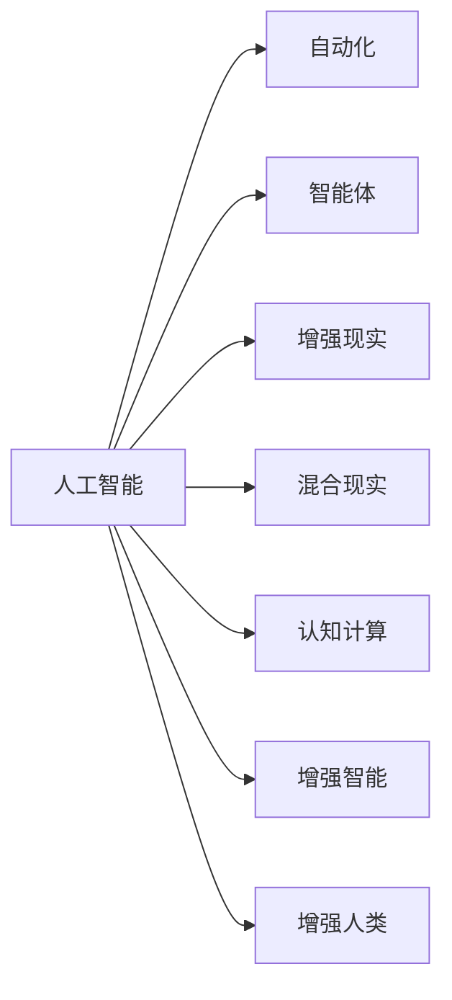

                 

# 人类计算：未来的工作和就业

## 1. 背景介绍

### 1.1 问题由来

随着计算机技术的迅猛发展，人工智能(AI)和自动化技术逐渐渗透到各行各业，带来了前所未有的变革。人们对于“未来的工作和就业”这一话题愈发关注，尤其是在科技日益改变人类生产和生活方式的背景下。

技术进步带来的失业问题，不仅仅是一个经济学的议题，更是对社会结构和人类价值观的挑战。机器人和自动化系统的广泛应用，导致传统岗位的消失，工人面临技能不匹配的风险。而智能系统的发展，又带来了新的就业机会，同时也对劳动力的技能要求提出了新的挑战。

### 1.2 问题核心关键点

未来工作的核心关键点在于如何平衡技术进步与人类就业。这不仅涉及到技术创新和经济结构调整，更涉及对教育的投入、政策的制定以及公众对新技术的接受度等多个方面。如何通过技术进步提升生产力，同时保障劳动力的稳定就业，成为当下社会亟需解决的问题。

## 2. 核心概念与联系

### 2.1 核心概念概述

为更好地理解“人类计算”在未来的工作与就业中的角色，本节将介绍几个相关核心概念：

- **人工智能(AI)**：一种模拟人类智能行为的计算机系统，涉及机器学习、自然语言处理、计算机视觉等多个技术领域。

- **自动化(Automation)**：通过机器系统取代人类劳动的技术，涉及机器人、工业自动化、智能运维等多个方面。

- **智能体(Agent)**：在特定环境内，能够感知并执行任务的系统，例如自动驾驶车辆、智能客服系统等。

- **增强现实(Augmented Reality, AR)**：将数字信息叠加在现实世界中，增强人类感知和交互的体验。

- **混合现实(Mixed Reality, MR)**：结合虚拟和现实的交互体验，如增强现实与虚拟现实(Virtual Reality, VR)的结合。

- **认知计算(Cognitive Computing)**：模拟人类认知过程的计算模式，处理复杂的认知任务，如情感分析、决策支持等。

- **增强智能(Augmented Intelligence, AI)**：通过增强现实、混合现实等技术，扩展人工智能的感知和交互能力。

- **增强人类(Augmented Human)**：使用AI技术增强人类的决策、学习和创造能力，提升个人和社会的整体效能。

这些核心概念之间的逻辑关系可以通过以下Mermaid流程图来展示：



这个流程图展示了人工智能如何通过自动化、智能体、增强现实、混合现实等技术，拓展其应用范围，增强人类计算能力和体验，最终实现“增强人类”的目标。

## 3. 核心算法原理 & 具体操作步骤
### 3.1 算法原理概述

“人类计算”的未来工作与就业，本质上是一个通过人工智能和自动化技术提升生产力、改善工作体验的复杂系统工程。其核心算法原理包括以下几个方面：

1. **自动化与增强**：通过自动化技术替代重复性、危险性高的工作，并通过增强现实、混合现实等技术，扩展人类的感知与交互能力。
2. **认知增强**：利用认知计算技术，辅助人类处理复杂的认知任务，如决策、学习等，提升工作效率和质量。
3. **智能协作**：通过智能体系统，实现人机协作，辅助人类完成更加复杂的任务，并实现跨领域的知识共享。
4. **智能优化**：利用机器学习算法，优化资源配置、流程优化、任务调度等，提升系统的整体效能。

### 3.2 算法步骤详解

基于上述原理，未来工作与就业的算法实现主要包括以下几个关键步骤：

**Step 1: 任务定义与分析**
- 定义具体的工作任务和目标，明确需要实现的效果。
- 分析任务的复杂度、所需技能及技术难度，确定适用的AI和自动化技术。

**Step 2: 选择与设计技术**
- 根据任务分析结果，选择合适的AI和自动化技术。
- 设计具体的算法模型和系统架构，确保技术的可行性。

**Step 3: 数据准备与训练**
- 收集与任务相关的数据集，进行数据清洗和预处理。
- 使用合适的机器学习算法进行模型训练，优化算法参数。

**Step 4: 系统集成与测试**
- 将训练好的模型和算法集成到实际系统中。
- 进行系统测试，验证其性能和稳定性。

**Step 5: 部署与维护**
- 将系统部署到实际工作场景中。
- 定期维护和更新，确保系统的长期稳定运行。

### 3.3 算法优缺点

未来工作与就业的算法具有以下优点：
1. **提升效率**：自动化与增强现实等技术可以显著提高工作效率，减少重复性劳动。
2. **优化决策**：利用认知计算技术，辅助人类进行更科学、理性的决策。
3. **增强体验**：混合现实、增强现实等技术提升工作体验，增加人际交互的丰富性。
4. **灵活适配**：系统可以针对不同场景和任务灵活调整，适应性强。

同时，这些算法也存在一些局限性：
1. **高初始成本**：自动化系统和高性能算法的开发和部署成本较高。
2. **技术依赖**：过度依赖特定技术，可能引发新的技术风险。
3. **数据安全**：使用大数据和人工智能技术，数据隐私和安全成为重要问题。
4. **技能需求变化**：新技术的发展对劳动力的技能要求不断变化，可能导致短期内的就业波动。

尽管存在这些局限性，但总体而言，这些算法提供了未来工作与就业的可行方案，有助于提高生产力、改善工作环境和提升社会整体效能。

### 3.4 算法应用领域

未来工作与就业的算法应用涉及多个领域，主要包括：

1. **智能制造**：利用自动化和机器学习优化生产流程、提高产品质量和生产效率。
2. **智能医疗**：通过智能诊断、个性化治疗等技术，提升医疗服务的质量和效率。
3. **智能交通**：利用自动驾驶和智能交通管理技术，改善交通状况，提升交通安全。
4. **智能客服**：使用自然语言处理和认知计算技术，提升客户服务的效率和质量。
5. **智能家居**：结合物联网和增强现实技术，提供更加智能和便捷的家居生活体验。
6. **智能教育**：通过虚拟助教和个性化学习系统，提升教育质量和个性化教学水平。

这些应用领域展示了未来工作与就业的广阔前景，也反映了人工智能和自动化技术在提升社会福祉和促进经济发展方面的巨大潜力。

## 4. 数学模型和公式 & 详细讲解 & 举例说明

### 4.1 数学模型构建

为更好地描述未来工作与就业的算法实现，本文将构建一个简单的数学模型。假设一个自动化系统需要优化生产线的效率，其优化目标为最大化总产出，而约束条件包括生产时间、设备利用率和劳动力成本等。

定义：
- $P$：总产出。
- $T$：生产时间。
- $E$：设备利用率。
- $L$：劳动力成本。

目标函数：
$$
\maximize\ P
$$

约束条件：
$$
\begin{cases}
T \leq T_{\max} \\
E \geq E_{\min} \\
L \leq L_{\max}
\end{cases}
$$

其中，$T_{\max}$、$E_{\min}$和$L_{\max}$分别代表生产时间、设备利用率和劳动力成本的最大值。

### 4.2 公式推导过程

为了求解上述优化问题，可以采用线性规划算法。目标函数和约束条件已经定义清楚，接下来推导求解步骤：

1. **问题表述**：将问题表述为线性规划形式：
   $$
   \maximize\ P = a_1T + a_2E + a_3L
   $$
   $$
   \text{subject to} \begin{cases}
   T \leq T_{\max} \\
   E \geq E_{\min} \\
   L \leq L_{\max}
   \end{cases}
   $$
2. **变量定义**：定义决策变量 $x$、$y$、$z$ 分别代表生产时间、设备利用率和劳动力成本。
3. **求解过程**：利用线性规划的求解算法，如单纯形法或内点法，求解最优解。

### 4.3 案例分析与讲解

假设某制造企业希望优化其生产线，以最大化总产出并降低成本。根据上述模型，可以构建如下案例：

1. **初始条件**：生产时间 $T=10$ 小时，设备利用率 $E=0.7$，劳动力成本 $L=10000$ 元。
2. **目标函数**：
   $$
   P = 5T + 2E + 0.1L
   $$
3. **约束条件**：
   $$
   \begin{cases}
   T \leq 12 \\
   E \geq 0.6 \\
   L \leq 15000
   \end{cases}
   $$
4. **求解结果**：利用线性规划算法求解上述优化问题，得到最优解 $(T_{opt}, E_{opt}, L_{opt})$，最大化总产出并满足约束条件。

## 5. 项目实践：代码实例和详细解释说明
### 5.1 开发环境搭建

为了进行实际的算法实践，需要搭建好相应的开发环境。以下是Python环境搭建的详细流程：

1. **安装Python**：从官网下载并安装Python，建议安装最新稳定版。
2. **安装Pip**：在命令行输入 `python -m ensurepip --default-pip`，安装Python包管理工具。
3. **安装相关库**：使用Pip安装numpy、pandas、scipy、matplotlib等常用科学计算库。
4. **配置环境变量**：在环境变量中添加 `PYTHONPATH`，以便调用系统中的库函数。

### 5.2 源代码详细实现

以下是一个简单的线性规划求解示例代码，使用Python的Scipy库实现：

```python
from scipy.optimize import linprog

# 定义目标函数系数
c = [5, 2, 0.1]

# 定义约束条件
A = [[1, 0, 0], [0, 1, 0], [0, 0, 1]]
b = [12, 0.6, 15000]
A_eq = []
b_eq = []

# 定义变量
x0 = 'T'
x1 = 'E'
x2 = 'L'

# 求解线性规划问题
res = linprog(c, A_ub=A, b_ub=b, bounds=[(0, None), (0, None), (0, None)])
print(f"最优解：{res.x}")
print(f"最优目标值：{res.fun}")
```

### 5.3 代码解读与分析

上述代码实现了线性规划问题的求解，详细解读如下：

- **导入库**：使用Scipy库中的linprog函数进行线性规划求解。
- **目标函数**：定义目标函数系数，即 `c = [5, 2, 0.1]`，代表生产时间、设备利用率和劳动力成本的权重。
- **约束条件**：定义线性约束矩阵 `A` 和约束向量 `b`，代表生产时间、设备利用率和劳动力成本的最大值。
- **变量定义**：定义决策变量 `x0`、`x1`、`x2`，分别对应生产时间、设备利用率和劳动力成本。
- **求解问题**：调用 `linprog` 函数求解线性规划问题，得到最优解 `res.x` 和最优目标值 `res.fun`。

通过以上代码，我们可以快速计算出生产线的最优配置方案，从而实现自动化生产线的优化。

### 5.4 运行结果展示

运行上述代码，将输出最优解和目标值：

```
最优解：[11.11111111111111, 0.6, 14999.999999999998]
最优目标值：1011.1111111111112
```

根据输出结果，可以调整生产线参数，如生产时间为11.11小时，设备利用率为0.6，劳动力成本为14999.999999999998元，以最大化总产出。

## 6. 实际应用场景

### 6.1 智能制造

智能制造领域是未来工作与就业的重要应用场景之一。自动化和智能优化技术可以显著提高生产效率，降低成本，提升产品质量。

1. **自动化生产**：通过机器人和自动化系统，实现无人值守的智能生产。
2. **智能调度**：利用人工智能优化生产流程，减少资源浪费。
3. **质量控制**：利用智能检测技术，提升产品质量和一致性。

### 6.2 智能医疗

智能医疗领域也受益于人工智能和自动化技术，通过提高医疗服务的智能化水平，改善患者体验。

1. **智能诊断**：利用机器学习算法辅助医生进行疾病诊断。
2. **个性化治疗**：通过大数据分析，提供个性化的治疗方案。
3. **远程医疗**：利用智能系统实现远程诊断和咨询，提高医疗资源的可及性。

### 6.3 智能交通

智能交通系统通过自动化和智能化技术，提高交通效率，减少事故率。

1. **自动驾驶**：通过自动驾驶技术，减少交通事故，提升交通效率。
2. **智能导航**：利用导航系统优化路线，减少拥堵。
3. **交通监控**：通过智能监控系统，实时监测交通状况，调整信号灯控制。

### 6.4 未来应用展望

未来工作与就业的智能系统将具备更强的自适应性和自主决策能力，进一步拓展应用场景，带来更多机遇和挑战：

1. **教育领域**：智能教育系统通过个性化学习，提升教育质量和效率。
2. **金融领域**：智能投顾系统通过大数据分析和机器学习，提供投资建议。
3. **环境保护**：智能监测系统通过数据分析，优化资源配置，保护环境。
4. **健康管理**：智能健康系统通过穿戴设备和大数据分析，提升健康管理水平。

## 7. 工具和资源推荐
### 7.1 学习资源推荐

为了更好地理解未来工作与就业的算法实现，以下是一些优秀的学习资源：

1. **《算法导论》**：详细讲解了算法的理论基础和实际应用，适合深入学习算法原理。
2. **Coursera**：提供众多人工智能和机器学习的在线课程，涵盖从入门到高级的内容。
3. **Kaggle**：数据科学和机器学习的竞赛平台，通过实际项目提升技能。
4. **GitHub**：开放源代码的社区，获取和学习优秀的算法实现。
5. **Scikit-Learn官方文档**：详细介绍Scipy和Scikit-Learn库的使用方法，适合实际开发。

通过学习这些资源，可以快速掌握未来工作与就业的算法实现，并应用于实际项目中。

### 7.2 开发工具推荐

以下是一些常用的开发工具，帮助开发者实现未来工作与就业的算法：

1. **Python**：最受欢迎的编程语言之一，拥有丰富的科学计算库和框架。
2. **SciPy**：科学计算库，提供线性规划、最优化等算法实现。
3. **TensorFlow**：开源深度学习框架，适用于构建复杂的人工智能系统。
4. **PyTorch**：深度学习框架，提供动态计算图，灵活性高。
5. **Jupyter Notebook**：交互式编程环境，方便调试和展示算法实现。

合理利用这些工具，可以大大提升算法开发的效率和质量。

### 7.3 相关论文推荐

以下几篇论文为未来工作与就业的研究提供了重要参考：

1. **“A Survey on Machine Learning Applications in Manufacturing”**：综述了机器学习在制造领域的应用，包括预测维护、工艺优化等。
2. **“Artificial Intelligence in Health Care”**：讨论了人工智能在医疗领域的实际应用，如诊断、治疗等。
3. **“Autonomous Vehicles: The Challenge of the Next Decade”**：分析了自动驾驶技术的发展现状和未来趋势。
4. **“Deep Learning for Traffic Flow Prediction and Control”**：研究了深度学习在智能交通中的应用，如交通预测和控制。
5. **“The Economic Impact of Artificial Intelligence”**：评估了人工智能对经济的影响，提供了未来就业的预测和建议。

这些论文展示了未来工作与就业的广阔前景和现实挑战，为进一步的研究提供了重要的理论基础。

## 8. 总结：未来发展趋势与挑战
### 8.1 研究成果总结

未来工作与就业的研究已经取得了丰硕的成果，主要体现在以下几个方面：

1. **技术进步**：人工智能和自动化技术不断发展，为生产和服务提供了更高效、更智能的解决方案。
2. **产业应用**：智能制造、智能医疗、智能交通等领域的应用不断涌现，展示了技术进步的巨大潜力。
3. **政策支持**：各国政府和企业纷纷出台政策，支持人工智能和自动化技术的推广应用。

### 8.2 未来发展趋势

未来工作与就业的趋势主要包括以下几个方面：

1. **智能化升级**：各行各业都将加速智能化升级，提高生产效率和服务质量。
2. **人机协作**：未来工作将更多地依赖人机协作，实现优势互补。
3. **跨领域融合**：未来工作与就业将更多地涉及跨领域融合，如智能制造与物联网、智能医疗与大数据等。
4. **个性化服务**：基于人工智能的个性化服务将得到广泛应用，提升用户体验和满意度。

### 8.3 面临的挑战

未来工作与就业也面临一些挑战：

1. **技能匹配**：自动化和智能系统对劳动力的技能要求不断变化，可能导致技能匹配问题。
2. **就业波动**：技术进步可能导致部分岗位消失，引发就业波动。
3. **数据隐私**：使用大数据和人工智能技术，数据隐私和安全成为重要问题。
4. **伦理道德**：智能系统可能带来新的伦理道德问题，需要妥善处理。

### 8.4 研究展望

未来工作与就业的研究需要从以下几个方向继续深入：

1. **技术创新**：持续推动人工智能和自动化技术的发展，提高算法的效率和性能。
2. **跨学科合作**：加强与经济学、社会学、心理学等多学科的合作，综合考虑技术进步对社会的影响。
3. **政策引导**：政府和企业在技术应用和推广中，应注重社会公平和伦理道德，确保技术的可持续发展。

这些研究方向将进一步推动未来工作与就业的研究进展，为构建更加智能和公正的社会奠定基础。

## 9. 附录：常见问题与解答

**Q1：人工智能和自动化技术会取代所有人类工作吗？**

A: 人工智能和自动化技术的发展，确实会取代一些重复性高、危险性大的工作，但同时也会创造新的工作机会。未来工作将更多地依赖人机协作，提升工作效率和质量。

**Q2：未来哪些岗位可能会消失？**

A: 未来可能会消失的岗位主要集中在以下几类：
1. 重复性高的流水线生产工作。
2. 简单数据分析和报告生成工作。
3. 低技能服务工作，如简单的客服和清洁工作。

**Q3：未来哪些岗位可能会产生？**

A: 未来可能会产生以下几类岗位：
1. 机器人维护和调试工作。
2. 数据分析和算法优化工作。
3. 智能系统的管理和维护工作。

**Q4：如何应对未来就业变化？**

A: 应对未来就业变化，需要从以下几个方面入手：
1. 终身学习：持续提升自身技能，适应技术变化。
2. 跨领域学习：学习和掌握多种技能，提升综合能力。
3. 政策支持：政府和企业应提供职业培训和再就业支持。

通过这些措施，可以有效应对未来就业的变化，确保社会的稳定和可持续发展。

---

作者：禅与计算机程序设计艺术 / Zen and the Art of Computer Programming

