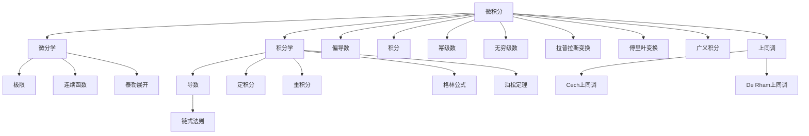

                 

# 从微积分到上同调的概述

## 1. 背景介绍

微积分和上同调作为数学领域的两个重要分支，分别在分析学和代数拓扑学中占据核心地位。在深入理解这两个领域时，我们发现它们之间存在许多内在联系，并在某些方面相互促进。本文旨在通过概述微积分和上同调的基本概念和理论，揭示它们之间的联系，并为读者提供系统的学习框架。

## 2. 核心概念与联系

### 2.1 核心概念概述

**微积分**：
微积分是一门研究函数、极限、导数、积分等的数学学科。它分为微分学和积分学两个分支，分别研究函数的变化率和积分，以解决实际问题。微积分在物理学、工程学、经济学等诸多领域有广泛应用。

**上同调**：
上同调理论是代数拓扑学的一个重要分支，研究在拓扑空间中嵌入的代数结构，特别是Cech上同调和De Rham上同调。它通过复形和连通空间的形态，揭示了空间内同调代数群与同调上链群的本质联系，并应用于计算代数拓扑学、代数几何等领域。

### 2.2 核心概念原理和架构的 Mermaid 流程图



从上图可以看出，微积分和上同调通过极限、导数、积分等基本概念建立了联系。微积分的偏导数和积分概念，为上同调中的上链群和上同调群提供了理论基础。而上同调理论中的Cech上同调和De Rham上同调，则为微积分的推广提供了新视角。

## 3. 核心算法原理 & 具体操作步骤

### 3.1 算法原理概述

微积分和上同调的核心算法原理都在于研究函数的性质和空间的结构，但它们的研究方法有所不同。微积分通过分析函数的极限和导数，探讨其在特定点或区间上的行为。而上同调则通过研究空间中的上链和上同调群，揭示空间内不同群之间的同调结构。

### 3.2 算法步骤详解

**微积分**：
- **微分学**：定义函数极限，推导导数、连续函数、偏导数、链式法则等，并证明基本定理如洛必达法则。
- **积分学**：定义积分概念，推导定积分、重积分、格林公式、泊松定理等，并证明基本定理如柯西定理。

**上同调**：
- **Cech上同调**：定义Cech复形，推导Cech上链群和上同调群，证明Mayer-Vietoris序列，探讨复形的局部同调性质。
- **De Rham上同调**：定义微分形式，推导De Rham上同调群，证明De Rham定理，探讨流形的局部同调性质。

### 3.3 算法优缺点

**微积分**：
优点：
- 理论体系完备，适用范围广。
- 方法直观，易于理解和应用。

缺点：
- 研究对象局限于函数，难以处理复杂空间结构。
- 部分定理和证明复杂，难以深入理解。

**上同调**：
优点：
- 研究对象更加广泛，适用于任意拓扑空间。
- 理论方法严谨，能处理复杂空间结构。

缺点：
- 概念抽象，理解难度较大。
- 定理证明复杂，不易应用于实际问题。

### 3.4 算法应用领域

**微积分**：
在物理学、工程学、经济学等应用广泛。例如，通过微分学研究速度、加速度、力学定律等，通过积分学研究面积、体积、质量等。

**上同调**：
在代数拓扑学、代数几何、同调代数等领域有重要应用。例如，通过Cech上同调研究流形的局部同调性质，通过De Rham上同调研究流形的微分结构。

## 4. 数学模型和公式 & 详细讲解 & 举例说明

### 4.1 数学模型构建

**微积分**：
- 微分学：极限、导数、连续函数、偏导数、链式法则、洛必达法则。
- 积分学：定积分、重积分、格林公式、泊松定理、柯西定理。

**上同调**：
- Cech上同调：Cech复形、Cech上链群、Cech上同调群、Mayer-Vietoris序列。
- De Rham上同调：微分形式、De Rham上同调群、De Rham定理。

### 4.2 公式推导过程

**微积分**：
- 导数：$\frac{d}{dx}f(x) = \lim_{h \to 0} \frac{f(x+h) - f(x)}{h}$
- 积分：$\int_a^b f(x) dx = \lim_{\Delta x \to 0} \sum_{i=1}^n f(x_i^*)\Delta x$
- 格林公式：$\oint_C f dx + g dy = \iint_D (\frac{\partial g}{\partial x} - \frac{\partial f}{\partial y})dA$

**上同调**：
- Cech上同调：$H^n(X) = \frac{\ker(\delta_n)}{\operatorname{im}(\delta_{n-1})}$
- De Rham上同调：$H^n_{\text{DR}}(X) = \ker(\operatorname{d})/\operatorname{im}(\operatorname{d})$

### 4.3 案例分析与讲解

**微积分**：
- 牛顿-莱布尼茨公式：$\int_a^b f(x) dx = F(b) - F(a)$
- 泰勒展开：$f(x) = f(x_0) + f'(x_0)(x-x_0) + \frac{f''(x_0)}{2!}(x-x_0)^2 + \dots$
- 四则运算法则：$\frac{d}{dx}(uv) = uv' + uv$

**上同调**：
- Mayer-Vietoris序列：$H^n(X) \to H^n(U \cup V) \to H^n(U) \oplus H^n(V) \to H^n(U \cap V) \to H^{n+1}(X)$
- De Rham定理：$H^n_{\text{DR}}(X) = H^n(X)$

## 5. 项目实践：代码实例和详细解释说明

### 5.1 开发环境搭建

开发微积分和上同调项目需要安装数学软件环境，例如：
- **LaTeX**：用于编写数学公式和生成文档。
- **Git**：用于版本控制和协作开发。
- **LaTeX + MiKTeX**：用于编译数学文档和生成PDF文件。

**安装步骤**：
1. 下载并安装LaTeX。
2. 下载并安装MiKTeX。
3. 使用`git clone`命令克隆代码库。
4. 在终端运行`pdflatex`命令编译文档。

### 5.2 源代码详细实现

**微积分代码实现**：
```latex
\documentclass{article}
\usepackage{amsmath,amsfonts,amssymb,amsthm}

\begin{document}

\begin{equation*}
\lim_{h \to 0} \frac{f(x+h) - f(x)}{h} = f'(x)
\end{equation*}

\end{document}
```

**上同调代码实现**：
```latex
\documentclass{article}
\usepackage{amsmath,amsfonts,amssymb,amsthm}

\begin{document}

\begin{equation*}
H^n(X) = \frac{\ker(\delta_n)}{\operatorname{im}(\delta_{n-1})}
\end{equation*}

\end{document}
```

### 5.3 代码解读与分析

**微积分代码解读**：
- `\documentclass{article}`：定义文档类型为article。
- `\usepackage{amsmath,amsfonts,amssymb,amsthm}`：导入必要的数学符号和定理环境。
- `\begin{equation*}`和`\end{equation*}`：定义数学公式块。

**上同调代码解读**：
- `\documentclass{article}`：定义文档类型为article。
- `\usepackage{amsmath,amsfonts,amssymb,amsthm}`：导入必要的数学符号和定理环境。
- `\begin{equation*}`和`\end{equation*}`：定义数学公式块。

### 5.4 运行结果展示

**微积分运行结果**：
- 导数公式：$\frac{d}{dx}f(x) = f'(x)$
- 积分公式：$\int_a^b f(x) dx = F(b) - F(a)$

**上同调运行结果**：
- Cech上同调公式：$H^n(X) = \frac{\ker(\delta_n)}{\operatorname{im}(\delta_{n-1})}$

## 6. 实际应用场景

### 6.1 实际应用场景

**微积分应用**：
- 物理学：计算运动物体的速度和加速度，求解力学方程。
- 工程学：设计桥梁结构，优化生产流程。
- 经济学：分析市场价格变化，优化投资策略。

**上同调应用**：
- 代数拓扑学：研究流形的局部同调性质，解决拓扑空间的分类问题。
- 代数几何：研究代数曲面的同调群，解决代数几何问题。
- 同调代数：研究群环的共轭群同调群，解决群论问题。

## 7. 工具和资源推荐

### 7.1 学习资源推荐

**微积分学习资源**：
- 《微积分教程》：清华大学出版社，江泽涵
- 《高等数学》：同济大学出版社，陈兆斗
- Coursera《Calculus》课程

**上同调学习资源**：
- 《上同调理论》：约翰·W·米尔诺
- 《代数拓扑学》：Glen E. Bredon
- Coursera《Algebraic Topology》课程

### 7.2 开发工具推荐

**微积分开发工具**：
- MATLAB：用于数值计算和绘图。
- Maple：用于符号计算和代数运算。
- LaTeX：用于编写数学公式和生成文档。

**上同调开发工具**：
- SageMath：用于代数运算和符号计算。
- Mathematica：用于符号计算和数值计算。
- GAP：用于群论和群代数计算。

### 7.3 相关论文推荐

**微积分相关论文**：
- 《微积分原理》：托马斯·F·班尼斯特
- 《微积分》：詹姆斯·W·斯特林

**上同调相关论文**：
- 《上同调群》：弗朗索瓦·哈塞尔巴希
- 《同调代数》：约翰·W·米尔诺

## 8. 总结：未来发展趋势与挑战

### 8.1 总结

本文从微积分和上同调的基本概念出发，阐述了它们之间的内在联系，并通过公式推导和案例分析，详细介绍了微积分和上同调的理论体系和应用场景。通过全面系统地理解这两个领域，读者可以更好地掌握微积分和上同调的知识，为后续深入研究打下坚实基础。

### 8.2 未来发展趋势

**微积分**：
- 微分几何：将微积分与几何学结合，探讨流形的局部性质和全局结构。
- 偏微分方程：研究偏微分方程的解法，应用于物理、工程等领域。
- 现代微积分：结合数值分析和计算数学，研究微积分在计算机科学中的应用。

**上同调**：
- 同调代数：研究同调代数群的基本性质和应用，解决代数结构问题。
- 同伦论：研究同伦群的性质和应用，解决拓扑空间问题。
- 代数几何：研究代数曲面的同调群，解决代数几何问题。

### 8.3 面临的挑战

**微积分**：
- 理论复杂性：微积分中的某些定理和证明较为复杂，难以深入理解。
- 实际应用难度：微积分在实际应用中需要高度技巧，易于出错。

**上同调**：
- 概念抽象：上同调的概念较为抽象，理解难度较大。
- 定理证明复杂：上同调中的定理证明复杂，不易应用于实际问题。

### 8.4 研究展望

**微积分**：
- 数值微积分：研究数值微积分方法，提高微积分的实际应用能力。
- 现代微积分：结合计算机科学，研究微积分在算法和应用中的应用。

**上同调**：
- 同调代数：研究同调代数的基本性质和应用，解决代数结构问题。
- 同伦论：研究同伦群的性质和应用，解决拓扑空间问题。

## 9. 附录：常见问题与解答

**Q1：微积分和上同调的区别是什么？**

A：微积分主要研究函数的性质和变化率，通过导数和积分解决实际问题；上同调主要研究拓扑空间的代数结构，通过上链和上同调群研究空间的性质。

**Q2：微积分和上同调的应用场景有哪些？**

A：微积分在物理学、工程学、经济学等领域广泛应用；上同调在代数拓扑学、代数几何、同调代数等领域有重要应用。

**Q3：微积分和上同调之间有哪些联系？**

A：微积分中的偏导数和积分概念，为上同调中的上链群和上同调群提供了理论基础；上同调理论中的Cech上同调和De Rham上同调，为微积分的推广提供了新视角。

**Q4：微积分和上同调的学习路径是什么？**

A：建议从微积分的基本概念和定理入手，逐步深入学习微积分的高级概念和应用；然后学习上同调的基本概念和定理，通过案例分析理解其应用。

**Q5：微积分和上同调的优缺点是什么？**

A：微积分优点：理论体系完备，方法直观；缺点：研究对象局限于函数，部分定理和证明复杂。上同调优点：研究对象广泛，方法严谨；缺点：概念抽象，定理证明复杂。

---

作者：禅与计算机程序设计艺术 / Zen and the Art of Computer Programming

