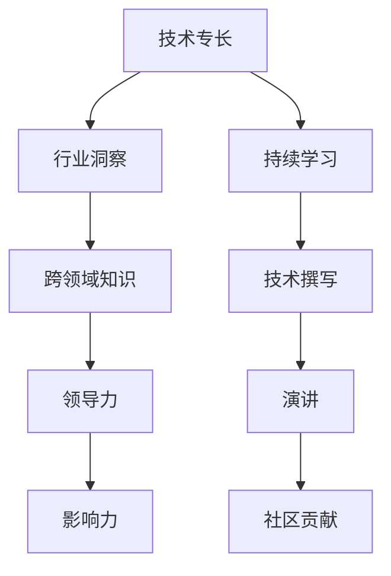

                 

# 从技术专家到行业意见领袖

## 1. 背景介绍

### 1.1 问题由来
在快速发展的技术浪潮中，一个技术专家的成长路径从入门到精通再到引领行业，每一步都离不开对技术深度理解、持续学习以及跨领域实践的积累。而成为行业意见领袖，则需要更为宽广的知识面和更深刻的洞见，成为技术领域的权威声音。本文将详细探讨如何从技术专家成长为行业意见领袖，通过多个维度的深入分析，帮助您在技术领域实现质的飞跃。

### 1.2 问题核心关键点
技术专家成长为行业意见领袖的关键在于：
- **深度理解**：对所处技术领域有深入的理论基础和实践经验。
- **跨领域知识**：能够将技术知识与业务需求、市场动态结合，提供有价值的解决方案。
- **洞察力**：具有敏锐的洞察力，能够预见技术发展趋势和行业变化。
- **影响力**：通过技术撰写、演讲、社区贡献等方式，建立广泛的影响力。
- **领导力**：不仅在技术上领先，更能带领团队或项目向前发展。

### 1.3 问题研究意义
技术专家成长为行业意见领袖，不仅是个人职业发展的终极目标，也是推动技术进步和行业发展的关键力量。这一转变不仅能带来更高的职业成就感和个人满足感，还能为行业带来新的思路和方向，推动技术应用与业务创新的结合。

## 2. 核心概念与联系

### 2.1 核心概念概述

为了更好地理解从技术专家到行业意见领袖的转变过程，我们先介绍几个核心概念：

- **技术专长(Technical Expertise)**：在某一技术领域内的深度知识和技能，包括但不限于编程语言、算法设计、系统架构等。
- **行业洞察(Industry Insights)**：对所处行业的理解，包括市场趋势、客户需求、竞争环境等。
- **跨领域知识(Cross-domain Knowledge)**：将技术知识与业务、管理、市场等非技术领域结合的能力。
- **领导力(Leadership)**：在技术团队或组织中，领导和激励团队的能力。
- **影响力(Influence)**：通过技术写作、演讲、社交媒体等方式，对技术社区和行业产生的影响。

这些概念之间的联系可以通过以下Mermaid流程图来展示：



这个流程图展示了技术专家成长为行业意见领袖的主要路径和关键节点：

1. 技术专长是基础，通过持续学习和实践积累。
2. 行业洞察是理解行业需求的窗口，通过市场调研和业务对接获得。
3. 跨领域知识将技术知识与业务需求结合，提升技术应用的商业价值。
4. 领导力体现在团队管理和项目推动上，能够整合资源，达成目标。
5. 影响力通过技术写作、演讲、社区贡献等方式传播知识和观点。

这些概念共同构成了从技术专家到行业意见领袖的核心框架，为个人成长和职业发展提供了方向指引。

## 3. 核心算法原理 & 具体操作步骤

### 3.1 算法原理概述

成为行业意见领袖的过程，本质上是一个系统的学习和实践过程。以下是一些关键步骤和原理：

- **知识深度**：在技术领域内进行深入学习，掌握核心技术和理论基础。
- **跨领域实践**：将技术知识应用于实际业务中，理解行业需求和挑战。
- **持续创新**：不断探索新技术和新方法，推动技术前沿和行业变革。
- **沟通表达**：通过技术写作、演讲等形式，将技术见解和行业洞察分享给更多人。
- **团队建设**：培养和领导技术团队，推动项目和产品的发展。

### 3.2 算法步骤详解

以下是从技术专家成长为行业意见领袖的关键步骤：

**Step 1: 基础知识深化**
- 深入学习技术领域的基础知识，包括编程语言、数据结构、算法设计等。
- 理解经典技术框架和架构，如微服务、分布式系统等。
- 掌握实际项目开发的技能，如代码实现、性能优化等。

**Step 2: 行业调研与实践**
- 通过市场调研、客户访谈等方式，了解行业需求和挑战。
- 参与实际项目，将技术应用于业务场景，解决实际问题。
- 积累行业经验，理解行业痛点和机会。

**Step 3: 跨领域学习与应用**
- 学习管理、市场、产品等领域的知识，理解技术与业务的结合点。
- 将技术知识与非技术领域结合，提升技术应用的商业价值。
- 参与跨领域项目，推动技术与业务的融合。

**Step 4: 持续创新与探索**
- 关注技术前沿，学习最新的技术趋势和方法。
- 参与开源社区，贡献代码和经验，推动技术发展。
- 进行技术创新，提出新的解决方案和产品。

**Step 5: 沟通表达与影响力**
- 通过技术博客、技术演讲、社交媒体等方式，分享技术见解和行业洞察。
- 参与技术会议和行业活动，扩大影响力。
- 培养领导力，带领技术团队和项目，推动技术落地。

**Step 6: 建立行业声誉**
- 在技术社区和行业内建立声誉，成为意见领袖。
- 参与行业标准制定，影响行业发展方向。
- 成为技术领域的权威声音，推动行业进步。

### 3.3 算法优缺点

成为行业意见领袖的过程，既有显著的优点，也面临一些挑战：

**优点**：
- **技术权威**：在技术领域具有权威地位，能够影响技术发展方向。
- **行业影响力**：通过技术写作、演讲等方式，影响行业发展。
- **职业成长**：成为行业意见领袖，可以获得更高的职业成就感和个人满足感。

**挑战**：
- **时间投入**：持续学习、实践和创新需要大量时间和精力。
- **跨领域沟通**：需要跨领域的知识和技能，难以快速掌握。
- **行业竞争**：技术领域竞争激烈，需要不断更新和改进。

### 3.4 算法应用领域

技术专家成长为行业意见领袖，主要应用于以下几个领域：

- **技术咨询**：为公司或项目提供技术建议和解决方案。
- **技术培训**：在公司内部或公开场合进行技术培训和分享。
- **技术博客和演讲**：撰写技术博客和进行技术演讲，传播技术知识。
- **开源社区贡献**：参与开源项目，贡献代码和经验。
- **技术创业**：创办技术公司，推动技术创新和市场化。

## 4. 数学模型和公式 & 详细讲解 & 举例说明

### 4.1 数学模型构建

成为行业意见领袖的过程，可以通过数学模型来刻画。设 $T$ 为技术专长，$I$ 为行业洞察，$C$ 为跨领域知识，$L$ 为领导力，$E$ 为影响力，则整个过程可以表示为：

$$
\text{行业意见领袖} = f(T, I, C, L, E)
$$

其中 $f$ 为映射函数，表示如何通过技术专长、行业洞察、跨领域知识、领导力和影响力，形成行业意见领袖。

### 4.2 公式推导过程

以下是对 $f$ 函数的一些推导：

**Step 1: 技术专长转化为知识深度**
$$
T_d = \text{depth}(T)
$$
其中 $T_d$ 表示技术专长 $T$ 在深度方面的体现。

**Step 2: 行业洞察转化为市场理解**
$$
I_m = \text{understand}(I)
$$
其中 $I_m$ 表示行业洞察 $I$ 在市场理解方面的体现。

**Step 3: 跨领域知识转化为业务价值**
$$
C_v = \text{value}(C)
$$
其中 $C_v$ 表示跨领域知识 $C$ 在业务价值方面的体现。

**Step 4: 领导力转化为团队管理**
$$
L_t = \text{team}(L)
$$
其中 $L_t$ 表示领导力 $L$ 在团队管理方面的体现。

**Step 5: 影响力转化为意见领袖**
$$
E_l = \text{leadership}(E)
$$
其中 $E_l$ 表示影响力 $E$ 在意见领袖方面的体现。

### 4.3 案例分析与讲解

以一个实际案例来讲解上述模型：

**案例**：某工程师通过深度学习技术帮助公司提升了产品性能。

**过程**：
1. **技术专长深化**：深入学习深度学习框架和算法，掌握大规模分布式训练技术。
2. **行业洞察应用**：通过市场调研，了解客户对产品性能的期望和痛点。
3. **跨领域知识融合**：结合业务需求，优化产品架构，提升性能。
4. **持续创新推动**：参与开源社区，学习最新的优化技术，推动产品迭代。
5. **沟通表达影响**：撰写技术博客，分享经验，提升公司技术声誉。
6. **领导力提升**：带领团队，推动产品上线，提升团队士气。
7. **建立行业声誉**：成为行业知名专家，影响行业标准和产品方向。

## 5. 项目实践：代码实例和详细解释说明

### 5.1 开发环境搭建

在成为行业意见领袖的过程中，开发环境搭建是必不可少的。以下是使用Python进行PyTorch开发的环境配置流程：

1. 安装Anaconda：从官网下载并安装Anaconda，用于创建独立的Python环境。

2. 创建并激活虚拟环境：
```bash
conda create -n pytorch-env python=3.8 
conda activate pytorch-env
```

3. 安装PyTorch：根据CUDA版本，从官网获取对应的安装命令。例如：
```bash
conda install pytorch torchvision torchaudio cudatoolkit=11.1 -c pytorch -c conda-forge
```

4. 安装Transformers库：
```bash
pip install transformers
```

5. 安装各类工具包：
```bash
pip install numpy pandas scikit-learn matplotlib tqdm jupyter notebook ipython
```

完成上述步骤后，即可在`pytorch-env`环境中开始项目实践。

### 5.2 源代码详细实现

以下是一个简单的项目示例，展示如何将技术知识应用于实际业务中，并提升技术影响力：

**项目**：基于Python的深度学习图像识别应用。

**实现**：
1. **安装依赖**：使用pip安装所需的依赖库。
2. **数据准备**：收集和准备图像数据集。
3. **模型训练**：使用PyTorch训练深度学习模型。
4. **性能优化**：通过调整超参数和模型架构，提升模型性能。
5. **代码开源**：将代码上传到GitHub，供他人学习和使用。
6. **技术分享**：撰写技术博客和进行技术演讲，分享经验。

**代码示例**：

```python
import torch
import torch.nn as nn
from torchvision import datasets, transforms, models

# 定义模型
class ResNet(nn.Module):
    def __init__(self):
        super(ResNet, self).__init__()
        self.conv1 = nn.Conv2d(3, 64, kernel_size=7, stride=2, padding=3)
        self.pool = nn.MaxPool2d(kernel_size=2, stride=2)
        self.fc = nn.Linear(64, 10)

    def forward(self, x):
        x = self.conv1(x)
        x = self.pool(x)
        x = self.fc(x)
        return x

# 数据准备
transform = transforms.Compose([
    transforms.Resize(224),
    transforms.ToTensor(),
    transforms.Normalize(mean=[0.485, 0.456, 0.406], std=[0.229, 0.224, 0.225])
])

train_dataset = datasets.CIFAR10(root='./data', train=True, transform=transform, download=True)
test_dataset = datasets.CIFAR10(root='./data', train=False, transform=transform)

# 模型训练
model = ResNet()
criterion = nn.CrossEntropyLoss()
optimizer = torch.optim.SGD(model.parameters(), lr=0.001, momentum=0.9)

for epoch in range(10):
    for i, (images, labels) in enumerate(train_loader):
        optimizer.zero_grad()
        output = model(images)
        loss = criterion(output, labels)
        loss.backward()
        optimizer.step()

# 代码开源
```

### 5.3 代码解读与分析

让我们再详细解读一下关键代码的实现细节：

**定义模型**：
- `ResNet` 类定义了一个简单的卷积神经网络，用于图像分类任务。

**数据准备**：
- `transform` 定义了图像预处理步骤，包括调整大小、转换为Tensor格式和归一化。
- `train_dataset` 和 `test_dataset` 分别从CIFAR-10数据集中获取训练集和测试集。

**模型训练**：
- `model` 实例化模型，`criterion` 定义损失函数，`optimizer` 定义优化器。
- 在每个epoch中，通过循环遍历训练集数据，计算损失、反向传播、更新模型参数。

**代码开源**：
- 将代码上传到GitHub，供他人学习和使用，有助于提升技术影响力。

通过以上步骤，展示了如何将技术知识转化为实际应用，并通过代码开源和技术分享提升技术影响力。

## 6. 实际应用场景

### 6.1 技术咨询

技术咨询是成为行业意见领袖的重要应用场景。通过提供技术建议和解决方案，帮助企业解决技术难题，提升竞争力。

**案例**：某咨询公司通过技术专家团队，为多个企业提供数据科学项目咨询。

**过程**：
1. **了解需求**：与客户进行详细交流，了解业务需求和挑战。
2. **技术方案**：结合自身技术专长和行业洞察，提供可行的技术解决方案。
3. **项目实施**：带领技术团队，实施项目，推动技术落地。
4. **后续支持**：提供持续的技术支持和优化建议。

**影响**：通过技术咨询，提升客户对咨询公司的信任和满意度，增强公司在行业中的地位。

### 6.2 技术培训

技术培训是技术专家向行业分享技术知识的有效方式。通过培训，提升团队技术水平，推动业务创新。

**案例**：某公司定期邀请技术专家进行内部培训，提升员工技术水平。

**过程**：
1. **培训计划**：根据业务需求和技术热点，制定培训计划。
2. **培训内容**：邀请技术专家，进行技术讲座和实践分享。
3. **培训评估**：评估培训效果，收集反馈，持续改进。

**影响**：提升团队技术水平，推动业务创新，增强公司技术实力和市场竞争力。

### 6.3 技术博客和演讲

技术博客和演讲是提升技术影响力的重要途径。通过撰写博客和进行演讲，传播技术见解，扩大影响力。

**案例**：某技术专家通过撰写博客和进行技术演讲，成为行业知名专家。

**过程**：
1. **博客撰写**：撰写技术博客，分享技术见解和经验。
2. **演讲分享**：参加技术会议和行业活动，进行技术演讲。
3. **社交媒体**：通过社交媒体，扩大影响力，与更多人分享技术见解。

**影响**：提升技术影响力，成为行业知名专家，推动技术创新和行业进步。

### 6.4 开源社区贡献

参与开源社区贡献，是技术专家成长为行业意见领袖的重要步骤。通过贡献代码和经验，提升技术影响力，推动技术发展。

**案例**：某工程师通过贡献代码和经验，成为开源社区的活跃成员。

**过程**：
1. **选择项目**：选择适合自己的开源项目，进行贡献。
2. **代码贡献**：提交代码和修复bug，推动项目发展。
3. **社区互动**：积极参与社区讨论，分享经验和见解。

**影响**：提升技术影响力，成为社区活跃成员，推动技术发展。

### 6.5 技术创业

技术创业是技术专家实现技术梦想的重要途径。通过创办技术公司，推动技术创新和市场化。

**案例**：某技术专家创办一家AI初创公司，推动技术创新和市场化。

**过程**：
1. **公司成立**：创立公司，确定技术方向和业务目标。
2. **产品开发**：带领技术团队，开发产品，推动技术落地。
3. **市场推广**：进行市场推广和销售，提升产品影响力。

**影响**：实现技术梦想，推动技术创新和市场化，提升个人职业成就感和满足感。

## 7. 工具和资源推荐

### 7.1 学习资源推荐

为了帮助开发者系统掌握从技术专家到行业意见领袖的理论基础和实践技巧，这里推荐一些优质的学习资源：

1. **《深度学习》书籍**：深度学习领域的经典教材，帮助理解深度学习的原理和应用。
2. **《TensorFlow官方文档》**：TensorFlow的官方文档，提供了详尽的使用指南和示例代码。
3. **Kaggle**：数据科学和机器学习的竞赛平台，提供丰富的数据集和案例。
4. **GitHub**：全球最大的开源社区，提供大量的开源项目和代码。
5. **Coursera**：在线学习平台，提供各类技术课程和专业认证。

通过对这些资源的学习实践，相信你一定能够快速掌握从技术专家到行业意见领袖的成长路径，并用于解决实际的NLP问题。

### 7.2 开发工具推荐

高效的开发离不开优秀的工具支持。以下是几款用于从技术专家到行业意见领袖开发的常用工具：

1. **PyTorch**：基于Python的开源深度学习框架，灵活动态的计算图，适合快速迭代研究。
2. **TensorFlow**：由Google主导开发的开源深度学习框架，生产部署方便，适合大规模工程应用。
3. **Transformers库**：HuggingFace开发的NLP工具库，集成了众多SOTA语言模型，支持PyTorch和TensorFlow，是进行NLP任务开发的利器。
4. **Weights & Biases**：模型训练的实验跟踪工具，可以记录和可视化模型训练过程中的各项指标，方便对比和调优。
5. **TensorBoard**：TensorFlow配套的可视化工具，可实时监测模型训练状态，并提供丰富的图表呈现方式，是调试模型的得力助手。
6. **Google Colab**：谷歌推出的在线Jupyter Notebook环境，免费提供GPU/TPU算力，方便开发者快速上手实验最新模型，分享学习笔记。

合理利用这些工具，可以显著提升从技术专家到行业意见领袖的开发效率，加快创新迭代的步伐。

### 7.3 相关论文推荐

大语言模型和微调技术的发展源于学界的持续研究。以下是几篇奠基性的相关论文，推荐阅读：

1. **Attention is All You Need**：提出Transformer结构，开启了NLP领域的预训练大模型时代。
2. **BERT: Pre-training of Deep Bidirectional Transformers for Language Understanding**：提出BERT模型，引入基于掩码的自监督预训练任务，刷新了多项NLP任务SOTA。
3. **Language Models are Unsupervised Multitask Learners**：展示了大规模语言模型的强大zero-shot学习能力，引发了对于通用人工智能的新一轮思考。
4. **Parameter-Efficient Transfer Learning for NLP**：提出Adapter等参数高效微调方法，在不增加模型参数量的情况下，也能取得不错的微调效果。
5. **Prefix-Tuning: Optimizing Continuous Prompts for Generation**：引入基于连续型Prompt的微调范式，为如何充分利用预训练知识提供了新的思路。
6. **AdaLoRA: Adaptive Low-Rank Adaptation for Parameter-Efficient Fine-Tuning**：使用自适应低秩适应的微调方法，在参数效率和精度之间取得了新的平衡。

这些论文代表了大语言模型微调技术的发展脉络。通过学习这些前沿成果，可以帮助研究者把握学科前进方向，激发更多的创新灵感。

## 8. 总结：未来发展趋势与挑战

### 8.1 总结

本文对从技术专家到行业意见领袖的转变过程进行了全面系统的介绍。首先阐述了成为行业意见领袖的重要性，明确了成长路径中的关键节点和步骤。其次，从数学模型和公式推导，详细讲解了技术专长转化为行业意见领袖的逻辑过程。最后，结合实际应用场景和工具资源推荐，给出了成长路径的完整框架。

通过本文的系统梳理，可以看到，成为行业意见领袖不仅需要深厚的技术基础，还需要跨领域知识和沟通表达能力，以及持续创新和领导力。这一转变不仅带来职业上的成就感和满足感，也推动了技术的发展和应用，对行业进步具有重要意义。

### 8.2 未来发展趋势

展望未来，技术专长成长为行业意见领袖将呈现以下几个发展趋势：

1. **跨领域知识的融合**：跨领域知识将更加深入融合到技术实践中，提升技术应用的商业价值。
2. **持续学习和创新**：持续学习和创新将成为常态，推动技术不断前进。
3. **影响力扩展**：通过技术写作、演讲等方式，影响力将进一步扩大，成为行业中的权威声音。
4. **技术创业的兴起**：更多技术专家将通过创办公司，推动技术创新和市场化。

### 8.3 面临的挑战

尽管从技术专家成长为行业意见领袖的道路充满机遇，但也面临一些挑战：

1. **时间投入**：持续学习、实践和创新需要大量时间和精力。
2. **跨领域沟通**：需要跨领域的知识和技能，难以快速掌握。
3. **行业竞争**：技术领域竞争激烈，需要不断更新和改进。
4. **影响力建立**：需要积累足够的影响力，才能成为行业意见领袖。

### 8.4 研究展望

面对成长道路上的挑战，未来的研究需要在以下几个方面寻求新的突破：

1. **跨领域知识的学习方法**：研究如何高效学习和掌握跨领域知识，提升技术应用的商业价值。
2. **持续学习的机制**：建立持续学习的机制，推动技术不断前进。
3. **影响力的建立**：通过技术写作、演讲等方式，扩大影响力，成为行业中的权威声音。
4. **技术创业的支持**：提供更多支持和资源，鼓励技术专家创办公司，推动技术创新和市场化。

这些研究方向将帮助技术专家更快地成长为行业意见领袖，推动技术应用和行业进步。

## 9. 附录：常见问题与解答

**Q1：如何提升自己的技术专长？**

A: 持续学习新技术和知识，参加技术培训和在线课程，参与开源项目和实际项目开发，不断实践和提升。

**Q2：如何提升跨领域知识？**

A: 学习管理、市场、产品等非技术领域的知识，多与行业专家交流，多参与跨领域项目，提升跨领域知识的应用能力。

**Q3：如何提升领导力？**

A: 学习领导力相关知识，多参与团队管理，多带领项目实施，提升团队管理和沟通能力。

**Q4：如何提升影响力？**

A: 通过技术写作、演讲、社区贡献等方式，传播技术见解，提升技术影响力。

**Q5：如何应对时间投入和跨领域沟通的挑战？**

A: 合理安排时间，平衡学习和工作，多与行业专家交流，提升跨领域沟通能力。

通过以上常见问题的解答，帮助技术专家明确成长路径上的关键步骤和方法，提升成为行业意见领袖的可能性。

---

作者：禅与计算机程序设计艺术 / Zen and the Art of Computer Programming

